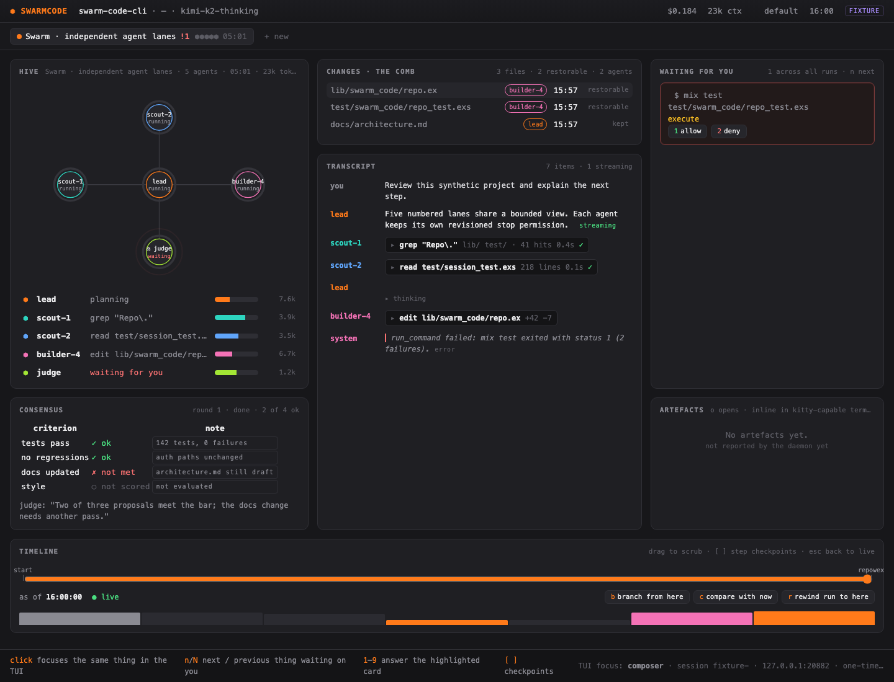

# SwarmCode CLI

This repository contains a runnable terminal client connected to real
OpenAI-compatible/Anthropic providers, six coding tools, approvals, run controls,
and a local Unix-socket service. The saved development launcher uses guarded
canonical storage and resumes conversations across restart. Terminal feature forms
cover workflows, scheduled tasks, settings, and deep research. Advanced-mode
acceptance coverage is still being expanded; the packaged release launcher is
available for the verified TUI path.
The live launcher uses in-memory history. Deterministic demos and a passive
preview gallery are also available.

The saved session uses the providers and models of the SwarmCode database, exactly
like the desktop app: the conversation's own choice, then the default in Settings.
Environment variables never add provider rows or change a conversation's model.
Only when the database has no usable provider at all does the first launch create
one from `SWARM_MODEL`, `SWARM_BASE_URL` and `SWARM_API_KEY`, and it says so. Start
a saved development session from this checkout (the development launchers load
`~/.secrets` automatically when no provider key is exported):

```sh
scripts/dev/check_terminal_port.sh
export SWARM_PROJECT_ROOT=/absolute/path/to/your/project
export SWARM_MODEL=your-model-id
export SWARM_BASE_URL=https://api.openai.com/v1
# OPENAI_API_KEY supplies authentication by default.
scripts/dev/run_saved_session.sh
```

You may keep the same exports in `~/.secrets`; the launcher preserves values
already exported for `SWARM_*`, `OPENAI_*`, and `ANTHROPIC_*` in the calling shell,
and loads only those three families from the file (never its other secrets).
The saved, live, and plain development launchers share this behavior. Set
`SWARM_ENV_FILE=/path/to/provider.env` to use another shell environment file.
An exported provider key, including an explicitly empty key for local servers,
skips automatic loading.

To start an unsaved development session using the same provider settings:

```sh
export SWARM_PROJECT_ROOT=/absolute/path/to/your/project
export SWARM_MODEL=your-model-id
export SWARM_BASE_URL=https://api.openai.com/v1
scripts/dev/run_live_session.sh
```

For pipes, CI, SSH sessions, or terminals where the full-screen renderer is not
available, use the persisted plain presenter:

```sh
printf 'send -- inspect this project\ndetach\n' | scripts/dev/run_plain_session.sh
```

It accepts one command per line (`send --`, `queue --`, `answer`, `pause`,
`continue`, `stop`, `retry`, `inspect`, `detail`, `back`, and `detach`). Slash
commands are sent with `send -- /command ...`. Add `--ndjson` for one JSON
object per output record:

```sh
scripts/dev/run_plain_session.sh --ndjson < commands.txt
```

`run_saved_session.sh` resumes the latest conversation for the selected project
and keeps transcripts across detach/restart. Set `SWARM_CONVERSATION=new` for a
new conversation, `latest` to resume, or an existing conversation UUID. The launcher
creates or migrates the database through guarded startup and refuses an active
desktop or incompatible database. On macOS, quit the desktop before starting
saved mode and exit the CLI before reopening the desktop; they share storage.

Conversation sessions open with the composer ready for typing, and the keys
stay with the composer (the full table is `docs/keybindings.md`, `?` in the
TUI):

| Key | In the composer |
| --- | --- |
| letters | always type |
| Enter | send |
| Ctrl-O, Ctrl-J, Shift-Enter | new line |
| Ctrl-X | edit the draft in `$VISUAL` / `$EDITOR` (else `vi`) |
| Esc | stop the turn that is streaming; close the top dialog or list first |
| Ctrl-C | close a dialog, else clear the draft (Ctrl-Z brings it back), else stop the turn; twice in 1.5 s quits (it asks when runs are live) |
| Tab | complete a `/command` or an `@path`; while a turn runs, queue the draft |
| Up / Down on an empty draft | walk the prompts sent in this conversation |
| PgUp / PgDn, Ctrl-U / Ctrl-D (empty draft) | scroll the transcript |
| Ctrl-T | select mode: `j`/`k` move, Enter opens, `y` copies, Esc or Ctrl-T back |
| Ctrl-P | palette: conversations, runs, features, the model |
| Ctrl-N | the next approval or question waiting |
| `y` `Y` `A` `d` `D` `n` | on an approval: once, this run, always this command family, deny, deny and stop, next |
| mouse wheel | scrolls what is under the pointer, only with `SWARM_MOUSE=1` (it turns off the terminal's own text selection) |

An approval or a question opens over the conversation by itself; for a moment
after it opens, keys keep typing into the draft, so a sentence is never
answered by accident. The client answers some slash commands itself: `/new`
(`/clear`), `/resume` (pick a conversation), `/approval read-only|auto|full`,
`/trust`, `/queue <text>`, `/help` and `/quit`; typing `/` lists every command
above the composer. The project's approval mode is the desktop's and is always on
the status line: a new project is read-only until `/trust`; in `auto`, edits and
safe commands (`ls`, `git status`) run by themselves and other commands ask.
Quitting stops the session's runs and prints a short summary with the
`swarmcode --continue` hint. Logs go to `~/Library/Logs/SwarmCode/cli.log`, never
to the terminal. A second `swarmcode` on the same database exits with status 3
and one sentence naming the first one's process; a Ctrl-C outside the full-screen
view (while it starts, during `-p`, after the summary) simply ends the program.
The saved launcher performs guarded admission before accessing shared storage.

To assemble a checked BEAM release, including the native terminal-port gate:

```sh
scripts/dev/build_release.sh
```

The release is written to `_build/prod/rel/swarm_code_cli` and includes the
native terminal helper plus the `swarmcode` launcher described below:

```sh
_build/prod/rel/swarm_code_cli/bin/swarmcode --help
```

### Install as `swarmcode`

```sh
scripts/install.sh
swarmcode            # the saved session for the current directory
swarmcode ~/dev/app  # or for a named project
```

```text
swarmcode [DIR] [--new | --continue | --resume ID] [--model M]
          [-p PROMPT [--json]] [--plain [--ndjson]] [--help] [--version]
```

- `--new` starts a conversation, `--continue` (`-c`, the default) opens the
  latest, `--resume ID` a given one; `/resume` in the TUI picks one by title.
- `--model M` (or `provider/model`) answers with another model for this session
  only; nothing is written to the providers or the conversation.
- `-p PROMPT` runs one turn without the full-screen view and prints the answer
  as it streams (`-p -` reads the prompt from stdin). The project's approval mode
  applies; anything that would still need a person is denied, and a line on
  stderr says what. A question stops the run. `--json` prints one object at the
  end instead: `conversation_id`, `run_id`, `state`, `text`, `error`, `denied`,
  `exit_code`.
- `--plain` is the line presenter for pipes, CI and SSH (one command per line,
  `help` lists them); it is chosen by itself when stdin or stdout is not a
  terminal. `--ndjson` prints one JSON record per line.
- Exit codes: `0` done, `1` the run failed or was stopped, `2` usage, `3`
  startup refused (another instance holds the database, no provider, an
  incompatible schema: one line says which).

```sh
swarmcode -p "summarise the open TODOs in lib/" > todos.md
swarmcode --new -p "run the tests and fix what fails" --json | jq .state
swarmcode -p - --model anthropic/claude-sonnet < review-request.md
```

The installer builds the release, copies it to `~/.local/share/swarmcode`, and
writes `~/.local/bin/swarmcode` (set `SWARMCODE_PREFIX` for another prefix).
`swarmcode` loads provider settings from `~/.secrets` (or `SWARM_ENV_FILE`) when
no key is exported, exactly like the development launchers, but always opens
the directory it was given or run from: a `SWARM_PROJECT_ROOT` inside the
environment file is ignored so that one project is not opened from everywhere.
Re-run the installer after pulling changes; conversations live in the
canonical database and survive reinstalls.

| Variable | Meaning |
| --- | --- |
| `SWARM_PROVIDER` | First run only: `openai` (default) or `anthropic` |
| `SWARM_MODEL` | First run only (no usable provider in the database): the model ID; `OPENAI_MODEL` / `ANTHROPIC_MODEL` also work |
| `SWARM_BASE_URL` | First run only: the endpoint; OpenAI-compatible URLs include `/v1`, Anthropic URLs omit it. `OPENAI_BASE_URL` / `ANTHROPIC_BASE_URL` also work. |
| `SWARM_API_KEY` | First run only: overrides `OPENAI_API_KEY` / `ANTHROPIC_API_KEY`; may be empty for local servers |
| `SWARM_PROJECT_ROOT` | Development launchers: project directory (default: the current directory); `swarmcode` ignores it, name the directory instead |
| `SWARM_CONVERSATION` | `latest` (default), `new`, or a conversation id; the `swarmcode` flags win |
| `SWARM_MODEL_OVERRIDE` | Set by `swarmcode --model` only: the session's model, never written |
| `SWARM_KEYMAP` | `vim` for vim keys in the composer |
| `SWARM_ASCII` | `1` draws plain ASCII glyphs, for a terminal or font without symbols |
| `SWARM_MOUSE` | `1` for mouse-wheel scrolling |
| `SWARM_COMPANION` | `0` turns the visual companion off |
| `SWARM_APPROVAL` | Unsaved live launcher only: `ask` (default), `read-only` or `auto`; saved sessions use the project's approval mode |
| `SWARM_ENV_FILE` | Optional shell environment file; defaults to `~/.secrets` |

Use `scripts/dev/run_live_session.sh --help` for startup help without building or
opening the TUI. For Anthropic set `SWARM_PROVIDER=anthropic`,
`SWARM_BASE_URL=https://api.anthropic.com`, `ANTHROPIC_API_KEY`, and a supported
model ID. Local OpenAI-compatible servers can use an empty `SWARM_API_KEY`.

Saved slash commands are parsed and dispatched through the typed service boundary.
`/swarm`, `/goal`, `/plan`, `/review`, `/effort`, `/swarm_effort`, `/rewind`,
`/stop`, `/workflow`, `/workflows`, `/create-workflow`, `/ultra`,
`/consensus`, `/deep_research`, `/compact`, `/model`, `/cost`, `/search <words>`
(this project's conversations), `/export [file]`, `/agents`, `/diff` (the
inspector's changes tab), `/resume <id or title>` and `/resume-run` have daemon
execution mappings; `/new` (`/clear`), `/resume` (the picker), `/approval`,
`/trust`, `/queue`, `/help` and `/quit` are answered by the client.
`/attach <image-path>` stages a confined project image for the next saved
message; the attachment is consumed when that message starts.
Advanced flows still require full end-to-end acceptance. The unsaved launcher
supports ordinary coding prompts and local workflow/research library navigation.

`Ctrl+P` opens the live switcher, including Workflows, Deep Research, Scheduled
Tasks, Settings, Usage, Changes, Checkpoints, and MCP Servers. Library dialogs
support bounded paging, refresh, scoped mutations, confirmation for destructive
actions, and correlated responses. `/goal` presents the conversation goal;
`/workflows`, `/deep_research`, and `/rewind` open their corresponding libraries.
Use PgUp/PgDn or Home/End to read long goal reports. The unsaved launcher reports
persisted features unavailable because it has no Domain Repo.

## Visual companion

A saved or live session can serve a local web page that mirrors the same
session: header, run tabs, agents, the transcript stream, what is waiting for
you, and the timeline. Clicking in the page focuses the same thing in the TUI.
Open it from the `Ctrl+P` palette with `Open visual companion`; the status
notice then shows the URL long enough to copy it.

The page is served from `127.0.0.1` on a random port, and every path carries a
one-time token generated at startup, so nothing off this machine can reach it.
Set `SWARM_COMPANION=0` before launching to turn the companion off entirely.



The page can be developed without a session: `apps/swarm_code_cli/priv/companion/index.html?fixture=1`
renders the bundled fixture, and `scripts/dev/companion_screenshot.sh <url> <out.png>` captures it headlessly.

Feature-library rows can open typed forms for workflow starts, schedule creation or
editing, and settings updates. Arrow keys cycle choices and booleans; Enter submits;
Escape cancels. Rejected values stay in the form with an error message.

The persisted service uses the guarded Foundation-to-Repo handoff, durable command
ledger, bounded projections, streamed deltas, and reconnect-safe request identity.
See the [persisted service checkpoint](docs/research/2026-09-09-persisted-service-checkpoint.md)
and [guarded Repo checkpoint](docs/research/2026-09-09-guarded-repo-checkpoint.md).

Run the fixed demo without starting a daemon or opening user data:

```sh
(cd apps/swarm_code_cli && MIX_QUIET=1 mise exec -- mix swarm_code.demo.plain --script complete)
```

It demonstrates conversation navigation, answering a question, failed-run Retry, agent Stop,
and detach. Output is append-only; the demo owns and cleans up its synthetic processes.

Build the guarded terminal candidate, then run the interactive demo in a terminal:

```sh
scripts/dev/check_terminal_port.sh
scripts/dev/run_terminal_demo.sh
```

The demo uses fixed synthetic conversations and the Carbon Navigator/Main/Composer
layout. Tab moves focus; Enter activates; Escape returns to content. Press `a`,
search for `Open question`, and press Enter to answer the pending question.
Question digits focus an option; Enter submits it. Outside the editor, `q`
detaches; an unsent draft shows Cancel/Confirm. Ctrl-Z remains editor undo.

Options are `--no-alt-screen`, `--ascii`, `--monochrome`,
`--ambiguous-width narrow|wide`, and `--reduced-motion`. `NO_COLOR` selects
monochrome. The launcher starts BEAM with `-noinput` so its user driver does not
compete with the native input owner. Non-TTY and `TERM=dumb` invocations reject
before terminal mode changes; use the plain demo in those environments.

The native writer has a separate restoration guard and supports resize and
external suspend/resume. Local macOS PTY checks cover cleanup after normal exit,
signals and writer failure. Full shell foreground-job control, native visual and
performance acceptance, and all four supported-target release gates remain open.
This demo does not connect to a daemon or load user data.

Export the synthetic UI as a cell preview gallery:

```sh
(cd apps/swarm_code_cli && mise exec -- mix swarm_code.demo.cells)
```

Open `index.html` in the printed directory under `_build/cell-previews/`. The command
creates 17 SVGs covering chat, swarm, consensus, research, narrow dialogs, and the
minimum-size fallback. These passive previews show the cell layout and Carbon colors;
they do not run a terminal, daemon, or provider. Each export gets a fresh directory.

The existing foundation gate covers canonical paths, identity, private directories, leases,
read-only schema admission, and verified backups. It is not a normal startup path.
Its current schema contract describes all 57 migrations at desktop `6dd8d82`
(pass 69); a 53-migration database from desktop pass 63 is backed up and migrated
through the contract's `forward_compatible` allowlist, and any other pending or
unknown migration is refused with one sentence. The domain itself is re-derived
from that commit with `mix swarm_code.provenance.sync` (see AGENTS.md).

- [Approved CLI architecture](docs/superpowers/specs/2026-09-01-swarm-code-cli-design.md)
- [Foundation safety and macOS residual risk](docs/foundation-safety.md)
- [Current implementation and desktop parity audit](docs/research/2026-09-06-cli-parity-audit.md)
- [Current live harness gaps and completion criteria](docs/research/2026-09-07-live-harness-gaps.md)
- [Command discovery and local service checkpoint](docs/research/2026-09-08-command-service-checkpoint.md)
- [Renderer decision and verified source constraints](docs/decisions/tui-renderer.md)

Contributor checks: `mise exec -- mix precommit`. The Unicode terminal-width
source and generated tables can be checked offline with
`mise exec -- elixir scripts/dev/sync_unicode_width.exs --check` and
`python3 scripts/dev/sync_unicode_variants.py --check`. Both checks also run
as part of `precommit`. The native schema snapshot checks also run there, or
separately with `sh scripts/dev/check_schema_snapshot.sh`. Source builds require
a C11 compiler and Python 3 for these checks; the snapshot executable is bundled
under the daemon app’s `priv/native/` and never compiled at runtime.

The terminal Port candidate has a bounded Rust input parser, exact cell output,
credit-controlled wire protocol, restoration guard and Elixir terminal owner.
Run its separate checks with the pinned Rust toolchain, followed by the local
PTY suites (which create and clean up their own terminals and processes):

```sh
scripts/dev/check_terminal_port.sh
PYTHONDONTWRITEBYTECODE=1 python3 scripts/dev/test_terminal_port_pty.py
PYTHONDONTWRITEBYTECODE=1 python3 scripts/dev/test_terminal_demo_pty.py
```

The first command builds the debug executable, checks formatting, runs Rust tests,
and verifies the locked dependency license manifest. It keeps Cargo build/cache
output under `_build` and uses a repository-local
compiler if present, otherwise the pinned installed Rust toolchain. It installs nothing.
The parser bounds paste while reading, preserves packet boundaries and UTF-8, and
discards control strings. Legacy Alt punctuation from `!` through `/` and CSI-u
alternate-key/text extensions are currently unsupported. See the
[candidate design](docs/superpowers/specs/2026-09-06-guarded-terminal-port-design.md)
and [draw wire contract](docs/implementation/terminal-port-wire-v1.md).

The 2026-09-01 source authorization, MIT license, and NOTICE terms are recorded in
[`SOURCE_AUTHORIZATION.md`](SOURCE_AUTHORIZATION.md), [`LICENSE`](LICENSE), and [`NOTICE`](NOTICE).
The current desktop does not honor the shared lease, so concurrent desktop/CLI operation is not
supported; follow the shutdown order in the safety note.


The live runtime component is `SwarmCode.Daemon.Runtime.Run` in the daemon app.
It is a building block for the full harness, not a canonical database startup
entrypoint. Focused integration tests run real HTTP streaming and file/shell
operations without remote API calls:

```sh
mise exec -- mix test apps/swarm_code_daemon/test/swarm_code/llm \
  apps/swarm_code_daemon/test/swarm_code/tools \
  apps/swarm_code_daemon/test/swarm_code/daemon/runtime/run_test.exs
```

The daemon application now owns the provider capability cache and a bounded run
supervisor, so submitted runs can outlive their client. Run also supports a
separate acknowledged canonical event sink: model/tool admissions, complete
outcomes, approvals and terminal events are recorded before dependent effects
or completion are published. This component belongs to the transient runtime.
Saved sessions use the extracted Domain engine and guarded Repo instead.

The client can display actual approval arguments, page transcript details and
reasoning, and represent unknown progress. The development launcher uses the real
daemon adapter; `swarm_code.demo.*` continues to use synthetic data.
See the [runtime/sink checkpoint](docs/research/2026-09-07-canonical-sink-checkpoint.md)
for exact verification and remaining scope.
The subsequent [directory and codec checkpoint](docs/research/2026-09-07-directories-codec-checkpoint.md)
adds production directory ownership/locks and a strict pure client wire codec.
The saved launcher now provides guarded database startup, command persistence,
and history across restart. Release packaging and clean-host installation remain
separate work.

The CLI now also includes a bounded local Unix-socket service listener, strict
capability and nonce admission, reconnect-safe request identities, watch
sequence credit, typed snapshot/command transport tests, the six-mode slash
command registry and renderer-native slash completion. Custom project/global
Markdown commands are loaded with confinement, size, UTF-8, front-matter and
exclusive-write checks. The listener does not start with the application; the
development launchers explicitly own it with their selected backend. Socket
acceptance tests cover approvals, file editing, shell verification, final output,
and reconnect. The saved PTY smoke also verifies transcript recovery after a
second launcher process starts.

The [live harness plan](docs/superpowers/plans/2026-09-06-live-coding-harness.md)
tracks persistence, daemon/client service, real TUI wiring, advanced desktop
capabilities and packaged releases. Component tests do not close those gaps.

The live terminal smoke test runs entirely against a loopback HTTP provider:

```sh
PYTHONDONTWRITEBYTECODE=1 python3 scripts/dev/test_live_session_pty.py
PYTHONDONTWRITEBYTECODE=1 python3 scripts/dev/test_saved_session_pty.py
```
