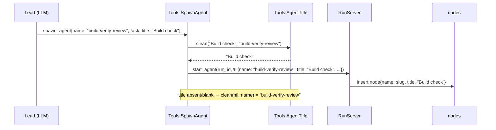

# SwarmCode CLI pass 75: the side panel V2, the interview note and the settings strata

After reviewing three design galleries on 2026-09-26 the owner picked, in their words: "**Side panel: SA2 V2, "One line each".** … The V2 agents block has one row per agent: glyph, AI name in its hue, a 3-5 word AI status, and one right-aligned figure (turns `21/30`, `quiet 1m`, `✗ 30/30`). Rows are sorted by attention."; "**Interview dialog: QA, "Note" (the centred modal); the owner named frame QA2.** … One dialog per ask, not one per question. The CLI holds all answers and sends them at the final Enter; ← goes back."; and "**Settings: E, "Strata, calibrated".** … **Keep the settings information architecture and behaviour exactly.** This is a visual pass over the pass-74 settings TUI." (`/Users/zaali/.cache/c75/picks.md`). This spec turns those three picks into one plan for the CLI repo `/Users/zaali/dev/swarm-code-cli` (main `58383ca`). Its three areas were written separately (panel: Requirements 1-9 and tasks 100-154; interview: Requirements 10-19 and tasks 200-255; settings: Requirements 20-29 and tasks 300-343). This document merges them, resolves every conflict between them (Design › Assumptions › Merge resolutions M1-M20 and Repo-verified corrections V1-V8), orders them into lanes W, P, Q, S and F, and adds lane F (tasks 400-412): the merge, the gates, the Rust port build, the sandbox acceptance and the final run.

# Requirements

## Introduction

Pass 75 changes what three parts of the SwarmCode CLI draw and say. It does not change what the engine decides. The user is the owner. They run swarms, answer their agents and tune settings in Ghostty on a slate background (#2c3239, opacity 0.93). On that background the Theme `border` role has a contrast of 1.11:1, so it cannot be seen. Each area's own introduction follows, unchanged. Requirement 1 is the wire contract for the whole pass: `body_version` stays 1 and every wire addition is optional and has a default.

**Side panel, AI names, AI status lines, run card, strip (Requirements 1-9).**

The side panel of the SwarmCode CLI (`apps/swarm_code_cli`) shows every agent of the open conversation's runs. Today it draws 60-second lanes, slugs cut in the middle, bare `×` rows for earlier runs, a done-agent sentence that is often the agent's own narration ("I'll start by inspecting…"), and it counts an agent that ran out of turns as a report. The owner picked design **SA2 V2 "One line each"** (`/Users/zaali/.cache/c74/side/SA2.html`, frame 2) inside direction SA's frame (`SA.html` S1-S5, R): a run header, the needs-you band, a "found" block with the reported gauge and each finished agent's headline, **one row per agent** (glyph · AI name in its hue · a 3-5 word AI status line · one right-aligned figure), the spent line, one worded "earlier" row and the keys. Names come from the Lead through a new optional `title` argument of `spawn_agent`; status lines come from a supervised, debounced, cached Summarizer with the rule sentence as its fallback and a setting to turn it off. This part also carries the pass's single wire-contract task (task 100) that every wire addition of the pass depends on.

**Interview note (Requirements 10-19).**

When a Lead (or any agent) calls `ask_user`, today every question of the call becomes its own
generic centred option-list dialog, opened in the hash order of its interaction id, with the
option description glued onto the label, no header, no index, no deadline on the wire, and each
answer sent the moment Enter lands. The owner picked direction **QA "Note"** (frames QA1-QA3):
one centred, unfilled, rounded note per `ask_user` call, whose edges say who asks and what Esc
does, with a stepper of header words, two-line options, a writable "other" row, a "You will
send" ledger, and answers held in the CLI until the final Enter. This part adds the missing wire
facts, re-keys the dialog to the ask, fixes the ordering bug in all five places, and draws the
note exactly as picked.

**Settings strata (Requirements 20-29).**

Pass 75's settings area is a visual pass over the pass-74 settings TUI (`apps/swarm_code_cli/lib/swarm_code_cli/ui/projector/settings.ex` and its siblings): the owner picked direction E, "Strata, calibrated" (`/Users/zaali/.cache/c74/design/E.html`, rules R1-R12; critique §6-7 rules 1-18). The information architecture, the words, the keys and every behaviour stay exactly as they are; only how the screen is drawn changes. The root cause being fixed: on the owner's Ghostty slate (#2c3239 at 0.93 opacity) the Theme `border` role is 1.11:1, so the `rail │ page │ detail` rules are invisible and the screen does not read as decoupled. Per critique C19 the fix changes the settings projector's role choices, never the Theme hex values (`UI.Theme` and `:selection` are untouched). Requirements are numbered 20-29; tasks are lane S, 300-399.

Role abbreviations used below (E's CSS classes → Theme roles): tp `text_primary`, tm `text_muted`, tf `text_faint`, ac `accent`/`focus`, wa `warning`, er `error`, ok `success`, in `info`, `in b` = the `:key` role, l1 `agent_lane_1`, l2 `agent_lane_2`, l4 `agent_lane_4`, l5 `agent_lane_5`, cj `run_consensus_judge`, hov `hover` (background), surf `surface` (background), pop `popover` (background), sel = the focus band (`chip_accent`'s background #3E291D, reverse video in ansi16/monochrome), c-wa/c-ok/c-in `chip_warn`/`chip_ok`/`chip_info`, key `on_accent`, b bold, u underline.

## Requirements

### Requirement 1: The pass-75 wire contract (one task for the whole pass)
**User Story:** As the implementer of any lane of pass 75, I want one written, tested statement of how the CLI↔daemon wire may change in this pass, so that three lanes can add fields without ever disagreeing about versions or defaults.

#### Acceptance Criteria
1.1 WHEN pass 75 is complete THEN `SwarmCode.Protocol.ServiceHandshake.hello/0` SHALL still return `%{"op" => "hello", "client" => "swarm-code-cli", "body_version" => 1}` and `decode_hello/1` SHALL still accept only `body_version` `1`; no task of the pass bumps, renames or re-checks the version anywhere else.
1.2 WHEN a task adds a wire field to any DTO THEN the field SHALL be added as an optional key with a wire default in the DTO's `wire_defaults`, `fields` and `defaults` lists and in the codec's `@optional_wire_keys` entry for that DTO, so that a daemon that omits the key still decodes (`decode/1` fills the default) and a daemon that sends it decodes to the sent value.
1.3 WHEN a task adds a wire field THEN the daemon SHALL emit it from both backends (`PersistedBackend` and `LiveBackend`), the Demo/Fake data SHALL carry valid literals where the field is drawn, and no existing key SHALL be renamed, removed or given a new enum value; `lane` and `lane_at` stay on the wire unchanged.
1.4 WHEN `mise exec -- mix test apps/swarm_code_core/test/swarm_code/protocol/c75_wire_contract_test.exs` runs THEN it SHALL print `0 failures` and pin: `hello()["body_version"] == 1`, `decode_hello(%{"op" => "hello", "client" => "swarm-code-cli", "body_version" => 2})` is an error, and the pass-75 additions table in `docs/superpowers/plans/pass75-notes/wire.md` lists every added key of the pass (this part: `AgentSummary.turn`, `max_turns`, `summary`, `summary_rev`, `last_words`) (task 100 also writes the interview part's rows — `Question.index`, `header`, `total`, `agent_id`, `requested_at`, `QuestionOption.description`, `NeedsYou.questions`, `options` — and the settings part adds no wire key; merge M1).

### Requirement 2: Turns reach the panel and a turn-limit stop is a stop, not a report
**User Story:** As a user watching a swarm, I want to see `21/30` beside a working agent and `✗ 30/30 · turn limit` beside one that ran out, so that I know why an agent stopped and how close the others are.

#### Acceptance Criteria
2.1 WHEN the daemon projects an agent whose node has `max_turns` as an integer > 0 THEN `AgentSummary` SHALL carry `turn` (the node's `turn`, an integer ≥ 0) and `max_turns`; WHEN `max_turns` is nil or 0 THEN both SHALL be nil (the same rule as `AgentDetail` at `agent_detail.ex:108-109`).
2.2 WHEN a node's `turn` column changes THEN the daemon SHALL re-send the agent (the `:turn` key joins `@agent_tick_keys` in `persisted_backend.ex`), and a partial reload SHALL produce the same `AgentSummary` body as a full reload for the same database rows.
2.3 WHEN a node is persisted with status `"done"` and `error_kind` `"turn_budget"` THEN the panel row SHALL show the glyph `✗` in the `:error` role, the figure `✗ <max_turns>/<max_turns>` in the `:error` role and a status text that is the agent's final AI summary in `:text_muted` when one exists (e.g. `build never ran`, Requirement 5) or else the rule sentence in `:text_faint`; the rule sentence for this state SHALL be exactly `no answer after <max_turns> turns` (e.g. `no answer after 30 turns`), and `finding` SHALL be nil and `finding_refs` `[]` for that agent.
2.4 WHEN a run's `reported` count is computed THEN an agent with status `"done"` and `error_kind` `"turn_budget"` SHALL NOT count; the run with 4 agents of which 1 hit the turn limit and 2 finished with a result SHALL show `found 2 of 4 in`, and the V2 scene (1 finished, 1 turn limit, 2 working) SHALL show `found 1 of 4 in` (the frame's `2 of 4 in` predates this fix; Assumption D-L12).
2.5 WHEN the run card in the main pane draws a turn-limit agent THEN its lane line SHALL read `✗ <name>  turn limit   no answer after <max_turns> turns · last: <first sentence of its last words>` with `turn limit   no answer after N turns` in the `:error` role and `· last: …` in `:text_muted`, elided at the end with `…` to the row's width; WHEN the agent has no last words THEN the `· last:` part is absent.
2.6 WHEN the daemon has a turn-limit agent's partial result THEN `AgentSummary` SHALL carry `last_words` (the first non-narration sentence of the partial result, ≤ 160 bytes; nil for every other agent) and the wire `now` SHALL be the rule sentence (2.3); the client derives the `:turn_limit` state from `stop_reason == "turn_budget"` and never from a new wire enum value.

### Requirement 3: A finished agent's headline is its conclusion, not its narration
**User Story:** As a user reading the "found" block, I want the one sentence under a finished agent to be what it concluded, so that I never read "I'll start by inspecting the repo" as a finding.

#### Acceptance Criteria
3.1 WHEN a done agent's report has no numbered finding THEN `PanelFacts.finding/2` SHALL skip any leading sentence that starts (case-insensitive, after trimming `*`, `#`, `>`, `-`, spaces) with one of: `I'll`, `I will`, `Let me`, `I'm going to`, `I am going to`, `First,`, `First I`, `Starting`, `I need to`, `I should`, `Looking at`, `Let's`, `Now I`, `Next,`, `I can see` and SHALL return the first sentence that does not.
3.2 WHEN every sentence of the head is narration THEN `finding/2` SHALL use the report's tail (the last 2048 bytes, `result_tail`) and return the last sentence there that is ≥ 8 characters, does not end in `:` and is not narration; WHEN that also fails THEN it SHALL return nil and the row says `done`.
3.3 WHEN the report is `Deleting ailogic_typescript/ is safe: nothing in lib/ or assets/ imports it.\n\nRefs: mix.exs:12, README.md:21` THEN the headline SHALL be `Deleting ailogic_typescript/ is safe: nothing in lib/ or assets/ imports it.` (≤ 160 bytes, cut at a word with `…` when longer) and the refs `mix.exs:12 · README.md:21`.
3.4 WHEN a report starts `I'll start by inspecting lib/ for TypeScript imports.\n\nConclusion: nothing imports it; deleting the directory is safe.` THEN the headline SHALL be `Conclusion: nothing imports it; deleting the directory is safe.`

### Requirement 4: AI names for agents
**User Story:** As a user, I want each worker to be named by the Lead in plain words ("Build check", "Strategy fit"), so that the panel, the card, the band and the overlay read like a team, not like a list of slugs.

#### Acceptance Criteria
4.1 WHEN the Lead calls `spawn_agent` with an optional string `title` THEN the daemon SHALL store the cleaned title in the new node's existing `title` column, keep `name` as the slug identifier, and the tool description SHALL tell the Lead: `title: a display name in sentence case, 1-3 words, e.g. "Build check"; the panel shows it instead of name`.
4.2 WHEN `title` is cleaned THEN the daemon SHALL keep only its first line, trim it, strip surrounding `"`/`'`, collapse runs of whitespace to one space, drop control characters, keep at most 3 whitespace-separated words, cut it to 24 cells (`String.slice/3` on graphemes, 24) and 32 bytes, and keep the case the Lead wrote; WHEN the result is empty or `title` is absent THEN the node's `title` SHALL be the slug `name` (today's behaviour).
4.3 WHEN an agent's wire `title` is present and differs from its `name` THEN `SwarmCodeCLI.UI.Projector.Panel.Name.display/3` SHALL return the title as is (no affix trimming); WHEN the title equals the name or is blank THEN it SHALL return the humanised trimmed slug: the shared affixes removed as today, `-`/`_` replaced by spaces, the first letter upper-cased (`review-angular-plan` with shared affix `review-` → `Angular plan`); the Lead stays `Lead`, chat assistants keep `role_label/2`.
4.4 WHEN a name is drawn in the panel, the band, the run card, the strip or the overlay header AND the row has room for it THEN it SHALL be drawn whole; WHEN it is longer than the column THEN it SHALL be cut at the end with `…` (`Width.elide(text, n, :end, policy)`), never in the middle.
4.5 WHEN the ^F overlay header draws an agent that has an AI title THEN the slug SHALL follow the name in the `:text_faint` role, e.g. `Build check build-verify-review`; WHEN there is no AI title THEN the header is unchanged.
4.6 WHEN a name is needed for a message in chat (`steered to <name>`, the swarm footer, the band's rows, the approval's card) THEN the same `Name.display/3` result SHALL be used, so one agent has one name everywhere (`pass73_names_test.exs` keeps passing with the new rule).

### Requirement 5: AI status lines (the Summarizer)
**User Story:** As a user, I want a 3-5 word present-tense line beside each live agent ("reading the repo", "weighing 2 plans"), so that I know what every agent is doing without opening it.

#### Acceptance Criteria
5.1 WHEN an agent of a running run has a meaningful change — one of its operations finished, its panel state changed, or it crossed 60 s without an event — THEN the daemon SHALL schedule one Summarizer call for that agent, debounced to at most one call per agent per 45 s (trailing edge: the newest change wins), plus one final call when the agent stops without an answer (turn limit or failure); a change of tokens, cost or turn count alone SHALL NOT cause a call; the Lead and the assistant of a plain chat run (`run.kind == "chat"`) never get a call; at most 120 calls per run in one session (one `PersistedBackend` process), after which rule sentences are used; each call SHALL log `agent status: run <run_id> call <n>/120` at `:info` (never the summary text).
5.2 WHEN the Summarizer runs THEN its request SHALL use the conversation's chat model (`SwarmCode.Domain.Providers.effective_model(conversation, :chat)`), `max_tokens: 2048`, `temperature: 0.0`, `effort: "low"` for Anthropic providers and nil otherwise, `deadline_ms: 10_000`, a system prompt asking for `3 to 5 words, present tense, lower case, no punctuation, no numbers or file names that are not in the notes`, and a user message of at most: the agent's title, its task cut to 300 characters, and its last 8 events (operation titles, result heads cut to 120 characters, the reasoning tail cut to 400 characters).
5.3 WHEN the call returns `{:ok, %{text: text}}` THEN the daemon SHALL keep the first line, trim it, strip quotes and a trailing `.`, downcase it, and accept it only when it has 1-7 words and ≤ 80 bytes AND every token that contains a digit, a `/`, a `.` inside a word or an `_` also appears (case-insensitive) in the input notes; otherwise the summary SHALL be discarded and the rule sentence used.
5.4 WHEN a summary is accepted THEN `AgentSummary` SHALL carry `summary` (the text) and `summary_rev` (the agent's call sequence number, 1 for its first call, counting up) and SHALL keep carrying that pair on every later body, whatever else changes, until a newer call's accepted text replaces it; a result older than the summary held SHALL be dropped; at the final call of an agent that stopped without an answer the held summary SHALL be cleared, so the rule sentence shows until the final summary arrives; summaries are held in the backend's state only and are never persisted.
5.5 WHEN the cli.json key `agent_summaries` is `false`, or the app env `:summarize_agents` is `false` (the test default), or the run is not `running`, or `work.summarize` returns `{:error, _}`, times out or raises THEN no summary SHALL be sent (`summary` nil) and the panel draws the rule sentence; a failure SHALL be logged once per agent at `:debug` and never crashes `PersistedBackend`.
5.6 WHEN the user types `/panel summaries off` THEN the CLI SHALL answer `AI status lines off · /panel summaries on brings them back`, write `"agent_summaries": false` to cli.json through `{:save_preferences, %{agent_summaries?: false}}`, and draw rule sentences from the next frame; `/panel summaries on` answers `AI status lines on · /panel summaries off hides them` and writes `true`; `/panel summaries` alone answers `AI status lines are on: /panel summaries off` or `AI status lines are off: /panel summaries on`.
5.7 WHEN the settings registry is read THEN it SHALL contain `terminal.agent_summaries` (label `AI status lines`, `type: :toggle`, `default: true`, `storage: {:cli, "agent_summaries"}`, `applies: :at_once`, parity `CLI /panel summaries`) directly after `terminal.show_diffs` in section `:layout`, and `apps/swarm_code_core/test/swarm_code/settings/c74_registry_test.exs` SHALL pin 171 entries, 131 scalars and 21 cli-stored entries.
5.8 WHEN the panel draws an agent whose `summary` is present AND the CLI state `agent_summaries?` is true THEN the status text SHALL be the summary in `:text_muted` (no equality test against `revision`: the daemon only sends a summary it still holds, 5.4); otherwise it SHALL be the rule sentence (`Model.sentence/3`'s short form) in `:text_faint`, except the Lead's `waiting for <N>` / `waiting on <name>`, a harness fact, in `:text_muted`; a needs-you agent's row always says `asks you` (ask) or `wants to run` (approval) whatever the summary.

### Requirement 6: The V2 agents block
**User Story:** As a user, I want one row per agent sorted by how much it needs me, so that at a glance I see who is stuck, who is quiet and who is fine.

#### Acceptance Criteria
6.1 WHEN the shown runs have agents THEN the panel SHALL draw one block title row `agents` (`:text_muted`) with `<N> live · <M> stopped` right-aligned in `:text_faint` (omit ` · 0 stopped` when M is 0; omit `0 live · ` when N is 0), where N counts the rows whose state is working, thinking or needs you (quiet included) and M counts failed, turn-limit and stopped rows (waiting, queued and paused rows are drawn but counted in neither); then one row per agent that is not done (the Lead included), grouped by run: the in-chat run's rows first, then each run it launched in `started_at` order; a done agent has no agents row (it is in `found`); no other agent rows, lanes, legend, rule or connector rows.
6.2 WHEN the agent rows of one run are ordered THEN the sort SHALL be: needs you, stopped (failed, turn limit, stopped), quiet (working, no event for ≥ 60 s), working, waiting, then queued/paused; ties keep the wire order; the in-chat run's rows come first regardless of attention (6.1).
6.3 WHEN an agent row is drawn THEN it SHALL be `<mark or blank> <glyph> <name padded to the name column> <status text> <figure right-aligned, ≤ 8 cells>` where the glyph is `◒` (the new `Panel.Glyph` token `:agent_live`, `:text_primary`) for working/thinking, `◌` (the existing `:waiting` token, `:text_primary`) for waiting/queued/paused, `✗` (`:error`) for failed/turn limit/stopped and `!` (`:warning`) for needs you, and the mark `⋔` (`:run_swarm`) or `C` (`:run_consensus_judge`) sits on each run's first row only (two blank cells on the other rows).
6.4 WHEN the figure is chosen THEN the precedence SHALL be: `✗ <max>/<max>` in `:error` for a turn-limit agent; `quiet <N>m` in `:warning` for a working agent with no event for ≥ 60 s (N = whole minutes, `quiet 1m` at 60-119 s); `<turn>/<max_turns>` in `:warning` when `turn/max_turns ≥ 0.8`, else `:text_muted`; nothing when `max_turns` is nil.
6.5 WHEN the name column is computed THEN it SHALL be the widest name among the shown agent rows plus 2, at most 24, and a name longer than 24 cells SHALL be end-cut with `…`; the status text SHALL take the cells left after one space before the figure and be end-cut with `…`; at a 46-wide panel the mark is at column 1, the glyph at 3, the name at 5, the status at 5 + name column, and the figure ends at column 44 (V2: `weighing 2 plans` gets exactly its 16 cells before ` quiet 1m`).
6.6 WHEN the name is drawn THEN it SHALL use the view's `name_role` (`Model.view/7`: a worker's lane hue `:agent_lane_1`..`:agent_lane_5`, `:text_primary` for the Lead and for a chat or consensus assistant, `:text_muted` for a judge), never the state colours of `Hive.lane_role/2`; the status text `:text_muted` when it is an AI summary or the Lead's waiting words and `:text_faint` when it is a rule sentence; the figure roles as in 6.4.

### Requirement 7: The panel frame around the block
**User Story:** As a user, I want the panel to read top to bottom: what run, what needs me, what was found, who is working, what it cost, what came before, which keys — with nothing in it that is not text.

#### Acceptance Criteria
7.1 WHEN a run header is drawn in full mode THEN row 1 SHALL be `▌` (`:accent`, only when the run is the chat's in-chat run, drawn at column 0 with no row margin) + the run mark + a space + the run title bold `:text_primary`, and row 2 SHALL start at column 3 and read `<kind> · in chat · <tokens> · <$ or nothing>` in `:text_faint` with the run's clock right-aligned in `:text_muted` (e.g. `consensus · in chat · 65k · $0.01    00:49`); a run launched by the in-chat run, and any other live run of the chat, draws one row: mark at column 1, title `:text_muted` at column 3, two spaces, `<R> of <T> in` (`:text_faint`, swarms only), clock right-aligned (`:text_muted`), e.g. ` ⋔ swarm review changes  1 of 4 in      16:15`.
7.2 WHEN one or more agents of the shown runs need the user THEN one band for all shown runs SHALL be `! <N> need you · oldest first        ^N answer` (`1 needs you` when N is 1; `!` and the count bold `:warning`, `· oldest first` `:text_muted`, `^N` bold `:text_primary`, `answer` `:text_muted`), followed per request by `│ <mark> <name> <wants to run | asks>   <age>` and up to two `│   <text>` rows plus one `│   <reason>` row in `:text_faint`, the `│` in `:warning`, oldest first. For an ask, the `<text>` rows and the `<reason>` row are the words of 18.3 (merge M3), and N counts asks, one per `ask_user` call, plus approvals (merge M19). The `<age>` is drawn only when the request's unix-ms time is at or before `state.now` and less than 24 h old.
7.3 WHEN a run has sub agents THEN its found block SHALL be `found           <R> of <T> in · <files changed or "no files changed">` (`found` and `R of T in` `:text_muted`, the rest `:text_faint`), the gauge row `<mark> <one segment of cell cells per sub agent>` with `cell = min(10, div(width - 4 - (T - 1), T))` and one space between segments (one cell per agent and no spaces when `cell < 3`), segments ordered by `finished_at` for done, turn-limit and failed agents, then the not-yet agents in wire order; a done agent's segment is `▄` in its lane role, a turn-limit or failed agent's `▁` in `:error`, a not-yet agent's `▁` in `:text_faint`; then a why-line in `:text_faint`: `<E> came back empty · the Lead waits for <P>` (P ≥ 2), `<E> came back empty · the Lead waits for <Name>` (P = 1), `<E> came back empty · the Lead is writing the report` (P = 0), or `the Lead reports once all <T> are in` (E = 0, run running); then per finished agent `✓ <name>   <clock> · <tokens>` and its headline (`:text_primary`, wrapped to at most 2 rows) and its refs (`:text_faint`, joined by ` · `); a Lead's report row reads `✓ Lead · the report   <clock> · <tokens>`, then the report's headline (`:text_primary`, at most 2 rows), then `reported · ^F reads it`.
7.4 WHEN the run's agents block has been drawn THEN the spent row SHALL follow one blank row: `spent $<x.xx> · <tokens> tokens · <N> runs` with `spent` `:text_faint`, the amount `:text_primary`, the rest `:text_muted`; WHEN no run of the chat has a price THEN it reads `spent <tokens> tokens · <N> runs`.
7.5 WHEN the chat has runs that are not shown (beyond the first 3 stopped ones) THEN one row SHALL read `earlier  <N> <word> in this chat  Ctrl-R` (`earlier` `:text_muted`, the middle `:text_faint`, `Ctrl-R` bold `:text_muted`) where `<word>` is `finished runs` when all N are done, `stopped runs` when all N failed or were stopped, else `runs` (singular `run` when N is 1, e.g. `1 stopped run`), and no per-run `×` rows; WHEN every run is shown THEN the row is absent.
7.6 WHEN the panel's last row is drawn THEN it SHALL be the keys row `^F agents  ^N needs you  ^B panel` (keys bold `:text_muted`, words `:text_faint`) directly after the earlier row (or the spent row), with the rows above top-anchored and the rest of the pane blank; nothing is pinned to the bottom.
7.7 WHEN any panel row is drawn THEN it SHALL use no fill, no `:border`/`:border_soft`/`:card`/`:surface` role and no `:text_ghost`; every structure is `:text_faint` or stronger, air (one blank row between blocks) or shape; the hue budget is: lane hues for names only, `:warning` for needs-you and risk figures, `:error` for stops, `:success` for `✓`, `:accent` for the in-chat `▌` only.
7.8 WHEN the ASCII glyph tier is active THEN `◒`→`o`, `◌`→`.`, `✓`→`v`, `✗`→`x`, `▄`→`#`, `▁` (not yet)→`-`, `▁` (turn limit)→`x`, `⋔`→`S` (the swarm mark's existing ASCII twin, `safe_text.ex:1267-1269`), `│`→`|`, `▌`→`|`; WHEN the measured tier is active THEN `▄`→`▰` and `▁`→`▱`, and every panel glyph is one cell wide under both ambiguous-width policies (`panel_test.exs` "every panel glyph is one cell" keeps passing with the new tokens).
7.9 WHEN the panel is in compact mode THEN each run SHALL be its header row 1, the band's title row if any, the found row, and the agent rows with the figure only (no status text), then the spent, earlier and keys rows; WHEN the terminal is under 120 columns THEN the strip (Requirement 8) replaces the panel.

### Requirement 8: The run card, the strip and the overlay use the same names and states
**User Story:** As a user, I want the card in the transcript, the one-row strip and the ^F overlay to name agents the way the panel does and to show a turn-limit stop the same way.

#### Acceptance Criteria
8.1 WHEN the run card draws its worker lines THEN each SHALL be `<connector> <glyph> <name padded to the card's name width> <word padded to 11> <sentence> … <clock · tokens>` (the word padded to 11 cells, then two spaces, so the sentence starts 13 cells after the word's first cell as S2 draws it; today's card has one space, Assumption D-L13) where the name width is the widest `Name.display/3` result among the run's agents + 1, at most 24, cut at the end with `…`; the finding of a done agent is drawn without the `»` glyph; the meta is always `<clock> · <tokens>` (never money); and `Model.agents/…` views are computed once per run, not once per line.
8.2 WHEN the strip (terminal < 120 columns) draws THEN it SHALL be `▌<mark> <chat title…>  ! <N> need you ^N   <mark> <R> of <T> in · ✗ <name> turn limit   $<x.xx or tokens>` with no background fill, `1 needs you` when N is 1, names through `Name.display/3` given `min(24, the cells left after every other part)` and end-cut only when the row is short, the turn-limit part only when one exists (the most recent), `! N need you ^N` only when N > 0, and money only when priced; WHEN the row does not fit THEN it SHALL shorten in this order until it fits: ` · ✗ <name> turn limit` becomes ` · ✗ turn limit`, then the chat title is cut to 12 cells, then the money part is dropped.
8.3 WHEN the overlay header draws THEN it SHALL be as today plus the slug after an AI title (4.5) and the state word `turn limit` for a turn-limit agent; the rest of the overlay (lanes, transcript) is unchanged in this pass.

### Requirement 9: Money only when priced
**User Story:** As a user with unpriced models, I do not want `$0.00` everywhere; I want tokens when there is no price and the exact price when there is one.

#### Acceptance Criteria
9.1 WHEN a run's `cost_usd` is nil THEN every place that draws money for it (panel header row 2, the spent row, the strip, the overlay meta) SHALL draw the token figure instead (`840k`, `1.0M`, `4.1M`), and no `$` appears; the run card's meta and the found rows draw `<clock> · <tokens>` always, priced or not (the frames S2, V2 and S4 do).
9.2 WHEN `cost_usd` is a number, including `0.0` THEN it SHALL be drawn as `$` followed by the amount with two decimals (`$0.00`, `$0.01`, `$0.82`); amounts ≥ 100 keep two decimals (`$123.40`).
9.3 WHEN the spent row sums runs THEN it SHALL add only priced runs and say `spent <tokens> tokens · <N> runs` when no run is priced; a mix draws the priced sum and all tokens; WHEN a priced run has an agent with `tokens > 0` and `cost_usd == nil` THEN its amount (header row 2) and the spent amount SHALL be followed by `+` in `:text_faint` (`$0.01+`), because `Pricing.add/2` sums only the priced agents.

### Requirement 10: The wire carries every fact the note needs

**User Story:** As the CLI, I want each pending question to carry its index, header, total,
asker, ask time, option descriptions and the ask's deadline, so that the note can order, label
and time an ask without guessing.

#### Acceptance Criteria
10.1 WHEN the daemon projects a pending question THEN the `"question"` map on the wire SHALL
contain exactly the keys `"prompt"`, `"options"`, `"multiple"`, `"index"` (0..3),
`"header"` (string ≤ 64 bytes or `nil`), `"total"` (1..4), `"agent_id"` (UUID string or
`nil`) and `"requested_at"` (unix milliseconds or `nil`), and each option map SHALL contain
exactly `"id"`, `"label"` and `"description"`, with `"label"` no longer glued to the
description (today `label <> " — " <> description`).
10.2 WHEN a question row is built by `PendingInteractions.question_row/3` THEN the row SHALL
contain the new keys `deadline_at` (a `DateTime` = `requested_at + 1_800_000 ms` when the
entry's `timer` is a reference, else `nil`), and each question map SHALL contain `header`
(≤ 64 bytes or `nil`) and `total` (the asked count, unchanged after an index was answered);
approval rows SHALL carry `deadline_at: nil`; the frozen row-key list in
`apps/swarm_code_daemon/test/swarm_code/domain/engine/run_server_pending_interactions_test.exs`
(`@row_keys`) and `docs/superpowers/plans/pass70-notes/A.md` SHALL list `deadline_at`.
10.3 WHEN the daemon sends a pending interaction of kind `"question"` THEN `"deadline"` SHALL be
the unix-millisecond deadline (`unix_ms(deadline_at)`) and SHALL be `0` when the ask has no
clock (a `timeout: :infinity` ask such as the consensus gate).
10.4 WHEN the CLI decodes a `"question"` map that lacks any of the new keys (an older daemon
body) THEN `DTO.Question.decode/1` SHALL succeed with `index: 0`, `header: nil`, `total: 0`,
`agent_id: nil`, `requested_at: nil`, and `DTO.QuestionOption.decode/1` with `description: ""`;
`body_version` SHALL stay `1` (no bump; task 100 of the panel part is the pass's only wire
version task and this part depends on it).
10.5 WHEN the daemon builds `needs_you` for a run THEN a question ask SHALL appear once per
asking node (not once per row) with `"questions"` = the headers of its rows in index order
(fallback `"Question N"`, N = index + 1, each ≤ 64 bytes, ≤ 4 entries), `"options"` = the
option count of its lowest-index row, `"agent_id"` = the question's `agent_id` when present,
and `"requested_at"` in unix milliseconds (today the microsecond `created_at`); approval
entries SHALL carry `"questions" => []` and `"options" => 0`.
10.6 WHEN a fake-source question is scripted THEN the Fake SHALL produce the same shapes
as 10.1 and 10.5 (index, header, total, description, ms `requested_at`, one `needs_you` entry per
node), and `Fake.Script.command_deltas/2` SHALL accept the `%{option_ids: [...], custom_text:
"..."}` answer payload without raising.

### Requirement 11: One dialog per ask

**User Story:** As a user, I want one note for the whole `ask_user` call, so that I answer the
Lead's questions in order, in one place, and Esc puts the whole ask aside.

#### Acceptance Criteria
11.1 WHEN pending question rows share `node_id` and `expected_revision` THEN the CLI SHALL treat
them as one ask whose id is the `node_id`, and the layer SHALL be `{:question, node_id}`.
11.2 WHEN an ask becomes visible and auto-open applies THEN the CLI SHALL open exactly one
`{:question, node_id}` layer at its lowest-index pending question, with no option focused and
nothing picked, and start the 700 ms grace window once (`auto_opened: node_id`).
11.3 WHEN Esc closes a pending note THEN the CLI SHALL record the dismissal once as
`{node_id, expected_revision}` and SHALL NOT auto-open any row of that ask until its revision
changes.
11.4 WHEN Ctrl-N (or `n` in main, a badge, or the overlay's request) opens an ask THEN the note
SHALL reopen at the step, focus, picks and "other" text held when it was closed.
11.5 WHEN some rows of the ask are removed (answers accepted one by one) THEN the note SHALL
stay open on the remaining rows and SHALL close only when no row of the ask is pending.
11.6 WHEN every row of an ask leaves while the CLI has sent nothing for it THEN the note SHALL
close and the status notice SHALL read `The <Name> stopped waiting: no answer after <M> min`
when the ask had a deadline that has passed (M = the ask's timeout in whole minutes, 30 today),
else `The <Name> is no longer waiting for your answers`.
11.7 WHEN an ask leaves THEN the CLI SHALL drop its `interviews` entry, its `selection`
`{:question, question_id}` entries and its `{:question_other, question_id, revision}` field
editors; at most 8 asks SHALL be held (the oldest dropped first).

### Requirement 12: Questions open and walk in index order

**User Story:** As a user, I want a multi-question ask to start at question 1, so that the
stepper, the walk (Ctrl-N/n), the hint overlay and the panel all agree.

#### Acceptance Criteria
12.1 WHEN the CLI orders pending interactions THEN it SHALL use one key,
`UI.Question.order_key/1` = `{created_at, node_id, index, id}`, in `Reducer.next_in_view/1`,
`Keymap.Special.waiting_ids/1`, `Reducer.Hint.pending/3`, `Panel.Model.pending/2` and
`Panel.Model.needs/3`; a 3-question ask whose hashed ids sort as 2, 0, 1 SHALL open at index 0.
12.2 WHEN the walk (`waiting_ids/1`), `Hint.pending/3` or `Panel.Model.pending/2` lists needs
THEN a question ask SHALL appear once (its lowest-index row / its node id), never once per row.
12.3 WHEN `UI.Activity.sort/1` sorts items THEN a `deadline` of `0` SHALL sort as `:infinity`
(after every timed item).

### Requirement 13: Held answers, the stepper and the ledger

**User Story:** As a user, I want to answer question by question, go back, and see exactly what
will be sent before I send it, so that a wrong pick never reaches the agent.

#### Acceptance Criteria
13.1 WHEN the ask has 2 or more questions THEN the note SHALL draw a stepper row of header
words joined by `   ›   ` (`›` text_faint, three spaces each side): the current one `●` (accent)
with a bold underlined `text_primary` word, an answered one `✓` (success) with a `text_muted`
word, an untouched one `○` with a `text_faint` word, and `n of m` (text_faint) ending two cells
before the right edge.
13.2 WHEN a question has no header THEN the stepper and the ledger SHALL call it `Question N`
(N = index + 1).
13.3 WHEN the ask has 2 or more questions THEN the note SHALL draw a `You will send` ledger with
one row per question in index order: the state glyph (`✓` success, `●` accent, `○` text_faint),
the header in `text_muted`, never bold (column as wide as the widest header + 2), then the
answer in `text_primary`: the picked labels joined `", "`, plus ` + "<other text>"` when
"other" has text (the row cut with `…` to the note's width), `not answered yet` (text_faint)
for an open question, and `answered earlier` (text_faint) for an index the ask no longer
carries (`total` > rows); a one-question ask SHALL draw `You will send  <answer>` on one row.
13.4 WHEN a single-select question is shown THEN the focused option SHALL count as its pick
(`You will send  JSON` while option 2 is focused), an explicit pick (digit, Enter) SHALL be
kept when focus moves, and non-blank "other" text SHALL replace the pick (the answer is then
`%{option_ids: [], custom_text: text}`).
13.5 WHEN a multi-select question is shown THEN ticks SHALL be the `state.selection
[{:question, question_id}]` set drawn as `[✓]`/`[ ]` before the label with a ticked label
bold, and "other" text SHALL be added to the ticks (`%{option_ids: ticks, custom_text: text}`).
13.6 WHEN Enter is pressed on a question that is not the last and it has an answer THEN the
note SHALL move to the next question keeping every held answer; WHEN it has no answer THEN
nothing SHALL happen.
13.7 WHEN Enter is pressed on the last question and every question has an answer THEN the CLI
SHALL emit, in one reducer transition, exactly one `{:command, request}` effect per question in
index order, each an `{:answer_question, run_id, node_id, question_id, expected_revision,
answer}` intent with origin `{:interaction, question_id, expected_revision}`, and SHALL record
their request ids in `interviews[node_id].sending`; a second Enter while `sending` is non-empty
SHALL emit nothing.
13.8 WHEN Enter is pressed on the last question and some question has no answer THEN the note
SHALL move to the first unanswered question and send nothing.
13.9 WHEN a sent answer is refused (`mutation_reasons[{:interaction, question_id, revision}]`
is set) THEN the note SHALL stay open on the remaining rows, clear `sending`, and draw one
`warning` row under the ledger: `<header>: <refusal text>`.

### Requirement 14: Keys

**User Story:** As a user, I want the note's keys to be obvious and safe, so that I never
answer by accident and can always put the ask aside.

#### Acceptance Criteria
14.1 WHEN digit `1`-`9` is pressed with focus on the list THEN on a single-select question it
SHALL pick and focus option N; on a multi-select question it SHALL toggle and focus option N;
past the option count it SHALL do nothing.
14.2 WHEN Space is pressed on a focused option of a multi-select question THEN it SHALL toggle
the tick; on a single-select question it SHALL do nothing.
14.3 WHEN ↑/↓ (or `k`/`j`) are pressed THEN focus SHALL cycle through the current question's
option ids and `"other"` (wrapping), never leaving the note.
14.4 WHEN Tab or Shift-Tab is pressed THEN focus SHALL jump from the list to `"other"`, or from
`"other"` back to the last focused option (the first option when none).
14.5 WHEN ← or → is pressed with focus on the list of a multi-question ask THEN the note SHALL
step to the previous/next question (bounded, held answers kept); on a one-question ask they
SHALL do what they do today (`{:focus_cycle, :previous | :next}`); with focus in `"other"` they
SHALL move the caret (the `:field` context is unchanged).
14.6 WHEN the bindings table is regenerated THEN `:dialog_next` SHALL own `j ↓` and
`:dialog_previous` `k ↑` only, two new `:dialog` bindings `:dialog_right` (`→`) and
`:dialog_left` (`←`) SHALL exist, no `{context, key}` pair SHALL be bound twice, and
`mix swarm_code.keymap --check` SHALL pass.
14.7 WHEN Esc is pressed THEN the note SHALL close (dismissal per 11.3) keeping the draft,
picks and "other" text; the bottom-left edge SHALL read `Esc later: the <Name> keeps waiting,
<N> min left` (or `Esc later: the <Name> waits until you answer or stop` when `deadline == 0`
from a daemon of this pass, or `Esc later: the <Name> keeps waiting` when `deadline == 0` and
the rows come from an older daemon, whose `total` is 0 and whose asks do time out),
and the bottom-right edge `^N reopens` (the `next_need_chord` label).
14.8 WHEN the note's keys row is drawn THEN it SHALL read, for a single-select question,
`1-<n> pick   ↑↓ move` and for a multi-select question `1-<n> tick   Space tick   ↑↓ move`,
followed by `   ←→ question` on asks of 2 or more (groups joined by three spaces, from the
text column), with `Enter <words>` right-aligned on the same row, where `<words>` is `send to
the <Name>` (one question), `next: <next header>` (not last), `send <m> answers` (last, m ≥ 2
rows left to send) or `send 1 answer` (last, one row left of an ask of 2 or more), with key names from `Keymap.Bindings` so `terminal.keys`
overrides show.
14.9 WHEN PgUp/PgDn/Ctrl-D/Ctrl-U/Home/End page the note THEN focus SHALL NOT change (today
`scroll_dialog/2` forces `"cancel"`).
14.10 WHEN keys arrive during the 700 ms grace window of an auto-opened note THEN printable
keys and Backspace SHALL still type into the draft, Esc SHALL dismiss, and every other key SHALL
wait, as today.

### Requirement 15: The note's look

**User Story:** As a user, I want the note to read as a quiet card on my desk with the chat
stepping back, so that the question is the only thing asking for attention.

#### Acceptance Criteria
15.1 WHEN the note is painted THEN its rectangle grown by one cell SHALL be cleared with the
canvas base style (no `:card` fill), its frame SHALL be rounded (`╭╮╰╯─│`; `⎡⎤⎣⎦⎯⎜` under the
wide policy; `+-|` in ASCII) in `text_faint`, and every cell of the regions behind it SHALL be
restyled to the `text_ghost` foreground with modifiers dropped and glyphs and backgrounds kept.
15.2 WHEN the note is painted THEN the top-left edge SHALL read `<mark> <Name> asks you` (`<mark>`
= `Theme.run_kind(kind)` glyph, `<mark> <Name>` bold in the run's hue role, e.g. `:run_swarm`;
a worker's name in its lane role) followed by ` <m> questions` when m ≥ 2, and the top-right
edge `<kind> · <run title> · asked <m:ss> ago` (from `question.requested_at` and `state.now`;
omitted when `requested_at` is `nil`).
15.3 WHEN the asker's latest assistant text of the same run precedes the ask in the loaded
transcript THEN the note SHALL draw its last sentence quoted in `text_muted` on one row, cut
with `…` to the inner width, never wrapped; otherwise the row and its blank SHALL be omitted.
15.4 WHEN the prompt row is drawn THEN it SHALL be the question in bold `text_primary` with
`pick one` or `pick any` (`text_faint`) right-aligned on the same row.
15.5 WHEN options are drawn THEN each SHALL take two rows: `<N>  <label>` (number `text_faint`,
label `text_primary`) and the description under the label in `text_muted` (omitted when
`""`); the focused option SHALL carry an accent `▌` rail (`Panel.Glyph` `:in_chat`) on both
rows with the number bold accent, the label bold and its description in `text_primary` (QA1/QA3
draw it `tp`), and no hover fill; a blank row SHALL separate the last option's description from
the "other" row; in monochrome the
`Theme.style(:focus).prefix` words SHALL mark the focused option exactly once.
15.6 WHEN the "other" row is drawn THEN it SHALL read `›  Something else, in your own words…`
with `Tab to type` right-aligned while empty and unfocused, and `›  <text><caret>` with
`Tab back to the list` right-aligned while focused (`Support.glyph(:caret, state)` at
`Editor.cursor/1`), the row carrying the rail when focused.
15.7 WHEN the capabilities are ASCII THEN every glyph SHALL have its ASCII twin (`v`, `*`,
`o`, `>`, `|`, `+-`) and every string SHALL measure correctly under both ambiguous-width
policies (`Width.cells/2`).

### Requirement 16: Layout

**User Story:** As a user on a 100x30 or a 176x45 terminal, I want the note sized to its
content and centred on the chat, so that it never hides the panel needlessly nor clips a row.

#### Acceptance Criteria
16.1 WHEN the screen is 100 columns or wider THEN the note SHALL be `min(86, columns - 16)`
wide (84 at 100 columns, 86 at 176) and centred horizontally on the main (chat) region.
16.2 WHEN the note fits THEN its height SHALL be its content rows + 2 and it SHALL be centred
vertically on the main region; the maximum height SHALL be `rows - 4`.
16.3 WHEN rows run short THEN the note SHALL drop, in order: the blank rows between blocks
(bottom-most first), then the why row, then scroll the body (options, other, ledger) keeping
the focused row visible.
16.4 WHEN the screen is narrower than 100 columns (`:narrow`, `:small`, `:compressed_small`)
THEN the note SHALL fill the whole screen with no air and no backdrop restyle, with the same
rows and drop order.
16.5 WHEN the note is open THEN every background region's action targets SHALL be removed and
the terminal cursor SHALL be `nil` (unchanged), and the note's own targets SHALL be: each option
(pick/tick), the other row (toggle), each stepper word (goto) and the Enter label (confirm).

### Requirement 17: The deadline and the timeout

**User Story:** As a user, I want to know how long the agent will wait, so that I do not lose
half-composed answers to the 30-minute timeout.

#### Acceptance Criteria
17.1 WHEN `deadline > 0` THEN the bottom-left edge SHALL show `<N> min left` with
`N = div(deadline - now, 60_000)` clamped at 0, refreshed with `state.now` every second.
17.2 WHEN fewer than 5 minutes are left THEN the bottom-left edge text SHALL be drawn in the
`warning` role.
17.3 WHEN `deadline == 0` THEN the bottom-left edge SHALL read `Esc later: the <Name> waits
until you answer or stop`, except for an older daemon's ask (its first row's `question.total`
is 0; such a daemon sends `deadline` 0 for every ask and still times out after 30 minutes),
which SHALL read `Esc later: the <Name> keeps waiting` (text_faint, no time claim).

### Requirement 18: Band, panel reason and counts

**User Story:** As a user, I want the panel and the status bar to count asks, not rows, and to
say what the Lead wants, so that "3 waiting" never means one ask.

#### Acceptance Criteria
18.1 WHEN the status bar counts waiting items THEN `Status.waiting_count/1` SHALL count asks
(question rows grouped by node) and approvals; a 3-question ask reads `1 waiting`.
18.2 WHEN the strip or the band counts needs THEN `Panel.Model.needs/3` and its fallback
`Panel.Model.pending/2` SHALL group question rows by node before mapping.
18.3 WHEN the needs-you band draws a question ask THEN its body SHALL read `1 question:
<header>` or `<m> questions: <headers joined ", ">` from `needs_you.questions`, and its reason
row SHALL read `<k> options, or your own words` (k = `needs_you.options`, k ≥ 2), `1 option, or your own words`
(k = 1) or `your own words` (k = 0) for one question and be omitted for two or more (merge M3); WHEN
`needs_you.questions` is `[]` (an older daemon) THEN the body SHALL be the ask's first line as today; `answer it in the chat` SHALL no longer be used.
18.4 WHEN the status bar draws hints over a question note THEN it SHALL show `Esc later` and
`? keys` (no `n next`; the note's own keys row carries the keys).

### Requirement 19: Other consumers and fixtures

**User Story:** As a maintainer, I want the plain presenter, the companion, the fake source
and the demos to keep working with the un-glued label, so that nothing outside the TUI loses
the description.

#### Acceptance Criteria
19.1 WHEN the plain presenter prints a question option whose description is non-empty THEN the
record SHALL read `N. <option id> <label> — <description>`; with an empty description the
output SHALL be byte-identical to today (the golden
`apps/swarm_code_cli/test/fixtures/plain/three_run_output.txt` is unchanged because the
`:complete` script's options carry no description).
19.2 WHEN the companion projects a need THEN each option map SHALL carry `description`.
19.3 WHEN `mix swarm_code.demo.cells` runs THEN the 80x24 and 50x16 monochrome-ASCII question
SVGs SHALL exist with `data-focus="dialog"`, built from the layer `{:question, node_id}`.
19.4 WHEN the interaction contract is read THEN
`docs/superpowers/specs/2026-09-03-tui-interaction-contract.md` §12.5/§12.6 SHALL record the deviations:
← (not `b`) goes back, there is no skip key, and a resolved question closes rather than
becoming read-only.

### Requirement 20: Regions on one grid, separated by air, never by rules
**User Story:** As a settings user on a translucent terminal, I want the rail, page and note separated by gutters and shape instead of `border`-coloured rules, so that the screen reads as three regions on every desk.

#### Acceptance Criteria
20.1 WHEN the settings layer is drawn at 160×45 THEN the system SHALL place the crumb on row 0, the search well on row 1, a blank row 2, the body on rows 3-40 (38 rows), a blank row 41, the message row on row 42, a blank row 43 and the status line on row 44, with the rail on columns 2-25 (24 cells), a gutter 26-29, the page on columns 30-111 (82 cells), a gutter 112-115, the note spine on column 116 and the note text on columns 118-157 (40 cells), and margins of 2 cells on both edges (no top-margin row: decision D1).
20.2 WHEN the settings layer is drawn at any size ≥ 80×20 THEN no line SHALL contain a `│` (or ASCII `|`) rule between regions and no line SHALL be a full-width run of `─` (or `-`); the well and the status line are the only full-width shapes.
20.3 WHEN the width is 120-159 THEN the system SHALL draw the rail (24) + gutter + a page of `columns - 32` cells starting at column 30, no note column and the 3-line inline drawer (decision D14).
20.4 WHEN the width is 90-119 THEN the system SHALL draw no rail; the crumb on row 0, the well on row 1, the section strip on row 2, a blank row 3, the body from row 4 to `rows - 5`, blank, message row `rows - 3`, blank, status row `rows - 1`; the page spine on column 2 and the page `columns - 4` cells wide (band columns 2 to `columns - 3`).
20.5 WHEN the width is 80-89 THEN the system SHALL draw the crumb on row 0, the well on row 1, the body from row 2 to `rows - 5`, message row `rows - 3`, status row `rows - 1`; the page spine on column 1 and the page `columns - 2` cells wide; the label column 19 cells and the value column at spine + 23.
20.6 WHEN a page is drawn at ≥ 90 columns THEN inside the page, relative to the spine column, the mark slot SHALL be at +1, the label at +3 (29 cells), the value at +33, continuation lines at +35, and the tag right-aligned ending one cell inside the page's right edge.
20.7 WHEN any of `:border`, `:border_soft`, `:ticks_track` or `:text_ghost` would be used for a settings segment THEN the system SHALL draw `:text_faint` instead (settings-only remap in `Projector.Settings.Text.style/2`); no span in any settings scene carries those four roles.
20.8 WHEN the terminal is smaller than 80×20 THEN the system SHALL keep today's two centred "too small" sentences unchanged.
20.9 WHEN `Nav.page_height/1` is asked for the PgUp/PgDn step THEN it SHALL return the grid's body row count (38 at 160×45, 22 at 90×30, 18 at 80×24), never less than 3.

### Requirement 21: Groups are spines, and the spine carries the winning layer's hue
**User Story:** As a settings user, I want each group of rows to hang on a one-cell spine whose colour names the layer that set each value, so that I can see who set what before reading a word.

#### Acceptance Criteria
21.1 WHEN a page has a heading row THEN the group (heading + following rows up to the next heading) SHALL draw `╭─ ` (tf) + the title (tm, as given by the section) + its tag right-aligned (tf) on the title line, `│` (in each row's stratum hue) on every other line of the group, and `╰` on the group's last physical line (a continuation line when the last row wraps).
21.2 WHEN rows precede the first heading THEN leading `:info` rows (page intro, record hero, storage intro) SHALL have no spine and no title, and any remaining rows before the first heading SHALL form a title-less group whose first line carries `╭` in place of `│`.
21.3 WHEN two groups follow each other THEN exactly one blank line SHALL separate them; no blank line SHALL follow a title; no blank line SHALL precede the first group of the page (a leading info block counts as the first group, so one blank line separates it from the first spined group).
21.4 WHEN a setting row's winner is `:session` THEN its spine cell and tag SHALL be `agent_lane_1`; `:project` or `:project_file` → `agent_lane_2`; `:env` → `agent_lane_4`; `:flag` → `agent_lane_5`; `:cli` → `run_consensus_judge`; `:global` → `text_muted`; `:default` or unknown → `text_faint`; a row with `:attention` in its marks → `warning` on the spine only. The whole tag (word and env/flag source name) takes the hue.
21.5 WHEN a row's winner is `:default` THEN its label and value SHALL be `text_muted` and its tag `default` `text_faint`; set rows keep `text_primary` label and value; rows with `state: :readonly` keep `text_muted` label; rows with `state: :disabled` draw label and value `text_faint`.
21.6 WHEN a row is focused THEN its tag SHALL drop to `text_muted` (the hue reappears in the note's ladder).
21.7 WHEN the `:changed` mark is present THEN the system SHALL NOT draw `•` in the mark slot (the spine hue says it); `Row.marks` keeps `:changed` for search `@modified`, the rail count and existing tests.
21.8 WHEN a row's label ends in `" · " <> <its group title>` THEN the suffix SHALL be dropped on screen only (`Model · this conversation` under `this conversation` draws `Model`); the registry label, search and the note title keep the full label.
21.9 WHEN `%Row{}` is built by `Rows.scalar/2` THEN it SHALL carry `layer:` = `Provenance.winner(setting).layer` (or `nil` when the setting is not loaded); rows built through `IntegrationRows.row/1` keep a `layer:` they are given (`:global` on the ten hard-coded `global` record-field rows); every map built by `Rows.detail_layers/1` carries `id:` = the layer atom.
21.10 WHEN the Overview's `where values come from` rows are drawn THEN each row's spine SHALL take that layer's hue (the row carries `layer:`), the count `text_primary` and the words `text_muted`, and a layer with 0 values draws label, count and words `text_faint`.

### Requirement 22: Row anatomy: marks hang in a slot, labels never move, nothing is cut
**User Story:** As a settings user, I want marks outside the text block and long text wrapped rather than cut, so that every label lines up and every value can be read in full.

#### Acceptance Criteria
22.1 WHEN a row has marks THEN the mark slot (spine + 1) SHALL hold exactly one glyph by priority `:invalid` `✗` error, `:conflict` `!` warning, `:attention` `!` warning bold, `:pending` `◐` tf, `:running` `◐` info, `:action` `▸` tm (`error` inside the group titled `danger`), `:link` `→` tm, `{:swatch, id, role}` the texture glyph in `role`, else a space.
22.2 WHEN a row's label starts with `"▸ "` (or the tier's twin `"+ "`/`"> "`) or its first value segment's text starts with `"▸ "`, `"→ "` (`"-> "`), `"◐ "` (`"~ "`) THEN the prefix SHALL be removed from the text and its mark (`:action`, `:link`, `:running`) drawn in the mark slot instead; section row data and the tests that pin `"▸ …"` labels/values stay unchanged (decision D4).
22.3 WHEN a value begins with `{"✓ ", :success}` followed by a `:text_muted` segment (a finished task result) THEN the two SHALL draw as one `chip_ok` chip ` ✓ <summary> ` whose left padding hangs into the gap column, followed by the remaining segments; under the twin the chip is `[✓ <summary>]` (`[v …]` in ASCII) in `:success`.
22.4 WHEN a label is wider than the label column THEN it SHALL wrap inside the label column with a 2-cell hanging indent and SHALL never be cut with `…`; WHEN a value is wider than the room to the tag THEN it SHALL wrap from the value column with continuation lines at value + 2 and SHALL never be cut; the tag never overlaps: when the value's first line needs the tag's room, the tag moves to the row's last continuation line. `Text.clip` remains only for table cells and list tails (`+N more`).
22.5 WHEN a `:text_primary` or `:text_muted` value segment contains `" · "` THEN the projector SHALL split it so each `" · "` draws `text_faint` and the pieces keep their role; `Display.value/4` for a model draws `model` tp, `" · "` tf and the provider `text_muted`.
22.6 WHEN a list row ends with `… N more` (Overview `changed_more`, picker `… N more, type to filter`) THEN it SHALL read `+N more` / `+N more · type to filter` (decision D17).
22.7 WHEN the tier is ASCII THEN a toggle value is `[ ] off` / `[x] on`; otherwise `○──` tm + ` off` tp / `──` tm + `●` success + ` on` tp; `Display.words/1` keeps `"on"`/`"off"` for toasts and search.
22.8 WHEN the focused row's first `Enter` key exists in `row.keys` (or the row has an editor: `Enter edit`, `Enter pick` for the model picker, `Space switch` for a toggle) THEN the hint SHALL be drawn inside the band, right of the value and 3 cells left of the tag, only when it fits without wrapping, and on no other row (decision D8).

### Requirement 23: One focus band across the page column
**User Story:** As a settings user, I want exactly one warm band on the focused item, on every line of that item, so that focus is unmistakable even on a slate desk.

#### Acceptance Criteria
23.1 WHEN a row is focused and `layer.region == :page` THEN every line of the item (its row line, wrapped label/value lines, `row.lines`, an open editor's lines, the paste target's lines) SHALL carry the band background across the whole page width (spine column to the page's right edge) and the accent `▌` in the spine column of each banded line; the label turns bold; the inline drawer and the note are never banded.
23.2 WHEN the band is drawn in truecolor or ansi256 THEN its background SHALL be `Theme.style(:chip_accent, caps).background` (#3E291D dark, #FFE9DD light, index 236); in ansi16 and monochrome the band SHALL be `:reversed` with no background; `Theme` `:selection` values stay exactly as pinned by `theme_test.exs:77-81` (decision D2).
23.3 WHEN `Text.select/1` (or the new band helper) puts a `{role, [:bold]}` segment on a background THEN the bold modifier SHALL survive (C19).
23.4 WHEN `layer.region == :rail` THEN the band and `▌` SHALL move to the rail's cursor item and the page row SHALL draw its plain spine and no band (decision D9); otherwise the rail shows only the current section's `hover` pill with a bold title.
23.5 WHEN a popover is open THEN the band SHALL belong to the popover's cursor line; the anchor row keeps `▌` and its bold label without the band.
23.6 WHEN the page is scanned for the focus line THEN the projector SHALL use the indexes returned by the page builder (`focus_first`, `focus_last`, `group_top`), not a role scan.

### Requirement 24: The note hangs from the focus; the drawer replaces it under 160 columns
**User Story:** As a settings user, I want the detail pane to line up with the focused group and connect to the focused row, so that the detail reads as part of the page.

#### Acceptance Criteria
24.1 WHEN the width is ≥ 160 and a row is focused THEN the note's top line SHALL be the body line of the focused group's title (its first line for a title-less group), sliding up only as far as needed so the note's lines fit the body and the focus line lies within the note's span; it moves only when the group or the fit changes.
24.2 WHEN the note is drawn THEN a `───` connector (tf) SHALL occupy gutter columns 113-115 on the focus row's first line, meeting the note spine (column 116) at `┤`, or at `╮` when the note's top is that line; the note's own spine draws `╭` on its first line, `│` on the others and `╰` on its last line; the note is hidden while the model picker popover is open.
24.3 WHEN the note lists a detail THEN the order SHALL be: title `{:text_primary,[:bold]}` + `" · " <> scope` tm; key line tf; blank; description tm wrapped at 40; blank; facts `pad(name, 9)` tf + value tp; blank; `where it comes from` tm + ` · strongest first` tf; ladder lines; blank; keys (`detail.actions` when non-empty, else `row.keys`) as `key` `:key` + ` words` tf, 3 cells apart, wrapped at 40; the last key line carries `╰`.
24.4 WHEN a ladder line is drawn THEN it SHALL read `› ` (accent) for the winner or two spaces, the layer word padded to 10 (`session`, `project`, `project file`, `cli.json`, `env`, `flag`, `global`, `default`: the Overview's `@layer_words`, decision D10), the value padded to 8 (tp for the winner, tm otherwise), the note tf, and `✓` success right-aligned on the winner's line; the note spine cell on that line takes the layer's stratum hue for a set layer and `text_faint` for an unset one.
24.5 WHEN the width is 90-159 and a row is focused THEN a 3-line drawer SHALL follow the focused item inside its group, not banded, spine `│` kept: line 1 `╰─` (tf) + the description tm (wrapped at the page width; extra lines are dropped), line 2 the ladder inline (`▎` in each layer's hue + word + value, `✓` success after the winner, 3 cells apart) with the key line right-aligned tf, line 3 the keys + right `i the whole detail`.
24.6 WHEN the width is 80-89 THEN the drawer SHALL be 2 lines: line 1 `╰─` + the key line tf + one space + the inline ladder; line 2 the keys + right `i the whole detail`.
24.7 WHEN `layer.detail_open` is true THEN the body SHALL draw the detail (the 24.3 content, wrapped at the page width, with a spine) instead of the page rows, and the crumb's Esc words read `Esc back`; toggling `i` again restores the page.
24.8 WHEN an enum editor is open on the focused row THEN the note SHALL read the editor: title `<label> · editing`, the key line, then every choice on its own line marked `✓ ` (success) for the saved value, `› ` (accent) for the candidate, two spaces otherwise, label tp for the candidate and tm otherwise, its hint wrapped tm under it, then the ladder and the editor's footer keys (decision T17).

### Requirement 25: Chrome: crumb, well, counts, strip, rail, message row, status line
**User Story:** As a settings user, I want a calm header and a status line that names the mode and the page's legend, so that I always know where I am and what a colour means.

#### Acceptance Criteria
25.1 WHEN the crumb is drawn THEN it SHALL read `Settings` tm, `›` tf, then each trail name `{:text_primary,[:bold]}` (joined by ` › ` tf), starting at the margin; right side the needs-you chip (unchanged words) then `Esc` `:key` + ` back to chat` / ` back` / ` sections` tf ending at `columns - margin - 1`.
25.2 WHEN the search row is idle THEN the well SHALL be a `hover` fill of 80 cells (40 at 90-119, 34 at 80-89) from the margin holding two spaces, `/` `:key`, two spaces and the placeholder `search <N> settings, providers, servers and keys` (`search <N> settings` under 120) in `text_faint`; the counts on the right read `•` tf `N` tp ` changed from default` tm, three spaces, ` ! N need attention ` `chip_warn` (the chip carries its own one-cell padding), three spaces, `N` tp ` from env` tm (each part only when its count is > 0); under 120 they read `• N`, three spaces, ` ! N `, three spaces, `N env` (E.html 22, 413, 545).
25.3 WHEN the search row holds a query, filter or command line THEN the well SHALL hold the prefix (`/` or `:` `:key`), the text tp and the caret (accent), and the right side reads `N` tp ` of <scalar count>` tm ` · ` tf `M` tp ` sections` tm (`section` when M = 1) for search, `filter N rows · M matches` tf for the page filter and `Enter runs · Esc leaves` tf for the command line.
25.4 WHEN the width is 90-119 THEN the section strip SHALL sit on row 2 as `‹` tf, section names tm 3 cells apart, the current section as a `hover` pill holding its bold title and its rail mark, a `!N` mark in `warning`, `›` tf, and `N of 22` right (`N` tp, ` of 22` tf); `[ ]` still step it.
25.5 WHEN the rail is drawn THEN group words SHALL sit at rail column 1 (tf, lowercase as today), items at rail column 2 (tm; the current section `{:text_primary,[:bold]}` on a `hover` pill filling the rail's 24 cells), marks right-aligned ending at rail column 23: `•` tf + count tm for changed values, `!N` warning, or the record count tf; one blank line after each group; during search sections with no match draw `text_faint` and the others draw their match count tm, with no pill.
25.6 WHEN the message row is drawn THEN the left SHALL be the toast (glyph in its role, words `text_primary`) for 4 s, else while an enum editor's candidate differs from its saved value `<label> <saved> → <candidate> for <scope words> once you press Enter` (label tp, values tp, `→` tf, the rest tm), else the Overview tip; the right reads `writes to ` tf + the scope words tm.
25.7 WHEN the status line is drawn THEN it SHALL be a `surface` fill (dropped in ansi16/monochrome) opening at the margin with the mode word `{:text_primary,[:bold]}` `BROWSE`, `{:accent,[:bold]}` `EDIT`/`PICK`/`KEY`, `{:info,[:bold]}` `SEARCH`/`COMMAND`, `{:warning,[:bold]}` `SECRET` (PICK = editing with a picker popover or `layer.popover` = `{:picker, _}`; KEY = `:capture`; COMMAND = `:command_line`; decision D11), three spaces, then today's key list (`key` `:key` + ` words` tf, three spaces apart), and the legend right: `project ` tf + name `agent_lane_2` + ` · conversation ` tf + title `agent_lane_1` at ≥ 120, `name · title` at 90-119, the title only at 80-89; a missing title or project omits its part; the ghost word `settings` is gone.
25.8 WHEN the toggle `?` help sheet lists the marks THEN it SHALL add one line `│  a coloured spine: the layer that set the value` with the layer words in their hues after the `•` line (decision D19).

### Requirement 26: Editors stay on their row; popovers are rounded and scrim the page
**User Story:** As a settings user, I want editors drawn as controls on their row and pickers framed over a dimmed page, so that editing never loses its place.

#### Acceptance Criteria
26.1 WHEN an enum editor is open THEN its value SHALL be a segmented control: the candidate `{" " <> label <> " ", {:on_accent, [:bold]}}`, the saved value (`state.original`) `{label, {:text_primary, [:underline]}}`, other choices tm, three spaces between, no `‹ ›`, `…` tf at a cut end when windowed (the window budget comes from the grid); a second band line holds the candidate's hint tm and, when candidate ≠ original, `not saved` `warning` right-aligned; the footer reads `←→ choose`, `Enter save`, `Esc cancel` with the arrow pair through `Glyphs` (`Left/Right` in ASCII).
26.2 WHEN a text or secret editor or the paste target is open THEN the value SHALL sit in a `hover` well from the value column to the tag with the accent caret; the paste target draws `●●●●●●●● pasted · not shown` (tp, tm) and a second band line `pasted · not shown · N line(s)` tm + `not saved` warning right; the pasted bytes are never drawn (decision D13).
26.3 WHEN any popover is drawn THEN its frame SHALL be `╭ ─ ╮ │ ╰ ╯` in `text_faint` on a `popover` fill; the page and rail lines behind it SHALL redraw with every foreground role replaced by `text_faint` (a scrim) except the anchor row (23.5); help, confirm and pending popovers stay centred; the model picker and the enum `Picker` keep today's anchoring under their row with `left` = the page's spine column (decision D6).
26.4 WHEN the model picker is drawn THEN the top border SHALL read `╭─ <title> ` (title bold, subtitle tf when present) padded with `─` then ` N providers · M models ─╮` (figures tm, `·` tf); the body: the query line (`/` `:key`, query, caret, placeholder tf) with `i of n` right; blank; column heads tf; the `none` choice; each provider group as `╭─ ` tf + name `{:text_primary,[:bold]}` + ` <Kind>` tm + ` · fetched this session HH:MM` tm (or `◐ fetching the model list · N s` info/tm, or `✗ <message>` error + `   f fetch again` tf) with `N models` right tf; model lines with `✓` success (current) or `!` warning bold (unpriced and used) in a mark slot, model padded 34 tp, context padded 16 tm, price tm, `no price` `warning` only when `conversations_30d > 0` for that model (else tm), `used by N conversations` tf right, `not in the last fetch` / `current` / `provider default` tf as today; `+N more · type to filter` tf; no inner `─` rule; the bottom border `╰─ ✓ current   ! used but unpriced ───…─── Esc close ─╯` (legend tf, `✓` success, `!` warning); keys live in the status line (`PICK`).
26.5 WHEN `ModelPicker.loads/0` is called THEN it SHALL include `{:records, "unpriced_models", %{}}` so the picker can join `conversations_30d` by model name.
26.6 WHEN a confirm popover's disabled button is drawn THEN it SHALL be `text_faint` (via 20.7); enabled buttons keep `[ safe ]` tp / `[ danger ]` error.

### Requirement 27: Section content E needs (Storage, Overview, Providers, Search)
**User Story:** As a settings user, I want the Storage bar, the Overview and search results to follow the same grammar, so that no page looks like an exception.

#### Acceptance Criteria
27.1 WHEN the Storage overview bar is drawn THEN it SHALL be `page width - 4` cells (78 at 160) starting at the value column, one texture per kind cycling `█ ▓ ▒ ░ ▄` (ASCII `# = - . :`) in roles alternating `text_muted`/`text_faint`, `warning` only for a kind equal to the bar's subject (`nil` in this pass), never `text_primary`; each legend row carries `marks: [{:swatch, tex_id, role}]`, label tp and the value `count` right-aligned in 6 cells tp + ` · ` tf + size right-aligned in 8 cells tp; the `measured HH:MM` info row moves into the `overview` heading's tag (tf).
27.2 WHEN the Overview is drawn THEN the `needs attention` heading count SHALL be `text_faint`, the `changed_more` row `+N more` tf, source rows carry `layer:` (21.10), the budget gauge track `text_faint`.
27.3 WHEN a provider record page is drawn THEN the hero row SHALL keep its `info:head:<id>` id with value `<Kind> · global` and `N conversations use it` on a continuation line (`lines`), and the API-key row's `stored in SwarmCode's database` moves from the value tail to a continuation line tf.
27.4 WHEN search results are drawn THEN each key result SHALL carry a key line `lines: [[{entry.key, :text_faint}]]` first, link results draw `marks: [:link]`, an empty value and the target section's title tm as the tag (no `▸ open`), and the query's words are highlighted case-insensitively on labels and key lines as `chip_info` chips (`[word]` in the twin); the first body line while searching lists `filters ` tf + `Search.filters/0` without `@section:`/`@key:` tm, followed by a blank line.

### Requirement 28: Paint and colour budget, NO_COLOR/ASCII twin, ambiguous width
**User Story:** As a user on a 16-colour or NO_COLOR terminal, I want the same structure with chips, bold and reverse video only, so that nothing disappears with the colours.

#### Acceptance Criteria
28.1 WHEN `caps.color_mode` is `:ansi16` or `:monochrome` THEN `hover`, `surface` and `popover` backgrounds SHALL be dropped by `Projector.Settings.Text.style/2` (the segment keeps its foreground role); chips and the band (reverse video) survive.
28.2 WHEN `Glyphs.tier(caps) == :ascii` or `caps.color_mode == :monochrome` (the twin, decision D15) THEN the spine column SHALL carry `*` for a set row (any layer including `global`), `|` for a default/unknown row, `!` for an attention row, `>` bold+reversed for the focus line, nothing on continuation lines and titles; group titles draw `   <title> ` + a `-` run to 3 cells before the right-aligned tag (or to the page's right edge − 4 without a tag); chips draw `[text]`; the note draws `+`/`|`/`+` for its corners, the connector `---+`, ladder winner bold with `v` and no `›`; the drawer hook `+-`.
28.3 WHEN the ASCII tier is active THEN `▸` SHALL asciify to `+`, `◐` to `~`, `╭ ╮ ╰ ╯ ┤` to `+`, `▎` to `` (empty), `█ ▓ ▒ ░ ▄` to `# = - . :`, `←→` to `Left/Right` and `↑↓` to `Up/Down` before the single arrows; `Glyphs.get(:action, :ascii)` returns `"+"`, `Glyphs.get(:running, :rich)` returns `"◐"`.
28.4 WHEN a structural glyph (spine, corners, connector, hook, ladder, switch, textures, marks, focus bar, caret) is drawn THEN the projector SHALL fetch it through `Glyphs.for_caps/2`, so under `ambiguous_width: :wide` the one-cell ASCII twin is drawn and the grid never shifts.
28.5 WHEN a row is drawn THEN it SHALL carry at most one lane hue (spine + tag) plus amber for attention/`not saved`; lane hues never colour labels, values or prose; `accent` appears only on `▌`, the caret, the enum candidate and the EDIT/PICK/KEY words.

### Requirement 29: Pass-74 tests updated, new tests added
**User Story:** As a maintainer, I want the pass-74 suite green with the E layout and the new layout pinned by tests, so that a regression is caught by `mix precommit`.

#### Acceptance Criteria
29.1 WHEN `mise exec -- mix test apps/swarm_code_cli/test/swarm_code_cli/ui/settings` runs THEN it SHALL print `0 failures` with the expectations listed in the inventory §4.3 updated to the E words and positions (never by deleting an assertion).
29.2 WHEN `mise exec -- mix test apps/swarm_code_cli/test/swarm_code_cli/c74_acceptance_test.exs` runs THEN it SHALL print `0 failures` (A31 rail slice by grid columns, F14 strip on row 2 with `‹`/`›`, F16 unchanged).
29.3 WHEN the new tests `c75_text_test.exs`, `c75_glyphs_test.exs`, `c75_grid_test.exs`, `c75_strata_test.exs`, `c75_layout_test.exs`, `c75_note_test.exs`, `c75_editors_popover_test.exs`, `c75_twin_test.exs` run THEN they SHALL print `0 failures` and cover: every line exactly `columns` cells, no forbidden role on any span, no rules, spines/blank separators, strata roles, band on every item line with bold kept, note placement and connector, drawer at 90×30 and 80×24, `↑/↓` lines, enum/toggle/paste rendering, popover scrim, storage bar textures, the twin's spine characters, and "no `…` in any page line except `+N more` and tables" across every `Fake.Settings` section.
29.4 WHEN the daemon e2e test `apps/swarm_code_daemon/test/swarm_code/daemon/service/settings/c74_client_e2e_test.exs` runs THEN it SHALL print `0 failures` (no `nil`, no "not available", `rows != []` on every section).

## Non-Functional Requirements

- Performance:
  - Panel: the Summarizer adds at most one LLM call per agent per 45 s and 120 per run, each ≈ 1.2k input tokens and ≤ 16 output tokens used (`max_tokens` stays 2048 to match `label_run`'s request shape); a panel frame for 10 runs × 10 agents projects in under 5 ms on the pass-73 fixtures (no new per-line `Model.agents` calls); re-sends happen only when an `AgentSummary` body changes (today's inequality rule in `persisted_backend.ex:2918-2924`).
  - Interview: the note projects from `state` only (no I/O); grouping rows into asks is O(rows) over ≤ 64 pending rows; the backdrop restyle adds at most one style twin per style in use (≤ 2× styles, under the 4 096 palette bound); the daemon adds no new RunServer call.
  - Settings: `Projector.Settings.project/2` runs every frame; the group pass computes heights for every row but builds segments only for the visible window, and the existing "a 400-row page draws only its window" test (`c74_projector_test.exs:134-155`, span cap 4,096) stays green; wrapping uses `Text.text_cells/2` once per word, never per character.
- Security:
  - Panel: `title` is model output that lands in the shared SQLite `nodes.title` column (also read by the desktop app); it is bounded to 32 bytes, one line, no control characters. Summaries are never persisted and never logged verbatim above `:debug`. The Summarizer reads cli.json through `SwarmCode.Settings.CliFile.read_all/1` inside its task, never in a GenServer callback.
  - Interview: the interview tasks change no synced domain file (the pass's only synced edits are lane W's tasks 106-107, see M7); answer validation stays in `PendingInteractions.validated_answer/4` and `QuestionProjection.selection/3`; the CLI never invents option ids; `custom_text` stays ≤ 4 000 bytes.
  - Settings: the paste target never draws any byte of the pasted value (`c74_secret_canary_test.exs` refutes stay, one refute added for the last 4 characters); no new data leaves the client.
- Reliability:
  - Pass-wide: `body_version` stays 1 (Requirement 1); every wire addition is optional with a default, so a daemon and a client of different passes still decode each other's bodies.
  - Panel: every Summarizer task is started under `state.task_supervisor` with `Task.Supervisor.async_nolink/2`, monitored, correlated by `{agent_id, revision}`, cancelled when its run stops, when the conversation changes and in `terminate/2`; a crashed task is a dropped summary, never a crashed backend.
  - Interview: N answers in one transition reuse today's per-request compare-and-set (`expected_revision` is unchanged by partial answers, C15); a refusal leaves the ask answerable; held answers are pruned so `FieldEditors` never exceeds 32 editors.
  - Settings: lane S changes no wire, daemon, registry or keymap file (lane W adds one registry entry, lane Q changes dialog bindings, M6/M8); `Fake.Settings` serves every load the picker asks for (`unpriced_models` is already served); every glyph has an ASCII twin so no `?` appears at the ASCII tier.
- Usability:
  - Panel: every text keeps its ASCII twin; NO_COLOR keeps every state's word; names are never cut mid-row while the row has room; the panel has no fills or ghost text so it reads on the owner's slate terminal.
  - Interview: a question never answers by accident (open with nothing focused; Enter with nothing chosen stays put); Esc, Ctrl-C, grace, hint mode (Ctrl-F) and monochrome/ASCII cues of earlier passes are kept.
  - Settings: every structural line is `text_faint` or stronger on #111111, #1b1d22 and #2c3239 (desk check, critique rule 17, done by hand with `Paint.SVG.encode/1` renders into `/Users/zaali/.cache/c75/desk/`, not a unit test).

## Out of Scope

- Panel:
  - V3's run summary on top of the panel (not picked).
  - The overlay's body (lanes, transcript, findings list) beyond its header row: the 60-second lanes stay there unchanged.
  - Persisting summaries or titles of already-finished runs; re-summarising stopped runs on reload (they draw rule sentences).
  - A settings page of its own for the AI status lines: the registry row `terminal.agent_summaries` appears on the existing Layout page through `Rows.registry(:layout)` and nothing else is added.
  - Renaming the `name`/slug identifier, changing `Hive.name/1`, or touching the desktop app.
  - Any provider-side change, a new LLM provider, or `LLM.Fake` (the CLI repo has no such module; tests use the `work.summarize` seam and loopback HTTP providers).
- Interview:
  - A `reason` parameter in `ask_user.ex` (synced, model-facing); the why comes from the transcript.
  - A new `question.answer_all` wire op (inventory §3.11 option B); plan A needs no wire op.
  - The transcript's `? ask   3 questions · …` tool row (needs the op's input in the projection).
  - Storing the timeout in the RunServer entry (C16 option a); the deadline is derived from `Questions.deadline_ms(:question)` while no caller passes a custom timeout.
  - Approval deadlines (`deadline_at` stays `nil` on approval rows).
  - Plain-mode batching: plain stays one numbered `QUESTION` prompt per row.
- Settings:
  - New keys `S` (write where) and `p` (set a price) shown in E's frames (decision D7): not bound; frames are drawn without them.
  - Per-page attention groups (F3 `pricing › Prices`, F7's storage warning) and F7's "nothing prunes them" item (decision D5: attention rows stay on the Overview).
  - The pasted secret's last 4 characters (`ends 7c1e`, decision D13), the note's `checks` block, F2's `set 18:22 here`, F1's `fix` fact, F3's model-name list, F5's `not what you meant?` hint, F6b's `! 1 thing waits…` message line, the running-task progress sentence on the message row and E's rewritten AT5 reason (decision D16: the daemon's text wraps).
  - Toast grammar (old value tm, `→` tf): toast words stay one `text_primary` run after the glyph.
  - Any change to `UI.Theme` values, `:selection` or `Scene.Style` `@roles`; lane S also changes no wire key, registry entry or key binding (the pass's other lanes own those, M6/M8).
- Pass-wide: a `body_version` bump; a real LLM call anywhere in tests or acceptance (the sandbox uses a loopback stub, task 406); `scripts/install.sh`; any write to the canonical database or the real HOME.

# Design

**How to read this section.** The three areas keep their own design text under "Panel area", "Interview area" and "Settings area" headings. That text is the part writers' own, and its line numbers were checked against `58383ca`. Some part text disagrees with another part or with the repo. Where it does, the merger's resolution wins: see "Merge resolutions (M1-M20)" under Assumptions. The tasks in Section 3 already carry every resolution; each change is marked "(merge Mn)".

Path shorthands. The panel area writes `apps/cli` for `apps/swarm_code_cli/lib/swarm_code_cli`, `apps/daemon` for `apps/swarm_code_daemon/lib/swarm_code` and `apps/core` for `apps/swarm_code_core/lib/swarm_code`. Inside lane S, `S`, `P`, `T` and `TP` are the settings path abbreviations defined at the head of lane S; that `P` is a path, not lane P. Every command runs from the umbrella root of the checkout or worktree, as `mise exec -- mix …`, with one app's test paths per `mix test` call.

## Overview

The pass has one principle: change projection and presentation, and leave the engine's state transitions where they are. The daemon gains facts: optional wire keys, a turn-limit stop read as a stop, a conclusion instead of narration, AI names, and a supervised Summarizer that it owns. The client gains three new ways to draw: the V2 side panel, the interview note and the E settings strata. There is exactly one wire contract task (task 100): `body_version` stays 1 and every addition is optional with a default. The daemon-side facts, and every file that more than one area touches, land first in the serial lane W, which ends with tag `c75-W`. The three drawing areas then run in parallel worktrees: P (panel), Q (interview) and S (settings). Each shared file has exactly one owner lane (Design › Lanes). Lane F merges P, Q and S in that order and runs the gates. It then proves every picked frame state in a sandbox that never touches the real HOME, the canonical database or a real LLM.

### Panel area

Four daemon facts change and one daemon process is added; the client's projectors are then rewritten to V2. On the daemon: (1) `AgentSummary` gains `turn`, `max_turns`, `summary`, `summary_rev`, `last_words` as optional wire keys with nil defaults (no version bump); (2) `PanelFacts` treats status `"done"` + `error_kind "turn_budget"` as a stop (rule sentence `no answer after N turns`, no finding) and `reported` stops counting it; (3) `PanelFacts.finding/2` skips narration openers and falls back to the report's tail for the conclusion; (4) `spawn_agent` accepts `title`, cleaned by a new CLI-local `SwarmCode.Domain.Tools.AgentTitle`, and `RunServer` stores it in `nodes.title`; (5) a new `SwarmCode.Daemon.Service.AgentStatus` (pure decisions + prompt + honesty check) is driven by `PersistedBackend` through supervised tasks with the injectable `work.summarize` seam, and its results ride the normal projection path. On the client: `Panel.Name` prefers the AI title; `Panel.Model` derives a client-only `:turn_limit` state from `stop_reason == "turn_budget"`; `Projector.Panel` draws V2 (header, band, found + gauge, one row per agent, spent, earlier, keys) and drops lanes, legend, rule and connectors; the run card, strip and overlay header follow. A toggle `terminal.agent_summaries` (cli.json `agent_summaries`) and `/panel summaries on|off` turn the status lines off. The approach keeps every state transition where it is today (RunServer, AgentServer) and adds only projection and one owned, bounded side process, so the pass changes what the user sees without changing what the engine does.

### Interview area

One `ask_user` call is one **ask**, identified by the asking op's `node_id`; its pending rows
share `node_id` and `expected_revision` and are ordered by the new wire `question.index`. The
daemon side stays plan A (inventory §6 decision 1): no new wire op, no synced-file edit; the
CLI-local row projection (`PendingInteractions`), the wire projection (`QuestionProjection`,
`PersistedBackend.pending_interaction/3`) and the band facts (`PanelFacts.needs_you/4`) gain
additive keys with wire defaults (C10, C22: `body_version` stays 1; task 100 in the panel part
is the pass's only version task, and every task here comes after it and never bumps).

On the client the question layer becomes `{:question, node_id}` (C14: every `{:question, id}`
site is re-keyed in tasks 234-248), one pure module `UI.Question` owns grouping, ordering
(`order_key/1`, used in all five places, C13), held answers, intents, the ledger and the Enter
words; the reducer gains a closed `{:interview, event}` action; `Keymap.Special` gains the
digit/Tab/←→ grammar with ←/→ split out of `:dialog_next`/`:dialog_previous` (C24); a new
`Projector.Interview` builds a `Scene.Dialog` in the new `:note` style; `Paint.Scene` learns
the note (no fill, rounded `text_faint` frame, four edge span lists, `text_ghost` backdrop
through `Canvas.restyle/3`, merge M13). Answers leave the CLI only at the final Enter, as N
`question.answer` requests in index order in one transition; the RunServer completes on the
last index whatever the arrival order (`run_server.ex:1485-1511`, C15).

### Settings area

The settings screen keeps its data path (`DataSource → Reducer.Settings → Projector.Settings → Scene → Paint`), its rows (`Settings.Nav.rows/1` from the section modules), its editors, popovers and every key. What changes is the projector: `Projector.Settings` becomes an assembler over four pure helpers, each producing lines of `{text, role}` segments on a shared grid:

- `Settings.Grid` (new, `ui/settings/grid.ex`) computes every column and row number from `{columns, rows}` once per frame and is the single source of the numbers in R20 (Nav's page height and the enum editor's window budget move onto it).
- `Settings.Strata` (new, `ui/settings/strata.ex`) maps a layer atom to a Theme role (R21.4) so every spine, tag, ladder cell and source row agrees.
- `Projector.Settings.Chrome` (new) draws the crumb, the well and counts, the strip, the message row and the status line (R25).
- `Projector.Settings.Page` (new) turns the rows into groups, hoists prefix glyphs into the mark slot, wraps, bands and windows the page (R21-R23, R27) and returns metadata (`focus_first`, `focus_last`, `group_top`, `above`, `below`) instead of leaving the assembler to scan roles.
- `Projector.Settings.Note` (new) draws the note column, the connector, the drawers and the `i` detail page (R24).
- `Projector.Settings.Popover` keeps its shape and gains the rounded `text_faint` frame, the scrim and the new picker heading/legend (R26).
- `Projector.Settings.Text` gains the `:band` pseudo-background, keeps modifiers in `on/2`, remaps `:text_ghost`/`:border`/`:border_soft`/`:ticks_track` to `:text_faint` and drops fills in ansi16/monochrome (R20.7, R23.2-23.3, R28.1). `wrap/3` becomes segment-aware so a value with several roles wraps without losing them (R22.4).
- `Settings.Glyphs` gains the E glyph ids and the rounded corners; the ASCII tier and monochrome share the "twin" (R28).

`%Row{}` gains `layer`, `Rows.detail_layers/1` maps gain `id`, `ModelPicker.loads/0` gains `unpriced_models`. Lane S changes nothing in the wire, the registry, `UI.Theme`, `Scene.Style`, the keymap or the daemon (C22); across the pass, lane W adds the registry entry `terminal.agent_summaries` and lane Q changes the dialog bindings (merge M18).

### Wire contract (stated once for the whole pass)

`body_version` stays `1` (`apps/core/protocol/service_handshake.ex:69`, `envelope.ex:159-160`; rule in `docs/superpowers/plans/2026-09-16-north-star-build.md:25` "body_version stays 1; every addition has a default"). Additions only: each new key is optional on the wire with a default in the DTO (`Schema` macro: `wire_defaults`, `fields`, `defaults`) and in the codec's `@optional_wire_keys`. No renames, no removals, no new enum values (`panel_state` keeps its five values; `:turn_limit` is derived on the client from `stop_reason`). `lane`/`lane_at` stay on the wire. Task 100 pins this in a test and a notes table; every other wire task of the pass (this part's 101-102, the interview part's wire tasks) depends on task 100 and never bumps.

The interview area's additions ride the same contract. `Question` gains `index`, `header`, `total`, `agent_id` and `requested_at`; `QuestionOption` gains `description`; `NeedsYou` gains `questions` and `options`. Task 100 lists them in the same additions table (merge M1). The settings area adds no wire key. Three existing keys change their value, while keeping their key and type. The interaction `deadline` becomes the ask's real deadline in unix ms (0 = no clock), where today it is a literal 0. The `needs_you` `requested_at` becomes unix ms for questions (it was microseconds). A question option's `label` no longer has the description glued onto it. The CLI and the daemon ship together in one release, so each of these is a fix, not a compatibility break.

## Code Reuse Analysis

### Panel area

- **`SwarmCodeCLI.UI.DataSource.DTO.Schema`** (`apps/cli/ui/data_source/dto/schema.ex`): the three-list macro (`wire_defaults`, `fields`, `defaults`); `decode/1` fills missing keys from `wire_defaults` and rejects extra keys — the four new `AgentSummary` keys use `{:optional, :count}` / `{:optional, {:text, 80}}` like `lane_at` (`dto/agent_summary.ex:75`) and `finding` (`:77`).
- **`SwarmCodeCLI.UI.DataSource.Daemon.Codec`** `@optional_wire_keys` (`apps/cli/ui/data_source/daemon/codec.ex:31-181`; `DTO.AgentSummary => [...]` at `:85-117` ends with `:tokens`): append the four keys.
- **`SwarmCode.Daemon.Service.PersistedProjection.agents_query/1`** (`apps/daemon/daemon/service/persisted_projection.ex:245-286`): the select already has `title: n.title`, `error_kind: n.error_kind`, `result_head: fragment("case when ? = 'done' then substr(?, 1, 4096) else null end", n.status, n.result)`; add `turn`, `max_turns`, `result_tail` the same way.
- **`SwarmCode.Daemon.Service.PersistedBackend`** (`apps/daemon/daemon/service/persisted_backend.ex`): `agent_summary/3` `:1936-1970` builds the wire map (`"title" => clip(n.title, 200) || ""`, `"cost_usd" => n.cost_usd`, `|> Map.merge(stop)`); `stop_facts/2` `:1977-1995` already emits `"stop_reason" => "turn_budget"`, `"stop_label" => "turn limit"`; `@agent_tick_keys` `:2385`; `schedule_partial/3` `:1549-1551` and `partial_reload/2` `:2388` re-project; `panel_run/6` `:3109-3157` computes `"reported"` at `:3144`; `work/1` `:4095-4106` is the injectable seam (`defaults = %{file_index:, diff:, change_diff:, feature_query:}` merged with `Map.take(overrides, Map.keys(defaults))`); job results arrive as `handle_info({ref, result}, state)` clauses `:328-362` with `Process.demonitor(ref, [:flush])`; `terminate/2` `:569-577` cancels `facts_job`; state holds `task_supervisor:` `:159` and `agent_models: %{}` `:138`.
- **`SwarmCode.Daemon.Service.PanelFacts`** (`apps/daemon/daemon/service/panel_facts.ex`): `agent/3` `:48-62` (`finding = if n.status == "done", do: finding(Map.get(n, :result_head), roots)`), `now/6` `:120-130`, `waiting/1` `:174-193`, `@narration`/`@empty` `:250-251`, `plain_now/1` `:254-276`, `finding/2` `:484-530`, `first_sentence/3` `:866-888`, `@finding_bytes 160`.
- **`SwarmCode.Domain.Engine.label_run/2`** (`apps/daemon/domain/engine.ex:735-883`): `ask_for_label/2` `:792-840` is the template for a cheap LLM call (`%Request{}` with `max_tokens: 2048`, `temperature: 0.0`, `effort: label_effort/1` = `"low"` for anthropic else nil; success `{:ok, %{text: text}}`), `sanitize_label/2` `:857-873` is the template for `AgentTitle.clean/2` and the summary cleaner.
- **`SwarmCode.Domain.LLM.stream/2`** (`apps/daemon/domain/llm.ex:32-40`) and **`SwarmCode.Domain.LLM.Request`** (`llm/request.ex:42-63`: `provider, model, system, messages, tools, max_tokens 8192, temperature 0.2, effort "medium", deadline_ms, cache_key`); **`SwarmCode.Domain.Providers.effective_model/2`** (`apps/daemon/domain/providers.ex:212`, `:chat` → `%{provider: %Provider{}, model: binary}`).
- **`SwarmCode.Settings.CliFile.read_all/1`** (`apps/core/settings/cli_file.ex:59-61`) + **`SwarmCode.Domain.Paths.config_dir/0`** (`apps/daemon/domain/paths.ex:18`): the daemon reads `agent_summaries` from `Path.join(Paths.config_dir(), "cli.json")` inside the task (the daemon must not call `SwarmCodeCLI.Release.preferences_path/0`; apps depend only on core).
- **`SwarmCode.Domain.Tools.SpawnAgent`** (`apps/daemon/domain/tools/spawn_agent.ex`: `parameters/0` `:41`, `"required" => ["name", "task"]` `:89`, `run/3` `:100`, attrs `:109-120`, `RunServer.start_agent(ctx.run_id, attrs)` `:122`) and **`SwarmCode.Domain.Engine.RunServer`** sub-agent registration `:1189-1198` (`title: name` at `:1194`), `@spec start_agent` `:233`. Both are synced from the desktop repo; edits follow the provenance recipe (§Assumptions, "Provenance").
- **`SwarmCodeCLI.UI.Projector.Panel.Name`** (`apps/cli/ui/projector/panel/name.ex`: `affixes/2` `:65-73`, `display/3` `:77-79`, `trim/2`, `fit/3` `:114-116` already end-cuts with `Draw.elide`), **`Panel.Model`** (`model.ex`: `@p3` `:17`, `earlier/2` `:44-54`, `tokens/1` `:114-117`, `money/1` `:120-126`, `view/7` `:180-213`, `p3_state/3` `:234-259`, `word/1` `:270-278`, `glyph_role/1` `:281-286`, `word_role/1` `:289-292`, `sentence/3` `:302-316`, `finding/2` `:474-479`), **`Panel.Glyph`** `@table` (`glyph.ex:16-51`), **`Panel.Shapes`** (`shapes.ex`: `meta/2` `:22-90`, `reported/2` `:164-175`, `earlier/1` `:743-773`), **`Panel.Draw`** (`draw.ex`: `cells/2` `:38`, `g/2` `:41`, `mark/2` `:44`, `row/5` `:54`, `blank/3` `:79`, `pad_to/3` `:109`, `elide/4` `:120`), **`Projector.Panel`** (`panel.ex`: `plan/3` `:73`, `layout/2` `:121`, `band_rows/1` `:310-357`, `run_header_full/2` `:475`, `run_header_compact/2` `:513`, `unfold_full/4` `:561`, `agent_blocks/3` `:583`, `connectors/5` `:612-623`, `@word_column 21` `:630`, `name_width/3` `:632`, `agent_block/5` `:654`, `lane_segments/3` `:801`, `lane_role` `:822-828`, `unfold_compact/3` `:832`, `compact_row/2` `:863`, `earlier_rows/1` `:992`, `done_mark/2` `:1020`, `legend/2` `:1025`, `footer_rows/1` `:1054`), **`PanelOrder.entries/1`** (`panel_order.ex:18-33`) which reads the row tuples' targets `{:run, id}` / `{:agent, run, id, needs?}`.
- **`Inspector.Hive`** (`apps/cli/ui/projector/inspector/hive.ex`: `lane_role/2` `:85`, `name/1` `:96-98`, `glyph_token/1` `:76-78`), **`Workspace.Turns`** (`turns.ex`: `lane_line/5` `:1350-1404`, `panel_view/3` `:1406-1410`, `worker_name_width/2` `:1438-1453`, `pad_cells/3` `:1455-1459`), **`Overlay.header/4`** (`overlay.ex:496-540`), **`Strip`** (`strip.ex`: `@strip_name 12` `:17`, `plan/2` `:25`, `draw/5` `:34`, `name_cells/4` `:128`).
- **`Reducer.slash_local(state, :panel)`** (`apps/cli/ui/reducer.ex:2663-2691`), `set_panel/2` `:2964-2977`, `Reducer.Display.set/3` (`reducer/display.ex:24-33`, `show_diffs` toggle emitting `{:save_preferences, %{show_diffs: on?}}`), **`Init.Preferences`** (`apps/cli/ui/init/preferences.ex`: `@keys` `:26`, `defaults/0` `:49`, `legacy/1` `:61-68`, `valid_value?/2` `:75-79`), **`Reducer.Settings.Commit.consume/3`** (`reducer/settings/commit.ex` ~`:550-609`, catch-all at `:609`), **`Release.PersistedSession`** (`release/persisted_session.ex:398` reads preferences, `:424` `show_diffs: preferences.show_diffs`), `UI.Init` (`ui/init.ex:18-20`), `UI.State` (`ui/state.ex:107`), `Effect.validate({:save_preferences, _})` (`ui/effect.ex:111-112`), `SlashPalette` (`ui/slash_palette.ex:24-28`).
- **Settings registry**: `cli/4` (`apps/core/settings/registry/build.ex:48`), the `terminal.show_diffs` entry (`registry/terminal.ex:158-167`) as the template; pins in `apps/swarm_code_core/test/swarm_code/settings/c74_registry_test.exs` (`@part2.layout` `:27-28`, counts `:55-56`, `:69-70`); docs regen `(cd apps/swarm_code_cli && mise exec -- mix swarm_code.settings --write)`.
- **`Demo.Panel`** (`apps/cli/demo/panel.ex`: `@scenes` `:26-37`, `@wire` `:514`, `agent/8` `:516-548`) and the golden evidence table `@panel_evidence` (`apps/swarm_code_cli/test/swarm_code_cli/ui/projector/golden_scenes_test.exs:122-133`).
- **Tests to extend**: `apps/swarm_code_daemon/test/swarm_code/daemon/service/pass72_panel_facts_test.exs` (helpers `agent/1`, `op/5`, `facts/3` at `:15-55`), `pass72_panel_wire_test.exs` (setup `:54`, `node!/1` `:429`, `query/3` `:472`, "reported" `:119`, "function of the database" `:236`), `apps/swarm_code_cli/test/swarm_code_cli/ui/projector/{panel_test.exs, pass73_names_test.exs, workspace_turns_test.exs, golden_scenes_test.exs}`, `apps/swarm_code_cli/test/support/pass73_scenes.ex` (`@names` `:21-26`), `apps/swarm_code_cli/test/swarm_code_cli/ui/pass72_preferences_test.exs` (`Preferences.defaults()` pinned at `:11`).

### Interview area

- **`SwarmCode.Domain.Engine.PendingInteractions`**
  (`apps/swarm_code_daemon/lib/swarm_code/domain/engine/pending_interactions.ex`, CLI-local):
  `question_row/3` (`:99-118`), `unanswered_question_data/1` (`:223-230`),
  `bound_question_data/2` (`:234-245`), `bound_option/1` (`:247-254`), `bound_text/2`
  (`:310`). The new keys are added here; `validated_answer/4` is reused untouched.
- **`SwarmCode.Domain.Engine.Questions.deadline_ms/1`**
  (`apps/swarm_code_daemon/lib/swarm_code/domain/engine/questions.ex:13-14`, public):
  `deadline_ms(:question)` = 1_800_000. Used to derive `deadline_at` (C16 option b).
- **`SwarmCode.Daemon.Service.QuestionProjection`**
  (`apps/swarm_code_daemon/lib/swarm_code/daemon/service/question_projection.ex`): `id/3`,
  `index/3`, `selection/3` stay; `rows/2` grows to `rows/3`.
- **`SwarmCode.Daemon.Service.PersistedBackend`**
  (`apps/swarm_code_daemon/lib/swarm_code/daemon/service/persisted_backend.ex`):
  `pending_interaction/3` (`:2736-2780`), `unix_ms/1` (`:2891-2894`), `execute/4` for
  `:question_answer` (`:983-1011`, unchanged).
- **`SwarmCode.Daemon.Service.PanelFacts`** (`.../daemon/service/panel_facts.ex`):
  `needs_you/4` (`:694-702`), `needs_you_item/4` question clause (`:720-733`).
- **DTO schema macro** (`apps/swarm_code_cli/lib/swarm_code_cli/ui/data_source/dto/schema.ex`):
  `fields:`/`defaults:`/`wire_defaults:` (`:6-37`), `decode/4` fills wire defaults (`:262-270`),
  `{:list, type, max}` accepted (`:57`, `:85`). Codec `@optional_wire_keys`
  (`apps/swarm_code_cli/lib/swarm_code_cli/ui/data_source/daemon/codec.ex:31-181`).
- **`SwarmCodeCLI.UI.Question`** (`apps/swarm_code_cli/lib/swarm_code_cli/ui/question.ex`):
  `other_text/2` (`:5-9`), the guards of `answer_intent/3` (`:11-39`).
- **`SwarmCodeCLI.UI.Reducer`** (`apps/swarm_code_cli/lib/swarm_code_cli/ui/reducer.ex`):
  `sync_interactions/3` (`:2313-2329`), `close_settled/2` (`:2333-2346`), `close_card/3`
  (`:2350-2362`), `next_in_view/1` (`:2381-2389`), `dismiss/2` (`:2393-2405`), `start_grace/1`
  (`:2409-2415`), `{:open_interaction, id}` (`:1153-1188`), `open_plain_layer/2`
  (`:2011-2050`), `focus_graph/1` (`:1642-1650`), `{:focus_cycle, dir}` (`:872-889`),
  `{:select_option, id, option_id}` (`:1093-1113`), `:close_top_layer` (`:1348-1376`), the
  notice pattern at `:1195-1203` (`%{state | notice: {:command_feedback, SafeText.value(text)}}`
  + `[{:announce, text}]`).
- **`SwarmCodeCLI.UI.Reducer.Commands`** (`.../ui/reducer/commands.ex`): `invoke/3` (`:16`),
  `settle/3` (`:72`), `mutation_reasons/3` (`:129-140`); `State.next_id/2` (`state.ex:216`).
- **`SwarmCodeCLI.UI.Keymap`** (`.../ui/keymap.ex`): `grace?/1` (`:471`), `modal_activate/3`
  (`:722`), `modal_focus_activate/3` (`:759-773`), `editor_context/1` (`:1003-1019`).
  **`Keymap.Special`** (`.../ui/keymap/special.ex`): `run/4` returns `{:ok, action} | :ignore`
  (`:23`), `:confirm_no` (`:328`), `:question_option` (`:336`), `:select_option` (`:351`),
  `:next_need`/`:previous_need` (`:371`), `:focus_next` (`:135`), `waiting_step/2` (`:453`),
  `waiting_ids/1` (`:488`). **`Keymap.Bindings`** (`.../ui/keymap/bindings.ex`): `%Binding{id,
  keys, action, contexts, group, label, help, hint, repeat}` (`:971-992`),
  `key_in_context/3` (`:1962-1966`).
- **`SwarmCodeCLI.UI.Projector.KeyLabel`** (`.../ui/projector/key_label.ex`): `label/2` (`:47`),
  `labels/2` (`:64`).
- **`SwarmCodeCLI.UI.Projector.Support`** (`.../ui/projector/support.ex`): `text/3` (`:7`,
  `%Block.Text{text: Density.safe(value, state, width)}`), `glyph/2` (`:119-131`), `rail/1`
  (`:141-144`), `action/2,3` (`:164-166`), `action_spans/2` (`:177`).
- **`SwarmCodeCLI.UI.Projector.ApprovalCard`** (`.../ui/projector/approval_card.ex`): `who/2`
  (`:143`), `frame/1` (`:620-627`, private → public), `name_role/2` (`:920`, private → public).
- **`SwarmCodeCLI.UI.Projector.Panel.Glyph`** (`.../ui/projector/panel/glyph.ex`): `get/2`
  (`:58-73`), tokens `done: {"✓","✓","v"}` (`:22`), `in_chat: {"▌","▐","|"}` (`:39`),
  `next: {"›","›",">"}` (`:46`), `dot_on: {"●","⦁","*"}` (`:49`), `dot_off: {"○","⚬","o"}` (`:50`).
- **`SwarmCodeCLI.UI.Prose.wrap/3`** (`.../ui/prose.ex:6`), **`Density.safe/4`**
  (`.../ui/projector/density.ex:24`), **`Width.cells/2`**, **`SafeText.value/1`**,
  **`SafeText.external/2`**.
- **Scene**: `Scene.Dialog` (`.../ui/scene/dialog.ex:5-15`), `Scene.valid_dialog?/2`
  (`.../ui/scene.ex:120-141`), `Scene.Span` (`text, action_id, style`), `Block.Text`,
  `Block.RichText{spans, action_id}`, `Style{role, foreground, background, modifiers, prefix,
  cues}` (`scene/style.ex:74`).
- **Paint**: `Paint.Scene.dialog/2` (`.../ui/paint/scene.ex:84-117`), `border/3` (`:119-149`),
  `fill/3` (`:217`), `index/2` (`:226-234`, 4 096 bound), `resolve/3` (`:240-245`);
  `Paint.Canvas` `put/7`, `fill/3`, `finish/1`, `actions/1` (`.../ui/paint/canvas.ex`).
- **Precedents for a self-built `Scene.Dialog`**: `Projector.RunPalette.dialog/2`
  (`.../ui/projector/run_palette.ex:39`), `Projector.RunsDashboard.dialog/2`.
- **Tests**: `Pass73Helpers.ready/2` (`apps/swarm_code_cli/test/support/pass73_helpers.ex:81`),
  `press!/2` (`:174`); `screen/1` in `pass73_qa2_test.exs:94-112`; daemon
  `persisted_backend_test.exs:415-527` (loopback SSE server, decodes with CLI DTOs);
  `run_server_pending_interactions_test.exs` `state/3` (`:235-243`).

### Settings area

- **`Projector.Settings.Text`** (`text.ex`): `row/3`, `text_cells/2`, `pad/3`, `fit/3`, `clip/3`, `style/2`, `select/1` are reused; `wrap/3` is generalised; `style/2` gets the band, ghost and fill clauses. Every new module builds lines with `Text.row/3` so the `%Block.RichText{}` output and the span cap stay the same.
- **`Settings.Glyphs`** (`glyphs.ex`): `for_caps/2`, `tier/1`, `asciify/1` stay; `@table` grows. `IntegrationRows.@glyphs` and `Tasks.words` reuse the same ids (`running`, `action`).
- **`Settings.Nav`**: `rows/1`, `ctx/1`, `current/1` unchanged; `page_height/1` delegates to `Grid`.
- **`Settings.Rows`**: `scalar/2` adds `layer:`; `key_line/1` and `scope_words/1` supply the note's key line and the message row's `writes to` words; `detail_layers/1` supplies the ladder; `lookups/1` (`:tier`) supplies the toggle switch and the enum's window budget.
- **`Sections.Overview`**: `@layer_words` becomes the ladder's vocabulary (`Overview.layer_word/1` public); `attention_rows/1`'s counts feed the well's `! N` chip through `layer.data.overview.attention` as today (`rail_marks` :479).
- **`Sections.Storage`**: `bar_segments/2` keeps its signature and grows a `subject_kind` parameter with default `nil`; the legend rows gain marks.
- **`Projector.Settings.Popover`**: `lines/2`, `editor_lines/4`, `buttons/2`, `legend/1` keep their signatures; `frame/6` (`frame(lines, title, right, bottom, width, glyphs)`, V6) and `scrim/1` are added; `top_border`/`float` move from `settings.ex` into it.
- **Tests**: `Pass73Helpers.ready/2`, `press/2`, `C74U3Helpers.screen/1`, `opened/2`, `verb/2` are reused; a new `test/support/c75_helpers.ex` (`SwarmCodeCLI.C75Helpers`, task 338) adds `page_lines/2`, `rail_lines/2`, `note_lines/2`, `cell/2`, `spans/1`, `roles/1`, `banded?/1` built on `Grid` (merge M12).

## Architecture

The pass keeps the CLI's pipeline: DataSource → Reducer → Projector → Scene → Paint → Rust ratatui port. Lane W changes the facts that enter at the left: the daemon projections and the DTOs, the codec and the Fake. P, Q and S each change one projector family, and Q also changes the reducer, the keymap and one Paint branch.

```mermaid
flowchart LR
  subgraph Daemon["swarm_code_daemon (lane W)"]
    SA[spawn_agent + AgentTitle] --> RS[RunServer nodes.title]
    PB[PersistedBackend] --> PP[PersistedProjection.agents_query]
    PB --> PF[PanelFacts: turn limit, finding, needs_you per ask]
    PB --> AS[AgentStatus Summarizer tasks]
    PB --> QP[QuestionProjection + PendingInteractions]
  end
  subgraph Wire["wire, body_version 1 (task 100)"]
    DTO[DTO AgentSummary / Question / QuestionOption / NeedsYou + Codec]
  end
  subgraph Client["swarm_code_cli"]
    R[Reducer: /panel summaries (W), interview events (Q)] --> ST[State: agent_summaries?, interviews]
    ST --> PPan[Projector.Panel, Strip, Turns, Overlay header (P)]
    ST --> PInt[Projector.Interview + Dialog (Q)]
    ST --> PSet[Projector.Settings + Chrome/Page/Note/Popover (S)]
    PPan --> SC[Scene]
    PInt --> SC
    PSet --> SC
    SC --> PA[Paint: note branch + Canvas.restyle/3 (Q)] --> Port[Rust terminal port]
  end
  Daemon --> Wire --> R
```

### Panel area

```
Lead (LLM) --spawn_agent{name,task,title}--> SpawnAgent.run/3 --AgentTitle.clean/2--> RunServer.start_agent (nodes.title)
                                                                                          |
AgentServer (turn, max_turns, status, error_kind, result) --> SQLite nodes -----------------+
                                                                  |
PersistedBackend --tick/partial--> PersistedProjection.agents_query (turn, max_turns, result_tail)
        |                                   |
        |                          PanelFacts.agent/3 (now, finding, stop) --> agent_summary/3 --> wire AgentSummary{turn,max_turns,summary,summary_rev}
        |                                                                                                  |
        +--AgentStatus.decide/4--> Task.Supervisor.async_nolink(work.summarize) --{ref,{:agent_summary,agent_id,rev,result}}--> state.summaries --> schedule_partial
                                                                                                           |
CLI DataSource --Codec.decode--> Reducer (read_model) --> Projector.Panel / Turns / Strip / Overlay --Panel.Name, Panel.Model--> Scene
                                                               ^
cli.json agent_summaries --Init.Preferences--> State.agent_summaries? --/panel summaries--> {:save_preferences}
```

#### Main Flows

Summary happy path:

```mermaid
sequenceDiagram
  participant AS as AgentServer
  participant PB as PersistedBackend
  participant ST as AgentStatus (pure)
  participant TS as Task.Supervisor
  participant LLM as Domain.LLM
  participant CLI as CLI (Codec→Reducer→Panel)
  AS->>PB: node tick (op finished / panel_state changed)
  PB->>PB: partial_reload → PanelFacts.agent/3 → agent map (revision r)
  PB->>ST: decide(status_state, agent_facts, run, now_ms)
  ST-->>PB: {:call, key {agent_id, r}, notes} | :wait | :skip
  PB->>TS: async_nolink(fn -> work.summarize.(notes, conversation) end) (monitor ref)
  TS->>LLM: stream(%Request{max_tokens 2048, temperature 0.0, effort "low", deadline_ms 10_000}, on_event)
  LLM-->>TS: {:ok, %{text: "reading the repo"}}
  TS-->>PB: {ref, {:summary, agent_id, r, "reading the repo"}}
  PB->>ST: accept(text, notes) → {:ok, "reading the repo"}
  PB->>PB: summaries[agent_id] = {r, text}; schedule_partial(agent_id)
  PB->>CLI: AgentSummary{summary: "reading the repo", summary_rev: r}
  CLI->>CLI: Model.view: summary_rev == revision → status text (:text_muted)
```

Summary error / stale path:

```mermaid
sequenceDiagram
  participant PB as PersistedBackend
  participant TS as Task.Supervisor
  participant CLI as CLI
  PB->>TS: async_nolink(summarize) for {agent_id, r}
  Note over PB: agent ticks again → revision r+1, summaries[agent_id] still {r-1, old}
  TS-->>PB: {ref, {:summary, agent_id, r, text}} (r < r+1 → stale)
  PB->>PB: demonitor(ref, [:flush]); drop; no schedule_partial
  TS-->>PB: {ref, {:error, :timeout}} or {:DOWN, ref, :process, _, reason}
  PB->>PB: Logger.debug once per agent; summaries unchanged
  PB->>CLI: AgentSummary{summary: nil} (or the old summary_rev ≠ revision)
  CLI->>CLI: Model.view: rule sentence (:text_faint)
```

Spawn with a title:



Turn limit:

```mermaid
sequenceDiagram
  participant AS as AgentServer
  participant RS as RunServer
  participant PB as PersistedBackend
  participant PF as PanelFacts
  participant CLI as CLI
  AS->>RS: finish(..., :turn_budget) after turn == max_turns
  RS->>RS: complete_agent → status "done", error_kind "turn_budget", result = wrap_up_text
  PB->>PF: agent(n, ops, roots)
  PF-->>PB: now "no answer after 30 turns", finding nil, refs []
  PB->>PB: stop_facts → stop_reason "turn_budget", stop_label "turn limit"; reported excludes it
  PB->>CLI: AgentSummary{panel_state "done", stop_reason "turn_budget", turn 30, max_turns 30, now "no answer after 30 turns"}
  CLI->>CLI: Model.p3_state → :turn_limit; glyph ✗, figure "✗ 30/30", card word "turn limit"
```

### Interview area

```
ask_user (synced, untouched) ─► RunServer.questions[node_id] (untouched)
        └► PendingInteractions.question_row/3  (+deadline_at, header, total)      [W 202]
              └► PersistedBackend.pending_interaction/3 (+deadline, facts)        [W 204]
                    └► QuestionProjection.rows/3 (+index, header, total, agent_id,
                       requested_at; option description separate)                  [W 203]
                          └► wire "interaction_upsert" (body_version 1, additive)
                                └► Codec + DTO.Question/QuestionOption/NeedsYou    [W 200-201]
                                      └► ReadModel.interactions (per row, unchanged)
              └► PanelFacts.needs_you/4 (one per node, questions, options, ms)      [W 206]

CLI: ReadModel ─► UI.Question (ask/2, order_key/1, picks, intents, ledger)        [Q 230-231]
       ─► Reducer ({:question, node_id} layer, {:interview, event}, prune)         [Q 234-236]
       ─► Keymap.Special / Bindings / Keymap (digits, Space, Tab, ←→, Enter)       [Q 237-239]
       ─► Projector.Interview.dialog/2 → Scene.Dialog{style: :note, edges…}        [Q 243-245]
       ─► Paint.Scene (note: no fill, faint frame, edges, ghost backdrop)          [Q 240-241]
       ─► Commands.invoke/3 × N at the final Enter → question.answer × N (plan A)  [Q 235b]
```

#### Main flow 1: a 3-question ask, answered and sent

```mermaid
sequenceDiagram
  participant T as ask_user tool (blocked)
  participant RS as RunServer
  participant PB as PersistedBackend
  participant R as Reducer
  participant U as user
  T->>RS: ask_user(run, node, 3 questions)
  RS-->>PB: {:question, run, node, questions} (ETS since)
  PB->>PB: pending_interaction/3 → 3 rows: index 0..2, header, total 3, deadline
  PB-->>R: interaction_upsert ×3 (same node_id, expected_revision)
  R->>R: sync_interactions → next_in_view (order_key) → open {:question, node}, step 0, grace
  U->>R: 1 (digit) → {:interview, {:pick, node, opt1}}
  U->>R: Enter → {:interview, {:confirm, node}} → step 1
  U->>R: 1, 2 (ticks), Tab, "also the SLA…" (field editor {:question_other, q2, rev})
  U->>R: Enter → step 2 ; 3 ; Enter → send_intents → 3 × Commands.invoke (index order)
  R-->>PB: question.answer(q0) ; question.answer(q1) ; question.answer(q2)
  PB->>RS: answer_question(node, 0, …) → :ok (partial) ; (node, 1, …) ; (node, 2, …) → all in
  RS-->>T: {:ok, answers} (tool unblocks) ; question_cleared
  PB-->>R: interaction_remove ×3 (as each accepted)
  R->>R: close_settled: ask gone and sending ≠ [] → close silently ; prune_interviews
```

#### Main flow 2: a refused answer (stale row) and a vanished ask

```mermaid
sequenceDiagram
  participant R as Reducer
  participant PB as PersistedBackend
  participant U as user
  R-->>PB: question.answer(q0) ; question.answer(q1) ; question.answer(q2)
  PB-->>R: accepted(q0) ; rejected(q1, stale_revision) ; accepted(q2)
  R->>R: Commands.settle ×3 → mutation_reasons[{:interaction, q1, rev}] = refusal ; sending = []
  PB-->>R: interaction_remove(q0), interaction_remove(q2)
  R->>R: close_settled: row q1 still pending → note stays, step = index 1, ledger: q0/q2 "answered earlier"
  R-->>U: warning row "Fields: <refusal text>"
  Note over R,PB: later: the 30-min timer fires, or the run stops
  PB-->>R: interaction_remove(q1)
  R->>R: close_settled: ask gone, sending == [] → close + notice "The Lead stopped waiting: no answer after 30 min"
```

### Settings area

#### Main flows

```mermaid
sequenceDiagram
    participant Loop as UI.Loop
    participant Proj as Projector.Settings
    participant Grid as Settings.Grid
    participant Chrome as Projector.Settings.Chrome
    participant Page as Projector.Settings.Page
    participant Note as Projector.Settings.Note
    participant Pop as Projector.Settings.Popover
    participant Text as Projector.Settings.Text
    Loop->>Proj: project(%{layer, caps, columns, rows, ...})
    Proj->>Grid: for(columns, rows)
    Grid-->>Proj: %Grid{class, rail, page, note, body_top, body_rows, ...}
    Proj->>Chrome: header(layer, grid, glyphs) / strip / message / status
    Chrome-->>Proj: lines (crumb, well, strip, message, status)
    Proj->>Page: build(layer, grid, glyphs)
    Page->>Page: groups(rows) → hoist → wrap → band → window
    Page-->>Proj: %{lines, focus_first, focus_last, group_top, above, below}
    alt grid.class == :wide
        Proj->>Note: column(layer, page_meta, grid, glyphs)
        Note-->>Proj: %{top, lines, connector}
    else :rail | :strip | :small
        Note->>Page: drawer(row, layer, grid, caps) (inserted after the focused item)
    end
    Proj->>Proj: assemble rows (rail ‖ page ‖ note) per body row
    opt layer.popover != nil
        Proj->>Pop: frame(lines, title, right, bottom, width, glyphs) + scrim(page lines)
        Pop-->>Proj: overlaid body lines
    end
    Proj->>Text: row(state, segments, width) for every line
    Text-->>Proj: %Block.RichText{}
    Proj-->>Loop: %Scene{blocks, regions: [%Region{id: "settings"}]}
```

```mermaid
sequenceDiagram
    participant User
    participant Red as Reducer.Settings
    participant Page as Projector.Settings.Page
    participant Note as Projector.Settings.Note
    User->>Red: ↓ (cursor moves to a row in another group)
    Red-->>Page: layer.cursor = n
    Page->>Page: window: snap so the group's title is the first body line when the group fits, else cursor at the bottom (D18)
    Page-->>Note: group_top, focus_first
    Note->>Note: top = group_top; slide up while top + height > body_rows; keep focus_first within [top, top + height)
    Note-->>User: connector ───┤ on focus_first (╮ when top == focus_first)
```

## File Structure Plan

One plan for the whole pass, generated from every task's Files line and grouped by the lane that first touches the file. A file that a second lane also edits names its tasks, and Design › Lanes says who owns it. Lane F adds only scratch files under `/Users/zaali/.cache/c75/sb/`, the outcome record and two AGENTS.md bullets.

### Lane W (serial, main checkout; tasks 100-114, 200-209)

- apps/swarm_code_core/test/swarm_code/protocol/c75_wire_contract_test.exs (new; task 100)
- docs/superpowers/plans/pass75-notes/wire.md (new; task 100)
- apps/swarm_code_cli/lib/swarm_code_cli/ui/data_source/dto/agent_summary.ex (edit; task 101)
- apps/swarm_code_cli/lib/swarm_code_cli/ui/data_source/daemon/codec.ex (edit; tasks 101, 200, 201)
- apps/swarm_code_cli/test/swarm_code_cli/ui/data_source/c75_agent_summary_dto_test.exs (new; task 101)
- apps/swarm_code_daemon/lib/swarm_code/daemon/service/persisted_projection.ex (edit; task 102)
- apps/swarm_code_daemon/lib/swarm_code/daemon/service/persisted_backend.ex (edit; tasks 102, 103, 112a, 112b, 112c, 204)
- apps/swarm_code_daemon/lib/swarm_code/daemon/service/live_backend.ex (edit; task 102)
- apps/swarm_code_daemon/lib/swarm_code/daemon/service/panel_facts.ex (edit; tasks 103, 104, 205)
- apps/swarm_code_daemon/test/swarm_code/daemon/service/c75_panel_facts_test.exs (new; task 105)
- apps/swarm_code_daemon/test/swarm_code/daemon/service/pass72_panel_wire_test.exs (edit; task 105)
- apps/swarm_code_daemon/lib/swarm_code/domain/tools/agent_title.ex (new; task 106)
- apps/swarm_code_daemon/lib/swarm_code/domain/tools/spawn_agent.ex (edit; task 106)
- apps/swarm_code_daemon/lib/swarm_code/domain/engine/run_server.ex (edit; task 107)
- apps/swarm_code_daemon/test/swarm_code/domain/tools/c75_agent_title_test.exs (new; task 108)
- apps/swarm_code_core/lib/swarm_code/settings/registry/terminal.ex (edit; task 109)
- apps/swarm_code_core/test/swarm_code/settings/c74_registry_test.exs (edit; task 109)
- docs/settings.md (regenerated; task 109)
- apps/swarm_code_cli/lib/swarm_code_cli/ui/init/preferences.ex (edit; task 110a)
- apps/swarm_code_cli/test/swarm_code_cli/ui/pass72_preferences_test.exs (edit; task 110a)
- apps/swarm_code_cli/test/swarm_code_cli/ui/pass73_preferences_test.exs (edit; task 110a)
- apps/swarm_code_cli/lib/swarm_code_cli/ui/init.ex (edit; task 110b)
- apps/swarm_code_cli/lib/swarm_code_cli/ui/state.ex (edit; tasks 110b, 232; also lane Q)
- apps/swarm_code_cli/test/swarm_code_cli/ui/settings/c74_preferences_test.exs (edit; tasks 110b, 335b; also lane S)
- apps/swarm_code_cli/lib/swarm_code_cli/ui/reducer.ex (edit; tasks 110c, 114, 234, 235a, 235b; also lane Q)
- apps/swarm_code_cli/lib/swarm_code_cli/ui/reducer/display.ex (edit; task 110c)
- apps/swarm_code_cli/lib/swarm_code_cli/ui/reducer/settings/commit.ex (edit; task 110c)
- apps/swarm_code_cli/lib/swarm_code_cli/release/persisted_session.ex (edit; task 110d)
- apps/swarm_code_daemon/lib/swarm_code/daemon/service/agent_status.ex (new; task 111)
- config/config.exs (edit; task 112a)
- apps/swarm_code_daemon/test/swarm_code/daemon/service/c75_agent_status_test.exs (new; task 113)
- apps/swarm_code_cli/lib/swarm_code_cli/ui/slash_palette.ex (edit; task 114)
- apps/swarm_code_cli/test/swarm_code_cli/ui/c75_reducer_panel_test.exs (new; task 114)
- apps/swarm_code_cli/lib/swarm_code_cli/ui/data_source/dto/question.ex (edit; task 200)
- apps/swarm_code_cli/lib/swarm_code_cli/ui/data_source/dto/question_option.ex (edit; task 200)
- apps/swarm_code_cli/lib/swarm_code_cli/ui/data_source/dto/needs_you.ex (edit; task 201)
- apps/swarm_code_daemon/lib/swarm_code/domain/engine/pending_interactions.ex (edit; task 202)
- apps/swarm_code_daemon/test/swarm_code/domain/engine/run_server_pending_interactions_test.exs (edit; task 202)
- docs/superpowers/plans/pass70-notes/A.md (edit; task 202)
- apps/swarm_code_daemon/lib/swarm_code/daemon/service/question_projection.ex (edit; task 203)
- apps/swarm_code_cli/lib/swarm_code_cli/plain/presenter.ex (edit; task 203)
- apps/swarm_code_cli/lib/swarm_code_cli/companion/view.ex (edit; task 203)
- apps/swarm_code_daemon/test/swarm_code/daemon/service/pass72_panel_facts_test.exs (edit; task 205)
- apps/swarm_code_daemon/test/swarm_code/daemon/service/question_projection_test.exs (edit; task 206)
- apps/swarm_code_daemon/test/swarm_code/daemon/service/persisted_backend_test.exs (edit; task 207)
- apps/swarm_code_cli/lib/swarm_code_cli/ui/data_source/fake/script.ex (edit; task 208)
- apps/swarm_code_cli/test/swarm_code_cli/ui/data_source/c75_fake_interview_test.exs (new; task 208)
- provenance/extracted-files.json (regenerated; task 107)
- provenance/patches/apps/swarm_code_daemon/lib/swarm_code/domain/engine/run_server.ex.diff (regenerated; task 107)
- provenance/patches/apps/swarm_code_daemon/lib/swarm_code/domain/tools/spawn_agent.ex.diff (regenerated; task 107)

### Lane P (worktree `c75-P`; tasks 140-154)

- apps/swarm_code_cli/lib/swarm_code_cli/ui/projector/panel/name.ex (edit; task 140)
- apps/swarm_code_cli/test/swarm_code_cli/ui/projector/pass73_names_test.exs (edit; tasks 140, 150)
- apps/swarm_code_cli/test/support/pass73_scenes.ex (edit; task 140)
- apps/swarm_code_cli/lib/swarm_code_cli/ui/projector/panel/model.ex (edit; tasks 141, 148, 246; also lane Q)
- apps/swarm_code_cli/lib/swarm_code_cli/ui/projector/panel/glyph.ex (edit; task 141)
- apps/swarm_code_cli/lib/swarm_code_cli/ui/projector/panel/shapes.ex (edit; tasks 142, 145, 147b)
- apps/swarm_code_cli/lib/swarm_code_cli/ui/projector/workspace/turns.ex (edit; tasks 142, 143)
- apps/swarm_code_cli/test/swarm_code_cli/ui/projector/workspace_turns_test.exs (edit; tasks 142, 153)
- apps/swarm_code_cli/lib/swarm_code_cli/ui/projector/panel.ex (edit; tasks 144, 145, 146, 147a, 147b, 148)
- apps/swarm_code_cli/test/swarm_code_cli/ui/projector/panel_test.exs (edit; tasks 144, 145, 146, 147a, 147b, 148, 149, 153)
- apps/swarm_code_cli/test/swarm_code_cli/ui/projector/pass73_panel_scroll_test.exs (edit; task 147a)
- apps/swarm_code_cli/lib/swarm_code_cli/ui/projector/strip.ex (edit; task 149)
- apps/swarm_code_cli/lib/swarm_code_cli/ui/projector/overlay.ex (edit; task 150)
- apps/swarm_code_cli/lib/swarm_code_cli/demo/panel.ex (edit; task 152)
- apps/swarm_code_cli/test/swarm_code_cli/ui/projector/golden_scenes_test.exs (edit; task 152)
- apps/swarm_code_cli/test/swarm_code_cli/ui/projector/c75_panel_test.exs (new; task 153)
- apps/swarm_code_cli/test/swarm_code_cli/ui/inspector_cards_test.exs (edit; task 153b)
- apps/swarm_code_cli/test/swarm_code_cli/ui/shell_awareness_test.exs (edit; task 153b)
- apps/swarm_code_cli/test/swarm_code_cli/demo/cells_test.exs (edit; task 153b)

### Lane Q (worktree `c75-Q`; tasks 230-255)

- apps/swarm_code_cli/lib/swarm_code_cli/ui/question.ex (edit; tasks 230, 231)
- apps/swarm_code_cli/test/swarm_code_cli/ui/c75_interview_model_test.exs (new; task 231)
- apps/swarm_code_cli/lib/swarm_code_cli/ui/action.ex (edit; task 232)
- apps/swarm_code_cli/lib/swarm_code_cli/ui/activity.ex (edit; task 233)
- apps/swarm_code_cli/test/swarm_code_cli/ui/activity_question_test.exs (edit; task 233)
- apps/swarm_code_cli/lib/swarm_code_cli/ui/reducer/commands.ex (edit; task 235b)
- apps/swarm_code_cli/lib/swarm_code_cli/ui/reducer/pages.ex (edit; task 236)
- apps/swarm_code_cli/lib/swarm_code_cli/ui/reducer/hint.ex (edit; task 236)
- apps/swarm_code_cli/lib/swarm_code_cli/ui/keymap/special.ex (edit; task 237)
- apps/swarm_code_cli/lib/swarm_code_cli/ui/keymap/bindings.ex (edit; task 238)
- docs/keybindings.md (regenerated; task 238)
- apps/swarm_code_cli/test/swarm_code_cli/ui/bindings_test.exs (edit; task 238)
- apps/swarm_code_cli/lib/swarm_code_cli/ui/keymap.ex (edit; task 239)
- apps/swarm_code_cli/lib/swarm_code_cli/ui/scene/dialog.ex (edit; task 240)
- apps/swarm_code_cli/lib/swarm_code_cli/ui/scene.ex (edit; task 240)
- apps/swarm_code_cli/lib/swarm_code_cli/ui/paint/canvas.ex (edit; task 240)
- apps/swarm_code_cli/lib/swarm_code_cli/ui/paint/scene.ex (edit; task 241)
- apps/swarm_code_cli/lib/swarm_code_cli/ui/projector/approval_card.ex (edit; task 242)
- apps/swarm_code_cli/lib/swarm_code_cli/ui/projector/interview.ex (new; tasks 243a, 243b, 244)
- apps/swarm_code_cli/lib/swarm_code_cli/ui/projector/dialog.ex (edit; task 245)
- apps/swarm_code_cli/lib/swarm_code_cli/ui/projector.ex (edit; task 245)
- apps/swarm_code_cli/lib/swarm_code_cli/ui/projector/status.ex (edit; task 246)
- apps/swarm_code_cli/lib/swarm_code_cli/ui/switcher.ex (edit; task 248a)
- apps/swarm_code_cli/lib/swarm_code_cli/ui/layer_spec.ex (edit; task 248a)
- apps/swarm_code_cli/lib/swarm_code_cli/demo/cells.ex (edit; task 248a)
- apps/swarm_code_cli/test/support/request_conformance.ex (edit; task 248b)
- docs/superpowers/specs/2026-09-03-tui-interaction-contract.md (edit; task 248b)
- apps/swarm_code_cli/test/swarm_code_cli/ui/dialog_chrome_test.exs (edit; task 249a)
- apps/swarm_code_cli/test/swarm_code_cli/ui/keymap_test.exs (edit; task 249a)
- apps/swarm_code_cli/test/swarm_code_cli/ui/neutral_contracts_test.exs (edit; task 249a)
- apps/swarm_code_cli/test/swarm_code_cli/ui/paint/projector_test.exs (edit; task 249b)
- apps/swarm_code_cli/test/swarm_code_cli/ui/pass72_finisher_test.exs (edit; task 249b)
- apps/swarm_code_cli/test/swarm_code_cli/ui/pass73_qa2_test.exs (edit; task 249b)
- apps/swarm_code_cli/test/swarm_code_cli/ui/projector_test.exs (edit; task 249c)
- apps/swarm_code_cli/test/swarm_code_cli/ui/three_run_scenario_test.exs (edit; task 249c)
- apps/swarm_code_cli/test/swarm_code_cli/ui/field_editors_test.exs (edit; task 249c)
- apps/swarm_code_cli/test/swarm_code_cli/ui/c75_interview_order_test.exs (new; task 250)
- apps/swarm_code_cli/test/swarm_code_cli/ui/c75_interview_keys_test.exs (new; task 251)
- apps/swarm_code_cli/test/swarm_code_cli/ui/c75_interview_settle_test.exs (new; task 252)
- apps/swarm_code_cli/test/swarm_code_cli/ui/c75_interview_render_test.exs (new; task 253a)
- apps/swarm_code_cli/test/swarm_code_cli/ui/c75_interview_modes_test.exs (new; task 253b)
- apps/swarm_code_cli/test/swarm_code_cli/ui/data_source/c75_interview_wire_test.exs (new; task 254)

### Lane S (worktree `c75-S`; tasks 300-343)

- apps/swarm_code_cli/lib/swarm_code_cli/ui/projector/settings/text.ex (edit; tasks 300, 302)
- apps/swarm_code_cli/test/swarm_code_cli/ui/projector/settings/c75_text_test.exs (new; tasks 301, 302)
- apps/swarm_code_cli/lib/swarm_code_cli/ui/settings/glyphs.ex (edit; task 303)
- apps/swarm_code_cli/lib/swarm_code_cli/ui/settings/integration_rows.ex (edit; tasks 303, 308, 315)
- apps/swarm_code_cli/lib/swarm_code_cli/ui/settings/tasks.ex (edit; task 303)
- apps/swarm_code_cli/test/swarm_code_cli/ui/settings/c75_glyphs_test.exs (new; task 304a)
- apps/swarm_code_cli/test/swarm_code_cli/ui/settings/c74_tasks_test.exs (edit; task 304a)
- apps/swarm_code_cli/test/swarm_code_cli/ui/settings/c74_model_picker_test.exs (edit; task 304a)
- apps/swarm_code_cli/test/swarm_code_cli/ui/settings/sections/c74_search_web_test.exs (edit; task 304b)
- apps/swarm_code_cli/test/swarm_code_cli/ui/settings/sections/c74_providers_test.exs (edit; tasks 304b, 329)
- apps/swarm_code_cli/test/swarm_code_cli/ui/settings/sections/c74_storage_test.exs (edit; tasks 304b, 328)
- apps/swarm_code_cli/lib/swarm_code_cli/ui/settings/grid.ex (new; task 305)
- apps/swarm_code_cli/test/swarm_code_cli/ui/settings/c75_grid_test.exs (new; task 306)
- apps/swarm_code_cli/lib/swarm_code_cli/ui/settings/strata.ex (new; task 307)
- apps/swarm_code_cli/test/swarm_code_cli/ui/settings/c75_strata_test.exs (new; task 307)
- apps/swarm_code_cli/lib/swarm_code_cli/ui/settings/row.ex (edit; task 308)
- apps/swarm_code_cli/lib/swarm_code_cli/ui/settings/rows.ex (edit; task 308)
- apps/swarm_code_cli/lib/swarm_code_cli/ui/settings/sections/providers.ex (edit; tasks 309a, 329)
- apps/swarm_code_cli/lib/swarm_code_cli/ui/settings/sections/mcp.ex (edit; task 309a)
- apps/swarm_code_cli/lib/swarm_code_cli/ui/settings/sections/import_export.ex (edit; task 309a)
- apps/swarm_code_cli/lib/swarm_code_cli/ui/settings/sections/pricing.ex (edit; task 309b)
- apps/swarm_code_cli/lib/swarm_code_cli/ui/settings/sections/library.ex (edit; task 309b)
- apps/swarm_code_cli/lib/swarm_code_cli/ui/settings/sections/search_web.ex (edit; task 309b)
- apps/swarm_code_cli/lib/swarm_code_cli/ui/settings/sections/overview.ex (edit; tasks 309c, 327)
- apps/swarm_code_cli/lib/swarm_code_cli/ui/settings/nav.ex (edit; task 310)
- apps/swarm_code_cli/lib/swarm_code_cli/ui/settings/editors/enum.ex (edit; tasks 310, 321)
- apps/swarm_code_cli/lib/swarm_code_cli/ui/projector/settings/chrome.ex (new; tasks 311, 312, 326, 333b)
- apps/swarm_code_cli/lib/swarm_code_cli/ui/projector/settings.ex (edit; tasks 311, 312, 313, 318, 319, 320, 324, 331, 333b)
- apps/swarm_code_cli/lib/swarm_code_cli/ui/projector/settings/page.ex (new; tasks 314, 315, 316, 317, 320, 323, 330, 331, 333a)
- apps/swarm_code_cli/lib/swarm_code_cli/ui/projector/settings/note.ex (new; tasks 319, 320, 333a)
- apps/swarm_code_cli/lib/swarm_code_cli/ui/settings/editors/toggle.ex (edit; task 321)
- apps/swarm_code_cli/lib/swarm_code_cli/ui/settings/display.ex (edit; tasks 321, 322)
- apps/swarm_code_cli/lib/swarm_code_cli/ui/settings/sections/appearance.ex (edit; task 322)
- apps/swarm_code_cli/lib/swarm_code_cli/ui/reducer/settings/paste.ex (edit; task 323)
- apps/swarm_code_cli/lib/swarm_code_cli/ui/projector/settings/popover.ex (edit; tasks 324, 326, 332, 333b)
- apps/swarm_code_cli/lib/swarm_code_cli/ui/settings/model_picker.ex (edit; tasks 325, 326)
- apps/swarm_code_cli/test/swarm_code_cli/ui/settings/c74_overview_test.exs (edit; tasks 327, 334a)
- apps/swarm_code_cli/lib/swarm_code_cli/ui/settings/sections/storage.ex (edit; task 328)
- apps/swarm_code_cli/lib/swarm_code_cli/ui/settings/search.ex (edit; task 330)
- apps/swarm_code_cli/test/swarm_code_cli/ui/settings/c74_search_test.exs (edit; task 330)
- apps/swarm_code_cli/test/swarm_code_cli/ui/settings/c74_projector_test.exs (edit; task 334a)
- apps/swarm_code_cli/test/swarm_code_cli/ui/settings/c74_qa1_test.exs (edit; task 334b)
- apps/swarm_code_cli/test/swarm_code_cli/ui/settings/c74_qa2_test.exs (edit; task 334b)
- apps/swarm_code_cli/test/swarm_code_cli/ui/settings/c74_popover_test.exs (edit; task 335a)
- apps/swarm_code_cli/test/swarm_code_cli/ui/settings/c74_open_test.exs (edit; task 335a)
- apps/swarm_code_cli/test/swarm_code_cli/ui/settings/c74_keys_layout_startup_test.exs (edit; task 335a)
- apps/swarm_code_cli/test/swarm_code_cli/ui/settings/c74_data_test.exs (edit; task 335b)
- apps/swarm_code_cli/test/swarm_code_cli/ui/settings/c74_files_env_test.exs (edit; task 335b)
- apps/swarm_code_cli/test/swarm_code_cli/ui/settings/c74_followups_test.exs (edit; task 335c)
- apps/swarm_code_cli/test/swarm_code_cli/ui/settings/c74_undo_test.exs (edit; task 335c)
- apps/swarm_code_cli/test/swarm_code_cli/c74_acceptance_test.exs (edit; task 336)
- apps/swarm_code_cli/test/swarm_code_cli/ui/settings/sections/*.exs (edit; task 337)
- apps/swarm_code_daemon/test/swarm_code/daemon/service/settings/c74_client_e2e_test.exs (edit; task 337)
- apps/swarm_code_cli/test/support/c75_helpers.ex (new; task 338)
- apps/swarm_code_cli/test/swarm_code_cli/ui/settings/c75_layout_test.exs (new; task 338)
- apps/swarm_code_cli/test/swarm_code_cli/ui/settings/c75_note_test.exs (new; task 339)
- apps/swarm_code_cli/test/swarm_code_cli/ui/settings/c75_editors_popover_test.exs (new; task 340a)
- apps/swarm_code_cli/test/swarm_code_cli/ui/settings/c75_chrome_search_test.exs (new; task 340b)
- apps/swarm_code_cli/test/swarm_code_cli/ui/settings/c75_twin_test.exs (new; task 341)
- AGENTS.md (edit; task 342)
- docs/superpowers/specs/2026-09-25-settings-frames.md (edit; task 342)

### Lane F (main checkout; tasks 400-412)

- docs/research/<date of task 411>-cli75-outcome.md (new; task 411)
- AGENTS.md (edit: the CLI-local domain list, the side-panel bullet and the keyboard bullet; task 411, after lane S's task 342)
- test files named by a cross-lane failure (edit; task 401, classified there)
- /Users/zaali/.cache/c75/sb/llm_stub.py, shot.sh, setup_run.sh, acceptance.md, shots (scratch, never committed; tasks 406-410b)
- /Users/zaali/.cache/c75/desk/render.exs and the desk SVGs (scratch, never committed; task 343)

## Components and Interfaces

### Panel area

#### SwarmCode.Protocol.ServiceHandshake (unchanged; pinned)
- **Purpose:** the one place the body version lives; task 100 pins it for the pass.
- **File:** apps/swarm_code_core/lib/swarm_code/protocol/service_handshake.ex (`hello/0` at `:69`, `decode_hello/1` at `:75-82`)
- **Interfaces:** `hello() :: map()`; `decode_hello(map()) :: {:ok, map()} | {:error, term()}` (existing).
- **Dependencies / Reuses:** none new.
- **Satisfies:** 1.1, 1.4

#### SwarmCodeCLI.UI.DataSource.DTO.AgentSummary + Daemon.Codec
- **Purpose:** carry `turn`, `max_turns`, `summary`, `summary_rev`, `last_words` from the daemon with nil defaults.
- **Files:** apps/swarm_code_cli/lib/swarm_code_cli/ui/data_source/dto/agent_summary.ex; apps/swarm_code_cli/lib/swarm_code_cli/ui/data_source/daemon/codec.ex
- **Interfaces:** the `Schema` macro lists gain, in all three (`wire_defaults` `:3-35`, `fields` `:36-104`, `defaults` `:105-141`), after `tokens`: `turn: nil` / `turn: {:optional, :count}` / `turn: nil`; `max_turns` the same; `summary: nil` / `summary: {:optional, {:text, 80}}` / `summary: nil`; `summary_rev: nil` / `summary_rev: {:optional, :count}` / `summary_rev: nil`; `last_words: nil` / `last_words: {:optional, {:text, 160}}` / `last_words: nil`. Codec `@optional_wire_keys` `DTO.AgentSummary => [..., :tokens, :turn, :max_turns, :summary, :summary_rev, :last_words]`.
- **Dependencies:** `DTO.Schema`. **Reuses:** `lane_at: {:optional, :count}` `:75`, `finding: {:optional, {:text, 160}}` `:77`.
- **Satisfies:** 1.2, 1.3, 2.1, 5.4

#### SwarmCode.Daemon.Service.PersistedProjection.agents_query/1
- **Purpose:** read `turn`, `max_turns`, the prompt head and the result tail so facts and the Summarizer need no second query.
- **File:** apps/swarm_code_daemon/lib/swarm_code/daemon/service/persisted_projection.ex (`:245-286`)
- **Interfaces:** the select map gains `turn: n.turn`, `max_turns: n.max_turns`, `prompt_head: fragment("substr(coalesce(?, ''), 1, 300)", n.prompt)`, `result_tail: fragment("case when ? = 'done' then substr(?, -2048) else null end", n.status, n.result)`.
- **Satisfies:** 2.1, 3.2, 5.2

#### SwarmCode.Daemon.Service.PersistedBackend (edits)
- **Purpose:** emit the new keys, re-send on turn ticks, stop counting turn-limit agents as reports, own the Summarizer's tasks.
- **File:** apps/swarm_code_daemon/lib/swarm_code/daemon/service/persisted_backend.ex
- **Interfaces (existing, edited):**
  - `defp agent_summary(n, ops, models)` `:1936-1970` becomes `defp agent_summary(n, ops, models, agent_status)`; its one call site, `agents: Enum.map(ns, &agent_summary(&1, ops, state.agent_models))` in `build_projection/5` (`:2514`), becomes `Enum.map(ns, &agent_summary(&1, ops, state.agent_models, state.agent_status))`. The map gains `"turn" => turn_of(n)`, `"max_turns" => max_turns_of(n)`, `"summary" => summary`, `"summary_rev" => summary_rev` and `"last_words" => if(PanelFacts.turn_limit?(n), do: PanelFacts.last_words(n))`, where `defp max_turns_of(%{max_turns: m}) when is_integer(m) and m > 0, do: m`, `defp max_turns_of(_), do: nil`, `defp turn_of(n), do: if(max_turns_of(n), do: n.turn || 0)` and `{summary, summary_rev} = AgentStatus.summary(agent_status, n.id)` (`{nil, nil}` when none is held).
  - `@agent_tick_keys [:status, :progress, :tokens_in, :tokens_out, :cost_usd, :updated_at, :turn]` `:2385`.
  - `panel_run/6` `:3144`: `"reported" => Enum.count(subs, &PanelFacts.reported?/1)`.
  - `work/1` `:4095-4106`: `defaults` gains `summarize: &AgentStatus.summarize/2` (signature `(notes :: map(), model :: %{provider: struct(), model: String.t()}) :: {:ok, String.t()} | {:error, term()}`).
  - state gains `agent_status: %AgentStatus{}` in `init/1` (next to `agent_models: %{}`, `:138`).
  - `build_projection/5`: the `inputs` map it stores on a reload (`:2618-2626`) gains `panel_ops: panel.ops` (the per-agent recent operations that `panel_inputs/2` already computes at `:2494`); beside the per-agent prune `agent_models: Map.take(…)` (`:2615`) the state's `agent_status` becomes `AgentStatus.retain(state.agent_status, Enum.map(agents, & &1.id), state.task_supervisor)`.
  - `terminate/2` (`:569-577`) also calls `AgentStatus.cancel_all(state.agent_status, state.task_supervisor)`.
- **Interfaces (new private functions):**
  - `defp summarize_agents(state)` — piped after `start_facts_job()` in `reload/1` (`:2372-2375`) and in the success branch of `partial_reload/2` (`:2414-2417`); never on `:page` projections. Returns `state` unchanged when `Application.get_env(:swarm_code_daemon, :summarize_agents, true)` is false or `state.inputs` is nil. Otherwise: `now = System.system_time(:millisecond)` (unix ms, the clock of `PanelFacts.anchor/1`; the backend already reads it at `:1537`); `rows = Map.new(state.inputs.rows, &{&1.id, &1})`; first `AgentStatus.cancel/3` for every agent whose run row's status is not in `["running", "waiting_user"]`; then `summarize_one(acc, node, rows[node.run_id], now)` for every node of `state.inputs.agents` whose run row exists.
  - `defp summarize_one(state, node, row, now)` — `ops = Map.get(state.inputs.panel_ops || %{}, node.id, [])`; `agent = %{id: node.id, role: node.role, key: AgentStatus.fact_key(node, ops, now), stopped?: PanelFacts.turn_limit?(node) or node.status == "failed"}`; `run = %{id: row.id, status: row.status, kind: presentation_kind(row)}` (`:2360-2363`: a consensus run is stored as kind `"chat"` with `consensus: true` and presents as `"consensus"`, so its assistant is summarised while a plain chat turn's is not); `case AgentStatus.decide(state.agent_status, agent, run, now)`: `{:call, status, seq}` → `Logger.info("agent status: run #{row.id} call #{status.calls[row.id]}/120")` then `start_summary(%{state | agent_status: status}, node, AgentStatus.notes(node, ops), seq)`; `{:wait, status, ms}` → `arm_status_timer(%{state | agent_status: status}, node.id, ms)`; `{:skip, status}` → `%{state | agent_status: status}`; afterwards, when the agent is live (`node.status in ["running", "retrying"]`) and `PanelFacts.anchor(ops)` is an integer `a` with `now - a < 60_000` and no timer is armed for it, `arm_status_timer(state, node.id, 60_000 - (now - a))` so crossing into quiet re-runs the decision.
  - `defp start_summary(state, node, notes, seq)` — `work = state.work`, `conversation_id = state.opts[:conversation_id]`; `task = Task.Supervisor.async_nolink(state.task_supervisor, fn -> {:agent_summary, node.id, seq, run_summarize(work, notes, conversation_id)} end)`; `%{state | agent_status: AgentStatus.started(state.agent_status, node.id, seq, task.ref, task.pid)}`.
  - `defp run_summarize(work, notes, conversation_id)` — runs inside the task only: `with true <- cli_summaries_on?(), %SwarmCode.Domain.Conversations.Conversation{} = conversation <- SwarmCode.Domain.Conversations.get(conversation_id), {:ok, model} <- SwarmCode.Domain.Providers.effective_model(conversation, :chat), {:ok, text} <- work.summarize.(notes, model)`, then `AgentStatus.accept(text, notes)` (`{:ok, accepted}` or `:reject`); `else`: `false -> {:error, :off}`, `nil -> {:error, :no_conversation}`, `{:error, reason} -> {:error, reason}`, `other -> {:error, {:unexpected, other}}`. (`effective_model/2` returns `{:ok, %{provider:, model:}}` or `{:error, :not_configured}`, `providers.ex:212-245`.)
  - `defp cli_summaries_on?()` — `SwarmCode.Settings.CliFile.read_all(Path.join(SwarmCode.Domain.Paths.config_dir(), "cli.json")).values |> Map.get("agent_summaries", true) != false`, wrapped in `try … rescue _ -> true` (`read_all/1` returns `%{values: …, status: …}`, `cli_file.ex:61-67`, `:431-440`).
  - `defp arm_status_timer(state, agent_id, ms)` — `ref = Process.send_after(self(), {:agent_status_due, agent_id}, max(ms, 0))`; `{old, status} = AgentStatus.put_timer(state.agent_status, agent_id, ref)`; `if old, do: Process.cancel_timer(old)`; returns the state with `status`.
- **Interfaces (new `handle_info/2` clauses, placed before the first `{ref, answer}` clause at `:273`):**
  - `def handle_info({ref, {:agent_summary, agent_id, seq, outcome}}, %{agent_status: %{refs: refs}} = state) when is_reference(ref) and is_map_key(refs, ref)` → `Process.demonitor(ref, [:flush])`; `case AgentStatus.settle(state.agent_status, ref, agent_id, seq, outcome)`: `{:changed, status}` → `{:noreply, schedule_partial(%{state | agent_status: status}, [], [agent_id])}`; `{:unchanged, status}` → `{:noreply, %{state | agent_status: status}}`.
  - `def handle_info({:DOWN, ref, :process, _, _}, %{agent_status: %{refs: refs}} = state) when is_map_key(refs, ref)` → `{_, status} = AgentStatus.down(state.agent_status, ref)`; `{:noreply, %{state | agent_status: status}}`.
  - `def handle_info({:agent_status_due, agent_id}, state)` → drop the fired timer (`AgentStatus.put_timer/3` is not called; `AgentStatus.clear_timer(state.agent_status, agent_id)`), then when `state.inputs` holds the node and its run row, `{:noreply, summarize_one(state, node, row, System.system_time(:millisecond))}`, else `{:noreply, state}`.
- **Satisfies:** 2.1, 2.2, 2.4, 5.1, 5.4, 5.5

#### SwarmCode.Daemon.Service.LiveBackend (edit)
- **Purpose:** keep both backends emitting the same keys.
- **File:** apps/swarm_code_daemon/lib/swarm_code/daemon/service/live_backend.ex (agent maps at `:788` and `:835`)
- **Interfaces:** add `"turn" => nil, "max_turns" => nil, "summary" => nil, "summary_rev" => nil, "last_words" => nil` to both maps.
- **Satisfies:** 1.3

#### SwarmCode.Daemon.Service.PanelFacts (edits)
- **Purpose:** the turn-limit stop facts and the conclusion-first headline.
- **File:** apps/swarm_code_daemon/lib/swarm_code/daemon/service/panel_facts.ex
- **Interfaces:**
  - `@spec turn_limit?(map()) :: boolean()` — `n.status == "done" and Map.get(n, :error_kind) == "turn_budget"`.
  - `@spec reported?(map()) :: boolean()` — `n.status == "done" and not turn_limit?(n)`.
  - `agent/3` `:48-62`: `finding = if n.status == "done" and not turn_limit?(n), do: finding(Map.get(n, :result_head), Map.get(n, :result_tail), roots)`; `now` for a turn-limit node = `turn_limit_now(n)`.
  - `@spec turn_limit_now(map()) :: String.t()` — `"no answer after #{n.max_turns} turns"` (`max_turns` nil → `"no answer: turn limit"`).
  - `@spec last_words(map()) :: String.t() | nil` — `first_sentence(result_head, [], 200, skip: &narration?/1)` (task 103 first calls `first_sentence(result_head, [], 200)`; task 104 adds the `skip:`), then `clip(_, 160)` at a word with `…`; nil when the head is nil/blank or the sentence starts with `Stopped after` / `_(Stopped after`. At most 160 bytes (R2.6).
  - `first_sentence/3` `:866-888` becomes a delegate of a new `@spec first_sentence(String.t() | nil, [String.t()], pos_integer(), keyword()) :: String.t() | nil`: `def first_sentence(text, roots, max \\ @now_bytes), do: first_sentence(text, roots, max, [])`; `def first_sentence(text, roots, max, opts) when is_binary(text)` is today's body with one change: the candidate filter also rejects a line for which `Keyword.get(opts, :skip, fn _ -> false end).(line)` is true; `def first_sentence(_, _, _, _), do: nil`.
  - `@spec finding(String.t() | nil, String.t() | nil, [String.t()]) :: String.t() | nil` — `finding(head, tail, roots)`: today's `finding/2` body (`:484-530`) with both `first_sentence(…, @finding_bytes + 40)` calls given `skip: &narration?/1`; when that yields nil, `last_sentence(tail)`; nil otherwise. `def finding(result, roots \\ [])` stays as `finding(result, nil, roots)` for existing callers.
  - `@spec narration?(String.t()) :: boolean()` — `s |> String.replace(~r/\A[*#>\-\s]+/u, "") |> String.replace("’", "'") |> String.downcase()` then `Enum.any?(@openers, &String.starts_with?(s, &1))` (the curly apostrophe `’` counts as `'`; `String.trim_leading/2` would only strip the whole five-character string, K34).
  - `@spec last_sentence(String.t() | nil) :: String.t() | nil` — split the tail on `(?<=[.!?])\s+|\n+`, drop the first fragment (may be cut mid-sentence), take the last one ≥ 8 chars, not ending `:`, not narration, not starting with `_(Stopped after` (the engine's wrap-up notice), cut to `@finding_bytes` at a word with `…`.
- **Reuses:** `first_sentence/3` `:866-888`, `clip/2` `:925`, the existing refs extraction of `finding/2`.
- **Satisfies:** 2.3, 2.4, 2.6, 3.1, 3.2, 3.3, 3.4

#### SwarmCode.Domain.Tools.AgentTitle (new, CLI-local)
- **Purpose:** one bounded cleaner for the Lead-given display name (it lands in the shared `nodes.title` column).
- **File:** apps/swarm_code_daemon/lib/swarm_code/domain/tools/agent_title.ex
- **Interfaces:** `@spec clean(term(), String.t()) :: String.t()` — `clean(title, slug)`: non-binary or blank → `slug`; else first line (`String.split(title, ~r/\r?\n/) |> hd`), `String.replace(~r/[\p{Cc}\p{Cf}]/u, "")`, trim, strip one leading and trailing `"`/`'`/`“`/`”`, `String.split(~r/\s+/) |> Enum.take(3) |> Enum.join(" ")`, `String.slice(0, 24)`, then while `byte_size > 32` drop the last grapheme; blank after all that → `slug`.
- **Reuses:** `Engine.sanitize_label/2` `:857-873` as the pattern (do not call it: it downcases and cuts at 32 graphemes).
- **Satisfies:** 4.2

#### SwarmCode.Domain.Tools.SpawnAgent (synced file, edit)
- **File:** apps/swarm_code_daemon/lib/swarm_code/domain/tools/spawn_agent.ex
- **Interfaces:** `parameters/0` `:41` gains `"title" => %{"type" => "string", "description" => "a display name in sentence case, 1-3 words, e.g. \"Build check\"; the panel shows it instead of name"}` (not required); `run/3` attrs `:109-120` gain `title: AgentTitle.clean(args["title"], name)`.
- **Satisfies:** 4.1

#### SwarmCode.Domain.Engine.RunServer (synced, patched file, edit)
- **File:** apps/swarm_code_daemon/lib/swarm_code/domain/engine/run_server.ex
- **Interfaces:** the sub-agent clause `:1189-1198` uses `title: Map.get(attrs, :title) || name` instead of `title: name` (`:1194`); `@spec start_agent` `:233` gains `optional(:title) => String.t()`. The worker path `:1065` is unchanged.
- **Satisfies:** 4.1

#### SwarmCode.Daemon.Service.AgentStatus (new)
- **Purpose:** every Summarizer decision as pure functions over a struct the backend owns; the only impure functions are `summarize/2` (the default `work.summarize`), the task and timer cancellation in `retain/3`, `cancel/3` and `cancel_all/2`, and one `Logger.debug` in `settle/5`.
- **File:** apps/swarm_code_daemon/lib/swarm_code/daemon/service/agent_status.ex
- **Interfaces:**
  - `defstruct calls: %{}, call_runs: [], last_call_ms: %{}, keys: %{}, seq: %{}, pending: %{}, refs: %{}, summaries: %{}, timers: %{}, frozen: MapSet.new(), logged: MapSet.new()`:
    - `calls: %{run_id => non_neg_integer()}` — calls started per run in this session; `call_runs: [run_id]` — the runs with a count, newest first, at most `@max_runs` (64); a 65th run drops the oldest run's count.
    - `last_call_ms: %{agent_id => ms}`; `keys: %{agent_id => integer()}` — the fact key at the agent's last call; `seq: %{agent_id => pos_integer()}` — the agent's last call number (1, 2, …).
    - `pending: %{agent_id => {seq, reference(), pid()}}`; `refs: %{reference() => agent_id}`.
    - `summaries: %{agent_id => {seq, String.t()}}` — the held summary; `timers: %{agent_id => reference()}` — one timer per agent (the debounce wait or the quiet crossing); `frozen: MapSet.t(agent_id)` — agents whose final call was made; `logged: MapSet.t(agent_id)` — agents whose failure was logged.
  - `@debounce_ms 45_000`, `@quiet_ms 60_000`, `@max_calls_per_run 120`, `@max_runs 64`, `@deadline_ms 10_000`, `@max_words 7`, `@max_bytes 80`, `@task_chars 300`, `@events 8`, `@event_chars 120`, `@result_chars 400`.
  - `@spec notes(map(), [map()]) :: map()` — `notes(node, ops)`: `node` is a row of `state.inputs.agents` (atom keys `title`, `name`, `prompt_head`, `result_head`), `ops` its panel ops (atom keys `id`, `title`, `detail`, `started_at`, `inserted_at`). Returns `%{title: present(node.title) || node.name, task: String.slice(node.prompt_head || "", 0, @task_chars), events: events, vocabulary: vocabulary}`; `events` = the ops sorted ascending by `{started_at || inserted_at, id}` (DateTime compare through `DateTime.to_unix/2` of each), the last `@events` of them, each `op.title <> if(present(op.detail), do: " — " <> String.slice(op.detail, 0, @event_chars), else: "")`, then `"result: " <> String.slice(result_head, 0, @result_chars)` when `result_head` is present; `vocabulary` = `MapSet` of the downcased tokens (`String.split(s, ~r/[^\p{L}\p{N}\/._-]+/u, trim: true)`) of title, task and every event.
  - `@spec fact_key(map(), [map()], non_neg_integer()) :: integer()` — `fact_key(node, ops, now_ms)` = `:erlang.phash2({PanelFacts.state(node, ops, []), newest_finished, quiet?})` where `newest_finished` is the `id` of the op with the greatest `finished_at` among ops whose `finished_at` is not nil (nil when none) and `quiet? = is_integer(a = PanelFacts.anchor(ops)) and now_ms - a >= @quiet_ms`. Tokens, cost and `turn` are not part of the key, so a token or turn tick alone never causes a call (5.1).
  - `@spec decide(t(), map(), map(), non_neg_integer()) :: {:call, t(), pos_integer()} | {:wait, t(), pos_integer()} | {:skip, t()}` — `decide(status, agent, run, now_ms)` with `agent = %{id: String.t(), role: String.t(), key: integer(), stopped?: boolean()}` and `run = %{id: String.t(), status: String.t(), kind: String.t()}`, in this order:
    1. `{:skip, status}` when `agent.role == "lead"`, or `agent.role == "assistant" and run.kind == "chat"`, or `run.status not in ["running", "waiting_user"]`, or `MapSet.member?(status.frozen, agent.id)`, or `Map.has_key?(status.pending, agent.id)`, or `Map.get(status.calls, run.id, 0) >= @max_calls_per_run`;
    2. `{:skip, status}` when `Map.get(status.keys, agent.id) == agent.key` (nothing meaningful changed since its last call);
    3. `{:wait, status, @debounce_ms - (now_ms - last)}` when `last = status.last_call_ms[agent.id]` is set and `now_ms - last < @debounce_ms`;
    4. else `{:call, status2, seq}` with `seq = Map.get(status.seq, agent.id, 0) + 1` and `status2` = `status` with `keys[agent.id] = agent.key`, `last_call_ms[agent.id] = now_ms`, `seq[agent.id] = seq`, the run's count bumped by `bump_run/2` (increments `calls[run.id]`, moves `run.id` to the front of `call_runs`, drops the count of a 65th run), and, when `agent.stopped?`, `agent.id` added to `frozen` and removed from `summaries` (the working-time line is cleared at the final call, 5.4).
  - `@spec started(t(), String.t(), pos_integer(), reference(), pid()) :: t()` — `pending[agent_id] = {seq, ref, pid}`, `refs[ref] = agent_id`.
  - `@spec request(map(), %{provider: struct(), model: String.t()}) :: SwarmCode.Domain.LLM.Request.t()` — `%Request{provider: provider, model: model, system: @system, messages: [%{role: "user", content: user_text(notes)}], max_tokens: 2048, temperature: 0.0, effort: if(provider.kind == "anthropic", do: "low"), deadline_ms: @deadline_ms}`; `@system` = `"You write one status line for a coding agent's panel row. Answer with 3 to 5 words, present tense, lower case, no punctuation, no numbers or file names that are not in the notes. Answer with the words only."`; `user_text(notes)` = `"agent: " <> title <> "\ntask: " <> task <> "\nrecent:\n" <> Enum.map_join(events, "\n", &("- " <> &1))`.
  - `@spec summarize(map(), %{provider: struct(), model: String.t()}) :: {:ok, String.t()} | {:error, term()}` — `LLM.stream(request(notes, model), fn _ -> :ok end)` → `{:ok, %{text: text}}` when binary → `{:ok, text}`; `{:error, r}` → `{:error, r}`; anything else `{:error, {:unexpected, other}}`.
  - `@spec accept(String.t(), map()) :: {:ok, String.t()} | :reject` — first line, trim, strip one leading/trailing `"`/`'`, drop one trailing `.`, downcase; reject unless `1 <= words <= @max_words`, `byte_size <= @max_bytes`, and every word matching `~r/\d|\/|\w\.\w|_/` is in `notes.vocabulary` (compared downcased, trailing `,;:` trimmed). Runs inside the summary task (the result message carries the outcome, not the raw text).
  - `@spec settle(t(), reference(), String.t(), pos_integer(), {:ok, String.t()} | :reject | {:error, term()}) :: {:changed | :unchanged, t()}` — `settle(status, ref, agent_id, seq, outcome)`: drops `refs[ref]` and `pending[agent_id]`; `{:ok, text}` when no summary is held for the agent or the held one's seq is lower than `seq` → `summaries[agent_id] = {seq, text}`, `:changed`; an older `seq`, `:reject` or `{:error, _}` → `:unchanged`; `{:error, reason}` also calls `Logger.debug("agent status: #{inspect(reason)}")` the first time for that agent and adds it to `logged`.
  - `@spec down(t(), reference()) :: {String.t() | nil, t()}` — the task behind `ref` died: drops `refs[ref]` and that agent's `pending` entry; returns the agent id.
  - `@spec summary(t(), String.t()) :: {String.t() | nil, pos_integer() | nil}` — the held `{text, seq}` whatever the agent's current facts (a summary stays shown until a newer one replaces it or the final call clears it), else `{nil, nil}`.
  - `@spec put_timer(t(), String.t(), reference()) :: {reference() | nil, t()}` — stores the agent's timer, returns the one it replaced (the caller cancels it); `@spec clear_timer(t(), String.t()) :: t()` — forgets the agent's timer (it fired).
  - `@spec retain(t(), [String.t()], pid() | atom()) :: t()` — keeps the per-agent entries (`last_call_ms`, `keys`, `seq`, `pending`, `refs`, `summaries`, `timers`, `frozen`, `logged`) only for the listed agent ids; a dropped agent's pending task is ended with `Task.Supervisor.terminate_child(supervisor, pid)` and its timer with `Process.cancel_timer/1`; `calls` and `call_runs` are kept.
  - `@spec cancel(t(), [String.t()], pid() | atom()) :: t()` — ends the listed agents' pending tasks and timers and drops those `pending`, `refs` and `timers` entries; their summaries stay (the last line stays while the run is in the window).
  - `@spec cancel_all(t(), pid() | atom()) :: t()` — `cancel(status, Map.keys(status.pending) ++ Map.keys(status.timers), supervisor)`; `calls` and `summaries` stay.
- **Dependencies:** `SwarmCode.Domain.LLM`, `LLM.Request`, `SwarmCode.Daemon.Service.PanelFacts` (`state/3`, `anchor/1`), `Logger`. **Reuses:** `Engine.ask_for_label/2` request shape (`engine.ex:792-840`).
- **Satisfies:** 5.1, 5.2, 5.3, 5.4, 5.5

#### Settings registry entry `terminal.agent_summaries`
- **File:** apps/swarm_code_core/lib/swarm_code/settings/registry/terminal.ex (after the `terminal.show_diffs` entry `:158-167`); apps/swarm_code_core/test/swarm_code/settings/c74_registry_test.exs; docs/settings.md
- **Interfaces:** `cli("terminal.agent_summaries", :layout, "AI status lines", group: <the same group as show_diffs>, description: "One short AI-written line beside each live agent in the panel; off draws the plain rule sentence.", storage: {:cli, "agent_summaries"}, type: :toggle, default: true, applies: :at_once, synonyms: ["summaries", "status lines", "ai status", "agent status"], parity: "CLI /panel summaries")`.
- **Satisfies:** 5.7

#### CLI preference `agent_summaries?`
- **Files:** apps/swarm_code_cli/lib/swarm_code_cli/ui/init/preferences.ex; ui/init.ex; ui/state.ex; ui/reducer.ex (`init/1` validation `:69`, `transition/2` `:145`); ui/reducer/display.ex; ui/reducer/settings/commit.ex; release/persisted_session.ex (`:424`)
- **Interfaces:** `Preferences.@keys` gains `agent_summaries?: "agent_summaries"`; `@type t` and `defaults/0` gain `agent_summaries?: true`; `legacy/1` reads `boolean(Map.get(values, "agent_summaries"), true)`; `valid_value?(:agent_summaries?, v)` = `is_boolean(v)`. `Init` struct and `State` gain `agent_summaries?: true`; `Reducer.init/1` adds `is_boolean(init.agent_summaries?)` to its guard; `Display.set(state, :agent_summaries?, on?)` mirrors `show_diffs` with the words of 5.6 and `[{:save_preferences, %{agent_summaries?: on?}}]`; `Commit.consume("agent_summaries", {state, effects}, legacy)` → `{%{state | agent_summaries?: legacy.agent_summaries?}, effects}`; `PersistedSession` passes `agent_summaries?: preferences.agent_summaries?` into the `Init`.
- **Satisfies:** 5.6, 5.8

#### SwarmCodeCLI.UI.Projector.Panel.Name (edit)
- **File:** apps/swarm_code_cli/lib/swarm_code_cli/ui/projector/panel/name.ex
- **Interfaces:** the default clause of `display/3` (`:79`, `def display(agent, affixes, _run), do: trim(Hive.name(agent), affixes)`) becomes `if ai_title?(agent), do: String.trim(agent.title), else: humanise(trim(Hive.name(agent), affixes))`; the `:lead` and `:assistant` clauses (`:77-78`) stay. New `@spec ai_title?(map()) :: boolean()` = `present(Map.get(agent, :title)) != nil and String.trim(agent.title) != Hive.name(agent)` (`present/1`, `:120-127`, returns the trimmed string or nil, never a boolean, so it is compared with `!= nil`), `@spec humanise(String.t()) :: String.t()` (`String.replace(s, ~r/[-_]+/, " ") |> String.trim()` then upcase the first grapheme; `""` stays `""`), `@spec slug(map()) :: String.t()` (`Hive.name/1`). `fit/3` unchanged (end cut).
- **Satisfies:** 4.3, 4.4, 4.6

#### SwarmCodeCLI.UI.Projector.Panel.Glyph (edit)
- **File:** apps/swarm_code_cli/lib/swarm_code_cli/ui/projector/panel/glyph.ex (`@table` `:16-51`)
- **Interfaces:** new rows `turn_limit: {"✗", "✗", "x"}`, `report_on: {"▄", "▰", "#"}`, `report_off: {"▁", "▱", "-"}`, `report_empty: {"▁", "▱", "x"}`, `bang: {"!", "!", "!"}`, `agent_live: {"◒", "◒", "o"}`. `agent_live` is drawn only by the agents block (task 146) for working and thinking agents; the run card and the overlay keep `working: {"●", "⦁", "*"}` and `thinking: {"◐", "◒", "~"}` (`workspace_turns_test.exs:105-112` and `inspector_cards_test.exs:125` pin `⦁`). Waiting, queued and paused agents in the agents block use the existing `waiting: {"◌", "◌", "."}`. `in_chat: {"▌", "▐", "|"}` exists (`:39`) and is reused as is.
- **Satisfies:** 6.3, 7.8

#### SwarmCodeCLI.UI.Projector.Panel.Model (edit)
- **File:** apps/swarm_code_cli/lib/swarm_code_cli/ui/projector/panel/model.ex
- **Interfaces:**
  - `@p3` gains `:turn_limit` (client-only); `p3_state/3` `:234-259` returns `:turn_limit` first when `Map.get(agent, :stop_reason) == "turn_budget"`; `word(:turn_limit)` = `"turn limit"`, `glyph_role(:turn_limit)` = `:error`, `word_role(:turn_limit)` = `:error`; the card's glyph token for `:turn_limit` is `:turn_limit`.
  - `view/7` (`:180-213`) gains `turn: agent.turn`, `max_turns: agent.max_turns`, `last_words: agent.last_words`, `summary: agent.summary`, `summary_rev: agent.summary_rev`, `revision: agent.revision`, `title?: Name.ai_title?(agent)`, `lane_at: agent.lane_at`, `figure: figure(agent, p3, state.now, state)` and `attention: attention(p3, …)`; it already carries `name_role` (`:text_primary` for `:lead`/`:assistant`, `:text_muted` for `:judge`, a lane hue for workers, `:215-219`).
  - `agents/2` maps every built view through `Map.put(view, :status_text, status_text(view, views, state))` after all views exist (the status needs the view's `state`, `asks` and `now`, and the Lead's words need its sub agents' names).
  - `@spec status_text(map(), [map()], map()) :: {String.t(), atom()}` — `status_text(view, views, state)`: `view.state == :needs_you` → `{"asks you", :text_muted}` when `hd(view.asks).verb == :question`, else `{"wants to run", :text_muted}`; `state.agent_summaries? and is_binary(view.summary) and String.trim(view.summary) != ""` → `{view.summary, :text_muted}`; `view.role == :lead and view.state == :waiting` → `{lead_words(view, views), :text_muted}`; else `{elem(sentence(view, state, true), 0), :text_faint}`.
  - `defp lead_words(view, views)` — rewrites the daemon's `now` (`panel_facts.ex:174-186`): `"waiting on <n> agents"` → `"waiting for <n>"` (`~r/^waiting on (\d+) agents$/`); `"waiting on " <> slug` → `"waiting on " <> sub.display` of the view in `views` whose `name` (the slug, `Hive.name/1`) is that slug (unchanged text when none matches); any other text as is.
  - `now_sentence/1` (reached through `sentence/3`) gains a `:turn_limit` clause returning `view.now` (`no answer after 30 turns`).
  - `@spec figure(map(), atom(), non_neg_integer(), map()) :: {String.t(), atom()} | nil` — `figure(agent, p3, now_ms, state)`, precedence of 6.4; quiet = `is_integer(agent.lane_at) and now_ms - agent.lane_at >= 60_000` for a working/thinking agent.
  - `@spec attention(atom(), boolean()) :: 0..5` — `attention(p3, quiet?)`: `:needs_you` 0; `:failed`/`:turn_limit`/`:stopped` 1; working or thinking and quiet 2; working or thinking 3; `:waiting` 4; else 5.
  - `money/1` `:120-126` becomes `money(nil) -> nil; money(x) when is_number(x) -> "$" <> :erlang.float_to_binary(x / 1, decimals: 2)`; `earlier/2` `:44-54` also returns `%{count, stopped, finished}` for the runs beyond the window; `finding/2` `:474-479` returns nil for `:turn_limit`.
- **Satisfies:** 2.3, 5.8, 6.2, 6.4, 6.6, 7.5, 9.1, 9.2

#### SwarmCodeCLI.UI.Projector.Panel.Shapes (edit)
- **File:** apps/swarm_code_cli/lib/swarm_code_cli/ui/projector/panel/shapes.ex
- **Interfaces:** `reported/2` `:164-175` fallback counts `p3 == :done` only (never `:turn_limit`); new `@spec report_gauge([map()], pos_integer(), map()) :: [{String.t(), atom()}]` — `report_gauge(subs, width, state)`: `t = length(subs)`, `cell = min(10, div(width - 4 - (t - 1), t))`; segments ordered by `finished_at` ascending for `:done`, `:turn_limit` and `:failed` views, then the rest in wire order; a `:done` view → `String.duplicate(Glyph.get(:report_on, state), cell)` in its `name_role`, `:turn_limit`/`:failed` → `report_empty` × cell in `:error`, the rest → `report_off` × cell in `:text_faint`; one `{" ", :text_faint}` between segments; when `cell < 3`, one cell per view and no spaces. New `@spec why_line(map(), [map()], map()) :: String.t() | nil` — `why_line(run, subs, state)`: `e` = turn-limit + failed subs, `p` = subs neither done nor stopped; run not running → nil; `e == 0` → `"the Lead reports once all #{t} are in"`; `p >= 2` → `"#{e} came back empty · the Lead waits for #{p}"`; `p == 1` → `"#{e} came back empty · the Lead waits for " <> the pending sub's `display``; `p == 0` → `"#{e} came back empty · the Lead is writing the report"`. `earlier/1` `:743-773` returns one row (7.5) and no per-run rows; it no longer calls `Panel.done_mark/2`.
- **Satisfies:** 2.4, 7.3, 7.5

#### SwarmCodeCLI.UI.Projector.Panel (rewrite of the run body)
- **File:** apps/swarm_code_cli/lib/swarm_code_cli/ui/projector/panel.ex
- **Interfaces (kept):** `plan/3` `:73`, `layout/2` `:121`, `fill/4` `:131`, `cut/4` `:138`, `bodies/2` `:213`, `row/4` `:265`, the row tuple `{block, target, opts}` with targets `{:run, id}` / `{:agent, run, id, needs?}` (read by `PanelOrder.entries/1`), `band_rows/1` (restyled), `run_header_full/2` (V2 form), `run_header_compact/2`, `footer_rows/1` (the keys row).
- **Interfaces (new/replaced):** the full panel body is, in order (D2): the in-chat run's header (2 rows); one row per other shown run (launched by the in-chat run, or any other live run of the chat), in `started_at` order; a blank row; **one** band for every shown run (absent when nothing waits); one `found` block per shown run that has sub agents; a blank row; **one** agents block for all shown runs; a blank row; the spent row; the earlier row; the keys row; blank rows to the pane's end. `@spec found_rows(map(), [map()], pos_integer(), map()) :: [row]` (7.3); `@spec agent_rows([{map(), [map()]}], pos_integer(), map()) :: [row]` — `agent_rows(runs_in_order, width, state)` with `runs_in_order` = `[{run, views}]`, the in-chat run first (6.1-6.6); `@spec name_column([map()], map()) :: pos_integer()` (`min(24, widest display + 2)`); `@spec agent_row(map(), map(), pos_integer(), boolean(), pos_integer(), map()) :: row` — `agent_row(view, run, col, first?, width, state)`; `@spec spent_row([map()], pos_integer(), map()) :: row` (7.4, 9.3); `earlier_rows/1` → one row; `unfold_compact/3` `:832` and `compact_row/2` `:863` draw mark/glyph · name · figure only. Removed: `connectors/5`, `lane_segments/3`, `lane_role/2`'s `:text_ghost` case, `legend/2`, `agent_blocks/3`, `agent_block/5`, `@word_column`, `detail_rows/3`, `evidence/1`, `orbit/3` (task 146) and `done_mark/2` (task 147b, once `Shapes.earlier/1` no longer calls it).
- **Columns at a 46-wide panel** (0-based; `Draw.row/5` adds a 1-cell margin on each side and a 1-cell gap before the right segments, `draw.ex:54-77`): header row 1 is drawn with `margin: 0` (`▌` at 0, mark at 1, title at 3); header row 2 starts at 3 (left `"  "` plus the margin); a launched-run row has its mark at 1 and title at 3; `found` at 1 with `R of T in` at 17; the gauge mark at 1 and the gauge from 3; the why-line at 3; a found `✓` at 3, its name at 5, its headline and refs at 5; the agents title at 1; an agent row's mark at 1, glyph at 3, name at 5, status at `5 + col`, figure ending at 44.
- **Satisfies:** 6.1, 6.2, 6.3, 6.4, 6.5, 6.6, 7.1, 7.2, 7.3, 7.4, 7.5, 7.6, 7.7, 7.8, 7.9, 9.3

#### SwarmCodeCLI.UI.Projector.Workspace.Turns (edit)
- **File:** apps/swarm_code_cli/lib/swarm_code_cli/ui/projector/workspace/turns.ex
- **Interfaces:** `panel_view/3` `:1406-1410` becomes `views_for_run(state, run) :: %{agent_id => view}` computed once per run card and passed to `lane_line/5`; `worker_name_width/2` `:1438-1453` measures `Name.display/3` results, `|> Enum.max(fn -> 8 end) |> min(24) |> Kernel.+(1)`; `pad_cells/3` `:1455-1459` uses `Width.elide(text, n, :end, policy)`; `lane_line/5` `:1350-1404`: the word is padded to 13 cells (`pad_cells(Model.word(p3), 13, state)`, S2's spacing); a `:turn_limit` branch sets the sentence to `{"no answer after #{view.max_turns} turns", :error}` and appends one more segment `{" · last: " <> view.last_words, :muted}` after the sentence segment (before `{:right, …}`) when `view.last_words` is present; the `:done` finding branch drops `PanelGlyph.get(:finding, state) <> " "`; the connector role and the meta (`<clock> · <tokens>`, never money) stay.
- **Satisfies:** 2.5, 8.1

#### SwarmCodeCLI.UI.Projector.Strip (edit)
- **File:** apps/swarm_code_cli/lib/swarm_code_cli/ui/projector/strip.ex
- **Interfaces:** `plan/2` `:25` picks the most recent `:turn_limit` agent across shown runs (by `finished_at`); `draw/5` `:34` appends ` · ✗ <name> turn limit` (`✗` and `turn limit` `:error`, the name in its `name_role`) after `<R> of <T> in` and drops `background: :surface` (`:117`); `name_cells/4` `:128` uses `Name.display/3` with `min(24, cells left after every other part)` instead of `@strip_name` (12, `:17`); the narrow drop order of 8.2; the need count reads `1 needs you` when N is 1; money via `Model.money/1` else tokens.
- **Satisfies:** 8.2, 9.1

#### SwarmCodeCLI.UI.Projector.Overlay.header/4 (edit)
- **File:** apps/swarm_code_cli/lib/swarm_code_cli/ui/projector/overlay.ex (`:496-540`)
- **Interfaces:** `who` gains `{"  " <> Name.slug(agent), st(state, :text_faint)}` (two spaces, as O draws it) right after the name when `Name.ai_title?(agent)`; the state word uses `Model.word/1` so `:turn_limit` reads `turn limit`. Rows 2-4 of O are not changed in this pass (D-O1).
- **Satisfies:** 4.5, 8.3

#### Reducer `/panel summaries` + SlashPalette
- **Files:** apps/swarm_code_cli/lib/swarm_code_cli/ui/reducer.ex (`slash_local(state, :panel)` `:2663-2691`); apps/swarm_code_cli/lib/swarm_code_cli/ui/slash_palette.ex (`:24-28`)
- **Interfaces:** in the `cond` of `slash_local(state, :panel)`, before `mode != nil ->`: `argument == "summaries"` → `feedback/2` with 5.6's third form; `argument in ["summaries on", "summaries off"]` → `{state, cleared} = clear_command_draft(state)`, `{state, set} = Display.set(state, :agent_summaries?, argument == "summaries on")`, `{state, cleared ++ set}` (the same draft-clearing shape as the `mode != nil` branch). Palette entry `args: "[full|compact|hidden|summaries on|off]"`, `desc: "The side agent panel's shape (Ctrl-B cycles it) and its AI status lines; remembered"`.
- **Satisfies:** 5.6

#### SwarmCodeCLI.Demo.Panel (edit)
- **File:** apps/swarm_code_cli/lib/swarm_code_cli/demo/panel.ex
- **Interfaces:** `@wire` `:514` gains `[:title, :turn, :max_turns, :summary, :summary_rev, :last_words, :stop_reason, :stop_label, :lane_at, :cost_usd]`; two new scenes in `@scenes` (`:26-37`): `:panel_owner19` reproducing V2 with no needs-you requests, and `:panel_owner19_band`, the same data plus the two needs-you requests (S3's band and the sort with needs-you rows), as Data Models › Demo scenes lists.
- **Satisfies:** 1.3, 6.1, 6.2, 7.2

### Interview area

#### SwarmCode.Domain.Engine.PendingInteractions (edit)
- **Purpose:** Add the ask's deadline and the per-question header/total to the CLI-local row.
- **File:** apps/swarm_code_daemon/lib/swarm_code/domain/engine/pending_interactions.ex
- **Interfaces:** (existing, signatures unchanged)
  `question_row(entry :: map(), node :: map(), run :: map()) :: map()` — the row gains
  `deadline_at: DateTime.t() | nil`; `approval_row/3` gains `deadline_at: nil`.
  `bound_question_data(question :: map(), index :: non_neg_integer(), total :: pos_integer()) :: map()`
  (was `/2`; task 202 adds `total`, V8) — the map
  gains `header: binary() | nil` (`bound_text(q["header"], 64)` or `nil`) and
  `total: pos_integer()` (`length(entry.questions)`, passed in by the caller).
  New private `deadline_at(entry :: map()) :: DateTime.t() | nil`: when `entry.timer` is a
  reference → `DateTime.add(entry.requested_at, Questions.deadline_ms(:question), :millisecond)`;
  else `nil`. `entry.requested_at` is the `DateTime` the RunServer stores at
  `run_server.ex:940` (verified: `requested_at: DateTime.utc_now()`).
- **Dependencies:** `SwarmCode.Domain.Engine.Questions.deadline_ms/1`.
- **Reuses:** `bound_text/2` (`:310`), `unanswered_question_data/1` (`:223`).
- **Satisfies:** 10.2

#### SwarmCode.Daemon.Service.QuestionProjection (edit)
- **Purpose:** Put the index, header, total, asker and ask time on the wire; stop gluing the
  description to the label.
- **File:** apps/swarm_code_daemon/lib/swarm_code/daemon/service/question_projection.ex
- **Interfaces:** `rows(base :: map(), questions :: [map()], meta :: map()) :: [map()]` with
  `meta` = `%{agent_id: binary() | nil, requested_at: integer() | nil}`; each row's
  `"question"` = `%{"prompt", "options", "multiple", "index", "header", "total", "agent_id",
  "requested_at"}`; each option = `%{"id", "label", "description"}` (`description` = the
  option's `description` or `""`). `rows/2` is kept as `rows(base, questions)` →
  `rows(base, questions, %{agent_id: nil, requested_at: nil})` so the existing unit test
  still compiles. `id/3`, `index/3`, `selection/3` unchanged.
- **Dependencies:** none new.
- **Reuses:** the existing `Enum.with_index` loop (`:16-49`).
- **Satisfies:** 10.1

#### SwarmCode.Daemon.Service.PersistedBackend (edit, `pending_interaction/3` only)
- **Purpose:** Send the real deadline (or 0) and the meta the projection needs.
- **File:** apps/swarm_code_daemon/lib/swarm_code/daemon/service/persisted_backend.ex
- **Interfaces:** private `pending_interaction(p :: map(), run :: map(), state :: map()) ::
  [map()]` (`:2736`). `p` is a `Questions.list/1` entry (`conversation_id, run_id, node_id,
  kind, since`); the CLI-local row is the local `detail` (`:2746`). Only the question branch
  changes: `QuestionProjection.rows(%{base | "deadline" => unix_ms(detail[:deadline_at]) || 0},
  detail[:questions] || [], %{agent_id: detail[:agent_id], requested_at:
  unix_ms(detail[:requested_at])})`; `base` keeps `"deadline" => 0` for approvals (K1).
- **Dependencies:** `unix_ms/1` (`:2891-2894`, `nil` for `nil`).
- **Reuses:** everything else in the function.
- **Satisfies:** 10.3

#### SwarmCode.Daemon.Service.PanelFacts (edit, `needs_you/4` and the question item)
- **Purpose:** One band entry per ask with the question words and the option count, in ms.
- **File:** apps/swarm_code_daemon/lib/swarm_code/daemon/service/panel_facts.ex
- **Interfaces:** `needs_you(interactions :: [map()], agents_by_id :: map(), op_parent ::
  map(), roots :: [binary()]) :: [map()]` (signature unchanged, `:694`): question rows are
  first grouped by `"node_id"` and sorted by `"question"["index"]`; one item per group.
  Private `needs_you_item(group :: [map()], agents, parents, roots) :: map()` question clause
  returns `%{"kind" => "question", "agent_id", "node_id", "agent_name", "text" =>
  first_row["question"]["prompt"], "reason" => "", "requested_at" => ms, "tool" => nil,
  "questions" => [header_or_fallback, …] (≤ 4, each ≤ 64 bytes), "options" =>
  length(first_row["question"]["options"])}` with `ms = first_row["question"]["requested_at"]
  || div(first_row["created_at"], 1000)` (today's `created_at` is microseconds, `:731`).
  Approval clause adds `"questions" => []`, `"options" => 0`.
- **Dependencies:** none new.
- **Reuses:** `needs_you_item/4` approval clause (`:704-718`).
- **Satisfies:** 10.5

#### SwarmCodeCLI.UI.DataSource.DTO.Question / QuestionOption / NeedsYou (edit)
- **Purpose:** Decode the additive keys with defaults so an older daemon body still decodes.
- **Files:** apps/swarm_code_cli/lib/swarm_code_cli/ui/data_source/dto/question.ex,
  …/dto/question_option.ex, …/dto/needs_you.ex
- **Interfaces:** `DTO.Question` fields `index: :count`, `header: {:optional, {:text, 64}}`,
  `total: :count`, `agent_id: {:optional, :id}`, `requested_at: {:optional, :count}`;
  `defaults` and `wire_defaults` `index: 0, header: nil, total: 0, agent_id: nil,
  requested_at: nil`. `DTO.QuestionOption` field `description: {:text, 512}`, default and
  wire default `""`. `DTO.NeedsYou` fields `questions: {:list, {:text, 64}, 4}`, `options:
  :count`; defaults/wire defaults `questions: [], options: 0`. `NeedsYou.from_interaction/3`
  (`:51`) fills `questions: [i.question.header || "Question " <> Integer.to_string(i.question.index + 1)]`
  and `options: length(i.question.options)` for questions, `[]`/`0` for approvals.
  Codec `@optional_wire_keys` (`codec.ex:31-181`, atoms) gains `DTO.Question => [:index,
  :header, :total, :agent_id, :requested_at]` and `DTO.QuestionOption => [:description]`, and
  the `DTO.NeedsYou` list (`:179`) gains `:questions, :options` (merge M9).
- **Dependencies:** `DTO.Schema` (`{:list, type, max}` at `schema.ex:57`, `{:optional, t}`).
- **Reuses:** the pass-72 `NeedsYou` `tool` addition (`needs_you.ex:28-30`) as the pattern.
- **Satisfies:** 10.4, 10.5 (client half), 19.2 (the field exists)

#### SwarmCodeCLI.UI.DataSource.Fake.Script (edit)
- **Purpose:** Fake parity with the new wire shapes; accept the map answer payload.
- **File:** apps/swarm_code_cli/lib/swarm_code_cli/ui/data_source/fake/script.ex
- **Interfaces:** private `question(key, run, node, revision, urgency, deadline)` (`:1474`)
  gains `index: 0, header: nil, total: 1, agent_id: nil, requested_at: nil` in its
  `%DTO.Question{}` and `description: ""` in each `%DTO.QuestionOption{}`; new private
  `question(key, run, node, revision, urgency, deadline, opts :: keyword())` with
  `index`, `header`, `total`, `requested_at`, `descriptions` (a list per option) so a script
  can build a 3-question ask (`:interview` script, task 208). `needs_you(run_id, pending,
  agents)` (`:714`) groups question rows by `node_id` and fills `questions`/`options` exactly
  as `PanelFacts` (10.5), `requested_at` in ms. `command_deltas(script, {:answer_question,
  run_id, node_id, id, revision, answer})` (`:991`) accepts `answer` as a list (today) **or**
  `%{option_ids: ids, custom_text: text}` and removes only the row `id`.
- **Dependencies:** none new.
- **Reuses:** the existing `:question`/`:questions` script rows.
- **Satisfies:** 10.6

#### SwarmCodeCLI.UI.Question (edit; the pure interview model)
- **Purpose:** One home for grouping rows into asks, ordering, held answers, intents, the
  ledger and the Enter words, so the reducer, keymap, projector and panel agree.
- **File:** apps/swarm_code_cli/lib/swarm_code_cli/ui/question.ex
- **Interfaces:**
  - `@type row :: DTO.PendingInteraction.t()`; `@type ask :: %{node_id: binary(), run_id:
    binary(), revision: integer(), rows: [row()] (index order), total: pos_integer(),
    deadline: non_neg_integer(), requested_at: integer() | nil, agent_id: binary() | nil,
    legacy?: boolean()}` — `legacy?` is true when the first row's raw `question.total` is 0 (an
    older daemon, which sends `deadline` 0 for every ask; a daemon of this pass sends `total ≥ 1`).
  - `order_key(row()) :: {integer(), binary(), integer(), binary()}` =
    `{row.created_at, row.node_id, index(row), row.id}` where `index/1` is
    `row.question.index` for questions and `0` for approvals.
  - `asks(state) :: [ask()]` — groups `state.read_model.interactions` values with `kind ==
    :question and state == :pending` by `node_id`, keeps the latest `expected_revision` per
    node, rows sorted by `order_key/1`, asks sorted by the first row's key; `total` =
    `max(first.question.total, length(rows))`; `legacy?` = `first.question.total == 0`.
  - `ask(state, node_id) :: ask() | nil`.
  - `ask_id(row()) :: binary()` = `row.node_id` for questions, `row.id` for approvals (the
    layer id, C14).
  - `needs(state) :: [row()]` — the pending rows deduplicated to one per ask (the lowest-index
    question row, every approval), sorted by `order_key/1`; the single list used by
    `Reducer.next_in_view/1`, `Special.waiting_ids/1`, `Hint.pending/3`.
  - `interview(state, node_id) :: interview()` with `@type interview :: %{step:
    non_neg_integer(), picks: %{binary() => binary()}, last_focus: %{binary() => binary()},
    sending: [binary()], refused: %{binary() => binary()}}` — `Map.get(state.interviews,
    node_id, @new_interview)`; `@new_interview %{step: 0, picks: %{}, last_focus: %{},
    sending: [], refused: %{}}`.
  - `current(ask, interview) :: row() | nil` — `Enum.at(ask.rows, min(step, length - 1))`.
  - `answer(state, ask, row()) :: %{option_ids: [binary()], custom_text: binary()} | nil` —
    single-select: `custom_text = other_text(state, row)`; when non-blank → `%{option_ids: [],
    custom_text: text}`; else the pick `interviews.picks[row.id]` or, when the row is the
    current step and `state.focus` is one of its option ids, that id; `nil` when none.
    Multi-select: ticks = `Map.get(state.selection, {:question, row.id}, [])` in option
    order; `nil` when ticks are `[]` and the other text is blank.
  - `answers(state, ask) :: [{row(), answer | nil}]` in index order.
  - `complete?(state, ask) :: boolean()`; `first_unanswered(state, ask) :: non_neg_integer()`.
  - `intents(state, ask) :: [tuple()]` — one `{:answer_question, row.run_id, row.node_id,
    row.id, row.expected_revision, %{option_ids: [binary()], custom_text: binary()}}` tuple per
    row in index order (`intent.ex:72-73`; `Intent` has no struct, K9); the request origin
    `{:interaction, row.id, row.expected_revision}` is derived by `Commands.context/2` when the
    reducer invokes it.
  - `ledger(state, ask) :: [{:done | :current | :open | :earlier, binary(), binary()}]` —
    one tuple per index `0..total-1`: `{glyph_state, header_or_fallback, words}`; `words` =
    labels joined `", "` plus ` + "<other>"` when other text is non-blank; `"not answered
    yet"` for `:open`; `"answered earlier"` for indexes the ask no longer carries; glyph
    `:done` when answered and not current, `:current` for the step, `:open` otherwise.
  - `header(row()) :: binary()` = `row.question.header || "Question " <> Integer.to_string(row.question.index + 1)`.
  - `enter_words(ask, interview, name :: binary()) :: binary()` — `"send to the " <> name`
    when `total == 1`; `"next: " <> header(next)` when the step is not the last row; on the
    last row `"send 1 answer"` when `length(rows) == 1`, else `"send " <>
    Integer.to_string(length(rows)) <> " answers"` (a refusal can leave one row of a 3-ask).
  - `deadline_words(ask, now_ms, name) :: {binary(), :text_faint | :warning}` — `deadline ==
    0 and ask.legacy?` → `{"Esc later: the " <> name <> " keeps waiting", :text_faint}` (no
    time claim: an older daemon sends 0 but its asks time out); `deadline == 0` → `{"Esc later:
    the " <> name <> " waits until you answer or stop", :text_faint}`;
    else `min = max(div(deadline - now_ms, 60_000), 0)`, text `"Esc later: the " <> name <>
    " keeps waiting, " <> Integer.to_string(min) <> " min left"`, role `:warning` when
    `deadline - now_ms < 300_000`.
  - `vanish_notice(ask, now_ms, name) :: binary()` — `"The " <> name <> " stopped waiting: no
    answer after " <> Integer.to_string(div(@timeout_ms, 60_000)) <> " min"` when
    `deadline > 0 and now_ms >= deadline` (`@timeout_ms 1_800_000`), else `"The " <> name <>
    " is no longer waiting for your answers"`.
  - `focus_ids(row()) :: [binary()]` = option ids ++ `["other"]`.
  - `other_text/2` and `answer_intent/3` are kept as they are.
- **Dependencies:** `SwarmCodeCLI.UI.Intent`, `FieldEditors` (through `other_text/2`).
- **Reuses:** `other_text/2` (`:5-9`).
- **Satisfies:** 11.1, 12.1, 12.2, 13.2, 13.3, 13.4, 13.5, 14.8 (words), 17.1, 17.3, 11.6
  (words)

#### SwarmCodeCLI.UI.State / SwarmCodeCLI.UI.Action (edit)
- **Purpose:** Hold interviews in state; add one closed action family.
- **Files:** apps/swarm_code_cli/lib/swarm_code_cli/ui/state.ex,
  apps/swarm_code_cli/lib/swarm_code_cli/ui/action.ex
- **Interfaces:** `State` gains `interviews: %{}` (`%{node_id => UI.Question.interview()}`,
  bound to 8 entries by the reducer). `Action.t()` gains
  `{:interview, event}` with `event :: {:pick, ask_id, option_id} | {:toggle, ask_id,
  option_id} | {:toggle_other, ask_id} | {:step, ask_id, integer()} | {:goto, ask_id,
  non_neg_integer()} | {:confirm, ask_id}`; `validate({:interview, event})` accepts exactly
  those shapes with `Intent.valid_id?/1` on ids and integers in `-1..3` / `0..3`.
- **Dependencies:** none.
- **Reuses:** `validate({:select_option, …})` (`action.ex:514`) as the pattern.
- **Satisfies:** 11.7 (the map), 14.1-14.5 (the actions)

#### SwarmCodeCLI.UI.Activity (edit)
- **Purpose:** `deadline == 0` sorts last.
- **File:** apps/swarm_code_cli/lib/swarm_code_cli/ui/activity.ex
- **Interfaces:** private `sort_key/1` question/approval clause (`:5-11`): the deadline term
  becomes `if item.deadline > 0, do: item.deadline, else: :infinity` (an atom sorts after
  every integer in Erlang term order).
- **Satisfies:** 12.3

#### SwarmCodeCLI.UI.Reducer (edit; interaction functions)
- **Purpose:** Open/close/dismiss per ask, run the interview events, send N intents at the
  final Enter, prune held answers.
- **File:** apps/swarm_code_cli/lib/swarm_code_cli/ui/reducer.ex
- **Interfaces (all private unless noted; existing names kept):**
  - `next_in_view(state)` (`:2381`) → `UI.Question.needs(state) |> Enum.find(&in_view?/1)`
    and returns `{UI.Question.ask_id(row), row}`; the auto-open then opens
    `{:question, node_id}` / `{:approval, id}`; `auto_opened: ask_id`.
  - `{:open_interaction, id}` (`:1153`): `id` may be a row id or a node id; resolve with
    `UI.Question.ask(state, id) || row lookup`; opens `{:question, ask.node_id}`; on a fresh
    interview focus is `nil`-equivalent (`state.focus = "dialog"`, see 11.2) and no pick;
    on a held interview restore `last_focus[current.id] || "dialog"`.
  - `open_plain_layer/2` (`:2011`) question branch: a row id is re-keyed to its
    `node_id` first (the activity pane opens `{kind, interaction.id}`, `keymap.ex:866-872`);
    focus per above, never `"cancel"`.
  - `dismiss/2` (`:2393`): records `{node_id, expected_revision}` (`ask.revision`) for
    questions; `dismissed?/2` compares with the ask's revision.
  - `close_settled/2` (`:2333`): for `{:question, node_id}` on top — close only when
    `UI.Question.ask(state, node_id) == nil`; when closing and `interview.sending == []`,
    set the notice `UI.Question.vanish_notice(last_ask, state.now, name)` through the
    `:1195-1203` pattern (`SafeText.value/1`, `[{:announce, text}]`); the last ask is read
    from the previous `read_model` (pass the old state's ask as an argument).
  - `sync_interactions/3` (`:2313`) calls new `prune_interviews(state)`: drop
    `interviews[node]` when `UI.Question.ask(state, node) == nil` and `sending == []`;
    drop `selection[{:question, row_id}]` and `FieldEditors.close_owner(...)` for the rows
    of a vanished ask; keep at most 8 interviews (drop the ones whose ask has the oldest
    `created_at` first).
  - new `interview(state, event) :: {State.t(), [effect]}` for each event:
    `{:pick, node, opt}` → `put_in(interviews[node].picks[current.id], opt)`, focus `opt`;
    `{:toggle, node, opt}` → toggle in `selection[{:question, current.id}]` (reuse the
    `{:select_option, …}` body at `:1093-1113`), focus `opt`; `{:toggle_other, node}` →
    focus `"other"` (remember `last_focus[current.id] = state.focus` when it was an option)
    or back to `last_focus[current.id] || first option id`; `{:step, node, delta}` → `step =
    clamp(step + delta, 0, length(rows) - 1)`, focus `last_focus[new_current.id] ||
    "dialog"`; `{:goto, node, i}` → same with `i`; `{:confirm, node}` → if `sending != []`
    no-op; else if current has an answer and is not last → step + 1; if last and
    `complete?` → fold `UI.Question.intents/2`: per intent `{id, _} = State.next_id(acc,
    :request)` then the existing private `invoke_intent(acc, intent, id)` (`:1885-1892`;
    never `Commands.invoke/3` directly, whose third argument is the request id), `sending =
    the ids whose effects are non-empty`; if last and not complete → `step =
    first_unanswered`.
  - `:close_top_layer` (`:1348`) and Esc on `{:question, _}`: keep interviews, ticks and
    editors (nothing new; today's `close_card/3` deletes the layer only — verified `:2350`).
  - `Commands.settle/3` (`commands.ex:72`): when a settled request id is in some
    `interviews[node].sending`, remove it; when the result is a refusal, put
    `refused[row_id] = reason text`.
- **Dependencies:** `UI.Question`, `Commands`, `FieldEditors`, `SafeText`.
- **Reuses:** the notice pattern (`:1195-1203`), `start_grace/1` (`:2409`), `close_card/3`.
- **Satisfies:** 11.2, 11.3, 11.4, 11.5, 11.6, 11.7, 12.1, 13.4, 13.5, 13.6, 13.7, 13.8,
  13.9, 14.1, 14.2, 14.4, 14.5, 14.7

#### SwarmCodeCLI.UI.Reducer.Pages / SwarmCodeCLI.UI.Reducer.Hint (edit)
- **Files:** apps/swarm_code_cli/lib/swarm_code_cli/ui/reducer/pages.ex,
  apps/swarm_code_cli/lib/swarm_code_cli/ui/reducer/hint.ex
- **Interfaces:** `Pages.scroll_dialog(state, delta)` (`:138-163`) keeps
  `selection["dialog_scroll"]` but no longer sets `focus: "cancel"` when the top layer is
  `{:question, _}`. `Hint.pending(state, run_id, node_id)` (`:86`) lists
  `UI.Question.needs(state)` (one per ask) and uses `UI.Question.ask_id/1` for the target.
- **Satisfies:** 14.9, 12.2

#### SwarmCodeCLI.UI.Keymap.Special / Bindings / Keymap (edit)
- **Files:** apps/swarm_code_cli/lib/swarm_code_cli/ui/keymap/special.ex,
  …/keymap/bindings.ex, …/keymap.ex, docs/keybindings.md
- **Interfaces:**
  - `Special.run(:question_option, {code, _}, %{layers: [{:question, node} | _]} = state, _)`
    → single-select `ok({:interview, {:pick, node, option_id}})`, multi
    `ok({:interview, {:toggle, node, option_id}})`, `:ignore` past the count or when focus
    is `"other"` (digits then type).
  - `Special.run(:select_option, _, %{layers: [{:question, node} | _]} = state, _)` →
    `ok({:interview, {:toggle, node, state.focus}})` when multi and focus is an option id,
    else `:ignore`.
  - new `Special.run(:dialog_right | :dialog_left, _, %{layers: [{:question, node} | _]} =
    state, _)` → when the ask has ≥ 2 rows and focus is not `"other"`:
    `ok({:interview, {:step, node, +1 | -1}})`; otherwise `ok({:focus_cycle, :next |
    :previous})`. On any other layer → `ok({:focus_cycle, …})` (today's behaviour).
  - new `Special.run(:focus_next, _, %{layers: [{:question, node} | _]}, _)` and
    `:focus_previous` → `ok({:interview, {:toggle_other, node}})` (Tab/Shift-Tab; the
    `:focus_next` binding already lists `:dialog` in its contexts — verify at task 237 and
    add `:dialog` if it does not).
  - `Special.waiting_ids(state)` (`:488`) → `UI.Question.needs(state) |> Enum.map(&UI.Question.ask_id/1)`.
  - `Bindings`: `:dialog_next` keys `[{"j", []}, {:down, []}]`, `:dialog_previous`
    `[{"k", []}, {:up, []}]`; new `%Binding{id: :dialog_right, keys: [{:right, []}], action:
    {:special, :dialog_right}, contexts: [:dialog], group: :navigate, label: "Right", help:
    "Next question, or the next control", hint: 5, repeat: true}` and `:dialog_left`
    (`{:left, []}`, `{:special, :dialog_left}`, label "Left", help "Previous question, or the
    previous control", hint 4). Use the same `action: {:special, name}` shape the file uses
    for `:question_option` (`:1158`) — copy its literal form.
  - `Keymap.modal_focus_activate/3` (`:759-773`) question clause: Enter → `{:interview,
    {:confirm, node}}` regardless of focus (an option, `"other"`, `"dialog"`).
  - `Keymap.editor_context/1` (`:1003-1019`): unchanged (`{:question_other, row_id, rev}`
    stays per row; the row is `UI.Question.current(ask, interview)`).
- **Satisfies:** 14.1, 14.2, 14.3, 14.4, 14.5, 14.6, 14.10 (unchanged grace), 12.1, 12.2

#### SwarmCodeCLI.UI.Scene.Dialog / Scene / Paint.Canvas / Paint.Scene (edit)
- **Files:** apps/swarm_code_cli/lib/swarm_code_cli/ui/scene/dialog.ex, …/ui/scene.ex,
  …/ui/paint/canvas.ex, …/ui/paint/scene.ex
- **Interfaces:** `Scene.Dialog` gains `style: :card | :note` (default `:card`), `edges:
  %{top_left: [Span.t()], top_right: [Span.t()], bottom_left: [Span.t()], bottom_right:
  [Span.t()]}` (default all `[]`), `air: boolean()` (default `false`), `backdrop: :plain |
  :ghost` (default `:plain`). `Scene.valid_dialog?/2` (`scene.ex:120`) accepts them.
  `Paint.Canvas.restyle(canvas, rect, fun :: (style_index -> style_index)) :: canvas` maps
  every cell's style index inside `rect` (glyph, width, owner kept).
  `Scene.valid_dialog?/2` keeps `safe_text?(title)` for both styles: a note carries a
  SafeText title that Paint never draws (K2).
  `Paint.Scene` private `dialog/2` (`:84`): for `style: :note` — when `backdrop == :ghost`
  first fold `ctx.lookup` (resolved entry → index) into `twins = %{index => ghost_index}`,
  where the ghost entry is `%{entry | foreground: resolve(:text_ghost, ctx.base,
  ctx.options).foreground, modifiers: []}` registered with `index/2` (on the 4 096 cap,
  `{:paint, :capacity_exceeded}` is caught and the source index kept), then call
  `Canvas.restyle(canvas, full_size_rect, &Map.get(twins, &1, &1))` (the function is pure
  and never registers styles, K21); when `air` clear `rect` grown by one cell with the
  base entry (index 0) through the private `fill/3`; border with `text_faint` and the
  rounded set (`╭╮╰╯─│`, wide `⎡⎤⎣⎦⎯⎜`, ASCII `+-|`); the edges keep `╭─` / `─╮` and one
  blank of frame style on each side: left text starts at `x + 3`, right text ends at
  `x + width - 4` (QA1 row 66), the same on the bottom edge; the body is painted inside
  `%Rect{x: x + 3, y: y + 1, width: width - 6, height: height - 2}`; the title is not
  drawn; no `:card` fill. `style: :card` paints exactly as today.
- **Satisfies:** 15.1, 15.7, 16.4 (no air/backdrop flags), 14.7 and 17.1-17.3 (the edges
  are painted)

#### SwarmCodeCLI.UI.Projector.ApprovalCard (edit, two functions made public)
- **File:** apps/swarm_code_cli/lib/swarm_code_cli/ui/projector/approval_card.ex
- **Interfaces:** `frame/1` (`:620-627`) and `name_role/2` (`:920`) become `def`; `who/2`
  (`:143`) gains a clause that reads `question.agent_id` when the interaction is a question.
- **Satisfies:** 15.2

#### SwarmCodeCLI.UI.Projector.Interview (new)
- **Purpose:** Build the note's `Scene.Dialog` from state, pure.
- **File:** apps/swarm_code_cli/lib/swarm_code_cli/ui/projector/interview.ex
- **Interfaces:**
  - `dialog(state, class :: atom(), node_id :: binary()) :: Scene.Dialog.t() | nil`.
  - `rect(size :: Size.t(), main :: Rect.t(), class, content_rows :: pos_integer()) ::
    Rect.t()` — wide classes: width `min(86, size.columns - 16)`, height `min(content_rows +
    2, size.rows - 4)`, centred on `main`; narrow classes: the full screen.
  - `key(state, binding_id :: atom()) :: String.t() | nil` — `binding_id |>
    Bindings.keys_for(Keymap.overrides(state)) |> List.first()` labelled with
    `KeyLabel.label(key, state.capabilities.ascii?)` (`key_label.ex:47-52`); nil when unbound.
    Tasks 243b, 244 and 246 name every key through it (K7).
  - `rows(state, class, ask, interview, text_width :: pos_integer()) :: [{tag, Block.t()}]` —
    `text_width = rect.width - 8`; every row starts with the 2-cell rail slot; the body in
    order: top blank, why row (+ blank), stepper (+ blank, asks ≥ 2), prompt row, blank,
    options (two rows each), blank, other row, blank, ledger rows (+ refusal `warning` row),
    blank, keys row; `n of m` right-aligned on the stepper row; the stepper joiner is
    `"   ›   "`; ledger headers are `:text_muted` and never bold; the keys row's left
    groups are joined by three spaces and `Enter <words>` is right-aligned (D18).
  - `fit(tagged_rows, max_rows, focused_tag) :: {tagged_rows, scroll}` — when the rows fit,
    nothing is dropped (QA3 keeps all 21 rows at 100x30, D6); else drops blanks bottom-most
    first, then the why row, then scrolls keeping the focused row visible (16.3).
  - `edges(state, ask, name, role, now) :: map()` — the four span lists of 15.2/14.7/17.x.
  - `why(state, ask, width) :: binary() | nil` — bounded by the ask's own op item in
    `state.read_model.transcript` (`node_id == ask.node_id`; nil when it is not loaded): the
    last sentence of the highest-`created_sequence` assistant `:text` item of `ask.run_id`
    below the op item's `created_sequence` (D33), cut with `…` by `Density.safe/4`, quoted
    with `"…"`.
  - The dialog's `title` is `SafeText.external(name <> " asks you", SafeText.Limits.content())`
    (never nil, K2); the run mark comes from `run |> Panel.Model.kind() |> Theme.run_kind()`
    (K16).
  - option rows carry `action_id` `{:interview, {:pick | :toggle, node, opt}}`, the other row
    `{:interview, {:toggle_other, node}}`, stepper words `{:interview, {:goto, node, i}}`.
- **Dependencies:** `UI.Question`, `Support`, `Glyph`, `KeyLabel`, `Keymap.Bindings`,
  `Theme`, `SafeText`, `Panel.Model` (`kind/1`), `ApprovalCard` (`who/2`, `frame/1`,
  `name_role/2`), `Density`, `Width`, `Editor.cursor/1`.
- **Reuses:** `RunPalette.dialog/2` (`run_palette.ex:39`) as the self-built-dialog precedent.
- **Satisfies:** 13.1, 13.2, 13.3, 13.9 (row), 14.7, 14.8, 15.2-15.7, 16.1-16.5, 17.1-17.3

#### SwarmCodeCLI.UI.Projector.Dialog (edit)
- **File:** apps/swarm_code_cli/lib/swarm_code_cli/ui/projector/dialog.ex
- **Interfaces:** `project(state, class, background)` (`:36`) gains the clause
  `project(%{layers: [{:question, node_id} | _]} = state, class, _)` →
  `Interview.dialog(state, class, node_id)` before the generic interaction clause; the old
  question branches in `interaction/…` (`:1200-1281`), `question_title/…` (`:1368`) and
  `option_spans/…` (`:346-381`) are deleted (approval branches stay).
- **Satisfies:** 11.1 (the layer renders), 19.3

#### SwarmCodeCLI.UI.Projector.Status / Panel.Model / Panel (edit)
- **Files:** …/ui/projector/status.ex, …/ui/projector/panel/model.ex, …/ui/projector/panel.ex
- **Interfaces:** `Status.waiting_count(state)` (`:75`) = `length(UI.Question.needs(state))`;
  `Status.hints/3`, dialog clause (`:710-746`): over a `{:question, _}` layer (not typing
  under the card) the list is `[{:escape, "later", :dialog}, {:help, "keys", :dialog}]`,
  labels resolved as today through `Bindings.key_in_context/3` → `Esc later   ? keys`.
  `Panel.Model.pending(state, run)` (`:604`) and `needs(state, runs, views_by_run)` (`:711`)
  map over `UI.Question.needs/1` filtered to the run. `Panel` band rows (`panel.ex:310-355`):
  body `"1 question: " <> h` or `"<m> questions: " <> Enum.join(qs, ", ")` from
  `need.questions`; `reason/3` (`:429`) → `"<k> options, or your own words"` for one
  question (`1 option, …` for k = 1, `your own words` for k = 0), omitted (`nil`) for ≥ 2.
  Lane P draws both word functions in task 148 (merge M3), because it owns `panel.ex`; lane Q
  edits only `status.ex` and, after merging `c75-P`, `pending/2`/`needs/3` in `panel/model.ex` (M2).
- **Satisfies:** 18.1, 18.2, 18.3, 18.4

#### Switcher / LayerSpec / Demo.Cells / plain / companion / contract (edit)
- **Files:** …/ui/switcher.ex, …/ui/layer_spec.ex, …/demo/cells.ex,
  …/plain/presenter.ex, …/companion/view.ex, docs/superpowers/specs/2026-09-03-tui-interaction-contract.md
- **Interfaces:** switcher unchanged (`local_label({:open_layer, {:question, _}})` never reads
  the id, and its `Map.get(state.selection, {:question, id}, [])` read is per row, which the
  selection stays); the conformance helper `tui_target/1` opens `{:question, node}`;
  `LayerSpec` doc says `{:question, node_id}`; `Demo.Cells` question scenes open
  `{:question, node_id}`; `Plain.Presenter` option line = `"N. <id> <label>"` plus
  `" — " <> description` when non-empty; `Companion.View` option map gains `description`.
- **Satisfies:** 19.1, 19.2, 19.3, 19.4

### Settings area

#### `SwarmCodeCLI.UI.Settings.Grid` (new)
- **Purpose:** every column/row number of the E layout from `{columns, rows}`; the only place that knows 24/30/82/116/118.
- **Interfaces:**
  ```elixir
  defstruct [:class, :columns, :rows, :margin, :rail, :page, :note, :body_top, :body_rows,
             :message_row, :status_row, :strip_row, :label_width, :value_offset, :drawer_lines,
             :well_width]
  @type class :: :wide | :rail | :strip | :small | :too_small
  @type span :: %{left: non_neg_integer, width: pos_integer}
  @type t :: %__MODULE__{class: class, columns: pos_integer, rows: pos_integer, margin: 0..2,
                         rail: span | nil, page: span, note: %{spine: non_neg_integer, left: non_neg_integer, width: pos_integer} | nil,
                         body_top: non_neg_integer, body_rows: pos_integer, message_row: non_neg_integer,
                         status_row: non_neg_integer, strip_row: non_neg_integer | nil,
                         label_width: 19 | 29, value_offset: 23 | 33, drawer_lines: 0 | 2 | 3, well_width: 34 | 40 | 80}
  @spec for(pos_integer, pos_integer) :: t
  @spec class(pos_integer) :: class
  @spec page_height(t) :: pos_integer          # max(body_rows, 3); Nav.page_height/1 delegates
  @spec mark_col(t) :: non_neg_integer          # page.left + 1
  @spec label_col(t) :: non_neg_integer         # page.left + 3
  @spec value_col(t) :: non_neg_integer         # page.left + value_offset
  @spec tag_right(t) :: non_neg_integer         # page.left + page.width - 1
  ```
  Values: `:wide` (≥160): margin 2, rail `%{left: 2, width: 24}`, page `%{left: 30, width: 82}`, note `%{spine: 116, left: 118, width: 40}`, body_top 3, drawer 0, well 80, strip nil. `:rail` (120-159): as wide but page width `columns - 32`, note nil, drawer 3. `:strip` (90-119): margin 1, rail nil, strip_row 2, body_top 4, page `%{left: 2, width: columns - 4}`, drawer 3, well 40. `:small` (80-89): margin 1, body_top 2, page `%{left: 1, width: columns - 2}`, label 19, value_offset 23, drawer 2, well 34. All: `body_rows = rows - body_top - 4`, `message_row = rows - 3`, `status_row = rows - 1`. `:too_small` below 80×20 (only `class`, `columns`, `rows` set).
- **Dependencies:** none. **Reuses:** the constants of `settings.ex:27-32`, which are deleted there.
- **Satisfies:** 20.1, 20.3, 20.4, 20.5, 20.6, 20.9.

#### `SwarmCodeCLI.UI.Settings.Strata` (new)
- **Purpose:** layer → Theme role.
- **Interfaces:**
  ```elixir
  @type layer :: :session | :project | :project_file | :env | :flag | :cli | :global | :default | nil
  @spec role(layer | term) :: Scene.Style.role
  # :session → :agent_lane_1; :project | :project_file → :agent_lane_2; :env → :agent_lane_4;
  # :flag → :agent_lane_5; :cli → :run_consensus_judge; :global → :text_muted; _ → :text_faint
  @spec spine_role(Row.t, keyword) :: Scene.Style.role
  # :warning when :attention in row.marks; else role(row.layer)
  @spec set?(layer | term) :: boolean          # false for :default and nil
  ```
- **Dependencies:** `Scene.Style` roles (existing). **Satisfies:** 21.4, 21.10, 24.4, 28.2 (the `*`/`|` choice uses `set?/1`).

#### `SwarmCodeCLI.UI.Settings.Glyphs` (changed)
- **Interfaces (added ids, `{rich, ambiguous, ascii}`):** `spine_top {"╭","+","+"}`, `spine {"│","|","|"}`, `spine_end {"╰","+","+"}`, `title_lead {"─","-","-"}`, `join_mid {"┤","+","+"}`, `join_top {"╮","+","+"}`, `connector {"─","-","-"}`, `hook {"╰─","+-","+-"}`, `ladder {"▎","",""}`, `note_end {"╰","+","+"}`, `switch_off {"○──","[ ]","[ ]"}`, `switch_on {"──●","[x]","[x]"}`, `tex_1..tex_5` `{"█","#","#"} {"▓","=","="} {"▒","-","-"} {"░",".","."} {"▄",":",":"}`, `focus_glyph_ascii` is `">"` (existing `focus_bar` ascii); changed: `running {"◐","◐","~"}`, `action {"▸","▸","+"}`, `corner_tl/tr/bl/br` → `╭ ╮ ╰ ╯` (ambiguous/ascii `+`). `@ascii_words` gains `{"←→","Left/Right"}` and `{"↑↓","Up/Down"}` before the single-arrow entries, and `{"╭","+"} {"╮","+"} {"╰","+"} {"╯","+"} {"┤","+"} {"◐","~"} {"○","o"} {"▎",""} {"█","#"} {"▓","="} {"▒","-"} {"░","."} {"▄",":"}`, and `{"▸","+"}` replaces `{"▸",">"}`.
  ```elixir
  @spec twin?(Capabilities.t) :: boolean      # tier(caps) == :ascii or caps.color_mode == :monochrome
  ```
- **Satisfies:** 28.2, 28.3, 28.4, 22.7, 26.1.

#### `SwarmCodeCLI.UI.Projector.Settings.Text` (changed)
- **Interfaces:**
  ```elixir
  # every Text function takes the state first and reads only state.capabilities (text.ex:24, :144, :195)
  @spec style(map(), Text.role_spec | {Text.role_spec, :on, :band | Scene.Style.role | nil}) :: map()
  # new clauses, above the existing ones they would otherwise fall into:
  #   style(state, {inner, :on, :band}) → truecolor/ansi256: style(state, inner) with background = Theme.style(:chip_accent, state.capabilities).background;
  #                                       ansi16/monochrome: style(state, inner) with :reversed added
  #   style(state, role) when role in [:text_ghost, :border, :border_soft, :ticks_track] → style(state, :text_faint)
  #   style(state, {inner, :on, bg}) when bg in [:hover, :surface, :popover] and color_mode in [:ansi16, :monochrome] → style(state, inner)
  @spec band(segments) :: segments                 # Enum.map(&{text, on(role, :band)})
  @spec select(segments) :: segments               # unchanged name; now keeps modifiers
  defp on({role, :on, _}, bg), do: {role, :on, bg}
  defp on({role, mods} = spec, bg) when is_list(mods), do: {spec, :on, bg}     # C19 fix
  defp on(role, bg), do: {role, :on, bg}
  @spec wrap(map(), String.t(), pos_integer()) :: [String.t()]          # unchanged (text.ex:144-167); wrap(_, "", _) == [""]
  @spec wrap_segments(map(), segments, pos_integer()) :: [segments]      # new
  # word-wraps across segment boundaries; each returned line ≤ width cells; a single word longer
  # than width is placed on its own line and hard-split at width (never `…`); [] → [[]]
  @spec scrim(segments) :: segments                # every {text, role} → {text, :text_faint}; keeps {_, :on, bg}
  ```
- **Satisfies:** 20.7, 22.4, 23.2, 23.3, 26.3, 28.1.

#### `SwarmCodeCLI.UI.Projector.Settings.Chrome` (new)
- **Interfaces:**
  ```elixir
  @spec crumb(Layer.t, Grid.t, glyphs) :: segments                    # row 0
  @spec well(Layer.t, Grid.t, glyphs) :: segments                     # row 1 (idle / query / command line)
  @spec strip(Layer.t, Grid.t, glyphs) :: segments                    # row 2 at :strip
  @spec message(Layer.t, Grid.t, glyphs) :: segments                  # toast | enum consequence | tip ‖ writes to
  @spec status(Layer.t, Grid.t, glyphs) :: segments                   # mode word + keys ‖ legend, on :surface
  @spec mode_word(Layer.t) :: {String.t, Text.role_spec}
  @spec legend(Layer.t, Grid.t) :: segments
  @spec counts(Layer.t, Grid.t) :: segments
  ```
  where `glyphs :: (atom -> String.t)` is `&Glyphs.for_caps(&1, caps)` partially applied (the assembler builds it once). `crumb/3`, `strip/3`, `status/3` carry over the private helpers `needs_you`, `record_name`, `sub_title`, `section_strip`, `strip_window`, `grow`, `writes_to`, `status_left`, `tip`, `paste_keys` from `settings.ex` unchanged in wording.
- **Satisfies:** 25.1-25.7.

#### `SwarmCodeCLI.UI.Projector.Settings.Page` (new)
- **Interfaces:**
  ```elixir
  @type group :: %{title: segments | nil, tag: segments, rows: [Row.t], spined?: boolean, danger?: boolean, first_index: non_neg_integer}
  @type item :: %{index: non_neg_integer | nil, lines: [segments], focus?: boolean, kind: :title | :row | :blank | :drawer | :info | :arrow}
  @type meta :: %{lines: [segments], focus_first: non_neg_integer | nil, focus_last: non_neg_integer | nil,
                  group_top: non_neg_integer | nil, above: non_neg_integer, below: non_neg_integer}
  @spec build(Layer.t, Grid.t, Capabilities.t) :: meta
  @spec groups([Row.t]) :: [group]                                    # heading rows open groups; leading :info rows unspined
  @spec hoist(Row.t, Capabilities.t) :: Row.t                         # prefix glyph → mark; ✓ summary → chip
  @spec strip_suffix(String.t, String.t | nil) :: String.t            # "Model · this conversation", "this conversation" → "Model"
  @spec split_dots(segments) :: segments                              # " · " in tp/tm segments → tf
  @spec mark(Row.t, Capabilities.t, boolean) :: segments              # one glyph for the slot (danger? flag)
  @spec row_lines(Row.t, group, Layer.t, Grid.t, Capabilities.t) :: [segments]
  @spec hint(Row.t) :: segments | []                                  # first Enter key / Enter edit / Enter pick / Space switch
  @spec window(items :: [item], cursor_line :: non_neg_integer | nil, group_top :: non_neg_integer | nil, Grid.t, Layer.t) :: meta
  @spec arrows(meta, Layer.t, Grid.t) :: meta                         # ↑ … / ↓ … lines under 120 (D18)
  ```
  `row_lines/5` composes: spine cell (`▌`+band on focus, else `│` in `Strata.spine_role/2`, `╭` for a title-less group's first line, `╰` on the group's last physical line), mark slot, label (wrapped at `label_width`, hanging indent 2, bold on focus), value (`split_dots` then `wrap` at `page.width - value_offset - tag_width - 2`), hint, tag, then `row.lines` continuations at value + 2, then the editor's extra line(s), then (under `:wide`) nothing else, (other classes, focused) the drawer from `Note.drawer/4`. In the twin the spine cell is `*`/`|`/`!`/`>`.
- **Satisfies:** 21.1-21.3, 21.5-21.8, 22.1-22.8, 23.1, 23.4, 23.6, 24.5-24.6, 27.4 (chips), 28.2, 28.5.

#### `SwarmCodeCLI.UI.Projector.Settings.Note` (new)
- **Interfaces:**
  ```elixir
  @spec column(Layer.t, Page.meta, Grid.t, Capabilities.t) :: %{top: non_neg_integer, lines: [segments], join: non_neg_integer | nil} | nil
  # lines are `spine <> " " <> text` (note.width + 2 cells wide); join = body line index of the connector
  @spec body(Row.t, Layer.t, width :: pos_integer, Capabilities.t) :: [segments]      # the 24.3 content at any width
  @spec ladder(Row.t, Capabilities.t, :column | :inline) :: [segments] | segments
  @spec drawer(Row.t, Layer.t, Grid.t, Capabilities.t) :: [segments]                  # 3 lines (:rail/:strip) or 2 (:small)
  @spec editor_body(Row.t, Editors.Enum.state, Layer.t, width, Capabilities.t) :: [segments]
  @spec detail_page(Layer.t, Grid.t, Capabilities.t) :: Page.meta                     # layer.detail_open == true
  @spec placement(group_top, focus_first, height, body_rows) :: non_neg_integer       # top; pure, tested alone
  ```
  `placement/4`: `top = group_top`; `top = max(0, min(top, body_rows - height))`; if `focus_first >= top + height` then `top = focus_first - height + 1` (clamped at 0). Connector: on body line `focus_first`, gutter columns `page.left + page.width + 1 .. note.spine - 1` filled with `connector`, the note spine cell there `join_top` when `top == focus_first`, else `join_mid`.
- **Dependencies:** `Rows.key_line/1`, `Rows.scope_words/1`, `Rows.detail_layers/1`, `Overview.layer_word/1`, `Strata`, `Text.wrap_segments/3`.
- **Satisfies:** 24.1-24.8, 25.8 (help legend line comes from `Popover.legend/1`, which calls `Note.ladder_legend/1`).

#### `SwarmCodeCLI.UI.Projector.Settings.Popover` (changed)
- **Interfaces (added):**
  ```elixir
  @spec frame([segments], title :: segments, right :: segments, bottom :: segments, width, glyphs) :: [segments]
  # ╭─ title ───… right ─╮ / │ line │ / ╰─ bottom ───…─╯ ; all frame runs :text_faint on :popover
  @spec scrim([segments]) :: [segments]                                # Text.scrim/1 per line, anchor line excluded by the caller
  @spec picker_heading(group, glyphs, Capabilities.t) :: segments      # ╭─ name Kind · fetched … ‖ N models
  @spec picker_legend(glyphs) :: segments                              # ✓ current   ! used but unpriced
  ```
  `editor_lines/4` drops the inner `─` rule line and the footer keys line for the picker (keys move to the status line) and renders `+N more · type to filter`.
- **Satisfies:** 26.3, 26.4, 26.6, 22.6.

#### `SwarmCodeCLI.UI.Projector.Settings` (assembler, changed)
- **Interfaces:**
  ```elixir
  @spec project(map) :: Scene.t                                       # unchanged public entry
  defp screen(Layer.t, Grid.t, Capabilities.t) :: [segments]           # crumb, well, [strip], blank, body lines, blank, message, blank, status
  defp body(Layer.t, Grid.t, Capabilities.t) :: [segments]             # rail ‖ page ‖ note joined per line with gutters
  defp rail_lines(Layer.t, Grid.t, Capabilities.t) :: [segments]       # 24 cells each; pill/band per D9
  defp overlay(body :: [segments], Layer.t, Grid.t, Capabilities.t) :: [segments]   # popover frame + scrim
  ```
- **Satisfies:** 20.1-20.5, 20.8, 23.4, 23.5, 25.5.

#### Section and row modules (changed)
- `Rows.scalar/2` → `%Row{layer: layer_of(setting)}` where `layer_of` = `Provenance.winner(setting).layer` (`nil` when `setting == nil`); `Rows.detail_layers/1` maps gain `id: layer.layer`; `Rows.lookups/1` gains `tier: Glyphs.tier(caps)`.
- `IntegrationRows.row/1` base map gains `layer: nil`; `@row_keys` gains `:layer`; `task_words/4` done branch returns `[{glyph <> " ", :success}, {summary, :text_muted}, {" · " <> at, :text_muted}]` (the `at` suffix as its own segment; `""` omitted).
- `Display.value/4` model clause → `[{model, :text_primary}, {" · ", :text_faint}, {provider, :text_muted}]`; nil clause → `{"not set", :text_faint}`; new `Display.switch(on?, tier) :: segments`.
- `Editors.Enum.budget/1` → `Grid.for(columns, rows).page.width - value_offset - 4`; `display/2` keeps the `Editor` behaviour's map `%{value, lines, popover, context, footer}` (`editor.ex:47`): `value` becomes the segmented control and `lines` (today the hint lines) becomes the one second band line `[hint tm ++ right-aligned {"not saved", :warning} when candidate != original]`; no editor's return shape changes.
- `Editors.Toggle.display/2` → `%{value: Display.switch(state.value, tier), lines: [], popover: nil, context: :settings, footer: [{"Space", "switch"}]}` (footer unchanged; `tier` from `ctx.caps`).
- `ModelPicker.loads/0` adds `{:records, "unpriced_models", %{}}`; `model_segments/…` takes `used_by :: %{name => count}`; `group_header/…` returns `{left :: segments, right :: segments}`; `display/2`'s popover map gains `legend: Popover.picker_legend/1` and `heading: {title, subtitle, meta}` keeps its shape.
- `Sections.Overview.layer_word/1` public (`@layer_words` lookup with `"default"` fallback); `source_rows/1` sets `layer:`; `changed_rows/1` emits `+N more`; `attention_rows/1` heading tag `{count, :text_faint}`; gauge track `:text_faint`.
- `Sections.Storage.bar_segments(ctx, kinds, total, subject_kind \\ nil)` (private, `storage.ex:218`; `@bar_width 48` replaced by the grid's `page.width - 4` passed through `ctx.size`); `@textures [:tex_1, :tex_2, :tex_3, :tex_4, :tex_5]`; `@roles [:text_muted, :text_faint]`; legend rows `marks: [{:swatch, tex, role}]`, `value: [{pad_left(count, 6), :text_primary}, {" · ", :text_faint}, {pad_left(size, 8), :text_primary}]`; `overview_rows/1` puts `measured HH:MM` into the `overview` heading's tag instead of an info row.
- `Sections.Providers.head_row/…` → `value: [{kind, :text_primary}, {" · ", :text_faint}, {"global", :text_muted}]`, `lines: [[{"#{n} conversations use it", :text_muted}]]`; the key row's `" · stored in SwarmCode's database"` tail becomes `lines: [[{"stored in SwarmCode's database", :text_faint}]]`.
- `Search.result_row/…` key results: `lines: [[{entry.key, :text_faint}] | existing]`; link results: `marks: [:link]`, `value: []`, `tag: [{section_title, :text_muted}]`; `Search.filters/0` is reused by `Page` for the filters line.
- **Satisfies:** 21.9, 21.10, 22.3, 22.5, 22.6, 22.7, 26.1, 26.2, 26.5, 27.1-27.4.

#### `SwarmCodeCLI.C75Helpers` and the settings test suites (new; merge M12)
- **Purpose:** The one shared test helper of the pass. It reads a projected settings screen by grid region, so the new c75 tests and the updated pass-74 tests assert rows, cells and roles instead of whole-screen strings.
- **File:** apps/swarm_code_cli/test/support/c75_helpers.ex (task 338); tests `apps/swarm_code_cli/test/swarm_code_cli/ui/projector/settings/c75_text_test.exs` and `apps/swarm_code_cli/test/swarm_code_cli/ui/settings/c75_{glyphs,grid,strata,layout,note,editors_popover,twin}_test.exs` (tasks 301-307, 338-341); the pass-74 updates in tasks 304, 327-330 and 334-337.
- **Interfaces:** `page_lines(state, {columns, rows}) :: [String.t()]` (body lines sliced to `Grid.for/2`'s page span, by graphemes); `rail_lines(state, {columns, rows}) :: [String.t()]`; `note_lines(state, {columns, rows}) :: [String.t()]`; `cell(line :: String.t(), col :: non_neg_integer()) :: String.t()`; `spans(state) :: [{String.t(), term()}]` (every `{text, role}` of the scene's `%Block.RichText{}` blocks, through `Projector.Settings.project/1` as `C74U3Helpers.screen/1` does); `roles(state) :: MapSet.t()` (unwrapping `{r, mods}` and `{r, :on, bg}`); `banded?(span) :: boolean()`.
- **Dependencies:** `SwarmCodeCLI.UI.Settings.Grid`, `C74U3Helpers`, `Pass73Helpers`.
- **Reuses:** `apps/swarm_code_cli/test/support/c74_u3_helpers.ex`, `apps/swarm_code_cli/test/support/pass73_helpers.ex`.
- **Satisfies:** 29.1, 29.2, 29.3, 29.4

## Data Models

### Panel area

**`AgentSummary` additions (wire, all optional, default nil)**

| key | wire type | DTO field | rule |
|---|---|---|---|
| `turn` | integer ≥ 0 or absent | `{:optional, :count}` | present only when `max_turns` is |
| `max_turns` | integer > 0 or absent | `{:optional, :count}` | nil when the node's `max_turns` is nil/0 |
| `summary` | string ≤ 80 bytes or absent | `{:optional, {:text, 80}}` | accepted Summarizer text, lower case, 1-7 words |
| `summary_rev` | integer or absent | `{:optional, :count}` | the call number (1, 2, …) of the held summary; present exactly when `summary` is (not the agent `revision`: `nodes.updated_at` never moves after insert, Assumption "Sub-agent revision") |
| `last_words` | string ≤ 160 bytes or absent | `{:optional, {:text, 160}}` | turn-limit agents only: the first non-narration sentence of the partial result |

Example (daemon → CLI): `%{"id" => "n-7", "name" => "build-verify-review", "title" => "Build check", "panel_state" => "done", "stop_reason" => "turn_budget", "stop_label" => "turn limit", "now" => "no answer after 30 turns", "finding" => nil, "finding_refs" => [], "turn" => 30, "max_turns" => 30, "summary" => "build never ran", "summary_rev" => 3, "last_words" => "Deps are all ok; two \"build is outdated\" findings remain.", "tokens" => 612_000, "cost_usd" => 0.12, "revision" => 1758891234567, ...}`.

**`%SwarmCode.Daemon.Service.AgentStatus{}`** (backend state, never persisted): `calls %{run_id => n}` and `call_runs [run_id]` (≤ 64 runs, newest first), `last_call_ms %{agent_id => ms}`, `keys %{agent_id => fact_key}`, `seq %{agent_id => n}`, `pending %{agent_id => {seq, ref, pid}}`, `refs %{ref => agent_id}`, `summaries %{agent_id => {seq, text}}`, `timers %{agent_id => timer_ref}`, `frozen MapSet.t(agent_id)`, `logged MapSet.t(agent_id)`. Bounds: `pending` ≤ live agents (one task per agent at a time); every per-agent map is cut to the projected agents by `retain/3` on each reload (the `:2615` prune); `calls` ≤ 120 per run and ≤ 64 runs; the cap is per session (a second session on the same database has its own 120, Assumption D-S4).

**Notes map** (input to a call): `%{title: "Build check", task: "Verify the build after the TS removal…" (≤ 300 chars), events: ["run_command mix compile — Compiling 12 files", "read_file mix.exs", ..., "result: Deps are all ok; two \"build is outdated\"…"] (≤ 8 + 1), vocabulary: MapSet<"mix", "compile", "mix.exs", ...>}`. User text = `"agent: <title>\ntask: <task>\nrecent:\n- <event>\n- <event>…"`.

**cli.json**: `"agent_summaries": true|false` (missing/foreign → `true`). Registry row as in Components. `Init`/`State` field `agent_summaries?: boolean()`.

**Client `Model.view/7` additions**: `turn`, `max_turns`, `status_text :: {String.t(), role}`, `figure :: {String.t(), role} | nil`, `attention :: 0..5`, `title? :: boolean()` (`Name.ai_title?/1`).

**Demo scenes `:panel_owner19` and `:panel_owner19_band`** (`Demo.Panel.@scenes`; both at the scene clock `@clock`; `now` = `@clock`):
- Run `demo-panel-run-90`: consensus, in chat (the chat's in-chat run), title `lets plan how to make this app better`, clock `00:49`, `cost_usd 0.01`, tokens 65_000, `started_at` first. One agent: name `Consensus`, role `:assistant`, `panel_state "working"`, `turn 3`, `max_turns 30`, `summary "reading the repo"`, `summary_rev 1`, tokens 65_000, `cost_usd 0.01`.
- Run `demo-panel-run-91`: swarm, title `swarm review changes`, launched by run 90, clock `16:15`, `cost_usd 0.81`, tokens 4_035_000 (so the spent row reads `$0.82 · 4.1M tokens`: 0.01 + 0.81 and 65_000 + 4_035_000 = 4_100_000), `files_changed 0`, running. Its agents, in this wire order (so the lane hues come out l1..l4 as V2 draws them):
  1. `ts-removal-review` / title `TS removal`: `panel_state "done"`, finding `Deleting ailogic_typescript/ is safe: nothing in lib/ or assets/ imports it.`, refs `["mix.exs:12", "README.md:21"]`, elapsed 8:34 (514_000 ms), tokens 840_000, `cost_usd 0.20`.
  2. `docs-accuracy-review` / `Docs accuracy`: `panel_state "working"`, `turn 21`, `max_turns 30`, `summary "checking app data"`, `summary_rev 4`, `lane_at` = `@clock - 5_000`, tokens 1_000_000, `cost_usd 0.22`.
  3. `build-verify-review` / `Build check`: `panel_state "done"`, `stop_reason "turn_budget"`, `stop_label "turn limit"`, `now "no answer after 30 turns"`, `turn 30`, `max_turns 30`, `summary "build never ran"`, `summary_rev 3`, `last_words "Deps are all ok; two \"build is outdated\" findings remain."`, `finding nil`, tokens 612_000, `cost_usd 0.12`, elapsed 13:34 (814_000 ms). The helper `agent/8` derives both `finished_at` values (`started + elapsed - 20_000`, equal here), and equal `finished_at` keeps the wire order, so the gauge draws TS removal before Build check.
  4. `strategy-fit-review` / `Strategy fit`: `panel_state "working"`, no turns (`max_turns nil`), `summary "weighing 2 plans"`, `summary_rev 2`, `lane_at` = `@clock - 61_000` (so the figure reads `quiet 1m`), tokens 1_500_000, `cost_usd 0.21`.
  5. The Lead: role `:lead`, `panel_state "waiting"`, `now "waiting on 2 agents"`, `turn 4`, `max_turns 30`, tokens 83_000, `cost_usd 0.06`.
  Every agent with tokens has a price, so no `+` is drawn (9.3); the agents' costs sum to the run's 0.81 and their tokens to its 4_035_000.
- Earlier: 3 stopped runs beyond the window (status `"stopped"` or `"failed"`).
- `:panel_owner19` has no needs-you requests (V2 draws no band). `:panel_owner19_band` adds two, as `needs_you` entries of their runs: an approval on `docs-accuracy-review` (`rm -rf /tmp/appexchange && curl -sL https://appexchange.salesforce.com/…`, classification dangerous, `requested_at` = `@clock - 41_000`) and an ask on the consensus agent (`kind: :question`, text `Which should the plan make better first?`, `questions: ["Focus"]`, `options: 4`, `requested_at` = `@clock - 12_000`, merge M3).

### Interview area

#### Wire `"question"` map (inside `interaction_upsert`, `body_version` 1, additive)
| key | type | default on old bodies | rule |
|---|---|---|---|
| `"prompt"` | string | — (existing) | ≤ 4 000 bytes (existing bound) |
| `"options"` | list of option maps | — | ≤ 16 (existing) |
| `"multiple"` | boolean | — | |
| `"index"` | 0..3 | 0 | the question's position in the ask |
| `"header"` | string ≤ 64 bytes or null | null | from `ask_user` `questions[].header` |
| `"total"` | 1..4 | 0 (client treats 0 as `length(rows)`) | the asked count |
| `"agent_id"` | UUID string or null | null | the asking agent's node id |
| `"requested_at"` | unix ms or null | null | `unix_ms(row.requested_at)` |

Option map: `{"id": "opt_a", "label": "JSON", "description": "Same fields as the API; …"}`,
`"description"` ≤ 512 bytes, `""` when absent.

Example row (3-question ask, index 1):
```json
{"id":"q_7d1…","kind":"question","run_id":"r1","node_id":"n9","expected_revision":4,
 "deadline":1790000000000,"created_at":1789999000000,
 "question":{"prompt":"Which fields should each exported row carry?","multiple":true,
  "index":1,"header":"Fields","total":3,"agent_id":"a3","requested_at":1789998930000,
  "options":[{"id":"o1","label":"Status and priority","description":"Always there and cheap, straight from tickets."}]}}
```

#### CLI-local row (`PendingInteractions.question_row/3`), new keys only
`deadline_at: DateTime.t() | nil` (question: `requested_at + 1_800_000 ms` when `timer` is a
reference, else `nil`; approval: `nil`); `question.header: binary() | nil`; `question.total:
pos_integer()`. `@row_keys` in the pending-interactions test and A.md list `deadline_at`.

#### `needs_you` item, new keys
`"questions": [string ≤ 64] (≤ 4)`, `"options": non_neg_integer()`; `"requested_at"` is
milliseconds for questions (was microseconds).

#### `State.interviews`
```elixir
%{node_id => %{step: 0..3, picks: %{row_id => option_id}, last_focus: %{row_id => focus},
               sending: [request_id], refused: %{row_id => text}}}
```
≤ 8 entries; pruned in `sync_interactions/3`. Example after QA2:
`%{"n9" => %{step: 1, picks: %{"q0" => "csv"}, last_focus: %{"q0" => "csv", "q1" => "other"},
sending: [], refused: %{}}}`; ticks live in `selection[{:question, "q1"}] = ["o1", "o2"]`
and the other text in the `{:question_other, "q1", 4}` field editor.

#### `UI.Question.ask()`
`%{node_id, run_id, revision, rows: [row] (index order), total, deadline (ms, 0 = none),
requested_at (ms | nil), agent_id}`.

#### Ledger tuple
`{:done | :current | :open | :earlier, header, words}` — e.g.
`{:current, "Fields", ~s(Status and priority, Assignee + "also the SLA breach flag, if tickets has one")}`.

#### `Scene.Dialog` new fields
`style: :card | :note` (`:card`), `edges: %{top_left: [Span], top_right: [Span], bottom_left:
[Span], bottom_right: [Span]}` (all `[]`), `air: boolean` (`false`), `backdrop: :plain |
:ghost` (`:plain`). The note sets `title: nil`, `footer: []`, `focused_control_id` = the
focused option id / `"other"` / `nil`.

#### Actions
`{:interview, {:pick, node, opt}} | {:interview, {:toggle, node, opt}} | {:interview,
{:toggle_other, node}} | {:interview, {:step, node, -1 | 1}} | {:interview, {:goto, node,
0..3}} | {:interview, {:confirm, node}}`; new specials `:dialog_right`, `:dialog_left`.

### Settings area

```elixir
# %SwarmCodeCLI.UI.Settings.Row{} — one field added
defstruct [:id, :kind, :key, :label, :value, :tag, :marks, :lines, :editor, :keys, :detail,
           :state, :columns, :target, :indent,
           layer: nil]        # :session | :project | :project_file | :env | :flag | :cli | :global | :default | nil

# Rows.detail_layers/1 element — one key added
%{id: :env, layer: "env", value: "…", note: "…", winner?: true, set?: true, ignored?: false}

# marks — one new shape
:invalid | :conflict | :attention | :pending | :running | :action | :link | :changed | {:swatch, :tex_1.., role}

# Page.meta (projector-internal)
%{lines: [segments], focus_first: 7, focus_last: 8, group_top: 4, above: 0, below: 12}

# Note.column/4 result
%{top: 4, lines: [segments], join: 7}

# Editor display — unchanged behaviour map (editor.ex:47); `lines` are drawn as banded continuation lines
%{value: segments, lines: [segments], popover: nil | term, context: atom, footer: [{String.t, String.t}]}

# ModelPicker popover map — fields added
%{kind: :picker, title, subtitle, meta, query, rows, position, footer, legend: segments, used_by: %{name => count}}

# Grid — see the component
%Grid{class: :wide, columns: 160, rows: 45, margin: 2, rail: %{left: 2, width: 24}, page: %{left: 30, width: 82},
      note: %{spine: 116, left: 118, width: 40}, body_top: 3, body_rows: 38, message_row: 42, status_row: 44,
      strip_row: nil, label_width: 29, value_offset: 33, drawer_lines: 0, well_width: 80}
```
Lane S adds no wire message, registry entry, keymap binding or persisted preference (merge M18). `Layer.detail_open` (existing, unused today) becomes the `i` page flag; the reducer's `i` handler toggles it (already wired, inventory §1.9).

## Error Handling

### Panel area

1. **Scenario:** the Summarizer call fails, times out (10 s) or the task crashes.
   - **Handling:** the task returns `{:error, reason}` and `settle/5` returns `:unchanged`; a crashed or killed task arrives as `{:DOWN, ref, …}` and `AgentStatus.down/2` drops its `pending` entry; `Logger.debug("agent status: #{inspect(reason)}")` once per agent. The agent's fact key is recorded at the call, so the next call waits for its next meaningful change.
   - **User impact:** the row keeps what it showed (the last accepted summary, or the rule sentence such as `running a command`); nothing else changes.
2. **Scenario:** the summary names a number, path or file not in the notes (invented fact).
   - **Handling:** `accept/2` returns `:reject`; treated as `:unchanged`.
   - **User impact:** rule sentence; the next event may try again after the 45 s debounce.
3. **Scenario:** a result arrives whose call number is lower than the summary already held (only possible if a cancelled task still answers).
   - **Handling:** `settle/5` drops it (`:unchanged`); no re-send.
   - **User impact:** nothing; the newer summary stays.
4. **Scenario:** the Lead sends a `title` that is empty, multi-line, quoted, or 200 characters of prose.
   - **Handling:** `AgentTitle.clean/2` → slug / first line / unquoted / first 3 words then ≤ 24 cells and ≤ 32 bytes.
   - **User impact:** the panel shows the cleaned name; the ^F overlay shows the slug beside it.
5. **Scenario:** a daemon older than this pass omits the five keys.
   - **Handling:** `DTO.AgentSummary.decode/1` fills nil; `Model.figure/4` returns nil; `status_text/4` uses the rule sentence.
   - **User impact:** rows without figures or AI lines, otherwise V2.
6. **Scenario:** `/panel summaries maybe`.
   - **Handling:** falls through to today's `_ ->` branch.
   - **User impact:** `Panel is full, compact or hidden: /panel compact.` (unchanged today's text) — accepted; the palette shows the valid forms.
7. **Scenario:** cli.json is unreadable inside the task.
   - **Handling:** `CliFile.read_all(path).values` is `%{}` for an absent or unreadable file (`cli_file.ex:59-67`), and a raise is rescued → `agent_summaries` treated as true.
   - **User impact:** none.

### Interview area

1. **Scenario:** an older daemon sends a `"question"` map without the new keys.
   - **Handling:** `DTO.Question.decode/1` fills `index: 0, header: nil, total: 0, agent_id:
     nil, requested_at: nil`; `DTO.QuestionOption` fills `description: ""`; the client treats
     `total: 0` as `length(rows)` and headers as `Question N`.
   - **User impact:** the note works with `Question 1`… headers and no `asked … ago`; the
     bottom-left edge reads `Esc later: the Lead keeps waiting` (no minutes and no "waits until
     you answer", because such a daemon's asks still time out, D19); the band draws no age for
     its microsecond `requested_at`.
2. **Scenario:** one of the N answers is refused (`stale_revision`, `invalid_request`).
   - **Handling:** `Commands.settle/3` clears the id from `sending` and sets
     `refused[row_id]`; `close_settled/2` sees the row still pending and keeps the note.
   - **User impact:** the note stays open at that question with a `warning` row
     `Fields: <refusal text>` under the ledger; accepted rows show `answered earlier`; Enter
     resends only the remaining rows.
3. **Scenario:** the 30-minute timer fires or the run stops while the note is open and unsent.
   - **Handling:** every row leaves; `close_settled/2` closes the layer and sets the notice.
   - **User impact:** `The Lead stopped waiting: no answer after 30 min` (deadline passed) or
     `The Lead is no longer waiting for your answers`; picks are pruned.
4. **Scenario:** Enter on the last question with a question unanswered.
   - **Handling:** `{:confirm, node}` moves `step` to `first_unanswered`, emits nothing.
   - **User impact:** the stepper jumps to the open question; nothing is sent.
5. **Scenario:** a digit past the option count, Space on a single-select question, ←/→ on
   a one-question ask.
   - **Handling:** `:ignore` / today's `{:focus_cycle, …}`.
   - **User impact:** nothing, or the focus cycle as today.
6. **Scenario:** the screen is shorter than the note.
   - **Handling:** `Interview.fit/3` drops blanks, then the why row, then scrolls the body
     keeping the focused block visible; below 100 columns the note is the full screen.
   - **User impact:** no clipped focused row; the edges always visible.
7. **Scenario:** `Fake.Script.command_deltas/2` receives the map payload.
   - **Handling:** the clause accepts a list or `%{option_ids: _, custom_text: _}`.
   - **User impact:** none (fake source only); today it raises.
8. **Scenario:** the backdrop restyle would exceed the 4 096 style bound.
   - **Handling:** `ghost_index/2` falls back to the source index when `index/2` cannot add
     a twin (the existing cap behaviour at `paint/scene.ex:226-234`).
   - **User impact:** a few background cells keep their colour; nothing crashes.

### Settings area

- **A row without `layer`** (custom sections, tests building `%Row{}` by hand): `Strata.role(nil)` → `:text_faint` and `Strata.set?(nil)` → false; no crash.
- **A label wider than the page** (a 90-column terminal with a 40-character key): `Text.wrap_segments/3` hard-splits the single word at the width; never `…`, never a raised `Text.fit` mismatch.
- **Note taller than the body** (a detail with 12 keys at 160×24): `placement/4` clamps `top` at 0 and the note's lines are cut at `body_rows` from the bottom, keeping the title; the focus line's connector is drawn only when its line is within the note span, else the note draws without a connector.
- **A popover wider than the page** (picker at 90 columns): `Popover.frame/6` clamps to `page.width` and `Text.fit`s its inner lines as today (`c74_model_picker_test` width expectations move to grid values).
- **Ambiguous width terminals**: every structural glyph passes through `Glyphs.for_caps/2`, so lines stay exactly `columns` cells; `c75_twin_test` asserts this under `ambiguous_width: :wide`.
- **`unpriced_models` missing from a data source** (an old daemon): `ModelPicker` treats a nil record set as `%{}` and draws `no price` in `text_muted` only.
- **Colour modes**: `:band` under `:ansi16`/`:monochrome` adds `:reversed`; `hover`/`surface`/`popover` fills are dropped; nothing else branches on colour mode.
- **A `:changed` mark on a row with `layer: :default`** (a value changed then reset within the session): the spine draws `text_faint` (layer wins); the rail count still counts it.

## Testing Strategy

Pass-wide: every task names its own test file and Check. Each parallel lane ends with its app suite in its worktree (tasks 154, 255, 343; merge M14 for the one worktree-only failure). Lane W ends with all three suites (task 209). Lane F runs the suites on the merged tree (401), the derived-file checks (402), `mise exec -- mix precommit` (403), the Rust port and the four PTY suites (404), the sandbox acceptance of every picked frame (406-410) and the final `mise exec -- mix test` (412). Expected result of every suite run: `0 failures`.

### Panel area

- Unit (daemon): `apps/swarm_code_daemon/test/swarm_code/daemon/service/c75_panel_facts_test.exs` (turn-limit facts, `reported?/1`, narration skip, tail conclusion, `last_words/1`), `c75_agent_status_test.exs` (`decide/4` debounce/cap/skip/change gating/chat skip, `fact_key/3`, `accept/2` honesty, `settle/5` older/reject, `summary/2` holds, `retain/3`, `notes/2` bounds, `request/2` shape), `apps/swarm_code_daemon/test/swarm_code/domain/tools/c75_agent_title_test.exs` (`clean/2` table).
- Integration (daemon): `pass72_panel_wire_test.exs` gains `turn`/`max_turns` on the wire, `reported` excluding a turn-limit node, partial == full reload; `c75_agent_status_test.exs` boots `PersistedBackend` with `work: %{summarize: fn notes, _ -> send(test, {:notes, notes}); {:ok, "reading the repo"} end}` and asserts the `AgentSummary` body carries `summary`/`summary_rev`, that a token tick alone starts no call, that the quiet timer starts one, that a plain chat assistant gets none, and that a `{:error, :boom}` leaves `summary` nil; a `spawn_agent` test asserts `nodes.title`.
- Unit (core): `c75_wire_contract_test.exs`; `c74_registry_test.exs` pins updated.
- Unit (CLI): `c75_agent_summary_dto_test.exs` (decode with and without the keys), `pass72_preferences_test.exs` (defaults), `ui/c75_reducer_panel_test.exs` (`/panel summaries` forms + effect, written in lane W's task 114), `pass73_names_test.exs` (AI title / humanised slug / slug in overlay), `c75_panel_test.exs` (the V2 frame from `:panel_owner19` at 176×45, panel 46 wide: every row of §Frames with V2's `1 of 4 in` (D-L12), sort, figures, ASCII tier, compact, strip; the band and needs-you sort from `:panel_owner19_band`), `panel_test.exs` (glyph tier, width, no ghost/fill/`:text_ghost` regression, no lanes), `workspace_turns_test.exs` (turn-limit lane line, no `»`, end cut), `golden_scenes_test.exs` (evidence).
- Commands: `mise exec -- mix test <one file>` per task; lane end `mise exec -- mix test apps/swarm_code_daemon` / `apps/swarm_code_cli` / `apps/swarm_code_core`, then `mise exec -- mix compile --warnings-as-errors` — expect `0 failures`. The finisher (lane F, not in this part) runs `mise exec -- mix precommit`.

### Interview area

- Unit (daemon): `run_server_pending_interactions_test.exs` (`deadline_at`, header, total,
  `@row_keys`), `question_projection_test.exs` (index/header/total/agent_id/requested_at,
  description separate), `pass72_panel_facts_test.exs` (one item per node, questions,
  options, ms), `persisted_backend_test.exs` (a 3-question ask through the loopback server:
  three rows, `deadline` = `requested_at + 1_800_000`, three `question.answer` requests in
  index order complete the ask; C5: no `LLM.Fake`, the loopback HTTP server is the provider).
- Unit (CLI): `c75_interview_model_test.exs` (`UI.Question` pure functions),
  `c75_interview_order_test.exs` (hash order 2,0,1 opens at 0; needs lists once per ask;
  Activity deadline 0 last), `c75_interview_keys_test.exs` (digits, Space, Tab, ←/→, Enter
  words, grace, Esc, ^N reopen, paging keeps focus, `keymap --check`),
  `c75_interview_settle_test.exs` (N intents in one transition, `sending`, refusal, vanish
  notices, prune ≤ 8), `c75_interview_render_test.exs` (rows and roles of QA1/QA2/QA3 at
  176x45 and 100x30 through `screen/1`, ASCII twins, backdrop ghost, air, action targets),
  `c75_interview_wire_test.exs` (DTO defaults on old bodies, codec optional keys),
  `c75_fake_interview_test.exs` (Fake parity, map payload).
- Integration: the existing pass-70/71/72/73 tests touched by the re-key (tasks 248a-249c) pass.
- Command to run tests: from `/Users/zaali/dev/swarm-code-cli`, `mise exec -- mix test
  apps/swarm_code_cli/test/…` and `mise exec -- mix test apps/swarm_code_daemon/test/…` (one
  app per call, C20/C21); each expects `0 failures`.

### Settings area

- **Unit (pure, no daemon):** `Grid.for/2` for 160×45, 140×40, 90×30, 80×24, 79×20; `Strata.role/1` for all nine inputs; `Glyphs` twins for every id; `Text.style(state, role)` band/ghost/fill clauses and `on/2` keeping `[:bold]`; `Text.wrap_segments/3` across segment boundaries and `Text.wrap(state, "", 10) == [""]` unchanged; `Note.placement/4` table; `Page.hoist/2`, `strip_suffix/2`, `split_dots/1`.
- **Projector (`Fake.Settings` layer through `Reducer.Settings` and `Projector.Settings.project/1`, helper `screen/1`):** line count == rows and every line == columns cells at the five sizes; no `│` between regions; spines/blank separators per group; band on every item line (`C75Helpers.spans/1` `{_, :on, :band}` count == item height); forbidden roles absent (`:border`, `:border_soft`, `:ticks_track`, `:text_ghost`, `:selection`); note top == group title line, connector on the focus row; drawer after the focused item under 160; `↑ … · N rows above` line under 120; mode word per mode; legend words; enum segmented control and `not saved`; toggle switch; paste words and the canary refutes; popover frame corners and scrim; picker heading, legend and `no price` only when used; storage bar width/textures/roles; search key line/link tag/chips/filters line; `+N more`.
- **Twin:** every projector test above re-run with `Capabilities` `tier: :ascii` and with `color_mode: :monochrome`, asserting the `* | ! >` spine characters, `[chip]` brackets, `title -----`, `+`/`|` note corners, and that no line contains a code point ≥ 0x2500.
- **Sweep:** for every section id in the registry and for every `Fake.Settings` record page, no page line contains `…` except lines that contain `+N more` or belong to a table (`row.columns != nil`).
- **Updated pass-74 tests:** as listed in inventory §4.3, mapped in tasks 334-337.
- **Not tested by code:** contrast on the three desks (SVG renders by hand), the owner's terminal look.

## Frames

The picked frames, row by row, as the part writers transcribed them from the gallery HTML. The tasks and the sandbox acceptance (tasks 407-410) compare against these rows. Each area's legend applies only to its own frames (merge M11).

### Panel area — Frames (every row of every picked frame, exact text with Theme roles)

Legend: `«class:text»` spans from the gallery HTML; class → Theme role: `ac`=`:accent`, `tp`=`:text_primary`, `tm`=`:text_muted`, `tf`=`:text_faint`, `er`=`:error`, `ok`=`:success`, `wa`=`:warning`, `in`=`:info`, `sw`=`:run_swarm`, `cj`=`:run_consensus_judge`, `l1`..`l5`=`:agent_lane_1`..`:agent_lane_5`; a trailing ` b` = bold; `hov` = the mockup's hovered row (draw nothing for it). Text outside spans is plain `:text_primary`. Line numbers are the HTML source lines. `(blank)` = an empty row. V2 is the build target; SA2 O and S2 give the overlay header and the run card; SA S1-S5/R give the frame structure (header, band, found, spent, earlier, keys, strip) that V2's agents block sits in — where SA and V2 differ, V2 wins (Assumptions D-L1..D-L15).

Where the build target deliberately differs from a frame row below: (1) V2 lines 47 and 49 and S2 line 111 say `2 of 4 in`; the required turn-limit fix makes it `1 of 4 in` (D-L12); (2) the run card's word column is 13 cells as S2 draws it (D-L13); (3) names are AI names where SA S3/S4/S5 show slugs (Requirement 4); (4) the S3 band's ask text row reads `1 question: Focus` (merge M3). Every other character and role is the target.

```text
### SA2 · V2 "One line each" (panel close-up, 46x24) — SA2.html 45-68
45: «ac:▌»«cj b:C» «tp b:lets plan how to make this app better»
46:    «tf:consensus · in chat · 65k · $0.01»    «tm:00:49»
47:  «sw:⋔» «tm:swarm review changes»  «tf:2 of 4 in»      «tm:16:15»
48: (blank)
49:  «tm:found           2 of 4 in» «tf:· no files changed»
50:  «sw:⋔» «l1:▄▄▄▄▄▄▄▄▄» «er:▁▁▁▁▁▁▁▁▁» «tf:▁▁▁▁▁▁▁▁▁ ▁▁▁▁▁▁▁▁▁»
51:    «tf:1 came back empty · the Lead waits for 2»
52: (blank)
53:    «ok:✓» «l1:TS removal»                   «tf:8:34 · 840k»
54:      «tp:Deleting ailogic_typescript/ is safe:»
55:      «tp:nothing in lib/ or assets/ imports it.»
56:      «tf:mix.exs:12 · README.md:21»
57: (blank)
58:  «tm:agents»                    «tf:3 live · 1 stopped»
59:  «cj:C» «tp:◒ Consensus»      «tm:reading the repo     3/30»
60:  «sw:⋔» «er:✗» «l3:Build check»    «tm:build never ran»   «er:✗ 30/30»
61:    «tp:◒» «l4:Strategy fit»   «tm:weighing 2 plans» «wa:quiet 1m»
62:    «tp:◒» «l2:Docs accuracy»  «tm:checking app data   21/30»
63:    «tp:◌ Lead»           «tm:waiting for 2        4/30»
64: (blank)
65:  «tf:spent» «tp:$0.82» «tm:· 4.1M tokens · 2 runs»
66:  «tm:earlier»  «tf:3 stopped runs in this chat»  «tm b:Ctrl-R»
67:  «tm b:^F» «tf:agents»  «tm b:^N» «tf:needs you»  «tm b:^B» «tf:panel»
68: (blank)

### SA2 · O (the ^F overlay header, 3 rows + last words) — SA2.html 148-151
148:  «sw:⋔» «tm:swarm review changes» «tf:›» «l3 b:Build check»  «tf:build-verify-review»   «er:✗ turn limit»                               «tf:‹» «l4:Strategy fit»   «tm:◒ ✓ ◒ ✗ ◌»   «tp:Lead» «tf:›»                    «in b:Esc» «tm:back to chat»
149:  «tf:reviewer · full access · deepseek-v4.1-flash · 13:34 · 612k · $0.12 · 30 of 30 turns»
150: (blank)
151:  «tm:ran out of turns before building»   «tf:·   its own last words: "Deps are all ok; two 'build is outdated' for some deps (probably transitive locks)"»

### SA2 · S2 (176x45 full screen: the run card in the main pane + the V2 panel) — SA2.html 101-145
101: «ac:●» «tp b:ailogic»   «cj:C» «tp b:lets plan how to make…» «ac:●» «tm:00:49»   «sw:⋔» «tm:swarm review…» «tf:●» «tm:08:25»   «sw:⋔» «tm:swarm review changes» «ac:●» «tm:16:15»                                                              «tf:Ctrl-R runs»
102:  «sw:⋔» «sw b:Lead»  «tf:deepseek-v4.1-flash»                                                                    «ac:thinking ▌»  «tf:16m 15s · 4.1M tok»    «ac:▌»«cj b:C» «tp b:lets plan how to make this app better»
103:    «tf:├» «tp:◒» «l2:Docs accuracy»  «tm:thinking»     «tp:running a command»                                                              «tf:13:37 · 1.0M       consensus · in chat · 65k · $0.01»    «tm:00:49»
104:    «tf:├» «ok:✓» «l1:TS removal»     «ok:done»         «tp:Deleting ailogic_typescript/ is safe: nothing in lib/ or assets/ imports it»     «tf:8:34 · 840k»       «tp:◒ Consensus»      «tm:reading the repo     3/30»
105:    «tf:├» «tp:◒» «l4:Strategy fit»   «tm:thinking»     «tp:wrapping up.»                                                                   «tf:13:37 · 1.5M»
106:    «tf:╰» «er:✗» «l3:Build check»    «er:turn limit   no answer after 30 turns» «tm:· last: Deps are all ok; two "build is outdated" f…»   «tf:13:34 · 612k»     «sw:⋔» «tp b:swarm review changes»                 «tm:16:15»
107:                                                                                                                                      «tm:One review is in. Build check ran out of»
108:    «hov:  »«tp hov:lets plan how to make this app better»«hov:                                                                               »«tf hov:18:14»       «tm:turns, so the report will miss a build.»
109:                                                                                                                                      «tm:Strategy fit holds a third of the tokens.»
110:  «cj:C» «tp b:Consensus»  «tf:deepseek-v4.1-flash»                                                                    «ac:thinking ▌»  «tf:49s · 65k tok»
111:      «tp:I'll do a quick reconnaissance of the repo state before proposing anything.»                                                   «tm:found           2 of 4 in» «tf:· no files changed»
112:      «ok:✓» «tm:git»   «tp:status»                                                                 «tm:On branch main D ailogic_typescript…»  «tf:87ms»     «l1:▄▄▄▄▄▄▄▄▄▄» «er:▁▁▁▁▁▁▁▁▁▁» «tf:▁▁▁▁▁▁▁▁▁▁ ▁▁▁▁▁▁▁▁▁▁»
113:      «ok:✓» «tm:git»   «tp:log»                                                                     «tm:b8d2204 (HEAD → main, origin/main,…»  «tf:78ms     1 came back empty · the Lead waits for 2»
114:      «ok:✓» «tm:list»  «tp:.»                                                                      «tm:antigravitycli/ .playwright-mcp/ .s…»  «tf:47ms»
115:      «ok:✓» «tm:list»  «tp:.specs»                                                                 «tm:accessibility_responsive_empty_load…»  «tf:41ms»     «ok:✓» «l1:TS removal»                     «tf:8:34 · 840k»
116:      «ok:✓» «tm:read»  «tp:WORKPAD.md»                                                                     «tm:113 lines · # Claude Workpad»   «tf:3ms»       «tp:Deleting ailogic_typescript/ is safe:»
117:      «ok:✓» «tm:list»  «tp:docs»                                                                   «tm:competitive/ competitive/category-2…»  «tf:24ms»       «tp:nothing in lib/ or assets/ imports it.»
118:      «ok:✓» «tm:read»  «tp:README.md»                                                              «tm:21 lines · # Ailogic To start your …»  «tf:24ms       mix.exs:12 · README.md:21»
119:      «ok:✓» «tm:read»  «tp:docs/market-gaps-report.md»                                             «tm:121 lines · # Market Gaps & Differe…»   «tf:4ms»
120:      «ok:✓» «tm:read»  «tp:docs/redesign-report.md»                                                «tm:388 lines · # Ailogic redesign repo…»   «tf:5ms»     «tm:agents»                    «tf:3 live · 1 stopped»
121:      «ok:✓» «tm:read»  «tp:mix.exs»                                                                «tm:94 lines · defmodule Ailogic.MixPro…»   «tf:3ms»     «er:✗» «l3:Build check»    «tm:build never ran»     «er:✗ 30/30»
122:      «ok:✓» «tm:list»  «tp:lib»                                                                    «tm:ailogic/ ailogic/accounts/ ailogic/…»  «tf:27ms»     «tp:◒» «l4:Strategy fit»   «tm:weighing 2 plans»   «wa:quiet 1m»
123:      «ok:✓» «tm:grep»  «tp:TODO|FIXME|HACK|XXX:»                                                                             «tm:no matches»  «tf:22ms»     «tp:◒» «l2:Docs accuracy»  «tm:checking app data     21/30»
124:                                                                                                                                    «tp:◌ Lead»           «tm:waiting for 2          4/30»
125: (blank)
126:                                                                                                                                    «tf:spent» «tp:$0.82» «tm:· 4.1M tokens · 2 runs»
127:                                                                                                                                    «tm:earlier»  «tf:3 stopped runs in this chat»  «tm b:Ctrl-R»
128:                                                                                                                                    «tm b:^F» «tf:agents»  «tm b:^N» «tf:needs you»  «tm b:^B» «tf:panel»
129: (blank)
130: (blank)
131: (blank)
132: (blank)
133: (blank)
134: (blank)
135: (blank)
136: (blank)
137: (blank)
138: (blank)
139: (blank)
140: (blank)
141: (blank)
142: «ac:▌» «tf:Type a message, or / for commands…»
143: (blank)
144: (blank)
145: «tp b:Consensus» «tf:·» «wa:full access» «tf:·» «tm:deepseek-v4.1-flash» «tf:·» «tm:ctx ▄▄»«tf:▁▁▁▁▁▁» «tm:27k/120k»                                                                    «in b:Esc» «tm:stop the consensus»   «in b:Ctrl-P» «tm:palette»

### SA · S1 (running swarm, 46 wide) — SA.html 17-61
17: «ac:●» «tp b:ailogic»   «sw:⋔» «tp b:swarm review changes» «ac:●» «tm:15:09»   «sw:⋔» «tm:swarm review…» «tf:●» «tm:08:25»                                                                                                 «tf:Ctrl-R runs»
18:  «sw:⋔» «sw b:Lead»  «tf:deepseek-v4.1-flash»                                                                    «ac:thinking ▌»  «tf:15m 09s · 4.0M tok»    «ac:▌»«sw:⋔» «tp b:swarm review changes» «tm:· in chat       15:09»
19:    «tf:├» «tp:◒» «l2:docs-accuracy-review»      «tm:thinking»    «tp:running a command»                                                    «tf:12:31 · 1.0M       full access · Lead + 4 · 4.0M · $0.80»
20:    «tf:├» «ok:✓» «l1:ts-removal-review»         «ok:done»        «tp:Deleting ailogic_typescript/ is safe: nothing in lib/ or assets/ i…»   «tf:8:34 · 840k»
21:    «tf:├» «tp:◒» «l4:strategy-consistency-rev»  «tm:thinking»    «tp:wrapping up.»                                                         «tf:12:31 · 1.5M»     «tm:found           1 of 4 in» «tf:· no files changed»
22:    «tf:╰» «tp:◒» «l3:build-verify-review»       «tm:thinking»    «tp:Deps are all ok; two "build is outdated" for some deps (probably…»    «tf:12:31 · 546k»     «l1:▄▄▄▄▄▄▄▄▄▄» «tf:▁▁▁▁▁▁▁▁▁▁ ▁▁▁▁▁▁▁▁▁▁ ▁▁▁▁▁▁▁▁▁▁»
23:                                                                                                                                    «tf:the Lead reports once all 4 are in»
24: (blank)
25:                                                                                                                                    «ok:✓» «l1:ts-removal-review»              «tf:8:34 · 840k»
26:                                                                                                                                      «tp:Deleting ailogic_typescript/ is safe:»
27:                                                                                                                                      «tp:nothing in lib/ or assets/ imports it.»
28:                                                                                                                                      «tf:mix.exs:12 · README.md:21»
29: (blank)
30:                                                                                                                                    «tm:at risk                                    2»
31:                                                                                                                                    «tp:◒» «l3:build-verify-review»          «wa:turn 28 of 30»
32:                                                                                                                                      «wa:▄▄▄▄▄▄▄▄▄▄▄▄▄▄▄▄▄▄▄▄▄▄▄▄▄▄▄▄»«tf:▁▁»  «tm:2 left»
33:                                                                                                                                      «tm:at 30 it stops; the Lead would get nothing»
34:                                                                                                                                    «tp:◒» «l4:strategy-consistency-rev»      «wa:1.5M · $0.30»
35:                                                                                                                                      «tm:38% of the run's tokens, the most of any»
36: (blank)
37:                                                                                                                                    «tm:live»               «tp:◒» «tf:3 thinking»  «tp:◌» «tf:1 waiting»
38:                                                                                                                                    «tp:◌ Lead»                  «tm:waiting on 3   $0.02»
39:                                                                                                                                    «tp:◒» «l2:docs-accuracy-review»         «tm:19/30   $0.20»
40:                                                                                                                                    «tp:◒» «l4:strategy-consistency-rev»     «tm:24/30   $0.30»
41:                                                                                                                                    «tp:◒» «l3:build-verify-review»          «wa:28/30»   «tm:$0.11»
42: (blank)
43:                                                                                                                                    «tf:spent» «tp:$0.80» «tm:· 4.0M tokens»
44:                                                                                                                                    «tm:earlier»  «tf:3 stopped runs in this chat»  «tm b:Ctrl-R»
45:                                                                                                                                    «tm b:^F» «tf:agents»  «tm b:^N» «tf:needs you»  «tm b:^B» «tf:panel»
46: (blank)
47: (blank)
48: (blank)
49: (blank)
50: (blank)
51: (blank)
52: (blank)
53: (blank)
54: (blank)
55: (blank)
56: (blank)
57: (blank)
58: «ac:▌» «tf:Type a message, or / for commands…»
59: (blank)
60: (blank)
61: «tp b:Workflow» «tf:·» «wa:full access» «tf:·» «tm:deepseek-v4.1-flash» «tf:·» «tm:ctx ▄▄»«tf:▁▁▁▁▁▁» «tm:27k/120k»                                                                         «in b:Esc» «tm:stop the swarm»   «in b:Ctrl-P» «tm:palette»

### SA · S2 — SA.html 64-108
64: «ac:●» «tp b:ailogic»   «cj:C» «tp b:lets plan how to make…» «ac:●» «tm:00:49»   «sw:⋔» «tm:swarm review…» «tf:●» «tm:08:25»   «sw:⋔» «tm:swarm review changes» «ac:●» «tm:16:15»                                                              «tf:Ctrl-R runs»
65:  «sw:⋔» «sw b:Lead»  «tf:deepseek-v4.1-flash»                                                                    «ac:thinking ▌»  «tf:16m 15s · 4.1M tok»    «ac:▌»«cj b:C» «tp b:lets plan how to make this app better»
66:    «tf:├» «tp:◒» «l2:docs-accuracy-review»      «tm:thinking»    «tp:running a command»                                                    «tf:13:37 · 1.0M       consensus · in chat · 65k · $0.01»    «tm:00:49»
67:    «tf:├» «ok:✓» «l1:ts-removal-review»         «ok:done»        «tp:Deleting ailogic_typescript/ is safe: nothing in lib/ or assets/ i…»   «tf:8:34 · 840k»     «sw:⋔» «tm:swarm review changes»  «tf:2 of 4 in»      «tm:16:15»
68:    «tf:├» «tp:◒» «l4:strategy-consistency-rev»  «tm:thinking»    «tp:wrapping up.»                                                         «tf:13:37 · 1.5M»
69:    «tf:╰» «er:✗» «l3:build-verify-review»       «er:turn limit  no answer after 30 turns» «tm:· last: Deps are all ok; two "build is o…»   «tf:13:34 · 612k»     «tm:found           2 of 4 in» «tf:· no files changed»
70:                                                                                                                                    «sw:⋔» «l1:▄▄▄▄▄▄▄▄▄» «er:▁▁▁▁▁▁▁▁▁» «tf:▁▁▁▁▁▁▁▁▁ ▁▁▁▁▁▁▁▁▁»
71:    «hov:  »«tp hov:lets plan how to make this app better»«hov:                                                                               »«tf hov:18:14»       «tf:1 came back empty · the Lead waits for 2»
72: (blank)
73:  «cj:C» «tp b:Consensus»  «tf:deepseek-v4.1-flash»                                                                    «ac:thinking ▌»  «tf:49s · 65k tok»       «ok:✓» «l1:ts-removal-review»            «tf:8:34 · 840k»
74:      «tp:I'll do a quick reconnaissance of the repo state before proposing anything.                                                       Deleting ailogic_typescript/ is safe:»
75:      «ok:✓» «tm:git»   «tp:status»                                                                 «tm:On branch main D ailogic_typescript…»  «tf:87ms»         «tp:nothing in lib/ or assets/ imports it.»
76:      «ok:✓» «tm:git»   «tp:log»                                                                     «tm:b8d2204 (HEAD → main, origin/main,…»  «tf:78ms         mix.exs:12 · README.md:21»
77:      «ok:✓» «tm:list»  «tp:.»                                                                      «tm:antigravitycli/ .playwright-mcp/ .s…»  «tf:47ms»
78:      «ok:✓» «tm:list»  «tp:.specs»                                                                 «tm:accessibility_responsive_empty_load…»  «tf:41ms»     «tm:at risk                                    3»
79:      «ok:✓» «tm:read»  «tp:WORKPAD.md»                                                                     «tm:113 lines · # Claude Workpad»   «tf:3ms»     «sw:⋔» «er:✗» «l3:build-verify-review»           «er:turn limit»
80:      «ok:✓» «tm:list»  «tp:docs»                                                                   «tm:competitive/ competitive/category-2…»  «tf:24ms»         «tm:30 of 30 turns, no answer: the report»
81:      «ok:✓» «tm:read»  «tp:README.md»                                                              «tm:21 lines · # Ailogic To start your …»  «tf:24ms»         «tm:will have no build check»
82:      «ok:✓» «tm:read»  «tp:docs/market-gaps-report.md»                                             «tm:121 lines · # Market Gaps & Differe…»   «tf:4ms         last thought: Deps are all ok; two»
83:      «ok:✓» «tm:read»  «tp:docs/redesign-report.md»                                                «tm:388 lines · # Ailogic redesign repo…»   «tf:5ms         "build is outdated" for some deps…»
84:      «ok:✓» «tm:read»  «tp:mix.exs»                                                                «tm:94 lines · defmodule Ailogic.MixPro…»   «tf:3ms»       «tp:◒» «l4:strategy-consistency-rev»    «wa:quiet 1m 06s»
85:      «ok:✓» «tm:list»  «tp:lib»                                                                    «tm:ailogic/ ailogic/accounts/ ailogic/…»  «tf:27ms»         «tm:one think, no new step; 37% of tokens»
86:      «ok:✓» «tm:grep»  «tp:TODO|FIXME|HACK|XXX:»                                                                             «tm:no matches»  «tf:22ms»       «tp:◒» «l2:docs-accuracy-review»        «wa:quiet 1m 06s»
87:                                                                                                                                        «tm:one command running, no new step»
88: (blank)
89:                                                                                                                                    «tm:live»               «tp:◒» «tf:3 thinking»  «tp:◌» «tf:1 waiting»
90:                                                                                                                                    «cj:C» «tp:◒ Consensus»                   «tm:3/30   $0.01»
91:                                                                                                                                    «sw:⋔» «tp:◌ Lead»                «tm:waiting on 2   $0.02»
92:                                                                                                                                      «tp:◒» «l2:docs-accuracy-review»       «tm:21/30   $0.20»
93:                                                                                                                                      «tp:◒» «l4:strategy-consistency-rev»   «wa:26/30»   «tm:$0.30»
94: (blank)
95:                                                                                                                                    «tf:spent» «tp:$0.82» «tm:· 4.1M tokens» «tf:· 2 runs»
96:                                                                                                                                    «tm:earlier»  «tf:3 stopped runs in this chat»  «tm b:Ctrl-R»
97:                                                                                                                                    «tm b:^F» «tf:agents»  «tm b:^N» «tf:needs you»  «tm b:^B» «tf:panel»
98: (blank)
99: (blank)
100: (blank)
101: (blank)
102: (blank)
103: (blank)
104: (blank)
105: «ac:▌» «tf:Type a message, or / for commands…»
106: (blank)
107: (blank)
108: «tp b:Consensus» «tf:·» «wa:full access» «tf:·» «tm:deepseek-v4.1-flash» «tf:·» «tm:ctx ▄▄»«tf:▁▁▁▁▁▁» «tm:27k/120k»                                                                    «in b:Esc» «tm:stop the consensus»   «in b:Ctrl-P» «tm:palette»

### SA · S3 (the needs-you band) — SA.html 111-155
111: «ac:●» «tp b:ailogic»   «cj:C» «tp b:lets plan how to make…» «ac:●» «tm:01:36»   «sw:⋔» «tm:swarm review…» «tf:●» «tm:08:25»   «sw:⋔» «tm:swarm review changes» «ac:●» «tm:17:02»                                                              «tf:Ctrl-R runs»
112:  «sw:⋔» «sw b:Lead»  «tf:deepseek-v4.1-flash»                                                                     «wa:needs you»  «tf:17m 02s · 4.3M tok»    «ac:▌»«cj b:C» «tp b:lets plan how to make this app better»
113:    «tf:├» «wa:!» «l2:docs-accuracy-review»      «wa:needs you»   «tp:wants to run a command»                                               «tf:14:24 · 1.1M       consensus · in chat · 92k · $0.02»    «tm:01:36»
114:    «tf:├» «ok:✓» «l1:ts-removal-review»         «ok:done»        «tp:Deleting ailogic_typescript/ is safe: nothing in lib/ or assets/ i…»   «tf:8:34 · 840k»     «sw:⋔» «tm:swarm review changes»  «tf:3 of 4 in»      «tm:17:02»
115:    «tf:├» «ok:✓» «l4:strategy-consistency-rev»  «ok:done»        «tp:redesign-report.md and the superpowers sidebar spec plan two diff…»   «tf:14:05 · 1.6M»
116:    «tf:╰» «er:✗» «l3:build-verify-review»       «er:turn limit  no answer after 30 turns» «tm:· last: Deps are all ok; two "build is o…»   «tf:13:34 · 612k»     «wa b:! 2 need you» «tm:· oldest first»        «tp b:^N» «tm:answer»
117:                                                                                                                                    «wa:│» «sw:⋔» «l2:docs-accuracy-review» «tm:wants to run»   «tf:0:41»
118:    «hov:  »«tp hov:lets plan how to make this app better»«hov:                                                                               »«tf hov:18:14»     «wa:│»   «tp:rm -rf /tmp/appexchange && curl -sL»
119:                                                                                                                                    «wa:│»   «tp:https://appexchange.salesforce.com/…»
120:  «cj:C» «tp b:Consensus»  «tf:deepseek-v4.1-flash»                                                                  «wa:needs you»  «tf:1m 36s · 92k tok»     «wa:│»   «tf:dangerous: asks even in full access»
121:      «tp:I'll do a quick reconnaissance of the repo state before proposing anything.»                                                   «wa:│» «cj:C» «tp:Consensus» «tm:asks»                      «tf:0:12»
122:      «ok:✓» «tm:git»   «tp:status»                                                                 «tm:On branch main D ailogic_typescript…»  «tf:87ms»     «wa:│»   «tp:Which should the plan make better first?»
123:      «ok:✓» «tm:git»   «tp:log»                                                                     «tm:b8d2204 (HEAD → main, origin/main,…»  «tf:78ms»     «wa:│»   «tf:4 options, or your own words»
124:      «ok:✓» «tm:list»  «tp:.»                                                                      «tm:antigravitycli/ .playwright-mcp/ .s…»  «tf:47ms»
125:      «ok:✓» «tm:list»  «tp:.specs»                                                                 «tm:accessibility_responsive_empty_load…»  «tf:41ms»     «tm:found           3 of 4 in» «tf:· no files changed»
126:      «ok:✓» «tm:read»  «tp:WORKPAD.md»                                                                     «tm:113 lines · # Claude Workpad»   «tf:3ms»     «sw:⋔» «l1:▄▄▄▄▄▄▄▄▄» «er:▁▁▁▁▁▁▁▁▁» «l4:▄▄▄▄▄▄▄▄▄» «tf:▁▁▁▁▁▁▁▁▁»
127:      «ok:✓» «tm:list»  «tp:docs»                                                                   «tm:competitive/ competitive/category-2…»  «tf:24ms       the Lead waits for docs-accuracy-review»
128:      «ok:✓» «tm:read»  «tp:README.md»                                                              «tm:21 lines · # Ailogic To start your …»  «tf:24ms»
129:      «ok:✓» «tm:read»  «tp:docs/market-gaps-report.md»                                             «tm:121 lines · # Market Gaps & Differe…»   «tf:4ms»       «ok:✓» «l4:strategy-consistency-rev»    «tf:14:05 · 1.6M»
130:      «ok:✓» «tm:read»  «tp:docs/redesign-report.md»                                                «tm:388 lines · # Ailogic redesign repo…»   «tf:5ms»         «tp:redesign-report.md and the sidebar spec»
131:      «ok:✓» «tm:read»  «tp:mix.exs»                                                                «tm:94 lines · defmodule Ailogic.MixPro…»   «tf:3ms»         «tp:plan two different sidebars.»
132:      «ok:✓» «tm:list»  «tp:lib»                                                                    «tm:ailogic/ ailogic/accounts/ ailogic/…»  «tf:27ms»       «ok:✓» «l1:ts-removal-review»            «tf:8:34 · 840k»
133:      «ok:✓» «tm:grep»  «tp:TODO|FIXME|HACK|XXX:»                                                                             «tm:no matches»  «tf:22ms»         «tp:Deleting ailogic_typescript/ is safe:»
134:                                                                                                                                        «tp:nothing in lib/ or assets/ imports it.»
135:      «tp:The two reports pull the plan in different directions, so it depends on what you want first.»
136:                                                                                                                                    «tm:at risk                                    1»
137:      «wa b:!» «wa:asks you»  «tp:Which should the plan make better first?»                                                «tf:4 options ·» «tp b:^N» «tm:answer»     «sw:⋔» «er:✗» «l3:build-verify-review»           «er:turn limit»
138:                                                                                                                                        «tm:30 of 30 turns, no answer: the report»
139:                                                                                                                                        «tm:will have no build check»
140: (blank)
141:                                                                                                                                    «tm:live»               «wa:!» «tf:2 need you»  «tp:◌» «tf:1 waiting»
142:                                                                                                                                    «cj:C» «wa:!» «tp:Consensus»               «wa:asks you»   «tm:$0.02»
143:                                                                                                                                    «sw:⋔» «tp:◌ Lead»                «tm:waiting on 1   $0.02»
144:                                                                                                                                      «wa:!» «l2:docs-accuracy-review»       «tm:23/30   $0.22»
145: (blank)
146:                                                                                                                                    «tf:spent» «tp:$0.87» «tm:· 4.4M tokens» «tf:· 2 runs»
147:                                                                                                                                    «tm:earlier»  «tf:3 stopped runs in this chat»  «tm b:Ctrl-R»
148:                                                                                                                                    «tm b:^F» «tf:agents»  «tm b:^N» «tf:needs you»  «tm b:^B» «tf:panel»
149: (blank)
150: (blank)
151: (blank)
152: «ac:▌» «tf:Type a message, or / for commands…»
153: (blank)
154: (blank)
155: «tp b:Consensus» «tf:·» «wa:full access» «tf:·» «tm:deepseek-v4.1-flash» «tf:·» «tm:ctx ▄▄»«tf:▁▁▁▁▁▁» «tm:27k/120k»                                                                    «in b:Esc» «tm:stop the consensus»   «in b:Ctrl-P» «tm:palette»

### SA · S4 (the found block with the Lead report) — SA.html 158-202
158: «ac:●» «tp b:ailogic»   «cj:C» «tm:lets plan how to make…» «ac:●» «tm:04:05»   «sw:⋔» «tm:swarm review…» «tf:●» «tm:08:25»   «sw:⋔» «tp b:swarm review changes» «tf:●» «tm:19:31»                                                              «tf:Ctrl-R runs»
159:  «sw:⋔» «sw b:Lead»  «tf:deepseek-v4.1-flash»                                                                          «ok:done»  «tf:19m 31s · 4.3M tok»    «ac:▌»«sw:⋔» «tp b:swarm review changes» «tm:· in chat»     «ok:✓» «tm:19:31»
160:    «tf:├» «ok:✓» «l2:docs-accuracy-review»      «ok:done»        «tp:market-gaps-report.md cites a Zendesk app count no public source…»    «tf:15:48 · 1.1M       full access · Lead + 4 · 4.3M · $0.87»
161:    «tf:├» «ok:✓» «l1:ts-removal-review»         «ok:done»        «tp:Deleting ailogic_typescript/ is safe: nothing in lib/ or assets/ i…»   «tf:8:34 · 840k»     «cj:C» «tm:lets plan how to make this app…      04:05»
162:    «tf:├» «ok:✓» «l4:strategy-consistency-rev»  «ok:done»        «tp:redesign-report.md and the superpowers sidebar spec plan two diff…»   «tf:14:05 · 1.6M»
163:    «tf:╰» «er:✗» «l3:build-verify-review»       «er:turn limit  no answer after 30 turns» «tm:· last: Deps are all ok; two "build is o…»   «tf:13:34 · 612k»     «tm:found           4 of 4 in» «tf:· no files changed»
164:                                                                                                                                    «l1:▄▄▄▄▄▄▄▄▄▄» «er:▁▁▁▁▁▁▁▁▁▁» «l4:▄▄▄▄▄▄▄▄▄▄» «l2:▄▄▄▄▄▄▄▄▄▄»
165:   «tp b:Review of the uncommitted changes»
166:                                                                                                                                    «ok:✓» «tp b:Lead» «tm:· the report»             «tf:19:31 · 180k»
167:   «tp:Safe to commit after two doc fixes; the build was never verified.                                                                  Safe to commit after two doc fixes; the»
168:                                                                                                                                      «tp:build was never verified.»
169:   «tm:1.» «tp:Deleting» «in:ailogic_typescript/» «tp:is safe: nothing in» «in:lib/» «tp:or» «in:assets/» «tp:imports it.»                                                    «tf:3 findings · 1 not covered ·» «tm b:^F» «tf:reads it»
170:   «tm:2.» «in:docs/market-gaps-report.md:41» «tp:cites a Zendesk marketplace app count no public source confirms; source it or drop it.»
171:   «tm:3.» «in:docs/redesign-report.md:112» «tp:and the superpowers sidebar spec plan two different sidebars; pick one first.»                     «ok:✓» «l2:docs-accuracy-review»          «tf:15:48 · 1.1M»
172:                                                                                                                                      «tp:market-gaps-report.md cites a Zendesk app»
173:   «tp b:Not covered:» «tp:build-verify-review stopped at its 30-turn limit, so the deps and the build were not verified.                        count no public source confirms.»
174:   «tp:Run» «in:mix compile --warnings-as-errors» «tp:before you commit.»                                                                            «tf:market-gaps-report.md:41»
175:                                                                                                                                    «ok:✓» «l4:strategy-consistency-rev»      «tf:14:05 · 1.6M»
176:    «hov:  »«tp hov:lets plan how to make this app better»«hov:                                                                               »«tf hov:18:14»       «tp:redesign-report.md and the sidebar spec»
177:                                                                                                                                      «tp:plan two different sidebars.»
178:  «cj:C» «tp b:Consensus»  «tf:deepseek-v4.1-flash»                                                                «ac:thinking ▌»  «tf:4m 05s · 240k tok       redesign-report.md:112 · sidebar.md:58»
179:      «tp:I'll do a quick reconnaissance of the repo state before proposing anything.»                                                   «ok:✓» «l1:ts-removal-review»              «tf:8:34 · 840k»
180:      «ok:✓» «tm:git»   «tp:status»                                                                 «tm:On branch main D ailogic_typescript…»  «tf:87ms»       «tp:Deleting ailogic_typescript/ is safe:»
181:      «ok:✓» «tm:git»   «tp:log»                                                                     «tm:b8d2204 (HEAD → main, origin/main,…»  «tf:78ms»       «tp:nothing in lib/ or assets/ imports it.»
182:      «ok:✓» «tm:list»  «tp:.»                                                                      «tm:antigravitycli/ .playwright-mcp/ .s…»  «tf:47ms       mix.exs:12 · README.md:21»
183:      «ok:✓» «tm:list»  «tp:.specs»                                                                 «tm:accessibility_responsive_empty_load…»  «tf:41ms»
184:      «ok:✓» «tm:read»  «tp:WORKPAD.md»                                                                     «tm:113 lines · # Claude Workpad»   «tf:3ms»     «tm:not covered                                1»
185:      «ok:✓» «tm:list»  «tp:docs»                                                                   «tm:competitive/ competitive/category-2…»  «tf:24ms»     «er:✗» «l3:build-verify-review»             «er:turn limit»
186:      «ok:✓» «tm:read»  «tp:README.md»                                                              «tm:21 lines · # Ailogic To start your …»  «tf:24ms»       «tm:30 of 30 turns, no answer: the deps and»
187:      «ok:✓» «tm:read»  «tp:docs/market-gaps-report.md»                                             «tm:121 lines · # Market Gaps & Differe…»   «tf:4ms»       «tm:the build were never verified»
188:      «ok:✓» «tm:read»  «tp:docs/redesign-report.md»                                                «tm:388 lines · # Ailogic redesign repo…»   «tf:5ms       last thought: Deps are all ok; two "build»
189:      «ok:✓» «tm:read»  «tp:mix.exs»                                                                «tm:94 lines · defmodule Ailogic.MixPro…»   «tf:3ms       is outdated" for some deps…»
190:      «ok:✓» «tm:list»  «tp:lib»                                                                    «tm:ailogic/ ailogic/accounts/ ailogic/…»  «tf:27ms»
191:      «ok:✓» «tm:grep»  «tp:TODO|FIXME|HACK|XXX:»                                                                             «tm:no matches»  «tf:22ms»     «tm:live»                            «tp:◒» «tf:1 thinking»
192:      «ok:✓» «tm:asked» «tp:Which should the plan make better first?»                                 «tm:Redesign (docs/redesign-report.md)»   «tf:41s»     «cj:C» «tp:◒ Consensus»                   «tm:7/30   $0.05»
193:      «tm:◒ weighing three plans for the redesign: sidebar first, onboarding first, or both»
194:                                                                                                                                    «tf:spent» «tp:$0.92» «tm:· 4.6M tokens» «tf:· 2 runs»
195:                                                                                                                                    «tm:earlier»  «tf:3 stopped runs in this chat»  «tm b:Ctrl-R»
196:                                                                                                                                    «tm b:^F» «tf:agents»  «tm b:^N» «tf:needs you»  «tm b:^B» «tf:panel»
197: (blank)
198: (blank)
199: «ac:▌» «tf:Type a message, or / for commands…»
200: (blank)
201: (blank)
202: «tp b:Workflow» «tf:·» «wa:full access» «tf:·» «tm:deepseek-v4.1-flash» «tf:·» «tm:ctx ▄▄»«tf:▁▁▁▁▁▁» «tm:27k/120k»                                                                                              «in b:Ctrl-P» «tm:palette»

### SA · S5 (the strip under 120 columns) — SA.html 205-234
205: «ac:●» «tp b:ailogic»   «cj:C» «tp b:lets plan how to make…» «ac:●» «tm:01:36»   «sw:⋔» «tm:swarm review changes» «ac:●» «tm:17:02»                 «tf:Ctrl-R»
206: «ac:▌»«cj b:C» «tp b:lets plan how to make…»  «wa b:! 2 need you» «tp b:^N»   «sw:⋔» «tm:3 of 4 in» «tf:·» «er:✗» «l3:build-verify-review» «er:turn limit»   «tm:$0.87»
207: (blank)
208:  «sw:⋔» «sw b:Lead»  «tf:deepseek-v4.1-flash»                                         «wa:needs you»  «tf:17m 02s · 4.3M tok»
209:    «tf:├» «wa:!» «l2:docs-accuracy-review»     «wa:needs you»   «tp:wants to run a command»                    «tf:14:24 · 1.1M»
210:    «tf:├» «ok:✓» «l1:ts-removal-review»        «ok:done»        «tp:Deleting ailogic_typescript/ is safe: n…»   «tf:8:34 · 840k»
211:    «tf:├» «ok:✓» «l4:strategy-consistency-rev» «ok:done»        «tp:redesign-report.md and the superpowers…»   «tf:14:05 · 1.6M»
212:    «tf:╰» «er:✗» «l3:build-verify-review»      «er:turn limit  no answer after 30 turns» «tm:· last: Deps…»    «tf:13:34 · 612k»
213: (blank)
214:    «hov:  »«tp hov:lets plan how to make this app better»«hov:                                                   »«tf hov:18:14»
215: (blank)
216:  «cj:C» «tp b:Consensus»  «tf:deepseek-v4.1-flash»                                      «wa:needs you»  «tf:1m 36s · 92k tok»
217:      «tp:I'll do a quick reconnaissance of the repo state before proposing anything.»
218:      «ok:✓» «tm:list» «tp:.specs»                                            «tm:accessibility_responsive_empt…»  «tf:41ms»
219:      «ok:✓» «tm:read» «tp:WORKPAD.md»                                          «tm:113 lines · # Claude Workpad»   «tf:3ms»
220:      «ok:✓» «tm:list» «tp:docs»                                              «tm:competitive/ competitive/cate…»  «tf:24ms»
221:      «ok:✓» «tm:read» «tp:README.md»                                         «tm:21 lines · # Ailogic To start…»  «tf:24ms»
222:      «ok:✓» «tm:read» «tp:docs/market-gaps-report.md»                        «tm:121 lines · # Market Gaps & D…»   «tf:4ms»
223:      «ok:✓» «tm:read» «tp:docs/redesign-report.md»                           «tm:388 lines · # Ailogic redesig…»   «tf:5ms»
224:      «ok:✓» «tm:read» «tp:mix.exs»                                           «tm:94 lines · defmodule Ailogic.…»   «tf:3ms»
225:      «ok:✓» «tm:list» «tp:lib»                                               «tm:ailogic/ ailogic/accounts/ ai…»  «tf:27ms»
226:      «ok:✓» «tm:grep» «tp:TODO|FIXME|HACK|XXX:»                                                  «tm:no matches»  «tf:22ms»
227: (blank)
228:      «tp:The two reports pull the plan in different directions.»
229: (blank)
230:      «wa b:!» «wa:asks you»  «tp:Which should the plan make better first?»                                «tp b:^N» «tm:answer»
231: (blank)
232: «ac:▌» «tf:Type a message, or / for commands…»
233: (blank)
234: «tp b:Consensus» «tf:·» «wa:full access» «tf:·» «tm:deepseek-v4.1-flash» «tf:·» «tm:ctx ▄▄»«tf:▁▁▁▁▁▁» «tm:27k/120k»      «in b:Esc» «tm:stop»   «in b:Ctrl-P» «tm:palette»

### SA · R (roles legend frame) — SA.html 237-249
237:  «tf:today (owner-19, 16:15)»
238:  «sw:⋔» «sw b:Lead»  «tf:deepseek-v4.1-flash»                                                                    «ac:thinking ▌»  «tf:16m 15s · 4.1M tok»
239:    «tf:├» «tp:◒» «l2:docs-accuracy-review»      «tm:thinking»    «tp:running a command»                                                    «tf:13:37 · 1.0M»
240:    «tf:├» «ok:✓» «l1:ts-removal-review»         «ok:done»        «tm:› I'll start by inspecting the change set in the primary checkout.»    «tf:8:34 · 840k»
241:    «tf:├» «tp:◒» «l4:strategy-consistency-rev»  «tm:thinking»    «tp:wrapping up.»                                                         «tf:13:37 · 1.5M»
242:    «tf:╰» «ok:✓» «l3:build-verify-review»       «ok:done»        «tm:› Stopped after 30 turns; no answer was produced.»                    «tf:13:34 · 612k»
243: (blank)
244:  «tf:SA: the same rows, the panel's sentence and stop rules»
245:  «sw:⋔» «sw b:Lead»  «tf:deepseek-v4.1-flash»                                                                    «ac:thinking ▌»  «tf:16m 15s · 4.1M tok»
246:    «tf:├» «tp:◒» «l2:docs-accuracy-review»      «tm:thinking»    «tp:running a command»                                                    «tf:13:37 · 1.0M»
247:    «tf:├» «ok:✓» «l1:ts-removal-review»         «ok:done»        «tp:Deleting ailogic_typescript/ is safe: nothing in lib/ or assets/ i…»   «tf:8:34 · 840k»
248:    «tf:├» «tp:◒» «l4:strategy-consistency-rev»  «tm:thinking»    «tp:wrapping up.»                                                         «tf:13:37 · 1.5M»
249:    «tf:╰» «er:✗» «l3:build-verify-review»       «er:turn limit  no answer after 30 turns» «tm:· last: Deps are all ok; two "build is o…»   «tf:13:34 · 612k»
```

### Interview area — The picked frames, row by row (from `/Users/zaali/.cache/c74/side/Q.html`)

Regenerated for pass 75 (D5) from Q.html with the note's columns cut out of each frame row
(`/Users/zaali/.cache/c75/rev/note_cut.py <Q.html> <first> <last> <x> <width>`): QA1 = lines
66-86 at x 21, width 86; QA2 = lines 111-136 at x 21, width 86; QA3 = lines 154-174 at x 8,
width 84. Each frame is given twice: plain text (the exact characters) and with roles as
`«class:text»` spans. Roles: tf = `text_faint`, tp = `text_primary`, tm = `text_muted`, ac =
`accent`, ok = `success`, sw = `run_swarm`, a trailing ` b` = bold, ` u` = underline; text
outside a span is spaces. Everything behind the note — the chat, the side panel and the status
bar — is restyled to `text_ghost` (15.1; Q.html 54-65 draw the whole backdrop `tg`).

Note-relative geometry (x = the `╭` column, w = the note width), the same in all three frames:
- Top edge: `╭─ ` then the left text from x+3; the right text ends at x+w-4, then ` ─╮`. The
  bottom edge is the same with `╰`/`╯`.
- Body rows: the rail `▌` (focused option or focused "other") at x+3; everything else
  (why, stepper, prompt, option numbers, `›`, ledger, keys) starts at x+5; an option label
  starts at x+8 (single-select) and a multi-select `[` at x+8 with its label at x+12; a
  description starts under its label. Right-aligned words (`pick one`, `2 of 3`, `Tab to
  type`, `Enter …`) end at x+w-4, two cells before `│`. The text width is therefore w-8 (78
  at 86 wide, 76 at 84), and every body row carries the 2-cell rail slot at x+3.
- Blank rows: between why and prompt (or stepper), between stepper and prompt, between prompt
  and options, between the last description and the "other" row, between "other" and the
  ledger, and between the ledger and the keys; plus the top blank row under the edge.

#### QA1 — single question (176x45; note 86 wide at x 21, centred on the chat column)
```
66: ╭─ ⋔ Lead asks you ───────────────────── swarm · add ticket export · asked 0:42 ago ─╮
67: │                                                                                    │
68: │    "One decision before I split the work: the rest follows from the scouts."       │
69: │                                                                                    │
70: │    Which format should the ticket export produce?                        pick one  │
71: │                                                                                    │
72: │    1  CSV                                                                          │
73: │       One row per ticket; opens in Excel and Sheets.                               │
74: │  ▌ 2  JSON                                                                         │
75: │  ▌    Nested comments and tags; the shape a re-import reads.                       │
76: │    3  CSV and JSON                                                                 │
77: │       Two buttons in the toolbar; doubles the export tests.                        │
78: │    4  XLSX                                                                         │
79: │       A native spreadsheet; adds the elixlsx dependency.                           │
80: │                                                                                    │
81: │    ›  Something else, in your own words…                              Tab to type  │
82: │                                                                                    │
83: │    You will send  JSON                                                             │
84: │                                                                                    │
85: │    1-4 pick   ↑↓ move                                      Enter send to the Lead  │
86: ╰─ Esc later: the Lead keeps waiting, 29 min left ────────────────────── ^N reopens ─╯
```
With roles:
```
66: «tf:╭─» «sw b:⋔ Lead» «tp:asks you» «tf:───────────────────── swarm · add ticket export · asked 0:42 ago ─╮»
67: «tf:│                                                                                    │»
68: «tf:│»    «tm:"One decision before I split the work: the rest follows from the scouts."»       «tf:│»
69: «tf:│                                                                                    │»
70: «tf:│»    «tp b:Which format should the ticket export produce?»                        «tf:pick one  │»
71: «tf:│                                                                                    │»
72: «tf:│    1»  «tp:CSV»                                                                          «tf:│»
73: «tf:│»       «tm:One row per ticket; opens in Excel and Sheets.»                               «tf:│»
74: «tf:│»  «ac:▌» «ac b:2»  «tp b:JSON»                                                                         «tf:│»
75: «tf:│»  «ac:▌»    «tp:Nested comments and tags; the shape a re-import reads.»                       «tf:│»
76: «tf:│    3»  «tp:CSV and JSON»                                                                 «tf:│»
77: «tf:│»       «tm:Two buttons in the toolbar; doubles the export tests.»                        «tf:│»
78: «tf:│    4»  «tp:XLSX»                                                                         «tf:│»
79: «tf:│»       «tm:A native spreadsheet; adds the elixlsx dependency.»                           «tf:│»
80: «tf:│                                                                                    │»
81: «tf:│    ›  Something else, in your own words…»                              «tp b:Tab» «tf:to type  │»
82: «tf:│                                                                                    │»
83: «tf:│»    «tm:You will send»  «tp b:JSON»                                                             «tf:│»
84: «tf:│                                                                                    │»
85: «tf:│»    «tp b:1-4» «tf:pick»   «tp b:↑↓» «tf:move»                                      «ac b:Enter» «tm:send to the Lead»  «tf:│»
86: «tf:╰─» «tp b:Esc» «tf:later: the Lead keeps waiting, 29 min left ──────────────────────» «tp b:^N» «tf:reopens ─╯»
```
- The focused option's description (`Nested comments and tags; the shape a re-import reads.`)
  is `tp`; unfocused descriptions are `tm` (Assumption "Focused description").
- The unfocused number is `tf`, the label `tp`; the focused rail `▌` is `ac`, the number `ac b`,
  the label `tp b`.
- The "other" row unfocused: `›` and the placeholder together `tf`; `Tab` `tp b` + ` to type`
  `tf`, right-aligned.
- Keys: `1-4` `tp b` ` pick` `tf`, `↑↓` `tp b` ` move` `tf` (groups joined by three spaces,
  from x+5); `Enter` `ac b` + ` send to the Lead` `tm` right-aligned.
- Status bar (ghosted except its right cluster): `… · 1 waiting … Esc later   ? keys` (R18.4;
  the QA1 frame shows `Ctrl-P palette` there, QA3 shows `? keys`, and the spec follows QA3, D32).
- Panel band: `1 question: Format` / `4 options, or your own words` (18.3, merge M3).

#### QA2 — question 2 of 3, multi-select, "other" being typed (176x45; 86 wide at x 21)
```
111: ╭─ ⋔ Lead asks you 3 questions ───────── swarm · add ticket export · asked 1:10 ago ─╮
112: │                                                                                    │
113: │    "Before I split the work I need three decisions from you."                      │
114: │                                                                                    │
115: │    ✓ Format   ›   ● Fields   ›   ○ Delivery                                2 of 3  │
116: │                                                                                    │
117: │    Which fields should each exported row carry?                          pick any  │
118: │                                                                                    │
119: │    1  [✓] Status and priority                                                      │
120: │           Always there and cheap, straight from tickets.                           │
121: │    2  [✓] Assignee                                                                 │
122: │           Joins users; empty for 6% of tickets.                                    │
123: │    3  [ ] Customer email                                                           │
124: │           Personal data: the export then needs the admin role.                     │
125: │    4  [ ] Comments                                                                 │
126: │           From ticket_comments; adds ~30 MB to a full export.                      │
127: │                                                                                    │
128: │  ▌ ›  also the SLA breach flag, if tickets has one█          Tab back to the list  │
129: │                                                                                    │
130: │    You will send                                                                   │
131: │    ✓ Format    CSV                                                                 │
132: │    ● Fields    Status and priority, Assignee + "also the SLA breach flag, if tic…  │
133: │    ○ Delivery  not answered yet                                                    │
134: │                                                                                    │
135: │    1-4 tick   Space tick   ↑↓ move   ←→ question             Enter next: Delivery  │
136: ╰─ Esc later: the Lead keeps waiting, 28 min left ────────────────────── ^N reopens ─╯
```
With roles:
```
111: «tf:╭─» «sw b:⋔ Lead» «tp:asks you 3 questions» «tf:───────── swarm · add ticket export · asked 1:10 ago ─╮»
112: «tf:│                                                                                    │»
113: «tf:│»    «tm:"Before I split the work I need three decisions from you."»                      «tf:│»
114: «tf:│                                                                                    │»
115: «tf:│»    «ok:✓» «tm:Format»   «tf:›»   «ac:●» «tp b u:Fields»   «tf:›   ○ Delivery                                2 of 3  │»
116: «tf:│                                                                                    │»
117: «tf:│»    «tp b:Which fields should each exported row carry?»                          «tf:pick any  │»
118: «tf:│                                                                                    │»
119: «tf:│    1  [»«ok b:✓»«tf:]» «tp b:Status and priority»                                                      «tf:│»
120: «tf:│»           «tm:Always there and cheap, straight from tickets.»                           «tf:│»
121: «tf:│    2  [»«ok b:✓»«tf:]» «tp b:Assignee»                                                                 «tf:│»
122: «tf:│»           «tm:Joins users; empty for 6% of tickets.»                                    «tf:│»
123: «tf:│    3  [ ]» «tp:Customer email»                                                           «tf:│»
124: «tf:│»           «tm:Personal data: the export then needs the admin role.»                     «tf:│»
125: «tf:│    4  [ ]» «tp:Comments»                                                                 «tf:│»
126: «tf:│»           «tm:From ticket_comments; adds ~30 MB to a full export.»                      «tf:│»
127: «tf:│                                                                                    │»
128: «tf:│»  «ac:▌» «ac b:›»  «tp:also the SLA breach flag, if tickets has one█»          «tp b:Tab» «tf:back to the list  │»
129: «tf:│                                                                                    │»
130: «tf:│»    «tm:You will send»                                                                   «tf:│»
131: «tf:│»    «ok:✓» «tm:Format»    «tp:CSV»                                                                 «tf:│»
132: «tf:│»    «ac:●» «tm:Fields»    «tp:Status and priority, Assignee + "also the SLA breach flag, if tic…»  «tf:│»
133: «tf:│    ○» «tm:Delivery»  «tf:not answered yet                                                    │»
134: «tf:│                                                                                    │»
135: «tf:│»    «tp b:1-4» «tf:tick»   «tp b:Space» «tf:tick»   «tp b:↑↓» «tf:move»   «tp b:←→» «tf:question»             «ac b:Enter» «tm:next: Delivery»  «tf:│»
136: «tf:╰─» «tp b:Esc» «tf:later: the Lead keeps waiting, 28 min left ──────────────────────» «tp b:^N» «tf:reopens ─╯»
```
- Stepper: `✓` `ok`, `Format` `tm`; `›` `tf` with three spaces each side; `●` `ac`, `Fields`
  `tp b u`; `›` `tf`; `○` `tf`, `Delivery` `tf`; `2 of 3` `tf` right-aligned.
- Options: `[`/`]` `tf`, `✓` `ok b`, a ticked label `tp b`; unticked `[ ]` `tf`, label `tp`;
  descriptions `tm`.
- Other row focused: rail `▌` `ac`, `›` `ac b`, the text and the caret `█` in one `tp` run
  (D37: the caret is drawn in the text's role, not accent); `Tab` `tp b` + ` back to the list`
  `tf` right-aligned.
- Ledger: `You will send` `tm`; each row's glyph (`✓` `ok`, `●` `ac`, `○` `tf`) then the header
  in `tm`, never bold, padded to the widest header + 2 (column x+17); the answer `tp`, cut with
  `…`; `not answered yet` `tf`.
- Keys: `1-4` ` tick`, `Space` ` tick`, `↑↓` ` move`, `←→` ` question` (keys `tp b`, words
  `tf`, groups joined by three spaces); `Enter` `ac b` + ` next: Delivery` `tm` right-aligned.
- Bottom-left: `28 min left`. Band: `3 questions: Format, Fields, Delivery`.

#### QA3 — 100x30, the same ask as QA1 (84 wide at x 8)
```
154: ╭─ ⋔ Lead asks you ─────────────────── swarm · add ticket export · asked 0:42 ago ─╮
155: │                                                                                  │
156: │    "One decision before I split the work: the rest follows from the scouts."     │
157: │                                                                                  │
158: │    Which format should the ticket export produce?                      pick one  │
159: │                                                                                  │
160: │    1  CSV                                                                        │
161: │       One row per ticket; opens in Excel and Sheets.                             │
162: │  ▌ 2  JSON                                                                       │
163: │  ▌    Nested comments and tags; the shape a re-import reads.                     │
164: │    3  CSV and JSON                                                               │
165: │       Two buttons in the toolbar; doubles the export tests.                      │
166: │    4  XLSX                                                                       │
167: │       A native spreadsheet; adds the elixlsx dependency.                         │
168: │                                                                                  │
169: │    ›  Something else, in your own words…                            Tab to type  │
170: │                                                                                  │
171: │    You will send  JSON                                                           │
172: │                                                                                  │
173: │    1-4 pick   ↑↓ move                                    Enter send to the Lead  │
174: ╰─ Esc later: the Lead keeps waiting, 29 min left ──────────────────── ^N reopens ─╯
```
With roles:
```
154: «tf:╭─» «sw b:⋔ Lead» «tp:asks you» «tf:─────────────────── swarm · add ticket export · asked 0:42 ago ─╮»
155: «tf:│                                                                                  │»
156: «tf:│»    «tm:"One decision before I split the work: the rest follows from the scouts."»     «tf:│»
157: «tf:│                                                                                  │»
158: «tf:│»    «tp b:Which format should the ticket export produce?»                      «tf:pick one  │»
159: «tf:│                                                                                  │»
160: «tf:│    1»  «tp:CSV»                                                                        «tf:│»
161: «tf:│»       «tm:One row per ticket; opens in Excel and Sheets.»                             «tf:│»
162: «tf:│»  «ac:▌» «ac b:2»  «tp b:JSON»                                                                       «tf:│»
163: «tf:│»  «ac:▌»    «tp:Nested comments and tags; the shape a re-import reads.»                     «tf:│»
164: «tf:│    3»  «tp:CSV and JSON»                                                               «tf:│»
165: «tf:│»       «tm:Two buttons in the toolbar; doubles the export tests.»                      «tf:│»
166: «tf:│    4»  «tp:XLSX»                                                                       «tf:│»
167: «tf:│»       «tm:A native spreadsheet; adds the elixlsx dependency.»                         «tf:│»
168: «tf:│                                                                                  │»
169: «tf:│    ›  Something else, in your own words…»                            «tp b:Tab» «tf:to type  │»
170: «tf:│                                                                                  │»
171: «tf:│»    «tm:You will send»  «tp b:JSON»                                                           «tf:│»
172: «tf:│                                                                                  │»
173: «tf:│»    «tp b:1-4» «tf:pick»   «tp b:↑↓» «tf:move»                                    «ac b:Enter» «tm:send to the Lead»  «tf:│»
174: «tf:╰─» «tp b:Esc» «tf:later: the Lead keeps waiting, 29 min left ────────────────────» «tp b:^N» «tf:reopens ─╯»
```
- 84 wide at x = 8 (`min(86, 100 - 16)`), 21 rows (19 content rows + 2 edges): every block and
  every blank row is kept, because `min(content + 2, rows - 4)` = min(21, 26) = 21 (Q.html 180:
  "keeps every block, because 22 rows fit"). The drop order of 16.3 applies only when the
  note would be taller than `rows - 4` (pinned through `fit/3` in task 253b: a 100x20 screen is class `:narrow`, where the note is full screen).
- Strip above: `⋔ add ticket export  ·  ! Lead needs you  ·  3 of 3 reported · 612k … ^B panel`.
- Status: `… · 1 waiting    Esc later   ? keys`.

Notes from the design (`Q.html` frame notes): no fill; one cell of air around the frame;
rounded `text_faint` outline; backdrop restyled to `text_ghost`; the why line is one quoted
`text_muted` row cut with `…`, never wrapped; accent `▌` rail, no hover fill; multi-select
`[✓]`/`[ ]` with a ticked label bold; Enter words `next: Delivery` / `send 3 answers` /
`send to the Lead`; 86 wide at wide sizes, 84 at 100 columns, as tall as the content, centred
on the chat column; when rows run short, drop blanks first, then the why line.

### Settings area — Frame transcription (every picked frame, role of each run)

The thirteen frames of `/Users/zaali/.cache/c74/design/E.html` follow, one `«class:text»` run per span, plain text where E used no class; each frame is headed by its E.html line range and the terminal row is `printed line − start − 1`. Read a frame as: class → Theme role by the legend below; `sel` = the band (`{role, :on, :band}`); runs without a class are `text_primary`. Frame details the spec does not adopt (D5, D7, D13, D16 and the out-of-scope list) are drawn there but are NOT to be built; the requirements above are binding where they differ from a frame.

| E class | Theme role / segment | E class | Theme role / segment |
|---|---|---|---|
| `tp` | `:text_primary` | `l1` | `:agent_lane_1` (session) |
| `tm` | `:text_muted` | `l2` | `:agent_lane_2` (project, project file) |
| `tf` | `:text_faint` | `l4` | `:agent_lane_4` (env) |
| `tg` | `:text_faint` (ghost is remapped, 20.7) | `l5` | `:agent_lane_5` (flag) |
| `bd` | `:text_faint` (border is remapped, 20.7) | `cj` | `:run_consensus_judge` (cli.json) |
| `ac` | `:accent` (`▌`, caret, candidate) / `:focus` | `sel` | `{role, :on, :band}` (23.2) |
| `ok` | `:success` | `hov` | `{role, :on, :hover}` |
| `wa` | `:warning` | `surf` | `{role, :on, :surface}` |
| `er` | `:error` | `pop` | `{role, :on, :popover}` |
| `in` | `:info`; `in b` = `:key` | `c-wa` / `c-ok` / `c-in` | `:chip_warn` / `:chip_ok` / `:chip_info` |
| `key` | `:on_accent` (segmented candidate) | `b` / `u` | `{role, [:bold]}` / `{role, [:underline]}` |

#### F1 · Overview (160×45) (E.html lines 19-65; terminal row = printed line − 19 − 1)
19: 
20: 
21:   «tm:Settings» «tf:›» «tp b:Overview»                                                                                                                         «in b:Esc» «tf:back to chat»
22:   «hov:  »«in b hov:/»«hov:  »«tf hov:search 130 settings, providers, servers and keys»«hov:                           »               «tf:•» «tp:32» «tm:changed from default»   «c-wa: ! 1 need attention »   «tp:1» «tm:from env»
23: 
24:   «hov:  »«tp b hov:Overview»«hov:              »    «tf:╭─» «tm:needs attention»                                                              «tf:1     ╭» «tp b:4 models in use have no price» «tm:· Pricing»
25:                               «ac sel:▌»«wa b sel:!»«sel: »«tp b sel:4 models in use have no price»«sel:                                       »«in b sel:Enter»«tf sel: open»«sel: » «tf:───┤»
26:    «tf:models»                     «ac sel:▌»«sel:  »«tm sel:deepseek-v4.1-flash, gemini-3.7-flash-high, kimi-k3 +1 more»«sel:                    »    «tf:│» «tm:They count as $0.00 in every cost.»
27:     «tm:Models & effort»   «tf:•»«tm:14»     «ac sel:▌»«sel:  »«tm sel:count as $0.00 in every cost»«sel:                                                   »    «tf:│»
28:     «tm:Providers»           «tf:1                                                                                           │» «wa:!» «tp:deepseek-v4.1-flash    4» «tm:conversations»
29:     «tm:Pricing»            «wa:!1»     «tf:╭─» «tm:at a glance»                                                                        «tf:│» «wa:!» «tp:gemini-3.7-flash-high  1» «tm:conversation»
30:                               «tf:│»  «tm:providers»                     «tp:1» «tf:·» «tp:1» «tm:never tested» «tf:·» «tp:1» «tm:usable»                        «tf:│» «wa:!» «tp:kimi-k3                1» «tm:conversation»
31:    «tf:tools                      │»  «tm:search»                        «tp:Tavily» «tm:first» «tf:·» «tm:pages through» «tp:web_fetch»               «tf:│» «wa:!» «tp:qwen3.8-max            2» «tm:conversations»
32:     «tm:Search & web»              «tf:│»  «tm:MCP»                           «tp:1» «tm:server» «tf:·» «tp:4» «tm:tools»                                   «tf:│»
33:     «tm:Deep research»      «tf:•»«tm:1»     «tf:│»  «tm:agents»                        «tp:6» «tm:at once» «tf:·» «tm:depth» «tp:2» «tf:·» «tp:60» «tm:turns»                       «tf:│ severity» «tp:warning»
34:     «tm:MCP servers»         «tf:1     │»  «tm:approvals»                     «tp:swarm-code»«tm::» «tp:read-only» «tf:·» «tm:not trusted»                  «tf:│ section»  «tp:Pricing»
35:     «tm:Language servers»          «tf:│»                                  «tp:0» «tm:always-allowed commands»                          «tf:│ fix»      «tm:add a price per M tokens»
36:                               «tf:╰»  «tm:budget»                        «tp:$27.17» «tm:this month» «tf:·» «tm:no budget set»                    «tf:│»
37:    «tf:agents                                                                                                           ╰» «in b:Enter» «tf:open Pricing»
38:     «tm:Agents & limits»    «tf:•»«tm:3»     «tf:╭─» «tm:changed from default»                            «tf:32 ·» «tm:@modified» «tf:lists every one»
39:     «tm:Approvals & trust»  «tf:•»«tm:4»     «l4:│»  «tp:Editor for Ctrl-X             nvim»                                  «l4:env EDITOR»
40:     «tm:Project file»              «l1:│»  «tp:Mode                          Consensus»                      «l1:this conversation»
41:     «tm:Memory & instructions»     «l1:│»  «tp:Title                         hi mate»                        «l1:this conversation»
42:     «tm:Library»                   «l1:│»  «tp:Consensus rounds              2»                              «l1:this conversation»
43:                               «l2:│»  «tp:Approvals                     Read-only»                                «l2:project»
44:    «tf:this terminal»              «l2:│»  «tp:Trusted»                       «tm:○──» «tp:off»                                  «l2:project»
45:     «tm:Appearance»         «tf:•»«tm:1»     «l2:│»  «tp:Always-allowed commands»       «tm:none»                                     «l2:project»
46:     «tm:Layout & transcript»       «l2:│»  «tp:Name                          swarm-code»                               «l2:project»
47:     «tm:Keys & input»              «cj:│»  «tp:Theme                         Dark»                                    «cj:cli.json»
48:     «tm:Session & startup»         «tf:╰  +23 more»
49: 
50:    «tf:data                       ╭─» «tm:where values come from»                          «tf:values each layer supplies now»
51:     «tm:Storage»                   «tf:│  flag                            0  this launch only»
52:     «tm:Budget & usage»            «l4:│»  «tm:env»                             «tp:1  EDITOR»
53:                               «l1:│»  «tm:session»                         «tp:3»  «tm:mode, title, consensus rounds»
54:    «tf:more»                       «l1:│»                                     «tm:this conversation»
55:     «tm:Desktop app»        «tf:•»«tm:8»     «l2:│»  «tm:project»                         «tp:4»  «tm:approvals, trusted, always-allowed»
56:     «tm:Files & environment»       «l2:│»                                     «tm:commands +1 more» «tf:·» «tm:swarm-code»
57:     «tm:Import & export»           «cj:│»  «tm:cli.json»                        «tp:1»  «tm:theme» «tf:·» «tm:this machine's terminal»
58:                               «tm:│  global»                         «tp:23»  «tm:shared with the desktop app»
59:                               «tf:│  project file                    0»
60:                               «tf:╰»  «tm:default»                        «tp:93»  «tf:built in»
61: 
62:   «tm:/settings <words>» «tf:opens straight at a setting  ·»  «tm::» «tf:runs a settings command such as» «tm::set theme light»
63: 
64: «surf:  »«tp b surf:BROWSE»«surf:   »«in b surf:↑↓»«tf surf: move»«surf:   »«in b surf:Enter»«tf surf: open»«surf:   »«in b surf:/»«tf surf: search»«surf:   »«in b surf:[ ]»«tf surf: section»«surf:   »«in b surf:?»«tf surf: keys»«surf:                                                    »«tf surf:project »«l2 surf:swarm-code»«tf surf: · conversation »«l1 surf:hi mate»«surf:  »
65: 

#### F2 · Models & effort, Effort focused (160×45) (E.html lines 68-114; terminal row = printed line − 68 − 1)
68: 
69: 
70:   «tm:Settings» «tf:›» «tp b:Models & effort»                                                                                                                  «in b:Esc» «tf:back to chat»
71:   «hov:  »«in b hov:/»«hov:  »«tf hov:search 130 settings, providers, servers and keys»«hov:                           »               «tf:•» «tp:33» «tm:changed from default»   «c-wa: ! 1 need attention »   «tp:1» «tm:from env»
72: 
73:     «tm:Overview»                  «tf:╭─» «tm:new conversations»                                  «tf:shared with the desktop app»
74:                               «tm:│»  «tp:Chat model                    deepseek-v4-pro» «tf:·» «tm:llmotions               global»
75:    «tf:models»                     «tm:│»  «tp:Sub-agent model               deepseek-v4-pro» «tf:·» «tm:llmotions               global»
76:   «hov:  »«tp b hov:Models & effort»«hov:   »«tf hov:•»«tm hov:15»«hov: »    «tm:│»  «tp:Scheduled task model          deepseek-v4-pro» «tf:·» «tm:llmotions               global»
77:     «tm:Providers»           «tf:1»     «tm:│»                                  «tf:schedules run only while the desktop app runs»
78:     «tm:Pricing»            «wa:!1»     «tm:│»  «tp:Workflow model                deepseek-v4-pro» «tf:·» «tm:llmotions               global»
79:                               «tf:│»  «tm:Implementer model (consensus) the planner implements»                   «tf:default»
80:    «tf:tools                      │»«tm:▸» «tp:Fetch every provider's models» «tm:lists every provider's models and shows what»
81:     «tm:Search & web»              «tf:╰»                                  «tm:changed; apply per provider»
82:     «tm:Deep research»      «tf:•»«tm:1»
83:     «tm:MCP servers»         «tf:1     ╭─» «tm:default efforts»                   «tf:each provider maps a level to its API fields»
84:     «tm:Language servers          │»  «tp:Default effort                High»                                      «tm:global»
85:                               «tm:│»  «tp:Sub-agent effort              Max»                                       «tm:global»
86:    «tf:agents                     │»  «tm:Scheduled effort              same as the default effort»               «tf:default»
87:     «tm:Agents & limits»    «tf:•»«tm:3»     «tf:│                                  schedules run only while the desktop app runs»
88:     «tm:Approvals & trust»  «tf:•»«tm:4»     «tf:│»  «tm:Workflow effort               same as the default effort»               «tf:default»
89:     «tm:Project file»              «tf:╰»  «tm:Implementer effort            medium (not set)»                         «tf:default»
90:     «tm:Memory & instructions»
91:     «tm:Library»                   «tf:╭─» «tm:this conversation»                «tf:until /new ·» «tm:/model» «tf:and» «tm:/effort» «tf:set these too     ╭» «tp b:Effort» «tm:· this conversation»
92:                               «tm:│»  «tp:Model                         deepseek-v4-pro» «tf:·» «tm:llmotions               global»     «tf:│ session.effort ·» «tm:/effort»
93:    «tf:this terminal»              «ac sel:▌»«sel:  »«tp b sel:Effort»«sel:                        »«tp sel:Max»«sel:               »«in b sel:Enter»«tf sel: pick»«sel:   »«tm sel:this conversation»«sel: » «tf:───┤» «tm:Reasoning effort of this conversation's»
94:     «tm:Appearance»         «tf:•»«tm:1     │»  «tp:Sub-agent model               deepseek-v4-pro» «tf:·» «tm:llmotions               global»     «tf:│» «tm:next turn; a running turn keeps»
95:     «tm:Layout & transcript       │»  «tp:Sub-agent effort              Max»                                       «tm:global»     «tf:│» «tm:its level.»
96:     «tm:Keys & input»              «l1:│»  «tp:Mode                          Consensus»                      «l1:this conversation»     «tf:│»
97:     «tm:Session & startup»         «l1:│»  «tp:Title                         hi mate»                        «l1:this conversation»     «tf:│ value»    «tp:Max»
98:                               «tf:│»  «tm:Pinned                        ○── off»                                  «tf:default     │ default»  «tm:the default effort» «tf:·» «tp:High»
99:    «tf:data                       │»«tm:▸» «tp:Apply a profile»               «tm:writes effort, sub-agent effort, model and»           «tf:│ applies»  «tm:from the next turn»
100:     «tm:Storage»                   «tf:│»                                  «tm:sub-agent model of this conversation from one»      «tf:│ scope»    «tm:this conversation, until /new»
101:     «tm:Budget & usage»            «tf:╰»                                  «tm:of the project file's profiles»                     «tf:│»
102:                                                                                                                     «tf:│» «tm:where it comes from» «tf:· strongest first»
103:    «tf:more                       ╭─» «tm:danger»                                                                             «l1:│» «tp:› session   Max»     «tf:set 18:22 here»     «ok:✓»
104:     «tm:Desktop app»        «tf:•»«tm:8»     «tf:╰»«er:▸» «tp:Reset this section…»                                                                «tm:│   global    High»    «tf:the default effort»
105:     «tm:Files & environment»                                                                                             «tf:│»   «tm:default   medium»  «tf:built in»
106:     «tm:Import & export»           «tf:╭─» «tm:consensus · this conversation»                                                      «tf:│»
107:                               «tf:│»«tm:→» «tp:Consensus                     8» «tm:settings» «tf:·» «tp:1» «tm:changed»                               «tf:│» «in b:Enter» «tf:pick»   «in b:←→» «tf:step»
108:                               «tf:╰»                                  «tm:rounds, judge, implementer, checks»                 «tf:│» «in b:S» «tf:write where»
109:                                                                                                                     «tf:╰» «in b:r» «tf:remove it · global High takes over»
110: 
111:   «ok:✓» «tp:Effort» «tm:High» «tf:→» «tp:Max» «tm:for this conversation»  «tf:·»  «in b:u» «tf:undo                                                         writes to» «tm:this conversation»  «tf:·»  «in b:S» «tf:changes where»
112: 
113: «surf:  »«tp b surf:BROWSE»«surf:   »«in b surf:←→»«tf surf: choose»«surf:   »«in b surf:Enter»«tf surf: pick»«surf:   »«in b surf:S»«tf surf: write where»«surf:   »«in b surf:r»«tf surf: reset»«surf:   »«in b surf:/»«tf surf: search»«surf:   »«in b surf:[ ]»«tf surf: section»«surf:   »«in b surf:?»«tf surf: keys»«surf:                        »«tf surf:project »«l2 surf:swarm-code»«tf surf: · conversation »«l1 surf:hi mate»«surf:  »
114: 

#### F3 · Providers › llmotions, API key focused, fetch running (160×45) (E.html lines 117-163; terminal row = printed line − 117 − 1)
117: 
118: 
119:   «tm:Settings» «tf:›» «tm:Providers» «tf:›» «tp b:llmotions»                                                                                                                    «in b:Esc» «tf:back»
120:   «hov:  »«in b hov:/»«hov:  »«tf hov:search 130 settings, providers, servers and keys»«hov:                           »               «tf:•» «tp:32» «tm:changed from default»   «c-wa: ! 1 need attention »   «tp:1» «tm:from env»
121: 
122:     «tm:Overview»                     «tp b:llmotions»                     «tm:OpenAI-compatible» «tf:·» «tm:global»      «ok:✓» «tm:answered 18:42»
123:                                                                  «tp:14» «tm:conversations use it»
124:    «tf:models»
125:     «tm:Models & effort»   «tf:•»«tm:14»     «tf:╭─» «tm:connection»                                                                         «tf:╭» «tp b:API key · llmotions» «tm:· global»
126:   «hov:  »«tp b hov:Providers»«hov:           »«tf hov:2»«hov: »    «tm:│»  «tp:Name                          llmotions»                                 «tm:global»     «tf:│ provider.api_key · secret»
127:     «tm:Pricing»            «wa:!1»     «tm:│»  «tp:Kind                          OpenAI-compatible»                         «tm:global»     «tf:│»
128:                               «tm:│»  «tp:Base URL                      https://api.example.com/v1»              «tm:global»     «tf:│» «tm:The key SwarmCode sends to»
129:    «tf:tools»                      «ac sel:▌»«sel:  »«tp b sel:API key»«sel:                       »«tm sel:●●●●●●●●»«tp sel: set»«tf sel: · »«tm sel:ends »«tp sel:9f3a»«sel:                  »«tm sel:global»«sel: » «tf:───┤» «tm:api.example.com with each request of»
130:     «tm:Search & web»              «ac sel:▌»«sel:                                  »«tm sel:stored in SwarmCode's database»«sel:                 »    «tf:│» «tm:this provider. It is never shown again,»
131:     «tm:Deep research»      «tf:•»«tm:1»     «tf:╰»«tm:▸» «tp:Test connection»              «c-ok: ✓ listed 142 models in 412 ms » «tf:· 18:42               │» «tm:never written to a log, never in search»
132:     «tm:MCP servers»         «tf:1                                                                                           │» «tm:results and never kept for undo.»
133:     «tm:Language servers»          «tf:╭─» «tm:models»                                                                             «tf:│»
134:                               «tm:│»  «tp:Default model                 deepseek-v4-pro»                           «tm:global»     «tf:│ state»    «tp:set» «tf:·» «tm:ends» «tp:9f3a»
135:    «tf:agents»                     «tm:│»  «tp:Models                        142» «tf:·» «tm:fetched this session 18:40»                     «tf:│ stored»   «tm:in SwarmCode's database»
136:     «tm:Agents & limits»    «tf:•»«tm:3     │                                  deepseek-v4-pro  deepseek-v4.1-flash  kimi-k3»      «tf:│ sent to»  «tp:api.example.com» «tm:only»
137:     «tm:Approvals & trust»  «tf:•»«tm:4     │                                  gpt-5.5»  «tf:+138 more                                 │ shared»   «tm:with the desktop app»
138:     «tm:Project file»              «tf:│»«tp:◐ Fetch models»                  «tm:fetching the model list» «tf:·» «tp:3 s»             «in b:c» «tf:stop     │»
139:     «tm:Memory & instructions»     «tf:╰»«tm:→ Effort levels                 built-in levels»                                      «tf:│» «tm:where it comes from» «tf:· strongest first»
140:     «tm:Library                                                                                                         │» «tp:› global    set»     «tf:ends 9f3a»          «ok:✓»
141:                               «tf:╭─» «tm:pricing»                                                                            «tf:│   default   not set»
142:    «tf:this terminal»              «wa:╰»«wa b:!» «tp:Prices                        4» «tm:models in use have no price»          «tf:→ Pricing     │»
143:     «tm:Appearance»         «tf:•»«tm:1»                                                                                           «tf:│» «in b:Enter» «tf:paste a new key»
144:     «tm:Layout & transcript»       «tf:╭─» «tm:used by»                                                                            «tf:│» «in b:x» «tf:remove the key · asks first»
145:     «tm:Keys & input»              «tf:╰»  «tm:the chat default» «tf:·» «tm:the sub-agent default» «tf:·» «tp:14» «tm:conversations»                        «tf:╰» «in b:t» «tf:test the connection»
146:     «tm:Session & startup»
147:                               «tf:╭─» «tm:danger»
148:    «tf:data                       ╰»«er:▸» «tp:Delete this provider…»         «tm:asks first and shows what uses it»
149:     «tm:Storage»
150:     «tm:Budget & usage»
151: 
152:    «tf:more»
153:     «tm:Desktop app»        «tf:•»«tm:8»
154:     «tm:Files & environment»
155:     «tm:Import & export»
156: 
157: 
158: 
159: 
160:   «ok:✓» «tm:llmotions answered» «tf:·» «tm:listed» «tp:142» «tm:models in» «tp:412 ms»                                                            «tf:writes to» «tm:global» «tf:· shared with the desktop app»
161: 
162: «surf:  »«tp b surf:BROWSE»«surf:   »«in b surf:Enter»«tf surf: paste a new key»«surf:   »«in b surf:x»«tf surf: remove the key»«surf:   »«in b surf:t»«tf surf: test»«surf:   »«in b surf:f»«tf surf: fetch models»«surf:   »«in b surf:/»«tf surf: search»«surf:   »«in b surf:?»«tf surf: keys»«surf:                    »«tf surf:project »«l2 surf:swarm-code»«tf surf: · conversation »«l1 surf:hi mate»«surf:  »
163: 

#### F4 · the model picker over Providers › llmotions (160×45) (E.html lines 166-212; terminal row = printed line − 166 − 1)
166: 
167: 
168:   «tm:Settings» «tf:›» «tm:Providers» «tf:›» «tp b:llmotions»                                                                                                                    «in b:Esc» «tf:back»
169:   «hov:  »«in b hov:/»«hov:  »«tf hov:search 130 settings, providers, servers and keys»«hov:                           »               «tf:•» «tp:32» «tm:changed from default»   «c-wa: ! 1 need attention »   «tp:1» «tm:from env»
170: 
171:     «tf:Overview                     llmotions                     OpenAI-compatible · global      ✓ answered 18:42»
172:                                                                  «tf:14 conversations use it»
173:    «tf:models»
174:     «tf:Models & effort   •14     ╭─ connection»
175:   «hov:  »«tf b hov:Providers»«hov:           »«tf hov:2»«hov: »    «tf:│  Name                          llmotions                                 global»
176:     «tf:Pricing            !1     │  Kind                          OpenAI-compatible                         global»
177:                               «tf:│  Base URL                      https://api.example.com/v1              global»
178:    «tf:tools                      │  API key                       ●●●●●●●● set · ends 9f3a                  global»
179:     «tf:Search & web              │                                  stored in SwarmCode's database»
180:     «tf:Deep research      •1     ╰▸ Test connection               ✓ listed 142 models in 412 ms  · 18:42»
181:     «tf:MCP servers         1»
182:     «tf:Language servers          ╭─ models»
183:                               «ac:▌»  «tp b:Default model»                 «tp:deepseek-v4-pro»                           «tm:global»
184:    «tf:agents»                     «tf pop:╭─ »«tp b pop:Default model · llmotions»«tf pop: ───────────────────────────────────────────────────────»«tm pop: 2 providers»«tf pop: · »«tm pop:144 models»«tf pop: ─╮»
185:     «tf:Agents & limits    •3»     «tf pop:│»«pop:                                                                                                              »«tf pop:│»
186:     «tf:Approvals & trust  •4»     «tf pop:│»«pop:  »«in b pop:/»«pop: »«ac pop:▏»«tf pop:type to filter · provider/model works too»«pop:                                                      »«tm pop:3»«tf pop: of 145»«pop:  »«tf pop:│»
187:     «tf:Project file»              «tf pop:│»«pop:                                                                                                              »«tf pop:│»
188:     «tf:Memory & instructions»     «tf pop:│»«pop:     »«tf pop:model»«pop:                   »«tf pop:context»«pop:     »«tf pop:$ per M tokens · in · out»«pop:                                            »«tf pop:│»
189:     «tf:Library»                   «tf pop:│»«pop:     »«tm pop:none»«pop:                                                                                                     »«tf pop:│»
190:                               «tf pop:│»«pop:                                                                                                              »«tf pop:│»
191:    «tf:this terminal»              «tf pop:│»«pop:  »«tf pop:╭─»«pop: »«tp b pop:llmotions»«tm pop:  OpenAI-compatible»«tf pop: · »«tm pop:fetched this session 18:40»«pop:                                    »«tm pop:142»«tf pop: models»«pop:  »«tf pop:│»
192:     «tf:Appearance         •1»     «tf pop:│»«pop:  »«tf pop:│»«ok pop:✓»«pop: »«tp pop:deepseek-v4-pro»«pop:            »«tp pop:128k»«pop:      »«tp pop:0.55»«tf pop: · »«pop: »«tp pop:2.19»«pop:                                               »«tm pop:current»«pop:  »«tf pop:│»
193:     «tf:Layout & transcript»       «tf pop:│»«pop:  »«ac sel:▌»«wa b sel:!»«sel: »«tp b sel:deepseek-v4.1-flash»«sel:        »«tp sel:128k»«sel:     »«wa sel:no price»«sel:                                    »«tf sel:used by »«tm sel:4»«tf sel: conversations»«sel: »«pop: »«tf pop:│»
194:     «tf:Keys & input»              «tf pop:│»«pop:  »«tf pop:│»«wa b pop:!»«pop: »«tp pop:gemini-3.7-flash-high»«pop:        »«tp pop:1M»«pop:     »«wa pop:no price»«pop:                                     »«tf pop:used by »«tm pop:1»«tf pop: conversation»«pop:  »«tf pop:│»
195:     «tf:Session & startup»         «tf pop:│»«pop:  »«tf pop:│»«wa b pop:!»«pop: »«tp pop:kimi-k3»«pop:                    »«tp pop:256k»«pop:     »«wa pop:no price»«pop:                                     »«tf pop:used by »«tm pop:1»«tf pop: conversation»«pop:  »«tf pop:│»
196:                               «tf pop:│»«pop:  »«tf pop:│»«wa b pop:!»«pop: »«tp pop:qwen3.8-max»«pop:                »«tp pop:256k»«pop:     »«wa pop:no price»«pop:                                    »«tf pop:used by »«tm pop:2»«tf pop: conversations»«pop:  »«tf pop:│»
197:    «tf:data»                       «tf pop:│»«pop:  »«tf pop:│»«pop:  »«tp pop:gpt-5.5»«pop:                    »«tp pop:400k»«pop:      »«tp pop:1.25»«tf pop: · »«tp pop:10.00»«pop:                                                        »«tf pop:│»
198:     «tf:Storage»                   «tf pop:│»«pop:  »«tf pop:╰»«pop:  »«tf pop:+136 more · type to filter»«pop:                                                                               »«tf pop:│»
199:     «tf:Budget & usage»            «tf pop:│»«pop:                                                                                                              »«tf pop:│»
200:                               «tf pop:│»«pop:  »«tf pop:╭─»«pop: »«tp b pop:stubby»«tm pop:  OpenAI-compatible»«pop:   »«er pop:✗»«tm pop: not reachable: connection refused»«tf pop: · »«tm pop:127.0.0.1:18743»«pop:               »«tm pop:2»«tf pop: saved»«pop:  »«tf pop:│»
201:    «tf:more»                       «tf pop:│»«pop:  »«tf pop:│»«pop:  »«tm pop:stub-a»«pop:           »«tm pop:family default»«pop:     »«tf pop:no price»«pop:                                                             »«tf pop:│»
202:     «tf:Desktop app        •8»     «tf pop:│»«pop:  »«tf pop:╰»«pop:  »«tm pop:stub-b»«pop:           »«tm pop:family default»«pop:     »«tf pop:no price»«pop:                                                             »«tf pop:│»
203:     «tf:Files & environment»       «tf pop:│»«pop:                                                                                                              »«tf pop:│»
204:     «tf:Import & export»           «tf pop:╰─ »«ok pop:✓»«tm pop: current»«pop:   »«wa b pop:!»«tm pop: used but unpriced»«tf pop: ───────────────────────────────────────────»«in b pop: p»«tf pop: sets a price without leaving ─╯»
205: 
206: 
207: 
208: 
209:   «tf:a pick writes the default model of» «tm:llmotions»                                                                  «tf:writes to» «tm:global» «tf:· shared with the desktop app»
210: 
211: «surf:  »«ac b surf:PICK»«surf:   »«in b surf:↑↓»«tf surf: move»«surf:   »«in b surf:Enter»«tf surf: choose»«surf:   »«in b surf:Tab»«tf surf: next provider»«surf:   »«in b surf:f»«tf surf: fetch»«surf:   »«in b surf:p»«tf surf: set a price»«surf:   »«in b surf:Esc»«tf surf: close»«surf:                            »«tf surf:project »«l2 surf:swarm-code»«tf surf: · conversation »«l1 surf:hi mate»«surf:  »
212: 

#### F5 · Search /theme (160×45) (E.html lines 215-261; terminal row = printed line − 215 − 1)
215: 
216: 
217:   «tm:Settings» «tf:›» «tp b:Search»                                                                                                                           «in b:Esc» «tf:back to chat»
218:   «hov:  »«in b hov:/»«hov:  »«tp hov:theme»«ac hov:▏»«hov:                                                                     »                                                       «tp:4» «tm:of 130» «tf:·» «tp:2» «tm:sections»
219: 
220:     «tf:Overview                     filters»   «tm:@modified @env @project @session @shared @cli @secret @attention»
221: 
222:    «tf:models                     ╭─» «tm:Appearance»                                                                   «tf:2     ╭» «tp b:Theme» «tm:· this machine's terminal»
223:     «tf:Models & effort»           «ac sel:▌»«sel:  »«c-in b:Theme»«sel:                         »«tp sel:Dark»«sel:                       »«in b sel:Enter»«tf sel: edit»«sel:   »«tm sel:cli.json»«sel: » «tf:───┤ terminal.theme · cli.json "theme"»
224:     «tf:Providers»                 «ac sel:▌»«sel:    »«tf sel:terminal.»«c-in:theme»«tf sel: · SWARM_»«c-in:THEME»«tf sel: wins at the next launch»«sel:                         »    «tf:│»
225:     «tf:Pricing                   │»«tm:→ The desktop app's» «c-in:theme»       «tm:Carbon»                             «tf:→ Desktop app     │» «tm:Follow the desktop app's mode, or pick»
226:                               «tf:╰    desktop.»«c-in:theme»                                                                    «tf:│» «tm:one. Applies at once; SWARM_THEME wins»
227:    «tf:tools                                                                                                            │» «tm:at the next launch.»
228:     «tf:Search & web              ╭─» «tm:Desktop app»                                                                  «tf:2     │»
229:     «tf:Deep research             │»  «c-in:Theme»                         «tm:Carbon»                                   «tf:default     │ value»    «tp:Dark»
230:     «tf:MCP servers               │    desktop.»«c-in:theme» «tf:· Carbon, Obsidian, Graphite & Amber, Aurora Glass +4 more         │ default»  «tm:Follow the desktop app»
231:     «tf:Language servers          │»  «tm:Mode                          Dark»                                     «tf:default     │ applies»  «tm:at once»
232:                               «tf:╰    desktop.mode · Also the terminal's» «c-in:theme» «tf:when» «c-in:Theme» «tf:follows the desktop app.     │»
233:    «tf:agents                                                                                                           │» «tm:where it comes from» «tf:· strongest first»
234:     «tf:Agents & limits              not what you meant? words like» «tm:colour»«tf:,» «tm:dark» «tf:or» «tm:light» «tf:search descriptions too       │   env       SWARM_THEME not set»
235:     «tf:Approvals & trust»                                                                                               «cj:│» «tp:› cli.json  Dark»    «tf:set by /theme»      «ok:✓»
236:     «tf:Project file»                                                                                                    «tm:│   global    Dark»    «tf:desktop.mode»
237:     «tf:Memory & instructions                                                                                           │»   «tm:default   Follow the desktop app»
238:     «tf:Library                                                                                                         │»
239:                                                                                                                     «tf:│» «in b:Enter» «tf:edit it here»   «in b:←→» «tf:step»
240:    «tf:this terminal                                                                                                    │» «in b:g» «tf:go to Appearance»
241:     «tm:Appearance          2»                                                                                           «tf:╰» «in b:r» «tf:reset to Follow the desktop app»
242:     «tf:Layout & transcript»
243:     «tf:Keys & input»
244:     «tf:Session & startup»
245: 
246:    «tf:data»
247:     «tf:Storage»
248:     «tf:Budget & usage»
249: 
250:    «tf:more»
251:     «tm:Desktop app         2»
252:     «tf:Files & environment»
253:     «tf:Import & export»
254: 
255: 
256: 
257: 
258:   «in b:Enter» «tf:edits in place  ·»  «in b:↓» «tf:from the query goes to the results  ·»  «in b:Esc» «tf:clears the query                          writes to» «tm:cli.json» «tf:· this machine's terminal»
259: 
260: «surf:  »«in b surf:SEARCH»«surf:   »«in b surf:↑↓»«tf surf: move»«surf:   »«in b surf:Enter»«tf surf: edit»«surf:   »«in b surf:←→»«tf surf: step»«surf:   »«in b surf:g»«tf surf: go to its section»«surf:   »«in b surf:Tab»«tf surf: complete @filter»«surf:   »«in b surf:Esc»«tf surf: clear»«surf:                   »«tf surf:project »«l2 surf:swarm-code»«tf surf: · conversation »«l1 surf:hi mate»«surf:  »
261: 

#### F6 · Approvals & trust, enum open (160×45) (E.html lines 264-310; terminal row = printed line − 264 − 1)
264: 
265: 
266:   «tm:Settings» «tf:›» «tp b:Approvals & trust»                                                                                                                «in b:Esc» «tf:back to chat»
267:   «hov:  »«in b hov:/»«hov:  »«tf hov:search 130 settings, providers, servers and keys»«hov:                           »               «tf:•» «tp:32» «tm:changed from default»   «c-wa: ! 1 need attention »   «tp:1» «tm:from env»
268: 
269:     «tm:Overview»                  «tf:╭»  «tp:Project»                       «tp b:swarm-code ▾»      «tf:writes to swarm-code (project)     ╭» «tp b:Approvals» «tm:· editing»
270:                               «tf:│                                  this session's project                             │ project.approval_mode · swarm-code»
271:    «tf:models»                     «ac sel:▌»«sel:  »«tp b sel:Approvals»«sel:                     »«tp u sel:Read-only»«sel:  »«key b: Auto »«sel:  »«tm sel:Full access»«sel:           »«tm sel:project»«sel: » «tf:───┤»
272:     «tm:Models & effort»   «tf:•»«tm:14»     «ac sel:▌»«sel:                                »«tm sel:edits go ahead, commands ask first»«sel:     »«wa sel:not saved»«sel: »    «tf:│» «ok:✓» «tm:Read-only     nothing runs or changes»
273:     «tm:Providers»           «tf:1»     «l2:│»  «tp:Trusted»                       «tm:○──» «tp:off»                                  «l2:project»     «tf:│»                 «tm:without asking»
274:     «tm:Pricing»            «wa:!1»     «l2:│»  «tp:Always-allowed commands»       «tm:none»                                     «l2:project»     «tf:│» «tp:›» «tp b:Auto»          «tp:edits go ahead, commands»
275:                               «l2:│»  «tp:Name                          swarm-code»                               «l2:project»     «tf:│»                 «tp:ask first»
276:    «tf:tools                      │»  «tm:Folder                        /Users/zaali/dev/swarm-code»                          «tf:│»   «tm:Full access   commands and edits go»
277:     «tm:Search & web»              «tf:│»  «tm:Last opened                   2026-09-26 09:40»                                     «tf:│»                 «tm:ahead; choosing it asks»
278:     «tm:Deep research»      «tf:•»«tm:1»     «tf:╰»  «tm:From the environment          SWARM_APPROVAL» «tf:not set                               │»                 «tm:once more»
279:     «tm:MCP servers»         «tf:1                                                                                           │»
280:     «tm:Language servers»          «tf:╭─» «tm:danger»                                                                             «tf:│ saved»    «tp:Read-only»
281:                               «tf:╰»«er:▸» «tp:Reset this section…»                                                                «tf:│ on Enter» «tp:Auto» «tm:for» «tp:swarm-code»
282:    «tf:agents                                                                                                           │ applies»  «tm:at once»
283:     «tm:Agents & limits»    «tf:•»«tm:3»     «tf:╭─» «tm:other projects»                                                               «tf:4     │»
284:   «hov:  »«tp b hov:Approvals & trust»«hov:  »«tf hov:•»«tm hov:4»«hov: »    «tf:│→» «tm:live-c74m1»                    «tf:none yet                               read-only     │» «tm:where it comes from» «tf:· strongest first»
285:     «tm:Project file»              «tf:│→» «tm:ailogic»                       «tf:none yet                             full access»     «l2:│» «tp:› project   Read-only»  «tf:swarm-code»      «ok:✓»
286:     «tm:Memory & instructions»     «tf:│→» «tm:swarm-code-cli»                «tf:none yet                             full access     │»   «tm:default   Read-only»  «tf:built in»
287:     «tm:Library»                   «tf:╰→» «tm:live-c74w1»                    «tf:none yet                               read-only     │»
288:                                                                                                                     «tf:│» «in b:←→» «tf:choose»   «in b:Enter» «tf:save»
289:    «tf:this terminal                                                                                                    ╰» «in b:Esc» «tf:keep Read-only»
290:     «tm:Appearance»         «tf:•»«tm:1»
291:     «tm:Layout & transcript»
292:     «tm:Keys & input»
293:     «tm:Session & startup»
294: 
295:    «tf:data»
296:     «tm:Storage»
297:     «tm:Budget & usage»
298: 
299:    «tf:more»
300:     «tm:Desktop app»        «tf:•»«tm:8»
301:     «tm:Files & environment»
302:     «tm:Import & export»
303: 
304: 
305: 
306: 
307:   «tp:Approvals» «tm:Read-only» «tf:→» «tp:Auto» «tm:for swarm-code once you press» «in b:Enter»                                                                «tf:writes to» «tm:swarm-code (project)»
308: 
309: «surf:  »«ac b surf:EDIT»«surf:   »«in b surf:←→»«tf surf: choose»«surf:   »«in b surf:Enter»«tf surf: save»«surf:   »«in b surf:Esc»«tf surf: cancel»«surf:   »«in b surf:?»«tf surf: keys»«surf:                                                                »«tf surf:project »«l2 surf:swarm-code»«tf surf: · conversation »«l1 surf:hi mate»«surf:  »
310: 

#### F6b · MCP servers › fakeq2 › Environment, pasting a secret (160×45) (E.html lines 313-359; terminal row = printed line − 313 − 1)
313: 
314: 
315:   «tm:Settings» «tf:›» «tm:MCP servers» «tf:›» «tm:fakeq2» «tf:›» «tp b:Environment»                                                                                                       «in b:Esc» «tf:back»
316:   «hov:  »«in b hov:/»«hov:  »«tf hov:search 130 settings, providers, servers and keys»«hov:                           »               «tf:•» «tp:32» «tm:changed from default»   «c-wa: ! 1 need attention »   «tp:1» «tm:from env»
317: 
318:     «tm:Overview»                     «tp b:fakeq2 › Environment»          «tm:saved»
319:                                  «tf:MCP servers get the default secret scrub, not yours: put the keys a server»
320:    «tf:models                        needs in its own environment.»
321:     «tm:Models & effort»   «tf:•»«tm:14»
322:     «tm:Providers»           «tf:1»     «tm:╭»  «tp:FAKE_REGION                   eu-west-1»                                            «tf:╭» «tp b:FAKE_SECRET of fakeq2» «tm:· pasting»
323:     «tm:Pricing»            «wa:!1»     «tm:│»  «tp:FAKE_TOKEN»                    «tm:●●●●●●●● secret» «tf:·» «tp:set» «tf:·» «tm:ends» «tp:1234»                    «tf:│ mcp_server.env · secret»
324:                               «ac sel:▌»«tm sel:▸»«sel: »«tp b sel:Add a variable»«sel:               »«hov: »«tp hov:FAKE_SECRET»«tf hov: = »«tm hov:●●●●●●●● ends »«tp hov:7c1e»«ac hov:▏»«hov:     »«in b hov:E»«in b sel:nter»«tf sel: save»«sel: » «tf:───┤»
325:    «tf:tools»                      «ac sel:▌»«sel:                                »«tm sel:pasted»«tf sel: · »«tm sel:not shown»«tf sel: · »«tm sel:1 line»«sel:            »«wa sel:not saved»«sel: »    «tf:│» «tm:The pasted text is held here until Enter»
326:     «tm:Search & web»                                                                                                    «tf:│» «tm:or Esc and is cleared either way. It is»
327:     «tm:Deep research»      «tf:•»«tm:1»                                                                                           «tf:│» «tm:not drawn, not kept for undo and not»
328:   «hov:  »«tp b hov:MCP servers»«hov:         »«tf hov:1»«hov: »                                                                                          «tf:│» «tm:searchable; only its last 4 show.»
329:     «tm:Language servers»                                                                                                «tf:│»
330:                                                                                                                     «tf:│» «tm:checks»
331:    «tf:agents                                                                                                           │» «ok:✓» «tm:one line, no spaces inside»
332:     «tm:Agents & limits»    «tf:•»«tm:3»                                                                                           «tf:│» «ok:✓» «tm:long enough to be a key»
333:     «tm:Approvals & trust»  «tf:•»«tm:4»                                                                                           «tf:│ ○» «tm:restarts when you leave this page»
334:     «tm:Project file»                                                                                                    «tf:│»
335:     «tm:Memory & instructions»                                                                                           «tf:│» «in b:Enter» «tf:save»   «in b:Ctrl-U» «tf:clear»
336:     «tm:Library»                                                                                                         «tf:╰» «in b:Esc» «tf:throw it away»
337: 
338:    «tf:this terminal»
339:     «tm:Appearance»         «tf:•»«tm:1»
340:     «tm:Layout & transcript»
341:     «tm:Keys & input»
342:     «tm:Session & startup»
343: 
344:    «tf:data»
345:     «tm:Storage»
346:     «tm:Budget & usage»
347: 
348:    «tf:more»
349:     «tm:Desktop app»        «tf:•»«tm:8»
350:     «tm:Files & environment»
351:     «tm:Import & export»
352: 
353: 
354: 
355: 
356:   «wa b:!» «tm:1 thing waits on this page:» «tp:the pasted value»                                                                                     «tf:writes to» «tm:fakeq2» «tf:· global»
357: 
358: «surf:  »«wa b surf:SECRET»«surf:   »«in b surf:Cmd-V»«tf surf: paste»«surf:   »«in b surf:Enter»«tf surf: save»«surf:   »«in b surf:Ctrl-U»«tf surf: clear»«surf:   »«in b surf:Ctrl-T»«tf surf: type instead»«surf:   »«in b surf:Esc»«tf surf: cancel»«surf:                                »«tf surf:project »«l2 surf:swarm-code»«tf surf: · conversation »«l1 surf:hi mate»«surf:  »
359: 

#### F7 · Storage (160×45) (E.html lines 362-408; terminal row = printed line − 362 − 1)
362: 
363: 
364:   «tm:Settings» «tf:›» «tp b:Storage»                                                                                                                          «in b:Esc» «tf:back to chat»
365:   «hov:  »«in b hov:/»«hov:  »«tf hov:search 130 settings, providers, servers and keys»«hov:                           »               «tf:•» «tp:32» «tm:changed from default»   «c-wa: ! 2 need attention »   «tp:1» «tm:from env»
366: 
367:     «tm:Overview»                     «tf:What SwarmCode's own database and research folders hold. Nothing here touches»
368:                                  «tf:your projects.»
369:    «tf:models»
370:     «tm:Models & effort»   «tf:•»«tm:14»     «tf:╭─» «tm:needs attention»                                                              «tf:1»
371:     «tm:Providers»           «tf:1»     «wa:│»«wa b:!» «tp:Agent details are 1.2 GB, 64 % of the file, and nothing prunes them»
372:     «tm:Pricing»            «wa:!1     ╰»  «tm:set» «tp:Prune agent details older than» «tm:below, or» «tp:Clean up…» «tm:to choose by hand»
373: 
374:    «tf:tools                      ╭─» «tm:retention»                                                                          «tf:╭» «tp b:Prune agent details older than» «tm:· global»
375:     «tm:Search & web»              «tf:│»  «tm:Automatically delete»          «tf:off              quick: Off · 30 · 60 · 90 · 180     │ storage.prune_days»
376:     «tm:Deep research»      «tf:•»«tm:1»     «tf:│»    «tm:sessions older than»                                                              «tf:│»
377:     «tm:MCP servers»         «tf:1»     «ac sel:▌»«sel:  »«tm b sel:Prune agent details»«sel:           »«tf sel:off»«sel:       »«in b sel:Enter»«tf sel: edit»«sel:   »«tf sel:quick: Off · 14 · 30 · 90»«sel: » «tf:───┤» «tm:Keeps transcripts, tokens, cost and»
378:     «tm:Language servers»          «ac sel:▌»«sel:    »«tm sel:older than»«sel:                                                                   »    «tf:│» «tm:timings; only tool output and»
379:                               «tf:│  Pruning keeps every transcript: a run keeps its tokens, cost and timings, and      │» «tm:prompts go.»
380:    «tf:agents                     │  only the tool output and prompts are dropped. Pinned sessions, open sessions       │»
381:     «tm:Agents & limits»    «tf:•»«tm:3»     «tf:│  and anything still running are never touched, and the sweep never compacts the     │ value»    «tp:off»
382:     «tm:Approvals & trust»  «tf:•»«tm:4»     «tf:│  file on its own.                                                                   │ range»    «tp:7» «tm:to» «tp:3650» «tm:days, or off»
383:     «tm:Project file»              «tf:╰»  «tm:Last sweep                    never»                                                «tf:│ quick»    «tm:Off · 14 · 30 · 90»
384:     «tm:Memory & instructions»                                                                                           «tf:│ applies»  «tm:at the next daily sweep»
385:     «tm:Library»                   «tf:╭─» «tm:overview»                                                        «tf:measured» «tm:09:41»     «tf:│»
386:                               «tf:│»  «tm:█████████████████»«wa:▓▓▓▓▓▓▓▓▓▓▓▓▓▓▓▓▓▓▓▓▓▓▓▓▓▓▓▓▓▓▓▓▓▓▓▓▓▓▓▓▓▓▓▓▓▓▓▓▓»«tm:▒▒▒▒▒▒▒░░»«tf:▄▄▄     │» «tm:where it comes from» «tf:· strongest first»
387:    «tf:this terminal              │»«tm:█ Sessions»                         «tp:214» «tf:·» «tp:412 MB»                                      «tf:│   global    not set»
388:     «tm:Appearance»         «tf:•»«tm:1»     «wa:│▓» «tp:Agent details                 18 402» «tf:·» «tp:1.2 GB»                                      «tf:│» «tp:› default   off»     «tf:built in»           «ok:✓»
389:     «tm:Layout & transcript»       «tf:│»«tm:▒ Rewind snapshots»                 «tp:930» «tf:·» «tp:180 MB»                                      «tf:│»
390:     «tm:Keys & input»              «tf:│»«tm:░ Workflow journals»                 «tp:41» «tf:·»  «tp:38 MB»                                      «tf:╰» «in b:Enter» «tf:edit»   «in b:←→» «tf:quick picks»   «in b:r» «tf:off»
391:     «tm:Session & startup»         «tf:│▄» «tm:Research»                          «tp:12» «tf:·»  «tp:70 MB»
392:                               «tf:│»  «tp:1.9 GB» «tm:on disk» «tf:·» «tp:212 MB» «tm:write-ahead log» «tf:·» «tm:at least» «tp:640 MB» «tm:reclaimable» «tf:·»
393:    «tf:data                       ╰»  «tp:3» «tm:isolation directories (»«tp:48 MB»«tm:)» «tf:·» «tp:214» «tm:sessions»
394:   «hov:  »«tp b hov:Storage»«hov:            »«wa hov:!1»«hov: »
395:     «tm:Budget & usage»            «tf:╭─» «tm:actions»
396:                               «tf:│»«tm:▸» «tp:Re-measure»                   «c-ok: ✓ 1.9 GB on disk » «tf:· 09:41»
397:    «tf:more                       │»«tm:▸» «tp:Clean up…»                     «tm:choose what to delete or prune;»
398:     «tm:Desktop app»        «tf:•»«tm:8»     «tf:│»                                  «tm:you review it first»
399:     «tm:Files & environment»       «tf:│»«tp:◐ Reclaim disk space (VACUUM)»   «tm:rewriting the database file» «tf:·» «tp:12 s»        «in b:c» «tf:stop»
400:     «tm:Import & export»           «tf:╰▸ Apply retention now           set a retention first»
401: 
402: 
403: 
404: 
405:   «tp:◐» «tm:Reclaim disk space (VACUUM) is running» «tf:·» «tp:12 s» «tf:·» «in b:c» «tf:stops it                                                  writes to» «tm:global» «tf:· shared with the desktop app»
406: 
407: «surf:  »«tp b surf:BROWSE»«surf:   »«in b surf:Enter»«tf surf: edit»«surf:   »«in b surf:←→»«tf surf: quick picks»«surf:   »«in b surf:r»«tf surf: off»«surf:   »«in b surf:/»«tf surf: search»«surf:   »«in b surf:[ ]»«tf surf: section»«surf:   »«in b surf:?»«tf surf: keys»«surf:                                     »«tf surf:project »«l2 surf:swarm-code»«tf surf: · conversation »«l1 surf:hi mate»«surf:  »
408: 

#### F8 · Models & effort (90×30) (E.html lines 411-442; terminal row = printed line − 411 − 1)
411: 
412:  «tm:Settings» «tf:›» «tp b:Models & effort»                                              «in b:Esc» «tf:back to chat»
413:  «hov:  »«in b hov:/»«hov:  »«tf hov:search 130 settings»«hov:                »                            «tf:•» «tp:33»   «c-wa: ! 1 »   «tp:1» «tm:env»
414:  «tf:‹»  «tm:Overview»  «hov: »«tp b hov:Models & effort»«hov: »«tf hov:•»«tm hov:15»«hov: »  «tm:Providers» «tf:1»   «tm:Pricing» «wa:!1»   «tm:Search & web»  «tf:›»   «tm:2» «tf:of 22»
415: 
416:      «tf:↑» «tm:new conversations» «tf:·» «tm:default efforts» «tf:· 16 rows above»
417: 
418:   «tf:╭─» «tm:this conversation»                    «tf:until /new ·» «tm:/model» «tf:and» «tm:/effort» «tf:set these too»
419:   «tm:│»  «tp:Model                         deepseek-v4-pro» «tf:·» «tm:llmotions                   global»
420:   «ac sel:▌»«sel:  »«tp b sel:Effort»«sel:                        »«tp sel:Max»«sel:                   »«in b sel:Enter»«tf sel: pick»«sel:   »«tm sel:this conversation»«sel: »
421:   «tf:│╰─»«tm:Reasoning effort of this conversation's next turn; a running turn keeps its level.»
422:   «tf:│»  «l1:▎»«tp:session Max» «ok:✓»   «tm:▎global High»   «tf:▎default medium                     session.effort»
423:   «tf:│»  «in b:Enter» «tf:pick»   «in b:←→» «tf:step»   «in b:S» «tf:write where»   «in b:r» «tf:reset»                  «in b:i» «tf:the whole detail»
424:   «tm:│»  «tp:Sub-agent model               deepseek-v4-pro» «tf:·» «tm:llmotions                   global»
425:   «tm:│»  «tp:Sub-agent effort              Max»                                           «tm:global»
426:   «l1:│»  «tp:Mode                          Consensus»                          «l1:this conversation»
427:   «l1:│»  «tp:Title                         hi mate»                            «l1:this conversation»
428:   «tf:│»  «tm:Pinned                        ○── off»                                      «tf:default»
429:   «tf:│»«tm:▸» «tp:Apply a profile»               «tm:writes effort, sub-agent effort, model and sub-agent»
430:   «tf:│»                                  «tm:model of this conversation from one of the project»
431:   «tf:╰»                                  «tm:file's profiles»
432: 
433:   «tf:╭─» «tm:danger»
434:   «tf:╰»«er:▸» «tp:Reset this section…»
435: 
436:      «tf:↓» «tm:consensus · this conversation» «tf:· 3 rows below»
437: 
438: 
439:  «ok:✓» «tp:Effort» «tm:High» «tf:→» «tp:Max» «tm:for this conversation»  «tf:·»  «in b:u» «tf:undo»
440: 
441: «surf: »«tp b surf:BROWSE»«surf:   »«in b surf:←→»«tf surf: choose»«surf:   »«in b surf:Enter»«tf surf: pick»«surf:   »«in b surf:[ ]»«tf surf: section»«surf:   »«in b surf:/»«tf surf: search»«surf:   »«in b surf:?»«tf surf: keys»«surf:   »«l2 surf:swarm-code»«tf surf: · »«l1 surf:hi mate»«surf: »
442: 

#### F9 · Overview, light theme (160×45) (E.html lines 445-491; terminal row = printed line − 445 − 1)
445: 
446: 
447:   «tm:Settings» «tf:›» «tp b:Overview»                                                                                                                         «in b:Esc» «tf:back to chat»
448:   «hov:  »«in b hov:/»«hov:  »«tf hov:search 130 settings, providers, servers and keys»«hov:                           »               «tf:•» «tp:32» «tm:changed from default»   «c-wa: ! 1 need attention »   «tp:1» «tm:from env»
449: 
450:   «hov:  »«tp b hov:Overview»«hov:              »    «tf:╭─» «tm:needs attention»                                                              «tf:1     ╭» «tp b:4 models in use have no price» «tm:· Pricing»
451:                               «ac sel:▌»«wa b sel:!»«sel: »«tp b sel:4 models in use have no price»«sel:                                       »«in b sel:Enter»«tf sel: open»«sel: » «tf:───┤»
452:    «tf:models»                     «ac sel:▌»«sel:  »«tm sel:deepseek-v4.1-flash, gemini-3.7-flash-high, kimi-k3 +1 more»«sel:                    »    «tf:│» «tm:They count as $0.00 in every cost.»
453:     «tm:Models & effort»   «tf:•»«tm:14»     «ac sel:▌»«sel:  »«tm sel:count as $0.00 in every cost»«sel:                                                   »    «tf:│»
454:     «tm:Providers»           «tf:1                                                                                           │» «wa:!» «tp:deepseek-v4.1-flash    4» «tm:conversations»
455:     «tm:Pricing»            «wa:!1»     «tf:╭─» «tm:at a glance»                                                                        «tf:│» «wa:!» «tp:gemini-3.7-flash-high  1» «tm:conversation»
456:                               «tf:│»  «tm:providers»                     «tp:1» «tf:·» «tp:1» «tm:never tested» «tf:·» «tp:1» «tm:usable»                        «tf:│» «wa:!» «tp:kimi-k3                1» «tm:conversation»
457:    «tf:tools                      │»  «tm:search»                        «tp:Tavily» «tm:first» «tf:·» «tm:pages through» «tp:web_fetch»               «tf:│» «wa:!» «tp:qwen3.8-max            2» «tm:conversations»
458:     «tm:Search & web»              «tf:│»  «tm:MCP»                           «tp:1» «tm:server» «tf:·» «tp:4» «tm:tools»                                   «tf:│»
459:     «tm:Deep research»      «tf:•»«tm:1»     «tf:│»  «tm:agents»                        «tp:6» «tm:at once» «tf:·» «tm:depth» «tp:2» «tf:·» «tp:60» «tm:turns»                       «tf:│ severity» «tp:warning»
460:     «tm:MCP servers»         «tf:1     │»  «tm:approvals»                     «tp:swarm-code»«tm::» «tp:read-only» «tf:·» «tm:not trusted»                  «tf:│ section»  «tp:Pricing»
461:     «tm:Language servers»          «tf:│»                                  «tp:0» «tm:always-allowed commands»                          «tf:│ fix»      «tm:add a price per M tokens»
462:                               «tf:╰»  «tm:budget»                        «tp:$27.17» «tm:this month» «tf:·» «tm:no budget set»                    «tf:│»
463:    «tf:agents                                                                                                           ╰» «in b:Enter» «tf:open Pricing»
464:     «tm:Agents & limits»    «tf:•»«tm:3»     «tf:╭─» «tm:changed from default»                            «tf:32 ·» «tm:@modified» «tf:lists every one»
465:     «tm:Approvals & trust»  «tf:•»«tm:4»     «l4:│»  «tp:Editor for Ctrl-X             nvim»                                  «l4:env EDITOR»
466:     «tm:Project file»              «l1:│»  «tp:Mode                          Consensus»                      «l1:this conversation»
467:     «tm:Memory & instructions»     «l1:│»  «tp:Title                         hi mate»                        «l1:this conversation»
468:     «tm:Library»                   «l1:│»  «tp:Consensus rounds              2»                              «l1:this conversation»
469:                               «l2:│»  «tp:Approvals                     Read-only»                                «l2:project»
470:    «tf:this terminal»              «l2:│»  «tp:Trusted»                       «tm:○──» «tp:off»                                  «l2:project»
471:     «tm:Appearance»         «tf:•»«tm:1»     «l2:│»  «tp:Always-allowed commands»       «tm:none»                                     «l2:project»
472:     «tm:Layout & transcript»       «l2:│»  «tp:Name                          swarm-code»                               «l2:project»
473:     «tm:Keys & input»              «cj:│»  «tp:Theme                         Dark»                                    «cj:cli.json»
474:     «tm:Session & startup»         «tf:╰  +23 more»
475: 
476:    «tf:data                       ╭─» «tm:where values come from»                          «tf:values each layer supplies now»
477:     «tm:Storage»                   «tf:│  flag                            0  this launch only»
478:     «tm:Budget & usage»            «l4:│»  «tm:env»                             «tp:1  EDITOR»
479:                               «l1:│»  «tm:session»                         «tp:3»  «tm:mode, title, consensus rounds»
480:    «tf:more»                       «l1:│»                                     «tm:this conversation»
481:     «tm:Desktop app»        «tf:•»«tm:8»     «l2:│»  «tm:project»                         «tp:4»  «tm:approvals, trusted, always-allowed»
482:     «tm:Files & environment»       «l2:│»                                     «tm:commands +1 more» «tf:·» «tm:swarm-code»
483:     «tm:Import & export»           «cj:│»  «tm:cli.json»                        «tp:1»  «tm:theme» «tf:·» «tm:this machine's terminal»
484:                               «tm:│  global»                         «tp:23»  «tm:shared with the desktop app»
485:                               «tf:│  project file                    0»
486:                               «tf:╰»  «tm:default»                        «tp:93»  «tf:built in»
487: 
488:   «tm:/settings <words>» «tf:opens straight at a setting  ·»  «tm::» «tf:runs a settings command such as» «tm::set theme light»
489: 
490: «surf:  »«tp b surf:BROWSE»«surf:   »«in b surf:↑↓»«tf surf: move»«surf:   »«in b surf:Enter»«tf surf: open»«surf:   »«in b surf:/»«tf surf: search»«surf:   »«in b surf:[ ]»«tf surf: section»«surf:   »«in b surf:?»«tf surf: keys»«surf:                                                    »«tf surf:project »«l2 surf:swarm-code»«tf surf: · conversation »«l1 surf:hi mate»«surf:  »
491: 

#### F10 · F2 in NO_COLOR + SWARM_ASCII=1 (160×45) (E.html lines 494-540; terminal row = printed line − 494 − 1)
494: 
495: 
496:   «tm:Settings» «tf:>» «tp b:Models & effort                                                                                                                  Esc» «tf:back to chat»
497:     «tp b:/»  «tf:search 130 settings, providers, servers and keys                                          *» «tp:33» «tm:changed from default»   «tp:[! 1 need attention]   1» «tm:from env»
498: 
499:     «tm:Overview                     new conversations» «tf:------------------------------   shared with the desktop app»
500:                               «tp:*  Chat model                    deepseek-v4-pro» «tf:-» «tm:llmotions               global»
501:    «tf:models»                     «tp:*  Sub-agent model               deepseek-v4-pro» «tf:-» «tm:llmotions               global»
502:     «tp b:Models & effort»   «tf:*»«tm:15»     «tp:*  Scheduled task model          deepseek-v4-pro» «tf:-» «tm:llmotions               global»
503:     «tm:Providers»           «tf:1                                        schedules run only while the desktop app runs»
504:     «tm:Pricing»            «tp:!1     *  Workflow model                deepseek-v4-pro» «tf:-» «tm:llmotions               global»
505:                               «tf:|»  «tm:Implementer model (consensus) the planner implements»                   «tf:default»
506:    «tf:tools                      |»«tm:+» «tp:Fetch every provider's models» «tm:lists every provider's models and shows what»
507:     «tm:Search & web                                                 changed; apply per provider»
508:     «tm:Deep research»      «tf:*»«tm:1»
509:     «tm:MCP servers»         «tf:1»        «tm:default efforts» «tf:---------------   each provider maps a level to its API fields»
510:     «tm:Language servers»          «tp:*  Default effort                High»                                      «tm:global»
511:                               «tp:*  Sub-agent effort              Max»                                       «tm:global»
512:    «tf:agents                     |»  «tm:Scheduled effort              same as the default effort»               «tf:default»
513:     «tm:Agents & limits»    «tf:*»«tm:3»                                        «tf:schedules run only while the desktop app runs»
514:     «tm:Approvals & trust»  «tf:*»«tm:4»     «tf:|»  «tm:Workflow effort               same as the default effort»               «tf:default»
515:     «tm:Project file»              «tf:|»  «tm:Implementer effort            medium (not set)»                         «tf:default»
516:     «tm:Memory & instructions»
517:     «tm:Library                      this conversation» «tf:------------   until /new -» «tm:/model» «tf:and» «tm:/effort» «tf:set these too     +» «tp b:Effort» «tm:- this conversation»
518:                               «tp:*  Model                         deepseek-v4-pro» «tf:-» «tm:llmotions               global»     «tf:| session.effort -» «tm:/effort»
519:    «tf:this terminal»              «tp b:>  Effort»                        «tp:Max»               «tp b:Enter» «tf:pick»   «tm:this conversation»  «tf:---+» «tm:Reasoning effort of this conversation's»
520:     «tm:Appearance»         «tf:*»«tm:1»     «tp:*  Sub-agent model               deepseek-v4-pro» «tf:-» «tm:llmotions               global»     «tf:|» «tm:next turn; a running turn keeps»
521:     «tm:Layout & transcript»       «tp:*  Sub-agent effort              Max»                                       «tm:global»     «tf:|» «tm:its level.»
522:     «tm:Keys & input»              «tp:*  Mode                          Consensus»                      «tm:this conversation»     «tf:|»
523:     «tm:Session & startup»         «tp:*  Title                         hi mate»                        «tm:this conversation»     «tf:| value»    «tp:Max»
524:                               «tf:|»  «tm:Pinned                        [ ] off»                                  «tf:default     | default»  «tm:the default effort» «tf:-» «tp:High»
525:    «tf:data                       |»«tm:+» «tp:Apply a profile»               «tm:writes effort, sub-agent effort, model and»           «tf:| applies»  «tm:from the next turn»
526:     «tm:Storage                                                      sub-agent model of this conversation from one»      «tf:| scope»    «tm:this conversation, until /new»
527:     «tm:Budget & usage                                               of the project file's profiles»                     «tf:|»
528:                                                                                                                     «tf:|» «tm:where it comes from» «tf:- strongest first»
529:    «tf:more»                          «tm:danger» «tf:----------------------------------------------------------------------»      «tm:|»   «tp b:session   Max»     «tf b:set 18:22 here»     «tp b:v»
530:     «tm:Desktop app»        «tf:*»«tm:8»     «tf:|»«tp:+ Reset this section...»                                                              «tm:|   global    High»    «tf:the default effort»
531:     «tm:Files & environment»                                                                                             «tf:|»   «tm:default   medium»  «tf:built in»
532:     «tm:Import & export              consensus - this conversation» «tf:-----------------------------------------------      |»
533:                               «tf:|»«tm:->»«tp:Consensus                     8» «tm:settings» «tf:-» «tp:1» «tm:changed»                               «tf:|» «tp b:Enter» «tf:pick»   «tp b:Left/Right» «tf:step»
534:                                                                  «tm:rounds, judge, implementer, checks»                 «tf:|» «tp b:S» «tf:write where»
535:                                                                                                                     «tf:+» «tp b:r» «tf:remove it - global High takes over»
536: 
537:   «tp:v Effort» «tm:High» «tf:->» «tp:Max» «tm:for this conversation»  «tf:-»  «tp b:u» «tf:undo                                                        writes to» «tm:this conversation»  «tf:-»  «tp b:S» «tf:changes where»
538: 
539:   «tp b:BROWSE   Left/Right» «tf:choose»   «tp b:Enter» «tf:pick»   «tp b:S» «tf:write where»   «tp b:r» «tf:reset»   «tp b:/» «tf:search»   «tp b:[ ]» «tf:section»   «tp b:?» «tf:keys                project» «tm:swarm-code» «tf:- conversation» «tm:hi mate»
540: 

#### F11 · Models & effort (80×24) (E.html lines 543-568; terminal row = printed line − 543 − 1)
543: 
544:  «tm:Settings» «tf:›» «tp b:Models & effort»                                        «in b:Esc» «tf:sections»
545:  «hov:  »«in b hov:/»«hov:  »«tf hov:search 130 settings»«hov:          »                        «tf:•» «tp:33»   «c-wa: ! 1 »   «tp:1» «tm:env»
546:     «tf:↑» «tm:new conversations» «tf:·» «tm:default efforts» «tf:· 16 rows above»
547:  «tf:╭─» «tm:this conversation»                                               «tf:until /new»
548:  «tm:│»  «tp:Model               deepseek-v4-pro» «tf:·» «tm:llmotions                     global»
549:  «ac sel:▌»«sel:  »«tp b sel:Effort»«sel:              »«tp sel:Max»«sel:                     »«in b sel:Enter»«tf sel: pick»«sel:   »«tm sel:this conversation»«sel: »
550:  «tf:│╰─session.effort» «l1:▎»«tp:session Max» «ok:✓»   «tm:▎global High»   «tf:▎default medium»
551:  «tf:│»  «in b:Enter» «tf:pick»   «in b:←→» «tf:step»   «in b:S» «tf:write where»                    «in b:i» «tf:the whole detail»
552:  «tm:│»  «tp:Sub-agent model     deepseek-v4-pro» «tf:·» «tm:llmotions                     global»
553:  «tm:│»  «tp:Sub-agent effort    Max»                                             «tm:global»
554:  «l1:│»  «tp:Mode                Consensus»                            «l1:this conversation»
555:  «l1:│»  «tp:Title               hi mate»                              «l1:this conversation»
556:  «tf:│»  «tm:Pinned              ○── off»                                        «tf:default»
557:  «tf:│»«tm:▸» «tp:Apply a profile»     «tm:writes effort, sub-agent effort, model and sub-agent»
558:  «tf:│»                        «tm:model of this conversation from one of the project»
559:  «tf:╰»                        «tm:file's profiles»
560: 
561:  «tf:╭─» «tm:danger»
562:  «tf:╰»«er:▸» «tp:Reset this section…»
563:     «tf:↓» «tm:consensus · this conversation» «tf:· 3 rows below»
564: 
565:  «ok:✓» «tp:Effort» «tm:High» «tf:→» «tp:Max» «tm:for this conversation»  «tf:·»  «in b:u» «tf:undo»
566: 
567: «surf: »«tp b surf:BROWSE»«surf:   »«in b surf:←→»«tf surf: choose»«surf:   »«in b surf:Enter»«tf surf: pick»«surf:   »«in b surf:/»«tf surf: search»«surf:   »«in b surf:?»«tf surf: keys»«surf:                    »«l1 surf:hi mate»«surf: »
568: 

#### F12 · F11 in NO_COLOR + SWARM_ASCII=1 (80×24) (E.html lines 571-596; terminal row = printed line − 571 − 1)
571: 
572:  «tm:Settings» «tf:>» «tp b:Models & effort                                        Esc» «tf:sections»
573:    «tp b:/»  «tf:search 130 settings                                  *» «tp:33   [! 1]   1» «tm:env»
574:     «tf:Up» «tm:new conversations» «tf:-» «tm:default efforts» «tf:- 16 rows above»
575:     «tm:this conversation» «tf:-------------------------------------------   until /new»
576:  «tp:*  Model               deepseek-v4-pro» «tf:-» «tm:llmotions                     global»
577:  «tp b:>  Effort»              «tp:Max»                     «tp b:Enter» «tf:pick»   «tm:this conversation»
578:   «tf:+-session.effort» «tp:session Max v»   «tm:global High»   «tf:default medium»
579:     «tp b:Enter» «tf:pick»   «tp b:Left/Right» «tf:step»   «tp b:S» «tf:write where»            «tp b:i» «tf:the whole detail»
580:  «tp:*  Sub-agent model     deepseek-v4-pro» «tf:-» «tm:llmotions                     global»
581:  «tp:*  Sub-agent effort    Max»                                             «tm:global»
582:  «tp:*  Mode                Consensus»                            «tm:this conversation»
583:  «tp:*  Title               hi mate»                              «tm:this conversation»
584:  «tf:|»  «tm:Pinned              [ ] off»                                        «tf:default»
585:  «tf:|»«tm:+» «tp:Apply a profile»     «tm:writes effort, sub-agent effort, model and sub-agent»
586:                           «tm:model of this conversation from one of the project»
587:                           «tm:file's profiles»
588: 
589:     «tm:danger» «tf:------------------------------------------------------------------»
590:  «tf:|»«tp:+ Reset this section...»
591:     «tf:Down» «tm:consensus - this conversation» «tf:- 3 rows below»
592: 
593:  «tp:v Effort» «tm:High» «tf:->» «tp:Max» «tm:for this conversation»  «tf:-»  «tp b:u» «tf:undo»
594: 
595:  «tp b:BROWSE   Left/Right» «tf:choose»   «tp b:Enter» «tf:pick»   «tp b:/» «tf:search»   «tp b:?» «tf:keys»            «tm:hi mate»
596:

## Lanes

Five lanes. W is serial and runs first. P, Q and S run in parallel worktrees created from tag `c75-W`. F runs last.

| Lane | Tasks, in this order | Where | Starts | Ends with |
|---|---|---|---|---|
| W | 100-109, 110a-110d, 111, 112a-112c, 113, 114, then 200-209 | the main checkout `/Users/zaali/dev/swarm-code-cli`, branch `main` | now (`main` at `58383ca`) | tag `c75-W` (task 209) |
| P | 140-146, 147a, 147b, 148-150, 152, 153, 153b, 154 (151 moved to W as 114, M4) | worktree `/Users/zaali/dev/swarm-code-cli-wt/c75-P`, branch `c75/P` | after `c75-W` | tag `c75-P` (task 154) |
| Q | 230-234, 235a, 235b, 236-242, 243a, 243b, 244-247, 248a, 248b, 249a-249c, 250-252, 253a, 253b, 254, 255 | worktree `/Users/zaali/dev/swarm-code-cli-wt/c75-Q`, branch `c75/Q` | after `c75-W`; merges tag `c75-P` before task 246 (M2) | tag `c75-Q` (task 255) |
| S | 300-303, 304a, 304b, 305-308, 309a-309c, 310-332, 333a, 333b, 334a, 334b, 335a-335c, 336-339, 340a, 340b, 341-343 | worktree `/Users/zaali/dev/swarm-code-cli-wt/c75-S`, branch `c75/S` | after `c75-W` | tag `c75-S` (task 343) |
| F | 400-406, 407a, 407b, 408, 409, 410a, 410b, 411, 412 | the main checkout | after `c75-P`, `c75-Q` and `c75-S` exist | the final full test run (task 412) |

Rules for every lane:

- **Worktrees.** Create each worktree from the tag, then symlink the two ignored build inputs (AGENTS.md "Test gotchas"). For lane P (Q and S alike, with their letter):
  ```sh
  cd /Users/zaali/dev/swarm-code-cli
  git worktree add -b c75/P /Users/zaali/dev/swarm-code-cli-wt/c75-P c75-W
  ln -s /Users/zaali/dev/swarm-code-cli/deps /Users/zaali/dev/swarm-code-cli-wt/c75-P/deps
  ln -s /Users/zaali/dev/swarm-code-cli/apps/swarm_code_daemon/priv/native /Users/zaali/dev/swarm-code-cli-wt/c75-P/apps/swarm_code_daemon/priv/native
  ```
  Inside a worktree, "the umbrella root" means the worktree root. Every path in a task is relative to it.
- **Commits.** When a task's Check passes, commit exactly the files the task names: `git commit -m "cli75 <task id>: <task title>" -m "Co-Authored-By: Claude Opus 5.5 (1M context) <noreply@anthropic.com>"`. This is the repo's `cli74 G41: …` style. Never push, never run `scripts/install.sh`, never open the canonical database, never make a real LLM call.
- **This spec file** stays untracked at `/Users/zaali/dev/swarm-code-cli/.specs/01_cli75_panel_interview_settings_spec.md` in the main checkout. Each implementer ticks only its own task lines, one exact one-line edit at a time. It adds Blockers under `## Blockers`, prefixed with the task id.
- **Worktree suites (M14).** In a worktree, `apps/swarm_code_cli/test/swarm_code_cli/ui/renderer/locked_branch_test.exs` fails by design, because `deps` is a symlink. A lane Check that runs the whole `apps/swarm_code_cli` suite in a worktree passes when that file's tests are the only failures. Lane F runs the authoritative suites in the main checkout, where the file passes.
- **Ownership.** A file in the table below is edited only by its owner lane, except in the ways the table names. A task that finds it must edit a file owned by another lane stops and writes a Blocker; it does not work around the rule.

### Shared files: one owner each

| File (paths from the umbrella root) | Owner lane (tasks) | How the other lanes get their change |
|---|---|---|
| `apps/swarm_code_daemon/lib/swarm_code/daemon/service/persisted_backend.ex` | W (102, 103, 112a-112c panel; 204 interview) | Only W edits it, before `c75-W`; the panel edits and the interview edit are separate functions |
| `apps/swarm_code_daemon/lib/swarm_code/daemon/service/panel_facts.ex` | W (103, 104, 205) | Only W, before `c75-W` |
| `apps/swarm_code_daemon/lib/swarm_code/daemon/service/live_backend.ex` | W (102) | Only W; the interview keys need no edit here (M20) |
| `apps/swarm_code_cli/lib/swarm_code_cli/ui/data_source/daemon/codec.ex` | W (101, 200, 201) | Only W, before `c75-W`; entries are atoms (M9) |
| `apps/swarm_code_cli/lib/swarm_code_cli/ui/data_source/dto/needs_you.ex` | W (201) | P reads `questions`/`options` in task 148 at `c75-W` |
| `apps/swarm_code_cli/lib/swarm_code_cli/ui/data_source/fake/script.ex` | W (208) | Only W |
| `docs/superpowers/plans/pass75-notes/wire.md` | W (100) | Nobody appends: task 100 writes every row of the pass (M1) |
| `apps/swarm_code_core/lib/swarm_code/settings/registry/terminal.ex`, `apps/swarm_code_core/test/swarm_code/settings/c74_registry_test.exs`, `docs/settings.md` | W (109) | S inherits the 171st entry at `c75-W` and never regenerates `docs/settings.md` (M6) |
| `apps/swarm_code_daemon/lib/swarm_code/domain/tools/spawn_agent.ex`, `apps/swarm_code_daemon/lib/swarm_code/domain/engine/run_server.ex`, `provenance/extracted-files.json`, `provenance/patches/**` | W (106, 107) | Every provenance sync of the pass is in W (M7) |
| `config/config.exs` | W (112a) | Only W |
| `apps/swarm_code_cli/lib/swarm_code_cli/ui/slash_palette.ex`, `apps/swarm_code_cli/test/swarm_code_cli/ui/c75_reducer_panel_test.exs` | W (114, was 151) | Only W (M4) |
| `apps/swarm_code_cli/test/swarm_code_cli/ui/settings/c74_preferences_test.exs` | W (110b), then S (335b) | Sequential: S inherits W's `agent_summaries?` pin at `c75-W` and changes only E's layout expectations |
| `apps/swarm_code_cli/lib/swarm_code_cli/ui/state.ex` | Q (232) | W's task 110b adds `agent_summaries?` in W, before `c75-W` |
| `apps/swarm_code_cli/lib/swarm_code_cli/ui/reducer.ex` | Q (234, 235a, 235b) | W's tasks 110c (the preference guard) and 114 (`/panel summaries`, was P's 151) run in W, before `c75-W`; P never edits it (M4) |
| `apps/swarm_code_cli/lib/swarm_code_cli/ui/projector/panel.ex` | P (144-146, 147a, 147b, 148) | Q never edits it: the band words of task 247 are drawn by task 148, and 247 only verifies them (M3) |
| `apps/swarm_code_cli/lib/swarm_code_cli/ui/projector/panel/model.ex` | P (141, 148) | Q edits `pending/2` and `needs/3` in task 246 only, after merging tag `c75-P` into its worktree (M2) |
| `apps/swarm_code_cli/lib/swarm_code_cli/ui/keymap/bindings.ex`, `docs/keybindings.md` | Q (238) | P and S add no binding; the settings keys live in `ui/keymap/settings_bindings.ex`, which nobody edits (M8) |
| `apps/swarm_code_cli/lib/swarm_code_cli/ui/paint/scene.ex`, `ui/paint/canvas.ex`, `ui/scene/dialog.ex`, `ui/scene.ex` | Q (240, 241) | S does not touch them; the settings popovers do not build `Scene.Dialog` (verified: only `run_palette.ex`, `runs_dashboard.ex` and `dialog.ex` do) |
| `apps/swarm_code_cli/demo/cells.ex` | Q (248a) | P adds the scenes `:panel_owner19` and `:panel_owner19_band` to `demo/panel.ex` only, and task 153b updates `apps/swarm_code_cli/test/swarm_code_cli/demo/cells_test.exs` for them; if Q's question fixtures change a count there too, F reconciles it (task 401) |
| `apps/swarm_code_cli/test/swarm_code_cli/ui/projector_test.exs`, `three_run_scenario_test.exs`, `pass73_qa2_test.exs`, `paint/projector_test.exs` (and other shared UI tests) | Q (249a-249c) | P and S update only the test files their tasks name; `paint/projector_test.exs`'s panel-name test fails in lane P by design (task 154) and is fixed by task 249b after Q merges `c75-P`; F reconciles the remaining combined expectations (task 401) |
| `apps/swarm_code_cli/test/support/c75_helpers.ex` | S (338) | Nobody else adds to `SwarmCodeCLI.C75Helpers` (M12) |
| `AGENTS.md` | S (342, the "Settings (pass 74, …)" bullet) | F edits the CLI-local domain list, the side-panel and the keyboard bullets in task 411, after `c75-S` is merged (M16) |

Lane F's merge order is P, then Q (which already contains P), then S. The ownership rule means no merge should conflict. A conflict means a rule was broken, and task 400 says how to resolve it.

## Assumptions

### References used below

- "Inventory §N" means the research files `/Users/zaali/.cache/c75/inv-settings.md` (settings; §4.3 = "Tests that will break"), `/Users/zaali/.cache/c75/inv-interview.md` (interview; §3.11 = option B, §6 = decisions) and `/Users/zaali/.cache/c75/inv-panel.md` (panel). "C1"-"C26" are the findings in `/Users/zaali/.cache/c75/critique-code.md`. "E rules R1-R12" are in `/Users/zaali/.cache/c74/design/E.html`, and "critique §6-7" is `/Users/zaali/.cache/c74/design/critique.md`. The implementer does not need these files to do a task. They are cited for traceability.
- The frames are transcribed row by row under Design › Frames. Each frame section has its own role legend (M11).

### Merge resolutions (M1-M20)

Each resolution below is already applied to the requirement, design or task text it names. Where some other part text still disagrees, the resolution wins.

- **M1 — One wire contract, one additions table.** Task 100 stays the only version task: `body_version` stays 1 (`service_handshake.ex:69`). The panel part said "the interview and settings parts append their rows", but the interview part's tasks never do. So task 100 now writes every addition of the pass: the five `AgentSummary` keys, `Question.index/header/total/agent_id/requested_at`, `QuestionOption.description` and `NeedsYou.questions/options`. It also writes a paragraph on the three value changes (interaction `deadline`, `needs_you.requested_at` in ms, the un-glued option `label`). The settings area adds no key. Criterion 1.4 is amended to match. No wire field is added twice: `AgentSummary.title` and `NeedsYou.requested_at` already exist and are reused, not re-added.
- **M2 — `panel/model.ex` has one owner.** Lane P owns it (tasks 141, 148). Lane Q's only edit (task 246 step 3: `pending/2` and `needs/3` grouped by ask through `UI.Question.needs/1`) waits for P. Before task 246, lane Q runs `git merge --no-edit c75-P` in its worktree. Waiting there is cheap: 246 is Q's 17th task, and P has 14 tasks.
- **M3 — The band words for an ask (R7.2 against R18.3).** The panel part draws the band's layout (S3 form). The interview part defines the words for a question ask. Both edited `band_rows/1` and `reason/3` in `panel.ex`, in parallel lanes. Resolution: task 148 (lane P) draws both. It writes the body rows `1 question: <header>` / `<m> questions: <h1>, <h2>, …`, and the question's first line when `questions == []`. It writes the reason row `<k> options, or your own words` (k ≥ 2), `1 option, or your own words` (k = 1) or `your own words` (k = 0), and omits the reason row for two or more questions. It also adds `questions`/`options` to `Panel.Model.from_wire/1` and `from_interaction/1`. Task 247 (lane Q) now only verifies the words. The demo scene's ask carries header `Focus` (`questions: ["Focus"]`, `options: 4`), so the S3 row `│   Which should the plan make better first?` is drawn as `│   1 question: Focus`. The QA frames' band and strip rows show the pass-74 band. They are not binding for layout; SA S3/S5 are.
- **M4 — `ui/reducer.ex` has one owner.** Lane Q owns it (tasks 234, 235a, 235b). The lane-P task 151 (`/panel summaries` in `slash_local(state, :panel)` plus `slash_palette.ex`) moves into lane W as task 114, after tasks 110a-110d (which it needs) and before `c75-W`. Its text is unchanged. Lane P never edits `reducer.ex`.
- **M5 — The tag `c75-W` has one moment.** The panel part said "tag c75-W after the interview part's W tasks", and the interview part never tags. New task 209 closes lane W: the three app suites, format, provenance and keymap checks, then `git tag c75-W`. Task 113's Check no longer mentions the tag. Tasks 154, 255 and 343 now end by tagging `c75-P`, `c75-Q` and `c75-S`.
- **M6 — The registry changes once, in W.** Task 109 adds `terminal.agent_summaries` (171 entries, 131 scalars, 21 cli-stored) and regenerates `docs/settings.md`. The settings part's statements "nothing in … the registry … changes" and "the registry, which did not change" hold for lane S only. Task 342 also changes AGENTS.md's "170 entries" to "171 entries", and it still does not regenerate `docs/settings.md`. The new row appears on the Layout page by itself, because `Sections.Layout.rows/1` maps `Rows.registry(:layout)` (verified `sections/layout.ex:18-32`). That keeps `c74_acceptance_test.exs` A3 ("every registry entry on its page") satisfied. E's frames show the well as `search 130 settings, …`. After task 109 it reads `search 131 settings, …`, which is a data difference, not a fail.
- **M7 — Provenance paths and synced files.** `apps/swarm_code_daemon/priv/provenance/*` does not exist. The ledger and the patches are `provenance/extracted-files.json` and `provenance/patches/<destination>.diff` at the umbrella root (verified: `provenance/patches/apps/swarm_code_daemon/lib/swarm_code/domain/engine/run_server.ex.diff` exists; `provenance/sync-rules.json` pins `upstream_commit` `6dd8d82ef29f9a6608b942259e1801846bb87ed9`). Task 107 and the panel provenance assumption are corrected. The new `domain/tools/agent_title.ex` is CLI-local: it is not in the ledger, and `sync --check` only reports ledger entries, so it needs no ledger entry. The interview part's "no task edits a synced domain file" is true of the interview tasks. Lane W's task 107 is the pass's one `run_server.ex` edit, and W owns every provenance sync.
- **M8 — Keys.** Only lane Q changes `Keymap.Bindings` (task 238) and regenerates `docs/keybindings.md`. Lanes P and S bind nothing: `/panel summaries` is a slash argument, and settings decision D7 adds no key. The keymap Mix task writes `Path.expand("../../docs/keybindings.md", File.cwd!())` (verified `swarm_code.keymap.ex:44`), so it must run from `apps/swarm_code_cli`. The commands in tasks 238 and 255 are therefore `(cd apps/swarm_code_cli && mise exec -- mix swarm_code.keymap --write|--check)` (AGENTS.md "Commands", C24). The same holds for `mix swarm_code.demo.cells`. No binding contradicts another: ←/→ leave `:dialog_next`/`:dialog_previous` only in the `:dialog` context, and the settings layer's ←/→ are in `settings_bindings.ex`, which nobody edits.
- **M9 — Codec entries are atoms.** `@optional_wire_keys` lists atoms, e.g. `DTO.NeedsYou => [:agent_id, :node_id, :agent_name, :reason, :requested_at, :tool]` at `codec.ex:179`. Tasks 200 and 201 now name the exact entries: `DTO.Question => [:index, :header, :total, :agent_id, :requested_at]` and `DTO.QuestionOption => [:description]` (neither DTO has an entry today), with `:questions, :options` appended to the `DTO.NeedsYou` list.
- **M10 — `needs_you.requested_at` units.** After task 205 the wire value is unix ms for questions. That is a value fix on an existing key, not a new key. The band's age (task 148) is drawn only for entries that came from the wire `needs_you`. An entry built by the fallback `from_interaction/1` has `at: interaction.created_at`, a microsecond revision stamp (`stamp/1`, `persisted_backend.ex:2747`), and draws no age.
- **M11 — Role legends are per frame section.** The panel frames read `in` = `:info`. The settings frames read `in b` = the `:key` role. The interview frames list their own roles. No legend applies across areas.
- **M12 — One new shared test helper.** `SwarmCodeCLI.C75Helpers` (`apps/swarm_code_cli/test/support/c75_helpers.ex`, task 338) has exactly task 338's functions: `page_lines/2`, `rail_lines/2`, `note_lines/2`, `cell/2`, `spans/1`, `roles/1`, `banded?/1`. The settings Code Reuse list is corrected to match. The other lanes add no helper module.
- **M13 — `Canvas.restyle/3`.** The interview overview said `restyle/2`, and its tasks and components say `/3`. It is `/3`.
- **M14 — Worktree suites.** See Lanes: `ui/renderer/locked_branch_test.exs` fails in any worktree whose `deps` is a symlink (AGENTS.md). Lane checks accept only that file's failures, and lane F's runs in the main checkout are authoritative.
- **M15 — The pass-74 frames doc points here.** Task 342's "superseded" line cites this spec (`.specs/01_cli75_panel_interview_settings_spec.md`, Design › Frames › Settings area), not the scratch part file.
- **M16 — AGENTS.md.** Lane S owns it during the parallel phase (task 342, the Settings bullet only). Lane F edits the side-panel and keyboard bullets after merging `c75-S` (task 411).
- **M17 — The settings legend source.** Task 312 is authoritative: the project name comes from `Nav.ctx(state).project["name"]` and the conversation title from the effective `session.title`. The settings assumption D12 is aligned with it.
- **M18 — The "nothing changes" statements of the settings part** (the Overview's last paragraph, the Data Models note, NFR Reliability, Out of Scope) describe lane S's own edits. Across the pass, the registry gains one entry (W) and the dialog bindings change (Q).
- **M19 — Counting needs.** R7.2's `<N> need you`, R8.2's strip count and R18.1-18.2 are one rule: N counts asks (one per `ask_user` call, grouped by `node_id`) plus approvals.
- **M20 — LiveBackend and the interview keys.** `LiveBackend` sends no question rows (`"question" => nil`, approvals only; verified `live_backend.ex:1071`). Its `needs_you` comes from `PanelFacts.needs_you/4` (`live_backend.ex:921-922`), whose approval items gain `questions: []` and `options: 0` in task 205. That meets R1.3's "both backends" for the interview keys with no `live_backend.ex` edit.

### Repo-verified corrections (V1-V8)

These corrections come from checking the parts against `58383ca`. They are applied to the text they name.

- **V1 — The Summarizer's clock.** `PersistedBackend`'s state has no `now_ms` key, so `state.now_ms || …` would raise `KeyError`. Tasks 112a-112c call `AgentStatus.decide/4` and `fact_key/3` with `System.system_time(:millisecond)` (unix ms, the clock the backend already reads at `persisted_backend.ex:1537`), because the quiet test compares it with `PanelFacts.anchor/1`, which is unix ms; `System.monotonic_time/1` would not compare. Both functions take the time as an argument, so tests pin it.
- **V2 — The CLI clock is `state.now`.** It is unix milliseconds: the default is `now: 0` in `ui/state.ex:164`, and `session_runtime.ex:646` sets it from `System.system_time(:millisecond)`. It is used as `state.now` in `panel/model.ex:80` and `:200`. `state.now_ms` does not exist. The panel assumption "Quiet" and task 148's age use `state.now`. Task 141's `figure/4` receives it as its `now_ms` argument.
- **V3 — `ask_user.ex` is a tool.** The file is `apps/swarm_code_daemon/lib/swarm_code/domain/tools/ask_user.ex`, not `domain/engine/ask_user.ex`. The interview conventions (Lane W header) are corrected.

- **V4 — One name for the Summarizer's run function.** The panel Components said `run_summarize(state, notes)` with `cli_enabled?/0`, and task 112c says `run_summarize(work, notes, conversation)` with `cli_summaries_on?/0`. The Design now uses task 112c's names.

- **V5 — `Model.figure/4`.** Task 141 wrote `@spec figure(map(), atom(), non_neg_integer())`, but its own text and the Components use `figure(agent, p3, now_ms, state)`. The Error Handling text said `figure/3` and `status_text/3`. All now read `figure/4` and `status_text/4`.

- **V6 — One signature for the settings popover frame and drawer.** The Components are authoritative: `Popover.frame(lines, title, right, bottom, width, glyphs)`, which is `/6` and is used by tasks 324 and 326; and `Note.drawer(row, layer, grid, caps)`, which is `/4` and is used by task 320. The Code Reuse list said `frame/3`, and the sequence diagram and one row-lines note said `frame(lines, grid, caps)`, `drawer(layer, row, grid, glyphs)` and `drawer/5`. Those are aligned.
- **V7 — One Summarizer message.** The panel architecture sketch said `AgentStatus.decide/3` and `{:summary, …}`. It now says `decide/4` and `{:agent_summary, agent_id, rev, result}`, as tasks 111 and 112a-112c do.
- **V8 — `PendingInteractions.bound_question_data/3`.** Task 202 passes `total` as a third argument, and the interview Components now say `/3`. The existing function is `/2` at `pending_interactions.ex:234-245`.

### Conventions and checklist notes

- Task numbers are unique across the pass: W 100-114 and 200-209, P 140-154, Q 230-255, S 300-343, F 400-412, with the lettered splits listed in the Lanes table. Task 151's number is kept only as "was 151" in task 114's title.
- Every task names one to three files (the reviser split 110, 112, 147, 235, 243, 248, 249, 253, 304, 309, 333, 334, 335, 340, 407 and 410 into lettered tasks, `110a`-`110d` and so on, keeping the numbers of their neighbours). Two exceptions remain: tasks 209 and 401, which edit a test file only when their Details name the failure class, and the verification-only tasks (`Files: none`). A lettered task follows its siblings in letter order, and a reference to the unlettered number means all of its letters.
- Task 401 (lane F) edits only the test files its Details list. They cannot be named in advance, because they depend on how the lanes combine.
- The date in the outcome file's name (task 411) is the day task 411 runs (`date +%F`).

### Panel area

- **Role mapping of the mockups** (the gallery's CSS legend could not be grepped): `ac`=`:accent`, `tp`=`:text_primary`, `tm`=`:text_muted`, `tf`=`:text_faint`, `er`=`:error`, `ok`=`:success`, `wa`=`:warning`, `in`=`:info`, `sw`=`:run_swarm`, `cj`=`:run_consensus_judge`, `l1..l5`=`:agent_lane_1..5`, ` b`=bold. Every role exists in `apps/cli/ui/scene/style.ex:4-50`.
- **Provenance recipe (C18)** for tasks 106-107 (the only synced edits of this part; lane W owns them): precondition `git -C /Users/zaali/dev/swarm-code status --porcelain` prints nothing (or `SWARM_CODE_UPSTREAM` points at a clean checkout); after editing run `mise exec -- mix swarm_code.provenance.sync --ref 6dd8d82ef29f9a6608b942259e1801846bb87ed9` then `mise exec -- mix swarm_code.provenance.sync --check`; commit the regenerated `provenance/extracted-files.json` and `provenance/patches/apps/swarm_code_daemon/lib/swarm_code/domain/{engine/run_server.ex,tools/spawn_agent.ex}.diff` with the edit (merge M7: `apps/swarm_code_daemon/priv/provenance/` does not exist). `spawn_agent.ex` becomes a patched file; `run_server.ex` already is.
- **No version bump** (C22): see §Wire contract. Task 100 is the contract, not a bump.
- **D-S1** the setting is a cli.json toggle (`terminal.agent_summaries`, `:layout`, after `show_diffs`), not a DB column, so the CLI adds no migration (the SA2 concept named a `Setting` row and a migration); it is shown on the Layout page, not on Agents & limits as the concept says, because Layout holds the `terminal.*` cli.json keys (`Sections.Layout.rows/1` maps `Rows.registry(:layout)`, `sections/layout.ex:18-32`) and a cli entry on a database page would need a new section row mapping; the daemon reads cli.json inside the task; test config sets `config :swarm_code_daemon, :summarize_agents, false` in `config/config.exs` inside the existing `if config_env() == :test do` block (`:9-13`).
- **D-S2** the Summarizer is a pure module + `PersistedBackend`-owned tasks (placement A), not a `RunSup` child: the backend already owns projection tasks and the conversation window.
- **D-S3** the prompt asks 3-5 words; `accept/2` allows 1-7 and ≤ 80 bytes (wire `{:text, 80}`).
- **D-S4** the 120-call cap is per session: `calls` lives in one `PersistedBackend` process (one per open conversation and session). Reopening the conversation or a second session on the same database starts at 0 again; the cost bound of SA2's concept is per session, and the `Logger.info` line per call makes the spend visible in `cli.log`. A cap shared across sessions would need a persisted counter, which the CLI does not add.
- **D-S5** calls are gated on a fact key (`AgentStatus.fact_key/3`: panel state, newest finished op, quiet), not on `revision`: `nodes.updated_at` is set only on insert (`timestamps/1` + `Repo.insert`, `conversations.ex:1495`), and every later RunServer write goes through `update_node_fields/2` → `Repo.update_all` (`conversations.ex:1506-1508`), which never touches it, so `AgentSummary.revision` does not move on ticks. The wire `summary_rev` is therefore the agent's call number, and the client draws a present summary without comparing it with `revision`.
- **D-S6** the assistant of a plain chat turn (role `"assistant"`, run presented as `"chat"`) gets no call, like the Lead: the concept's cost estimate counts workers, and a chat reply is already in the transcript. A consensus run's assistant (presented as `"consensus"`) and workflow agents are summarised, as V2's `Consensus` row needs.
- **Notes input**: the SA2 concept's "reasoning tail" is replaced by the agent's `result_head` (≤ 400 chars) because nodes carry no reasoning column in the CLI fork (`node.ex` fields: … `result`, `detail`, `prompt` …); ops contribute `title` + `detail` (`panel_ops/2` selects `title`, `detail`).
- **D-T2** a turn-limit agent's wire `now` is exactly `no answer after <max_turns> turns` (`now` is `{:text, 80}`, `@now_bytes 80` in `panel_facts.ex:18`, too short to carry a sentence), its `finding` is nil, and its last words travel in the fifth addition `last_words` (`{:optional, {:text, 160}}`), set only for turn-limit agents; the card appends ` · last: <last_words>`, the panel row does not.
- **D-N1** humanised slug fallback (`Angular plan`), **D-N2** workers keep `title: name`, **D-N3** the tool description is the only prompt change (no `prompts.ex` patch).
- **D-L1** the V2 header form for every run; **D-L2** ASCII `#`/`-`/`x` for the gauge; **D-L3** queued/paused sort last with no figure; **D-L4** `waiting for N` (N ≥ 2) / `waiting on <AI name>` (1); **D-L5** the earlier row wording (7.5) and it is not a target; **D-L6** compact shows no earlier per-run rows; **D-L7** no `»` on the card; **D-L8** the Lead's report row says `reported · ^F reads it` (finding counts deferred); **D-L9** a `not covered N` row only once the run is done and the report lists uncovered items (kept from SA S4, `:text_muted`); **D-L10** the strip is its own task; **D-L11** rule sentences draw `:text_faint`, except the Lead's `waiting for N` / `waiting on <name>`, which the concept calls a harness fact and V2/S2 draw in `tm` (`:text_muted`); **D-L12** V2's `2 of 4 in` (and S2's) counts the turn-limit agent, which the required fix no longer does, so the build target for the V2 scene reads `1 of 4 in` in the launched-run row, the found row and the sandbox check, while the why-line stays `1 came back empty · the Lead waits for 2`; **D-L13** the run card's word column is 13 cells wide (S2), two more than today's, where the sentence follows the 11-cell word directly; **D-L14** the agents block draws `◒` for working and thinking through a new token `:agent_live` so the run card and overlay keep today's `●`/`◐` pins; **D-L15** steering keeps targeting the agent's `node_id` through the ^F overlay (pass 72); no text command resolves an agent by name, so SA2's "steering accepts either name" needs no change in this pass; **D-O1** the overlay's slug (after two spaces) is required; its rows 2-4 (meta, life lane, last words) are not changed in this pass.
- **C23 money**: nil → tokens; a number including `0.0` → `$0.00`; `Model.money/1` changes accordingly (today it returns nil for 0).
- **Quiet**: `now_ms - lane_at_ms >= 60_000` with `lane_at` (already on the wire) as the last-event stamp; `now_ms` is the CLI clock `state.now` (ms; verified `ui/state.ex:164`, `panel/model.ex:80`, `:200`), passed in as every other panel timing does (V2: the part said `state.now_ms`, which does not exist).
- **Test seam**: `work.summarize` (C6); no `LLM.Fake` exists in this repo and none is added.
- **Sub-agent revision** = `stamp(n.updated_at)` (`persisted_backend.ex` `agent_summary/3`, `"revision" => stamp(n.updated_at)`); it is the insert time and does not move on ticks (D-S5), so nothing in this pass keys on it.

### Interview area

- Plan A (N `question.answer` requests, no new wire op) — the RunServer already completes on
  the last index whatever the order (`run_server.ex:1485-1511`) and partial answers do not
  bump `expected_revision` (C15).
- The layer id is the asking op's `node_id` — rows of one ask share it and the RunServer keys
  its `questions` map by it.
- The note opens with nothing focused and nothing picked; reopening restores the held step,
  focus, picks and other text — never answer by accident, never lose work to Esc.
- Single-select: the focused option is the pick, an explicit pick survives focus moves,
  non-blank other text replaces the pick (radio semantics); multi-select adds the other text
  to the ticks — matches QA1/QA2's ledgers.
- Space is multi-select only — on a single-select Space would be a hidden second Enter.
- `deadline` stays the existing `PendingInteraction.deadline` (unix ms, 0 = no clock) derived
  from `Questions.deadline_ms(:question)` when the entry has a timer (C16 option b) — no
  synced-file change.
- The why line comes from the transcript read model (the asker's last assistant text before
  the ask) — `ask_user` is synced and model-facing; a `reason` parameter is out of scope. The
  bound is the `created_sequence` of the ask's own op item (`node_id == ask.node_id`); when
  that item is not loaded the why row is omitted rather than guessed (D33).
- The focused option's description is `:text_primary`, as frame QA1 draws it (`«tp:Nested
  comments and tags; …»`, Q.html 75), not the concept paragraph's `text_muted`: the owner
  named the frame, and the brighter line is what tells the focused option from the others
  (D5). The caret `█` of the "other" editor is drawn inside the `:text_primary` run (D37).
- ←/→ become `:dialog_right`/`:dialog_left` specials (C24) so ordinary dialogs keep the cycle.
- Below 100 columns the note is the full screen without air or backdrop — 84 columns of note
  cannot fit, and the class table already switches layouts at that width.
- Header fallback is `Question N` (N = index + 1) everywhere (stepper, ledger, band).
- Counts (`waiting`, band, strip) count asks — "3 waiting" for one ask misleads.
- A refusal keeps the note open on the remaining rows with a `warning` row — the ask is still
  answerable, the user must see why.
- Paging keeps focus; `selection["dialog_scroll"]` remains the scroll store.
- Plain mode prints `— description` only when non-empty so the golden stays byte-identical.
- The needs-you band's layout belongs to the side-panel part; the two word functions (`band`
  body, `reason/3`) are drawn by lane P's task 148 from this part's facts (merge M3).
- Held interviews are capped at 8 asks and pruned when an ask leaves — bounded state.
- `n` in main still walks needs (one per ask) — unchanged binding, re-keyed target.

### Settings area

- D1 no top-margin row at any size; the crumb is `hd(lines)`, so pass-74 tests that read `hd(lines)` stay meaningful.
- D2 the band is a pseudo-background `:band` resolved in `Text.style/2` to `chip_accent`'s background (or reverse video); `:selection` and `UI.Theme` are untouched (C19, `theme_test.exs:77-81`).
- D3 strata hues reuse existing lane roles; no Theme or Scene role is added, so `ui/theme.ex` and `scene/style.ex` are not touched by this lane (C26).
- D4 prefix glyphs in labels/values are hoisted by the projector; section modules and their tests keep `"▸ …"` strings.
- D5 per-page attention groups are out of scope (they would insert focusable rows and shift cursor indexes).
- D6 all popovers get the rounded frame + scrim; the picker and enum `Picker` stay anchored; help/confirm/pending stay centred.
- D7 no `S`/`p` keys.
- D8 the band hint is the row's first `Enter` key or the editor's verb, only when it fits.
- D9 rail focus moves the band and `▌` to the rail item. This deviates from E's rule R5 and critique §7 ("the rail shows location, never focus"): pass 74 lets keyboard focus enter the rail, so focus there must show, or a keypress would act on an invisible target. The owner confirms it at acceptance (task 407b records it as an F-row note).
- D10 ladder words come from the Overview's `@layer_words`; the key line from `Rows.key_line/1`.
- D11 mode words BROWSE/EDIT/PICK/SEARCH/SECRET/COMMAND/KEY with the roles in 25.7.
- D12 the legend names the project (l2, `Nav.ctx(state).project["name"]`) and the conversation (l1, the effective `session.title`), as task 312 says (merge M17).
- D13 the paste target never shows the last 4 characters.
- D14 120-159 = rail + flexible page + drawer; the note column needs 160.
- D15 the twin is drawn at the ASCII tier or in monochrome; ASCII glyph substitutions only at the ASCII tier.
- D16 the daemon's AT5 text is kept and wrapped.
- D17 `… N more` becomes `+N more`.
- D18 the window snaps to the group title when the group fits, else the cursor sits at the bottom; `↑/↓` lines only under 120.
- D19 the help legend gains one spine line.
- The grid's page width at `:rail` is `columns - 32` (page starts at 30, right margin 2).
- `IntegrationRows` record-field rows of the ten hard-coded `global` tags carry `layer: :global` so their spine is `text_muted`; other integration rows carry `nil` (spine `text_faint`).
- The message row's enum consequence sentence uses `Rows.scope_words/1` of the focused row's setting.
- Tag width for wrapping = `Text.text_cells(tag)`; when a value's first line cannot leave 2 cells before the tag, the tag moves to the last continuation line (22.4).

# Tasks

Work the lanes as Design › Lanes says. Inside a lane, work the tasks in the order they appear here. Conventions for every task:

- Work from the umbrella root: the main checkout `/Users/zaali/dev/swarm-code-cli` for W and F, the lane's worktree root for P, Q and S. Every command is `mise exec -- mix …`, and `mix test` takes one app's paths per call (C20/C21). `unset MIX_QUIET` first (AGENTS.md: `demo/cells_test.exs` fails under it).
- No task bumps `body_version` (task 100 is the only wire-contract task, M1). No task outside lane W edits a synced domain file (M7). No task uses `SwarmCode.LLM.Fake`, which does not exist in this repo (C5): the daemon tests use the loopback HTTP provider (`apps/swarm_code_daemon/test/support/loopback_http.ex`) or the injected `work.summarize` seam.
- Every `:NNN` line reference is to `58383ca`. Earlier tasks shift lines: lane W's panel tasks shift the lines that the interview W tasks cite, and lanes Q and S start from `c75-W`. Always find the named function or the quoted text; never edit by line number alone.
- Commit each task when its Check passes (Design › Lanes). A "(merge Mn)" note in a task is the merger's change to the part's text (Design › Assumptions).

## Lane W — serial, main checkout: tasks 100-114, then 200-209; ends with tag `c75-W`

Tasks 100-114 come from the panel part and 200-208 from the interview part. Task 114 is the panel part's former task 151 (M4), and task 209 is the merger's lane gate (M5).

- [x] 100. The pass-75 wire contract: pin body_version 1 and the additions table
  - Files: apps/swarm_code_core/test/swarm_code/protocol/c75_wire_contract_test.exs (new); docs/superpowers/plans/pass75-notes/wire.md (new)
  - Purpose: Three lanes add wire keys in this pass. This task is the one statement they all depend on: the version does not move, every addition is optional with a default. Without it each lane would decide compatibility on its own.
  - Do:
    1. Create `SwarmCode.Protocol.C75WireContractTest` (`use ExUnit.Case, async: true`, `alias SwarmCode.Protocol.ServiceHandshake`).
    2. Test "body_version is 1 for pass 75": `assert ServiceHandshake.hello() == %{"op" => "hello", "client" => "swarm-code-cli", "body_version" => 1}`.
    3. Test "a hello with another version is refused": `assert match?({:error, _}, ServiceHandshake.decode_hello(%{"op" => "hello", "client" => "swarm-code-cli", "body_version" => 2}))` and `assert match?({:ok, _}, ServiceHandshake.decode_hello(%{"op" => "hello", "client" => "swarm-code-cli", "body_version" => 1}))`.
    4. Test "the pass-75 additions table exists": read `docs/superpowers/plans/pass75-notes/wire.md` with `File.read!/1` relative to `Path.expand("../../../../..", __DIR__)` (the umbrella root: five levels, protocol → swarm_code → test → swarm_code_core → apps → root, as `apps/swarm_code_core/test/swarm_code/governance/provenance_sync_test.exs:394` does), assert it contains the line `| AgentSummary | turn | {:optional, :count} | nil |`, the line `| NeedsYou | options | :count | 0 |` and the sentence `body_version stays 1`.
    5. Write `wire.md`: title `# Pass 75 wire additions`; the paragraph: `body_version stays 1 (apps/swarm_code_core/lib/swarm_code/protocol/service_handshake.ex:69). Every addition is optional on the wire with a default in the DTO's wire_defaults/fields/defaults and in Codec @optional_wire_keys. No renames, no removals, no new enum values. lane and lane_at stay.`; then a table with the header `| DTO | key | field type | wire default |` and rows for `AgentSummary`: `turn` `{:optional, :count}` `nil`; `max_turns` `{:optional, :count}` `nil`; `summary` `{:optional, {:text, 80}}` `nil`; `summary_rev` `{:optional, :count}` `nil`; `last_words` `{:optional, {:text, 160}}` `nil`. Then, in the same table, the interview part's rows (merge M1): `Question` `index` `:count` `0`; `Question` `header` `{:optional, {:text, 64}}` `nil`; `Question` `total` `:count` `0`; `Question` `agent_id` `{:optional, :id}` `nil`; `Question` `requested_at` `{:optional, :count}` `nil`; `QuestionOption` `description` `{:text, 512}` `""`; `NeedsYou` `questions` `{:list, {:text, 64}, 4}` `[]`; `NeedsYou` `options` `:count` `0`. Below the table add the paragraph: `Value changes on existing keys (same key, same type): the interaction "deadline" is the ask's real deadline in unix ms (0 = no clock) instead of a literal 0; needs_you "requested_at" is unix ms for questions (it was microseconds); a question option's "label" no longer carries its description, which travels in "description". The settings lane adds no wire key. Nobody appends to this table after task 100.`
  - Details:
    - Do not touch `service_handshake.ex`, `envelope.ex` or any codec in this task.
    - The table rows are exact so step 4's assertion matches; use one space after each `|`.
  - Check: `mise exec -- mix test apps/swarm_code_core/test/swarm_code/protocol/c75_wire_contract_test.exs` prints `3 tests, 0 failures`.
  - _Leverage: apps/swarm_code_core/lib/swarm_code/protocol/service_handshake.ex:69-82; apps/swarm_code_core/test/swarm_code/protocol/envelope_test.exs (style)_
  - _Requirements: 1.1, 1.4_

- [x] 101. AgentSummary gains turn, max_turns, summary, summary_rev, last_words (DTO + codec)
  - Files: apps/swarm_code_cli/lib/swarm_code_cli/ui/data_source/dto/agent_summary.ex (edit); apps/swarm_code_cli/lib/swarm_code_cli/ui/data_source/daemon/codec.ex (edit); apps/swarm_code_cli/test/swarm_code_cli/ui/data_source/c75_agent_summary_dto_test.exs (new)
  - Purpose: The client must decode the five new keys from a new daemon and keep decoding an old daemon's bodies. Every daemon task after this one emits keys that only exist because of this task.
  - Do:
    1. In `agent_summary.ex`, in the `wire_defaults` list (`:3-35`), after `tokens: 0`, add `turn: nil, max_turns: nil, summary: nil, summary_rev: nil, last_words: nil`.
    2. In the `fields` list (`:36-104`), after `tokens: :count`, add `turn: {:optional, :count}, max_turns: {:optional, :count}, summary: {:optional, {:text, 80}}, summary_rev: {:optional, :count}, last_words: {:optional, {:text, 160}}`.
    3. In the `defaults` list (`:105-141`), after `tokens: 0`, add the same five keys with `nil`.
    4. In `codec.ex` `@optional_wire_keys` (`:31-181`), in the `DTO.AgentSummary => [...]` list (`:85-117`) append `:turn, :max_turns, :summary, :summary_rev, :last_words` after `:tokens`.
    5. Create `SwarmCodeCLI.UI.DataSource.C75AgentSummaryDTOTest` (`async: true`): start from `SwarmCodeCLI.TestSupport.HiveWire.agent_summary()` (`apps/swarm_code_cli/test/support/hive_wire.ex:58`, the literal `dto_hive_contract_test.exs` decodes; `import SwarmCodeCLI.TestSupport.HiveWire` as that test does), assert `DTO.AgentSummary.decode(map)` gives `turn: nil, max_turns: nil, summary: nil, summary_rev: nil, last_words: nil`; then `Map.merge(map, %{"turn" => 21, "max_turns" => 30, "summary" => "checking app data", "summary_rev" => 5, "last_words" => "Deps are all ok."})` decodes to those values; `"summary" => String.duplicate("a", 81)` is rejected (`{:error, _}`); `"max_turns" => -1` is rejected.
  - Details:
    - Order of keys in all three lists is the same; the Schema macro rejects extra keys, so every list must have all five.
    - `{:optional, :count}` accepts nil or an integer ≥ 0; `{:optional, {:text, 80}}` accepts nil or a string ≤ 80 bytes.
  - Check: `mise exec -- mix test apps/swarm_code_cli/test/swarm_code_cli/ui/data_source/c75_agent_summary_dto_test.exs` prints `0 failures`; then `mise exec -- mix test apps/swarm_code_daemon/test/swarm_code/daemon/service/persisted_backend_test.exs` still prints `0 failures`.
  - _Leverage: apps/swarm_code_cli/lib/swarm_code_cli/ui/data_source/dto/schema.ex; dto/agent_summary.ex:75-77 (lane_at, finding as patterns); codec.ex:85-117; apps/swarm_code_cli/test/support/hive_wire.ex:58_
  - _Requirements: 1.2, 2.1, 5.4, 2.6_

- [x] 102. The daemon reads turn/max_turns/prompt_head/result_tail and emits turn and max_turns
  - Files: apps/swarm_code_daemon/lib/swarm_code/daemon/service/persisted_projection.ex (edit); apps/swarm_code_daemon/lib/swarm_code/daemon/service/persisted_backend.ex (edit); apps/swarm_code_daemon/lib/swarm_code/daemon/service/live_backend.ex (edit)
  - Purpose: Turns exist only in AgentDetail today. This puts them on every AgentSummary and makes a turn tick re-send the agent, so the panel's `21/30` figure is live.
  - Do:
    1. In `agents_query/1` (`persisted_projection.ex:245-286`) add to the select map: `turn: n.turn, max_turns: n.max_turns, prompt_head: fragment("substr(coalesce(?, ''), 1, 300)", n.prompt), result_tail: fragment("case when ? = 'done' then substr(?, -2048) else null end", n.status, n.result)`.
    2. In `persisted_backend.ex` add `defp max_turns_of(%{max_turns: m}) when is_integer(m) and m > 0, do: m` / `defp max_turns_of(_), do: nil` and `defp turn_of(n), do: if(max_turns_of(n), do: n.turn || 0)` next to `agent_summary/3`.
    3. In `agent_summary/3` (`:1936-1970`) add `"turn" => turn_of(n), "max_turns" => max_turns_of(n), "summary" => nil, "summary_rev" => nil, "last_words" => nil` to the map (the nil trio is replaced in tasks 103 and 112a).
    4. Change `@agent_tick_keys` (`:2385`) to `[:status, :progress, :tokens_in, :tokens_out, :cost_usd, :updated_at, :turn]`.
    5. In `live_backend.ex` add `"turn" => nil, "max_turns" => nil, "summary" => nil, "summary_rev" => nil, "last_words" => nil` to the agent maps at `:788` and `:835`.
    6. Run `mise exec -- mix compile --warnings-as-errors`.
  - Details:
    - A node with `max_turns: 0` or nil sends both nil (same rule as `agent_detail.ex:108-109`); `turn` nil with `max_turns` 30 sends `"turn" => 0`.
    - `result_tail` is nil for every status but `"done"`; do not add it to any wire map.
  - Check: `mise exec -- mix test apps/swarm_code_daemon/test/swarm_code/daemon/service/pass72_panel_wire_test.exs` prints `0 failures` (the bodies gain keys the DTO now defaults).
  - _Leverage: persisted_projection.ex:245-286 (result_head fragment); agent_detail.ex:108-109; persisted_backend.ex:1936-1970, :2385_
  - _Requirements: 1.3, 2.1, 2.2_

- [x] 103. Turn-limit facts: rule sentence, no finding, last_words, reported? (daemon)
  - Files: apps/swarm_code_daemon/lib/swarm_code/daemon/service/panel_facts.ex (edit); apps/swarm_code_daemon/lib/swarm_code/daemon/service/persisted_backend.ex (edit)
  - Purpose: A turn-limit stop is persisted as `done` + `error_kind "turn_budget"`; today the panel treats it as a report. This is the one daemon-side rule every reader uses.
  - Do:
    1. In `panel_facts.ex` add `@spec turn_limit?(map()) :: boolean()` / `def turn_limit?(n), do: n.status == "done" and Map.get(n, :error_kind) == "turn_budget"` and `@spec reported?(map()) :: boolean()` / `def reported?(n), do: n.status == "done" and not turn_limit?(n)`.
    2. Add `@spec turn_limit_now(map()) :: String.t()`: `if is_integer(m = Map.get(n, :max_turns)) and m > 0, do: "no answer after #{m} turns", else: "no answer: turn limit"`.
    3. Add `@spec last_words(map()) :: String.t() | nil`: `head = Map.get(n, :result_head)`; `sentence = first_sentence(head, [], 200)` (the existing `first_sentence/3`, `:866-888`: arguments are text, roots, max bytes; task 104 adds the narration skip); nil when `sentence` is nil or starts with `Stopped after` or `_(Stopped after` (the engine's own notice, `agent_server.ex:1265-1276`); else `clip(sentence, 160)` (`clip/2`, `:925`).
    4. In `agent/3` (`:48-62`): `finding = if n.status == "done" and not turn_limit?(n), do: finding(Map.get(n, :result_head), roots)`; when `turn_limit?(n)`, `now` = `turn_limit_now(n)` (bypass `now/6`), `finding_refs` `[]`.
    5. In `persisted_backend.ex` `panel_run/6` `:3144`: `"reported" => Enum.count(subs, &PanelFacts.reported?/1)`; in `agent_summary/3` set `"last_words" => if(PanelFacts.turn_limit?(n), do: PanelFacts.last_words(n))`.
  - Details:
    - `stop_facts/2` (`:1977-1995`) already emits `"stop_reason" => "turn_budget"` and `"stop_label" => "turn limit"`; do not change it.
    - `now` stays ≤ `@now_bytes` (80): `no answer after 30 turns` is 23 bytes.
    - `last_words` is ≤ 160 bytes (R2.6), so it asks `first_sentence/3` for 200 bytes and clips at 160; the default `max` of `first_sentence` is `@now_bytes` (80) and would cut it at 80.
  - Check: `mise exec -- mix test apps/swarm_code_daemon/test/swarm_code/daemon/service/pass72_panel_facts_test.exs` prints `0 failures`.
  - _Leverage: panel_facts.ex:48-62, :120-130, :866-888, :925; persisted_backend.ex:1977-1995, :3144_
  - _Requirements: 2.3, 2.4, 2.6_

- [x] 104. The headline skips narration and prefers the conclusion (PanelFacts.finding/3)
  - Files: apps/swarm_code_daemon/lib/swarm_code/daemon/service/panel_facts.ex (edit)
  - Purpose: "I'll start by inspecting…" is the agent's opener, not its finding. This makes the found block read conclusions.
  - Do:
    1. Add `@openers ["i'll", "i will", "let me", "i'm going to", "i am going to", "first,", "first i", "starting", "i need to", "i should", "looking at", "let's", "now i", "next,", "i can see"]` (15 lower-case strings) and `@spec narration?(String.t()) :: boolean()`: `s = s |> String.replace(~r/\A[*#>\-\s]+/u, "") |> String.replace("’", "'") |> String.downcase(); Enum.any?(@openers, &String.starts_with?(s, &1))`.
    2. Turn `first_sentence/3` (`:866-888`) into a delegate of a new 4-arity function: `def first_sentence(text, roots, max \\ @now_bytes), do: first_sentence(text, roots, max, [])`; move today's `when is_binary(text)` body into `def first_sentence(text, roots, max, opts) when is_binary(text)` and change its candidate filter to `Enum.find(&(String.length(&1) >= 8 and not String.ends_with?(&1, ":") and not skip.(&1)))` with `skip = Keyword.get(opts, :skip, fn _ -> false end)`; the fallback clause becomes `def first_sentence(_, _, _, _), do: nil`. Every existing caller keeps its 2- or 3-argument call.
    3. Add `@spec last_sentence(String.t() | nil) :: String.t() | nil`: nil for nil/blank; else `String.split(tail, ~r/(?<=[.!?])\s+|\n+/)`, drop the first fragment, reverse, find the first with `String.length >= 8`, not ending `:`, not `narration?`, not starting with `_(Stopped after` or `Stopped after`; `clip(_, @finding_bytes)`.
    4. Change `finding/2` into `def finding(head, tail, roots)`: today's body (`:484-530`) with both `first_sentence(…, roots(roots), @finding_bytes + 40)` calls (`:490`, `:501`) given a fourth argument `skip: &narration?/1`; when the result is nil, `last_sentence(tail)`. Keep `def finding(result, roots \\ []), do: finding(result, nil, roots)` for the existing callers (`:593` and others).
    5. In `agent/3` pass the tail: `finding(Map.get(n, :result_head), Map.get(n, :result_tail), roots)`; in `last_words/1` (task 103) call `first_sentence(head, [], 200, skip: &narration?/1)`.
  - Details:
    - `"Deleting ailogic_typescript/ is safe: nothing in lib/ or assets/ imports it.\n\nRefs: mix.exs:12, README.md:21"` → `Deleting ailogic_typescript/ is safe: nothing in lib/ or assets/ imports it.` with refs `["mix.exs:12", "README.md:21"]` (the refs extraction is unchanged).
    - `"I'll start by inspecting lib/ for TypeScript imports.\n\nConclusion: nothing imports it; deleting the directory is safe."` → `Conclusion: nothing imports it; deleting the directory is safe.`
    - `narration?("**I'll check it")` and `narration?("I’ll check it")` (curly apostrophe) are both true; `String.trim_leading(s, "*#>- ")` is not used because it strips only whole copies of that five-character string.
    - A head that is all narration and a nil tail → nil (the row says `done`).
  - Check: `mise exec -- mix test apps/swarm_code_daemon/test/swarm_code/daemon/service/pass72_panel_facts_test.exs` prints `0 failures` and `mise exec -- mix compile --warnings-as-errors` is clean.
  - _Leverage: panel_facts.ex:250-251 (@narration), :484-530, :866-888_
  - _Requirements: 3.1, 3.2, 3.3, 3.4, 2.6_

- [x] 105. Daemon tests for turns, the turn-limit stop and the headline
  - Files: apps/swarm_code_daemon/test/swarm_code/daemon/service/c75_panel_facts_test.exs (new); apps/swarm_code_daemon/test/swarm_code/daemon/service/pass72_panel_wire_test.exs (edit)
  - Purpose: Lock the daemon rules of tasks 102-104 before lane P builds the client on them.
  - Do:
    1. Create `SwarmCode.Daemon.Service.C75PanelFactsTest` copying the helpers `agent/1`, `op/5`, `facts/3` from `pass72_panel_facts_test.exs:15-55`.
    2. Test "a turn-limit node: now, no finding, last_words, not reported": `agent(%{status: "done", error_kind: "turn_budget", turn: 30, max_turns: 30, result_head: "Deps are all ok; two \"build is outdated\" findings remain.\n\n_(Stopped after 30 turns; partial result above.)_"})` → `facts.now == "no answer after 30 turns"`, `facts.finding == nil`, `facts.finding_refs == []`, `PanelFacts.turn_limit?(n)`, `refute PanelFacts.reported?(n)`, `PanelFacts.last_words(n) == "Deps are all ok; two \"build is outdated\" findings remain."`.
    3. Test "a done node with a result is reported": `PanelFacts.reported?(agent(%{status: "done", error_kind: "done"}))`.
    4. Tests for 3.3 and 3.4 literals (Details of task 104) through `PanelFacts.finding/3`, plus "all narration and no tail → nil" and "all narration, tail has the conclusion" (`tail: "…more narration. The directory is unused and safe to delete."` → `The directory is unused and safe to delete.`).
    5. In `pass72_panel_wire_test.exs`: extend the "reported counts only agents that came back with a result" test (`:119`) with a fifth `node!` of `status: "done", error_kind: "turn_budget", max_turns: 30, turn: 30` and assert `reported` unchanged and the agent body has `"stop_reason" => "turn_budget"`, `"turn" => 30`, `"max_turns" => 30`, `"last_words"` a binary; add a test "turn and max_turns ride the wire and a turn tick re-sends" (node with `max_turns: 30, turn: 3` → body `"turn" => 3`; update `turn` to 4 in the DB, trigger the tick path the file already uses, assert the new body has `"turn" => 4`); add "partial and full reloads agree on turns" (compare the agent body from the partial path with a fresh backend's full projection).
  - Details:
    - Use the file's own `query/3` and `node!/1` helpers (`:429`, `:472`); no `Process.sleep`.
  - Check: `mise exec -- mix test apps/swarm_code_daemon/test/swarm_code/daemon/service/c75_panel_facts_test.exs apps/swarm_code_daemon/test/swarm_code/daemon/service/pass72_panel_wire_test.exs` prints `0 failures`.
  - _Leverage: pass72_panel_facts_test.exs:15-55; pass72_panel_wire_test.exs:54-78, :119, :236, :429, :472_
  - _Requirements: 2.1, 2.2, 2.3, 2.4, 2.6, 3.1, 3.2, 3.3, 3.4_

- [x] 106. spawn_agent accepts an optional title, cleaned by the new AgentTitle module
  - Files: apps/swarm_code_daemon/lib/swarm_code/domain/tools/agent_title.ex (new); apps/swarm_code_daemon/lib/swarm_code/domain/tools/spawn_agent.ex (edit, synced file)
  - Purpose: The Lead names its workers in plain words; this is where the name enters. Without the bounded cleaner a model could write 200 characters of prose into the shared `nodes.title` column.
  - Do:
    1. Create `SwarmCode.Domain.Tools.AgentTitle` with `@moduledoc "Cleans the Lead-given display name of a spawned agent (pass 75)."` and `@spec clean(term(), String.t()) :: String.t()`.
    2. `clean(title, slug)`: when `title` is not a binary or `String.trim(title) == ""` return `slug`; else take the first line (`String.split(title, ~r/\r?\n/, parts: 2) |> hd()`), `String.replace(~r/[\p{Cc}\p{Cf}]/u, "")`, `String.trim/1`, strip one leading and one trailing character from `["\"", "'", "“", "”"]`, `String.trim/1`, `String.split(~r/\s+/, trim: true) |> Enum.take(3) |> Enum.join(" ")`, `String.slice(0, 24)`, then `Enum.reduce_while` dropping the last grapheme while `byte_size > 32`; if the result is `""` return `slug`.
    3. In `spawn_agent.ex` `parameters/0` (`:41`) add to the properties map: `"title" => %{"type" => "string", "description" => "a display name in sentence case, 1-3 words, e.g. \"Build check\"; the panel shows it instead of name"}`. Leave `"required" => ["name", "task"]` (`:89`).
    4. In `run/3` attrs (`:109-120`) add `title: AgentTitle.clean(args["title"], name)` (with `alias SwarmCode.Domain.Tools.AgentTitle`).
    5. `mise exec -- mix compile --warnings-as-errors`.
  - Details:
    - `clean("Build check", "build-verify-review")` → `"Build check"`; `clean("\"Strategy fit\"\nsecond line", s)` → `"Strategy fit"`; `clean("verify the whole build pipeline end to end", s)` → `"verify the whole"`; `clean(nil, s)` → `s`; `clean("   ", s)` → `s`; `clean(String.duplicate("é", 30), s)` → 16 `é` (32 bytes).
    - Keep the case the Lead wrote (do not downcase; `Engine.sanitize_label/2` does and is not reused).
    - `title/1` (`:97`, `"agent " <> name`) is unchanged.
  - Check: `mise exec -- mix compile --warnings-as-errors` is clean (the provenance check runs in task 107).
  - _Leverage: engine.ex:857-873 (sanitize_label pattern); spawn_agent.ex:41-44, :89, :100-122_
  - _Requirements: 4.1, 4.2_

- [x] 107. RunServer stores the title; provenance sync for the two synced edits
  - Files: apps/swarm_code_daemon/lib/swarm_code/domain/engine/run_server.ex (edit, synced+patched); provenance/extracted-files.json and provenance/patches/apps/swarm_code_daemon/lib/swarm_code/domain/{engine/run_server.ex,tools/spawn_agent.ex}.diff (regenerated by the sync; merge M7)
  - Purpose: The title reaches the node row and both synced edits of the pass are recorded, so the fork can still be re-synced against the desktop repo.
  - Do:
    1. In the sub-agent registration clause (`run_server.ex:1189-1198`) replace `title: name` (`:1194`) with `title: Map.get(attrs, :title) || name`.
    2. In `@spec start_agent` (`:233-238`) insert `optional(:title) => String.t(),` as the first entry of the attrs map type, before the keyword-style keys (`%{optional(:title) => String.t(), parent_id: …}`): keyword pairs must come last in a map type, so appending it after them is a `SyntaxError`.
    3. Precondition: `git -C /Users/zaali/dev/swarm-code status --porcelain` prints nothing (else set `SWARM_CODE_UPSTREAM` to a clean checkout and stop if none exists).
    4. Run `mise exec -- mix swarm_code.provenance.sync --ref 6dd8d82ef29f9a6608b942259e1801846bb87ed9`, then `mise exec -- mix swarm_code.provenance.sync --check`.
    5. Stage the regenerated `provenance/extracted-files.json` and `provenance/patches/…` (merge M7: `apps/swarm_code_daemon/priv/provenance/` does not exist) together with `spawn_agent.ex` and `run_server.ex`.
  - Details:
    - The worker path (`:1065`) and `complete_agent/3` (`:3136-3165`) are untouched.
    - `spawn_agent.ex` becomes a patched file after task 106; the sync records its patch.
  - Check: `mise exec -- mix swarm_code.provenance.sync --check` exits 0 and `mise exec -- mix test apps/swarm_code_daemon/test/swarm_code/domain/engine/pass70_saved_turn_test.exs` prints `0 failures`.
  - _Leverage: run_server.ex:233, :1189-1198; the provenance recipe in Design §Assumptions_
  - _Requirements: 4.1_

- [x] 108. Tests for AgentTitle and the stored title
  - Files: apps/swarm_code_daemon/test/swarm_code/domain/tools/c75_agent_title_test.exs (new)
  - Purpose: Lock the bound and the fallback: this text lands in a column the desktop app reads too.
  - Do:
    1. Create `SwarmCode.Domain.Tools.C75AgentTitleTest` (`async: true`) with a table test over the six Details cases of task 106, each `assert AgentTitle.clean(input, "build-verify-review") == expected`.
    2. Test "a control character and a quoted multi-line title": `clean("\"Build\u0007 check\"\nmore", s) == "Build check"`.
    3. Test "the tool advertises title": `assert get_in(SwarmCode.Domain.Tools.SpawnAgent.parameters(), ["properties", "title", "type"]) == "string"` and `refute "title" in SpawnAgent.parameters()["required"]`.
    4. Test "start_agent stores the title": using the run/agent fixture pattern of `pass70_saved_turn_test.exs` (a run started through `SwarmCode.Domain.Engine` with the loopback provider), call `RunServer.start_agent(run_id, %{parent_id: lead_id, name: "build-verify-review", task: "t", context: nil, depth: 1, agent_def: nil, model_override: nil, effort_override: nil, output_schema: nil, title: "Build check"})` and assert the node row (`SwarmCode.Domain.Repo.get!(SwarmCode.Domain.Conversations.Node, id)`) has `name == "build-verify-review"` and `title == "Build check"`; without `:title` the row has `title == "build-verify-review"`.
  - Details:
    - If the fixture in step 4 needs more than the pass70 test provides, keep steps 1-3 and record step 4 under Blockers instead of inventing a fixture.
  - Check: `mise exec -- mix test apps/swarm_code_daemon/test/swarm_code/domain/tools/c75_agent_title_test.exs` prints `0 failures`.
  - _Leverage: apps/swarm_code_daemon/test/swarm_code/domain/engine/pass70_saved_turn_test.exs; run_server.ex:1189-1198_
  - _Requirements: 4.1, 4.2_

- [x] 109. The setting terminal.agent_summaries in the registry, its pins and the docs
  - Files: apps/swarm_code_core/lib/swarm_code/settings/registry/terminal.ex (edit); apps/swarm_code_core/test/swarm_code/settings/c74_registry_test.exs (edit); docs/settings.md (regenerated)
  - Purpose: The toggle must be a registry entry so the settings TUI (settings part) and `/settings` list it like every other cli.json preference.
  - Do:
    1. In `registry/terminal.ex`, directly after the `terminal.show_diffs` entry (`:158-167`), add `cli("terminal.agent_summaries", :layout, "AI status lines", group: <copy show_diffs' group>, description: "One short AI-written line beside each live agent in the panel; off draws the plain rule sentence.", storage: {:cli, "agent_summaries"}, type: :toggle, default: true, applies: :at_once, synonyms: ["summaries", "status lines", "ai status", "agent status"], parity: "CLI /panel summaries")`.
    2. In `c74_registry_test.exs`: in `@part2.layout` (`:27-28`) insert `terminal.agent_summaries` after `terminal.show_diffs`; rename the count test (`:55`) to `(171: 169 table rows + lsp.check, lsp.stop)` and change `170` → `171` (`:56`), the scalar count `130` → `131` (`:69`) and the cli-stored count `20` → `21` (`:70`); rename the test at `:67` from "scalar keys fit in one values.patch; cli entries are the 20 terminal keys" to "… the 21 terminal keys".
    3. Regenerate the docs: `(cd apps/swarm_code_cli && mise exec -- mix swarm_code.settings --write)`.
  - Details:
    - Type is `:toggle` (there is no `:boolean` type in the registry).
    - No migration, no DB column: storage is cli.json.
  - Check: `mise exec -- mix test apps/swarm_code_core/test/swarm_code/settings/c74_registry_test.exs` prints `0 failures`; `mise exec -- mix test apps/swarm_code_cli/test/swarm_code_cli/c74_settings_docs_test.exs` prints `0 failures`.
  - _Leverage: registry/terminal.ex:158-167; registry/build.ex:48 (cli/4); c74_registry_test.exs:27-28, :55-56, :69-70_
  - _Requirements: 5.7_

- [x] 110a. The CLI preference agent_summaries?: read, validate, write (Preferences) and its pinned maps
  - Files: apps/swarm_code_cli/lib/swarm_code_cli/ui/init/preferences.ex (edit); apps/swarm_code_cli/test/swarm_code_cli/ui/pass72_preferences_test.exs (edit); apps/swarm_code_cli/test/swarm_code_cli/ui/pass73_preferences_test.exs (edit)
  - Purpose: The panel's projector needs a state flag and the settings TUI needs a commit path; both start from one cli.json key read here. `Preferences.read/1` returns the whole map, so the tests that pin that map must learn the fifth key in the same task.
  - Do:
    1. `preferences.ex`: `@keys` (`:26`) gains `agent_summaries?: "agent_summaries"`; `@type t` (`:30-35`) and `defaults/0` (`:49`) gain `agent_summaries?: true`; `legacy/1` (`:61-68`) gains `agent_summaries?: boolean(Map.get(values, "agent_summaries"), true)`; `valid_value?/2` (`:75-79`) gains a clause `defp valid_value?(:agent_summaries?, v), do: is_boolean(v)` before its catch-all.
    2. `preferences.ex`: the comment "The four legacy preferences and their json names." (`:25`) and the doc "The json names of the four legacy preferences." (`:51`) say "five".
    3. `pass72_preferences_test.exs`: the `Preferences.defaults()` literal (`:14-19`) gains `agent_summaries?: true`; add a test "agent_summaries reads false and writes back": `Preferences.write(path, %{agent_summaries?: false})`, then `assert Preferences.read(path).agent_summaries? == false` and the file's JSON has `"agent_summaries" => false`.
    4. `pass73_preferences_test.exs`: both whole-map assertions (`:17-22`, `:26-31`) gain `agent_summaries?: true`.
  - Details:
    - `Effect.validate({:save_preferences, _})` (`effect.ex:111-112`) uses `Preferences.valid?/1`, which reads `valid_value?/2`: without step 1's clause the effect of task 110c would be rejected.
    - `apps/swarm_code_cli/test/swarm_code_cli/ui/settings/c74_preferences_test.exs:31-36` also pins the whole map; task 110b updates it (it fails between 110a and 110b).
  - Check: `mise exec -- mix test apps/swarm_code_cli/test/swarm_code_cli/ui/pass72_preferences_test.exs apps/swarm_code_cli/test/swarm_code_cli/ui/pass73_preferences_test.exs` prints `0 failures`.
  - _Leverage: preferences.ex:22-79, :102-117 (`write/2`)_
  - _Requirements: 5.6, 5.8_

- [x] 110b. Init and State carry agent_summaries?; the c74 preferences pin
  - Files: apps/swarm_code_cli/lib/swarm_code_cli/ui/init.ex (edit); apps/swarm_code_cli/lib/swarm_code_cli/ui/state.ex (edit); apps/swarm_code_cli/test/swarm_code_cli/ui/settings/c74_preferences_test.exs (edit)
  - Purpose: The flag must live in the reducer's state for the projector to read it; `Reducer.init/1` copies every `Init` field into `State` with `struct!/2` (`reducer.ex:83`), so a field on both structs is the whole wiring.
  - Do:
    1. `init.ex` defstruct (`:18-20`, beside `show_diffs: true`): add `agent_summaries?: true` with the comment `# pass75: AI status lines in the panel (cli.json agent_summaries).`
    2. `state.ex` defstruct (`:107`, beside `show_diffs: true`): add `agent_summaries?: true` with the same comment.
    3. `c74_preferences_test.exs`: the whole-map assertion (`:31-36`) gains `agent_summaries?: true`.
  - Details:
    - Lane Q owns `state.ex` later (task 232); this one-line field lands before `c75-W`.
  - Check: `mise exec -- mix test apps/swarm_code_cli/test/swarm_code_cli/ui/settings/c74_preferences_test.exs` prints `0 failures`; `mise exec -- mix compile --warnings-as-errors` is clean.
  - _Leverage: init.ex:16-22; state.ex:105-109; reducer.ex:81-88_
  - _Requirements: 5.6, 5.8_

- [x] 110c. The reducer validates the flag; Display.set and the settings commit path
  - Files: apps/swarm_code_cli/lib/swarm_code_cli/ui/reducer.ex (edit); apps/swarm_code_cli/lib/swarm_code_cli/ui/reducer/display.ex (edit); apps/swarm_code_cli/lib/swarm_code_cli/ui/reducer/settings/commit.ex (edit)
  - Purpose: `/panel summaries` (task 114) and the settings TUI's toggle both change the flag; they need one setter with the feedback words and the save effect, and the settings commit must copy the saved value back into the state.
  - Do:
    1. `reducer.ex` `init/1` guard (`:69`): after `is_boolean(init.show_diffs)` add `and is_boolean(init.agent_summaries?)`.
    2. `display.ex`: after the `:show_diffs` clauses (`:24-33`) add `def set(state, :agent_summaries?, :toggle), do: set(state, :agent_summaries?, not state.agent_summaries?)` and `def set(state, :agent_summaries?, on?) when is_boolean(on?)` that calls `changed(%{state | agent_summaries?: on?}, words, [{:save_preferences, %{agent_summaries?: on?}}])` with `words` = `"AI status lines on · /panel summaries off hides them"` when `on?`, else `"AI status lines off · /panel summaries on brings them back"`.
    3. `commit.ex`: next to `consume("show_diffs", …)` (`:553-554`), before the catch-all `defp consume(_name, acc, _legacy), do: acc` (`:609`), add `defp consume("agent_summaries", {state, effects}, legacy), do: {%{state | agent_summaries?: legacy.agent_summaries?}, effects}`.
  - Details:
    - `changed/3` is the private helper the `:show_diffs` clause already uses; do not add another.
  - Check: `mise exec -- mix compile --warnings-as-errors` is clean and `mise exec -- mix test apps/swarm_code_cli/test/swarm_code_cli/ui/settings/c74_preferences_test.exs` prints `0 failures`.
  - _Leverage: reducer.ex:66-76; display.ex:20-33; commit.ex:550-609_
  - _Requirements: 5.6, 5.8_

- [x] 110d. The persisted session passes the preference into the Init
  - Files: apps/swarm_code_cli/lib/swarm_code_cli/release/persisted_session.ex (edit)
  - Purpose: Without this the saved-session launcher always starts with the default `true`, and `/panel summaries off` would not survive a restart.
  - Do:
    1. In the `%Init{}` built at `:418-428`, after `show_diffs: preferences.show_diffs,` add `agent_summaries?: preferences.agent_summaries?,`.
  - Details:
    - `preferences` there is `Preferences.read/1`'s map, which carries the key after task 110a. The live and demo launchers keep the struct default `true`.
  - Check: `mise exec -- mix compile --warnings-as-errors` is clean.
  - _Leverage: persisted_session.ex:398-428_
  - _Requirements: 5.6_

- [x] 111. AgentStatus: the Summarizer's pure decisions, prompt, honesty check and state
  - Files: apps/swarm_code_daemon/lib/swarm_code/daemon/service/agent_status.ex (new)
  - Purpose: Every rule of the Summarizer (change gating, debounce, cap, honesty, which result wins) lives here as pure functions so they are unit-testable without a backend or a model.
  - Do:
    1. Create `SwarmCode.Daemon.Service.AgentStatus` (`@moduledoc "pass75: the per-agent AI status lines (the Summarizer): decisions, prompt, honesty check and the state PersistedBackend owns."`, `require Logger`, `alias SwarmCode.Daemon.Service.PanelFacts`, `alias SwarmCode.Domain.LLM`, `alias SwarmCode.Domain.LLM.Request`) with the `defstruct`, the module attributes, `@system` and `@type t :: %__MODULE__{}` exactly as Design › Components › AgentStatus lists them.
    2. Write `notes/2` and `fact_key/3` as the Design states (`fact_key(node, ops, now_ms)` hashes `{PanelFacts.state(node, ops, []), newest finished op id, quiet?}`; tokens, cost and `turn` are not in it).
    3. Write `decide/4` with its four rules in the Design's order, the private `bump_run(status, run_id)` (increment `calls[run_id]`; `call_runs = [run_id | List.delete(call_runs, run_id)]`; when longer than `@max_runs`, drop the last run id from `call_runs` and its key from `calls`), and `started/5`.
    4. Write `request/2` and `summarize/2` (the Design's request fields: `max_tokens: 2048`, `temperature: 0.0`, `effort: if(provider.kind == "anthropic", do: "low")`, `deadline_ms: @deadline_ms`).
    5. Write `accept/2`: first line, trim, strip one leading/trailing `"`/`'`, drop one trailing `.`, downcase; `words = String.split(t, ~r/\s+/, trim: true)`; `:reject` when `words == []`, `length(words) > @max_words`, `byte_size(t) > @max_bytes`, or a word matching `~r/\d|\/|\w\.\w|_/` is not in `notes.vocabulary` (compare `word |> String.trim_trailing(",") |> String.trim_trailing(";") |> String.trim_trailing(":")`); else `{:ok, Enum.join(words, " ")}`.
    6. Write `settle/5`, `down/2`, `summary/2`, `put_timer/3` and `clear_timer/2` as the Design states (`settle(status, ref, agent_id, seq, outcome)` keeps a new text only when no summary is held or the held one's seq is lower; `{:error, reason}` logs `Logger.debug("agent status: #{inspect(reason)}")` the first time per agent).
    7. Write `retain/3`, `cancel/3` and `cancel_all/2`: for each agent whose pending task or timer is ended, `Task.Supervisor.terminate_child(supervisor, pid)` (ignore `{:error, :not_found}`) and `Process.cancel_timer(ref)`; `retain/3` then keeps only the listed ids in every per-agent map and set; `calls`/`call_runs` are never touched by these three.
  - Details:
    - `accept("Reading the repo.", notes)` → `{:ok, "reading the repo"}`; `accept("checking lib/foo.ex for imports", notes)` with `lib/foo.ex` absent from the vocabulary → `:reject`; `accept("one two three four five six seven eight", _)` → `:reject`; `accept("", _)` → `:reject`.
    - `decide(status, %{id: "a", role: "worker", key: 1, stopped?: false}, %{id: "r", status: "running", kind: "swarm"}, 100_000)` on a new struct → `{:call, s, 1}`; the same call again at `110_000` with `key: 1` → `{:skip, _}`; with `key: 2` at `110_000` → `{:wait, _, 35_000}`; with `key: 2` at `145_000` → `{:call, _, 2}`.
    - Neither `decide/4` nor `fact_key/3` reads the clock: `now_ms` is an argument.
  - Check: `mise exec -- mix compile --warnings-as-errors` is clean.
  - _Leverage: engine.ex:792-840 (ask_for_label request shape), :857-873; llm/request.ex:42-63; llm.ex:32-40; panel_facts.ex:75 (`state/3`), :435-449 (`anchor/1`)_
  - _Requirements: 5.1, 5.2, 5.3, 5.4, 5.5_

- [x] 112a. PersistedBackend holds AgentStatus: state, the work seam, agent_summary/4, the inputs' panel ops, the prune, the test switch
  - Files: apps/swarm_code_daemon/lib/swarm_code/daemon/service/persisted_backend.ex (edit); config/config.exs (edit)
  - Purpose: Before any call can run, the backend must own the Summarizer's state, send the held summary on every agent body, keep the per-agent panel ops the notes are built from, and keep the tests' models silent.
  - Do:
    1. `alias SwarmCode.Daemon.Service.AgentStatus`; in `init/1` add `agent_status: %AgentStatus{}` next to `agent_models: %{}` (`:138`); in `work/1` (`:4095-4106`) the `defaults` gain `summarize: &AgentStatus.summarize/2`.
    2. Change `defp agent_summary(n, ops, models)` (`:1936`) to `defp agent_summary(n, ops, models, agent_status)` and its one call site in `build_projection/5` (`:2514`, `agents: Enum.map(ns, &agent_summary(&1, ops, state.agent_models))`) to `Enum.map(ns, &agent_summary(&1, ops, state.agent_models, state.agent_status))`. Inside, replace task 102's `"summary" => nil, "summary_rev" => nil` with `{summary, summary_rev} = AgentStatus.summary(agent_status, n.id)` and `"summary" => summary, "summary_rev" => summary_rev`.
    3. In `build_projection/5`, in the `inputs` map stored on a reload (`:2618-2626`, `%{rows: rows, records: records, agents: agents, ops: ops, …}`), add `panel_ops: panel.ops` (`panel` is the `panel_inputs(state, rows)` result bound at `:2494`).
    4. In the same final state map, next to `agent_models: Map.take(state.agent_models, Enum.map(agents, & &1.id))` (`:2615`), add `agent_status: AgentStatus.retain(state.agent_status, Enum.map(agents, & &1.id), state.task_supervisor)`.
    5. `config/config.exs`: inside `if config_env() == :test do` (`:9-13`), after the `:domain_config_dir` config, add `config :swarm_code_daemon, :summarize_agents, false`.
  - Details:
    - `AgentStatus.summary/2` returns the held pair whatever the agent's facts (D-S5); nothing here compares with `revision`.
    - `state.inputs` is `nil` until the first reload; later tasks read `state.inputs.panel_ops` with `|| %{}`.
  - Check: `mise exec -- mix compile --warnings-as-errors` is clean and `mise exec -- mix test apps/swarm_code_daemon/test/swarm_code/daemon/service/pass72_panel_wire_test.exs` prints `0 failures` (no summary exists yet, so the bodies carry `"summary" => nil`).
  - _Leverage: persisted_backend.ex:138, :1936-1970, :2494, :2514, :2608-2626, :4095-4106; config/config.exs:9-13_
  - _Requirements: 5.4, 5.5_

- [x] 112b. PersistedBackend receives summaries: result, crash and timer messages, and cancels on terminate
  - Files: apps/swarm_code_daemon/lib/swarm_code/daemon/service/persisted_backend.ex (edit)
  - Purpose: The receiving side must exist before the first task is started (task 112c): a summary result must re-project only its agent, a crash must free the agent, a timer must re-run the decision, and quitting must end every task and timer.
  - Do:
    1. Directly before the first `def handle_info({ref, answer}, %{settings_jobs: jobs} = state)` clause (`:273`), add `def handle_info({ref, {:agent_summary, agent_id, seq, outcome}}, %{agent_status: %{refs: refs}} = state) when is_reference(ref) and is_map_key(refs, ref)`: `Process.demonitor(ref, [:flush])`; `case AgentStatus.settle(state.agent_status, ref, agent_id, seq, outcome)` → `{:changed, status}` → `{:noreply, schedule_partial(%{state | agent_status: status}, [], [agent_id])}`; `{:unchanged, status}` → `{:noreply, %{state | agent_status: status}}`.
    2. Right after it add `def handle_info({:DOWN, ref, :process, _, _}, %{agent_status: %{refs: refs}} = state) when is_map_key(refs, ref)`: `{_agent_id, status} = AgentStatus.down(state.agent_status, ref)`; `{:noreply, %{state | agent_status: status}}` (it must come before the generic `{:DOWN, monitor, …}` clause at `:335`).
    3. Add `def handle_info({:agent_status_due, agent_id}, state)` next to them: `state = %{state | agent_status: AgentStatus.clear_timer(state.agent_status, agent_id)}`; `{:noreply, summarize_due(state, agent_id)}` with `defp summarize_due(state, _agent_id)` returning `state` for now (task 112c gives it its body).
    4. In `terminate/2` (`:569-577`), before `Events.unsubscribe(…)`, add `AgentStatus.cancel_all(state.agent_status, state.task_supervisor)`.
  - Details:
    - `schedule_partial/3` returns a state (`:1549-1561`); it re-projects the named node with the existing partial path, and `publish_changes/2` re-sends the agent only when its body changed.
    - The guards keep every other `{ref, _}` and `{:DOWN, …}` message on its existing clause; `mise exec -- mix compile --warnings-as-errors` must show no unreachable-clause warning.
  - Check: `mise exec -- mix compile --warnings-as-errors` is clean and `mise exec -- mix test apps/swarm_code_daemon/test/swarm_code/daemon/service/pass72_panel_wire_test.exs` prints `0 failures`.
  - _Leverage: persisted_backend.ex:273-340 (the guarded `{ref, _}` and `:DOWN` clauses, e.g. `%{settings_tasks: %{refs: refs}}`), :569-577, :1549-1561_
  - _Requirements: 5.4, 5.5_

- [x] 112c. PersistedBackend starts summaries: summarize_agents after each reload, owned tasks, the cli.json switch, timers
  - Files: apps/swarm_code_daemon/lib/swarm_code/daemon/service/persisted_backend.ex (edit)
  - Purpose: This turns the pure module into live status lines: decisions after every projection, one owned and correlated task per call, the user's cli.json switch read inside the task, and the debounce and quiet timers.
  - Do:
    1. Add `defp summarize_agents(state)` exactly as Design › Components › PersistedBackend states (skip when `Application.get_env(:swarm_code_daemon, :summarize_agents, true)` is false or `state.inputs` is nil; `now = System.system_time(:millisecond)`; `AgentStatus.cancel/3` for the agents of runs whose status is not in `["running", "waiting_user"]`; `summarize_one/4` for every node of `state.inputs.agents`). Pipe it after `start_facts_job()` in `reload/1` (`:2372-2375`) and in the success branch of `partial_reload/2` (`:2414-2417`).
    2. Add `defp summarize_one(state, node, row, now)` as the Design states: `agent`, `run` (`kind: presentation_kind(row)`), `AgentStatus.decide/4`; on `{:call, status, seq}` log `Logger.info("agent status: run #{row.id} call #{Map.get(status.calls, row.id)}/120")` and call `start_summary/4`; on `{:wait, status, ms}` call `arm_status_timer/3`; then arm the quiet timer when the agent is live, `PanelFacts.anchor(ops)` is an integer `a`, `now - a < 60_000` and `Map.has_key?(state.agent_status.timers, node.id)` is false.
    3. Add `defp start_summary(state, node, notes, seq)`: bind `work = state.work` and `conversation_id = state.opts[:conversation_id]` outside the closure; `task = Task.Supervisor.async_nolink(state.task_supervisor, fn -> {:agent_summary, node.id, seq, run_summarize(work, notes, conversation_id)} end)`; return `%{state | agent_status: AgentStatus.started(state.agent_status, node.id, seq, task.ref, task.pid)}`.
    4. Add `defp run_summarize(work, notes, conversation_id)` and `defp cli_summaries_on?()` exactly as the Design states (the `with` chain over `cli_summaries_on?()`, `SwarmCode.Domain.Conversations.get/1`, `SwarmCode.Domain.Providers.effective_model(conversation, :chat)`, `work.summarize.(notes, model)` and `AgentStatus.accept/2`; `CliFile.read_all(path).values`).
    5. Add `defp arm_status_timer(state, agent_id, ms)` as the Design states, and give `summarize_due/2` (task 112b) its body: find `node` in `state.inputs.agents` by id and its run row in `state.inputs.rows`; when both exist, `summarize_one(state, node, row, System.system_time(:millisecond))`, else `state`.
  - Details:
    - Never call `work.summarize`, read cli.json or load the conversation in the GenServer process: all three happen inside the task function.
    - Every task is supervised (`Task.Supervisor.async_nolink/2` on the backend's `task_supervisor`), correlated by its ref in `AgentStatus.refs`, and ended by `retain/3`, `cancel/3` or `cancel_all/2` (AGENTS.md "Runtime architecture and ownership").
    - Summaries are off in test config (task 112a), so every existing test sees no call.
  - Check: `mise exec -- mix compile --warnings-as-errors` is clean and `mise exec -- mix test apps/swarm_code_daemon/test/swarm_code/daemon/service/pass72_panel_wire_test.exs` prints `0 failures`.
  - _Leverage: persisted_backend.ex:1537 (the system clock), :2360-2376, :2388-2420; providers.ex:212-245; conversations.ex:277 (`get/1`); cli_file.ex:59-67; paths.ex:18_
  - _Requirements: 5.1, 5.2, 5.4, 5.5_

- [x] 113. Daemon tests for the Summarizer
  - Files: apps/swarm_code_daemon/test/swarm_code/daemon/service/c75_agent_status_test.exs (new)
  - Purpose: Prove the bounds (change gating, debounce, cap, which result wins, honesty) and the backend wiring without a model.
  - Do:
    1. Create `SwarmCode.Daemon.Service.C75AgentStatusTest` with `use ExUnit.Case, async: false` (it flips application env) and `@moduletag :tmp_dir`.
    2. Unit tests on `AgentStatus`: the four `decide/4` cases of task 111's Details; `:skip` for role `"lead"`, for role `"assistant"` with run kind `"chat"`, for a run with status `"done"`, after 120 calls of one run, and while a call is pending; `{:call, _, _}` for role `"assistant"` with run kind `"consensus"`; a stopped agent (`stopped?: true`) gets one call, is then frozen (later `:skip`) and its held summary is removed at that call; `bump_run` keeps at most 64 runs in `calls`. `fact_key/3`: the same node and ops give the same key; a newly finished op changes it; a change of `tokens_in` or `turn` does not; `now_ms` 59 s after the newest op and 61 s after give different keys.
    3. Unit tests: `accept/2` for the four Details cases of task 111; `settle/5` with `{:ok, "reading the repo"}` → `:changed` and `summary/2` returns `{"reading the repo", 1}`; a later `settle` with a lower seq → `:unchanged` and the held pair stays; `:reject` and `{:error, :boom}` → `:unchanged`; `summary/2` keeps returning the held pair after `decide/4` stored a new key; `retain/3` drops an unlisted agent's summary and keeps `calls`; `notes/2` bounds (task ≤ 300, 8 events, result ≤ 400); `request/2` has `max_tokens: 2048`, `temperature: 0.0`, `deadline_ms: 10_000`, `effort: "low"` for `%{kind: "anthropic"}` and nil for `%{kind: "openai"}`.
    4. Integration setup: copy the `setup_all`/`setup` of `pass72_panel_wire_test.exs:14-78` (fixture DB, `Application.put_env(:swarm_code_daemon, :domain_config_dir, tmp_dir)`), start the backend with the extra option `work: %{summarize: fn notes, _model -> send(test_pid, {:notes, notes}); {:ok, "reading the repo"} end}`, `Application.put_env(:swarm_code_daemon, :summarize_agents, true)`, and restore both keys in `on_exit`. Seed the chat model so `effective_model/2` returns `{:ok, _}`, as `pass73_send_routing_test.exs:145-154` does: `{:ok, provider} = SwarmCode.Domain.Providers.create(%{name: "c75-summary-#{conv.id}", kind: "openai_compatible", base_url: "http://127.0.0.1:9/v1", models: ["fixture"], default_model: "fixture"})` and `{:ok, _} = Conversations.update(conv, %{chat_provider_id: provider.id, chat_model: "fixture"})` (the fake `summarize` never reaches the URL); seed a `"running"` swarm run with a lead (`role: "lead"`) and one working sub agent (`role: "worker"`, `max_turns: 30`, `turn: 3`) with one op finished 10 s ago (`finished_at: DateTime.add(DateTime.utc_now(), -10, :second)`).
    5. Integration tests (sync with `send(backend, :refresh_projection)` then `:sys.get_state(backend)`, never `Process.sleep`): after one refresh, `assert_receive {:notes, %{title: _, events: _}}`, refresh again, then `query(backend, scope, "workspace")` shows the sub agent's `"summary" => "reading the repo"`, `"summary_rev" => 1` and the lead's `"summary" => nil`, and `:sys.get_state(backend).agent_status.timers` has the sub agent (the quiet timer); then `Conversations.update_node_fields(sub.id, tokens_in: 999)` and a refresh → `refute_receive {:notes, _}, 200` (a token tick alone starts no call).
    6. Integration tests: a backend whose `summarize` returns `{:error, :boom}` keeps `"summary" => nil` and still answers `:sys.get_state/1`; with `File.write!(Path.join(tmp_dir, "cli.json"), ~s({"agent_summaries": false}))` the fake `summarize` is never called (`refute_receive {:notes, _}, 200`) and the body keeps `"summary" => nil`.
  - Details:
    - No `Process.sleep`; synchronise with `assert_receive`, `refute_receive` with a bound, `:sys.get_state/1` and the copied `query/3` helper (`pass72_panel_wire_test.exs:472`).
    - Write cli.json only under the test's own `tmp_dir`, which `:domain_config_dir` points at for this module.
  - Check: `mise exec -- mix test apps/swarm_code_daemon/test/swarm_code/daemon/service/c75_agent_status_test.exs` prints `0 failures`; then `mise exec -- mix test apps/swarm_code_daemon` prints `0 failures` (the tag `c75-W` is set by task 209, merge M5).
  - _Leverage: pass72_panel_wire_test.exs:14-78, :429, :472; config/config.exs:9-13; conversations.ex:1505-1508 (`update_node_fields/2`)_
  - _Requirements: 5.1, 5.2, 5.3, 5.4, 5.5_

- [x] 114. (W, was 151) /panel summaries on|off, the palette entry and its reducer test
  - Files: apps/swarm_code_cli/lib/swarm_code_cli/ui/reducer.ex (edit); apps/swarm_code_cli/lib/swarm_code_cli/ui/slash_palette.ex (edit); apps/swarm_code_cli/test/swarm_code_cli/ui/c75_reducer_panel_test.exs (new)
  - Purpose: The user's switch for the AI status lines, in the command the panel already owns. (Merge M4: this was lane P's task 151; it runs in lane W, before `c75-W`, because lane Q owns `ui/reducer.ex` during the parallel phase. Its test moves here from task 154, so the Check runs in the task that writes the code.)
  - Do:
    1. In `slash_local(state, :panel)` (`:2663-2691`), in the `cond`, before the `mode != nil ->` branch, add `argument == "summaries" -> feedback(state, if(state.agent_summaries?, do: "AI status lines are on: /panel summaries off", else: "AI status lines are off: /panel summaries on"))` and `argument in ["summaries on", "summaries off"] -> {state, cleared} = clear_command_draft(state); {state, set} = Display.set(state, :agent_summaries?, argument == "summaries on"); {state, cleared ++ set}` (the draft-clearing shape of the `mode != nil` branch and of `/diff`, `:2695-2701`).
    2. `slash_palette.ex` (`:24-28`): the `panel` entry becomes `args: "[full|compact|hidden|summaries on|off]"`, `desc: "The side agent panel's shape (Ctrl-B cycles it) and its AI status lines; remembered"`.
    3. Create `SwarmCodeCLI.UI.C75ReducerPanelTest` (`use ExUnit.Case, async: true`), copying `ready/1`, `type/2` and `send_draft/2` from `apps/swarm_code_cli/test/swarm_code_cli/ui/pass72_overlay_keys_test.exs:78-139`. Tests: `/panel summaries off` → `state.agent_summaries? == false`, `{:save_preferences, %{agent_summaries?: false}} in effects`, `state.notice == {:command_feedback, "AI status lines off · /panel summaries on brings them back"}` and `Keymap.draft_text(state) == ""`; `/panel summaries on` → the opposite (`"AI status lines on · /panel summaries off hides them"`); `/panel summaries` → the notice `"AI status lines are on: /panel summaries off"` and no `:save_preferences`; `/panel SUMMARIES Off` behaves as `/panel summaries off`; `/panel summaries maybe` → the notice `"Panel is full, compact or hidden: /panel compact."`; `/panel compact` still sets `panel_mode: :compact`; `SwarmCodeCLI.UI.Effect.validate({:save_preferences, %{agent_summaries?: false}})` is `:ok`.
  - Details:
    - The argument is already downcased by `slash_local/2` (`String.downcase/1`), so `SUMMARIES Off` matches.
    - The projector reads `state.agent_summaries?` (task 141's `status_text/2`), so the next frame changes without a daemon round trip.
  - Check: `mise exec -- mix test apps/swarm_code_cli/test/swarm_code_cli/ui/c75_reducer_panel_test.exs` prints `0 failures`.
  - _Leverage: reducer.ex:2663-2701, :2982-2985 (`feedback/2`); display.ex (task 110c); slash_palette.ex:24-28; pass72_overlay_keys_test.exs:78-139, :547-556_
  - _Requirements: 5.6_

The interview part's conventions for tasks 200-208 and 230-255. Work from the umbrella root. Every command is `mise exec -- mix …`. `mix test` takes one app's paths per call (C20/C21). `unset MIX_QUIET` first. No task bumps `body_version` (task 100 is the pass's only version task). No interview task edits a synced domain file: `apps/swarm_code_daemon/lib/swarm_code/domain/tools/ask_user.ex`, `domain/engine/run_server.ex` and `domain/engine/questions.ex` stay untouched by these tasks (the part said `domain/engine/ask_user.ex`; the file is in `domain/tools/`). Lane W's panel task 107 is the pass's one synced `run_server.ex` edit and records its patch (M7). No task uses `SwarmCode.LLM.Fake` (C5).

- [x] 200. (W) DTO.Question and DTO.QuestionOption learn the new keys; the codec lists them
  - Files: apps/swarm_code_cli/lib/swarm_code_cli/ui/data_source/dto/question.ex (edit),
    apps/swarm_code_cli/lib/swarm_code_cli/ui/data_source/dto/question_option.ex (edit),
    apps/swarm_code_cli/lib/swarm_code_cli/ui/data_source/daemon/codec.ex (edit)
  - Purpose: The note needs the index, header, total, asker, ask time and the description as
    its own field; without these DTO fields the closed decoder (`Schema.decode/3` rejects
    extra keys) would refuse the daemon's new bodies and an older daemon's bodies would
    fail on missing keys.
  - Do:
    1. In `DTO.Question` add to `fields:` `index: :count`, `header: {:optional, {:text, 64}}`,
       `total: :count`, `agent_id: {:optional, :id}`, `requested_at: {:optional, :count}`;
       add to `defaults:` `index: 0, header: nil, total: 0, agent_id: nil, requested_at: nil`;
       add a `wire_defaults:` list with the same five pairs (the file has none today — copy the
       `wire_defaults:` shape from `dto/needs_you.ex:12-19`).
    2. In `DTO.QuestionOption` add `description: {:text, 512}` to `fields:`, `description: ""`
       to `defaults:`, and `wire_defaults: [description: ""]`.
    3. In `codec.ex` `@optional_wire_keys` (`:31-181`, a map of DTO module => list of atoms) add
       `DTO.Question => [:index, :header, :total, :agent_id, :requested_at]` and
       `DTO.QuestionOption => [:description]` (neither DTO has an entry today; the form is the
       one of `DTO.NeedsYou => [:agent_id, :node_id, :agent_name, :reason, :requested_at, :tool]`
       at `:179`; merge M9).
    4. Update the `@moduledoc` of both DTOs with one line: "pass75 interview: index, header,
       total, agent_id, requested_at" / "pass75 interview: description".
  - Details:
    - `{:text, 64}` bounds the header to 64 bytes; the decoder truncates or rejects per the
      schema's existing text rule — keep whatever `{:text, n}` does today, do not add a rule.
    - An old body `%{"prompt" => "p", "options" => [], "multiple" => false}` must decode to
      `%DTO.Question{index: 0, header: nil, total: 0, agent_id: nil, requested_at: nil}`.
    - `"total" => 0` is allowed on the wire (`:count` is non-negative).
  - Check: `mise exec -- mix compile --warnings-as-errors` finishes with no errors, then
    `mise exec -- mix test apps/swarm_code_cli/test/swarm_code_cli/ui/neutral_contracts_test.exs`
    prints `0 failures`.
  - _Leverage: apps/swarm_code_cli/lib/swarm_code_cli/ui/data_source/dto/schema.ex (`{:optional, t}`, `{:text, n}`, `:count`), dto/needs_you.ex:12-30 (the wire_defaults pattern)_
  - _Requirements: 10.1, 10.4_

- [x] 201. (W) DTO.NeedsYou carries `questions` and `options`; `from_interaction/3` fills them
  - Files: apps/swarm_code_cli/lib/swarm_code_cli/ui/data_source/dto/needs_you.ex (edit),
    apps/swarm_code_cli/lib/swarm_code_cli/ui/data_source/daemon/codec.ex (edit)
  - Purpose: The band says `3 questions: Format, Fields, Delivery` and `4 options, or your
    own words` from facts, never from the transcript; this is the client half of 10.5.
  - Do:
    1. Add `questions: {:list, {:text, 64}, 4}` and `options: :count` to `fields:`;
       `questions: [], options: 0` to both `defaults:` and `wire_defaults:`.
    2. In `from_interaction(%DTO.PendingInteraction{} = i, agent_id \\ nil, agent_name \\ "")`
       (`:51`): when `i.kind == :question` set `questions: [header]` where `header =
       i.question.header || "Question " <> Integer.to_string(i.question.index + 1)` and
       `options: length(i.question.options)`; for approvals `questions: [], options: 0`.
    3. In `codec.ex` append `:questions, :options` to the `DTO.NeedsYou` list of
       `@optional_wire_keys` (`:179`, after `:tool`; the entries are atoms, merge M9).
  - Details:
    - `from_interaction/3` produces one entry per row; grouping rows into one entry per ask
      happens in `Panel.Model` (task 246) — do not group here.
    - The `@moduledoc` gains "pass75 interview: questions (headers, ≤ 4) and options (count)".
  - Check: `mise exec -- mix compile --warnings-as-errors` finishes with no errors;
    `mise exec -- mix test apps/swarm_code_cli/test/swarm_code_cli/ui/neutral_contracts_test.exs`
    prints `0 failures`.
  - _Leverage: dto/needs_you.ex:28-30 (the pass-72 `tool` addition), schema.ex:57 (`{:list, type, max}`)_
  - _Requirements: 10.5, 19.2_

- [x] 202. (W) The CLI-local row gains `deadline_at`, `header` and `total`
  - Files: apps/swarm_code_daemon/lib/swarm_code/domain/engine/pending_interactions.ex (edit),
    apps/swarm_code_daemon/test/swarm_code/domain/engine/run_server_pending_interactions_test.exs (edit),
    docs/superpowers/plans/pass70-notes/A.md (edit)
  - Purpose: The daemon knows when the 30-minute timer fires and what each question is
    called; today both are dropped between the RunServer entry and the row, so the CLI cannot
    show `29 min left` or `Format`.
  - Do:
    1. In `question_row(node_id, entry, node)` (`:99-118`) add `deadline_at: deadline_at(entry)`
       to the row map. In `approval_row(node_id, approval, node, project_root)` (`:69`) add
       `deadline_at: nil`.
    2. Write `defp deadline_at(%{timer: timer, requested_at: %DateTime{} = at}) when
       is_reference(timer), do: DateTime.add(at, Questions.deadline_ms(:question),
       :millisecond)` and `defp deadline_at(_), do: nil`. Alias
       `SwarmCode.Domain.Engine.Questions` at the top of the module if it is not already.
    3. Change `unanswered_question_data(entry)` (`:223-230`) so it passes
       `length(entry.questions)` as a third argument to `bound_question_data/3`; in
       `bound_question_data(q, index, total)` (`:234-245`) add `header: bound_header(q)` and
       `total: total` to the map, and change the fallback clause for a malformed question
       (`:244-245`) to `defp bound_question_data(_, index, total), do: %{index: index, question: "",
       options: [], multiple: false, header: nil, total: total}`. Write `defp bound_header(%{"header" => h}) when is_binary(h)
       and h != "", do: bound_text(h, 64)`, `defp bound_header(%{header: h}) when is_binary(h)
       and h != "", do: bound_text(h, 64)`, `defp bound_header(_), do: nil` (the ask_user tool
       normalises questions to string keys — check `ask_user.ex` and keep only the clauses
       that match what it stores; both are harmless).
    4. In the test's `@row_keys` (frozen pass-70 contract) add `:deadline_at` in alphabetical
       position; add a test "question rows carry deadline_at 30 minutes after requested_at"
       building the entry through the file's `state/3` helper (`:235-243`) with a `timer`
       reference (`make_ref()`) and asserting `DateTime.diff(row.deadline_at,
       entry.requested_at, :millisecond) == 1_800_000`; and one with `timer: nil` asserting
       `row.deadline_at == nil`; and one asserting each question map has `header` and
       `total == length(entry.questions)`.
    5. In `docs/superpowers/plans/pass70-notes/A.md` add `deadline_at` to the row-key list
       with the sentence "`deadline_at` — `DateTime` when the ask has a timer (30 min after
       `requested_at`), `nil` for approvals and infinite asks (pass 75)."
  - Details:
    - `entry.requested_at` is set at `run_server.ex:940` as `DateTime.utc_now()`; the
      consensus gate uses `timeout: :infinity` and `timer: nil`, so it yields `nil`.
    - `total` is the asked count and stays the same after an index was answered (the
      `questions` list in the entry keeps every question; only `answers` grows).
  - Check: `mise exec -- mix test apps/swarm_code_daemon/test/swarm_code/domain/engine/run_server_pending_interactions_test.exs`
    prints `0 failures`.
  - _Leverage: pending_interactions.ex:69, :99-118, :223-254, :310; questions.ex:13-14_
  - _Requirements: 10.2_

- [x] 203. (W) QuestionProjection sends index, header, total, agent_id, requested_at and a
  separate description; plain and companion keep the description
  - Files: apps/swarm_code_daemon/lib/swarm_code/daemon/service/question_projection.ex (edit),
    apps/swarm_code_cli/lib/swarm_code_cli/plain/presenter.ex (edit),
    apps/swarm_code_cli/lib/swarm_code_cli/companion/view.ex (edit)
  - Purpose: The wire is the only path to the note; un-gluing the description from the label
    is what lets options take two rows — and the plain presenter and companion must learn it
    in the same task (C17) or they lose the description.
  - Do:
    1. Change `rows(base, questions)` (`:16`) to `rows(base, questions, meta)` with `meta ::
       %{agent_id: binary() | nil, requested_at: integer() | nil}`; keep a two-arity wrapper
       `def rows(base, questions), do: rows(base, questions, %{agent_id: nil, requested_at: nil})`.
    2. In the per-question map add `"index" => index`, `"header" => q[:header]`, `"total" =>
       q[:total] || length(questions)`, `"agent_id" => meta.agent_id`, `"requested_at" =>
       meta.requested_at`. (The rows come from `bound_question_data/3`, atom keys — match the
       key style the function already reads for `prompt`/`options`/`multiple`.)
    3. In the option map (`:31-32`) replace the glued label with `"label" => option.label`
       (or the existing bound label without the ` — ` suffix) and add `"description" =>
       option.description || ""`.
    4. In `plain/presenter.ex` (`:103-125`) where an option line is printed, build
       `"#{n}. #{id} #{label}"` and append `" — " <> description` only when
       `description != ""`. Read `description` from the option DTO (`option.description`).
    5. In `companion/view.ex` (`:487-497`) add `description: option.description` to each
       option map.
  - Details:
    - Never emit `label <> " — " <> description` anywhere anymore.
    - The plain golden `apps/swarm_code_cli/test/fixtures/plain/three_run_output.txt` must
      stay byte-identical (the `:complete` script's options have no description).
  - Check: `mise exec -- mix test apps/swarm_code_daemon/test/swarm_code/daemon/service/question_projection_test.exs`
    prints `0 failures` (the existing test keys option ids by index, not by label, so it needs no
    change; the new assertions are task 206's, K29); then `mise exec -- mix test apps/swarm_code_cli/test/swarm_code_cli/plain`
    prints `0 failures`.
  - _Leverage: question_projection.ex:16-49; presenter.ex:103-125; companion/view.ex:487-497_
  - _Requirements: 10.1, 19.1, 19.2_

- [x] 204. (W) PersistedBackend sends the deadline and the projection meta
  - Files: apps/swarm_code_daemon/lib/swarm_code/daemon/service/persisted_backend.ex (edit)
  - Purpose: `"deadline" => 0` at `:2761` is why the CLI can never say `29 min left`; the
    meta is how `agent_id` and `requested_at` reach the note's header.
  - Do:
    1. In `pending_interaction(p, run, state)` (`:2736-2780`), `p` is an entry of
       `SwarmCode.Domain.Engine.Questions.list/1` (keys `conversation_id, run_id, node_id, kind,
       since` only, `questions.ex:90-97`) and the CLI-local row of task 202 is the local
       `detail` (`:2746`, `detail = Enum.find(entries, &(&1[:node_id] == p.node_id))`). Keep
       `base` as it is, including `"deadline" => 0`.
    2. In the `p.kind == :question` branch replace the call with
       `SwarmCode.Daemon.Service.QuestionProjection.rows(%{base | "deadline" => unix_ms(detail[:deadline_at]) || 0}, detail[:questions] || [], %{agent_id: detail[:agent_id], requested_at: unix_ms(detail[:requested_at])})`
       (`unix_ms/1` at `:2891-2894` returns `nil` for `nil`).
    3. Leave the approval branch as it is (`"deadline" => 0`).
  - Details:
    - `detail[:agent_id]`, `detail[:requested_at]` and (after task 202) `detail[:deadline_at]` are
      keys of the CLI-local row (`pending_interactions.ex:102`, `:115`); dot access on `p` would
      raise `KeyError` for every pending question (K1).
    - The wire still carries `"deadline"` as an integer, `0` when there is no clock.
  - Check: `mise exec -- mix compile --warnings-as-errors` finishes with no errors and
    `mise exec -- mix test apps/swarm_code_daemon/test/swarm_code/daemon/service/persisted_backend_test.exs`
    prints `0 failures` (its existing single-question test runs this branch; the three-question
    behaviour test is task 207).
  - _Leverage: persisted_backend.ex:2736-2780, :2891-2894; questions.ex:85-99; pending_interactions.ex:100-117_
  - _Requirements: 10.3_

- [x] 205. (W) PanelFacts builds one needs-you item per ask with questions, options and ms
  - Files: apps/swarm_code_daemon/lib/swarm_code/daemon/service/panel_facts.ex (edit),
    apps/swarm_code_daemon/test/swarm_code/daemon/service/pass72_panel_facts_test.exs (edit)
  - Purpose: Today `needs_you/4` keeps only the first question row of a node
    (`Enum.uniq_by(&{&1["node_id"], &1["kind"]})`, `:698`), so the band knows one header, and
    its `requested_at` is in microseconds (`:731`), which makes "asked … ago" nonsense; the
    panel part draws the band from these facts.
  - Do:
    1. In `needs_you(interactions, agents_by_id, op_parent, roots \\ [])` (`:694-702`) split
       `interactions` into approvals and questions before the existing `Enum.uniq_by/2`
       (`:698`); apply the `uniq_by` to the approvals only; group all question rows with
       `Enum.group_by(& &1["node_id"])`, sort each group by `get_in(&1, ["question",
       "index"]) || 0`, and call the question clause once per group with the sorted list;
       then sort and take 20 as today.
    2. Rewrite the question clause `needs_you_item(%{"kind" => "question"} = i, …)`
       (`:720-733`) as `needs_you_item([%{"kind" => "question"} = first | _] = group, agents,
       parents, _roots)` returning the existing keys from `first` plus `"questions" =>
       Enum.map(group, &header_or_fallback/1)` (≤ 4), `"options" =>
       length(first["question"]["options"] || [])`, and `"requested_at" =>
       first["question"]["requested_at"] || div(first["created_at"] || 0, 1000)`.
    3. Write `defp header_or_fallback(%{"question" => q})`: `q["header"]` when a non-empty
       binary, else `"Question " <> Integer.to_string((q["index"] || 0) + 1)`; bound to 64
       bytes with the file's existing text bound helper (find the one `needs_you_item` uses
       for `"text"`).
    4. In the approval clause (`:704-718`) add `"questions" => []` and `"options" => 0`.
    5. In `pass72_panel_facts_test.exs` add: three question rows sharing `"node_id"` with
       indexes 2, 0, 1 and headers `"Delivery"`, `"Format"`, `"Fields"` produce one item
       with `"questions" == ["Format", "Fields", "Delivery"]`; a row with `"header" => nil`
       and `"index" => 1` yields `"Question 2"`; `"options"` equals the option count of the
       index-0 row; `"requested_at"` equals the question's ms `requested_at`, and with none it
       equals `div(created_at, 1000)`; an approval item has `"questions" => []` and
       `"options" => 0`.
  - Details:
    - Keep every existing key (`"kind"`, `"agent_id"`, `"node_id"`, `"agent_name"`, `"text"`,
      `"reason"`, `"tool"`) exactly as today; `"text"` is the first row's prompt.
    - Ordering of items across asks is unchanged (whatever `needs_you/4` sorts by today).
  - Check: `mise exec -- mix test apps/swarm_code_daemon/test/swarm_code/daemon/service/pass72_panel_facts_test.exs`
    prints `0 failures`.
  - _Leverage: panel_facts.ex:694-733_
  - _Requirements: 10.5_

- [x] 206. (W) Daemon unit tests for the row and the projection through the DTOs
  - Files: apps/swarm_code_daemon/test/swarm_code/daemon/service/question_projection_test.exs (edit)
  - Purpose: Lock the wire shape: exactly the keys of 10.1, decodable by the CLI DTOs with
    and without the new keys.
  - Do:
    1. Add a test "the wire question map has exactly the pass-75 keys": build rows with
       `rows/3` for a 2-question ask and assert `Map.keys(row["question"]) |> Enum.sort() ==
       ~w(agent_id header index multiple options prompt requested_at total)` and each option
       `Map.keys |> Enum.sort() == ~w(description id label)`.
    2. Add "the CLI DTO decodes the projected map": `SwarmCodeCLI.UI.DataSource.DTO.Question.decode(row["question"])`
       returns `{:ok, %DTO.Question{index: 1, header: "Fields", total: 2}}` (use the decode
       arity the DTO exposes — check `schema.ex` `decode/1`/`decode/2` and use the one
       `persisted_backend_test.exs:415-527` uses).
    3. Add "an old map decodes with defaults": drop the five keys and the description and
       assert `index: 0, header: nil, total: 0, agent_id: nil, requested_at: nil` and
       `description: ""`.
    4. (Moved from task 203, K29.) In `question_projection_test.exs` add: a row with `header: "Format", total: 3` and
       meta `%{agent_id: "a", requested_at: 5}` produces `"index" => 0, "header" =>
       "Format", "total" => 3, "agent_id" => "a", "requested_at" => 5`; an option `%{id:
       "x", label: "CSV", description: "One row per ticket"}` produces `"label" => "CSV"`
       and `"description" => "One row per ticket"`; `rows/2` still works with `"agent_id"
       => nil`.
  - Details:
    - The daemon test suite already depends on the CLI DTOs (see
      `persisted_backend_test.exs:415-527`); use the same alias.
  - Check: `mise exec -- mix test apps/swarm_code_daemon/test/swarm_code/daemon/service/question_projection_test.exs`
    prints `0 failures`.
  - _Leverage: persisted_backend_test.exs:415-527 (decoding with CLI DTOs)_
  - _Requirements: 10.1, 10.4_

- [x] 207. (W) A 3-question ask through the loopback backend: three rows, the deadline, three answers
  - Files: apps/swarm_code_daemon/test/swarm_code/daemon/service/persisted_backend_test.exs (edit)
  - Purpose: Prove plan A end to end without a new wire op: the rows carry the ask's facts,
    and three `question.answer` requests in index order complete the ask whatever order the
    RunServer receives them in.
  - Do:
    1. Copy the file's existing single-question backend test (`:415-527`, the loopback HTTP
       provider — no `LLM.Fake`) into a new test "a three-question ask is one ask on the
       wire and completes after three answers"; script the provider to call `ask_user` with
       `questions: [%{header: "Format", …}, %{header: "Fields", multiple: true, …},
       %{header: "Delivery", …}]`.
    2. Assert the `interaction_upsert` bodies: three rows with the same `"node_id"` and
       `"expected_revision"`, `"question"["index"]` 0, 1, 2, headers as scripted,
       `"total" == 3`, `"deadline"` within 1 000 ms of `"question"["requested_at"] + 1_800_000`.
    3. Send three `question.answer` requests (the file's helper for the request shape) in
       order 0, 1, 2 with `%{option_ids: [...], custom_text: ""}` payloads; assert each is
       accepted, and that after the third the tool result reaches the provider and three
       `interaction_remove` bodies arrive.
    4. Add a second test sending them in order 2, 0, 1 and asserting the same completion.
  - Details:
    - Reuse the file's `since`/revision handling; `expected_revision` does not change between
      partial answers (C15).
    - Keep the loopback server's script minimal: one `ask_user` tool call, then a final text.
  - Check: `mise exec -- mix test apps/swarm_code_daemon/test/swarm_code/daemon/service/persisted_backend_test.exs`
    prints `0 failures`.
  - _Leverage: persisted_backend_test.exs:415-527; run_server.ex:1485-1511 (completion on the last index)_
  - _Requirements: 10.1, 10.3, 13.7 (daemon side)_

- [x] 208. (W) Fake source parity: the new question shapes, a 3-question barrier, the map payload
  - Files: apps/swarm_code_cli/lib/swarm_code_cli/ui/data_source/fake/script.ex (edit),
    apps/swarm_code_cli/test/swarm_code_cli/ui/data_source/c75_fake_interview_test.exs (new)
  - Purpose: Every CLI test of the note runs on the Fake; it must produce the daemon's shapes
    (10.1, 10.5) and must not crash on the answer payload the note sends.
  - Do:
    1. In `question(key, run, node, revision, urgency, deadline)` (`:1474-1492`) set
       `index: 0, header: nil, total: 1, agent_id: nil, requested_at: nil` on the
       `%DTO.Question{}` and `description: ""` on every `%DTO.QuestionOption{}`.
    2. Add `defp question(key, run, node, revision, urgency, deadline, opts)` taking
       `index`, `header`, `total`, `requested_at`, `agent_id`, `descriptions` (list, one per
       option, default `""`), `multiple` (default false) and `options` (list of `{id, label}`,
       default the six-arity's options); the six-arity calls it with `[]`.
    3. Add the barrier `"interview-3"` to `@barriers` and `defp step(script, "interview-3")`:
       run `:a2` goes `:waiting_question`, and three rows are upserted for node `:node_a2`,
       revision 7, ids `:q1`, `:q2`, `:q3` (add `q3` to `@ids` if missing) with indexes 0, 1,
       2, headers `"Format"`, `"Fields"` (multiple: true), `"Delivery"`, `total: 3`,
       `requested_at: @clock_ms - 70_000`, deadline `@clock_ms + 1_730_000`, and the prompts,
       option labels and descriptions listed under Details (QA1 rows 72-79 and QA2 rows
       117-126, verbatim).
    4. In `needs_you(run_id, pending, agents)` (`:714-724`) group question rows by `node_id`
       and produce one `%DTO.NeedsYou{}` per group with `questions` (headers in index order,
       fallback `"Question N"`), `options` (the index-0 row's option count) and
       `requested_at` in ms; approvals get `questions: [], options: 0`.
    5. In `command_deltas(script, {:answer_question, run_id, node_id, id, revision, answer})`
       (`:991-1003`) accept `answer` as a list **or** `%{option_ids: ids, custom_text: text}`
       (bind `ids` either way) and remove only the interaction `id`.
    6. New test `c75_fake_interview_test.exs`: start the fake source as
       `fake_hive_test.exs:100` does, `Source.advance(pid, "interview-3")`, assert three
       interactions with the same `node_id`, indexes 0..2, headers, `total: 3`, option
       descriptions, one `NeedsYou` with `questions == ["Format", "Fields", "Delivery"]` and
       `options == 4`; then send an `{:answer_question, …, %{option_ids: ["csv"],
       custom_text: ""}}` command and assert it is accepted and only that row is removed.
  - Details:
    - The `"interview-3"` rows, as `{id, label, description}`:
      - q1 `Which format should the ticket export produce?` (single): `{"csv", "CSV", "One
        row per ticket; opens in Excel and Sheets."}`, `{"json", "JSON", "Nested comments and
        tags; the shape a re-import reads."}`, `{"both", "CSV and JSON", "Two buttons in the
        toolbar; doubles the export tests."}`, `{"xlsx", "XLSX", "A native spreadsheet; adds
        the elixlsx dependency."}`.
      - q2 `Which fields should each exported row carry?` (multiple): `{"status", "Status and
        priority", "Always there and cheap, straight from tickets."}`, `{"assignee",
        "Assignee", "Joins users; empty for 6% of tickets."}`, `{"email", "Customer email",
        "Personal data: the export then needs the admin role."}`, `{"comments", "Comments",
        "From ticket_comments; adds ~30 MB to a full export."}`.
      - q3 `How should people get the export?` (single; no frame shows it, so the words are
        this spec's): `{"download", "Download in the browser", ""}`, `{"email_link", "Email
        a link", ""}`, `{"s3", "Upload to S3", ""}`, `{"api", "API endpoint", ""}`.
    - `Script.validate/1` must still accept the script (bounds: ≤ 16 options, ≤ 64 rows).
  - Check: `mise exec -- mix test apps/swarm_code_cli/test/swarm_code_cli/ui/data_source/c75_fake_interview_test.exs apps/swarm_code_cli/test/swarm_code_cli/ui/data_source/fake_hive_test.exs`
    prints `0 failures`.
  - _Leverage: fake/script.ex:13-21 (`@barriers`), :476-520 (`"catalogue-activity"` step as the model), :714-724, :991-1003, :1474-1492; fake_hive_test.exs:100_
  - _Requirements: 10.6_

- [x] 209. (W) Close lane W: the three app suites, format, provenance and keymap checks, then tag `c75-W`
  - Files: none planned (verification and a git tag); a test file changes here only in the case Details allows
  - Purpose: Lanes P, Q and S all branch from `c75-W`. If W hands over a red suite, three worktrees inherit it and each lane would "fix" it differently. This task is the single gate between the serial lane and the parallel ones (merge M5).
  - Do:
    1. In `/Users/zaali/dev/swarm-code-cli`: `unset MIX_QUIET`; `ls _build/prod` must fail (if it exists, `rm -rf _build/prod`: AGENTS.md "Test gotchas").
    2. `mise exec -- mix format --check-formatted`, then `mise exec -- mix compile --warnings-as-errors`.
    3. `mise exec -- mix test apps/swarm_code_core`, then `mise exec -- mix test apps/swarm_code_daemon`, then `mise exec -- mix test apps/swarm_code_cli` (one app per call).
    4. `mise exec -- mix swarm_code.provenance.verify`, then `mise exec -- mix swarm_code.provenance.sync --check`.
    5. `(cd apps/swarm_code_cli && mise exec -- mix swarm_code.keymap --check)`, then `mise exec -- mix test apps/swarm_code_cli/test/swarm_code_cli/c74_settings_docs_test.exs`.
    6. When every step passes, `git status --porcelain` shows only `?? .specs/`. Then run `git tag c75-W`.
  - Details:
    - A CLI or daemon test can fail only because lane W added keys or the 171st registry entry. Examples: a pass-74 settings test that pins the Layout page's row list, or a test that builds `%DTO.NeedsYou{}`/`%DTO.Question{}` and compares whole structs. Fix it here, before the tag. Add the new row or field to that test's expectation, never delete an assertion, and commit it as `cli75 209: <test file>: <why>`. Any other failure is a bug in a W task: fix that task's code and rerun its Check.
    - Do not create the tag while any step fails. Never move a tag once lanes have branched from it.
  - Check: `git tag --list c75-W` prints `c75-W`, and each of step 3's three runs printed `0 failures`.
  - _Leverage: AGENTS.md (Commands, Test gotchas); mix.exs `precommit` alias (lines 34-43)_
  - _Requirements: 1.1, 1.4, 5.7_

## Lane P — worktree `/Users/zaali/dev/swarm-code-cli-wt/c75-P` from tag `c75-W`: tasks 140-150, 152-154; ends with tag `c75-P`

Create the worktree and its two symlinks as Design › Lanes shows. `(P)` marks lane P. Task 151 moved to lane W as task 114 (M4). Lane P owns `ui/projector/panel.ex` and `ui/projector/panel/model.ex` for the whole pass (M2, M3).

- [x] 140. (P) Panel.Name prefers the AI title, humanises the slug, exposes slug/ai_title?
  - Files: apps/swarm_code_cli/lib/swarm_code_cli/ui/projector/panel/name.ex (edit); apps/swarm_code_cli/test/swarm_code_cli/ui/projector/pass73_names_test.exs (edit); apps/swarm_code_cli/test/support/pass73_scenes.ex (edit)
  - Purpose: One function names an agent everywhere; this is where "Build check" replaces "build-verify-review" for the panel, card, band, strip and overlay at once.
  - Do:
    1. Add `@spec ai_title?(map()) :: boolean()` / `def ai_title?(agent), do: present(Map.get(agent, :title)) != nil and String.trim(agent.title) != Hive.name(agent)`. (`present/1`, `:120-127`, returns the trimmed string or nil, never a boolean; `present(…) and …` would raise `BadBooleanError`.)
    2. Add `@spec slug(map()) :: String.t()` / `def slug(agent), do: Hive.name(agent)`.
    3. Add `@spec humanise(String.t()) :: String.t()`: `s |> String.replace(~r/[-_]+/, " ") |> String.trim()` then upcase the first grapheme (`String.first/1` + `String.upcase/1` + the rest); `""` stays `""`.
    4. In `display/3` (`:77-79`) keep the `:lead` → `"Lead"` and `:assistant` → `role_label/2` clauses; change the default clause to `if ai_title?(agent), do: String.trim(agent.title), else: humanise(trim(Hive.name(agent), affixes))`.
    5. `pass73_names_test.exs`: the expected names change from slugs to humanised slugs (`review-angular-plan` with shared affix `review-` → `Angular plan`, `review-elixir-plan` → `Elixir plan`, `review-security-plan` → `Security plan`, `review-deploy` → `Deploy`); add a test "an AI title wins over the slug" using `pass73_scenes.ex` with one agent given `title: "Build check"` (add an optional `title` to the scene helper's agent map): the panel row and the card line read `Build check`, and an agent whose `title` equals its name reads its humanised slug (the overlay's slug is task 150's test).
  - Details:
    - `display/3` must return the title untouched (no affix trim, no humanise) when `ai_title?/1`.
    - `fit/3` (`:114-116`) already end-cuts with `Draw.elide`; do not change it.
  - Check: `mise exec -- mix test apps/swarm_code_cli/test/swarm_code_cli/ui/projector/pass73_names_test.exs` prints `0 failures`.
  - _Leverage: name.ex:65-79, :114-116; hive.ex:96-98; pass73_scenes.ex:21-26_
  - _Requirements: 4.3, 4.4, 4.6_

- [x] 141. (P) Model: the client-only :turn_limit state, figures, status text, attention, money; the agents-block glyph
  - Files: apps/swarm_code_cli/lib/swarm_code_cli/ui/projector/panel/model.ex (edit); apps/swarm_code_cli/lib/swarm_code_cli/ui/projector/panel/glyph.ex (edit)
  - Purpose: Every projector reads these view fields; computing them once here keeps the panel, card, strip and overlay in agreement.
  - Do:
    1. `glyph.ex` `@table` (`:16-51`): add `turn_limit: {"✗", "✗", "x"}`, `report_on: {"▄", "▰", "#"}`, `report_off: {"▁", "▱", "-"}`, `report_empty: {"▁", "▱", "x"}`, `bang: {"!", "!", "!"}` and `agent_live: {"◒", "◒", "o"}`. Do not change `working`, `thinking`, `waiting` or `in_chat` (`in_chat: {"▌", "▐", "|"}` already exists at `:39`).
    2. `model.ex`: `@p3` (`:17`) gains `:turn_limit`; in `p3_state/3` (`:234-259`) add a first `cond` branch `Map.get(agent, :stop_reason) == "turn_budget" -> :turn_limit`; add `word(:turn_limit)` → `"turn limit"`, `glyph_role(:turn_limit)` → `:error` and `word_role(:turn_limit)` → `:error` before their catch-alls; add `defp now_sentence(%{state: :turn_limit} = view), do: view.now || "no answer: turn limit"` before `now_sentence(view)` (`:435`).
    3. Add `@spec figure(map(), atom(), non_neg_integer(), map()) :: {String.t(), atom()} | nil` — `figure(agent, p3, now_ms, state)`: `:turn_limit` with `max_turns` `m` → `{Glyph.get(:turn_limit, state) <> " #{m}/#{m}", :error}`; `p3 in [:working, :thinking]` and `quiet?(agent, now_ms)` → `{"quiet #{div(now_ms - agent.lane_at, 60_000)}m", :warning}`; `max_turns` an integer → `{"#{turn}/#{max_turns}", if(turn / max_turns >= 0.8, do: :warning, else: :text_muted)}` (`turn` nil counts as 0); else nil. `defp quiet?(agent, now_ms), do: is_integer(Map.get(agent, :lane_at)) and now_ms - agent.lane_at >= 60_000`.
    4. Add `@spec attention(atom(), boolean()) :: 0..5` — `:needs_you` 0; `:failed`/`:turn_limit`/`:stopped` 1; `p3 in [:working, :thinking]` and quiet 2; `p3 in [:working, :thinking]` 3; `:waiting` 4; else 5. In `view/7` (`:180-213`) add `turn: Map.get(agent, :turn)`, `max_turns: Map.get(agent, :max_turns)`, `last_words: Map.get(agent, :last_words)`, `summary: Map.get(agent, :summary)`, `summary_rev: Map.get(agent, :summary_rev)`, `revision: Map.get(agent, :revision)`, `lane_at: Map.get(agent, :lane_at)`, `title?: Name.ai_title?(agent)`, `figure: figure(agent, p3, state.now, state)` and `attention: attention(p3, p3 in [:working, :thinking] and quiet?(agent, state.now))`.
    5. Add `@spec status_text(map(), [map()], map()) :: {String.t(), atom()}` and the private `lead_words/2` exactly as Design › Components › Panel.Model states (needs-you words; the summary when `state.agent_summaries?` and present; the Lead's waiting words in `:text_muted`; else `{elem(sentence(view, state, true), 0), :text_faint}`); in `agents/2` (`:147-161`) return `Enum.map(views, &Map.put(&1, :status_text, status_text(&1, views, state)))`.
    6. `money/1` (`:120-126`): `money(nil) -> nil`; `money(x) when is_number(x) -> "$" <> :erlang.float_to_binary(x / 1, decimals: 2)`. `earlier/2` (`:44-54`) also returns `%{count: n, stopped: s, finished: f}` for the runs beyond the window (`s` = runs whose status is failed or stopped, `f` = done). `finding/2` (`:474-479`) returns nil for `:turn_limit`.
  - Details:
    - `figure` for a Lead with `max_turns` 30 and `turn` 4 → `{"4/30", :text_muted}`; `turn` 24 → `{"24/30", :warning}` (0.8); `turn` 21 → `{"21/30", :text_muted}` (0.7).
    - `quiet 1m` for 60-119 s; `quiet 2m` from 120 s; not quiet under 60 s or when `lane_at` is nil.
    - `money(0.0)` → `"$0.00"`; `money(0.005)` → `"$0.01"`; `money(123.4)` → `"$123.40"`.
    - `lead_words`: `"waiting on 2 agents"` → `"waiting for 2"`; `"waiting on docs-accuracy-review"` → `"waiting on Docs accuracy"` when that sub's `display` is `Docs accuracy`; `"thinking"` stays `"thinking"`.
    - `status_text` never compares `summary_rev` with `revision` (5.8, D-S5).
  - Check: `mise exec -- mix compile --warnings-as-errors` is clean and `mise exec -- mix test apps/swarm_code_cli/test/swarm_code_cli/ui/projector/panel_test.exs` prints `0 failures` (no frame changes yet; the glyph-tier test at `:75-83` iterates `Glyph.table/0` and so covers the six new tokens).
  - _Leverage: model.ex:17, :44-54, :114-126, :147-161, :180-219, :234-316, :433-446, :474-479; glyph.ex:16-51_
  - _Requirements: 2.3, 5.8, 6.2, 6.3, 6.4, 7.8, 9.1, 9.2_

- [x] 142. (P) The client readers of "done": Shapes.reported, the gauge, the why-line, the card's turn-limit line
  - Files: apps/swarm_code_cli/lib/swarm_code_cli/ui/projector/panel/shapes.ex (edit); apps/swarm_code_cli/lib/swarm_code_cli/ui/projector/workspace/turns.ex (edit); apps/swarm_code_cli/test/swarm_code_cli/ui/projector/workspace_turns_test.exs (edit)
  - Purpose: The daemon stopped counting turn-limit agents (task 103); the client readers must agree or the found count and the card would disagree with the wire.
  - Do:
    1. `shapes.ex` `reported/2` (`:164-175`): the fallback count is `Enum.count(views, &(&1.state == :done))` (`:turn_limit` excluded).
    2. Add `@spec report_gauge([map()], pos_integer(), map()) :: [{String.t(), atom()}]` as Design › Components › Panel.Shapes states: `cell = min(10, div(width - 4 - (t - 1), t))`; order `:done`/`:turn_limit`/`:failed` views by `finished_at` (nil last), then the rest in wire order; `:done` → `report_on` × cell in the view's `name_role`; `:turn_limit`/`:failed` → `report_empty` × cell in `:error`; the rest `report_off` × cell in `:text_faint`; `{" ", :text_faint}` between segments; when `cell < 3` one cell per view and no spaces.
    3. Add `@spec why_line(map(), [map()], map()) :: String.t() | nil` as Design › Components › Panel.Shapes states (`e` empty, `p` pending; the four sentences; nil when the run is not running).
    4. `turns.ex` `lane_line/5` (`:1350-1404`): in the `cond` (`:1363-1376`) the `p3 == :done and view.finding` branch returns `{finding, sentence_role}` (no `PanelGlyph.get(:finding, state) <> " "`); add before it `p3 == :turn_limit and view != nil -> {view.now || "no answer: turn limit", :error}` (the daemon's rule sentence, `no answer after 30 turns`); bind `last = if(p3 == :turn_limit and view && view.last_words, do: [{" · last: " <> view.last_words, :muted}], else: [])` and splice `last` into the `spec([...])` list right after `{sentence, sentence_style(sentence_role, p3)}` (so the list becomes `[… , {sentence, …}] ++ last ++ [{:right, …}]`); pad the word to 13 cells: `pad_cells(Model.word(p3), 13, state)` (S2's column, D-L13).
    5. `workspace_turns_test.exs`: where a test asserts `»` before a finding or the old word column, update it to the new form (the regexes at `:103-145` use ` +` between columns and stay); add "a turn-limit worker's lane line": `✗ <name> +turn limit   no answer after 30 turns · last: Deps are all ok; …` with `turn limit   no answer after 30 turns` in the error colour and `· last:` in the muted colour.
  - Details:
    - `lane_line/5` binds `{sentence, sentence_role}` and emits one sentence segment (`:1364-1376`, `:1395`); the last words are therefore a separate segment, which R2.5 needs for its `:text_muted` role. `sentence_style(:error, _)` is `{:role, :error, []}` and `:muted` is the card's muted text (`:1426-1429`).
    - The card's glyph for `:turn_limit` is `PanelGlyph.get(:turn_limit, state)` (`✗`, task 141) through the existing `PanelGlyph.get(p3, state)`.
    - The `:idle` lane role case in `panel.ex:827` (`:text_ghost`) is removed in task 146, not here.
  - Check: `mise exec -- mix test apps/swarm_code_cli/test/swarm_code_cli/ui/projector/workspace_turns_test.exs` prints `0 failures`.
  - _Leverage: shapes.ex:164-175; turns.ex:1350-1404, :1423-1429, :1455-1459; workspace_turns_test.exs:103-145_
  - _Requirements: 2.4, 2.5, 7.3, 8.1_

- [x] 143. (P) The run card: AI names, whole names end-cut, views computed once
  - Files: apps/swarm_code_cli/lib/swarm_code_cli/ui/projector/workspace/turns.ex (edit)
  - Purpose: The card is the main pane's view of the same agents; it must name them like the panel and stop cutting names in the middle.
  - Do:
    1. Replace `panel_view/3` (`:1406-1410`) with `defp views_for_run(state, run)` returning `%{agent_id => view}` from one `Model.agents(state, run)` call per run card (`%{}` when `run` is not a map); compute it where the card's context map is built (`turns.ex:200-220`, the map with `run:`, `worker_ids:`, `view_first?:`) and add it there as `views: views_for_run(state, run)`; in `lane_line/5` read `view = Map.get(ctx.views, agent_id)`.
    2. `worker_name_width/2` (`:1438-1453`): measure the shown views' `display` with `Width.cells/2`, `|> Enum.max(fn -> 8 end) |> min(24) |> Kernel.+(1)`, reading `ctx.views` instead of calling `Model.agents/2` again.
    3. `pad_cells/3` (`:1455-1459`): `Width.elide(text, n, :end, policy)` instead of `:middle`.
    4. `lane_line/5`: `name = (view && view.display) || Name.display(agent, affixes, run)`; the connector keeps `{:role, :text_ghost, []}` (card connectors are not panel rows).
  - Details:
    - A 30-cell AI name in a 24-cell column ends `…` at cell 24; never `…` in the middle.
    - The meta at the row's end stays `<clock> · <tokens>` (R9.1: the card never draws money).
    - `turns.ex:737` (`steered to <name>`) uses the same `Name.display/3`.
  - Check: `mise exec -- mix test apps/swarm_code_cli/test/swarm_code_cli/ui/projector/workspace_turns_test.exs` prints `0 failures`.
  - _Leverage: turns.ex:737, :1350-1459; name.ex; width.ex:96_
  - _Requirements: 4.4, 4.6, 8.1, 9.1_

- [x] 144. (P) Panel header rows in the V2 form
  - Files: apps/swarm_code_cli/lib/swarm_code_cli/ui/projector/panel.ex (edit); apps/swarm_code_cli/test/swarm_code_cli/ui/projector/panel_test.exs (edit)
  - Purpose: The first rows of the panel tell kind, place, cost and clock; V2 puts them in one fixed form, with every other shown run on one row under the in-chat run.
  - Do:
    1. `row/4` (`:265-268`): pass `Keyword.take(opts, [:background, :margin])` to `Draw.row/5` and drop both from the kept opts, so a row can ask for `margin: 0`.
    2. `run_header_full/2` (`:475-510`) row 1: drawn with `margin: 0`; left = hint badge (as today) ++ `[{Draw.g(:in_chat, state), :accent}]` for the chat's in-chat run (else `[{" ", :plain}]`) ++ `[{Draw.mark(Model.kind(run), state), Model.kind_role(run), [:bold]}, {" ", :plain}, {title, :text_primary, [:bold]}]` (the title end-cut by the row, no ` · in chat` suffix, no clock on this row); target `{:run, run.id}`.
    3. Row 2: left `[{"  " <> row2, :text_faint}]` with `row2 = "#{kind_word} · in chat · #{Model.tokens(run_tokens)}"` plus `" · " <> money` when `Model.money(run.cost_usd)` is not nil (and `+` per 9.3, task 147a); right `[{clock, :text_muted}]`; `kind_word` = `Model.kind(run)` as a word: `:consensus_judge` → `consensus`, `:assistant` → `chat`, else `Atom.to_string/1` (`swarm`, `workflow`, `research`, `goal`). Drop the `Shapes.meta/2` row for this header.
    4. Add `defp launched_row(ctx, run)`: one row, left `[{Draw.mark(Model.kind(run), state), Model.kind_role(run)}, {" ", :plain}, {run.title, :text_muted}]` ++ (for a swarm: `[{"  ", :plain}, {"#{reported} of #{total} in", :text_faint}]` with `{reported, total}` from `Shapes.reported/2`), right `[{clock, :text_muted}]`, target `{:run, run.id}`. It is used for every shown run that is not the in-chat run (task 147a assembles them).
    5. `run_header_compact/2` (`:513`): row 1 of step 2 only.
    6. `panel_test.exs`: update the header assertions of "swarm frame 2" (`:215`, rows 0-1) and "heavy full" (`:325`) to the new form; keep the other assertions of those tests for tasks 145-148.
  - Details:
    - Exact V2 rows (46 wide): `▌C lets plan how to make this app better` / `   consensus · in chat · 65k · $0.01    00:49` / ` ⋔ swarm review changes  1 of 4 in      16:15` (D-L12: V2 draws `2 of 4 in`, which counts the turn-limit agent).
    - Columns: `▌` 0, mark 1, title 3 on row 1; row 2 text from 3; the launched row's mark 1 and title 3 (Design › Components › Panel "Columns").
  - Check: `mise exec -- mix test apps/swarm_code_cli/test/swarm_code_cli/ui/projector/panel_test.exs` prints `0 failures`.
  - _Leverage: panel.ex:265-268, :475-560; draw.ex:44-79; model.ex:55-59 (`kind/1`); shapes.ex:164-175_
  - _Requirements: 7.1, 9.1, 9.2_

- [x] 145. (P) The found block: count, gauge, why-line, headlines and refs, the Lead's report
  - Files: apps/swarm_code_cli/lib/swarm_code_cli/ui/projector/panel.ex (edit); apps/swarm_code_cli/lib/swarm_code_cli/ui/projector/panel/shapes.ex (edit); apps/swarm_code_cli/test/swarm_code_cli/ui/projector/panel_test.exs (edit)
  - Purpose: What the run has produced so far, in the shape the owner picked: a count, a gauge, a reason, and each finished agent's conclusion with its refs.
  - Do:
    1. Add `defp found_rows(ctx, run)` returning `[]` when the run has no sub agents (views other than the Lead or a chat/consensus assistant); `views = Map.get(ctx.views, run.id, [])`, `subs` = those sub views.
    2. Row A: left `[{"found" <> pad, :text_muted}, {"#{r} of #{t} in", :text_muted}, {" · " <> files, :text_faint}]` with `pad` so `R of T in` starts at column 17 (the text starts at column 1), `{r, t}` = `Shapes.reported(run, views)`, `files` = `"no files changed"` when `run.files_changed` is 0 or nil, else `"#{n} files changed"` (`"1 file changed"`). Row B: `[{Draw.mark(Model.kind(run), state), Model.kind_role(run)}, {" ", :plain}] ++ Shapes.report_gauge(subs, ctx.width, state)`. Row C (when `Shapes.why_line(run, subs, state)` is not nil): `[{"  " <> why, :text_faint}]`. Then a blank row.
    3. Per `:done` sub view with a finding, in `finished_at` order: `[{"  " <> Draw.g(:done, state), :success}, {" ", :plain}, {view.display, view.name_role}]` with `[{"#{clock} · #{Model.tokens(view.tokens)}", :text_faint}]` right (never money, R9.1); the finding wrapped with `Draw.wrap(view.finding, ctx.width - 6, 2, state)` as rows `[{"    " <> line, :text_primary}]`; the refs `[{"    " <> Enum.join(view.refs, " · "), :text_faint}]` (end-cut; absent when none); a blank row between agents. A `:done` sub view without a finding gets the `✓` row only.
    4. The Lead's done row (when the Lead's view is `:done`): `[{"  ✓ ", :success}, {"Lead", :text_primary, [:bold]}, {" · the report", :text_muted}]` with clock and tokens right; then the Lead's `finding` (the report's headline) wrapped to 2 rows in `:text_primary` at column 5 as in step 3; then `[{"    reported · ", :text_faint}, {"^F", :text_muted, [:bold]}, {" reads it", :text_faint}]`; once the run is done and `Map.get(run, :not_covered)` is an integer > 0, one row `[{"    not covered", :text_muted}]` with `[{Integer.to_string(n), :text_muted}]` right.
    5. Targets: the found rows carry `{:run, run.id}`; each agent's `✓` row and its headline rows carry `{:agent, run.id, view.id, false}` so `PanelOrder.entries/1` keeps working. Delete `Shapes.swarm_foot/…` (`shapes.ex:400-454`) and its call in `unfold_full/4`; `unfold_full/4` (`:561`) calls `found_rows(ctx, run)` where the foot was.
    6. `panel_test.exs`: update "the band is absent when nothing waits … findings take the done rows" (`:236`), "a stopped swarm counts only done agents" (`:245`), "a worker's finding skips the engine's branch notice" (`:272`) and the gauge line of "swarm frame 2" (`:215`: `reported  ▰▱▱▱  1 of 4` → the `found` row) to the new rows, keeping each test's intent.
  - Details:
    - Exact V2 rows (46 wide): ` found           1 of 4 in · no files changed` / ` ⋔ ▄▄▄▄▄▄▄▄▄ ▁▁▁▁▁▁▁▁▁ ▁▁▁▁▁▁▁▁▁ ▁▁▁▁▁▁▁▁▁` (roles l1, er, tf, tf; `cell` = 9) / `   1 came back empty · the Lead waits for 2` / blank / `   ✓ TS removal                   8:34 · 840k` / `     Deleting ailogic_typescript/ is safe:` / `     nothing in lib/ or assets/ imports it.` / `     mix.exs:12 · README.md:21`.
    - Exact S4 Lead rows: `   ✓ Lead · the report             19:31 · 180k` / `     Safe to commit after two doc fixes; the` / `     build was never verified.` / `     reported · ^F reads it` (S4's `3 findings · 1 not covered` counts are deferred, D-L8).
    - The ASCII tier draws `#`/`x`/`-` for the gauge and `v` for `✓`.
  - Check: `mise exec -- mix test apps/swarm_code_cli/test/swarm_code_cli/ui/projector/panel_test.exs` prints `0 failures`.
  - _Leverage: panel.ex:561-583; shapes.ex:164-175, :400-454; draw.ex:54-125 (`row/5`, `wrap/4`, `elide/4`)_
  - _Requirements: 2.4, 7.3, 9.1_

- [x] 146. (P) The V2 agents block: one row per agent that is not done, sorted; lanes, legend, rule and connectors leave
  - Files: apps/swarm_code_cli/lib/swarm_code_cli/ui/projector/panel.ex (edit); apps/swarm_code_cli/test/swarm_code_cli/ui/projector/panel_test.exs (edit)
  - Purpose: The block the owner picked. It replaces SA's "at risk" and "live" blocks and today's lanes.
  - Do:
    1. Add `defp agent_rows(ctx, runs_in_order)` with `runs_in_order = [{run, views}]` (the in-chat run first, then the others in `started_at` order): `rows_by_run` = per run, the views whose `state != :done`, sorted by `{view.attention, index in the wire order}`; `all = List.flatten(rows)`; `live = Enum.count(all, &(&1.state in [:working, :thinking, :needs_you]))`, `stopped = Enum.count(all, &(&1.state in [:failed, :turn_limit, :stopped]))`; title row `[{"agents", :text_muted}]` with `[{words, :text_faint}]` right where `words` joins `"#{live} live"` (omitted when 0) and `"#{stopped} stopped"` (omitted when 0) with `" · "`; no title row when `all == []`.
    2. Add `defp name_column(views, state)`: `min(24, Enum.max(Enum.map(views, &Draw.cells(&1.display, state)), fn -> 0 end) + 2)` over every shown row.
    3. Add `defp agent_row(ctx, view, run, col, first?)`: glyph token `:agent_live` for `[:working, :thinking]`, `:waiting` for `[:waiting, :queued, :paused]`, `:bang` for `:needs_you`, `:turn_limit` for `:turn_limit`, `:failed` for `:failed`/`:stopped`; glyph role `:text_primary` for live and idle tokens, `:warning` for `!`, `:error` for `✗`. Left = `[{if(first?, do: Draw.mark(Model.kind(run), state), else: " "), Model.kind_role(run)}, {" ", :plain}, {glyph, glyph_role}, {" ", :plain}, {Draw.pad_to(Draw.elide(view.display, 24, state), col, state), view.name_role}, {status, status_role}]` with `{status, status_role} = view.status_text` end-cut to `ctx.width - 2 - 4 - col - figure_cells - gap` cells (`gap` = 1 when a figure is drawn, else 0; 0 cells when negative); right = `[view.figure]` or `[]`; `Draw.row(left, right, ctx.width, state)`; target `{:agent, run.id, view.id, view.state == :needs_you}`; the hint badge (when `ctx.hint?`) replaces the mark cell as today's rows do.
    4. In `unfold_full/4` (`:561`): the run's body becomes `found_rows(ctx, run) ++ [blank(ctx)] ++ agent_rows(ctx, [{run, views}])` (task 147a assembles all runs into one block); remove the calls to `agent_blocks/3`, `connectors/5`, `lane_segments/3`, `legend/2`, `orbit/3`, `detail_rows/3` and `evidence/1`; delete those functions and `@word_column`; delete the `:idle → :text_ghost` case (`:827`) with `lane_role/2` if nothing else uses it. Keep `done_mark/2`: `Shapes.earlier/1` (`shapes.ex:753`) still calls it until task 147b.
    5. `unfold_compact/3` (`:832`) / `compact_row/2` (`:863`): one row per not-done agent = mark or blank · glyph · name · figure (no status text), the same sort.
    6. `panel_test.exs`: update the tree/lane assertions of "swarm frame 2" (`:215`), "compact" (`:311`), the hint-badge tests (`:348`, `:373`) and "NO_COLOR and ASCII" (`:511`: a V2 row has no state word; assert each state's ASCII glyph and its status text instead) to the new rows; keep the regressions `:107`, `:119`, `:138`, `:151`, `:170`, `:192`.
  - Details:
    - Exact V2 rows (46 wide): ` agents                    3 live · 1 stopped` / ` C ◒ Consensus      reading the repo     3/30` / ` ⋔ ✗ Build check    build never ran   ✗ 30/30` / `   ◒ Strategy fit   weighing 2 plans quiet 1m` / `   ◒ Docs accuracy  checking app data   21/30` / `   ◌ Lead           waiting for 2        4/30` (task 147a puts both runs in one block).
    - Columns (0-based): mark 1, glyph 3, name 5, status `5 + col` (20 in V2: the widest name `Docs accuracy` is 13, + 2), figure ending at 44; `weighing 2 plans` gets exactly its 16 cells.
    - Roles: glyph `◒`/`◌` `:text_primary`, `✗` `:error`; names in `view.name_role` (`Consensus` and `Lead` `:text_primary`, workers l1..l5); `reading the repo` etc. `:text_muted` (AI) or `:text_faint` (rule); `waiting for 2` `:text_muted`; `✗ 30/30` `:error`; `quiet 1m` `:warning`; `3/30`, `21/30`, `4/30` `:text_muted`.
    - A `:done` agent has no row here (it is in `found`, task 145). No row uses `:text_ghost`, `:border`, `:border_soft`, `:card` or `:surface`.
  - Check: `mise exec -- mix test apps/swarm_code_cli/test/swarm_code_cli/ui/projector/panel_test.exs` prints `0 failures`.
  - _Leverage: panel.ex:561-1022; draw.ex:44-125; model.ex (the view fields of task 141)_
  - _Requirements: 6.1, 6.2, 6.3, 6.4, 6.5, 6.6, 7.7, 7.8, 7.9_

- [x] 147a. (P) One body for all shown runs; the spent row; the keys row after the content; top-anchored layout
  - Files: apps/swarm_code_cli/lib/swarm_code_cli/ui/projector/panel.ex (edit); apps/swarm_code_cli/test/swarm_code_cli/ui/projector/panel_test.exs (edit); apps/swarm_code_cli/test/swarm_code_cli/ui/projector/pass73_panel_scroll_test.exs (edit)
  - Purpose: V2 and SA S3 draw one header group, one band, the found blocks and one agents block for every shown run, then the panel's tail, top-anchored. Per-run blocks cannot draw V2 (the consensus row sits in the same agents block as the swarm's rows).
  - Do:
    1. Replace `bodies(%{mode: :full} = ctx, band)` (`:213-229`) with three candidates built from `[chat | others] = ordered(ctx)` and `pairs = Enum.map(ctx.runs, &{&1, Map.get(ctx.views, &1.id, [])})`: `headers = run_header_full(ctx, chat) ++ Enum.flat_map(others, &[launched_row(ctx, &1)])`; `tail = [blank(ctx), spent_row(ctx)] ++ earlier_rows(ctx) ++ footer_rows(ctx)`; candidate 1 = `headers ++ [blank(ctx)] ++ band_rows(ctx) ++ Enum.flat_map(ctx.runs, &found_rows(ctx, &1)) ++ [blank(ctx)] ++ agent_rows(ctx, pairs) ++ tail`; candidate 2 = the same with `found_rows` without the per-agent headline and refs rows (the `found`, gauge and why rows only); candidate 3 = candidate 2 without the why rows. Drop `unfold_full/4`, `unfold_full_tight/3` and `summary_rows/1` (the load row; V2 has none).
    2. `candidates/1` (`:195-210`): in `:full` mode return `bodies(ctx, [])` (the band is inside the body); `:compact` keeps today's placement.
    3. `layout/2` (`:121-129`): the footer is part of each candidate's rows now (step 1), so `fill/4` pads with blank rows after them (`rows ++ blank rows`, no pinned footer); `legend/2` is no longer called; `cut/4` still keeps the keys row last when a candidate is too tall.
    4. Add `defp spent_row(ctx)`: `runs = ctx.runs`; `priced = Enum.filter(runs, &is_number(&1.cost_usd))`; `tokens = Model.tokens(sum of every run's tokens)`; `n = length(runs)`; `words = "#{n} " <> if(n == 1, do: "run", else: "runs")`; when `priced != []`: `[{"spent ", :text_faint}, {Model.money(sum of priced), :text_primary}] ++ plus ++ [{" · #{tokens} tokens · " <> words, :text_muted}]`, else `[{"spent ", :text_faint}, {"#{tokens} tokens · " <> words, :text_muted}]`; `plus = [{"+", :text_faint}]` when a priced run has a view with `tokens > 0` and `cost == nil` (9.3), else `[]`. Apply the same `+` in `run_header_full/2`'s row 2 (task 144).
    5. `footer_rows/1` (`:1054`): drop the rule row; the keys row is ` ^F agents  ^N needs you  ^B panel` (keys bold `:text_muted`, words `:text_faint`) as today's keys segments.
    6. `panel_test.exs`: update "heavy full" (`:325`: no load row, no orbit lines; assert two requests oldest first and every run's header row), "heavy compact" (`:336`) and "every panel row is exactly the pane's width" (`:86`) only where they pin the removed rows; `pass73_panel_scroll_test.exs` (`:39`): the cut line and the band keep their intent, the keys row is the last content row.
  - Details:
    - Exact V2 rows: ` spent $0.82 · 4.1M tokens · 2 runs` / ` earlier  3 stopped runs in this chat  Ctrl-R` (task 147b) / ` ^F agents  ^N needs you  ^B panel`.
    - The body order is Design › Components › Panel (D2). The in-chat run's agents come first in the agents block whatever their attention.
  - Check: `mise exec -- mix test apps/swarm_code_cli/test/swarm_code_cli/ui/projector/panel_test.exs apps/swarm_code_cli/test/swarm_code_cli/ui/projector/pass73_panel_scroll_test.exs` prints `0 failures`.
  - _Leverage: panel.ex:121-156, :195-240, :288-306, :1054-1080; model.ex:114-126_
  - _Requirements: 6.1, 6.2, 7.2, 7.4, 7.6, 9.1, 9.3_

- [x] 147b. (P) The worded earlier row; done_mark/2 goes
  - Files: apps/swarm_code_cli/lib/swarm_code_cli/ui/projector/panel/shapes.ex (edit); apps/swarm_code_cli/lib/swarm_code_cli/ui/projector/panel.ex (edit); apps/swarm_code_cli/test/swarm_code_cli/ui/projector/panel_test.exs (edit)
  - Purpose: "earlier in this chat" becomes one worded row instead of bare `×` rows; the helper that drew the `×` marks can then be deleted without breaking a caller (K18).
  - Do:
    1. `Shapes.earlier/1` (`:743-773`) and `earlier_rows/1` (`panel.ex:992-1022`): one row ` earlier  <N> <word> in this chat  Ctrl-R` built from `Model.earlier/2`'s `%{count, stopped, finished}` (task 141): `<word>` = `finished runs` when `finished == count`, `stopped runs` when `stopped == count`, else `runs`; `run` instead of `runs` when `count == 1` (`1 stopped run`); segments `[{"earlier", :text_muted}, {"  #{count} #{word} in this chat", :text_faint}]` with `[{"Ctrl-R", :text_muted, [:bold]}]` right; target `nil` (not selectable); no row when `count == 0`.
    2. Remove every per-run `×` row and the calls to `done_mark/2` in both functions (`shapes.ex:753`, `panel.ex:~998`), then delete `Panel.done_mark/2`.
    3. `panel_test.exs`: update the assertions that pin earlier rows (grep `×` and `earlier`) to the one worded row.
  - Details:
    - `Ctrl-R` matches the binding `:run_palette` (`bindings.ex:150-152`); draw the literal.
    - `mise exec -- mix compile --warnings-as-errors` must not report an undefined `done_mark/2`: both callers are gone before the delete.
  - Check: `mise exec -- mix test apps/swarm_code_cli/test/swarm_code_cli/ui/projector/panel_test.exs apps/swarm_code_cli/test/swarm_code_cli/ui/projector/pass73_panel_scroll_test.exs` prints `0 failures`.
  - _Leverage: shapes.ex:743-773; panel.ex:992-1022; model.ex:44-54 (earlier/2 of task 141)_
  - _Requirements: 7.5_

- [x] 148. (P) The needs-you band in SA's S3 form with AI names, one band for all shown runs
  - Files: apps/swarm_code_cli/lib/swarm_code_cli/ui/projector/panel.ex (edit); apps/swarm_code_cli/lib/swarm_code_cli/ui/projector/panel/model.ex (edit: `from_wire/1` and `from_interaction/1` only, merge M3); apps/swarm_code_cli/test/swarm_code_cli/ui/projector/panel_test.exs (edit)
  - Purpose: The band is the panel's first call to action; it keeps its rows and letters but takes the picked look and the new names.
  - Do:
    1. `band_rows/1` (`:310-357`, both clauses become one): title row `[{"!", :warning, [:bold]}, {" #{n} " <> if(n == 1, do: "needs you", else: "need you"), :warning, [:bold]}, {" · oldest first", :text_muted}]` with `[{"^N", :text_primary, [:bold]}, {" answer", :text_muted}]` right; no `background: :card` on any band row (7.7).
    2. Per request, oldest first (`at`): row ` │ <mark> <name> <wants to run | asks>` (`│` `:warning`, the mark of the request's run in its run role, the name via `view.display` in `view.name_role`, the verb `:text_muted`) with the age right in `:text_faint`; then up to 2 rows ` │   <text>` in `:text_primary` (a command flattened to one line as today, wrapped to 2 rows, the second end-cut) or, for an ask, the words of step 4; then one row ` │   <reason>` in `:text_faint`: `dangerous: asks even in full access` when `approval.classification == "dangerous"` (`dto/approval.ex:17`), else the tool's own reason as today; for an ask, the reason of step 4.
    3. Hint-mode letters stay before the mark of each request row (`panel_test.exs:348-393` intent).
    4. (Merge M3: the words of criterion 18.3, formerly lane Q's task 247.) In `model.ex` `from_wire/1` (`:618-632`) add `questions: Map.get(entry, :questions) || []`, `options: Map.get(entry, :options) || 0` and `source: :wire`; in `from_interaction/1` (`:650-672`) add `questions: []`, `options: 0` and `source: :interaction`. For an ask (`ask.verb == :question`) with m = `length(ask.questions)`: the text rows are `1 question: <h>` when `ask.questions == [h]`, `<m> questions: <h1>, <h2>, …` (headers joined with `, `, wrapped to 2 rows, the second end-cut with `…`) when m ≥ 2, and the ask's text (its first line, as today) when m = 0; when m ≤ 1 the reason row is `<k> options, or your own words` for k ≥ 2, `1 option, or your own words` for k = 1 and `your own words` for k = 0 (k = `ask.options`); when m ≥ 2 there is no reason row. `answer it in the chat` is never drawn. Both strings pass `Density.safe/4` as the band's other texts do.
    5. (Merge M10.) The `<age>` is `m:ss` of `state.now - ask.at` (`state.now` is the CLI's unix-ms clock, `ui/state.ex:164`, set in `session_runtime.ex:646`) only when `ask.source == :wire`, `ask.at <= state.now` and `state.now - ask.at < 86_400_000` (an older daemon's microsecond `requested_at` is far in the future and draws no age, D19); an entry from `from_interaction/1` (`at` = `created_at`, a microsecond revision stamp) draws no age.
    6. `panel_test.exs`: update the band assertions of "swarm frame 2" (`:215`), "regression (QA Q9)" (`:393`) and "regression (QA Q19)" (`:437`) to the new rows, keeping their intent (letters in the band's order; the tool approval says its tool; the reason fits).
  - Details:
    - Exact S3 rows (SA.html 116-123, names replaced by AI names): ` ! 2 need you · oldest first        ^N answer` / ` │ ⋔ Docs accuracy wants to run   0:41` / ` │   rm -rf /tmp/appexchange && curl -sL` / ` │   https://appexchange.salesforce.com/…` / ` │   dangerous: asks even in full access` / ` │ C Consensus asks                      0:12` / ` │   1 question: Focus` / ` │   4 options, or your own words` (the ask's text row follows merge M3: the demo ask's header is `Focus`, and the mockup's ` │   Which should the plan make better first?` is drawn only when `questions == []`).
    - The band is absent when nothing waits. One band covers every shown run (task 147a places it after the header rows).
  - Check: `mise exec -- mix test apps/swarm_code_cli/test/swarm_code_cli/ui/projector/panel_test.exs` prints `0 failures`.
  - _Leverage: panel.ex:310-420, :429; panel/model.ex:604-672 (pending/2, from_wire/1, from_interaction/1); dto/needs_you.ex:15-26; dto/approval.ex:17; name.ex_
  - _Requirements: 4.4, 4.6, 7.2, 7.7, 18.3_

- [x] 149. (P) The strip under 120 columns
  - Files: apps/swarm_code_cli/lib/swarm_code_cli/ui/projector/strip.ex (edit); apps/swarm_code_cli/test/swarm_code_cli/ui/projector/panel_test.exs (edit)
  - Purpose: Narrow terminals get one row; it must carry the same names, the turn-limit stop and priced-only money, and never cut a name while the row has room.
  - Do:
    1. `plan/2` (`:25`): beside today's fields collect `turn_limit` = the most recent `:turn_limit` view across the shown runs (greatest `finished_at`), `reported/total` of the newest swarm, and `money = Model.money(sum of priced runs)`.
    2. `draw/5` (`:34`): parts in order: `▌<mark> <chat title>`; `  ! <N> need you ^N` (only when N > 0; `1 needs you` when N is 1; `!`/count bold `:warning`, `^N` bold `:text_primary`); `   <mark> <R> of <T> in` (`:text_muted`); ` · ✗ <name> turn limit` (only with a turn-limit agent; `·` `:text_faint`, `✗` and `turn limit` `:error`, the name in its `name_role`); money or tokens right (`:text_muted`).
    3. `name_cells/4` (`:128`): the name is `Name.display/3`, given `min(24, the cells left after every other part)`; replace the use of `@strip_name` (12, `:17`) and end-cut only when that room is smaller than the name.
    4. When the whole row is wider than the width, shorten in this order until it fits: ` · ✗ <name> turn limit` → ` · ✗ turn limit`; then the chat title end-cut to 12 cells; then drop the money part. Drop `background: :surface` from `Draw.row/5` (`:117`): the strip has no fill (S5).
    5. `panel_test.exs` "under 120 columns the panel is one strip" (`:483`): update to the new row and add "at 80 columns the strip drops the name, then shortens the title" asserting both shortening steps.
  - Details:
    - Exact S5 row: `▌C lets plan how to make…  ! 2 need you ^N   ⋔ 3 of 4 in · ✗ Build check turn limit   $0.87` (names are AI names; at 110 columns `Docs accuracy` or `Build check` is drawn whole).
  - Check: `mise exec -- mix test apps/swarm_code_cli/test/swarm_code_cli/ui/projector/panel_test.exs` prints `0 failures`.
  - _Leverage: strip.ex:17-128; name.ex; model.ex_
  - _Requirements: 8.2, 9.1_

- [x] 150. (P) The overlay header shows the slug after an AI title and the turn-limit word
  - Files: apps/swarm_code_cli/lib/swarm_code_cli/ui/projector/overlay.ex (edit); apps/swarm_code_cli/test/swarm_code_cli/ui/projector/pass73_names_test.exs (edit)
  - Purpose: The slug stays the identifier; the ^F overlay is the one place it is still visible.
  - Do:
    1. In `header/4` (`:496-540`) after `{name, bold(state, lane_role(state, agent))}` insert `{"  " <> Name.slug(agent), st(state, :text_faint)}` (two spaces, as O draws it) when `Name.ai_title?(agent)`.
    2. The state word comes from `Model.word(p3)` so a turn-limit agent reads `turn limit` in `:error` (glyph `✗`).
    3. `pass73_names_test.exs`: add "the overlay header shows the slug after an AI title": an agent with `title: "Build check"` and name `build-verify-review` → the header row contains `Build check  build-verify-review`, the slug cells in `:text_faint`; without a title the header is unchanged.
  - Details:
    - Exact O row 1 (SA2.html 148): `⋔ swarm review changes › Build check  build-verify-review   ✗ turn limit … ‹ Strategy fit   ◒ ✓ ◒ ✗ ◌   Lead ›   Esc back to chat` — only the `Build check  build-verify-review` and `✗ turn limit` parts change in this task; do not change rows 2-4 in this pass (D-O1).
  - Check: `mise exec -- mix test apps/swarm_code_cli/test/swarm_code_cli/ui/projector/pass73_names_test.exs` prints `0 failures`.
  - _Leverage: overlay.ex:496-540, :1805 (agent_name/2 = Name.of/2); pass73_scenes.ex (the optional `title` of task 140)_
  - _Requirements: 4.5, 8.3_

- [x] 152. (P) Demo scenes :panel_owner19 and :panel_owner19_band, and the golden evidence
  - Files: apps/swarm_code_cli/lib/swarm_code_cli/demo/panel.ex (edit); apps/swarm_code_cli/test/swarm_code_cli/ui/projector/golden_scenes_test.exs (edit)
  - Purpose: Deterministic scenes that reproduce the picked frames are what the CLI tests and the gallery (`mix swarm_code.demo.cells`) draw: V2 without a band, and the same data with S3's two requests.
  - Do:
    1. `@wire` (`:514`) gains `:title, :turn, :max_turns, :summary, :summary_rev, :last_words, :stop_reason, :stop_label, :lane_at, :cost_usd`; `agent/8` (`:516-548`) takes them through `opts` (`title` defaults to `name`, as `title: name` does today).
    2. Add `:panel_owner19` and `:panel_owner19_band` to `@scenes` (`:26-37`, after `:panel_heavy`) and their `build/1` clauses with exactly the runs, agents, costs, tokens, summaries, turns and earlier runs of Design › Data Models › "Demo scenes"; `:panel_owner19` has no needs-you entries; `:panel_owner19_band` adds the two `needs_you` entries listed there.
    3. `golden_scenes_test.exs` `@panel_evidence` (`:122-133`): re-derive every scene's evidence strings from its new rendering — `"reported"` → `"found"`, a slug → its humanised name (`"engine-lifecycle"` → `"Engine lifecycle"`; check each against the scene's affix trim), `"NEEDS YOU"`/`"NEED YOU"` → `"need you"`, and `panel_heavy`'s `"5 runs"` (the removed load row) → `"spent"`; add `panel_owner19: {"lets plan how to make this app better", ["Build check", "quiet 1m", "no files changed"]}` and `panel_owner19_band: {"lets plan how to make this app better", ["2 need you", "1 question: Focus", "dangerous: asks even in full access"]}`.
  - Details:
    - `Strategy fit`'s `lane_at` is `@clock - 61_000` so the figure reads `quiet 1m` (`state.now` is `@clock` in `state/3`).
    - Build check: `panel_state "done"`, `stop_reason "turn_budget"`, `stop_label "turn limit"`, `now "no answer after 30 turns"`, `turn 30`, `max_turns 30`, `summary "build never ran"`, `last_words "Deps are all ok; two \"build is outdated\" findings remain."`, `finding nil`.
    - The scene count grows from 10 to 12, so `demo/cells_test.exs` changes in task 153b.
  - Check: `mise exec -- mix test apps/swarm_code_cli/test/swarm_code_cli/ui/projector/golden_scenes_test.exs` prints `0 failures`.
  - _Leverage: demo/panel.ex:26-43, :500-548; golden_scenes_test.exs:122-133_
  - _Requirements: 1.3, 6.1, 6.4, 7.2_

- [x] 153. (P) The V2 frame test and the final panel/card test sweep
  - Files: apps/swarm_code_cli/test/swarm_code_cli/ui/projector/c75_panel_test.exs (new); apps/swarm_code_cli/test/swarm_code_cli/ui/projector/panel_test.exs (edit); apps/swarm_code_cli/test/swarm_code_cli/ui/projector/workspace_turns_test.exs (edit)
  - Purpose: Lock every row of the picked frame and the rules behind it.
  - Do:
    1. Create `SwarmCodeCLI.UI.Projector.C75PanelTest` (`async: true`), copying `caps/2`, `state/4`, `screen/1` and `panel_text/1` from `panel_test.exs:15-69`. Build `state(:panel_owner19, 176, 45)` (the panel is 46 wide: `inspector_width` 46, `layout/preferences.ex:17`; under 120 columns the strip replaces the panel, so 46×24 would draw no panel). Assert that the first 23 rows of `panel_text/1`, each `String.trim_trailing/1`, equal V2's rows 45-67 of Design › Frames with `2 of 4 in` read as `1 of 4 in` (D-L12, both places), and that every later row is blank; assert the roles of: the accent `▌`, the `✗` and `✗ 30/30` (`:error`), `quiet 1m` (`:warning`), the four lane-hued names, `Consensus` and `Lead` (`:text_primary`), `reading the repo` (`:text_muted`), `waiting for 2` (`:text_muted`), `spent` (`:text_faint`), `Ctrl-R` (bold `:text_muted`).
    2. Tests on `:panel_owner19_band` at 176×45: the band rows of S3 (task 148 Details, with ` │   1 question: Focus` and ` │   4 options, or your own words`); "rows are sorted by attention": the swarm's agents rows read, in order, `! Docs accuracy`, `✗ Build check`, `◒ Strategy fit`, `◌ Lead`, after the in-chat run's `! Consensus` row (the in-chat run comes first, 6.1); the title still reads `3 live · 1 stopped` (Consensus and Docs accuracy now need you and still count as live; Strategy fit is the third).
    3. Tests: "a name wider than the column ends in …" (a 30-cell title); "a done agent has no agents row" (`TS removal` appears only in `found`); "no row uses text_ghost, border, border_soft, card or surface"; "the ASCII tier draws o . v x # - S |" (glyph tier + a full frame with `ascii?: true`); "compact mode: mark · glyph · name · figure per agent, one earlier row"; "summaries off draws the rule sentence in text_faint" (`Map.put(state, :agent_summaries?, false)` → `Docs accuracy`'s row shows its rule sentence in `:text_faint`); "a held summary is drawn whatever the revision" (`summary_rev` 4 ≠ `revision` 1 still draws `checking app data`).
    4. `panel_test.exs`: the glyph-tier test (`:75-83`) iterates `Glyph.table/0` and covers the six new tokens; update any frame test of tasks 144-149 that still asserts an old row; keep every regression test's intent (`:107`, `:119`, `:138`, `:151`, `:170`, `:192`, `:245`, `:272`, `:466`, `:500`, `:511`).
    5. `workspace_turns_test.exs`: add "a done worker's finding has no » and a long AI name ends in …"; update `:103`/`:134`/`:288` if they still assert `»`, middle cuts or slug names (a humanised name like `Scout 1` replaces `scout-1`).
  - Details:
    - Compare rows with `String.trim_trailing/1`; assert roles through the painted cells' styles as `panel_test.exs:215` does.
    - The strip (S5) is tested in task 149 and the band words in task 148; this file adds the whole-frame checks.
  - Check: `mise exec -- mix test apps/swarm_code_cli/test/swarm_code_cli/ui/projector/c75_panel_test.exs apps/swarm_code_cli/test/swarm_code_cli/ui/projector/panel_test.exs apps/swarm_code_cli/test/swarm_code_cli/ui/projector/workspace_turns_test.exs` prints `0 failures`.
  - _Leverage: panel_test.exs:15-69, :75-83, :215-236, :311, :483, :511; workspace_turns_test.exs:103-145, :288; layout.ex:145-149_
  - _Requirements: 2.5, 4.4, 5.8, 6.1, 6.2, 6.3, 6.4, 6.5, 6.6, 7.1, 7.2, 7.3, 7.4, 7.5, 7.6, 7.7, 7.8, 7.9, 8.1, 18.3_

- [x] 153b. (P) The other tests that pin the old panel rows, slug names or the scene count
  - Files: apps/swarm_code_cli/test/swarm_code_cli/ui/inspector_cards_test.exs (edit); apps/swarm_code_cli/test/swarm_code_cli/ui/shell_awareness_test.exs (edit); apps/swarm_code_cli/test/swarm_code_cli/demo/cells_test.exs (edit)
  - Purpose: Humanised names (task 140) and the V2 body (tasks 144-148) change output that three tests outside the panel files pin; the lane gate (task 154) cannot pass until they state the new form (K14).
  - Do:
    1. `inspector_cards_test.exs` describe "the side panel on the representative fixtures" (`:120-197`): update the row assertions to the V2 form keeping each test's intent — the Lead and its agents without the tree connectors (`⊢`, `⎣`), names humanised (`scout-1` → `Scout 1`, `builder-4` → `Builder 4`), `reported  ▱▱▱▱  0 of 4` → the `found` row, the waiting agent still in the warning colour, the failed agent's `✗` and error colour, the superseded-turn words, `stopped by you`, the ASCII twins, and the short-region cut.
    2. `shell_awareness_test.exs:358`: `"scout-1 wants to run a command"` → `"Scout 1 wants to run a command"` (the approval card names the agent through `Name.display/3`).
    3. `demo/cells_test.exs:26`: `10 * 4 + 10` → `12 * 4 + 12` and the comment above it (`pass72: 10 panel scenes …`) gains `pass75: 12 panel scenes (the two owner19 scenes)`.
  - Details:
    - Never delete an assertion; restate it in the new form. `apps/swarm_code_cli/test/swarm_code_cli/ui/paint/projector_test.exs:570-580` also pins slugs; lane Q owns that file (task 249b updates it after merging `c75-P`).
    - Run `demo/cells_test.exs` with `MIX_QUIET` unset (AGENTS.md "Test gotchas").
  - Check: `mise exec -- mix test apps/swarm_code_cli/test/swarm_code_cli/ui/inspector_cards_test.exs apps/swarm_code_cli/test/swarm_code_cli/ui/shell_awareness_test.exs apps/swarm_code_cli/test/swarm_code_cli/demo/cells_test.exs` prints `0 failures`.
  - _Leverage: inspector_cards_test.exs:120-197; shell_awareness_test.exs:350-360; cells_test.exs:20-27; demo/panel.ex (`scenes/0`)_
  - _Requirements: 4.3, 4.6, 6.1, 7.3_

- [x] 154. (P) The lane's full CLI test run and tag c75-P
  - Files: none (verification and a git tag)
  - Purpose: Close lane P with the whole CLI app green. (The `/panel summaries` reducer test moved into lane W's task 114, K26.)
  - Do:
    1. Run the CLI app's suite: `mise exec -- mix test apps/swarm_code_cli`.
    2. Run `mise exec -- mix compile --warnings-as-errors` and `mise exec -- mix format --check-formatted`.
    3. When the Check passes, commit and run `git tag c75-P` (merge M5).
  - Details:
    - Accepted failures in this worktree: `ui/renderer/locked_branch_test.exs` (merge M14), and the one test of `apps/swarm_code_cli/test/swarm_code_cli/ui/paint/projector_test.exs` that pins the slug `scout-1` near `:576` (a lane-Q file; task 249b updates it after merging `c75-P`, and task 401 reconciles it if not). Any other failure is fixed in this lane's files.
  - Check: `mise exec -- mix test apps/swarm_code_cli` prints no failure outside the two accepted files above; `mise exec -- mix compile --warnings-as-errors` is clean. (The finisher runs `mise exec -- mix precommit` in lane F.)
  - _Leverage: AGENTS.md (Test gotchas)_
  - _Requirements: 2.1-9.3 (regression gate for the lane's panel criteria; 5.6 is tested in task 114)_

## Lane Q — worktree `/Users/zaali/dev/swarm-code-cli-wt/c75-Q` from tag `c75-W`: tasks 230-255; ends with tag `c75-Q`

Create the worktree and its two symlinks as Design › Lanes shows. `(Q)` marks lane Q. Before task 246, merge tag `c75-P` into this worktree (`git merge --no-edit c75-P`). Task 246 says so again (M2). Lane Q owns `ui/reducer.ex`, `ui/state.ex`, `ui/keymap/bindings.ex`, `docs/keybindings.md` and the Scene/Paint dialog files for the whole pass.

- [x] 230. (Q) UI.Question: asks, order key, needs, headers
  - Files: apps/swarm_code_cli/lib/swarm_code_cli/ui/question.ex (edit)
  - Purpose: One pure module decides what an ask is and in which order questions come; the
    five ordering sites (C13) and every count call it, so the hash-order bug cannot return.
  - Do:
    1. Add `@type ask` and `@type interview` as in the Design's `UI.Question` component; add
       `@new_interview %{step: 0, picks: %{}, last_focus: %{}, sending: [], refused: %{}}`
       and `@timeout_ms 1_800_000`.
    2. Write `order_key(row)`: `{row.created_at, row.node_id, index(row), row.id}` with
       `defp index(%{kind: :question, question: %{index: i}}), do: i` and `defp index(_),
       do: 0`.
    3. Write `ask_id(%{kind: :question, node_id: node}), do: node` and `ask_id(row), do: row.id`.
    4. Write `asks(state)`: take `Map.values(state.read_model.interactions)`, keep `kind ==
       :question and state == :pending`, group by `node_id`, in each group keep the rows with
       the highest `expected_revision`, sort rows by `order_key/1`, build the ask map
       (`node_id, run_id, revision, rows, total: max(hd(rows).question.total, length(rows)),
       deadline: hd(rows).deadline, requested_at: hd(rows).question.requested_at, agent_id:
       hd(rows).question.agent_id, legacy?: hd(rows).question.total == 0`), sort asks by
       `order_key(hd(rows))`.
    5. Write `ask(state, node_id)`: `Enum.find(asks(state), &(&1.node_id == node_id))`.
    6. Write `needs(state)`: every pending approval row plus the first row of every ask,
       sorted by `order_key/1`.
    7. Write `header(row)`: `row.question.header || "Question " <> Integer.to_string(row.question.index + 1)`;
       `interview(state, node_id)`: `Map.get(state.interviews, node_id, @new_interview)`;
       `current(ask, interview)`: `Enum.at(ask.rows, min(interview.step, length(ask.rows) - 1))`;
       `focus_ids(row)`: `Enum.map(row.question.options, & &1.id) ++ ["other"]`.
  - Details:
    - `state.read_model.interactions` is `%{id => %DTO.PendingInteraction{}}` (verify the
      field name at `read_model.ex`; the reducer reads it as `state.read_model.interactions[id]`
      at `special.ex:337`).
    - `total: 0` from an old body becomes `length(rows)` through the `max/2`.
    - Keep `other_text/2` and `answer_intent/3` untouched.
  - Check: `mise exec -- mix compile --warnings-as-errors` finishes with no errors.
  - _Leverage: question.ex:5-39; special.ex:336-349 (how rows are read)_
  - _Requirements: 11.1, 12.1, 12.2, 13.2_

- [x] 231. (Q) UI.Question: answers, intents, ledger, Enter words, deadline words
  - Files: apps/swarm_code_cli/lib/swarm_code_cli/ui/question.ex (edit),
    apps/swarm_code_cli/test/swarm_code_cli/ui/c75_interview_model_test.exs (new)
  - Purpose: The "You will send" ledger must show exactly what the final Enter sends; putting
    both in one function pair makes that a property, not a hope.
  - Do:
    1. Write `answer(state, ask, row)`: `text = other_text(state, row)`; single-select: when
       `String.trim(text) != ""` → `%{option_ids: [], custom_text: text}`; else `pick =
       Map.get(interview(state, ask.node_id).picks, row.id) || focused_option(state, ask, row)`;
       `%{option_ids: [pick], custom_text: ""}` or `nil`. Multi: `ticks = Map.get(state.selection,
       {:question, row.id}, [])` ordered as the options; `nil` when `ticks == [] and trim(text)
       == ""`, else `%{option_ids: ticks, custom_text: text}`. `focused_option/3` returns
       `state.focus` when the row is `current(ask, interview)` and `state.focus in option ids`.
    2. Write `answers(state, ask)` (`[{row, answer | nil}]`), `complete?(state, ask)` (no
       `nil`), `first_unanswered(state, ask)` (index in `ask.rows` of the first `nil`, else 0).
    3. Write `intents(state, ask)`: for each `{row, answer}` of `answers/2` (index order) the
       tuple `{:answer_question, row.run_id, row.node_id, row.id, row.expected_revision,
       answer}` with `answer` the `%{option_ids: ids, custom_text: text}` map (the shape
       `Intent.validate/1` accepts, `intent.ex:72-73`, `:162-173`). `SwarmCodeCLI.UI.Intent` has
       no struct; the origin `{:interaction, row.id, row.expected_revision}` is derived later by
       `Commands.context/2`, not built here. Leave `answer_intent/3` as it is.
    4. Write `ledger(state, ask)`: for `i <- 0..(ask.total - 1)`: the row with `question.index
       == i` → `{glyph, header(row), words}` where `glyph` is `:current` for `current/2`,
       `:done` when the answer is non-nil, `:open` otherwise; `words` = option labels of
       `answer.option_ids` joined `", "` plus ` + "` <> text <> `"` when text non-blank, or
       `"not answered yet"`; no row for `i` → `{:earlier, "Question " <> to_string(i + 1),
       "answered earlier"}`.
    5. Write `enter_words(ask, interview, name)`, `deadline_words(ask, now_ms, name)`,
       `vanish_notice(ask, now_ms, name)` exactly as the Design states.
    6. New test `c75_interview_model_test.exs` (`async: true`): build a state with
       `Pass73Helpers.ready/2` plus three hand-built `%DTO.PendingInteraction{}` rows
       (indexes inserted as 2, 0, 1) and assert: `asks/1` returns one ask with rows in index
       order and `total == 3`; `needs/1` has one entry; single-select `answer/3` follows
       focus, then an explicit pick, then other text; multi `answer/3` returns ticks + text;
       `ledger/2` yields the QA2 tuples; `enter_words/3` gives `"send to the Lead"`,
       `"next: Delivery"`, `"send 3 answers"`, and `"send 1 answer"` when one row of a
       3-ask is left; `deadline_words/3` gives `{"Esc later: the
       Lead keeps waiting, 29 min left", :text_faint}` at `now = deadline - 29*60_000 - 1`,
       `:warning` under 5 min, the `waits until you answer or stop` text for `0`, and
       `{"Esc later: the Lead keeps waiting", :text_faint}` for `0` with rows whose
       `question.total` is 0 (`legacy?`);
       `vanish_notice/3` gives both sentences.
  - Details:
    - Words are byte-exact: `"You will send"` is drawn by the projector, not here.
    - `custom_text` is never trimmed before sending (the daemon bounds it at 4 000 bytes);
      only the blank check trims.
  - Check: `mise exec -- mix test apps/swarm_code_cli/test/swarm_code_cli/ui/c75_interview_model_test.exs`
    prints `0 failures`.
  - _Leverage: question.ex:11-39; pass73_helpers.ex:81 (`ready/2`)_
  - _Requirements: 11.6, 13.2, 13.3, 13.4, 13.5, 13.7 (intents), 14.8 (words), 17.1, 17.3_

- [x] 232. (Q) State.interviews and the `{:interview, event}` action
  - Files: apps/swarm_code_cli/lib/swarm_code_cli/ui/state.ex (edit),
    apps/swarm_code_cli/lib/swarm_code_cli/ui/action.ex (edit)
  - Purpose: Held answers need a home in state and the keymap needs one validated action
    family to hand to the reducer.
  - Do:
    1. In the `State` defstruct (`state.ex:6`) add `interviews: %{}` with a comment
       `# pass75 interview: held answers per ask, node_id => UI.Question.interview()`.
    2. In `Action` add to `@type t` the union member `| {:interview, interview_event()}` and
       `@type interview_event :: {:pick, binary(), binary()} | {:toggle, binary(), binary()}
       | {:toggle_other, binary()} | {:step, binary(), -1 | 1} | {:goto, binary(), 0..3} |
       {:confirm, binary()}`.
    3. Add `validate({:interview, event} = action)` clauses next to `validate({:select_option,
       …})` (`:514`): `{:pick, node, opt}` / `{:toggle, node, opt}` need
       `Intent.valid_id?(node) and Intent.valid_id?(opt)`; `{:toggle_other, node}` and
       `{:confirm, node}` need `Intent.valid_id?(node)`; `{:step, node, d}` needs `d in [-1,
       1]`; `{:goto, node, i}` needs `i in 0..3`; use `valid_action(action, bool)` as the
       neighbours do.
  - Details:
    - Any other `{:interview, _}` shape falls to the existing catch-all invalid clause.
  - Check: `mise exec -- mix compile --warnings-as-errors` finishes with no errors;
    `mise exec -- mix test apps/swarm_code_cli/test/swarm_code_cli/ui/neutral_contracts_test.exs`
    prints `0 failures`.
  - _Leverage: action.ex:203-206, :514-516; state.ex:6-170_
  - _Requirements: 11.7, 14.1, 14.2, 14.4, 14.5_

- [x] 233. (Q) Activity: a deadline of 0 sorts last
  - Files: apps/swarm_code_cli/lib/swarm_code_cli/ui/activity.ex (edit),
    apps/swarm_code_cli/test/swarm_code_cli/ui/activity_question_test.exs (edit)
  - Purpose: `0` is truthy in Elixir, so an infinite ask sorts before every timed one today.
  - Do:
    1. In the `:question`/`:approval` clause of `sort_key/1` (`:5-11`) replace
       `item.deadline || (item.interaction && item.interaction.deadline) || :infinity` with
       `deadline` bound before the tuple as `[item.deadline, item.interaction &&
       item.interaction.deadline] |> Enum.find(&(is_integer(&1) and &1 > 0)) || :infinity`:
       the interaction's deadline stays the fallback, and neither `0` nor `nil` is a clock.
    2. In `activity_question_test.exs` add a test "a deadline of 0 sorts after every timed
       item": items `deadline: 0` and `deadline: 20` → the `20` one first; an item with `deadline: nil` whose
       interaction has `deadline: 20` still sorts as `20`.
  - Details:
    - Atoms sort after integers in Erlang term order; no other clause changes.
  - Check: `mise exec -- mix test apps/swarm_code_cli/test/swarm_code_cli/ui/activity_question_test.exs`
    prints `0 failures`.
  - _Leverage: activity.ex:3-17_
  - _Requirements: 12.3_

- [x] 234. (Q) Reducer: the layer is `{:question, node_id}`; open, dismiss, close-settled, next-in-view
  - Files: apps/swarm_code_cli/lib/swarm_code_cli/ui/reducer.ex (edit)
  - Purpose: One dialog per ask lives or dies here; every `{:question, id}` site must move to
    the node id in this one task (C14) or the layer and its rows disagree.
  - Do:
    1. `next_in_view/1` (`:2381-2389`): replace the `min_by {created_at, id}` over rows with
       `UI.Question.needs(state) |> Enum.find(&in_view?(state, &1))` (keep the existing
       in-view predicate); return `{UI.Question.ask_id(row), row}`; the auto-open path opens
       `{:question, node_id}` for questions (approvals unchanged) and sets `auto_opened:
       ask_id`.
    2. `{:open_interaction, id}` (`:1153-1188`): resolve `target = UI.Question.ask(state, id)
       || (row = state.read_model.interactions[id]) && UI.Question.ask(state, row.node_id)`;
       when a question ask: push `{:question, target.node_id}` if not on top, and set
       `focus` to `Map.get(interview.last_focus, current.id, "dialog")`.
    3. `open_plain_layer/2` (`:2011-2050`) question branch: first re-key a row id: when
       `state.read_model.interactions[id]` is a question row, use `{:question, row.node_id}`
       (the activity pane still opens `{activity.interaction.kind, activity.interaction.id}`
       with the row id, `keymap.ex:866-872`); then the same focus rule (never
       `"cancel"`; today's `focus_graph/1` (`:1642`) must list the option ids ++ `["other"]`
       of the current row — update it to read `UI.Question.current/2`).
    4. `dismiss/2` (`:2393-2405`): for `{:question, node}` push `{node, ask.revision}` into
       `dismissed_interactions` (bounded by `@dismissed_limit`); `dismissed?` (find its
       helper) compares against the ask's revision.
    5. `close_settled/2` (`:2333-2346`): for a top `{:question, node}`: `ask =
       UI.Question.ask(state, node)`; when `ask == nil` close the card
       (`close_card/3`) and, when `interview.sending == []`, set the notice
       `UI.Question.vanish_notice(previous_ask, state.now, name)` (pass the previous
       read model's ask from `sync_interactions/3`, and `name = ApprovalCard.who(first_row,
       state)` — `who/2` becomes public in task 242; until then use the row's
       `agent_name` through the existing helper the old question title used at
       `dialog.ex:1368`) with the `:1195-1203` notice pattern; when rows remain do nothing.
    6. Grep the file for `{:question,` and re-key every remaining site (selection reads stay
       `{:question, row_id}`; layers become `{:question, node_id}`).
  - Details:
    - `close_card/3` (`:2350`) stays the only place that pops the layer.
    - The 700 ms grace (`start_grace/1`, `:2409`) is started once per auto-open, as today.
    - Approvals are untouched everywhere.
  - Check: `mise exec -- mix compile --warnings-as-errors` finishes with no errors (tests come
    in 249a-253b; expect some existing tests to fail until tasks 248a-249c).
  - _Leverage: reducer.ex:1153-1188, :2011-2050, :1642-1650, :2313-2346, :2350-2362, :2381-2415_
  - _Requirements: 11.1, 11.2, 11.3, 11.4, 11.5, 11.6, 12.1_

- [x] 235a. (Q) Reducer: the interview events that hold answers (pick, toggle, other, step, goto)
  - Files: apps/swarm_code_cli/lib/swarm_code_cli/ui/reducer.ex (edit)
  - Purpose: Picks, ticks and steps are held in the CLI and never sent one by one; this is the
    half of "held in the CLI, sent together" that only changes state.
  - Do:
    1. Add `update(state, {:interview, event})` dispatching to `defp interview(state, event)`.
    2. `{:pick, node, opt}`: `ask`/`current` via `UI.Question`; `put_in` `interviews[node]
       .picks[current.id] = opt` (start from `UI.Question.interview/2` when missing), set
       `focus: opt`, `last_focus[current.id] = opt`; no effects.
    3. `{:toggle, node, opt}`: reuse the body of `{:select_option, id, option_id}`
       (`:1093-1113`) with `id = current.id` (toggle in `selection[{:question, current.id}]`),
       then `focus: opt` and `last_focus`.
    4. `{:toggle_other, node}`: when `state.focus == "other"` → `focus:
       Map.get(last_focus, current.id) || first option id`; else remember `last_focus
       [current.id] = state.focus` if it is an option id, and `focus: "other"`.
    5. `{:step, node, d}` / `{:goto, node, i}`: `step = clamp(step + d, 0, length(rows) - 1)`
       (or `min(i, length - 1)`), `focus: Map.get(last_focus, new_current.id, "dialog")`,
       and `Map.delete(selection, "dialog_scroll")`.
  - Details:
    - None of these events emits an effect. `{:confirm, node}` is added by task 235b; until then
      it falls through to the existing catch-all clause.
  - Check: `mise exec -- mix compile --warnings-as-errors` finishes with no errors.
  - _Leverage: reducer.ex:1093-1113; state.ex:216; ui/question.ex (tasks 230-231)_
  - _Requirements: 11.7, 13.4, 13.5, 14.1, 14.2, 14.4, 14.5_

- [x] 235b. (Q) Reducer: the final-Enter send, refusals and pruning
  - Files: apps/swarm_code_cli/lib/swarm_code_cli/ui/reducer.ex (edit),
    apps/swarm_code_cli/lib/swarm_code_cli/ui/reducer/commands.ex (edit)
  - Purpose: The one transition that emits N `question.answer` requests, the bookkeeping that
    turns a refusal into a visible row, and the bound on held interviews. Without it the
    dialog holds answers that never leave the CLI.
  - Do:
    1. `{:confirm, node}` in `interview/2`: if `interview.sending != []` → `{state, []}`; else
       if `UI.Question.answer(state, ask, current) == nil` and current is not last →
       `{state, []}`; if current is not last → step + 1 (as task 235a step 5); if last and
       `complete?` → fold over `UI.Question.intents(state, ask)` with the accumulator
       `{acc_state, acc_effects, ids}`: for each intent `{id, _} = State.next_id(acc_state,
       :request)` then `{acc_state, eff} = invoke_intent(acc_state, intent, id)` (the private
       function at `reducer.ex:1885-1892`, which checks `mutations_visible?`, calls
       `Commands.invoke/3` and records `Deliveries.sent/2`); append `id` to `ids` when
       `eff != []` and append `eff` to `acc_effects`; then put `ids` into
       `interviews[node].sending` and return `{acc_state, acc_effects}`; if last and not
       complete → `step = first_unanswered`. Never call `Commands.invoke/3` directly: its third
       argument is the request id, not an origin (`commands.ex:16`).
    2. In `Commands.settle/3` (`commands.ex:72`): after the existing settle, if the request id
       appears in any `interviews[node].sending`, remove it; if the result was a refusal
       (`mutation_reasons/3` produces a reason for its origin), set `interviews[node].refused
       [row_id] = reason text` where `row_id` comes from the origin `{:interaction, row_id,
       _}`.
    3. Add `prune_interviews(state)` called at the end of `sync_interactions/3`: drop
       `interviews[node]` when `UI.Question.ask(state, node) == nil` and `sending == []`,
       together with `selection[{:question, row_id}]` and `FieldEditors.close_owner` for every
       row id that vanished (track the vanished row ids by diffing the previous and new
       `interactions` maps); then keep at most 8 interviews, dropping those whose ask has the
       smallest `created_at` first (asks without rows first of all).
  - Details:
    - `Commands.invoke/3` advances `State.next_id` only when the id it is given is the next one
      (`commands.ex:24-25`), so each intent previews its id with `State.next_id/2` on the state
      the previous intent returned, exactly like `stop_turn/2` (`reducer.ex:2055-2057`). Do not
      invent ids.
    - `sending` is a list of request ids; a second Enter while non-empty emits nothing.
    - A refused row keeps its pick/ticks so Enter can resend.
  - Check: `mise exec -- mix compile --warnings-as-errors` finishes with no errors.
  - _Leverage: reducer.ex:1885-1892 (`invoke_intent/3`), :2055-2057, :2313-2329; commands.ex:16-25, :72, :129-140; state.ex:216; field_editors.ex (`close_owner`)_
  - _Requirements: 11.7, 13.6, 13.7, 13.8, 13.9_

- [x] 236. (Q) Pages keep focus; Hint lists one need per ask
  - Files: apps/swarm_code_cli/lib/swarm_code_cli/ui/reducer/pages.ex (edit),
    apps/swarm_code_cli/lib/swarm_code_cli/ui/reducer/hint.ex (edit)
  - Purpose: PgDn must not steal focus to `"cancel"`, and the Ctrl-F hint overlay must show
    one letter per ask, in index order.
  - Do:
    1. In `Pages.scroll_dialog(state, delta)` (`:138-163`) keep the `selection
       ["dialog_scroll"]` write but remove the `focus: "cancel"` assignment when the top layer
       matches `{:question, _}` (leave it for other dialogs).
    2. In `Hint.pending(state, run_id, node_id)` (`:86`) replace the per-row list with
       `UI.Question.needs(state)` filtered to the run/node and map each to its
       `UI.Question.ask_id/1` target.
  - Details:
    - The hint letters' order follows `order_key/1` (index order inside an ask does not
      matter here since only the first row is listed).
  - Check: `mise exec -- mix compile --warnings-as-errors` finishes with no errors.
  - _Leverage: pages.ex:138-163; hint.ex:86_
  - _Requirements: 12.2, 14.9_

- [x] 237. (Q) Keymap.Special: digits, Space, Tab, ←/→ and the walk
  - Files: apps/swarm_code_cli/lib/swarm_code_cli/ui/keymap/special.ex (edit)
  - Purpose: The keys of 14.1-14.5 become actions here; the walk lists asks, not rows.
  - Do:
    1. Rewrite `run(:question_option, {code, _}, %{layers: [{:question, node} | _]} = state,
       _)` (`:336-349`): `:ignore` when `state.focus == "other"`; else `ask =
       UI.Question.ask(state, node)`, `row = UI.Question.current(ask, interview)`, `option =
       Enum.at(row.question.options, String.to_integer(code) - 1)`; `nil` → `:ignore`; multi
       → `ok({:interview, {:toggle, node, option.id}})`; else `ok({:interview, {:pick, node,
       option.id}})`.
    2. Rewrite `run(:select_option, …)` (`:351-361`): multi and `state.focus` in the option
       ids → `ok({:interview, {:toggle, node, state.focus}})`; else `:ignore`.
    3. Add `run(name, _key, %{layers: [{:question, node} | _]} = state, _table) when name in
       [:dialog_right, :dialog_left]`: when `length(ask.rows) >= 2 and state.focus != "other"`
       → `ok({:interview, {:step, node, if(name == :dialog_right, do: 1, else: -1)}})`; else
       `ok({:focus_cycle, if(name == :dialog_right, do: :next, else: :previous)})`. Add the
       fallback `run(name, _key, _state, _table) when name in [:dialog_right, :dialog_left]`
       → the same `{:focus_cycle, …}`.
    4. Add `run(:focus_next, _key, %{layers: [{:question, node} | _]}, _table)` →
       `ok({:interview, {:toggle_other, node}})` **before** the generic `:focus_next` clause
       at `:135`. Add `run(:focus_previous, _key, %{layers: [{:question, node} | _]}, _table)`
       → the same action, and `run(:focus_previous, _key, _state, _table)` →
       `ok({:focus_cycle, :previous})` (today `:focus_previous` is not a special — its
       binding action is `{:focus_cycle, :previous}` at `bindings.ex:493`; task 238 turns it
       into `{:special, :focus_previous}` so this fallback keeps every other context as is).
    5. `waiting_ids(state)` (`:488-501`): `UI.Question.needs(state) |> Enum.map(&UI.Question.ask_id/1)`,
       keeping the in-view filter the function applies today.
  - Details:
    - `String.to_integer(code)` is safe: the `:question_option` binding only fires on `1`-`9`.
    - `:next_need`/`:previous_need` (`:371-376`) stay; they walk `waiting_ids/1`.
  - Check: `mise exec -- mix compile --warnings-as-errors` finishes with no errors.
  - _Leverage: special.ex:116-140, :336-376, :453-501_
  - _Requirements: 12.1, 12.2, 14.1, 14.2, 14.4, 14.5_

- [x] 238. (Q) Bindings: split ←/→ out of `:dialog_next`/`:dialog_previous`; regenerate the table
  - Files: apps/swarm_code_cli/lib/swarm_code_cli/ui/keymap/bindings.ex (edit),
    docs/keybindings.md (regenerated),
    apps/swarm_code_cli/test/swarm_code_cli/ui/bindings_test.exs (edit)
  - Purpose: `←`/`→` are owned by the focus-cycle bindings (`:972-993`); the note needs them
    for questions without changing other dialogs (C24).
  - Do:
    1. `:dialog_next` keys → `[{"j", []}, {:down, []}]`; `:dialog_previous` keys → `[{"k",
       []}, {:up, []}]` (drop `{:right, []}` and `{:left, []}`).
    2. Insert after `:dialog_previous` two bindings: `%Binding{id: :dialog_right, keys:
       [{:right, []}], action: {:special, :dialog_right}, contexts: [:dialog], group:
       :navigate, label: "Right", help: "Next question, or the next control", hint: 5,
       repeat: true}` and `%Binding{id: :dialog_left, keys: [{:left, []}], action:
       {:special, :dialog_left}, contexts: [:dialog], group: :navigate, label: "Left", help:
       "Previous question, or the previous control", hint: 4, repeat: true}` — use exactly
       the `action:` shape `:question_option` uses at `:1158-1167` (verify it is `{:special,
       name}`; if it is a bare atom, use that form).
    3. `:focus_next` (`:480-489`, keys `{:tab, []}`, `action: {:special, :focus_next}`,
       contexts include `:dialog`) stays. `:focus_previous` (`:491-500`, keys `{:tab,
       [:shift]}` and `{:back_tab, []}`, contexts `[:main, :inspector, :picker, :field,
       :dialog]`) changes its `action:` from `{:focus_cycle, :previous}` to `{:special,
       :focus_previous}`; task 237's fallback clause returns `{:focus_cycle, :previous}`
       everywhere but the note, so no other context changes.
    4. Run `(cd apps/swarm_code_cli && mise exec -- mix swarm_code.keymap --write)` to regenerate
       `docs/keybindings.md` (the task writes `../../docs/keybindings.md` relative to the current
       directory, merge M8).
    5. In `bindings_test.exs` add: "no {context, key} pair is bound twice" (if a test like it
       exists, extend it) and "dialog_right and dialog_left exist with → and ←".
  - Details:
    - Never bind Ctrl-K; never rely on Alt (AGENTS.md).
    - Field editors keep `:field_left`/`:field_right` (`special.ex:410`) in the `:field`
      context — untouched.
  - Check: `(cd apps/swarm_code_cli && mise exec -- mix swarm_code.keymap --check)` exits 0, then
    `mise exec -- mix test apps/swarm_code_cli/test/swarm_code_cli/ui/bindings_test.exs`
    prints `0 failures`.
  - _Leverage: bindings.ex:971-993, :1158-1167, :1962-1966; mix/tasks/swarm_code.keymap.ex_
  - _Requirements: 14.3, 14.4, 14.5, 14.6_

- [x] 239. (Q) Keymap: Enter on the note confirms the step
  - Files: apps/swarm_code_cli/lib/swarm_code_cli/ui/keymap.ex (edit)
  - Purpose: Enter is the one key that moves or sends; it must go through `{:confirm, node}`
    whatever is focused, and the grace window must keep its pass-71 behaviour.
  - Do:
    1. In `modal_focus_activate/3` (`:759-773`) replace the `{:question, id}` clause(s) with
       one clause for `{:question, node}` returning `{:interview, {:confirm, node}}` for any
       focus (option id, `"other"`, `"dialog"`); keep the approval clauses.
    2. In `modal_activate/3` (`:722`) make sure an Enter with focus `"other"` on a question
       layer reaches `modal_focus_activate/3` (not the field editor's newline): read the
       clause order and add a guard if needed.
    3. `editor_context/1` (`:1003-1019`): the `{:question_other, row_id, rev}` editor is
       looked up for `UI.Question.current(ask, interview)` of the top `{:question, node}`
       layer when `state.focus == "other"`.
    4. Leave `grace?/1` (`:471`) and the grace rules (`:464-499`) unchanged; confirm printable
       keys and Backspace still reach the draft and Esc still dismisses during grace (the
       existing pass-71 test covers it; task 251 re-asserts).
  - Details:
    - Enter never fires `{:select_option, …}` anymore on a question layer.
  - Check: `mise exec -- mix compile --warnings-as-errors` finishes with no errors.
  - _Leverage: keymap.ex:464-499, :722, :759-773, :1003-1019_
  - _Requirements: 13.6, 13.7, 13.8, 14.10_

- [x] 240. (Q) Scene.Dialog note fields and Canvas.restyle/3
  - Files: apps/swarm_code_cli/lib/swarm_code_cli/ui/scene/dialog.ex (edit),
    apps/swarm_code_cli/lib/swarm_code_cli/ui/scene.ex (edit),
    apps/swarm_code_cli/lib/swarm_code_cli/ui/paint/canvas.ex (edit)
  - Purpose: The scene must be able to say "this dialog is a note with these edge texts" and
    the canvas must be able to dim what is already painted — both are new primitives.
  - Do:
    1. In `Scene.Dialog` `defstruct` (`:5-15`) add `style: :card`, `edges: %{top_left: [],
       top_right: [], bottom_left: [], bottom_right: []}`, `air: false`, `backdrop: :plain`.
    2. In `Scene.valid_dialog?/2` (`:120-141`) accept `style in [:card, :note]`, `backdrop in
       [:plain, :ghost]`, `is_boolean(air)`, and `edges` as a map with the four keys whose
       values are lists of `%Scene.Span{}`, each checked with the existing `valid_span?/1`
       (`:300-303`). Keep the existing `safe_text?(title)` check (`:136`) for both styles: a note
       carries a title too (task 244 sets it), and Paint never draws it for `:note` (task 241).
    3. In `Paint.Canvas` add `restyle(%__MODULE__{} = canvas, %Rect{} = rect, fun) ::
       %__MODULE__{}` that walks every cell in `rect` (clipped to `size`) and replaces its
       style index with `fun.(index)`, keeping glyph, width, owner; cells that are `nil`/blank
       keep `blank_style` mapped through `fun` too (read `put/7` at `:43-69` for the cell
       tuple shape and `fill/3` at `:72-97` for the walk).
  - Details:
    - `restyle/3` never changes `owners` (action ids).
    - Defaults keep every existing dialog byte-identical.
    - `%Scene.Dialog{title: nil}` stays invalid (`safe_text?(nil)` is false, `scene.ex:324-332`),
      and `Paint.Budget` validates every scene before painting (`paint/budget.ex:48`); so the
      note must never be built without a title.
  - Check: `mise exec -- mix test apps/swarm_code_cli/test/swarm_code_cli/ui/paint/canvas_test.exs`
    prints `0 failures`.
  - _Leverage: scene/dialog.ex:5-15; scene.ex:120-141; paint/canvas.ex:43-97_
  - _Requirements: 15.1, 16.4_

- [x] 241. (Q) Paint.Scene paints the note: ghost backdrop, air, rounded faint frame, edges
  - Files: apps/swarm_code_cli/lib/swarm_code_cli/ui/paint/scene.ex (edit)
  - Purpose: The look of 15.1 is entirely here; the projector only fills a struct.
  - Do:
    1. In private `dialog(dialog, ctx)` (`:84-117`) branch on `dialog.style`: `:card` → the
       existing code untouched; `:note` → steps 2-6. The `:note` branch never paints
       `dialog.title` (the header words are in `edges.top_left`).
    2. Backdrop: when `dialog.backdrop == :ghost`, first build the twins map, then restyle.
       `ctx.lookup` maps each resolved entry `%{foreground:, background:, modifiers:}` to its
       index (`:226-237`). Take `ghost_fg = resolve(:text_ghost, ctx.base,
       ctx.options).foreground`, then `{ctx, twins} = Enum.reduce(ctx.lookup, {ctx, %{}}, fn
       {entry, i}, {acc, twins} -> ...)` where the body computes `twin = %{entry | foreground:
       ghost_fg, modifiers: []}` and `try do {j, acc} = index(acc, twin); {acc, Map.put(twins,
       i, j)} catch {:paint, :capacity_exceeded} -> {acc, twins} end` (reduce over the lookup
       as it was before the fold; on the 4 096 cap the source index is kept). Then
       `%{ctx | canvas: Canvas.restyle(ctx.canvas, %Rect{x: 0, y: 0, width: columns, height:
       rows}, &Map.get(twins, &1, &1))}`. `Canvas.restyle/3`'s function is pure and never
       registers styles.
    3. Air: when `dialog.air`, call the private `fill(ctx, air_rect, ctx.base)` (`:217-224`;
       the base entry is index 0, the one the canvas uses for blanks) where `air_rect` is
       `rect` grown by 1 on each side and clipped to `0..columns-1` × `0..rows-1`.
    4. Frame: `border(ctx, rect, faint)` with `faint = resolve(:text_faint, ctx.base,
       ctx.options)` and the rounded glyph set: default `╭ ╮ ╰ ╯ ─ │`, wide-ambiguous policy
       `⎡ ⎤ ⎣ ⎦ ⎯ ⎜`, ASCII `+ + + + - |` (read how `border/3` at `:119-149` picks its set
       and add the rounded set beside it, selected by `dialog.style == :note`).
    5. Edges (QA1, `╭─ ⋔ Lead asks you ──── … asked 0:42 ago ─╮`): on the top row the frame
       keeps `╭─` at `rect.x`..`rect.x + 1`, `rect.x + 2` is a blank of the frame style, and
       `edges.top_left` starts at `rect.x + 3`; `edges.top_right` ends at `rect.x +
       rect.width - 4`, followed by a blank at `rect.x + rect.width - 3` and `─╮`. Between the
       two sides the `─` fill stays, with one blank cell after the left text and before the
       right text. The bottom row is the same with `╰─` / `─╯`. Truncate a side with `…` when
       both do not fit (left side wins). Span styles resolve through `resolve/3` on
       `span.style` as `footer` spans do today.
    6. No `:card` fill for `:note`; the body blocks are painted inside the frame with two
       columns of padding: the interior rect is `%Rect{x: rect.x + 3, y: rect.y + 1, width:
       rect.width - 6, height: rect.height - 2}`. The projector (task 244) puts the 2-cell
       rail slot at the start of every body row, so text starts at `rect.x + 5` and
       right-aligned words end at `rect.x + rect.width - 4`.
  - Details:
    - Under `ascii?` the ghost restyle still applies (colour only); in `monochrome` the
      backdrop restyle is skipped (there is no ghost colour) — check
      `ctx.options.color_mode`.
    - The frame's own cells are never restyled (paint after the backdrop).
  - Check: `mise exec -- mix test apps/swarm_code_cli/test/swarm_code_cli/ui/paint`
    prints `0 failures`.
  - _Leverage: paint/scene.ex:84-149, :217-245_
  - _Requirements: 15.1, 15.7, 16.4, 14.7 (edges painted), 17.1-17.3 (edges painted)_

- [x] 242. (Q) ApprovalCard: `frame/1` and `name_role/2` public; `who/2` reads the question's agent
  - Files: apps/swarm_code_cli/lib/swarm_code_cli/ui/projector/approval_card.ex (edit)
  - Purpose: The note's header needs the same name, hue and frame set the approval card
    already computes; sharing them keeps "Lead" identical in both dialogs.
  - Do:
    1. Change `defp frame(…)` (`:620-627`, both clauses) to `def frame(state)` and add
       `@doc "The dialog frame glyphs for the terminal's capabilities (pass75: shared with the interview note)."`.
    2. Change `defp name_role(item, state)` (`:920`) to `def name_role(item, state)`.
    3. In `who(item, state)` (`:143`) and `name_role/2`, when `item.kind == :question` read
       `agent_id` from `item.question.agent_id || item.node_id` (today both read
       `item.approval`, which is `nil` for questions); the fallback name stays the row's
       `agent_name` through `first_present/1`.
  - Details:
    - No output change for approvals.
  - Check: `mise exec -- mix compile --warnings-as-errors` finishes with no errors;
    `mise exec -- mix test apps/swarm_code_cli/test/swarm_code_cli/ui/dialog_chrome_test.exs`
    prints `0 failures`.
  - _Leverage: approval_card.ex:143-160, :620-627, :920-930_
  - _Requirements: 15.2_

- [x] 243a. (Q) Projector.Interview: module, rect, fit, why and the key helper
  - Files: apps/swarm_code_cli/lib/swarm_code_cli/ui/projector/interview.ex (new)
  - Purpose: The note's frame of reference: where it sits, which rows survive a short
    screen, the one quoted sentence that says why the agent asks, and the one way every
    interview row names a key. Tasks 243b, 244 and 246 build on these four functions.
  - Do:
    1. Create `SwarmCodeCLI.UI.Projector.Interview` with `@moduledoc "pass75 interview: the
       ask_user note (frames QA1-QA3)."`; alias `UI.Question`, `Projector.Support`,
       `Panel.Glyph`, `KeyLabel`, `Keymap.Bindings`, `Scene.{Dialog, Span}`,
       `Scene.Block.{Text, RichText}`, `Density`, `Width`, `Editor`, `ApprovalCard`, `Theme`,
       `SafeText`, and `Projector.Panel.Model` (used by task 244).
    2. `@doc "The label of the first key bound to `id` under the user's overrides; nil when
       unbound."` `def key(state, id)`: `case id |> Bindings.keys_for(SwarmCodeCLI.UI.Keymap
       .overrides(state)) |> List.first() do nil -> nil; k -> KeyLabel.label(k,
       state.capabilities.ascii?) end`. `KeyLabel.label/2` is `label(key_or_keys, ascii? \\
       false)` (`key_label.ex:47-52`); it never takes the state. Every key name in tasks
       243b, 244 and 246 comes from `key/2`.
    3. `rect(%Size{} = size, %Rect{} = main, class, content_rows)`: `class in [:narrow,
       :small, :compressed_small]` → `%Rect{x: 0, y: 0, width: size.columns, height:
       size.rows}`; else `width = min(86, size.columns - 16)`, `height = min(content_rows +
       2, size.rows - 4)`, `x = main.x + div(main.width - width, 2)`, `y = main.y +
       div(main.height - height, 2)` (clamped ≥ 0).
    4. `fit(tagged_rows, max_rows, focused_tag)`: while `length > max_rows` drop the last
       `:blank` (bottom-most first), then `:why` (and its blank); if still too tall, return
       `{rows, scroll}` where `scroll` keeps the focused tag's row inside the window (the
       `:keys` row and the stepper are always kept: scroll only the slice between the
       stepper's blank and the ledger's blank). When `length <= max_rows` return
       `{tagged_rows, 0}` unchanged: every blank stays (QA3 at 100x30 keeps all 19 body rows).
    5. `why(state, ask, width)`: find the op item `op = Enum.find(Map.values(
       state.read_model.transcript), &(&1.node_id == ask.node_id))`; `nil` → return `nil`
       (no why row). Else take the transcript values with `run_id == ask.run_id`, `role ==
       :assistant`, `kind == :text` and `created_sequence < op.created_sequence`, pick the one
       with the highest `created_sequence`; `nil` when none. Its last sentence = split the
       trimmed text on `~r/(?<=[.!?])\s+/` and take the last non-empty part; cut with
       `Density.safe/4` to `width - 2` (the quotes).
  - Details:
    - `ask.node_id` is the `ask_user` op's node id (Design › Interview), so the op's own
      transcript item bounds the search: a text written after the ask never becomes its why.
    - `rect/4` never returns a width below 1 or a height below 3; narrow classes take the
      whole screen.
  - Check: `mise exec -- mix compile --warnings-as-errors` finishes with no errors.
  - _Leverage: run_palette.ex:39 (a self-built dialog); dialog.ex:1457-1458 (`rectangle/3` narrow classes); key_label.ex:47-52; keymap/bindings.ex:1997-2000 (`keys_for/2`); keymap.ex:411 (`overrides/1`); status.ex:118-121 (the same key lookup); density.ex:24; dto/transcript_item.ex:18-36 (`created_sequence`, `node_id`, `role`, `kind`, `run_id`)_
  - _Requirements: 15.3, 15.4, 16.1, 16.2, 16.3, 16.4_

- [x] 243b. (Q) Projector.Interview: the rows of the note
  - Files: apps/swarm_code_cli/lib/swarm_code_cli/ui/projector/interview.ex (edit)
  - Purpose: The body of the note, where every row of QA1/QA2 is born, in order and in the
    frames' roles. Without it the note is an empty frame.
  - Do:
    1. `rows(state, class, ask, interview, text_width)` builds, in order, a list of
       `{tag, block}`; `text_width` is `rect.width - 8` (task 244). Every row starts with the
       2-cell rail slot (`"▌ "` in `:accent` on the focused option and its description,
       `"  "` everywhere else), so text starts 5 cells after the left border. Rows:
       `{:blank, Text}` (the top blank under the edge, QA1 row 67); `{:why, Text}` +
       `{:blank, Text}` (only when `why/3` is non-nil);
       `{:stepper, RichText}` + `{:blank, _}` when `ask.total >= 2`; `{:prompt, RichText}`;
       `{:blank, _}`; per option `{{:option, id}, RichText}` and `{{:desc, id}, RichText}`
       (description omitted when `""`); `{:blank, _}`; `{:other, RichText}`; `{:blank, _}`;
       `{:ledger_title, RichText}` (asks ≥ 2) then one `{{:ledger, i}, RichText}` per ledger
       tuple, or a single `{:ledger, RichText}` `You will send  <answer>` for one question;
       `{:refused, RichText}` in `:warning` for each `interview.refused` entry
       (`<header>: <text>`); `{:blank, _}`; `{:keys, RichText}`.
    2. why and stepper: why = `"\"" <> sentence <> "\""` in `:text_muted`. Stepper: for each
       row `i`: glyph `✓` (`:done`, `:success`) / `●` (`:dot_on`, `:accent`) / `○`
       (`:dot_off`, `:text_faint`), one space, header in `:text_muted` (answered),
       `:text_primary` bold underline (current), `:text_faint` (open); joined by `"   ›   "`
       (three spaces each side; `›` is the `:next` glyph in `:text_faint`); each glyph+header
       pair is an action span `{:interview, {:goto, node, i}}`; then padding and `"<n> of
       <m>"` (`:text_faint`) right-aligned so it ends at `text_width`.
    3. prompt and option: prompt text `:text_primary` bold, padded, then `pick one`/`pick
       any` `:text_faint` right-aligned (wrap the prompt with `Prose.wrap/3` when longer than
       `text_width - 12`, keeping `pick …` on the first row). Option: number (`:text_faint`,
       or `:accent` bold when focused); two spaces; for multi `[✓]`/`[ ]` (`[`/`]`
       `:text_faint`, `✓` `:success` bold) and a space; label `:text_primary` (bold when
       focused or ticked); action `{:interview, {:pick | :toggle, node, id}}`. Description
       row: indented to the label column; `:text_primary` on the focused option,
       `:text_muted` on the others.
    4. other: `›` (`:next`) and, when empty and unfocused, the placeholder `Something else, in
       your own words…` as one `:text_faint` run; `key(state, :focus_next)` bold
       `:text_primary` + ` to type` `:text_faint` right-aligned. Focused: `›` in `:accent`
       bold, two spaces, the editor text in `:text_primary` with `Support.glyph(:caret,
       state)` inserted at `Editor.cursor/1` inside the same `:text_primary` run (the caret is
       never accent), and `Tab back to the list` right-aligned (`Tab` from
       `key(state, :focus_next)`). Action `{:interview, {:toggle_other, node}}`.
    5. ledger: title row `You will send` (`:text_muted`); each ledger row: the stepper glyph
       in its stepper role, one space, the header in `:text_muted` for every row (never bold,
       never `:text_primary`) padded to `widest_header + 2`, then the words (`:text_primary`;
       `:text_faint` for `not answered yet`/`answered earlier`), cut with `…` to
       `text_width`.
    6. keys: left groups joined by three spaces: `1-<n>` + ` pick`/` tick`, `Space` + ` tick`
       (multi only), `↑↓` + ` move`, `←→` + ` question` (asks ≥ 2); key words `:text_primary`
       bold, the words after them `:text_faint`. Key names from `key/2` of
       `:question_option`, `:select_option`, `:dialog_next` + `:dialog_previous` (joined as
       `↑↓`), `:dialog_left` + `:dialog_right` (joined as `←→`). Then padding and, right-
       aligned so it ends at `text_width`, `key(state, :activate)` (`:accent` bold) + ` ` +
       `UI.Question.enter_words/3` (`:text_muted`); the Enter span carries
       `{:interview, {:confirm, node}}`. A group whose key is `nil` is left out.
  - Details:
    - Every string passes `Density.safe/4`; widths through `Width.cells/2` with
      `state.capabilities.ambiguous_width`.
    - In monochrome (`Theme.style(:focus).prefix`) the focused option's prefix words appear
      once, on the option row only (not on the description row).
    - ASCII twins come from `Glyph.get/2`'s third column; the rail becomes `|`, the caret
      from `Support.glyph(:caret, state)`.
    - The focused description is `:text_primary` as in frame QA1 (`«tp:Nested comments and
      tags; …»`); Assumptions › Interview area records the choice over the concept's
      `text_muted`.
  - Check: `mise exec -- mix compile --warnings-as-errors` finishes with no errors.
  - _Leverage: support.ex:7, :119-144, :164-177; glyph.ex:22-73; prose.ex:6; density.ex:24; approval_card.ex (`name_role/2`)_
  - _Requirements: 13.1, 13.2, 13.3, 13.9, 14.8, 15.5, 15.6, 15.7_

- [x] 244. (Q) Projector.Interview: edges and the dialog struct
  - Files: apps/swarm_code_cli/lib/swarm_code_cli/ui/projector/interview.ex (edit)
  - Purpose: The four edge texts are the note's header, deadline and escape hatch; this task
    assembles the `Scene.Dialog` the paint layer draws.
  - Do:
    1. `edges(state, ask, name, role, now_ms)`: `top_left` = `[Span{mark <> " " <> name,
       role, bold}, Span{" asks you", :text_primary}]` ++ `[Span{" " <> m <> " questions",
       :text_primary}]` when `ask.total >= 2`, where `run = state.read_model.runs[ask.run_id]`,
       `{mark_text, _} = run |> Panel.Model.kind() |> Theme.run_kind()` (`Model.kind/1` maps
       `:chat` → `:assistant` and `:consensus` → `:consensus_judge`, `panel/model.ex:57-59`;
       `Theme.run_kind/1` has no `:chat`/`:consensus` clause, `theme.ex:658-667`), `mark =
       SafeText.value(mark_text)`, and `role = ApprovalCard.name_role(first_row, state)`; `top_right` = `[Span{kind_word
       <> " · " <> run_title <> " · asked " <> mm_ss <> " ago", :text_faint}]` with
       `mm_ss = "<m>:<ss>"` from `div(now_ms - requested_at, 1000)` (omit the ` · asked …`
       part when `requested_at == nil`); `bottom_left` = `[Span{"Esc", :text_primary, bold},
       Span{rest, role}]` from `UI.Question.deadline_words(ask, now_ms, name)` splitting off
       the leading `"Esc"`; `bottom_right` = `[Span{key(state, :next_need_chord), :text_primary, bold},
       Span{" reopens", :text_faint}]` (`key/2` from task 243a; when it is `nil` the
       bottom-right side is `[]`).
    2. `dialog(state, class, node_id)`: `ask = UI.Question.ask(state, node_id)`; `nil` → `nil`;
       `interview`, `current`, `name = ApprovalCard.who(first_row, state)`; `main` = the main
       region rect the projector already computes for dialogs (read how `Projector.Dialog`
       obtains the centring rect at `dialog.ex:1457-1491` and use the same source);
       `text_width = width - 8` (border 1 + padding 2 + rail slot 2 on each side's budget:
       the interior is `width - 6`, task 241 step 6, and every row begins with the 2-cell rail
       slot); `rows/5` → `fit/3` with `max_rows = height - 2`; `{:ok, title} =
       SafeText.external(name <> " asks you", SafeText.Limits.content())` (Paint never draws
       it for `:note`, but `Scene.valid_dialog?/2` requires a SafeText title,
       `scene.ex:136`); build `%Scene.Dialog{id: "interview-" <> node_id, rect: rect, title:
       title, blocks: blocks,
       focused_control_id: focus_control(state), footer: [], body_scroll: scroll,
       body_visible_range: …, body_total_count: …, style: :note, edges: edges, air: class
       not narrow, backdrop: if(narrow, do: :plain, else: :ghost)}`.
    3. `focus_control(state)`: `state.focus` when it is an option id or `"other"`, else `nil`.
  - Details:
    - `state.now` is milliseconds (`session_runtime.ex` sets it every second); use it as
      `now_ms`.
    - A note built with `title: nil` fails `Scene.validate/1` in `Paint.Budget`
      (`paint/budget.ex:48`) and is never painted; the title is always set.
    - Kind word: `Atom.to_string(kind)` for `:swarm`/`:chat`/`:workflow` (`swarm`, `chat`,
      `workflow`).
  - Check: `mise exec -- mix compile --warnings-as-errors` finishes with no errors.
  - _Leverage: theme.ex:48, :658-667; panel/model.ex:57-59 (`kind/1`); safe_text.ex:1526 (`external/2`); safe_text/limits.ex:12; approval_card.ex:143, :920; dialog.ex:1457-1491_
  - _Requirements: 14.7, 15.2, 16.1, 16.2, 16.4, 16.5, 17.1, 17.2, 17.3_

- [x] 245. (Q) Projector.Dialog routes `{:question, node_id}` to Interview; old branches go
  - Files: apps/swarm_code_cli/lib/swarm_code_cli/ui/projector/dialog.ex (edit),
    apps/swarm_code_cli/lib/swarm_code_cli/ui/projector.ex (edit, only if the focus/cursor
    clearing for dialogs needs the new layer shape)
  - Purpose: Turn the note on and delete the card-style question so there is one renderer.
  - Do:
    1. Add `def project(%{layers: [{:question, node_id} | _]} = state, class, _background),
       do: Interview.dialog(state, class, node_id)` right after the `:runs_dashboard` clause
       (`:41`) and before the generic interaction clause.
    2. Delete the question branches in `interaction/…` (`:1200-1281`), `question_title/…`
       (`:1368`) and `option_spans/…` (`:346-381`); keep every approval branch. Remove now
       unused private functions (the compiler with `--warnings-as-errors` will list them).
    3. Confirm the projector still removes background action targets and sets the cursor to
       `nil` while any dialog is open (it keys on `scene.overlay`, not the layer shape — verify
       and leave as is).
  - Details:
    - `{:approval, id}` dialogs are byte-identical before and after.
  - Check: `mise exec -- mix compile --warnings-as-errors` finishes with no errors.
  - _Leverage: dialog.ex:36-41, :346-381, :1200-1281, :1368_
  - _Requirements: 11.1, 16.5, 19.3_

- [x] 246. (Q) Status and Panel.Model count asks; status hints over the note
  - Files: apps/swarm_code_cli/lib/swarm_code_cli/ui/projector/status.ex (edit),
    apps/swarm_code_cli/lib/swarm_code_cli/ui/projector/panel/model.ex (edit)
  - Purpose: "1 waiting" for one ask, and the strip/band agree with the walk.
  - Do:
    0. (Merge M2.) First run `git merge --no-edit c75-P` in this worktree: lane P owns
       `panel/model.ex`, and lane Q edits it only after P's tag. If `c75-P` does not exist yet,
       wait for it; do not start this task without it.
    1. `Status.waiting_count(state)` (`:75-83`) → `length(UI.Question.needs(state))` (keep
       whatever in-view filter it applies today by filtering `needs/1`).
    2. `Status.hints/3`, the `{kind, _}` dialog clause (`:710-746`): when the top layer is
       `{:question, _}` and `Keymap.typing_under_card?(state)` is false, the hint list is
       `[{:escape, "later", :dialog}, {:help, "keys", :dialog}]` with no Enter entry (the note
       draws its own Enter); the existing `Enum.flat_map` resolves the labels through
       `Bindings.fetch/1` + `Bindings.key_in_context/3` as today, so no new key lookup is
       written. The `:approval` layer and the typing-under-card branch are unchanged.
    3. `Panel.Model.pending(state, run)` (`:604-616`) → `UI.Question.needs(state)` filtered
       to `run.id`, mapped as today; `Panel.Model.needs(state, runs, views_by_run)`
       (`:711-723`) → the `needs_you` facts are already one per ask (task 205); where it falls
       back to `pending/2`, the grouping now comes for free. `from_wire/1` already copies `questions`
       and `options` (task 148, merge M3); do not add them again.
  - Details:
    - Approvals are counted one per row as today.
  - Check: `mise exec -- mix compile --warnings-as-errors` finishes with no errors.
  - _Leverage: status.ex:74-83, :710-746; panel/model.ex:604-616, :711-723_
  - _Requirements: 18.1, 18.2, 18.4_

- [x] 247. (Q) Panel band words `N questions: …` and `k options, or your own words`: drawn by task 148, verified here (merge M3)
  - Files: none (verification only; the words live in `apps/swarm_code_cli/lib/swarm_code_cli/ui/projector/panel.ex`, which lane P owns)
  - Purpose: The band must say what the Lead wants; `answer it in the chat` is wrong now that the note answers. Lane P owns `panel.ex`, so task 148 draws these words from the `needs_you` facts (merge M3). This task proves that they reached lane Q's worktree together with task 246's per-ask grouping.
  - Do:
    1. Confirm that the worktree contains lane P's work: `git merge-base --is-ancestor c75-P HEAD` exits 0 (task 246 merged it).
    2. `grep -n "answer it in the chat" apps/swarm_code_cli/lib/swarm_code_cli/ui/projector/panel.ex` prints nothing.
    3. Run the Check.
  - Details:
    - Do not edit `panel.ex`, `panel/model.ex` or `c75_panel_test.exs` in this task. If the Check fails, write the failure under Blockers (lane P owns the fix) and continue with task 248a.
    - The words (criterion 18.3 as amended): `1 question: <header>`; `<m> questions: <h1>, <h2>, …`; the reason row `<k> options, or your own words` (k ≥ 2), `1 option, or your own words` (k = 1) or `your own words` (k = 0) for one question, and no reason row for two or more.
  - Check: `mise exec -- mix test apps/swarm_code_cli/test/swarm_code_cli/ui/projector/c75_panel_test.exs` prints `0 failures`.
  - _Leverage: task 148 (lane P); task 246; apps/swarm_code_cli/test/swarm_code_cli/ui/projector/c75_panel_test.exs ("the band rows")_
  - _Requirements: 18.3_

- [x] 248a. (Q) Re-key the question layer in the switcher, LayerSpec and demo cells
  - Files: apps/swarm_code_cli/lib/swarm_code_cli/ui/switcher.ex (edit),
    apps/swarm_code_cli/lib/swarm_code_cli/ui/layer_spec.ex (edit),
    apps/swarm_code_cli/lib/swarm_code_cli/demo/cells.ex (edit)
  - Purpose: C14 — no runtime site may still treat the layer id as a row id; the demo cells
    are the gallery the owner reviews, so their question scenes must open the new layer.
  - Do:
    1. `switcher.ex:321`: `local_label({:open_layer, {:question, _}})` stays `"Open
       question"` (it never reads the id). The per-row selection read at `:401`
       (`Map.get(state.selection, {:question, id}, [])`, `id` = the interaction row id) is
       already per row and stays unchanged; confirm with `grep -n '{:question'
       apps/swarm_code_cli/lib/swarm_code_cli/ui/switcher.ex` that these are the only two
       sites.
    2. `layer_spec.ex:10`: add the comment line `# {:question, id}: id is the asking op's
       node_id (one layer per ask, pass 75)` above the `| {:question | :approval, binary()}`
       type line.
    3. `demo/cells.ex` `fixture(:question, …)` (`:180-201`): the layer at `:200` becomes
       `{:question, interaction.node_id}`, and the fixture's `%Question{}` gains `index: 0,
       header: "Format", total: 1, agent_id: nil, requested_at: nil` and the option
       descriptions of QA1 (task 208's strings).
  - Details:
    - `(cd apps/swarm_code_cli && mise exec -- mix swarm_code.demo.cells)` must still produce
      the 80x24 and 50x16 monochrome-ASCII question SVGs with `data-focus="dialog"`; the Mix
      task resolves its output relative to the app directory, so it runs from
      `apps/swarm_code_cli` (M8).
  - Check: `mise exec -- mix compile --warnings-as-errors` finishes with no errors and
    `(cd apps/swarm_code_cli && mise exec -- mix swarm_code.demo.cells)` exits 0.
  - _Leverage: switcher.ex:321, :401; layer_spec.ex:10; demo/cells.ex:180-201_
  - _Requirements: 11.1, 19.3_

- [x] 248b. (Q) Re-key the conformance layer and record the contract deviations
  - Files: apps/swarm_code_cli/test/support/request_conformance.ex (edit),
    docs/superpowers/specs/2026-09-03-tui-interaction-contract.md (edit)
  - Purpose: The conformance harness builds the layer every request test opens; if it still
    opens `{:question, row_id}` every question conformance case fails. The contract doc must
    say where pass 75 departs from it.
  - Do:
    1. `request_conformance.ex:240-244`: change the layer clause to
       `{kind, _, node, id, _} -> [if(kind == :question, do: {kind, node}, else: {kind, id})]`.
    2. Leave `contract_fixtures.ex:45` (the `interaction:` tuple `{:question, "run-a2",
       "node-a2", "q1", 7}`) and `request_conformance.ex:262` (the per-row selection key
       `{:question, "q1"}`) unchanged: neither is a layer.
    3. Contract §12.5 (`:666`) and §12.6 (`:677`): add the three deviations: "← (not `b`)
       goes back to the previous question", "there is no skip key: every question is
       answered before the ask is sent", "a resolved question closes the note rather than
       becoming read-only".
  - Details:
    - The fixture's `node-a2` is both the active node and the asking op's node, so the
      conformance layer becomes `{:question, "node-a2"}`.
  - Check: `mise exec -- mix test apps/swarm_code_cli/test/swarm_code_cli/plain/request_conformance_test.exs`
    prints `0 failures`.
  - _Leverage: request_conformance.ex:186-267 (`tui_target/1`, the only caller is plain/request_conformance_test.exs:26), :240-244, :262; contract_fixtures.ex:45_
  - _Requirements: 11.1, 19.4_

- [x] 249a. (Q) Update the question-layer tests: dialog chrome, keymap, neutral contracts
  - Files: apps/swarm_code_cli/test/swarm_code_cli/ui/dialog_chrome_test.exs (edit),
    apps/swarm_code_cli/test/swarm_code_cli/ui/keymap_test.exs (edit),
    apps/swarm_code_cli/test/swarm_code_cli/ui/neutral_contracts_test.exs (edit)
  - Purpose: These tests build `{:question, row_id}` layers, expect `"cancel"` focus, the card
    title or one-row `answer_question` on Enter; they must assert the new contract, not be
    deleted.
  - Do:
    1. Replace every `layers: [{:question, <row id>}]` in the named files with the row's
       `node_id` (selection keys `{:question, row_id}` stay per row).
    2. Where a test presses Enter on a focused option and expects one `{:command, request}`
       effect, keep the expectation (a one-question ask sends on the first Enter) but expect
       the map payload `%{option_ids: [id], custom_text: ""}`.
    3. Where a test expects the title `"<Name> asks"` or the `Cancel` control, assert the
       new top-left edge (`asks you`) and that no `"cancel"` focus exists.
    4. `dialog_chrome_test.exs` "question dialog" describe (`:155`): assert the rounded
       `text_faint` frame (`╭`, `╮`, `╰`, `╯`) and the edge texts instead of the card chrome.
  - Details:
    - Run each file, fix expectations one by one; never weaken an assertion that still
      holds, and never delete one.
    - `grep -rn '{:question, ' apps/swarm_code_cli/test` lists these three files, the six of
      tasks 249b-249c, `activity_question_test.exs` (task 233), `bindings_test.exs` (task 238)
      and the two support files (task 248b).
  - Check: `mise exec -- mix test apps/swarm_code_cli/test/swarm_code_cli/ui/dialog_chrome_test.exs apps/swarm_code_cli/test/swarm_code_cli/ui/keymap_test.exs apps/swarm_code_cli/test/swarm_code_cli/ui/neutral_contracts_test.exs`
    prints `0 failures`.
  - _Leverage: the files themselves; dialog_chrome_test.exs:155_
  - _Requirements: 11.1, 13.7, 15.2_

- [x] 249b. (Q) Update the question-layer tests: paint projector, pass-72 finisher, pass-73 QA2
  - Files: apps/swarm_code_cli/test/swarm_code_cli/ui/paint/projector_test.exs (edit),
    apps/swarm_code_cli/test/swarm_code_cli/ui/pass72_finisher_test.exs (edit),
    apps/swarm_code_cli/test/swarm_code_cli/ui/pass73_qa2_test.exs (edit)
  - Purpose: The same contract change as task 249a, plus the one paint test that pins lane
    P's panel rows; lane Q owns this file and has merged `c75-P` (task 246 step 0), so it is
    fixed here (task 154 accepted its failure in lane P).
  - Do:
    1. Replace every `layers: [{:question, <row id>}]` in the named files with the row's
       `node_id` (selection keys `{:question, row_id}` stay per row).
    2. Where a test presses Enter on a focused option and expects one `{:command, request}`
       effect, keep the expectation (a one-question ask sends on the first Enter) but expect
       the map payload `%{option_ids: [id], custom_text: ""}`.
    3. Where a test expects the title `"<Name> asks"` or the `Cancel` control, assert the
       new top-left edge (`asks you`) and that no `"cancel"` focus exists.
    4. `pass73_qa2_test.exs` Q2-03 (`:451`): the whole question still shows and options wrap
       at words — assert through `screen/1` on the note (labels on their own rows; the
       description row omitted since the fixture has none).
    5. `paint/projector_test.exs` "the side panel names every sub-agent once and the lead
       heads the tree" (`:556-578`): find each sub-agent's row by `Panel.Name.of(state,
       agent)` (the humanised name after task 140, e.g. `Scout 1` for the slug `scout-1`)
       followed by two or more spaces and a non-space, instead of `agent.name` + a state
       word (V2 rows carry a status text, R7.3); assert that name appears exactly once; and
       replace the "Lead before `scout-1`" order check with "the row ` Lead ` appears exactly
       once" (the agents block is sorted by attention, `Model.attention/2`, so the Lead no
       longer heads it). Rename the test to "the side panel names every sub-agent once and
       the Lead once".
  - Details:
    - Run each file, fix expectations one by one; never weaken an assertion that still
      holds, and never delete one.
  - Check: `mise exec -- mix test apps/swarm_code_cli/test/swarm_code_cli/ui/paint/projector_test.exs apps/swarm_code_cli/test/swarm_code_cli/ui/pass72_finisher_test.exs apps/swarm_code_cli/test/swarm_code_cli/ui/pass73_qa2_test.exs`
    prints `0 failures`.
  - _Leverage: pass73_qa2_test.exs:94-112 (`screen/1`), :451; paint/projector_test.exs:556-578; panel/name.ex:26-30 (`of/2`)_
  - _Requirements: 11.1, 13.7, 14.9, 15.2, 6.1_

- [x] 249c. (Q) Update the question-layer tests: projector, three-run scenario, field editors
  - Files: apps/swarm_code_cli/test/swarm_code_cli/ui/projector_test.exs (edit),
    apps/swarm_code_cli/test/swarm_code_cli/ui/three_run_scenario_test.exs (edit),
    apps/swarm_code_cli/test/swarm_code_cli/ui/field_editors_test.exs (edit)
  - Purpose: The same contract change as task 249a for the last three files that open the
    question layer or its `{:question_other, row_id, rev}` editor.
  - Do:
    1. Replace every `layers: [{:question, <row id>}]` in the named files with the row's
       `node_id` (selection keys `{:question, row_id}` stay per row).
    2. Where a test presses Enter on a focused option and expects one `{:command, request}`
       effect, keep the expectation (a one-question ask sends on the first Enter) but expect
       the map payload `%{option_ids: [id], custom_text: ""}`.
    3. Where a test expects the title `"<Name> asks"` or the `Cancel` control, assert the
       new top-left edge (`asks you`) and that no `"cancel"` focus exists.
    4. `field_editors_test.exs` has no `{:question, ` layer; check that its
       `{:question_other, row_id, rev}` owner still closes when the row leaves (task 235b's
       `prune_interviews/1` closes it through `FieldEditors.close_owner`), and update only an
       expectation that the prune changed.
  - Details:
    - Run each file, fix expectations one by one; never weaken an assertion that still
      holds, and never delete one.
  - Check: `mise exec -- mix test apps/swarm_code_cli/test/swarm_code_cli/ui/projector_test.exs apps/swarm_code_cli/test/swarm_code_cli/ui/three_run_scenario_test.exs apps/swarm_code_cli/test/swarm_code_cli/ui/field_editors_test.exs`
    prints `0 failures`.
  - _Leverage: the files themselves; field_editors.ex (`close_owner`)_
  - _Requirements: 11.1, 11.7, 13.7, 15.2_

- [x] 250. (Q) Test: order — hash order 2,0,1 opens at index 0; one need per ask
  - Files: apps/swarm_code_cli/test/swarm_code_cli/ui/c75_interview_order_test.exs (new)
  - Purpose: The bug the owner named; it must never come back in any of the five sites.
  - Do:
    1. `use ExUnit.Case, async: true`; state via `Pass73Helpers.ready/2`; upsert three
       `%DTO.PendingInteraction{}` rows for node `"n9"`, revision 4, with ids chosen so that
       their string order is index 2, 0, 1 (`"a-q2"` index 2, `"b-q0"` index 0, `"c-q1"`
       index 1), equal `created_at`.
    2. Assert after the upsert: `state.layers == [{:question, "n9"}]`, `state.interviews
       ["n9"].step == 0` (or absent, meaning 0), `state.focus == "dialog"`, and the note's
       stepper shows `● <header of index 0>`.
    3. Assert `Keymap.Special.waiting_ids(state) == ["n9"]`, `Reducer.Hint.pending(state,
       run, nil)` has one entry, `Panel.Model.pending(state, run)` has one entry,
       `Status.waiting_count(state) == 1`.
    4. Add an approval row created earlier and assert it is first in `waiting_ids/1`.
  - Details:
    - Use `press!/2` for keys; no `Process.sleep`.
  - Check: `mise exec -- mix test apps/swarm_code_cli/test/swarm_code_cli/ui/c75_interview_order_test.exs`
    prints `0 failures`.
  - _Leverage: pass73_helpers.ex:81, :174_
  - _Requirements: 11.2, 12.1, 12.2, 18.1, 18.2_

- [x] 251. (Q) Test: keys — digits, Space, Tab, ←/→, Enter words, Esc, ^N, paging, grace
  - Files: apps/swarm_code_cli/test/swarm_code_cli/ui/c75_interview_keys_test.exs (new)
  - Purpose: Every key of Requirement 14 has one assertion; the keymap table check runs too.
  - Do:
    1. Fixture: the 3-question ask of task 250 (q0 single, q1 multi, q2 single).
    2. Single-select: `press!(state, "2")` → `picks[q0] == option 2`, focus option 2; `↓`
       moves focus to option 3 and `UI.Question.answer/3` still returns option 2 (explicit
       pick kept); `Space` on q0 changes nothing.
    3. `Enter` → step 1; `1`, `2` → ticks `[o1, o2]`, `Space` on focused `2` → untick;
       `Tab` → focus `"other"`; typing `"also"` lands in the `{:question_other, q1, 4}`
       editor; `Tab` again → focus back to option 2 (last focused); `←` with focus on the
       list → step 0, `→` → step 1; `←` while focus is `"other"` moves the caret (step
       unchanged).
    4. Enter words: assert the keys row reads `Enter send to the Lead` on a one-question
       ask, `Enter next: Delivery` on step 1 of the 3-ask, `Enter send 3 answers` on step 2.
    5. `Esc` → `layers == []`, `dismissed_interactions` contains `{"n9", 4}`; a re-upsert of
       the same revision does not reopen; `press!(state, {:ctrl, "n"})` (the
       `next_need_chord` key — read its binding) reopens at step 1 with the ticks and the
       other text intact.
    6. `PgDn` on the note keeps `state.focus`. Grace: auto-open, then within the grace window
       `press!` a printable key → the draft grows; Esc → dismissed.
    7. Run `Mix.Task.run("swarm_code.keymap", ["--check"])` inside a test or assert
       `Keymap.Bindings.key_in_context/3` finds `:dialog_right` for `{:right, []}` in
       `:dialog` and that no `{context, key}` pair maps to two binding ids.
  - Details:
    - Key tuples follow the file's `press!/2` input conventions (read `pass73_helpers.ex:174`
      and the tests that use arrows).
  - Check: `mise exec -- mix test apps/swarm_code_cli/test/swarm_code_cli/ui/c75_interview_keys_test.exs`
    prints `0 failures`.
  - _Leverage: pass73_helpers.ex; keymap_test.exs (arrow and chord inputs)_
  - _Requirements: 11.3, 11.4, 13.4, 13.5, 13.6, 14.1, 14.2, 14.3, 14.4, 14.5, 14.6, 14.7, 14.8, 14.9, 14.10_

- [x] 252. (Q) Test: settle — N intents in one transition, sending, refusal, vanish notices, prune
  - Files: apps/swarm_code_cli/test/swarm_code_cli/ui/c75_interview_settle_test.exs (new)
  - Purpose: The send path and everything that can go wrong after it.
  - Do:
    1. Answer all three questions, `Enter` on the last: assert exactly three `{:command,
       request}` effects in one `Reducer.update/2` return, in index order, each request's
       intent `{:answer_question, run, "n9", row_id, 4, %{option_ids: _, custom_text: _}}`,
       and `interviews["n9"].sending` has three ids; a second `Enter` returns `[]` effects.
    2. Enter on the last with q1 unanswered → step 1, no effects.
    3. Settle the three requests: two accepted (rows removed), one refused with
       `stale_revision` → the note stays open, `sending == []`, the rendered rows contain
       `Fields: ` followed by the refusal text in the `warning` role, and the ledger shows
       `answered earlier` for the removed indexes.
    4. Remove every row without sending, with `deadline` in the past → `layers == []` and
       `State.shown_notice(state)` is `{:command_feedback, "The Lead stopped waiting: no
       answer after 30 min"}`; with `deadline == 0` → `"The Lead is no longer waiting for
       your answers"`; after a successful send (rows removed with `sending != []`) → no
       notice.
    5. Prune: after the ask leaves, `state.interviews` has no `"n9"`, `state.selection` has
       no `{:question, q1}` and `FieldEditors.fetch` of `{:question_other, q1, 4}` is
       `:error`; nine asks held → the oldest is dropped (`map_size == 8`).
  - Details:
    - Drive settles with the read-model events the Fake emits (`interaction_remove`) and
      `Commands.settle/3` inputs; read `commands.ex:72` for the settle message shape.
  - Check: `mise exec -- mix test apps/swarm_code_cli/test/swarm_code_cli/ui/c75_interview_settle_test.exs`
    prints `0 failures`.
  - _Leverage: commands.ex:16-140; state.ex:182-188 (`shown_notice/1`)_
  - _Requirements: 11.5, 11.6, 11.7, 13.7, 13.8, 13.9_

- [x] 253a. (Q) Test: render — QA1/QA2 at 176x45 and QA3 at 100x30
  - Files: apps/swarm_code_cli/test/swarm_code_cli/ui/c75_interview_render_test.exs (new)
  - Purpose: The frames are the acceptance; this pins the rows, roles, size and backdrop of
    the three picked frames.
  - Do:
    1. `use ExUnit.Case, async: true`. Copy `screen/1` from `pass73_qa2_test.exs:94-112` and
       add `cell_style(plan, x, y)`: `{:glyph, _, _, i} = Plan.cell(plan, x, y)` then
       `elem(plan.palette, i)` (a resolved entry `%{foreground:, background:, modifiers:}`,
       `paint/plan.ex:7-30`). A role check compares the entry's `foreground` with
       `Theme.style(role, state.capabilities).foreground` and its `modifiers` with the
       expected bold.
    2. Fixtures, built in the test file on `Pass73Helpers.ready(runs, columns: 176, rows: 45)`
       (`columns:`/`rows:` are read by `booting/1`, `pass73_helpers.ex:26-28`), with
       `state.now = 1_000_000_000_000`: a swarm run `run-qa` titled `add ticket export` whose
       Lead node `lead-qa` is named `Lead`; an assistant `:text` transcript item of `run-qa`
       (`created_sequence: 10`) whose text ends with the frame's why sentence, and the
       `ask_user` op item (`node_id: "ask-qa"`, `created_sequence: 11`); question rows for
       node `ask-qa`, revision 3, built from task 208's q1 (QA1/QA3: one row, `total: 1`,
       header `Format`) or q1-q3 (QA2: `total: 3`), with `requested_at: now - 42_000` (QA2:
       `now - 70_000`) and `deadline: now + 29 * 60_000 + 30_000` (QA2: `now + 28 * 60_000 +
       30_000`). Set the interview state with `Reducer.update/2` and `{:interview, event}`
       messages only (QA1: `{:pick, "ask-qa", "json"}`; QA2: `{:pick, …, "csv"}`, Enter,
       `{:toggle, …, "status"}`, `{:toggle, …, "assignee"}`, `{:toggle_other, "ask-qa"}` and
       the typed text).
    3. QA1 at 176x45: option 2 `JSON` focused, the why text `One decision before I split the
       work: the rest follows from the scouts.`; assert the note is 86 wide at x 21 and 21 rows high; its row texts
       (after `String.trim_trailing/1`) equal the 21 QA1 frame rows of Design › Frames ›
       Interview area (rows 66-86), including the top blank row, the blank row before the
       "other" row and `Enter send to the Lead` right-aligned two cells before `│`.
    4. QA1 roles: `⋔ Lead` cells `run_swarm` bold, `asks you` `text_primary`, the rail `▌`
       `accent`, the focused description `text_primary`, an unfocused description
       `text_muted`, the frame `text_faint`; a chat cell behind the note has the
       `text_ghost` foreground and no modifiers.
    5. QA2: the 3-question ask on step 1 with ticks `[o1, o2]` and other text `…has one`;
       assert the rows equal QA2 rows 111-136, in particular the header `asks you 3
       questions`, the stepper `✓ Format   ›   ● Fields   ›   ○ Delivery` (three spaces each
       side) with `2 of 3` right-aligned, `[✓]`/`[ ]`, the ledger rows with headers in
       `text_muted` and not bold (including `Fields` on the current row) and `not answered
       yet` in `text_faint`, and the keys row `1-4 tick   Space tick   ↑↓ move   ←→
       question` with `Enter next: Delivery` right-aligned.
    6. QA3 at 100x30: the same ask as QA1; the note is 84 wide at x 8, 21 rows high, and
       every block is kept (the rows equal QA3 rows 154-174; nothing is dropped, because
       `min(19 + 2, 30 - 4) = 21`).
  - Details:
    - Compare whole rows as strings after `String.trim_trailing/1`; never assert raw cell
      tuples.
  - Check: `mise exec -- mix test apps/swarm_code_cli/test/swarm_code_cli/ui/c75_interview_render_test.exs`
    prints `0 failures`.
  - _Leverage: pass73_qa2_test.exs:94-112; pass73_helpers.ex:81 (`ready/2`); paint/plan.ex:7-51 (`palette`, `cell/3`); task 208 (the option strings)_
  - _Requirements: 13.1, 13.3, 14.8, 15.1-15.7, 16.1, 16.4_

- [x] 253b. (Q) Test: short screens, narrow, ASCII, deadline words and targets
  - Files: apps/swarm_code_cli/test/swarm_code_cli/ui/c75_interview_modes_test.exs (new)
  - Purpose: The note must degrade by rule, not by accident: short screens drop blanks
    before content, narrow screens drop the backdrop, ASCII keeps every meaning, and every
    control has exactly one target.
  - Do:
    1. `use ExUnit.Case, async: true`; copy `screen/1` from `pass73_qa2_test.exs:94-112`.
    2. Short screens, through `Projector.Interview.fit/3` on the 19 QA1 rows built by
       `rows/5`: with `max_rows = 14` the five bottom-most blanks are dropped and the top
       blank and the why row stay; with `max_rows = 12` all six blanks and the why row are
       dropped, and the returned window still contains `{:option, "o2"}` (the focused
       option).
    3. Narrow (80x24, class `:narrow`): the note fills the screen, no ghost restyle (a chat
       cell keeps its role), no air.
    4. ASCII + monochrome capabilities: frame `+-|`, rail `|`, ticks `[v]`, stepper `* o v`,
       the focus prefix words appear exactly once.
    5. Deadline: `state.now = deadline - 4 * 60_000` → the bottom-left edge after `Esc` is
       `warning`; `deadline == 0` on a daemon of this pass → `later: the Lead waits until you
       answer or stop`; `deadline == 0` with `legacy?` → `later: the Lead keeps waiting`.
    6. Targets: `plan.actions` (a map `action_id => [Rect]`, `paint/plan.ex:16`) holds one
       entry per option, the "other" row, each stepper glyph+header pair and the Enter label,
       and none whose rect lies outside the note (the ghosted background has no targets).
  - Details:
    - 100x20 is class `:narrow` (`layout.ex:39`: `c >= 72 and r >= 20`), so the note is
      full screen there; the drop rule is pinned through `fit/3` rather than through a
      screen size, because only full-screen classes have fewer than 21 rows.
  - Check: `mise exec -- mix test apps/swarm_code_cli/test/swarm_code_cli/ui/c75_interview_modes_test.exs`
    prints `0 failures`.
  - _Leverage: pass73_qa2_test.exs:94-112; layout.ex:32-44 (`classify/1`); paint/plan.ex (actions)_
  - _Requirements: 15.7, 16.2, 16.3, 16.5, 17.1-17.3_

- [x] 254. (Q) Test: wire — DTO defaults and codec optional keys on the CLI side
  - Files: apps/swarm_code_cli/test/swarm_code_cli/ui/data_source/c75_interview_wire_test.exs (new)
  - Purpose: An older daemon must keep working; a newer daemon's body must decode with the
    facts intact.
  - Do:
    1. Decode a `"question"` map with all eight keys through the daemon codec's
       `interaction_upsert` path (read how `neutral_contracts_test.exs:260,440` feeds bodies)
       and assert the DTO fields.
    2. Decode the same body without the five keys and without `"description"` → defaults.
    3. Decode a `needs_you` entry with and without `"questions"`/`"options"`.
    4. Assert a body with an unknown key inside `"question"` is still rejected (closed DTO).
  - Details:
    - `body_version` in every fixture is `1`.
  - Check: `mise exec -- mix test apps/swarm_code_cli/test/swarm_code_cli/ui/data_source/c75_interview_wire_test.exs`
    prints `0 failures`.
  - _Leverage: neutral_contracts_test.exs:260, :440; codec.ex:31-181_
  - _Requirements: 10.1, 10.4, 10.5_

- [x] 255. (Q) Run every suite this lane touched
  - Files: none
  - Purpose: The lane's exit gate before tag `c75-Q`; `mix precommit` belongs to lane F.
  - Do:
    1. `mise exec -- mix compile --warnings-as-errors`.
    2. `(cd apps/swarm_code_cli && mise exec -- mix swarm_code.keymap --check)` (merge M8).
    3. `mise exec -- mix test apps/swarm_code_cli/test` (one app).
    4. `mise exec -- mix test apps/swarm_code_daemon/test` (one app; lane W's tests are in
       the worktree's base).
    5. `(cd apps/swarm_code_cli && mise exec -- mix swarm_code.demo.cells)` exits 0 (merge M8).
    6. `mise exec -- mix test apps/swarm_code_cli/test/swarm_code_cli/plain` and confirm
       `git diff --stat apps/swarm_code_cli/test/fixtures/plain/three_run_output.txt` is empty.
    7. When the Check passes, commit and run `git tag c75-Q` (merge M5).
  - Details:
    - In this worktree `ui/renderer/locked_branch_test.exs` fails by design (merge M14); every
      other file must pass.
    - Fix any failure inside this lane's files; do not edit lane-W files here (report under
      Blockers instead).
  - Check: steps 3 and 4 both print `0 failures`; steps 1, 2, 5 exit 0; step 6 shows no diff.
  - _Leverage: AGENTS.md (commands)_
  - _Requirements: 10.1-19.4 (regression gate)_

## Lane S — worktree `/Users/zaali/dev/swarm-code-cli-wt/c75-S` from tag `c75-W`: tasks 300-343; ends with tag `c75-S`

Create the worktree and its two symlinks as Design › Lanes shows. The settings part's own preamble follows, unchanged. In it, `S`, `P`, `T` and `TP` are path abbreviations, not lane names.

Lane S runs in its own worktree after tag `c75-W`. File paths are relative to the worktree root (`/Users/zaali/dev/swarm-code-cli/` in the main checkout); every Check runs from the umbrella root. `S` = `apps/swarm_code_cli/lib/swarm_code_cli/ui/settings`, `P` = `apps/swarm_code_cli/lib/swarm_code_cli/ui/projector/settings`, `T` = `apps/swarm_code_cli/test/swarm_code_cli/ui/settings`, `TP` = `apps/swarm_code_cli/test/swarm_code_cli/ui/projector/settings`. Order matters: 300-310 are foundations, 311-320 the projector, 321-332 rows/editors/sections, 333-337 the sweep and pass-74 updates, 338-343 new tests and docs.

- [x] 300. (S) Text: the band pseudo-background, modifiers kept through on/2, ghost and fill remaps
  - Files: apps/swarm_code_cli/lib/swarm_code_cli/ui/projector/settings/text.ex (edit)
  - Purpose: Every later task draws the focus band, the strata and the chrome through these three clauses; the band that survives bold and the remap of invisible roles is what makes E readable on a slate desk (the root cause).
  - Do:
    1. `style/2` is `style(state, role)` and reads `state.capabilities` (`text.ex:195-235`). Add, above the existing `style(state, {role, :on, background})` clause (`:197`), the clause `def style(state, {inner, :on, :band})`: when `state.capabilities.color_mode in [:truecolor, :ansi256]` return `%{style(state, inner) | background: Theme.style(:chip_accent, state.capabilities).background}`; otherwise return `style(state, inner)` with `:reversed` added to its `modifiers` (`Enum.uniq`) and `background` left as it is. Without this clause `Theme.style(:band, caps)` would be called and fail.
    2. Add, above the monochrome clause (`:215`) and below the `{role, modifiers}` clause, `def style(state, role) when role in [:text_ghost, :border, :border_soft, :ticks_track], do: style(state, :text_faint)`; a `{role, mods}` pair with one of those roles reaches it through the existing `{role, modifiers}` clause, so its mods are kept.
    3. Add, directly below the `:band` clause, `def style(%{capabilities: %{color_mode: mode}} = state, {inner, :on, bg}) when bg in [:hover, :surface, :popover] and mode in [:ansi16, :monochrome], do: style(state, inner)` (the fill is dropped).
    4. Rewrite `on/2` (`text.ex:241-243`) so `on({role, mods}, bg)` returns `{{role, mods}, :on, bg}`; keep the other two clauses.
    5. Add `@spec band(segments) :: segments` = `Enum.map(segments, fn {t, r} -> {t, on(r, :band)} end)` and `@spec scrim(segments) :: segments` which maps every `{t, r}` to `{t, :text_faint}` but keeps a `{_, :on, bg}` wrapper as `{{:text_faint}, :on, bg}` → write it as `{t, {:text_faint, :on, bg}}`.
  - Details:
    - Every call takes the state first: `Text.style(state, role)`, never `style(role, caps)`; tests build `state = %{capabilities: caps}`.
    - `Theme.style/2` returns a `%Scene.Style{}` with `background`; read only that field. `:selection` and `UI.Theme` are not touched (theme_test.exs:77-81 stays green).
    - The monochrome branch of `style/2` (`text.ex:215-233`) must still resolve `{{role, mods}, :on, :band}` — add the `:band` clause above it, not inside it.
  - Check: `mise exec -- mix compile --warnings-as-errors` finishes with no errors.
  - _Leverage: apps/swarm_code_cli/lib/swarm_code_cli/ui/projector/settings/text.ex (style/2, select/1), apps/swarm_code_cli/lib/swarm_code_cli/ui/theme.ex (chip_accent :181-187)_
  - _Requirements: 20.7, 23.2, 23.3, 28.1_

- [x] 301. (S) Text tests: band, on/2 keeps [:bold], ghost remap, fills dropped
  - Files: apps/swarm_code_cli/test/swarm_code_cli/ui/projector/settings/c75_text_test.exs (new)
  - Purpose: Pin the C19 fix and the band so a later refactor cannot drop bold from the focused label or bring `:text_ghost` back.
  - Do:
    1. `use ExUnit.Case, async: true`; a helper `st(mode)` returns `%{capabilities: %SwarmCodeCLI.UI.Capabilities{size: %SwarmCodeCLI.UI.Size{columns: 120, rows: 40}, color_mode: mode}}` for `:truecolor`, `:ansi256`, `:ansi16`, `:monochrome` (every `Text` function takes this state first and reads only `state.capabilities`).
    2. Test `Text.select([{"x", {:text_primary, [:bold]}}])` returns `[{"x", {{:text_primary, [:bold]}, :on, :selection}}]` and that `Text.style(st(:truecolor), role)` of its role has `:bold` in modifiers.
    3. Test `Text.style(st(:truecolor), {:text_primary, :on, :band}).background == Theme.style(:chip_accent, st(:truecolor).capabilities).background`; the same for `:ansi256`; for `:ansi16` and `:monochrome` `:reversed in modifiers` and the background equals `Text.style(st(mode), :text_primary).background`.
    4. Test `Text.style(st(mode), :text_ghost) == Text.style(st(mode), :text_faint)` and the same for `:border`, `:border_soft`, `:ticks_track` in every colour mode.
    5. Test `Text.style(st(:ansi16), {:text_muted, :on, :hover}).background == Text.style(st(:ansi16), :text_muted).background` and `Text.style(st(:truecolor), {:text_muted, :on, :hover}).background == Theme.style(:hover, st(:truecolor).capabilities).background`.
    6. Test `Text.scrim([{"a", :accent}, {"b", {:text_primary, :on, :popover}}]) == [{"a", :text_faint}, {"b", {:text_faint, :on, :popover}}]`.
  - Details:
    - Do not assert hex values; compare against `Theme.style/2` results so the theme stays the single source.
  - Check: `mise exec -- mix test apps/swarm_code_cli/test/swarm_code_cli/ui/projector/settings/c75_text_test.exs` prints "0 failures".
  - _Leverage: apps/swarm_code_cli/lib/swarm_code_cli/ui/projector/settings/text.ex:24 (`text_cells(state, text)`), :195-235 (`style(state, role)`); apps/swarm_code_cli/lib/swarm_code_cli/ui/capabilities.ex:24 (struct); apps/swarm_code_cli/test/swarm_code_cli/ui/theme_test.exs_
  - _Requirements: 20.7, 23.2, 23.3, 28.1_

- [x] 302. (S) Text.wrap_segments/3: segment-aware wrapping that never cuts
  - Files: apps/swarm_code_cli/lib/swarm_code_cli/ui/projector/settings/text.ex (edit), apps/swarm_code_cli/test/swarm_code_cli/ui/projector/settings/c75_text_test.exs (edit)
  - Purpose: Values, labels, descriptions and picker lines wrap with their roles intact; this is the "nothing is cut" rule of R22. The existing `wrap/3` keeps its string contract for its one caller.
  - Do:
    1. Leave `wrap/3` (`text.ex:144-167`, `wrap(state, text, width) :: [String.t()]`, `wrap(_, "", _) == [""]`) unchanged; its only caller is `settings.ex:902`.
    2. Add `@spec wrap_segments(map(), [segment()], pos_integer()) :: [[segment()]]` = `wrap_segments(state, segments, width)`. Tokenise each segment into words and single spaces (split on `" "` keeping the separators), each token keeping its segment's role; greedily fill lines by `text_cells(state, token)`; a space token at a line start is dropped; a word wider than `width` goes on its own line and is split at `width` cells (walk `String.graphemes/1` and accumulate `text_cells/2`), never with `…`.
    3. On each line merge adjacent tokens with the same role into one segment and drop trailing space tokens. `wrap_segments(state, [], width)` and a list of empty texts return `[[]]`.
    4. Tests (in `c75_text_test.exs`, `state = st(:truecolor)` from task 301): `Text.wrap_segments(state, [{"alpha ", :text_primary}, {"beta gamma", :text_muted}], 10)` → `[[{"alpha", :text_primary}], [{"beta gamma", :text_muted}]]`; a 25-cell word at width 10 → three lines of 10/10/5 cells with no `…`; a CJK string (2-cell graphemes) wraps by cells; `Text.wrap(state, "", 10) == [""]` (the old contract, pinned).
  - Details:
    - The word tokeniser splits on `" "` only; `" · "` is three tokens so it may break after `·` — acceptable.
    - Tasks 316, 319 and 332 call `wrap_segments/3`; nothing calls `wrap/3` with segments.
  - Check: `mise exec -- mix test apps/swarm_code_cli/test/swarm_code_cli/ui/projector/settings/c75_text_test.exs` prints "0 failures".
  - _Leverage: apps/swarm_code_cli/lib/swarm_code_cli/ui/projector/settings/text.ex (wrap/3 :144-167, text_cells/2 :24, clip/3 :35 for the grapheme walk)_
  - _Requirements: 22.4, 24.3, 26.4_

- [x] 303. (S) Glyphs: E ids, rounded corners, ◐, ASCII twins, IntegrationRows/Tasks glyph sites
  - Files: apps/swarm_code_cli/lib/swarm_code_cli/ui/settings/glyphs.ex (edit), apps/swarm_code_cli/lib/swarm_code_cli/ui/settings/integration_rows.ex (edit @glyphs :662), apps/swarm_code_cli/lib/swarm_code_cli/ui/settings/tasks.ex (edit :52)
  - Purpose: One table holds every structural glyph with its ambiguous-width and ASCII twin, so the grid never shifts on a wide-ambiguous terminal and the NO_COLOR twin has characters to draw.
  - Do:
    1. In `@table` (`glyphs.ex:14-54`) add: `spine_top: {"╭", "+", "+"}`, `spine: {"│", "|", "|"}`, `spine_end: {"╰", "+", "+"}`, `title_lead: {"─", "-", "-"}`, `join_mid: {"┤", "+", "+"}`, `join_top: {"╮", "+", "+"}`, `connector: {"─", "-", "-"}`, `hook: {"╰─", "+-", "+-"}`, `ladder: {"▎", "", ""}`, `note_end: {"╰", "+", "+"}`, `switch_off: {"○──", "[ ]", "[ ]"}`, `switch_on: {"──●", "[x]", "[x]"}`, `tex_1: {"█", "#", "#"}`, `tex_2: {"▓", "=", "="}`, `tex_3: {"▒", "-", "-"}`, `tex_4: {"░", ".", "."}`, `tex_5: {"▄", ":", ":"}`.
    2. Change `running` to `{"◐", "◐", "~"}`, `action` to `{"▸", "▸", "+"}`, `corner_tl/tr/bl/br` rich values to `╭ ╮ ╰ ╯` (their other tiers stay `+`).
    3. In `@ascii_words` (`glyphs.ex:99`) insert `{"←→", "Left/Right"}` and `{"↑↓", "Up/Down"}` before the single-arrow entries; change `{"▸", ">"}` to `{"▸", "+"}`; append `{"╭", "+"}, {"╮", "+"}, {"╰", "+"}, {"╯", "+"}, {"┤", "+"}, {"◐", "~"}, {"○", "o"}, {"▎", ""}, {"█", "#"}, {"▓", "="}, {"▒", "-"}, {"░", "."}, {"▄", ":"}`.
    4. Add `@spec twin?(Capabilities.t) :: boolean` = `tier(caps) == :ascii or caps.color_mode == :monochrome`.
    5. `integration_rows.ex:662` `@glyphs`: `running: {"◐", "~"}`, `action: {"▸", "+"}`.
    6. `tasks.ex:52`: replace the literal `◷` with `Glyphs.get(:running, tier)` where `tier` comes from the caps the function already receives (or from `Glyphs.tier/1` of the ctx's caps; follow the surrounding code).
  - Details:
    - `asciify/1` (`glyphs.ex:136`) must stay a single pass over `@ascii_words` in order; the pair entries go first so `←→` is not split into `<-` `->`.
  - Check: `mise exec -- mix compile --warnings-as-errors` finishes with no errors.
  - _Leverage: apps/swarm_code_cli/lib/swarm_code_cli/ui/settings/glyphs.ex (@table, @ascii_words, tier/1, for_caps/2)_
  - _Requirements: 22.1, 22.7, 26.1, 28.2, 28.3, 28.4_

- [x] 304a. (S) Glyph tests and the ◷ → ◐ pins in the tasks and model-picker tests
  - Files: apps/swarm_code_cli/test/swarm_code_cli/ui/settings/c75_glyphs_test.exs (new), apps/swarm_code_cli/test/swarm_code_cli/ui/settings/c74_tasks_test.exs (edit :36, :38), apps/swarm_code_cli/test/swarm_code_cli/ui/settings/c74_model_picker_test.exs (edit :142)
  - Purpose: Every glyph id has three tiers and the running glyph is pinned once, in the new form, wherever pass 74 pinned `◷`.
  - Do:
    1. Test: for every id in `Glyphs.ids/0` (it exists, `glyphs.ex:57-58`) `Glyphs.get(id, :rich)`, `Glyphs.get(id, :measured)` and `Glyphs.get(id, :ascii)` are strings (the tiers are `:rich | :measured | :ascii`, `glyphs.ex:60-70`; there is no `:ambiguous` tier); every `:ascii` glyph has only code points < 0x80; and for every id except `:ladder`, `String.length(Glyphs.get(id, :measured)) == String.length(Glyphs.get(id, :rich))` (same character count, so the column math holds; `for_caps/2`, `glyphs.ex:84-98`, already swaps in the ASCII twin when a glyph is not one cell per character under the ambiguous-width policy). `:ladder` is exempt: its measured and ASCII twins are `""` by design (the inline ladder is a colour cue before its words, and no ambiguous-free one-cell bar exists), so the test asserts `Glyphs.get(:ladder, :measured) == ""` instead.
    2. Test `Glyphs.get(:action, :ascii) == "+"`, `Glyphs.get(:running, :rich) == "◐"`, `Glyphs.get(:corner_tl, :rich) == "╭"`, `Glyphs.asciify("←→ choose") == "Left/Right choose"`, `Glyphs.asciify("↑↓ move") == "Up/Down move"`, `Glyphs.asciify("▸ open") == "+ open"`.
    3. Test `Glyphs.twin?/1` for four caps (ASCII tier → true, monochrome → true, truecolor at the rich tier → false, truecolor with `ambiguous_width: :wide` (the measured tier) → false).
    4. In `c74_tasks_test.exs:36/38` (`◷ running` → `◐ running`) and `c74_model_picker_test.exs:142` replace the `◷` expectation with `◐`.
  - Details:
    - Keep the pass-74 assertions' shape; change only the glyph character.
  - Check: `mise exec -- mix test apps/swarm_code_cli/test/swarm_code_cli/ui/settings/c75_glyphs_test.exs apps/swarm_code_cli/test/swarm_code_cli/ui/settings/c74_tasks_test.exs apps/swarm_code_cli/test/swarm_code_cli/ui/settings/c74_model_picker_test.exs` prints "0 failures".
  - _Leverage: apps/swarm_code_cli/lib/swarm_code_cli/ui/settings/glyphs.ex:14-98 (`@table`, `ids/0`, `get/2`, `tier/1`, `for_caps/2`)_
  - _Requirements: 28.3, 28.4_

- [x] 304b. (S) The ◷ → ◐ pins in the search/web, providers and storage section tests
  - Files: apps/swarm_code_cli/test/swarm_code_cli/ui/settings/sections/c74_search_web_test.exs (edit :113), apps/swarm_code_cli/test/swarm_code_cli/ui/settings/sections/c74_providers_test.exs (edit :376), apps/swarm_code_cli/test/swarm_code_cli/ui/settings/sections/c74_storage_test.exs (edit :243)
  - Purpose: The last three pass-74 pins of the old running glyph; without this the sections directory stays red after task 303.
  - Do:
    1. `sections/c74_search_web_test.exs:113`, `sections/c74_providers_test.exs:376` and `sections/c74_storage_test.exs:243`: replace the `◷` expectation with `◐`.
  - Details:
    - Keep the pass-74 assertions' shape; change only the glyph character.
  - Check: `mise exec -- mix test apps/swarm_code_cli/test/swarm_code_cli/ui/settings/sections/c74_search_web_test.exs apps/swarm_code_cli/test/swarm_code_cli/ui/settings/sections/c74_providers_test.exs apps/swarm_code_cli/test/swarm_code_cli/ui/settings/sections/c74_storage_test.exs` prints "0 failures".
  - _Leverage: task 303 (`running: {"◐", "◐", "~"}`)_
  - _Requirements: 28.3_

- [x] 305. (S) Settings.Grid: the layout numbers in one pure module
  - Files: apps/swarm_code_cli/lib/swarm_code_cli/ui/settings/grid.ex (new)
  - Purpose: Every column and row of E comes from one function; the projector, Nav, the enum editor and the tests all read the same numbers.
  - Do:
    1. Create `SwarmCodeCLI.UI.Settings.Grid` with the defstruct and `@type`s given in the Design ("Components → Grid").
    2. `class/1`: `columns >= 160 → :wide`, `>= 120 → :rail`, `>= 90 → :strip`, `>= 80 → :small`, else `:too_small`; `for/2` returns `%Grid{class: :too_small, columns:, rows:}` when `class == :too_small or rows < 20`.
    3. `for/2` fills the fields exactly as the Design table: wide (margin 2, rail left 2 width 24, page left 30 width 82, note spine 116 left 118 width 40, body_top 3, drawer 0, well 80, label 29, value_offset 33); rail (as wide, page width `columns - 32`, note nil, drawer 3); strip (margin 1, rail nil, strip_row 2, body_top 4, page left 2 width `columns - 4`, drawer 3, well 40, label 29, value_offset 33); small (margin 1, body_top 2, page left 1 width `columns - 2`, label 19, value_offset 23, drawer 2, well 34). For all: `body_rows = rows - body_top - 4`, `message_row = rows - 3`, `status_row = rows - 1`.
    4. `page_height/1 = max(grid.body_rows, 3)`; `mark_col/1`, `label_col/1`, `value_col/1`, `tag_right/1` as in the Design.
  - Details:
    - No Capabilities dependency; pure integers. `@moduledoc` names the four classes and the 160/120/90/80 thresholds.
  - Check: `mise exec -- mix compile --warnings-as-errors` finishes with no errors.
  - _Leverage: apps/swarm_code_cli/lib/swarm_code_cli/ui/projector/settings.ex (@rail/@detail/@min_columns/@min_rows/@narrow/@label :27-32, deleted in task 318)_
  - _Requirements: 20.1, 20.3, 20.4, 20.5, 20.6, 20.9_

- [x] 306. (S) Grid tests at the five sizes
  - Files: apps/swarm_code_cli/test/swarm_code_cli/ui/settings/c75_grid_test.exs (new)
  - Purpose: The numbers in R20 are pinned once here so a layout regression fails one small test before any screen test.
  - Do:
    1. Pin `Grid.for(160, 45)` field by field: body_rows 38, message_row 42, status_row 44, page `%{left: 30, width: 82}`, note `%{spine: 116, left: 118, width: 40}`, `tag_right == 111`.
    2. Pin `Grid.for(140, 40)`: class `:rail`, page width 108, note nil, drawer_lines 3.
    3. Pin `Grid.for(90, 30)`: class `:strip`, strip_row 2, body_top 4, body_rows 22, page `%{left: 2, width: 86}`, page_height 22.
    4. Pin `Grid.for(80, 24)`: class `:small`, body_top 2, body_rows 18, page `%{left: 1, width: 78}`, label_width 19, value_offset 23, drawer_lines 2.
    5. Pin `Grid.for(79, 24).class == :too_small` and `Grid.for(100, 19).class == :too_small`; `page_height` never < 3 (`Grid.for(80, 20)` → 3).
  - Details:
    - Plain ExUnit, async.
  - Check: `mise exec -- mix test apps/swarm_code_cli/test/swarm_code_cli/ui/settings/c75_grid_test.exs` prints "0 failures".
  - _Leverage: none — plain ExUnit_
  - _Requirements: 20.1, 20.3, 20.4, 20.5, 20.9_

- [x] 307. (S) Settings.Strata module and tests
  - Files: apps/swarm_code_cli/lib/swarm_code_cli/ui/settings/strata.ex (new), apps/swarm_code_cli/test/swarm_code_cli/ui/settings/c75_strata_test.exs (new)
  - Purpose: One mapping from layer to hue, reused by spines, tags, ladders and source rows, so the same layer is never two colours.
  - Do:
    1. Create `SwarmCodeCLI.UI.Settings.Strata` with `role/1` (`:session → :agent_lane_1`, `:project | :project_file → :agent_lane_2`, `:env → :agent_lane_4`, `:flag → :agent_lane_5`, `:cli → :run_consensus_judge`, `:global → :text_muted`, anything else → `:text_faint`), `set?/1` (false for `:default`, `nil` and unknown), `spine_role/2` (`:warning` when `:attention in row.marks`, else `role(row.layer)`).
    2. Tests: table over the nine inputs; `spine_role(%Row{marks: [:attention], layer: :env}) == :warning`; `set?(:global) == true`, `set?(:default) == false`; every returned role is in `SwarmCodeCLI.UI.Scene.Style.roles()`.
  - Details:
    - No new Theme or Scene role (D3, C26).
  - Check: `mise exec -- mix test apps/swarm_code_cli/test/swarm_code_cli/ui/settings/c75_strata_test.exs` prints "0 failures".
  - _Leverage: apps/swarm_code_cli/lib/swarm_code_cli/ui/scene/style.ex (roles/0 :151)_
  - _Requirements: 21.4, 21.10, 24.4, 28.2_

- [x] 308. (S) Row.layer, Rows.scalar sets it, detail_layers carry ids, lookups carry the tier, IntegrationRows base map
  - Files: apps/swarm_code_cli/lib/swarm_code_cli/ui/settings/row.ex (edit :26-40), apps/swarm_code_cli/lib/swarm_code_cli/ui/settings/rows.ex (edit scalar :109, lookups :159, detail_layers :474-500), apps/swarm_code_cli/lib/swarm_code_cli/ui/settings/integration_rows.ex (edit @row_keys :395-411, row/1 :420-436)
  - Purpose: Rows know which layer set them; the projector needs nothing but the row to colour a spine.
  - Do:
    1. `row.ex` defstruct: add `layer: nil` and document the atom set in the `@type`.
    2. `Rows.scalar/2`: set `layer:` from `Provenance.winner(setting)` (the same call `tag/…` :188-198 uses to pick its word) → its `.layer`; `nil` when the setting is not loaded.
    3. `Rows.detail_layers/1`: each map gains `id: layer.layer` (the atom before `Provenance.word/1`).
    4. `Rows.lookups/1`: add `tier: Glyphs.tier(ctx.caps)` (find how `ctx` carries caps; `Nav.ctx/1` :17 builds it).
    5. `IntegrationRows.@row_keys`: add `:layer`; `row/1` base map: `layer: nil`.
  - Details:
    - Do not change any label, value or tag string; the row-data tests (`c74_structs_test.exs` and `sections/`) must stay green untouched.
  - Check: `mise exec -- mix test apps/swarm_code_cli/test/swarm_code_cli/ui/settings/c74_structs_test.exs apps/swarm_code_cli/test/swarm_code_cli/ui/settings/sections` prints "0 failures".
  - _Leverage: apps/swarm_code_cli/lib/swarm_code_cli/ui/settings/rows.ex (tag/… :188-198, detail_layers/1 :474-500), apps/swarm_code_cli/lib/swarm_code_cli/ui/settings/provenance.ex_
  - _Requirements: 21.9, 24.4_

- [x] 309a. (S) The `global` record rows of Providers, MCP and Import/Export carry their layer
  - Files: apps/swarm_code_cli/lib/swarm_code_cli/ui/settings/sections/providers.ex (edit), apps/swarm_code_cli/lib/swarm_code_cli/ui/settings/sections/mcp.ex (edit), apps/swarm_code_cli/lib/swarm_code_cli/ui/settings/sections/import_export.ex (edit)
  - Purpose: Record-field rows tagged `global` today get a `text_muted` spine instead of the default hue; without the layer the spine cannot tell a global value from a default.
  - Do:
    1. `grep -n '"global"' apps/swarm_code_cli/lib/swarm_code_cli/ui/settings/sections/providers.ex apps/swarm_code_cli/lib/swarm_code_cli/ui/settings/sections/mcp.ex apps/swarm_code_cli/lib/swarm_code_cli/ui/settings/sections/import_export.ex` — for each row map whose `tag` is the word `global`, add `layer: :global` to the map passed to `IntegrationRows.row/1`; skip hits that are prose or a layer word (overview's `@layer_words`).
  - Details:
    - Labels and values are unchanged; only the `layer:` key is added.
    - `grep -c '"global"'` over the seven section files gives 15 hits in total today (providers 5, mcp 2, import_export 1, pricing 1, library 1, search_web 4, overview 1); tasks 309a-309c together visit all of them.
  - Check: `mise exec -- mix test apps/swarm_code_cli/test/swarm_code_cli/ui/settings/sections` prints "0 failures".
  - _Leverage: apps/swarm_code_cli/lib/swarm_code_cli/ui/settings/integration_rows.ex (row/1 :417)_
  - _Requirements: 21.9_

- [x] 309b. (S) The `global` record rows of Pricing, Library and Search & web carry their layer
  - Files: apps/swarm_code_cli/lib/swarm_code_cli/ui/settings/sections/pricing.ex (edit), apps/swarm_code_cli/lib/swarm_code_cli/ui/settings/sections/library.ex (edit), apps/swarm_code_cli/lib/swarm_code_cli/ui/settings/sections/search_web.ex (edit)
  - Purpose: Record-field rows tagged `global` today get a `text_muted` spine instead of the default hue; without the layer the spine cannot tell a global value from a default.
  - Do:
    1. `grep -n '"global"' apps/swarm_code_cli/lib/swarm_code_cli/ui/settings/sections/pricing.ex apps/swarm_code_cli/lib/swarm_code_cli/ui/settings/sections/library.ex apps/swarm_code_cli/lib/swarm_code_cli/ui/settings/sections/search_web.ex` — for each row map whose `tag` is the word `global`, add `layer: :global` to the map passed to `IntegrationRows.row/1`; skip hits that are prose or a layer word (overview's `@layer_words`).
  - Details:
    - Labels and values are unchanged; only the `layer:` key is added.
    - `grep -c '"global"'` over the seven section files gives 15 hits in total today (providers 5, mcp 2, import_export 1, pricing 1, library 1, search_web 4, overview 1); tasks 309a-309c together visit all of them.
  - Check: `mise exec -- mix test apps/swarm_code_cli/test/swarm_code_cli/ui/settings/sections` prints "0 failures".
  - _Leverage: apps/swarm_code_cli/lib/swarm_code_cli/ui/settings/integration_rows.ex (row/1 :417)_
  - _Requirements: 21.9_

- [x] 309c. (S) The Overview: its `global` row, the source rows' layers and `layer_word/1`
  - Files: apps/swarm_code_cli/lib/swarm_code_cli/ui/settings/sections/overview.ex (edit)
  - Purpose: Record-field rows tagged `global` today get a `text_muted` spine instead of the default hue, and the Overview's "where values come from" rows take their layer's hue; without the layer the spine cannot tell a global value from a default.
  - Do:
    1. `grep -n '"global"' apps/swarm_code_cli/lib/swarm_code_cli/ui/settings/sections/overview.ex` — for each row map whose `tag` is the word `global`, add `layer: :global` to the map passed to `IntegrationRows.row/1`; skip hits that are prose or a layer word (overview's `@layer_words`).
    2. `Overview.source_rows/1` (`:614`): each row gets `layer:` = the layer atom it describes (the `@layer_words` key), and when its count is 0 set `state: :disabled` so the projector draws it `text_faint` (21.10).
    3. Make `@layer_words` (`:61`) reachable: add `@spec layer_word(atom()) :: String.t()` returning the word, or `"default"` for an unknown atom.
  - Details:
    - Labels and values are unchanged; `c74_overview_test.exs` stays green here (its `… N more` pin changes in task 327).
    - `grep -c '"global"'` over the seven section files gives 15 hits in total today (providers 5, mcp 2, import_export 1, pricing 1, library 1, search_web 4, overview 1); tasks 309a-309c together visit all of them.
  - Check: `mise exec -- mix test apps/swarm_code_cli/test/swarm_code_cli/ui/settings/sections apps/swarm_code_cli/test/swarm_code_cli/ui/settings/c74_overview_test.exs` prints "0 failures".
  - _Leverage: apps/swarm_code_cli/lib/swarm_code_cli/ui/settings/integration_rows.ex (row/1 :417), apps/swarm_code_cli/lib/swarm_code_cli/ui/settings/sections/overview.ex (@layer_words :61, source_rows :614)_
  - _Requirements: 21.9, 21.10, 24.4_

- [x] 310. (S) Nav.page_height and Editors.Enum.budget read the Grid
  - Files: apps/swarm_code_cli/lib/swarm_code_cli/ui/settings/nav.ex (edit :13, :176), apps/swarm_code_cli/lib/swarm_code_cli/ui/settings/editors/enum.ex (edit budget/1 :121-132)
  - Purpose: PgUp/PgDn and the enum window use the E body height and page width, not the pass-74 chrome constants.
  - Do:
    1. `Nav.page_height/1` → `Grid.for(columns, rows) |> Grid.page_height()`; delete `@chrome_rows`.
    2. `Editors.Enum.budget/1` → `grid = Grid.for(columns, rows); grid.page.width - grid.value_offset - 4` (a floor of 12).
    3. No pass-74 test pins `page_height` or `budget` directly (`grep -rn 'page_height\|budget(' apps/swarm_code_cli/test/swarm_code_cli/ui/settings` is empty); the enum-window tests in `c74_editors_test.exs` and PgDn tests in `c74_keys_layout_startup_test.exs` exercise them — update any expected cursor index or window there to the grid's values (160×45 → 38 rows; 90×30 → 22; 80×24 → 18).
  - Details:
    - The reducer calls `Nav.page_height/1` with the layer's `{columns, rows}`; keep the arity.
  - Check: `mise exec -- mix test apps/swarm_code_cli/test/swarm_code_cli/ui/settings/c74_editors_test.exs apps/swarm_code_cli/test/swarm_code_cli/ui/settings/c74_keys_layout_startup_test.exs` prints "0 failures".
  - _Leverage: apps/swarm_code_cli/lib/swarm_code_cli/ui/settings/grid.ex (task 305)_
  - _Requirements: 20.9, 26.1_

- [x] 311. (S) Chrome: crumb, well with counts, section strip
  - Files: apps/swarm_code_cli/lib/swarm_code_cli/ui/projector/settings/chrome.ex (new), apps/swarm_code_cli/lib/swarm_code_cli/ui/projector/settings.ex (edit: move header/needs_you/record_name/sub_title/search/strip/section_strip/strip_window/grow out, :161-437)
  - Purpose: The header reads as E (crumb, one well, counts on the right, strip on its own row under 120) and lives in its own module so the assembler stays short.
  - Do:
    1. Create `SwarmCodeCLI.UI.Projector.Settings.Chrome` with `crumb/3`, `well/3`, `counts/2`, `strip/3` (signatures in the Design). Move the private helpers `needs_you`, `record_name`, `sub_title`, `section_strip`, `strip_window`, `grow` from `settings.ex` verbatim.
    2. `crumb/3`: `[{"Settings", :text_muted}, {" › ", :text_faint}]` then the trail names (`record_name`/`sub_title` as today) joined by `{" › ", :text_faint}` each `{name, {:text_primary, [:bold]}}`; right: the needs-you chip (existing words/role) then `{"Esc", :key}` + `{" back to chat" | " back" | " sections", :text_faint}` (the words today's `header/…` chooses) ending at `columns - margin - 1`; left starts at `grid.margin`.
    3. `well/3` idle: `Text.pad` a `hover` fill of `grid.well_width` cells from the margin containing `"  "`, `{"/", :key}`, `"  "`, placeholder `{"search <N> settings, providers, servers and keys", :text_faint}` (`"search <N> settings"` when `grid.class in [:strip, :small]`), N = `Search.scalar_count/1` (whatever `search/…` :260-320 uses today); query/filter/command modes: prefix (`/` or `:` in `:key`), text `text_primary`, caret `{glyph(:caret), :accent}`; right side per 25.3 with today's counters (`N of M · K sections`, `filter N rows · M matches`, `Enter runs · Esc leaves`).
    4. `counts/2` (idle right side): `{"•", :text_faint} {N, :text_primary} {" changed from default", :text_muted}` + `"    "` + `{" ! N need attention ", :chip_warn}` + `"   "` + `{N, :text_primary} {" from env", :text_muted}`, each omitted when 0; under 120: `• N`, `" ! N "`, `N env`. Counts come from the same sources `rail_marks/…` :479 uses (`layer.data.overview.attention` for attention; `Rows` changed count; env count from the overview's `env` list length or the provenance env winners — use what `header` shows today, do not invent a new count).
    5. `strip/3` (`:strip` only): `{"‹", :text_faint}`, names `text_muted` 3 cells apart, the current as `{" " <> title <> " " <> mark, {:text_primary, [:bold]}}` on `:hover`, marks `!N` in `warning`, `{"›", :text_faint}`, right `{"#{n}", :text_primary} {" of 22", :text_faint}`; `strip_window` keeps the current visible.
  - Details:
    - The trail arity and words come from `header/…` :161-215; keep every word, change only roles and positions. The pass-74 `settings` ghost word is not drawn anywhere.
  - Check: `mise exec -- mix compile --warnings-as-errors` finishes with no errors.
  - _Leverage: apps/swarm_code_cli/lib/swarm_code_cli/ui/projector/settings.ex (header :161, search :260-320, strip :335, section_strip :388, strip_window :413, rail_marks :479)_
  - _Requirements: 25.1, 25.2, 25.3, 25.4_

- [x] 312. (S) Chrome: message row, status line, mode word, legend
  - Files: apps/swarm_code_cli/lib/swarm_code_cli/ui/projector/settings/chrome.ex (edit), apps/swarm_code_cli/lib/swarm_code_cli/ui/projector/settings.ex (edit: move status/writes_to/status_left/tip/footer/paste_keys out, :960-1075)
  - Purpose: The bottom two lines tell the mode and the page's legend; the toast, the enum consequence and the tip share one row.
  - Do:
    1. `message/3`: left = toast when `layer.status` is within 4 s of `layer.now` (`{glyph, role}` + `{" " <> text, :text_primary}`; `status.role` colours only the glyph), else when `layer.mode == :editing` and the editor is `Editors.Enum` and `state.choices[state.index] != state.original` → `[{label, :text_primary}, {" ", :text_primary}, {saved, :text_primary}, {" → ", :text_faint}, {candidate, :text_primary}, {" for " <> scope_words <> " once you press Enter", :text_muted}]` (scope words from `Rows.scope_words/1` of the row's setting, the same source `writes_to` uses), else the tip (`tip/…` :1017 words, `text_muted`); right = `{"writes to ", :text_faint}` + `{words, :text_muted}` from `writes_to/…` :970-988.
    2. `mode_word/1`: `:capture → {"KEY", {:accent,[:bold]}}`, `:command_line → {"COMMAND", {:info,[:bold]}}`, `:search → {"SEARCH", {:info,[:bold]}}`, `:paste → {"SECRET", {:warning,[:bold]}}`, `:editing` with a picker (`layer.popover` matching `{:picker, _}` or the editor being `ModelPicker`) → `{"PICK", …}`, `:editing` → `{"EDIT", {:accent,[:bold]}}`, `:browse → {"BROWSE", {:text_primary,[:bold]}}`; a secret editor in `:editing` also → `SECRET`.
    3. `status/3`: a `:surface` fill (`Text.pad` the whole row, then `on(_, :surface)` every segment) starting with the margin, the mode word, `"   "`, the key list from `status_left/…` :990 rendered as `{key, :key} {" " <> words, :text_faint}` 3 cells apart (`footer/…` :1032 and `paste_keys/…` :1070 supply the keys per mode as today), and `legend/2` right-aligned ending at `columns - margin - 1`.
    4. `legend/2`: project name = `Nav.ctx(state).project["name"]` when a binary (the workspace snapshot); conversation title = the effective value of the registry key `session.title` (`Rows.setting/2` for its `Entry`, then `Rows.shown/3`) when a non-empty binary; ≥120: `{"project ", :text_faint} {name, :agent_lane_2} {" · conversation ", :text_faint} {title, :agent_lane_1}`; 90-119: `{name, :agent_lane_2} {" · ", :text_faint} {title, :agent_lane_1}`; 80-89: `{title, :agent_lane_1}`; each part omitted when missing; the legend is dropped when the keys would not leave 3 cells before it.
  - Details:
    - `Chrome.status/3` needs `state` for `Nav.ctx/1`; pass the whole projector state like `header` receives today.
    - Toast wording stays one `text_primary` run (out of scope: the old→new grammar).
  - Check: `mise exec -- mix compile --warnings-as-errors` finishes with no errors.
  - _Leverage: apps/swarm_code_cli/lib/swarm_code_cli/ui/projector/settings.ex (status :960, writes_to :970-988, status_left :990, tip :1017, footer :1032, paste_keys :1070-1075), apps/swarm_code_cli/lib/swarm_code_cli/ui/settings/rows.ex (scope_words :425-437, setting/2 :83-90, shown/3 :94)_
  - _Requirements: 25.6, 25.7_

- [x] 313. (S) Rail: pill, marks, band on rail focus, dimming during search
  - Files: apps/swarm_code_cli/lib/swarm_code_cli/ui/projector/settings.ex (edit rail_lines :438-555)
  - Purpose: The rail is a list with a pill, not a bordered column; when the rail owns the cursor the band moves there.
  - Do:
    1. `rail_lines/3` builds 24-cell lines: group words at rail column 1 `text_faint`; items at column 2 `text_muted`; the current section `{title, {:text_primary, [:bold]}}` with the whole 24 cells on `:hover` (`on(_, :hover)` every segment after `Text.pad`); marks right-aligned ending at column 23 built by `rail_marks/…` :479 with roles: `•` `text_faint` + count `text_muted`, `!N` `warning`, record counts `text_faint`; one blank line after each group.
    2. When `layer.region == :rail` the rail cursor item (`layer.rail_cursor`) gets `Text.band/1` across its 24 cells and `{glyph(:focus_bar), :accent}` in column 0 (D9); the current section keeps its pill only when it is not the cursor item.
    3. When `layer.mode == :search` and a query is present: sections with no result draw `text_faint`, others draw their match count `text_muted` right-aligned instead of the pass-74 marks, and no pill is drawn (`Search.rows/3` groups by `entry.section`; count per section from that grouping).
    4. Remove the pass-74 `│` rule column and the `rail_cursor?` role scan.
  - Details:
    - Rail lines are always exactly 24 cells (`Text.pad`); the assembler adds the margin and gutter.
  - Check: `mise exec -- mix compile --warnings-as-errors` finishes with no errors.
  - _Leverage: apps/swarm_code_cli/lib/swarm_code_cli/ui/projector/settings.ex (rail_lines :438, @counted :474, rail_marks :479), apps/swarm_code_cli/lib/swarm_code_cli/ui/settings/search.ex (rows/3 :385-405)_
  - _Requirements: 23.4, 25.5_

- [x] 314. (S) Page.groups: grouping rows into spined groups
  - Files: apps/swarm_code_cli/lib/swarm_code_cli/ui/projector/settings/page.ex (new)
  - Purpose: Every page gets its E skeleton (title, spine, blank separators) from one pure pass over `Nav.rows/1`.
  - Do:
    1. Create `SwarmCodeCLI.UI.Projector.Settings.Page` with `groups/1`: walk the rows; a `:heading` row (`Row.heading/2` kind) opens a group `%{title: [{title, :text_muted}], tag: row.tag || [], rows: [], spined?: true, danger?: title == "danger", first_index: i}`; leading `:info` rows before the first heading form one group `%{title: nil, spined?: false}`; other rows before the first heading form a group `%{title: nil, spined?: true}`; a blank/separator row kind (if the sections emit one — check `Row` kinds in `row.ex`) ends the current group.
    2. `title_line/3`: `[{glyph(:spine_top) <> glyph(:title_lead) <> " ", :text_faint}] ++ title ++ pad ++ tag` with the tag right-aligned to `grid.tag_right` in `text_faint` (a heading `tag` keeps its own role if it is `:warning` — the attention count on the Overview is `text_faint` after task 327).
    3. `separators/1`: one blank line between groups, none after a title, none before the first group.
    4. `strip_suffix/2`: when `label` ends with `" · " <> title` (case-sensitive) return the label without it; otherwise the label.
  - Details:
    - `first_index` is the row index of the heading so the window can snap to it (task 317).
    - In the twin (`Glyphs.twin?/1`) the title line is `"   " <> title <> " " <> "-" run` to 3 cells before the tag (or to `tag_right - 3` without a tag).
  - Check: `mise exec -- mix compile --warnings-as-errors` finishes with no errors.
  - _Leverage: apps/swarm_code_cli/lib/swarm_code_cli/ui/settings/row.ex (heading/2 :87, info/3 :92-94), apps/swarm_code_cli/lib/swarm_code_cli/ui/projector/settings.ex (page_lines :556)_
  - _Requirements: 21.1, 21.2, 21.3, 21.8, 28.2_

- [x] 315. (S) Page.hoist, the value grammar and the mark slot
  - Files: apps/swarm_code_cli/lib/swarm_code_cli/ui/projector/settings/page.ex (edit), apps/swarm_code_cli/lib/swarm_code_cli/ui/settings/integration_rows.ex (edit task_words/4 :555)
  - Purpose: Marks hang outside the text block and `·` separators go quiet without touching any section's row data.
  - Do:
    1. `hoist/2`: for each of the prefixes `{"▸ ", :action}`, `{"→ ", :link}`, `{"◐ ", :running}` and their twins from `Glyphs.get(id, tier) <> " "` (`"+ "`, `"-> "`, `"~ "`): if `row.label` starts with it, strip it and add the mark; else if the first value segment's text starts with it, strip it from that segment and add the mark. When the value begins with `{"✓ ", :success}` (or the twin `"v "`) followed by a `:text_muted` segment, replace the two with `{" ✓ " <> summary <> " ", :chip_ok}` (twin: `{"[✓ " <> summary <> "]", :success}`) keeping the remaining segments.
    2. `split_dots/1`: for `:text_primary`/`:text_muted` segments containing `" · "`, split into pieces keeping the role with `{" · ", :text_faint}` between.
    3. `mark/3`: by priority `:invalid → {glyph(:fail), :error}`, `:conflict → {"!", :warning}`, `:attention → {"!", {:warning,[:bold]}}`, `:pending → {glyph(:running), :text_faint}`, `:running → {glyph(:running), :info}`, `:action → {glyph(:action), if(danger?, do: :error, else: :text_muted)}`, `:link → {glyph(:link), :text_muted}`, `{:swatch, tex, role} → {glyph(tex), role}`, else `{" ", :text_primary}`; `:changed` draws nothing.
    4. `integration_rows.ex:555` done branch: return `[{glyph <> " ", :success}, {summary, :text_muted}] ++ if(at, do: [{" · " <> at, :text_muted}], else: [])` so `hoist/2` sees the summary alone.
  - Details:
    - Section modules keep emitting `"▸ …"`/`"→ …"` strings; row-data tests stay untouched (D4).
    - `c74_tasks_test.exs` pins the done words — if it asserts the joined string, use `Enum.map_join(value, "", &elem(&1, 0))` on the segments there rather than changing the words.
  - Check: `mise exec -- mix test apps/swarm_code_cli/test/swarm_code_cli/ui/settings/c74_tasks_test.exs` prints "0 failures".
  - _Leverage: apps/swarm_code_cli/lib/swarm_code_cli/ui/projector/settings.ex (@mark_order :869, mark :871), apps/swarm_code_cli/lib/swarm_code_cli/ui/settings/integration_rows.ex (task_words/4 :555)_
  - _Requirements: 22.1, 22.2, 22.3, 22.5, 21.7_

- [x] 316. (S) Page.row_lines: spine, mark, wrapped label and value, tag, hint, band, continuations, editor lines
  - Files: apps/swarm_code_cli/lib/swarm_code_cli/ui/projector/settings/page.ex (edit)
  - Purpose: The row anatomy of R22 and the band of R23, built once for every row kind.
  - Do:
    1. `row_lines/5` for a scalar/record row: label = `strip_suffix(row.label, group title)` wrapped at `grid.label_width` with a 2-cell hanging indent; value = `Text.wrap_segments(state, split_dots(row.value), room)` where `room = grid.page.width - grid.value_offset - tag_cells - 2` (`tag_cells = 0` when the tag is empty); line k = spine cell + mark (line 0 only) + label line k padded to `label_width` + `"  "`… (place the value at `value_col`) + value line k; continuation lines at `value_offset + 2`; the tag right-aligned on line 0 when `room` held the first value line, else on the last line.
    2. Spine cell per line: focus → `{glyph(:focus_bar), :accent}`; else `{glyph(:spine), Strata.spine_role(row)}`; a title-less group's first line `glyph(:spine_top)`; the group's last physical line `glyph(:spine_end)` (also on a focused row's last line: `▌` on the row lines, `╰` only when the row is the last item and not focused — when focused and last, the band line keeps `▌` and the group ends without `╰`). Twin: `*` when `Strata.set?(row.layer)`, `|` otherwise, `!` for attention, `>` `{:text_primary, [:bold, :reversed]}` on the focus line, `" "` on continuation lines.
    3. Roles: label `text_primary` (bold on focus; `text_muted` when `row.layer == :default` or `row.state == :readonly`; `text_faint` when `:disabled`); value as given (default rows' `text_primary` segments → `text_muted`; disabled → `text_faint`); tag `{Strata.role(row.layer)}` for the whole tag, `text_muted` on focus; `:info` rows draw their value from the label column in `text_muted` with no mark.
    4. `hint/1` per D8; drawn on line 0 after the value with 3 cells before the tag, only if `value line 0 cells + 3 + hint cells + 3 + tag cells <= page.width - value_offset`; hint as `{key, :key} {" " <> words, :text_faint}`.
    5. `row.lines` continuations follow at `value_offset + 2`, each wrapped; then the open editor's `display.lines` (the behaviour map's `lines`, task 321) as further banded lines.
    6. Focus (`layer.region == :page`, `layer.cursor == index`): apply `Text.band/1` to every line of the item after padding to `page.width`; no band when `layer.popover != nil` (task 324 keeps `▌` + bold only).
    7. Table rows (`row.columns != nil`) keep today's cell layout from `row_lines/…` :645-668 inside the new spine/mark frame.
  - Details:
    - Every returned line is exactly `grid.page.width` cells (`Text.pad`).
    - `accent` appears only on `▌` and the caret here (28.5).
  - Check: `mise exec -- mix compile --warnings-as-errors` finishes with no errors.
  - _Leverage: apps/swarm_code_cli/lib/swarm_code_cli/ui/projector/settings.ex (row_height :623, row_lines :645-668, cursor_line? :383), apps/swarm_code_cli/lib/swarm_code_cli/ui/projector/settings/text.ex (wrap/3, band/1, pad/3)_
  - _Requirements: 21.4, 21.5, 21.6, 22.4, 22.8, 23.1, 28.2, 28.5_

- [x] 317. (S) Page.window: snapping, metadata and the ↑/↓ lines
  - Files: apps/swarm_code_cli/lib/swarm_code_cli/ui/projector/settings/page.ex (edit)
  - Purpose: The window follows the cursor by group and tells the note where the focus is, replacing the role scan.
  - Do:
    1. `build/3`: `groups → items` (each item = `%{index, lines, focus?, kind}` from `row_lines/5`, titles and separators); compute heights first and build segments only for items inside the window (keep the 400-row test's span cap).
    2. `window/5`: `first` = the group title's line when the focused group's full height ≤ `grid.body_rows` and the cursor's group changed or the cursor line left the window; otherwise keep `layer.scroll`-equivalent behaviour: scroll the minimum so the focused item's last line is the last body line (cursor at the bottom) or its first line the first body line (moving up). Return `%{lines, focus_first, focus_last, group_top, above, below}` with body-relative line indexes and `above`/`below` = hidden focusable rows (not blanks).
    3. `arrows/3` (`grid.class in [:strip, :small]` only): when `above > 0` prepend `[{"↑ " <> names, :text_faint}, {" · #{above} rows above", :text_faint}]` (`names` = the hidden groups' titles joined by ` · `, cut to fit with `Text.clip`) — the `:small` class puts it on the first body line, `:strip` adds a blank after; when `below > 0` append `↓ … · N rows below` likewise (blank before under `:strip`). The body still totals `grid.body_rows` lines.
    4. Under `:wide`/`:rail`, `above`/`below` are returned but no arrow line is drawn.
  - Details:
    - Under 120 the drawer (task 320) is part of the focused item's lines, so the window accounts for it.
    - `window_skip/…` :610 is replaced; delete it.
  - Check: `mise exec -- mix compile --warnings-as-errors` finishes with no errors.
  - _Leverage: apps/swarm_code_cli/lib/swarm_code_cli/ui/projector/settings.ex (page_lines :556, window_skip :610, row_height :623)_
  - _Requirements: 20.4, 20.5, 23.6, 24.1_

- [x] 318. (S) Assembler rewrite: screen/3, body/3, gutters, Grid, Glyphs.for_caps
  - Files: apps/swarm_code_cli/lib/swarm_code_cli/ui/projector/settings.ex (edit: project/2 :36, too_small :62, screen :80, delete @rail/@detail/@min_columns/@min_rows/@narrow/@label :27-32, glyph :1220, rule :1221, rule_v :1222, top_border :1193, float :1152)
  - Purpose: The screen is assembled from the grid and the four helpers; no rules, no constants, no role scans remain in the assembler.
  - Do:
    1. `project/2`: `grid = Grid.for(columns, rows)`; `:too_small` → today's two sentences; else `screen(state, grid, caps)`.
    2. `screen/3`: `[Chrome.crumb, Chrome.well] ++ (if grid.strip_row, do: [Chrome.strip], else: []) ++ [blank] ++ body ++ [blank, Chrome.message, blank, Chrome.status]`; assert the list has exactly `rows` lines (pad with blanks if the body is short).
    3. `body/3`: `page = Page.build(...)`; `rail = rail_lines(...)` (nil under `:strip`/`:small`); `note = Note.column(...)` (`:wide` only); for each body line i: margin + rail line i (or nothing) + 4-cell gutter + page line i + (if note: 4-cell gutter with the connector on `note.join`, then the note line `i - note.top` or blanks) + right margin; `Text.pad` to `columns`.
    4. Replace `glyph/2` with `Glyphs.for_caps/2` bound once per frame (`glyphs = &Glyphs.for_caps(&1, caps)`) and pass it to every helper; delete `rule`, `rule_v`, `top_border`, `float` (popover placement moves to task 324).
    5. Delete `cursor_line?/…` :383 and every role scan for `:selection`; the `%Region{id: "settings"}` stays.
  - Details:
    - The detail page (`layer.detail_open`) swaps `Page.build` for `Note.detail_page` (task 320).
    - `hd(lines)` is the crumb at every size (D1).
  - Check: `mise exec -- mix compile --warnings-as-errors` finishes with no errors.
  - _Leverage: tasks 305, 311-317; apps/swarm_code_cli/lib/swarm_code_cli/ui/projector/settings.ex (project/2 :36, screen :80)_
  - _Requirements: 20.1, 20.2, 20.3, 20.4, 20.5, 20.8, 28.4_

- [x] 319. (S) Note column: body, ladder, placement, connector, editor variant
  - Files: apps/swarm_code_cli/lib/swarm_code_cli/ui/projector/settings/note.ex (new), apps/swarm_code_cli/lib/swarm_code_cli/ui/projector/settings.ex (edit: delete detail_lines :885-960)
  - Purpose: The detail becomes a note that hangs from the focused group, with the ladder in strata hues.
  - Do:
    1. Create `SwarmCodeCLI.UI.Projector.Settings.Note` with `body/4` producing the 24.3 order from `row.detail` (`%Detail{}` fields as `detail_lines/…` reads them today: title, description, facts, actions) plus `Rows.key_line/1` and `Rows.scope_words/1` for the title's ` · scope` and the key line; description wrapped by `Text.wrap_segments(state, [{description, :text_muted}], width)`; facts `{Text.pad(name, 9), :text_faint} {value, :text_primary}`; keys as `{key, :key} {" " <> words, :text_faint}` 3 cells apart wrapped at `width`.
    2. `ladder/3` `:column`: one line per `Rows.detail_layers/1` entry: `{"› ", :accent}` or `"  "`, `{Text.pad(Overview.layer_word(id), 10), :text_muted}`, `{Text.pad(value, 8), winner? && :text_primary || :text_muted}`, `{note, :text_faint}`, `✓` `:success` right-aligned on the winner's line; the spine cell for that line is `Strata.role(id)` when `set?`, `text_faint` otherwise. `:inline`: `{glyph(:ladder), Strata.role(id)} {word <> " " <> value, tm}` 3 cells apart, `{" ✓", :success}` after the winner.
    3. `column/4`: lines = `spine_cell <> " " <> text` (width `note.width + 2`), spine `╭` first, `│`, `╰` last; `top = placement(group_top, focus_first, length(lines), grid.body_rows)`; `join = focus_first` when within the span else nil; hidden when `layer.popover` is a picker.
    4. `placement/4` exactly as the Design. The assembler (task 318) draws the connector `───` on `join` and `join_top`/`join_mid` in the note's spine cell.
    5. `editor_body/5` for `Editors.Enum`: title `<label> · editing`, key line, blank, each choice `{"✓ " | "› " | "  "}` + label + wrapped hint (tm) beneath, blank, ladder, keys from the editor footer.
  - Details:
    - Ladder words: `session project "project file" cli.json env flag global default` from `Overview.layer_word/1` (D10).
    - Twin: `+`/`|`/`+` corners, connector `---+`, ladder winner `{word, {:text_primary,[:bold]}}` with ` v` instead of `✓`, no `›`.
  - Check: `mise exec -- mix compile --warnings-as-errors` finishes with no errors.
  - _Leverage: apps/swarm_code_cli/lib/swarm_code_cli/ui/projector/settings.ex (detail_lines :885-960), apps/swarm_code_cli/lib/swarm_code_cli/ui/settings/rows.ex (key_line :416-421, scope_words :425-437, facts :444, detail_layers :474-500), apps/swarm_code_cli/lib/swarm_code_cli/ui/settings/detail.ex_
  - _Requirements: 24.1, 24.2, 24.3, 24.4, 24.8, 28.2_

- [x] 320. (S) Drawers under 160 columns and the `i` detail page
  - Files: apps/swarm_code_cli/lib/swarm_code_cli/ui/projector/settings/note.ex (edit), apps/swarm_code_cli/lib/swarm_code_cli/ui/projector/settings/page.ex (edit row_lines: append the drawer), apps/swarm_code_cli/lib/swarm_code_cli/ui/projector/settings.ex (edit: detail_open swap)
  - Purpose: Narrow terminals keep the detail next to the row, and `i` opens the whole note as a page.
  - Do:
    1. `drawer/4` (`grid.drawer_lines == 3`): line 1 `{glyph(:hook) <> " ", :text_faint}` + description `text_muted` (first wrapped line at `page.width - value_offset` … place the hook at `value_col - 2`; extra lines dropped); line 2 `ladder(row, caps, :inline)` + right-aligned `{key_line, :text_faint}`; line 3 keys (`{key, :key} {" " <> words, :text_faint}`) + right `{"i", :key} {" the whole detail", :text_faint}`. `drawer_lines == 2`: line 1 hook + `{key_line, :text_faint}` + `" "` + inline ladder; line 2 keys + right `i the whole detail`. Each line keeps the group's spine cell (`│` in the row's stratum) and is never banded.
    2. `Page.row_lines/5` appends `Note.drawer/4` to the focused item's lines when `grid.drawer_lines > 0` and `layer.region == :page` and `layer.popover == nil`.
    3. `detail_page/3`: when `layer.detail_open`, `Page.build` is replaced by a page whose single group is titled `<label>` with `body/4` at `grid.page.width - 4` as its lines (spine `╭ │ ╰`), no band, metadata with `focus_first: nil`; the crumb's Esc words read `back` (Chrome reads `layer.detail_open`).
  - Details:
    - The reducer already toggles `detail_open` on `i` (`reducer/settings.ex:408`); nothing to add there.
    - `i` is bound in `keymap/bindings.ex:513`; the help sheet already lists it.
  - Check: `mise exec -- mix compile --warnings-as-errors` finishes with no errors.
  - _Leverage: task 319; apps/swarm_code_cli/lib/swarm_code_cli/ui/reducer/settings.ex (:408)_
  - _Requirements: 24.5, 24.6, 24.7_

- [x] 321. (S) Enum editor as a segmented control with a second band line; Toggle as a switch
  - Files: apps/swarm_code_cli/lib/swarm_code_cli/ui/settings/editors/enum.ex (edit display/2 :159-195), apps/swarm_code_cli/lib/swarm_code_cli/ui/settings/editors/toggle.ex (edit display/2 :29-37), apps/swarm_code_cli/lib/swarm_code_cli/ui/settings/display.ex (edit: add switch/2)
  - Purpose: Editing happens on the row as E draws it: the candidate is the only accent-backed word, the saved value is underlined, and a toggle is a switch.
  - Do:
    1. `Enum.display/2`: keep `window/2` and `budget/1`; `value` = for each shown choice: candidate → `{" " <> label <> " ", {:on_accent, [:bold]}}`, `state.original` → `{label, {:text_primary, [:underline]}}`, else `{label, :text_muted}`, joined by `"   "`; `{"…", :text_faint}` at a windowed end; no `‹`/`›`. `lines` = one line: the candidate's hint `text_muted` (existing hint text) and, when the candidate ≠ `state.original`, right-aligned `{"not saved", :warning}` (the projector pads the line to the page; put the marker as the last segment and let `Page.row_lines` right-align a trailing `:warning` segment — add that rule to `row_lines/5`). `footer` unchanged (`←→ choose`, `Enter save`, `Esc cancel`; the projector asciifies).
    2. `Display.switch(on?, tier)`: `tier == :ascii` → `[{"[x] on" | "[ ] off", :text_primary}]`; else on → `[{"──", :text_muted}, {"●", :success}, {" on", :text_primary}]`, off → `[{"○──", :text_muted}, {" off", :text_primary}]` using `Glyphs.get(:switch_on | :switch_off, tier)`; `Display.value/4` toggle clause (`display.ex:44`) calls it; `Display.words/1` still returns `"on"`/`"off"`.
    3. `Toggle.display/2`: `value: Display.switch(state.value, Glyphs.tier(ctx.caps))`.
    4. Update the toggle tests that pin the value word: `grep -rn '"off"\|"on"' apps/swarm_code_cli/test/swarm_code_cli/ui/settings/*.exs` — change `== "off"`-style pins to `=~ "off"` (inventory §4.3 lists `c74_editors_test.exs`, `c74_qa1_test.exs`, `c74_safety_test.exs`; check each hit).
  - Details:
    - `Rows.lookups/1` already carries `tier` (task 308) for `Display.value/4`.
  - Check: `mise exec -- mix test apps/swarm_code_cli/test/swarm_code_cli/ui/settings/c74_editors_test.exs apps/swarm_code_cli/test/swarm_code_cli/ui/settings/c74_editors_u3_test.exs` prints "0 failures".
  - _Leverage: apps/swarm_code_cli/lib/swarm_code_cli/ui/settings/editors/enum.ex (window/2 :136, budget/1 :121), apps/swarm_code_cli/lib/swarm_code_cli/ui/settings/display.ex (value/4 :44, words/1 :205)_
  - _Requirements: 22.7, 26.1_

- [x] 322. (S) Display grammar and the Appearance swatch cards
  - Files: apps/swarm_code_cli/lib/swarm_code_cli/ui/settings/display.ex (edit :27-125), apps/swarm_code_cli/lib/swarm_code_cli/ui/settings/sections/appearance.ex (edit border/2 :201, pair/1 :212)
  - Purpose: Values follow the `·`-quiet grammar and the theme swatch cards use the rounded `text_faint` frame like every other box.
  - Do:
    1. `Display.value/4` model clause (:67): `[{model, :text_primary}, {" · ", :text_faint}, {provider, :text_muted}]`; nil clause (:124): `{"not set", :text_faint}`; secret clause (:35) `not set` → `:text_faint`.
    2. `appearance.ex` `border/2`: build the card corners from `Glyphs.get(:corner_tl | :corner_tr | :corner_bl | :corner_br, tier)` (`╭ ╮ ╰ ╯`; ASCII `+`) in `:text_faint`; `pair/1`'s spacer `{" ", :text_ghost}` → `:text_faint`.
    3. Update the pins: `c74_appearance_test.exs:67-68` (`┌─ dark ───` → `╭─ dark ───`, same for light), `c74_qa1_test.exs:529-531` (`┌`/`┐`/`└`/`┘` → `╭`/`╮`/`╰`/`╯` in the regexes).
  - Details:
    - `c74_provider_test.exs` and `c74_models_effort_test.exs` may pin `"<model> · <provider>"` as one string — assert on the joined text (`Enum.map_join(value, "", &elem(&1, 0))`) if they read segments.
  - Check: `mise exec -- mix test apps/swarm_code_cli/test/swarm_code_cli/ui/settings/c74_appearance_test.exs apps/swarm_code_cli/test/swarm_code_cli/ui/settings/c74_provider_test.exs apps/swarm_code_cli/test/swarm_code_cli/ui/settings/c74_models_effort_test.exs` prints "0 failures".
  - _Leverage: apps/swarm_code_cli/lib/swarm_code_cli/ui/settings/display.ex, apps/swarm_code_cli/lib/swarm_code_cli/ui/settings/sections/appearance.ex (:177, :201-212)_
  - _Requirements: 20.7, 22.5, 26.3_

- [x] 323. (S) Text/secret editors in a well; the paste target's two lines
  - Files: apps/swarm_code_cli/lib/swarm_code_cli/ui/projector/settings/page.ex (edit row_lines), apps/swarm_code_cli/lib/swarm_code_cli/ui/reducer/settings/paste.ex (edit words/2 :233, lines/1 :277-281)
  - Purpose: Typing and pasting look like fields on the row; the pasted bytes stay invisible.
  - Do:
    1. `Page.row_lines/5`: when the focused row's editor is `Editors.Text`, `Editors.Number`, `Editors.Multiline`, `Editors.Color`, `Editors.LspCommand` or the row is the paste target (`pasting?/2` logic moved from `settings.ex:861`), draw the value on a `:hover` well from `value_col` to the tag (`on(_, :hover)` over the padded value segments) with the caret `{glyph(:caret), :accent}`; inside the band the well replaces the band on those cells.
    2. `Paste.words/2` returns `[{"●●●●●●●● pasted", :text_primary}, {" · ", :text_faint}, {"not shown", :text_muted}]` (same visible text as today's `●●●●●●●● pasted · not shown`, now in three segments); `Paste.lines/1` (the `%Target{}` clause :281) returns `[[{"pasted · not shown · #{n} line#{s}", :text_muted}, {"not saved", :warning}]]` where `n` = the pasted line count (today's `length(PasteTarget.lines(...))` at `settings.ex:628` is used for the row height; keep the refused-replacement clause :277 first).
    3. `c74_secret_canary_test.exs`: add `refute text =~ String.slice(@canary, -4, 4)` next to the existing refutes (:108-110).
  - Details:
    - The pasted bytes never enter a segment (D13); `words/2` reads only the count.
  - Check: `mise exec -- mix test apps/swarm_code_cli/test/swarm_code_cli/ui/settings/c74_secret_canary_test.exs` prints "0 failures".
  - _Leverage: apps/swarm_code_cli/lib/swarm_code_cli/ui/reducer/settings/paste.ex (words/2 :233, lines/1 :277-281), apps/swarm_code_cli/lib/swarm_code_cli/ui/projector/settings.ex (pasting? :861, :676-683)_
  - _Requirements: 26.2_

- [x] 324. (S) Popover frame, scrim and anchor; help/confirm/pending unchanged in position
  - Files: apps/swarm_code_cli/lib/swarm_code_cli/ui/projector/settings/popover.ex (edit), apps/swarm_code_cli/lib/swarm_code_cli/ui/projector/settings.ex (edit: overlay/4 replaces popover :1086-1150 and float :1152-1215)
  - Purpose: Every popover is a rounded `text_faint` box over a dimmed page, so it reads without a `border` colour.
  - Do:
    1. `Popover.frame/6`: top `{glyph(:corner_tl) <> glyph(:rule_h) <> " ", :text_faint} ++ title ++ pad(rule_h) ++ right ++ {" " <> rule_h <> corner_tr}`, sides `{glyph(:rule_v), :text_faint}` + inner line padded to `width - 2` + `{rule_v, :text_faint}`, bottom `{corner_bl <> rule_h <> " ", :text_faint} ++ bottom ++ pad ++ {rule_h <> corner_br}`; every segment `on(_, :popover)`.
    2. `Popover.scrim/1` = `Text.scrim/1` per line.
    3. Assembler `overlay/4`: when `layer.popover != nil`, scrim every body line except the anchor row's lines (the focused item, which keeps `▌` + bold, no band) and the popover's own lines; place the box as `popover/…` :1086-1150 and `float/…` :1152 do today (anchored under the row with `left = grid.page.left` for `:picker`/the enum `Picker`; centred for help/confirm/pending), clamped to `grid.page.width`.
    4. `editor_lines/4` (:190-233): drop the inner `─` rule and the footer keys line for `:picker`; `… N more, type to filter` → `+N more · type to filter` `text_faint`; the list lead `▌` stays for the popover cursor with `Text.band/1` on that line.
    5. `buttons/2` (:258): disabled button role `:text_faint`.
  - Details:
    - Update `c74_popover_test.exs`, `c74_qa2_test.exs:65-73/125` and `c74_qa1_test.exs:585-599` corner pins (`┌` → `╭`, `└` → `╰`) in tasks 334b and 335a; here only compile.
  - Check: `mise exec -- mix compile --warnings-as-errors` finishes with no errors.
  - _Leverage: apps/swarm_code_cli/lib/swarm_code_cli/ui/projector/settings/popover.ex (lines/2 :94-182, editor_lines/4 :190-233, buttons :258), apps/swarm_code_cli/lib/swarm_code_cli/ui/projector/settings.ex (popover :1086, editor_popover :1133, float :1152, top_border :1193)_
  - _Requirements: 23.5, 26.3, 26.6, 22.6_

- [x] 325. (S) Model picker loads `unpriced_models`; `no price` only when used
  - Files: apps/swarm_code_cli/lib/swarm_code_cli/ui/settings/model_picker.ex (edit loads/0 :201, picker_rows :383, model_segments :475-485)
  - Purpose: The amber `no price` is a fact about spend, so it shows only for models with conversations; the picker learns which from the record set the pricing page already uses.
  - Do:
    1. `loads/0`: append `{:records, "unpriced_models", %{}}` (the same load `Sections.Pricing` :29 uses; `Fake.Settings` serves it at `fake/settings.ex:584`).
    2. Build `used_by :: %{model_name => conversations_30d}` from the loaded records (field names as `Pricing` reads them) and pass it to `model_segments/…`.
    3. `model_segments`: `no price` → `{pad("no price", 16), :warning}` when `used_by[name] > 0`, else `{pad("no price", 16), :text_muted}`; append `{"used by #{n} conversations", :text_faint}` when `n > 0`; the mark slot: `{"✓", :success}` for the current model, `{"!", {:warning, [:bold]}}` for unpriced-and-used, else `" "`; model padded 34 `text_primary`, context padded 16 `text_muted`, price `text_muted`; existing `not in the last fetch` / `current` / `provider default` words stay `text_faint`.
    4. `c74_model_picker_test.exs`: the `no price` pin — keep the string; add `assert` that the segment role is `:warning` only for a model in `unpriced_models` with `conversations_30d > 0` (the Fake has two: `claude-sonnet-5`, `qwen3-coder`).
  - Details:
    - A nil record set → `%{}`; no crash on an older daemon.
  - Check: `mise exec -- mix test apps/swarm_code_cli/test/swarm_code_cli/ui/settings/c74_model_picker_test.exs` prints "0 failures".
  - _Leverage: apps/swarm_code_cli/lib/swarm_code_cli/ui/settings/sections/pricing.ex (:29, the record fields), apps/swarm_code_cli/lib/swarm_code_cli/ui/data_source/fake/settings.ex (:584)_
  - _Requirements: 26.4, 26.5_

- [x] 326. (S) Model picker chrome: heading, group headers, legend, position, keys in the status line
  - Files: apps/swarm_code_cli/lib/swarm_code_cli/ui/settings/model_picker.ex (edit display/2 :315, group_header :438), apps/swarm_code_cli/lib/swarm_code_cli/ui/projector/settings/popover.ex (edit lines/2 :133, picker_heading :238, add picker_legend/1), apps/swarm_code_cli/lib/swarm_code_cli/ui/projector/settings/chrome.ex (edit status: PICK keys)
  - Purpose: The picker reads as F4: title and counts on the top border, provider groups as spines, a legend on the bottom border, keys in the status line.
  - Do:
    1. `ModelPicker.display/2`: `popover.meta` = `{"#{p} providers", "#{m} models"}`; `popover.position` = `"#{i} of #{n}"`; `popover.legend` = `Popover.picker_legend/1`; `footer` keys stay in the map (the projector no longer draws them inside the box; `Chrome.status/3` draws them under `PICK`).
    2. `group_header/…` returns `{left, right}`: left `[{glyph(:spine_top) <> glyph(:title_lead) <> " ", :text_faint}, {name, {:text_primary, [:bold]}}, {" " <> kind, :text_muted}]` ++ state (`{" · fetched this session HH:MM", :text_muted}` | `[{" " <> glyph(:running) <> " ", :info}, {"fetching the model list · N s", :text_muted}]` | `[{" " <> glyph(:fail) <> " ", :error}, {message, :error}, {"   f fetch again", :text_faint}]`); right `[{"#{n} models", :text_faint}]`; failure message `not reachable: <message> · <base_url>` when the reply carries a base URL.
    3. `Popover.lines/2` picker clause: query line (`/` `:key`, query, caret, placeholder `text_faint`) with `position` right; blank; column heads `text_faint`; the `none` row; groups with `picker_heading` = the `{left, right}` above; model lines; `+N more · type to filter`; then `frame/6` with title `{title, {:text_primary,[:bold]}}` + `{" " <> subtitle, :text_faint}`, right `{p, :text_muted} {" · ", :text_faint} {m, :text_muted}`, bottom `picker_legend/1` = `[{"✓", :success}, {" current   ", :text_faint}, {"!", :warning}, {" used but unpriced", :text_faint}]` with `{"Esc close", :text_faint}` right.
    4. `c74_model_picker_test.exs:142` and any footer pins (`↑↓ move, Enter choose…`) move to the status-line assertion (`PICK` + keys).
  - Details:
    - `f fetch again`'s `f` is a key: draw `{"f", :key} {" fetch again", :text_faint}`.
  - Check: `mise exec -- mix test apps/swarm_code_cli/test/swarm_code_cli/ui/settings/c74_model_picker_test.exs apps/swarm_code_cli/test/swarm_code_cli/ui/settings/c74_popover_test.exs` prints "0 failures".
  - _Leverage: apps/swarm_code_cli/lib/swarm_code_cli/ui/settings/model_picker.ex (display :315, picker_rows :383, group_header :438), apps/swarm_code_cli/lib/swarm_code_cli/ui/projector/settings/popover.ex (:133, :238)_
  - _Requirements: 26.4, 25.7_

- [x] 327. (S) Overview: tag roles, `+N more`, source rows, gauge track
  - Files: apps/swarm_code_cli/lib/swarm_code_cli/ui/settings/sections/overview.ex (edit attention_rows :127-131, more_attention :187, changed_rows :537, gauge @gauge_cells :46), apps/swarm_code_cli/test/swarm_code_cli/ui/settings/c74_overview_test.exs (edit :141)
  - Purpose: The Overview follows the same quiet grammar: counts in the heading tag, `+N more`, a faint gauge track.
  - Do:
    1. `attention_rows/1`: heading tag `{count, :text_faint}` (was `:warning`); the rows keep `marks: [:attention]` (the spine goes amber, 21.4).
    2. `more_attention/1` and `changed_rows/1`'s more row: `"+#{n} more"` `text_faint`.
    3. The budget gauge (`@gauge_cells 16`): the empty track segment role `:text_faint`; the filled part keeps its role.
    4. `c74_overview_test.exs:141`: `"… #{changed_count(state) - 9} more"` → `"+#{changed_count(state) - 9} more"`.
  - Details:
    - `Overview.layer_word/1` and source-row layers are from task 309c.
  - Check: `mise exec -- mix test apps/swarm_code_cli/test/swarm_code_cli/ui/settings/c74_overview_test.exs` prints "0 failures".
  - _Leverage: apps/swarm_code_cli/lib/swarm_code_cli/ui/settings/sections/overview.ex_
  - _Requirements: 22.6, 27.2_

- [x] 328. (S) Storage bar: width from the grid, textures, alternating quiet roles, legend swatches, measured tag
  - Files: apps/swarm_code_cli/lib/swarm_code_cli/ui/settings/sections/storage.ex (edit @bar_width :20, overview_rows :149-212, @roles :216, bar_segments :218-229), apps/swarm_code_cli/test/swarm_code_cli/ui/settings/sections/c74_storage_test.exs (edit)
  - Purpose: The bar is a texture strip that fits the page, and each legend row wears its swatch in the mark slot.
  - Do:
    1. `bar_segments(ctx, kinds, total, subject_kind \\ nil)`: width = `Grid.for(columns, rows).page.width - 4` (size from `ctx.size`; fall back to 48 when nil); texture for kind i = `Glyphs.get(Enum.at(@textures, rem(i, 5)), R.tier(ctx))` repeated; role = `:warning` when `kind == subject_kind`, else `Enum.at([:text_muted, :text_faint], rem(i, 2))`; never `:text_primary`.
    2. Legend rows: `marks: [{:swatch, tex_id, role}]`, label `text_primary`, `value: [{String.pad_leading(count, 6), :text_primary}, {" · ", :text_faint}, {String.pad_leading(size, 8), :text_primary}]`.
    3. `overview_rows/1`: delete the `storage:measured` info row (:206-211); put `"measured HH:MM"` (or `just now`) as the `overview` heading's tag (`Row.heading/2`'s tag argument).
    4. `c74_storage_test.exs`: the `▰` pin → the first texture `█` (ASCII `#` stays); the `measured` assertion reads the heading line; a role assertion that no bar segment is `:text_primary`.
  - Details:
    - `Sections.Storage.attention/1` stays `[]` (D5).
  - Check: `mise exec -- mix test apps/swarm_code_cli/test/swarm_code_cli/ui/settings/sections/c74_storage_test.exs` prints "0 failures".
  - _Leverage: apps/swarm_code_cli/lib/swarm_code_cli/ui/settings/sections/storage.ex (:20, :149-229), apps/swarm_code_cli/lib/swarm_code_cli/ui/settings/grid.ex_
  - _Requirements: 27.1_

- [x] 329. (S) Providers: hero row continuation, key-row continuation, default-model title
  - Files: apps/swarm_code_cli/lib/swarm_code_cli/ui/settings/sections/providers.ex (edit head_row :418-450, key row :557, :643), apps/swarm_code_cli/test/swarm_code_cli/ui/settings/sections/c74_providers_test.exs (edit)
  - Purpose: The record hero and the key row match F3: kind and scope on the hero line, facts on continuation lines.
  - Do:
    1. `head_row/3`: `value: [{kind, :text_primary}, {" · ", :text_faint}, {"global", :text_muted}]`, `lines: [[{"#{convs} conversations use it", :text_muted}]]` (0 → `no conversation uses it`), keep `id: "info:head:<id>"` and the `tag` from `last_test`.
    2. Key row (:557): drop `{" · stored in SwarmCode's database", :text_faint}` from the value; add `lines: [[{"stored in SwarmCode's database", :text_faint}]]`; the fact at :588 stays.
    3. `c74_providers_test.exs`: pins on the hero value and on `stored in SwarmCode's database` read the row's `lines`/the screen text (the words are unchanged; only the segment they live in moves).
  - Details:
    - `Fake.Settings` `used_by.conversations` supplies `convs`.
  - Check: `mise exec -- mix test apps/swarm_code_cli/test/swarm_code_cli/ui/settings/sections/c74_providers_test.exs apps/swarm_code_cli/test/swarm_code_cli/ui/settings/c74_provider_test.exs` prints "0 failures".
  - _Leverage: apps/swarm_code_cli/lib/swarm_code_cli/ui/settings/sections/providers.ex (head_row :418, field_row :451, :557, :643)_
  - _Requirements: 27.3_

- [x] 330. (S) Search rows: key line, link results as marks + tag, filters line
  - Files: apps/swarm_code_cli/lib/swarm_code_cli/ui/settings/search.ex (edit result_row :425-440, filters/0 :377), apps/swarm_code_cli/lib/swarm_code_cli/ui/projector/settings/page.ex (edit build: filters line in search mode), apps/swarm_code_cli/test/swarm_code_cli/ui/settings/c74_search_test.exs (edit)
  - Purpose: Results show their key and their destination without a `▸ open` value, and the filter vocabulary is one quiet line.
  - Do:
    1. `result_row/2` key clause: `%{Rows.scalar(ctx, entry) | indent: 0, lines: [[{entry.key, :text_faint}] | (Rows.scalar(ctx, entry).lines || [])]}`.
    2. Link clause: `marks: [:link]`, `value: []`, `tag: [{Sections.title(entry.section), :text_muted}]` (the target section; `entry.target`'s section via `DeepLink.record_section/1` when the entry has none), keys unchanged.
    3. `Page.build/3` in `layer.mode == :search` with a query: first body lines `[{"filters ", :text_faint}] ++ words` where words = `Search.filters/0` without `@section:`/`@key:` joined by two spaces `text_muted`, then a blank line, then the result groups (headings from `Search.rows/3` keep `text_muted` titles and `text_faint` counts).
    4. `c74_search_test.exs`: pins on `▸ open` → assert the link row's `marks == [:link]` and its tag; add a pin for the key line under a key result.
  - Details:
    - `Search.rows/3` grouping and the `heading` tag count are unchanged.
  - Check: `mise exec -- mix test apps/swarm_code_cli/test/swarm_code_cli/ui/settings/c74_search_test.exs` prints "0 failures".
  - _Leverage: apps/swarm_code_cli/lib/swarm_code_cli/ui/settings/search.ex (filters/0 :377, rows/3 :385-405, result_row :425-440)_
  - _Requirements: 27.4_

- [x] 331. (S) Search chips on labels and key lines; rail match counts
  - Files: apps/swarm_code_cli/lib/swarm_code_cli/ui/projector/settings/page.ex (edit row_lines), apps/swarm_code_cli/lib/swarm_code_cli/ui/projector/settings.ex (edit rail_lines: search counts from task 313)
  - Purpose: The query's words light up where they matched, in the page and in the rail.
  - Do:
    1. `Page.chips/3`: split `layer.search.query` into words (≥ 2 chars, no `@` filters); for each label line and key line, case-insensitively find each word and replace the run with `{" " <> matched <> " ", :chip_info}` (twin: `{"[" <> matched <> "]", :text_primary}`); the label's other runs keep their role; only in `:search` mode.
    2. The rail (task 313 step 3) counts results per section from `Search.rows/3`'s grouping and dims sections without a match.
  - Details:
    - Chips never split a grapheme cluster; use `String.split/3` with `parts: 2` on the downcased copy and slice the original by graphemes.
  - Check: `mise exec -- mix compile --warnings-as-errors` finishes with no errors.
  - _Leverage: apps/swarm_code_cli/lib/swarm_code_cli/ui/settings/search.ex, task 313_
  - _Requirements: 25.5, 27.4_

- [x] 332. (S) Help legend gains the spine line
  - Files: apps/swarm_code_cli/lib/swarm_code_cli/ui/projector/settings/popover.ex (edit legend/1 :419)
  - Purpose: The `?` sheet explains the one new visual: a coloured spine names the layer.
  - Do:
    1. After the `•` legend line add `[{"│  ", :text_faint}, {"a coloured spine: the layer that set the value  ", :text_muted}, {"session", :agent_lane_1}, {"  ", :text_muted}, {"project", :agent_lane_2}, {"  ", :text_muted}, {"env", :agent_lane_4}, {"  ", :text_muted}, {"flag", :agent_lane_5}, {"  ", :text_muted}, {"cli.json", :run_consensus_judge}]` (twin: `* set  | default  ! attention`).
    2. If a help test pins the legend's line count (`c74_popover_test.exs` / `c74_keys_layout_startup_test.exs`), raise it by one.
  - Details:
    - Wrap to the help popover's inner width with `Text.wrap_segments(state, segments, width)` (task 302; it keeps the hues).
  - Check: `mise exec -- mix test apps/swarm_code_cli/test/swarm_code_cli/ui/settings/c74_popover_test.exs apps/swarm_code_cli/test/swarm_code_cli/ui/settings/c74_keys_layout_startup_test.exs` prints "0 failures".
  - _Leverage: apps/swarm_code_cli/lib/swarm_code_cli/ui/projector/settings/popover.ex (legend/1 :419)_
  - _Requirements: 25.8_

- [x] 333a. (S) The twin in the page and the note: spines, titles, ladder, drawer, switch, textures
  - Files: apps/swarm_code_cli/lib/swarm_code_cli/ui/projector/settings/page.ex (edit), apps/swarm_code_cli/lib/swarm_code_cli/ui/projector/settings/note.ex (edit)
  - Purpose: NO_COLOR and SWARM_ASCII users get the same structure from characters, bold and reverse video (F10, F12); the page and the note carry most of it.
  - Do:
    1. Take `twin? = Glyphs.twin?(state.capabilities)` once per call; where the Design says "twin", branch on it. Under `:monochrome` with the rich tier (NO_COLOR on a UTF-8 terminal) the glyphs stay rich but roles collapse as today's `style/2` monochrome branch does; the spine characters still switch to `* | ! >`, because structure must not depend on hue.
    2. `Page`: spine cells `* | ! >` (28.2), group title lines `   title -----`, chips `[text]`, switch `[ ]`/`[x]`, textures `# = - . :`, `+N more`.
    3. `Note`: corners `+ | +`, ladder winner bold + ` v`, drawer hook `+-`.
  - Details:
    - `Glyphs.for_caps/2` already returns the ASCII twin at the ASCII tier; the twin flag only decides the *shape* rules above.
  - Check: `mise exec -- mix compile --warnings-as-errors` finishes with no errors.
  - _Leverage: apps/swarm_code_cli/lib/swarm_code_cli/ui/settings/glyphs.ex (twin?/1, task 303), apps/swarm_code_cli/lib/swarm_code_cli/ui/projector/settings/text.ex (style/2 monochrome branch :215-233)_
  - _Requirements: 28.2, 28.3, 28.4_

- [x] 333b. (S) The twin in the chrome and the popovers, and the ASCII sweep
  - Files: apps/swarm_code_cli/lib/swarm_code_cli/ui/projector/settings/chrome.ex (edit), apps/swarm_code_cli/lib/swarm_code_cli/ui/projector/settings/popover.ex (edit), apps/swarm_code_cli/lib/swarm_code_cli/ui/projector/settings.ex (edit: `body/3`, task 318)
  - Purpose: The last helpers of the twin (chrome, popovers, the assembler's connector), then a sweep over every section so no rich glyph leaks into the ASCII tier.
  - Do:
    1. Take `twin? = Glyphs.twin?(state.capabilities)` once per call; where the Design says "twin", branch on it. Under `:monochrome` with the rich tier (NO_COLOR on a UTF-8 terminal) the glyphs stay rich but roles collapse as today's `style/2` monochrome branch does; the spine characters still switch to `* | ! >`, because structure must not depend on hue.
    2. `Chrome`: chips `[text]` (the well's ` ! N ` chip becomes `[! N]`); the assembler's `body/3` (`projector/settings.ex`, task 318 step 3) draws the note connector as `---` and the join cell as `+`.
    3. `Popover`: corners `+ + + +`, rules `-`/`|`, `+N more`.
    4. Sweep by hand: run `Projector.Settings.project/1` for every registry section with `Fake.Settings` at 160×45 under `tier: :ascii` and under `color_mode: :monochrome`; confirm no line contains a code point ≥ 0x2500 under ASCII and no `?`.
  - Details:
    - `Glyphs.for_caps/2` already returns the ASCII twin at the ASCII tier; the twin flag only decides the *shape* rules above.
  - Check: `mise exec -- mix test apps/swarm_code_cli/test/swarm_code_cli/ui/settings/c74_projector_test.exs` prints "0 failures".
  - _Leverage: task 333a; apps/swarm_code_cli/lib/swarm_code_cli/ui/settings/glyphs.ex (twin?/1)_
  - _Requirements: 28.2, 28.3, 28.4_

- [x] 334a. (S) Update the pass-74 projector and overview tests to the E layout
  - Files: apps/swarm_code_cli/test/swarm_code_cli/ui/settings/c74_projector_test.exs (edit), apps/swarm_code_cli/test/swarm_code_cli/ui/settings/c74_overview_test.exs (edit :83-100, :117, :151, :170-173)
  - Purpose: The pass-74 behaviour pins stay; only the positions, glyphs and words that E changes are updated, never deleted.
  - Do:
    1. `c74_overview_test.exs:93-100` `page_column/1`: stop splitting on `│`; slice each line by `Grid.for(160, 45).page` (`String.slice(line, 30, 82)` by graphemes — use the `C75Helpers.page_lines/2` from task 338 once it exists, else inline the slice); `:170-173` (rail/page rule expectations) → assert the rail slice `String.slice(line, 2, 24)` and the gutter blank.
    2. `c74_projector_test.exs`: any `│` rule assertion → "no `│` between regions" (`refute String.at(line, 26..29) contains │`); the "too small" test unchanged; the 400-row span cap test unchanged; ASCII tests: `+`/`|` expectations per 28.2.
    3. Run the two files; for every remaining failure read the assertion, find the E rule that changes it (R20-R28) and update the expectation; if no rule changes it, the code is wrong — fix the code.
  - Details:
    - Never delete an assertion or skip a test; a test that pins a pass-74 *behaviour* (cursor, keys, saves) must pass without change.
  - Check: `mise exec -- mix test apps/swarm_code_cli/test/swarm_code_cli/ui/settings/c74_projector_test.exs apps/swarm_code_cli/test/swarm_code_cli/ui/settings/c74_overview_test.exs` prints "0 failures".
  - _Leverage: apps/swarm_code_cli/test/support/c74_u3_helpers.ex (screen/1 :101-109, opened/2 :73, press/3 :97), apps/swarm_code_cli/test/support/pass73_helpers.ex (ready/2 :81)_
  - _Requirements: 29.1_

- [x] 334b. (S) Update the pass-74 QA1 and QA2 tests to the E layout
  - Files: apps/swarm_code_cli/test/swarm_code_cli/ui/settings/c74_qa1_test.exs (edit :529-531, :585-599, toggle words), apps/swarm_code_cli/test/swarm_code_cli/ui/settings/c74_qa2_test.exs (edit :65-73, :125, :583-613)
  - Purpose: The same rule as task 334a for the two pass-74 QA files, which pin popovers and editors.
  - Do:
    1. `c74_qa1_test.exs:585-599` (popover corners/footers) → `╭`/`╰` and the status-line keys; `:529-531` per task 322; toggle words `== "off"` → `=~ "off"`.
    2. `c74_qa2_test.exs:65-73` (`┌─ Chat mode`, `└`) → `╭─ Chat mode`, `╰`; `:125` (`┌─ Sub-agent model`) → `╭─`; `:583-613` (enum window / `‹ ›` / detail rule) → the segmented control (no `‹`, candidate present, `…` at a cut end) and the note lines.
    3. Run the two files; for every remaining failure read the assertion, find the E rule that changes it (R20-R28) and update the expectation; if no rule changes it, the code is wrong — fix the code.
  - Details:
    - Never delete an assertion or skip a test; a test that pins a pass-74 *behaviour* (cursor, keys, saves) must pass without change.
  - Check: `mise exec -- mix test apps/swarm_code_cli/test/swarm_code_cli/ui/settings/c74_qa1_test.exs apps/swarm_code_cli/test/swarm_code_cli/ui/settings/c74_qa2_test.exs` prints "0 failures".
  - _Leverage: task 334a's method; apps/swarm_code_cli/test/support/c74_u3_helpers.ex_
  - _Requirements: 29.1_

- [x] 335a. (S) Update the pass-74 popover, open and keys/layout/startup tests
  - Files: apps/swarm_code_cli/test/swarm_code_cli/ui/settings/c74_popover_test.exs (edit), apps/swarm_code_cli/test/swarm_code_cli/ui/settings/c74_open_test.exs (edit), apps/swarm_code_cli/test/swarm_code_cli/ui/settings/c74_keys_layout_startup_test.exs (edit)
  - Purpose: Every pass-74 test in the settings directory is green on the E layout, with its behaviour pins untouched.
  - Do:
    1. Run the named files. For each failing assertion classify it: (a) a glyph (`┌ └ ┐ ┘ ◷ ▰ …` → `╭ ╰ ╮ ╯ ◐ █ +N more`); (b) a position (`│` split, column offsets → grid columns, rows → `Grid.for/2` rows); (c) a role (`:selection`, `:text_ghost`, `:border` → `{_, :on, :band}`, `:text_faint`); (d) a word that moved (footer keys → status line, `writes to`, hero/`stored in` continuation lines, `▸ open` → link mark + tag, `settings` ghost word gone); (e) an editor value (`‹ ›` → segmented, `on`/`off` → switch words).
    2. Update the expectation to the E rule; anything else is a code bug — fix the code in lane S's files and add a regression test to the matching `c75_*_test.exs`.
  - Details:
    - Expected touch points: popover corner pins and footer pins (`c74_popover_test`); first-screen words (`c74_open_test`); PgDn counts, 38 body rows at 160×45 (`c74_keys_layout_startup_test`).
    - Never delete an assertion or skip a test.
  - Check: `mise exec -- mix test apps/swarm_code_cli/test/swarm_code_cli/ui/settings/c74_popover_test.exs apps/swarm_code_cli/test/swarm_code_cli/ui/settings/c74_open_test.exs apps/swarm_code_cli/test/swarm_code_cli/ui/settings/c74_keys_layout_startup_test.exs` prints "0 failures".
  - _Leverage: task 334a's method; apps/swarm_code_cli/test/support/c75_helpers.ex (task 338)_
  - _Requirements: 29.1_

- [x] 335b. (S) Update the pass-74 preferences, data and files/env tests
  - Files: apps/swarm_code_cli/test/swarm_code_cli/ui/settings/c74_preferences_test.exs (edit), apps/swarm_code_cli/test/swarm_code_cli/ui/settings/c74_data_test.exs (edit), apps/swarm_code_cli/test/swarm_code_cli/ui/settings/c74_files_env_test.exs (edit)
  - Purpose: Every pass-74 test in the settings directory is green on the E layout, with its behaviour pins untouched.
  - Do:
    1. Run the named files. For each failing assertion classify it: (a) a glyph (`┌ └ ┐ ┘ ◷ ▰ …` → `╭ ╰ ╮ ╯ ◐ █ +N more`); (b) a position (`│` split, column offsets → grid columns, rows → `Grid.for/2` rows); (c) a role (`:selection`, `:text_ghost`, `:border` → `{_, :on, :band}`, `:text_faint`); (d) a word that moved (footer keys → status line, `writes to`, hero/`stored in` continuation lines, `▸ open` → link mark + tag, `settings` ghost word gone); (e) an editor value (`‹ ›` → segmented, `on`/`off` → switch words).
    2. Update the expectation to the E rule; anything else is a code bug — fix the code in lane S's files and add a regression test to the matching `c75_*_test.exs`.
  - Details:
    - Expected touch points: the cli.json tag hue (`c74_preferences_test`: still the word `cli.json`, role `run_consensus_judge`; its `agent_summaries?` key came in task 110b); `hd(lines)` crumb pins (still row 0).
    - Never delete an assertion or skip a test.
  - Check: `mise exec -- mix test apps/swarm_code_cli/test/swarm_code_cli/ui/settings/c74_preferences_test.exs apps/swarm_code_cli/test/swarm_code_cli/ui/settings/c74_data_test.exs apps/swarm_code_cli/test/swarm_code_cli/ui/settings/c74_files_env_test.exs` prints "0 failures".
  - _Leverage: task 334a's method; apps/swarm_code_cli/test/support/c75_helpers.ex (task 338)_
  - _Requirements: 29.1_

- [x] 335c. (S) Update the pass-74 follow-ups and undo tests, then the whole settings directory (ticked by lane F: its pin was restated by F1's task 401 in commit `7760e80`)
  - Files: apps/swarm_code_cli/test/swarm_code_cli/ui/settings/c74_followups_test.exs (edit), apps/swarm_code_cli/test/swarm_code_cli/ui/settings/c74_undo_test.exs (edit)
  - Purpose: Every pass-74 test in the settings directory is green on the E layout, with its behaviour pins untouched.
  - Do:
    1. Run the named files. For each failing assertion classify it: (a) a glyph (`┌ └ ┐ ┘ ◷ ▰ …` → `╭ ╰ ╮ ╯ ◐ █ +N more`); (b) a position (`│` split, column offsets → grid columns, rows → `Grid.for/2` rows); (c) a role (`:selection`, `:text_ghost`, `:border` → `{_, :on, :band}`, `:text_faint`); (d) a word that moved (footer keys → status line, `writes to`, hero/`stored in` continuation lines, `▸ open` → link mark + tag, `settings` ghost word gone); (e) an editor value (`‹ ›` → segmented, `on`/`off` → switch words).
    2. Update the expectation to the E rule; anything else is a code bug — fix the code in lane S's files and add a regression test to the matching `c75_*_test.exs`.
    3. Run the whole directory: `mise exec -- mix test apps/swarm_code_cli/test/swarm_code_cli/ui/settings`. The `sections/` tests pin row data, which changes only in tasks 327-330.
  - Details:
    - Expected touch points: footer pins and `writes to` words.
    - Never delete an assertion or skip a test.
    - If the directory run shows a failure in a `c74_*_test.exs` that no task of lane S names (tasks 304a-304b, 327-337), do not edit that file: write the failing test's name and assertion under Blockers and stop.
  - Check: `mise exec -- mix test apps/swarm_code_cli/test/swarm_code_cli/ui/settings` prints "0 failures".
  - _Leverage: task 334a's method; apps/swarm_code_cli/test/support/c75_helpers.ex (task 338)_
  - _Requirements: 29.1_

- [x] 336. (S) Update the pass-74 acceptance test (A31 rail, F14 strip, popover and footer pins)
  - Files: apps/swarm_code_cli/test/swarm_code_cli/c74_acceptance_test.exs (edit :150-170, :214-225, :240-263)
  - Purpose: The acceptance scenes pin the E chrome at 160×45 and 90×30.
  - Do:
    1. A31 (:150-170): the rail slice is `String.slice(line, 2, 24)` per body line from row 3; the group words and the Overview pill (bold title) are asserted by text; no `│`.
    2. F14 (:240-263): the strip is on row 2 (`Enum.at(lines, 2)`), starts with `‹` after the margin and ends with `›` then `N of 22`; `[`/`]` still step it (unchanged behaviour assertions).
    3. :214-225 (footer/popover pins): the status line is `List.last(lines)` and starts with the mode word after the margin (`BROWSE`); popover corners `╭`/`╰`.
    4. F16 and every other scenario: unchanged; if one fails, apply the task-335 classification.
  - Details:
    - The file has 37 assertions; none is deleted.
  - Check: `mise exec -- mix test apps/swarm_code_cli/test/swarm_code_cli/c74_acceptance_test.exs` prints "0 failures".
  - _Leverage: apps/swarm_code_cli/test/swarm_code_cli/c74_acceptance_test.exs (A31 :150, F14 :240)_
  - _Requirements: 29.2_

- [x] 337. (S) Sections tests and the daemon e2e stay green
  - Files: none (verification: the sections directory and `apps/swarm_code_daemon/test/swarm_code/daemon/service/settings/c74_client_e2e_test.exs` are run, not edited)
  - Purpose: Row data is the contract between sections and the projector; the daemon path proves no load was broken (the picker's new `unpriced_models` load included).
  - Do:
    1. Run the sections directory. Its expected changes were already made by the tasks that name those files: the `◷` pins (task 304b), the storage bar/measured pins (task 328) and the providers hero/key-row pins (task 329). A failure in any other sections test is not fixed here: write its name and assertion under Blockers and stop.
    2. Run the daemon e2e test; it must pass without edits (it asserts every section has rows and no `nil`/"not available").
  - Details:
    - The daemon test needs the native NIF: run from a checkout where `apps/swarm_code_daemon/priv/native` exists (worktrees symlink it, AGENTS.md "Test gotchas").
  - Check: `mise exec -- mix test apps/swarm_code_cli/test/swarm_code_cli/ui/settings/sections` prints "0 failures" and `mise exec -- mix test apps/swarm_code_daemon/test/swarm_code/daemon/service/settings/c74_client_e2e_test.exs` prints "0 failures".
  - _Leverage: tasks 304b, 328, 329_
  - _Requirements: 29.1, 29.4_

- [x] 338. (S) C75 helper and the layout test: grid, no rules, spines, strata, band, forbidden roles
  - Files: apps/swarm_code_cli/test/support/c75_helpers.ex (new), apps/swarm_code_cli/test/swarm_code_cli/ui/settings/c75_layout_test.exs (new)
  - Purpose: Pin R20, R21 and R23 on real `Fake.Settings` scenes so the structure cannot drift back to rules and ghosts.
  - Do:
    1. `SwarmCodeCLI.C75Helpers`: `page_lines(state, {columns, rows})` → the body lines sliced to the grid's page span (graphemes); `rail_lines/2`; `note_lines/2`; `cell(line, col)`; `spans(state)` → every `{text, role}` of the scene's `%Block.RichText{}` blocks (via `Projector.Settings.project/1` as `C74U3Helpers.screen/1` does); `roles(state)` → the set of roles (unwrapping `{r, mods}` and `{r, :on, bg}`); `banded?(span)`.
    2. Tests at 160×45 with `opened(:models_effort)` (or the section the c74 tests use for a set row, an env row and a default row — the Fake's `session.title`, an `env` winner like `SWARM_THEME` and a default): line count == 45, every line == 160 cells; `hd(lines)` starts with `  Settings ›`; row 1 holds `/` and `search`; rows 2 and 41 and 43 blank; the status line is row 44 and starts with `  BROWSE`; no line has `│` at columns 26-29 or 112-115; group title lines start with `╭─ ` at column 30 and `╰` closes the group; one blank line between groups; the spine cell (column 30) of the env row's line has role `:agent_lane_4`, the session row `:agent_lane_1`, the default row `:text_faint`, the cli.json row `:run_consensus_judge`; the focused row's spans are all `{_, :on, :band}` across columns 30-111 and its label span carries `[:bold]`; only one item is banded; no span role in `[:border, :border_soft, :ticks_track, :text_ghost, :selection]`.
    3. Rail focus (`layer.region == :rail` via the key that moves there): the band spans are in columns 2-25 and the page has none.
    4. At 140×40: page width 108, no note, drawer present under the focused row (3 lines starting `╰─`).
    5. PgDn moves the cursor by 38 rows at 160×45 (`Nav.page_height`).
  - Details:
    - Use `C74U3Helpers.opened/2`, `press/3`, and `Pass73Helpers` sizing (`sized/3` as `c74_acceptance_test.exs:242` does).
  - Check: `mise exec -- mix test apps/swarm_code_cli/test/swarm_code_cli/ui/settings/c75_layout_test.exs` prints "0 failures".
  - _Leverage: apps/swarm_code_cli/test/support/c74_u3_helpers.ex, apps/swarm_code_cli/test/support/pass73_helpers.ex, apps/swarm_code_cli/lib/swarm_code_cli/ui/settings/grid.ex_
  - _Requirements: 20.1, 20.2, 20.3, 20.7, 20.9, 21.1, 21.3, 21.4, 21.5, 21.6, 23.1, 23.3, 23.4, 29.3_

- [x] 339. (S) Note and drawer tests: placement, connector, ladder, 90×30, 80×24, ↑/↓, `i` page
  - Files: apps/swarm_code_cli/test/swarm_code_cli/ui/settings/c75_note_test.exs (new)
  - Purpose: Pin R24 and the narrow layouts of R20.
  - Do:
    1. `Note.placement/4` table: `(4, 7, 20, 38) → 4`; `(30, 33, 20, 38) → 18`; `(0, 30, 40, 38) → 0` with the focus outside → `focus_first - height + 1` clamped → 0; `(10, 12, 5, 38) → 10`.
    2. At 160×45 on a focused row: the note's first line is on the same body row as the group's title and starts with `╭ ` at column 116; the focus row holds `───` at columns 113-115 and `┤` (or `╮` when the note top is the focus row) at 116; the note's lines in order: bold title with ` · ` scope, key line `text_faint`, blank, description, …, `where it comes from`, ladder lines (winner has `› ` accent and `✓` success; the note spine cell on the env line is `:agent_lane_4`), keys with `:key` roles; the last note line starts with `╰`.
    3. Enum editor open: the note title ends with ` · editing`, every choice is listed with `✓ `/`› `, the hint under the candidate.
    4. At 90×30 (`opened(:models_effort)` sized): the strip is row 2, the body starts row 4, the drawer follows the focused row: line 1 starts with `╰─` and the description, line 2 has `▎` ladder cells and the key line right-aligned, line 3 keys and `i the whole detail`; pressing `i` shows the detail page (title line, keys) and the crumb reads `Esc back`; pressing `i` again restores the rows.
    5. At 80×24: 2-line drawer (`╰─ <key line> ▎…` and keys); the label column is 19 cells (value at column 24).
    6. Scroll under 120: with the cursor past the first window, the first body line starts with `↑ ` and ends with ` rows above`; the last with `↓ … rows below` when rows remain.
  - Details:
    - Assert by slices and roles, not whole-line strings.
  - Check: `mise exec -- mix test apps/swarm_code_cli/test/swarm_code_cli/ui/settings/c75_note_test.exs` prints "0 failures".
  - _Leverage: task 338's helper; apps/swarm_code_cli/lib/swarm_code_cli/ui/projector/settings/note.ex_
  - _Requirements: 20.4, 20.5, 24.1, 24.2, 24.3, 24.4, 24.5, 24.6, 24.7, 24.8, 29.3_

- [x] 340a. (S) Editor, popover and picker tests
  - Files: apps/swarm_code_cli/test/swarm_code_cli/ui/settings/c75_editors_popover_test.exs (new)
  - Purpose: Pin R22.3/22.7/22.8, R26 and R27 on real scenes: the editors, the help popover's scrim and the model picker.
  - Do:
    1. `use ExUnit.Case, async: true`; scenes come from `C74U3Helpers.opened/2` and `press/3`. Enum: Enter on an enum row → the value holds the candidate as `{_, {:on_accent, [:bold]}}`, the saved value as `{_, {:text_primary, [:underline]}}`, no `‹`; press → the second band line holds the hint and `not saved` `:warning`; the message row reads `<label> <saved> → <candidate> for <scope> once you press Enter`; the status line starts with `EDIT`.
    2. Toggle: the value spans are `○──`/`──●` + ` off`/` on` (rich) and the hint reads `Space switch`; Space flips them.
    3. Paste: as `c74_secret_canary_test` opens the target: `●●●●●●●● pasted · not shown` on the row and `pasted · not shown · 1 line` + `not saved` on the next band line; the status line starts with `SECRET`; the canary and its last 4 characters are absent.
    4. Popover: `?` → the help box's first line starts with `╭` and last with `╰` in `:text_faint` on `:popover`; page spans outside the box are `:text_faint` (scrim); Esc restores roles.
    5. Picker: Enter on a model row → `PICK` in the status line with `↑↓ move` keys there and not inside the box; the top border holds the title and `N providers · M models`; a provider group heading starts with `╭─ ` and carries `N models` right; `no price` is `:warning` for `claude-sonnet-5` and `:text_muted` for an unpriced unused model; the bottom border holds `✓ current   ! used but unpriced` and `Esc close`; `+N more · type to filter` when windowed; no line inside the box is a `─` run.
  - Details:
    - The Fake's attention list has 3 items and two unpriced models; use those numbers.
  - Check: `mise exec -- mix test apps/swarm_code_cli/test/swarm_code_cli/ui/settings/c75_editors_popover_test.exs` prints "0 failures".
  - _Leverage: apps/swarm_code_cli/test/swarm_code_cli/ui/settings/c74_secret_canary_test.exs (:100-112), apps/swarm_code_cli/test/swarm_code_cli/ui/settings/c74_model_picker_test.exs, apps/swarm_code_cli/lib/swarm_code_cli/ui/data_source/fake/settings.ex_
  - _Requirements: 22.3, 22.7, 22.8, 26.1, 26.2, 26.3, 26.4, 27.1, 27.4_

- [x] 340b. (S) Storage bar, search, well counts and legend tests
  - Files: apps/swarm_code_cli/test/swarm_code_cli/ui/settings/c75_chrome_search_test.exs (new)
  - Purpose: Pin R25 and the storage bar on real scenes: the well, the search results and the status legend.
  - Do:
    1. `use ExUnit.Case, async: true`; build scenes with `C74U3Helpers.opened/2` as task 340a does.
    2. Storage: the bar spans use only `█ ▓ ▒ ░ ▄` characters in roles `:text_muted`/`:text_faint`, total width 78 at 160×45; legend rows carry a texture glyph in the mark slot and `count · size` right-aligned; the `overview` heading tag contains `measured`.
    3. Search `/theme`: the first body line starts with `filters`; a key result has its key on the next line in `:text_faint`; a `theme` chip `:chip_info` on the label; a link result draws `→` in the mark slot and its section title as the tag; the rail dims sections without matches and shows counts; the well reads `N of M · K sections`.
    4. Well counts (R25.2): at 160 the counts read `• N changed from default` + three spaces + ` ! N need attention ` (`:chip_warn`, its own one-cell padding) + three spaces + `N from env`; at 90, `• N` + three spaces + ` ! N ` + three spaces + `N env`.
    5. Legend: the status line ends with `project ailogic · conversation Refactor the parser` when the workspace snapshot names the project (set it in the test state as `Nav.project/1` reads it) and with `conversation Refactor the parser` when it does not.
  - Details:
    - The Fake's attention list has 3 items; use that number for `! N`.
  - Check: `mise exec -- mix test apps/swarm_code_cli/test/swarm_code_cli/ui/settings/c75_chrome_search_test.exs` prints "0 failures".
  - _Leverage: apps/swarm_code_cli/test/support/c74_u3_helpers.ex (opened/2 :73); apps/swarm_code_cli/lib/swarm_code_cli/ui/data_source/fake/settings.ex_
  - _Requirements: 25.2, 25.3, 25.5, 25.6, 25.7, 29.3_

- [x] 341. (S) Twin, ambiguous-width and never-cut sweep tests
  - Files: apps/swarm_code_cli/test/swarm_code_cli/ui/settings/c75_twin_test.exs (new)
  - Purpose: R28 and the "nothing is cut" rule hold for every section at every tier.
  - Do:
    1. For every section id in `SwarmCodeCLI.UI.Settings.Sections` (the registry order) open it with the Fake at 160×45, 90×30 and 80×24 under rich, `tier: :ascii` and `color_mode: :monochrome` caps: every line is exactly `columns` cells (`Width.cells`); no page line contains `…` unless it contains `+` followed by digits and ` more` or the row is a table (`row.columns != nil`); under ASCII no code point ≥ 0x2500 and no `?` that was not in the row data; under the twin the spine column holds only `* | ! >` or space and titles read `   <title> ---`.
    2. Under `ambiguous_width: :wide` with truecolor: every line is still `columns` cells and the label column starts at 33.
    3. Chips in the twin are `[text]`; the band under ansi16 has `:reversed` and no background; `hover`/`surface`/`popover` backgrounds are absent under ansi16.
    4. Toggle in ASCII is `[ ] off`/`[x] on`; the enum footer asciifies to `Left/Right choose`.
  - Details:
    - Build the caps as `c74_projector_test.exs` does for its ASCII test; iterate sections with `Enum.each` and a descriptive `assert … , "#{section} at #{size} #{tier}"` message.
  - Check: `mise exec -- mix test apps/swarm_code_cli/test/swarm_code_cli/ui/settings/c75_twin_test.exs` prints "0 failures".
  - _Leverage: apps/swarm_code_cli/test/swarm_code_cli/ui/settings/c74_projector_test.exs (ASCII caps), apps/swarm_code_cli/lib/swarm_code_cli/ui/width.ex_
  - _Requirements: 22.4, 22.6, 28.1, 28.2, 28.3, 28.4, 28.5, 29.3_

- [x] 342. (S) Docs: AGENTS.md settings paragraph and the pass-74 frames doc
  - Files: AGENTS.md (edit: the "Settings (pass 74, …)" bullet under "TUI facts that constrain changes"), docs/superpowers/specs/2026-09-25-settings-frames.md (edit: one line at the top)
  - Purpose: The next pass reads the E facts (grid classes, no rules, strata roles, band pseudo-background, twin) where it reads every other TUI constraint.
  - Do:
    1. In the settings bullet add: "Pass 75 (E, Strata): `Settings.Grid` owns the layout (`:wide` ≥160 rail 2/24 · page 30/82 · note 116/118/40; `:rail` 120-159; `:strip` 90-119; `:small` 80-89); no `│` rules — regions are gutters; spines `╭ │ ╰` in `Settings.Strata.role/1` hues (session l1, project l2, env l4, flag l5, cli.json judge, global muted, default faint); the focus band is `{role, :on, :band}` → `chip_accent` background (reverse video in ansi16/mono); `:text_ghost`/`:border` are remapped to `:text_faint` in settings; the twin (`Glyphs.twin?/1`) draws `* | ! >`; editors keep the `%{value, lines, popover, context, footer}` map." In the same bullet change `170 entries` to `171 entries` (lane W's task 109 added `terminal.agent_summaries`, merge M6).
    2. At the top of the frames doc add: "> Superseded visually by pass 75 (E, Strata): see `.specs/01_cli75_panel_interview_settings_spec.md` (Design › Frames › Settings area); behaviour below still holds." (merge M15)"
  - Details:
    - `docs/settings.md` was regenerated by lane W's task 109, the pass's only registry change (merge M6); do not regenerate it here.
  - Check: `mise exec -- mix compile --warnings-as-errors` finishes with no errors.
  - _Leverage: AGENTS.md ("TUI facts that constrain changes")_
  - _Requirements: 29.1_

- [x] 343. (S) Lane S final check: settings, acceptance, theme, daemon e2e, desk renders
  - Files: none (verification only; `/Users/zaali/.cache/c75/desk/*.svg` written as scratch)
  - Purpose: The lane hands the merger a green tree and three desk renders the owner can eyeball for contrast.
  - Do:
    1. `mise exec -- mix compile --warnings-as-errors`.
    2. `mise exec -- mix test apps/swarm_code_cli/test/swarm_code_cli/ui/settings` and `apps/swarm_code_cli/test/swarm_code_cli/ui/projector/settings` and `apps/swarm_code_cli/test/swarm_code_cli/c74_acceptance_test.exs` and `apps/swarm_code_cli/test/swarm_code_cli/ui/theme_test.exs` (one app per call) and the daemon e2e test.
    3. `mise exec -- mix format --check-formatted`.
    4. Desk renders (for the owner's eye, not a test): write the scratch script `/Users/zaali/.cache/c75/desk/render.exs` and run it with `(cd apps/swarm_code_cli && MIX_ENV=test mise exec -- mix run --no-start /Users/zaali/.cache/c75/desk/render.exs)` (`test/support` is compiled only under `MIX_ENV=test`, `mix.exs:26`). For each frame it builds the state with `SwarmCodeCLI.C74U3Helpers.opened/2` sized as the frame (F1 `:overview` 160×45; F2 `:models_effort` 160×45 with the effort row focused through `Nav.put_cursor/2`; F4 the model picker over `:providers`; F6 `:approvals` with the enum open; F7 `:storage` 160×45; F8 `:models_effort` 90×30; F11 `:models_effort` 80×24), projects it with `Projector.project/1`, paints with `Paint.build(scene, %Paint.Options{color_mode: mode})` and encodes with `Paint.SVG.encode/1`. `SVG.encode/1` has a fixed background (`@background "#141414"`, `paint/svg.ex:17`), so each desk file is `String.replace(svg, "#141414", desk)` for `desk` in `#111111`, `#1b1d22`, `#2c3239`, written to `/Users/zaali/.cache/c75/desk/<frame>-<mode>-<desk without #>.svg`. F1, F2, F7 and F8 are rendered in `:truecolor` and in `:ansi16` (critique §8); F4, F6 and F11 in `:truecolor` only.
    5. When the Check passes, commit and run `git tag c75-S` (merge M5).
  - Details:
    - In this worktree `ui/renderer/locked_branch_test.exs` fails by design (merge M14); it is not in the directories above.
    - The full `mise exec -- mix precommit` runs once in the main checkout after the merge (lane F), not here.
  - Check: `mise exec -- mix test apps/swarm_code_cli/test/swarm_code_cli/ui/settings` prints "0 failures".
  - _Leverage: AGENTS.md (Commands, Test gotchas); test/support/c74_u3_helpers.ex:73-99 (`opened/2`, `press/3`); demo/cells.ex:163-178 (project → build → encode); paint/svg.ex:17, :60_
  - _Requirements: 29.1, 29.2, 29.3, 29.4_

## Lane F — main checkout, after tags `c75-P`, `c75-Q` and `c75-S`: tasks 400-412

Lane F is the merger's lane. It merges, runs the umbrella gates, builds the Rust port, runs the sandbox acceptance for every picked frame state, records the outcome, and ends with the full test run. Scratch lives under `/Users/zaali/.cache/c75/sb/`, never `/tmp`. The sandbox follows the pass 72-74 method (`docs/superpowers/plans/2026-09-24-pass72-side-panel.md:34`, `docs/research/2026-09-25-cli74-settings-outcome.md:17-31`):
- a `cp -c -R` copy of `/Users/zaali/.cache/p70cli/sandbox-home` used as `HOME`;
- a scratch copy of `~/dev/ailogic`;
- a release built from the merged tree;
- GNU screen with a `-L` raw log, replayed by `/Users/zaali/.cache/p70cli/tools/vt.py` and turned into PNGs by `/Users/zaali/.cache/p70cli/tools/svg2png.py`.

The real HOME, the canonical database, the owner's providers and every real LLM are never used: the sandbox's providers all point at the loopback stub of task 406.

- [x] 400. (F) Merge the lanes into `main` in the order P, Q, S
  - Files: none of its own (merges of tags `c75-P`, `c75-Q`, `c75-S` into `main` in `/Users/zaali/dev/swarm-code-cli`)
  - Purpose: One tree that holds every lane's work, merged in the order the ownership table assumes. That way no shared file is ever resolved by guesswork, and every later gate runs on what will ship.
  - Do:
    1. In `/Users/zaali/dev/swarm-code-cli`: `git status --porcelain` shows nothing but `?? .specs/`; `git rev-parse HEAD` equals `git rev-parse c75-W`; `git tag --list 'c75-*'` lists `c75-P`, `c75-Q`, `c75-S` and `c75-W`.
    2. `git merge-base --is-ancestor c75-P c75-Q` exits 0 (lane Q merged P before task 246, M2). If it does not, stop and write a Blocker.
    3. `git merge --no-ff --no-edit c75-P`, then `mise exec -- mix compile --warnings-as-errors`.
    4. `git merge --no-ff --no-edit c75-Q`, then `mise exec -- mix compile --warnings-as-errors`.
    5. `git merge --no-ff --no-edit c75-S`, then `mise exec -- mix compile --warnings-as-errors`.
    6. If a merge conflicts, resolve it with the shared-files table (Design › Lanes): keep the owner lane's side of the file. For `docs/keybindings.md`, take lane Q's side and regenerate it with `(cd apps/swarm_code_cli && mise exec -- mix swarm_code.keymap --write)`. For `docs/settings.md`, take `c75-W`'s side. Then `git add` the file and `git commit --no-edit`.
  - Details:
    - Expected conflicts: none, because every shared file has one owner lane and lane Q already contains lane P. A conflict means an ownership rule was broken. Resolve it as step 6 says, and still record the file under Blockers so the next pass learns from it.
    - Never `git push`, never rebase, never move a `c75-*` tag.
  - Check: `git merge-base --is-ancestor c75-P HEAD && git merge-base --is-ancestor c75-Q HEAD && git merge-base --is-ancestor c75-S HEAD && echo merged` prints `merged`, and `mise exec -- mix compile --warnings-as-errors` finishes with no errors.
  - _Leverage: Design › Lanes (shared-files table); AGENTS.md (Commands)_
  - _Requirements: 1.1 (every lane on one tree; no criterion of its own)_

- [x] 401. (F) Run the three app suites on the merged tree and reconcile the cross-lane expectations
  - Files: only test files that a failure below touches. Likely: `apps/swarm_code_cli/test/swarm_code_cli/demo/cells_test.exs`, `apps/swarm_code_cli/test/swarm_code_cli/ui/projector_test.exs`, `apps/swarm_code_cli/test/swarm_code_cli/ui/three_run_scenario_test.exs`
  - Purpose: Each lane ran its own suite on its own tree. A test that asserts output from two lanes at once can go red only after the merge, for example a projector test that draws the panel beside a question layer, or the cells gallery count. This task makes the merged tree green without weakening any assertion.
  - Do:
    1. `unset MIX_QUIET`; `ls _build/prod` must fail (else `rm -rf _build/prod`).
    2. `mise exec -- mix test apps/swarm_code_core > /Users/zaali/.cache/c75/sb/merge-core.log 2>&1`, then the same for `apps/swarm_code_daemon` (`merge-daemon.log`) and `apps/swarm_code_cli` (`merge-cli.log`). Run `mkdir -p /Users/zaali/.cache/c75/sb` first.
    3. For each failing test, find the lanes whose changes meet in it (`git log --format='%s' c75-W..HEAD -- <test file> <file it asserts>`). Then classify it:
       - (a) It pins a panel, band, strip, card or overlay-header row that lane P changed, and the test is not a lane-P file: update the expectation to lane P's form (Design › Frames › Panel area and criteria 6.x-8.x).
       - (b) It pins a question-layer id, dialog row, status hint or key that lane Q changed: update it to lane Q's form (criteria 11.x-18.x).
       - (c) It pins a count of demo scenes or SVG files that both P (scene `:panel_owner19`) and Q (question SVGs) changed: count both.
       - (d) Anything else is a code bug. Fix the code in the owning lane's file (Design › Lanes) and add a regression test to that lane's `c75_*` test file.
    4. Rerun each fixed file, then the whole app, until it prints `0 failures`.
    5. Commit: `cli75 401: <file>: <class a|b|c|d> <one line why>`, one commit per file.
  - Details:
    - Never delete an assertion and never loosen one to `=~` unless the original was a whole-screen string that now differs only in lines owned by the other lane.
    - A lane's own `c75_*` test is never edited to match another lane's bug. Fix the bug instead.
  - Check: the three runs of step 2, repeated after the fixes, each print `0 failures`.
  - _Leverage: Design › Lanes; the lanes' test files (tasks 105, 113, 114, 153, 153b, 249a-254, 334a-341)_
  - _Requirements: 19.3, 29.1, 29.2, 29.4_

- [x] 402. (F) Derived files and goldens: keybindings, settings docs, the plain golden, the cells gallery
  - Files: none expected (`docs/keybindings.md` and `docs/settings.md` change only if their check fails)
  - Purpose: Four generated artefacts cross lanes: the keyboard reference (Q), the settings reference (W), the plain-demo golden (W's Fake script) and the cells gallery (P's scene, Q's question cells). Precommit checks none of the first three directly, so this task does.
  - Do:
    1. `(cd apps/swarm_code_cli && mise exec -- mix swarm_code.keymap --check)` exits 0. If it fails, run it with `--write`, commit `docs/keybindings.md` as `cli75 402: regenerate the keyboard reference`, and check again.
    2. `mise exec -- mix test apps/swarm_code_cli/test/swarm_code_cli/c74_settings_docs_test.exs` prints `0 failures`. If it fails, run `(cd apps/swarm_code_cli && mise exec -- mix swarm_code.settings --write)`, commit `docs/settings.md`, and check again.
    3. `git diff --exit-code c75-W -- apps/swarm_code_cli/test/fixtures/plain/three_run_output.txt` exits 0, and `mise exec -- mix test apps/swarm_code_cli/test/swarm_code_cli/demo/plain_demo_test.exs` prints `0 failures` (criterion 19.1: the golden is unchanged).
    4. `(cd apps/swarm_code_cli && mise exec -- mix swarm_code.demo.cells)` exits 0. In the newest `/Users/zaali/dev/swarm-code-cli/_build/cell-previews/preview-*/` directory, `question-80x24-monochrome-ascii.svg` and `question-50x16-monochrome-ascii.svg` exist and each contains `data-focus="dialog"`.
  - Details:
    - `MIX_QUIET` must be unset for step 4 and for `demo/cells_test.exs` (AGENTS.md).
    - The generators write relative to the current directory (`swarm_code.keymap.ex:44`, `swarm_code.settings.ex:48`), so they always run from `apps/swarm_code_cli` (M8).
  - Check: `ls -t /Users/zaali/dev/swarm-code-cli/_build/cell-previews | head -1` names a directory in which `grep -l 'data-focus="dialog"' question-80x24-monochrome-ascii.svg question-50x16-monochrome-ascii.svg` prints both names; steps 1-3 exit 0.
  - _Leverage: apps/swarm_code_cli/lib/mix/tasks/swarm_code.keymap.ex, swarm_code.settings.ex, swarm_code.demo.cells.ex; apps/swarm_code_cli/lib/swarm_code_cli/demo/cells.ex:44-45_
  - _Requirements: 5.7, 14.6, 19.1, 19.3_

- [x] 403. (F) The full contributor gate: `mix precommit` in the main checkout
  - Files: none (verification)
  - Purpose: Precommit is the repo's one authoritative gate: format, warnings, unused deps, every test, provenance verify and sync check, the schema snapshot and the Unicode checks. It must pass on the merged tree before anything is built for the sandbox.
  - Do:
    1. `unset MIX_QUIET`; `ls _build/prod` must fail; `pwd` is `/Users/zaali/dev/swarm-code-cli` (the main checkout, not a worktree: `ui/renderer/locked_branch_test.exs` passes only here).
    2. `mise exec -- mix precommit 2>&1 | tee /Users/zaali/.cache/c75/sb/precommit.log`.
    3. If it fails, fix the cause as task 401 step 3 classifies it, commit, and rerun step 2.
  - Details:
    - `provenance.sync --check` needs the desktop repo `/Users/zaali/dev/swarm-code` to contain `6dd8d82ef29f9a6608b942259e1801846bb87ed9` (read-only `git`), and lane W's task 107 recorded both patches (M7).
    - The run takes about 15 minutes (AGENTS.md). Do not interrupt it.
  - Check: step 2 exits 0 and `grep -c ' 0 failures' /Users/zaali/.cache/c75/sb/precommit.log` prints `3` (one summary per app).
  - _Leverage: mix.exs `precommit` alias (lines 34-43); AGENTS.md (Commands, Test gotchas)_
  - _Requirements: 1.4, 29.1, 29.2, 29.3, 29.4_

- [x] 404. (F) Build the Rust terminal port and run the four PTY suites
  - Files: none (verification; builds `_build/terminal-port/debug/swarm-terminal-port`)
  - Purpose: Lane Q changed Paint (`paint/scene.ex`, `paint/canvas.ex`: the note branch and `Canvas.restyle/3`), and all three lanes change the scenes that Paint plans for the port. The port must still build, pass its own tests and draw a real session before the sandbox relies on it.
  - Do:
    1. `scripts/dev/check_terminal_port.sh` (runs `cargo fmt --check`, `cargo test --locked` and the license-manifest check; installs nothing).
    2. `PYTHONDONTWRITEBYTECODE=1 python3 scripts/dev/test_terminal_port_pty.py`.
    3. `PYTHONDONTWRITEBYTECODE=1 python3 scripts/dev/test_terminal_demo_pty.py`.
    4. `PYTHONDONTWRITEBYTECODE=1 python3 scripts/dev/test_live_session_pty.py`.
    5. `PYTHONDONTWRITEBYTECODE=1 python3 scripts/dev/test_saved_session_pty.py`. It builds its own fixture database under `_build/saved-session-pty`, never the user's (verified `test_saved_session_pty.py:56-73`).
  - Details:
    - The PTY suites create and clean their own terminals (AGENTS.md). Do not wrap them in `sleep`, `screen` or another harness.
    - A failure that only a PTY suite shows (for example a palette overflow from the note's backdrop twins) is a lane-Q bug: fix it in `paint/canvas.ex` or `paint/scene.ex`, add a unit test to `apps/swarm_code_cli/test/swarm_code_cli/ui/c75_interview_render_test.exs`, and rerun from step 1.
  - Check: step 1 exits 0 and `ls _build/terminal-port/debug/swarm-terminal-port` succeeds; steps 2-5 each end with `OK`.
  - _Leverage: scripts/dev/check_terminal_port.sh; scripts/dev/test_*_pty.py; docs/implementation/terminal-port-wire-v1.md_
  - _Requirements: 15.1, 28.1_

- [x] 405. (F) Build the release for the sandbox and set it aside
  - Files: none in the repo (the copy goes to `/Users/zaali/.cache/p70cli/rel-c75/`)
  - Purpose: The acceptance must drive the real packaged TUI (launcher, VM, port) the way the owner runs it. The copy must live outside `_build`, because `_build/prod` breaks `locked_branch_test` for every later test run.
  - Do:
    1. `scripts/dev/build_release.sh` (writes `_build/prod/rel/swarm_code_cli`).
    2. `rm -rf /Users/zaali/.cache/p70cli/rel-c75 && cp -c -R _build/prod/rel/swarm_code_cli /Users/zaali/.cache/p70cli/rel-c75`.
    3. `rm -rf _build/prod`.
  - Details:
    - Never run `scripts/install.sh`: the owner's installed `swarmcode` stays as it is.
    - After any later code fix in lane F, repeat steps 1-3 before re-shooting a frame.
  - Check: `test -x /Users/zaali/.cache/p70cli/rel-c75/bin/swarmcode && echo release` prints `release`, and `ls _build/prod` fails.
  - _Leverage: scripts/dev/build_release.sh; docs/research/2026-09-25-cli74-settings-outcome.md (the rel-c74 copy)_
  - _Requirements: 29.4 (the packaged path runs the same code; no criterion of its own)_

- [x] 406. (F) Sandbox: the loopback LLM stub, the shot script and three sandbox homes
  - Files: `/Users/zaali/.cache/c75/sb/llm_stub.py` (new, scratch), `/Users/zaali/.cache/c75/sb/shot.sh` (new, scratch), `/Users/zaali/.cache/c75/sb/setup_run.sh` (new, scratch)
  - Purpose: Every picked frame needs live agents: an AI-named swarm with a turn-limit stop, a quiet worker and a dangerous command, and a Lead that asks one question and then three. The sandbox makes all of that happen with no real LLM, no real HOME and no canonical database, following the pass 72-74 sandbox method.
  - Do:
    1. `mkdir -p /Users/zaali/.cache/c75/sb && : > /Users/zaali/.cache/c75/sb/empty.env`.
    2. Write `/Users/zaali/.cache/c75/sb/llm_stub.py` with exactly this content:
       ```python
       #!/usr/bin/env python3
       """Pass-75 sandbox LLM stub: OpenAI-compatible, loopback only, scripted, logs no headers."""
       import json, sys, time
       from http.server import BaseHTTPRequestHandler, ThreadingHTTPServer

       PORT = int(sys.argv[1]) if len(sys.argv) > 1 else 18751
       LOG = "/Users/zaali/.cache/c75/sb/stub.log"

       def opt(label, description):
           return {"label": label, "description": description}

       FORMAT = {"question": "Which format should the ticket export produce?", "header": "Format", "options": [
           opt("CSV", "One row per ticket; opens in Excel and Sheets."),
           opt("JSON", "Same fields as the API; one object per ticket."),
           opt("CSV and JSON", "Two buttons in the toolbar; doubles the export tests."),
           opt("XLSX", "A native spreadsheet; adds the elixlsx dependency.")]}
       FIELDS = {"question": "Which fields should each exported row carry?", "header": "Fields", "multi_select": True, "options": [
           opt("Status and priority", "Always there and cheap, straight from tickets."),
           opt("Assignee", "Joins users; empty for 6% of tickets."),
           opt("Customer email", "Personal data: the export then needs the admin role."),
           opt("Comments", "From ticket_comments; adds ~30 MB to a full export.")]}
       DELIVERY = {"question": "How should the export reach people?", "header": "Delivery", "options": [
           opt("Download", "A button that streams the file."),
           opt("Email a link", "A signed link that expires after a day."),
           opt("S3 bucket", "A nightly drop into the team bucket."),
           opt("API endpoint", "A GET endpoint for scripts.")]}
       SUMMARIES = {"Build check": "build never ran", "Strategy fit": "weighing both plans",
                    "Docs accuracy": "checking app data", "TS removal": "reading the repo"}
       WORKERS = [("build-verify-review", "Build check", "[c75:build] Verify the build after the TS removal."),
                  ("strategy-fit-review", "Strategy fit", "[c75:strategy] Weigh the two plans against the strategy."),
                  ("docs-accuracy-review", "Docs accuracy", "[c75:docs] Check that the app data docs match the schema."),
                  ("ts-removal-review", "TS removal", "[c75:ts] Is deleting ailogic_typescript/ safe?")]

       def call(i, cid, name, args):
           return {"index": i, "id": cid, "type": "function", "function": {"name": name, "arguments": json.dumps(args)}}

       def text_of(m):
           c = m.get("content")
           if isinstance(c, list):
               return " ".join(p.get("text", "") for p in c if isinstance(p, dict))
           return c if isinstance(c, str) else ""

       def decide(body):
           msgs = body.get("messages") or []
           system = " ".join(text_of(m) for m in msgs if m.get("role") == "system")
           first = next((text_of(m) for m in msgs if m.get("role") == "user"), "")
           tools = sum(1 for m in msgs if m.get("role") == "tool")
           agent = bool(body.get("tools"))
           if "3 to 5 words" in system:
               for title, words in SUMMARIES.items():
                   if "agent: " + title in first:
                       return "summary", 0, {"content": words}
               return "summary", 0, {"content": "working on it"}
           if system.startswith("You label tasks"):
               label = "review changes" if "[c75:swarm]" in first else "add ticket export" if "[c75:interview]" in first else "stub run"
               return "label", 0, {"content": label}
           if not agent:
               return "default", 0, {"content": "ok"}
           if "[c75:build]" in first:
               return "build", 0, {"tool_calls": [call(0, "c75-b%d" % tools, "read_file", {"path": "mix.exs"})]}
           if "[c75:strategy]" in first:
               return "strategy", 150, {"content": "Both plans need the same data model first."}
           if "[c75:docs]" in first:
               if tools == 0:
                   return "docs", 0, {"tool_calls": [call(0, "c75-d0", "run_command", {"command": "rm -rf ./c75-never-run"})]}
               return "docs", 0, {"content": "The app data docs match the schema.\n\nRefs: priv/repo/seeds.exs:4"}
           if "[c75:ts]" in first:
               return "ts", 0, {"content": "Deleting ailogic_typescript/ is safe: nothing in lib/ or assets/ imports it.\n\nRefs: mix.exs:12, README.md:21"}
           if "[c75:swarm]" in first:
               if tools == 0:
                   return "lead", 0, {"tool_calls": [call(i, "c75-s%d" % i, "spawn_agent", {"name": n, "title": t, "task": k})
                                                      for i, (n, t, k) in enumerate(WORKERS)]}
               return "lead", 0, {"content": "Review of the uncommitted changes: safe to commit after the docs fix; the build was never verified."}
           if "[c75:interview]" in first:
               if tools == 0:
                   return "ask1", 0, {"content": "One decision before I split the work: the rest follows from the scouts.",
                                      "tool_calls": [call(0, "c75-q1", "ask_user", {"questions": [FORMAT]})]}
               if tools == 1:
                   return "ask3", 0, {"content": "Before I split the work I need three decisions from you.",
                                      "tool_calls": [call(0, "c75-q3", "ask_user", {"questions": [FORMAT, FIELDS, DELIVERY]})]}
               return "lead", 0, {"content": "Thanks; splitting the work now."}
           if "[c75:hello]" in first:
               return "hello", 0, {"content": "Hello."}
           return "default", 0, {"content": "ok"}

       class Handler(BaseHTTPRequestHandler):
           protocol_version = "HTTP/1.1"

           def log_message(self, *args):
               pass

           def chunk(self, data):
               self.wfile.write(b"%x\r\n%s\r\n" % (len(data), data))
               self.wfile.flush()

           def do_GET(self):
               if self.path.startswith("/hang/"):
                   time.sleep(3600)
                   return
               if self.path.rstrip("/").endswith("/models"):
                   out = json.dumps({"object": "list", "data": [{"id": "stub-a", "object": "model"}, {"id": "stub-b", "object": "model"}]}).encode()
                   self.send_response(200)
                   self.send_header("content-type", "application/json")
                   self.send_header("content-length", str(len(out)))
                   self.send_header("connection", "close")
                   self.end_headers()
                   self.wfile.write(out)
                   return
               self.send_error(404)

           def do_POST(self):
               body = json.loads(self.rfile.read(int(self.headers.get("content-length", "0"))) or b"{}")
               if self.path.startswith("/hang/"):
                   time.sleep(3600)
                   return
               rule, delay, delta = decide(body)
               tools = sum(1 for m in body.get("messages") or [] if m.get("role") == "tool")
               with open(LOG, "a") as f:
                   f.write("%s %s %s tools=%d\n" % (time.strftime("%H:%M:%S"), self.path, rule, tools))
               self.send_response(200)
               self.send_header("content-type", "text/event-stream")
               self.send_header("transfer-encoding", "chunked")
               self.send_header("connection", "close")
               self.end_headers()
               waited = 0
               while waited < delay:
                   self.chunk(b": keepalive\n\n")
                   time.sleep(10)
                   waited += 10
               finish = "tool_calls" if "tool_calls" in delta else "stop"
               event = {"id": "c75", "object": "chat.completion.chunk", "model": body.get("model", "stub-a"),
                        "choices": [{"index": 0, "delta": dict(delta, role="assistant"), "finish_reason": finish}],
                        "usage": {"prompt_tokens": 1200, "completion_tokens": 40, "total_tokens": 1240}}
               self.chunk(("data: " + json.dumps(event) + "\n\n").encode())
               self.chunk(b"")

       if __name__ == "__main__":
           server = ThreadingHTTPServer(("127.0.0.1", PORT), Handler)
           server.daemon_threads = True
           server.serve_forever()
       ```
    3. Write `/Users/zaali/.cache/c75/sb/shot.sh` (then `chmod +x`):
       ```sh
       #!/bin/sh
       # usage: shot.sh RUN NAME COLS ROWS  — the screen of run RUN as NAME.txt / NAME.svg / NAME.png
       R=/Users/zaali/.cache/c75/sb/$1
       mkdir -p "$R/shots"
       cp "$R/screenlog.0" "$R/shots/$2.raw"
       python3 /Users/zaali/.cache/p70cli/tools/vt.py "$R/shots/$2.raw" "$3" "$4" "$R/shots/$2"
       python3 /Users/zaali/.cache/p70cli/tools/svg2png.py "$R/shots/$2.svg" "$R/shots/$2.png"
       ```
    4. Write `/Users/zaali/.cache/c75/sb/setup_run.sh` (then `chmod +x`). It builds one sandbox run and points every provider at the stub:
       ```sh
       #!/bin/sh
       # usage: setup_run.sh RUN
       set -eu
       R=/Users/zaali/.cache/c75/sb/$1; SB=$R/home
       mkdir -p "$R"
       cp -c -R /Users/zaali/.cache/p70cli/sandbox-home "$SB"
       chmod 700 "$SB" "$SB/Library" "$SB/Library/Caches" "$SB/Library/Application Support" "$SB/Library/Application Support/SwarmCode"
       cp -c -R /Users/zaali/dev/ailogic "$R/ailogic"
       S="env -u SWARM_API_KEY -u SWARM_MODEL -u SWARM_BASE_URL -u OPENAI_API_KEY -u ANTHROPIC_API_KEY HOME=$SB SWARM_ENV_FILE=/Users/zaali/.cache/c75/sb/empty.env /Users/zaali/.cache/p70cli/rel-c75/bin/swarmcode"
       for p in $($S config records provider --json | python3 -c 'import json,sys; d=json.load(sys.stdin); d=d.get("records", d) if isinstance(d, dict) else d; print(" ".join(r["name"] for r in d))'); do
         $S config record set "provider:$p.base_url" http://127.0.0.1:18751/v1
       done
       $S config record add provider --preset ollama --name stub
       $S config record set provider:stub.base_url http://127.0.0.1:18751/v1
       $S config record set provider:stub.models stub-a,stub-b
       $S config record set provider:stub.default_model stub-a
       $S config record add provider --preset ollama --name hang
       $S config record set provider:hang.base_url http://127.0.0.1:18751/hang/v1
       $S config record add mcp_server fakeq2 --stdio /usr/bin/true
       for k in models.chat models.sub_agent models.scheduled models.workflow models.implementer; do $S config set "$k" stub/stub-a; done
       $S config set limits.max_agent_turns 30
       $S config get models.chat
       ```
    5. Start the stub: `python3 /Users/zaali/.cache/c75/sb/llm_stub.py 18751 > /Users/zaali/.cache/c75/sb/stub.out 2>&1 &`, then check that `lsof -ti tcp:18751 -sTCP:LISTEN` prints one pid.
    6. `/Users/zaali/.cache/c75/sb/setup_run.sh settings`, `/Users/zaali/.cache/c75/sb/setup_run.sh interview`, `/Users/zaali/.cache/c75/sb/setup_run.sh panel`. Each ends by printing `stub/stub-a`.
  - Details:
    - Every provider of the sandbox copy points at `127.0.0.1:18751`. Even if a conversation still resolved to one of the owner's providers, no request can leave the machine. The stub never logs headers, so a key that a sandbox provider sends is never written anywhere.
    - `config records provider --json`'s exact JSON shape was not verified. If the one-line parser fails, print the JSON, read the provider names by hand, and run the `record set … base_url` lines for each name. Do not skip the redirect.
    - The stub always streams one SSE `data:` event, framed like `apps/swarm_code_daemon/test/support/loopback_http.ex:79-93`, and sends `: keepalive` comments while it delays (the SSE parser ignores comment lines, `llm/sse.ex:26-33`). The 150 s delay of "Strategy fit" makes `quiet 1m` visible.
    - Stop the stub only by its listening pid: `kill $(lsof -ti tcp:18751 -sTCP:LISTEN)` (task 412). Never `pkill python3`.
  - Check: `curl -s http://127.0.0.1:18751/v1/models` prints JSON containing `"stub-a"`, and each of the three `setup_run.sh` runs printed `stub/stub-a` as its last line.
  - _Leverage: docs/superpowers/plans/2026-09-24-pass72-side-panel.md:34 (sandbox recipe); apps/swarm_code_cli/lib/swarm_code_cli/release/config_command.ex:43-70 (config usage); apps/swarm_code_core/lib/swarm_code/settings/registry/actions.ex (preset `ollama`); apps/swarm_code_daemon/lib/swarm_code/domain/tools/ask_user.ex:30-55, read_file.ex:36, run_command.ex:39 (tool argument names)_
  - _Requirements: 4.1, 5.1, 10.1 (the sandbox feeds them; verified in tasks 407a-410b)_

- [x] 407a. (F) Sandbox acceptance, settings at 160×45: start the window, frames F1, F2 and F3
  - Files: shots under `/Users/zaali/.cache/c75/sb/settings/shots/` (scratch)
  - Purpose: The settings pass is visual. Only the real TUI on a real terminal size shows whether the grid, the spines, the band and the chrome match E's frames; this task takes the first three shots, including F3's timed fetch.
  - Do:
    1. Start the window: `cd /Users/zaali/.cache/c75/sb/settings && screen -L -dmS c75-set && screen -S c75-set -X logfile flush 1`. Then `screen -S c75-set -p 0 -X stuff $'tty > tty.txt; stty cols 160 rows 45; env -u SWARM_API_KEY -u SWARM_MODEL -u SWARM_BASE_URL -u OPENAI_API_KEY -u ANTHROPIC_API_KEY HOME=/Users/zaali/.cache/c75/sb/settings/home SWARM_ENV_FILE=/Users/zaali/.cache/c75/sb/empty.env TERM=xterm-ghostty COLORTERM=truecolor LANG=en_US.UTF-8 /Users/zaali/.cache/p70cli/rel-c75/bin/swarmcode /Users/zaali/.cache/c75/sb/settings/ailogic --new\r'`. Wait 10 s. In this and every later step, send one key per `screen -S c75-set -p 0 -X stuff` call, with `sleep 1` between calls (a bare Esc resolves after 40 ms).
    2. F1: stuff `/settings` then `$'\r'`; wait 3 s; `/Users/zaali/.cache/c75/sb/shot.sh settings f1 160 45`.
    3. F2: `$'\e'`, then `/settings efforts.default` + `$'\r'`; shot `f2`.
    4. F3: `$'\e'`, then `/settings hang` + `$'\r'`. Press `$'\e[B'` (↓) until the band (`▌`) is on the row labelled `Fetch models` (re-shoot as `probe` to read it), press `$'\r'`, then press ↑/↓ until the band is on `API key`. Shoot `f3` within 25 s of the Enter (the models fetch times out after 30 s, `llm/http.ex:472`).
  - Details:
    - The shot script and the sandbox come from tasks 404-406; nothing here edits the repo.
    - F3 must be shot within 25 s of the Enter, or the fetch row reads a timeout instead of `fetching`.
  - Check: `ls /Users/zaali/.cache/c75/sb/settings/shots/f1.txt /Users/zaali/.cache/c75/sb/settings/shots/f2.txt /Users/zaali/.cache/c75/sb/settings/shots/f3.txt` lists the three files.
  - _Leverage: AGENTS.md (driving the real TUI with GNU screen); apps/swarm_code_cli/lib/swarm_code_cli/ui/settings/deep_link.ex:1-16 (`/settings` arguments)_
  - _Requirements: 20.1, 21.1, 22.1, 23.1, 24.1_

- [x] 407b. (F) Sandbox acceptance, settings at 160×45: frames F4, F5, F6, F6b, F7, F9 and the comparison
  - Files: `/Users/zaali/.cache/c75/sb/acceptance.md` (new, scratch), shots under `/Users/zaali/.cache/c75/sb/settings/shots/`
  - Purpose: The rest of the 160×45 frames, then the row-by-row comparison against E that decides pass or fail.
  - Do:
    1. The window of task 407a is still running with the settings layer open.
    2. F4: `$'\e'`, `/settings stub` + `$'\r'`; move the band to the `Default model` row; `$'\r'` opens the picker; shot `f4`; `$'\e'`.
    3. F5: `/settings @theme` + `$'\r'`; shot `f5`. F6: `$'\e'`, `/settings approvals` + `$'\r'`; move the band to the approval-mode row; `$'\r'` (the enum opens); shot `f6`; `$'\e'`. F6b: `/settings fakeq2` + `$'\r'`; move the band to the `Environment` row; `$'\r'`; send the bracketed paste `$'\e[200~c75-canary-0000\e[201~'`; shot `f6b`; `$'\025'` (Ctrl-U clears it); `$'\e'`. F7: `/settings storage` + `$'\r'`; shot `f7`.
    4. Quit with `$'\003'` twice (a third time if it asks "Stop N live runs and quit?"), then `screen -S c75-set -X quit`. F9: start again as in task 407a step 1, adding `SWARM_THEME=light` to the `env` list, run `/settings` + `$'\r'`, shoot `f9`, and quit the same way.
    5. For each shot, compare `shots/<frame>.txt` row by row with that frame's transcription in Design › Frames › Settings area (terminal row = printed line − start − 1). Write one row per frame into `/Users/zaali/.cache/c75/sb/acceptance.md` under `## Settings`: `| F<n> | pass/fail | differences |`. Add one more row under the table, `| D9 | owner | rail focus draws the band and ▌ on the rail item (deviation from E rule R5, Assumptions › Settings D9) |`, for the owner to confirm at acceptance.
  - Details:
    - Must match exactly: row 0 is the crumb (`  Settings ›…`); row 1 holds the well (`/`, `search`); rows 2 and 41-43 per the frame; group titles start `╭─ ` at column 30 and close with `╰`; no `│` in columns 26-29 or 112-115; the status row 44 starts `  BROWSE` (or `EDIT`/`PICK`/`SEARCH`/`SECRET` in F6/F4/F5/F6b); the band spans columns 30-111 of the focused row; the note column starts at 116/118; F6b's shot text contains no `c75-canary` and no `0000`.
    - May differ, recorded as `data`: section contents, names, counts (the well reads `search 131 settings` after task 109, merge M6), values, clocks and model names, because the sandbox data is not E's data.
    - In the PNGs, check by eye that every structural line is readable on the dark background and that the band is the accent-brown fill. Record `desk ok` or what is unreadable.
    - Any other difference is a fail. Fix it in lane S's files in the main checkout. Add a regression test to the matching `apps/swarm_code_cli/test/swarm_code_cli/ui/settings/c75_*_test.exs`, run that file, commit `cli75 407: <what>`, then repeat task 405 and re-shoot the frame.
  - Check: `/Users/zaali/.cache/c75/sb/acceptance.md` has nine settings rows (F1, F2, F3, F4, F5, F6, F6b, F7, F9) and each reads `pass`.
  - _Leverage: Design › Frames › Settings area; AGENTS.md (driving the real TUI with GNU screen); apps/swarm_code_cli/lib/swarm_code_cli/ui/settings/deep_link.ex:1-16 (`/settings` arguments)_
  - _Requirements: 20.1, 21.1, 22.1, 23.1, 24.1, 25.1, 26.1, 27.1, 28.1_

- [x] 408. (F) Sandbox acceptance, settings at small sizes and in the twin: frames F8, F10, F11 and F12
  - Files: `/Users/zaali/.cache/c75/sb/acceptance.md` (edit, scratch)
  - Purpose: The drawer, the strip and the ASCII/NO_COLOR twin exist only at these sizes and capabilities. They are the frames most likely to cut a label or leave a stray box glyph.
  - Do:
    1. F8: start the window as in task 407a step 1, but with `stty cols 90 rows 30`; `/settings efforts.default` + `$'\r'`; `/Users/zaali/.cache/c75/sb/shot.sh settings f8 90 30`; quit as in task 407b step 4.
    2. F10: start at `stty cols 160 rows 45` with `NO_COLOR=1 SWARM_ASCII=1` added to the `env` list; `/settings efforts.default` + `$'\r'`; shot `f10` at `160 45`; quit.
    3. F11: start at `stty cols 80 rows 24`; `/settings efforts.default` + `$'\r'`; shot `f11` at `80 24`; quit.
    4. F12: as step 3 with `NO_COLOR=1 SWARM_ASCII=1`; shot `f12` at `80 24`; quit.
    5. Compare each with its frame (Design › Frames › Settings area), as task 407b step 5 does, and append the rows to `acceptance.md`.
  - Details:
    - F8 must show the strip on row 2 with `‹`/`›`, spine column 2 and the 3-line drawer under the focused row, with no note column. F11 must show spine column 1, a 2-line drawer, and no label cut with `…`.
    - F10 and F12 must contain no code point ≥ U+2500 (`python3 -c "import sys; t=open(sys.argv[1]).read(); print(max(map(ord,t)) < 0x2500)" shots/f10.txt` prints `True`) and must show the twin spines `* | ! >` and `[chip]` brackets.
    - A fail is fixed as in task 407b (lane S files; regression test in `c75_twin_test.exs` or `c75_note_test.exs`).
  - Check: `acceptance.md` has four more settings rows (F8, F10, F11, F12), each reading `pass`.
  - _Leverage: tasks 407a-407b; Design › Frames › Settings area (F8, F10, F11, F12)_
  - _Requirements: 20.2, 24.5, 28.2, 28.3_

- [x] 409. (F) Sandbox acceptance, the interview note: frames QA1, QA3 and QA2
  - Files: `/Users/zaali/.cache/c75/sb/acceptance.md` (edit, scratch), shots under `/Users/zaali/.cache/c75/sb/interview/shots/`
  - Purpose: The owner named QA2. Only a real Lead asking a real `ask_user` shows that the note opens by itself in index order, holds answers across steps, and sends them all at the final Enter.
  - Do:
    1. Start the window as in task 407a step 1, but in `/Users/zaali/.cache/c75/sb/interview`, with session name `c75-int`, `HOME=/Users/zaali/.cache/c75/sb/interview/home`, `stty cols 176 rows 45`, and the project `/Users/zaali/.cache/c75/sb/interview/ailogic`. Wait 10 s.
    2. Stuff `/swarm add ticket export [c75:interview]` + `$'\r'`; wait 8 s. The note opens by itself with nothing focused. Press `$'\e[B'` twice (the focus is on `2  JSON`). Shoot: `/Users/zaali/.cache/c75/sb/shot.sh interview qa1 176 45`.
    3. QA3: `stty -f $(cat /Users/zaali/.cache/c75/sb/interview/tty.txt) cols 100 rows 30`; wait 2 s; shot `qa3` at `100 30`; then `stty -f $(cat /Users/zaali/.cache/c75/sb/interview/tty.txt) cols 176 rows 45`; wait 2 s.
    4. `$'\r'` sends `JSON`. Wait 8 s: the 3-question note opens on `Format`. Press `1` (CSV), `$'\r'` (next: Fields), `1`, `2` (tick both), `$'\t'` (to other), and type `also the SLA breach flag, if tickets has one` one stuff call at a time. Shoot `qa2` at `176 45`.
    5. `$'\t'` (back to the list), `$'\r'` (next: Delivery), `1`, `$'\r'` (send 3 answers). Wait 8 s, then shoot `qa-done`.
    6. Quit with `$'\003'` two or three times, then `screen -S c75-int -X quit`.
    7. Compare `qa1`, `qa3` and `qa2` with Design › Frames › Interview area, row by row inside the note's frame. Write `| QA1 | … |`, `| QA3 | … |` and `| QA2 | … |` under `## Interview` in `acceptance.md`.
  - Details:
    - Must match: the rounded `text_faint` frame (`╭─ … ─╮`, `╰─ … ─╯`); the top-left edge `⋔ Lead asks you` (QA2: `⋔ Lead asks you 3 questions`); the top-right edge `swarm · add ticket export · asked m:ss ago`; the quoted why row; `pick one`/`pick any`; the two-row options with numbers; the `›  Something else, in your own words…` row with `Tab to type`; `You will send` and its ledger (QA2: `✓ Format    CSV`, `● Fields    Status and priority, Assignee + "also the SLA breach flag, if tic…`, `○ Delivery  not answered yet`); the stepper `✓ Format   ›   ● Fields   ›   ○ Delivery … 2 of 3` (three spaces each side of `›`); the keys row words; the bottom edges `Esc later: the Lead keeps waiting, N min left` and `^N reopens`. The note is 86 wide at 176 columns and 84 wide at x = 8 at 100 columns (`min(86, columns − 16)`), 21 rows high at both sizes (QA3 keeps every block), with one cell of air, and the chat behind it is ghosted; body text starts 5 cells after the left `│`, right-aligned words end 2 cells before the right `│`, the blank row before the "other" row is present, and `Enter <words>` is right-aligned on the keys row.
    - May differ: `asked m:ss ago`, `N min left`, and the backdrop text.
    - The panel band at QA1 reads `1 question: Format` and `4 options, or your own words` (18.3, merge M3); record it.
    - `/Users/zaali/.cache/c75/sb/stub.log` shows `ask1`, then `ask3` with `tools=1`, then `lead` with `tools=2`. That proves the three answers left as one ask at the final Enter (13.7).
    - A fail is fixed in lane Q's files, with a regression test in `apps/swarm_code_cli/test/swarm_code_cli/ui/c75_interview_render_test.exs` or `c75_interview_keys_test.exs`, a commit `cli75 409: <what>`, task 405 again, and a re-shoot.
  - Check: `acceptance.md` has the rows QA1, QA3 and QA2, each reading `pass`, and `grep -c 'lead tools=2' /Users/zaali/.cache/c75/sb/stub.log` prints at least `1`.
  - _Leverage: Design › Frames › Interview area; task 406 (the `[c75:interview]` script); AGENTS.md (screen)_
  - _Requirements: 11.1, 12.1, 13.1, 14.1, 15.1, 15.2, 16.1, 17.1, 18.3_

- [x] 410a. (F) Sandbox acceptance, the side panel: the chat, the swarm, V2, V2 with summaries off, and O
  - Files: shots under `/Users/zaali/.cache/c75/sb/panel/shots/` (scratch)
  - Purpose: The owner picked V2 for a running swarm. Only a live swarm shows AI names from `spawn_agent`, a real turn-limit stop, a quiet worker and AI status lines from the Summarizer; this task starts it and takes the V2 and overlay shots.
  - Do:
    1. Start the window as in task 407a step 1, but in `/Users/zaali/.cache/c75/sb/panel`, with session name `c75-pan`, `HOME=/Users/zaali/.cache/c75/sb/panel/home`, `stty cols 176 rows 45`, and the project `/Users/zaali/.cache/c75/sb/panel/ailogic`. Wait 10 s. Stuff `/trust` + `$'\r'`, then `/approval auto` + `$'\r'`.
    2. Send `[c75:hello] one` + `$'\r'`, and the same for `two`, `three` and `four`, waiting 4 s after each (these become earlier runs of the chat).
    3. Stuff `/swarm review changes [c75:swarm]` + `$'\r'`. Note the time as T0.
    4. At T0 + 75 s, shoot: `/Users/zaali/.cache/c75/sb/shot.sh panel v2 176 45`. Then `/panel summaries off` + `$'\r'`, wait 2 s, shoot `v2-off`, then `/panel summaries on` + `$'\r'`.
    5. O: `$'\006'` (Ctrl-F). Read the hint letter shown before `Build check` in a `probe` shot, and send that letter. The overlay opens: shoot `o`. `$'\e'`.
  - Details:
    - The window stays open for task 410b; do not quit.
    - Shoot `v2` at T0 + 75 s, not earlier: the stub's `Build check` reaches its turn limit and `Strategy fit` goes quiet by then (task 406's script).
  - Check: `ls /Users/zaali/.cache/c75/sb/panel/shots/v2.txt /Users/zaali/.cache/c75/sb/panel/shots/v2-off.txt /Users/zaali/.cache/c75/sb/panel/shots/o.txt` lists the three files.
  - _Leverage: task 406 (the `[c75:swarm]` script); task 407a step 1 (the window); AGENTS.md (screen)_
  - _Requirements: 4.3, 4.4, 5.1, 5.6, 5.8, 6.1_

- [x] 410b. (F) Sandbox acceptance, the side panel: S5, S3, S4, compact and the comparison
  - Files: `/Users/zaali/.cache/c75/sb/acceptance.md` (edit, scratch), shots under `/Users/zaali/.cache/c75/sb/panel/shots/`
  - Purpose: The strip, the band, the found block with the Lead's report and compact mode, then the row-by-row comparison against V2, S2-S5 and O.
  - Do:
    1. S5: `stty -f $(cat /Users/zaali/.cache/c75/sb/panel/tty.txt) cols 110 rows 30`; wait 2 s; shoot `s5` at `110 30`; restore `cols 176 rows 45`; wait 2 s.
    2. S3 is in the `v2` shot (the approval of `Docs accuracy` and the band). Deny it: `$'\016'` (Ctrl-N focuses the card), then `d`. At T0 + 170 s (after `Strategy fit`'s delayed answer and the Lead's report), shoot `s4`. Then `$'\002'` (Ctrl-B, compact) and shoot `compact`.
    3. Quit with `$'\003'` two or three times, then `screen -S c75-pan -X quit`.
    4. Compare with Design › Frames › Panel area: the panel's rightmost 46 columns of `v2` against V2 (lines 45-67); the main pane of `v2` against S2's run card; `v2`'s band against S3 (with M3's ask words); `o`'s header against O line 148; `s5`'s strip row against S5 line 206; `s4`'s found block and Lead report row against S4 (`✓ Lead · the report`, `reported · ^F reads it`); `compact` against criterion 7.9. Write one row per frame under `## Panel` in `acceptance.md`.
  - Details:
    - Must match: the header rows' form; `found  1 of 4 in · no files changed` at `v2` (the turn-limit agent is not counted, D-L12) and the launched-run row ` ⋔ swarm review changes  1 of 4 in  <clock>`; the gauge with `Build check`'s cell `▁` in `:error`; the why-line; `agents  N live · M stopped`; one row per agent, sorted needs › stopped › quiet › working › waiting (`Docs accuracy` with `!` first while it waits, then `✗ Build check … ✗ 30/30`, then `Strategy fit … quiet 1m`, then `Lead … waiting for N  1/30`); names whole (`Build check`, `Strategy fit`, `Docs accuracy`, `TS removal`) and never cut in the middle; AI status lines from the stub's `SUMMARIES` in `:text_muted`, and in `v2-off` the rule sentences in `:text_faint`; the spent row with tokens (and `$` only if a price exists; `stub-a` has none, so no `$` appears, 9.1); the worded earlier row with `Ctrl-R`; the keys row; no lanes, legend, rule or connector rows; in `o`, `Build check  build-verify-review` and `✗ turn limit`; in `s5`, `! 1 needs you ^N` (one need: `Docs accuracy`'s approval; `1 needs you` when N is 1, R8.2) and `✗ Build check turn limit`; in `s4`, the Lead's report row `✓ Lead · the report   <clock> · <tokens>`, the report's headline in `:text_primary` (at most 2 rows) and `reported · ^F reads it` (R7.3); on the run card, `✗ Build check  turn limit   no answer after 30 turns` with the sentence starting 13 cells after the word's start (the word column is 13 wide, D-L13) and no `»`.
    - May differ: clocks, token counts, the chat title, the run count and the consensus rows of V2/S2. The sandbox runs no `/consensus`; those rows are covered by `c75_panel_test.exs` on the demo scene.
    - `stub.log` shows `summary` lines, proving the Summarizer ran against the stub, and the TUI's AI lines equal the stub's words.
    - A fail is fixed in lane P's files (or lane W's daemon files for facts), with a regression test in `apps/swarm_code_cli/test/swarm_code_cli/ui/projector/c75_panel_test.exs` or the daemon `c75_panel_facts_test.exs`, a commit `cli75 410: <what>`, task 405 again, and a re-shoot.
  - Check: `acceptance.md` has the rows V2, S2, S3, O, S5, S4 and compact, each reading `pass`, and `grep -c ' summary ' /Users/zaali/.cache/c75/sb/stub.log` prints a number ≥ 1.
  - _Leverage: Design › Frames › Panel area; task 406 (the `[c75:swarm]` script); AGENTS.md (screen; approval card keys `y Y A d D n`)_
  - _Requirements: 2.3, 2.4, 2.5, 4.5, 6.2, 6.3, 6.4, 7.1, 7.2, 7.3, 7.4, 7.5, 7.6, 7.9, 8.1, 8.2, 8.3, 9.1_

- [x] 411. (F) The outcome record and the pass-75 facts in AGENTS.md
  - Files: `docs/research/<date of this task>-cli75-outcome.md` (new, e.g. `docs/research/2026-09-27-cli75-outcome.md`), `AGENTS.md` (edit: the CLI-local domain file list in the `swarm_code_daemon` bullet, the side-panel bullet and the keyboard bullet under "TUI facts that constrain changes")
  - Purpose: The next pass reads AGENTS.md and the outcome files first. Without these lines it would rediscover the Summarizer's test switch, the AI title path, the note's keys and what the sandbox proved.
  - Do:
    1. Create the outcome file with the sections `# CLI pass 75 outcome`, `## Lanes and heads` (the four `c75-*` tags with `git rev-parse --short`, and the merge commits), `## Gates` (the precommit summary lines from `/Users/zaali/.cache/c75/sb/precommit.log`, and the PTY suites' results), `## Sandbox acceptance` (paste `/Users/zaali/.cache/c75/sb/acceptance.md`, and name the shots directory `/Users/zaali/.cache/c75/sb/<run>/shots/`), `## Fixes made in lane F` (each `cli75 40x` commit subject) and `## Deferred` (every Blocker line of this spec, or `None`).
    2. In AGENTS.md, at the end of the bullet that starts `- The side panel (pass 72, direction D):`, append: ` Pass 75 (V2): one row per agent sorted by attention (`Panel.Model.attention/2`) with an AI name (`spawn_agent`'s optional `title`, cleaned by `Domain.Tools.AgentTitle.clean/2`, stored in `nodes.title`; the slug shows only dim in the ^F overlay), a status line (`summary` from the `Daemon.Service.AgentStatus` Summarizer that `PersistedBackend` drives, off in test config `:summarize_agents`, cli.json `agent_summaries`, `/panel summaries on|off`) and one figure; a turn-limit stop (`stop_reason "turn_budget"`) is the client state `:turn_limit` and never a report; `$` only when `cost_usd` is a number; no lanes, legend, fills or ghost text in the panel.`
    3. In AGENTS.md, at the end of the keyboard bullet that starts `- The keyboard is composer-first`, append: ` Pass 75: an `ask_user` call is one note, layer `{:question, node_id}` (`UI.Question`, `Projector.Interview`): digits pick or tick, Space ticks (multi-select only), Tab moves list↔other, ←/→ step questions (`:dialog_right`/`:dialog_left`, else the focus cycle), Enter confirms, steps or sends (N `question.answer` requests at the final Enter), and Esc keeps the held answers (^N reopens).`
    4. In AGENTS.md's `swarm_code_daemon` bullet (`AGENTS.md:87-89`), change `` `engine/pending_interactions.ex`) are never synced`` to `` `engine/pending_interactions.ex`, `tools/agent_title.ex`) are never synced`` so a later `provenance.sync` leaves the new CLI-local module alone.
    5. Commit both files: `cli75 411: the outcome record and the pass-75 AGENTS.md facts`.
  - Details:
    - Do not touch the `- Settings (pass 74, …)` bullet: lane S owns it (task 342, M16).
    - User-facing words never say "the daemon" (AGENTS.md); these are contributor notes, so naming modules is fine.
  - Check: `grep -c 'Pass 75' AGENTS.md` prints `3` or more (task 342 wrote one), `grep -c 'tools/agent_title.ex' AGENTS.md` prints `1` or more, and `ls docs/research/*-cli75-outcome.md` lists the new file.
  - _Leverage: docs/research/2026-09-25-cli74-settings-outcome.md (shape); AGENTS.md ("TUI facts that constrain changes")_
  - _Requirements: 4.5, 5.6, 14.3 (documented; no criterion of its own)_

- [x] 412. (F) The final full test run and cleanup
  - Files: none (verification; stops the sandbox processes this lane started)
  - Purpose: Lane F may have fixed code after task 403. The authoritative full run is what says the pass is done. The stub and the screen sessions are this lane's own processes and must not outlive it.
  - Do:
    1. `unset MIX_QUIET`; `ls _build/prod` must fail; `pwd` is `/Users/zaali/dev/swarm-code-cli`.
    2. If any commit landed after task 403 (`git log --format=%s | head -20` shows `cli75 40[4-9]` or `cli75 41[01]` subjects that touch code), run `mise exec -- mix precommit` again and expect exit 0.
    3. `mise exec -- mix test 2>&1 | tee /Users/zaali/.cache/c75/sb/final-test.log`.
    4. Stop the stub by its listening pid: `kill $(lsof -ti tcp:18751 -sTCP:LISTEN)`. `screen -ls | grep c75-` must print nothing (quit any `c75-set`, `c75-int` or `c75-pan` session that is left with `screen -S <name> -X quit`).
    5. `git status --porcelain` shows only `?? .specs/`.
  - Details:
    - Leave the worktrees and the `c75-*` tags in place for the owner. Never push, never run `scripts/install.sh`.
    - Never kill by process name; kill only the listening pid of port 18751.
  - Check: `grep -c ' 0 failures' /Users/zaali/.cache/c75/sb/final-test.log` prints `3`, and `grep -E '[1-9][0-9]* failures?' /Users/zaali/.cache/c75/sb/final-test.log` prints nothing.
  - _Leverage: AGENTS.md (Commands: the ~15 min umbrella `mix test`)_
  - _Requirements: 29.1, 29.2, 29.3, 29.4 (the whole pass stays green)_

# How to implement

1. Read the Design section once, then work the tasks in order, one at a time.
2. Do exactly what the task says. Use the names, paths, and signatures from the Design section. Do not rename, redesign, or improve.
3. Only touch the files the current task names.
4. After each task, run `mix compile --warnings-as-errors` and the tests named by the task. When they pass, change `- [ ]` to `- [x]` and move to the next task.
5. If something the spec names does not exist, or a check fails twice: stop. Describe the problem under "## Blockers" below. Do not guess and do not work around it.

## Blockers

- 154: `ui/pass72_finisher_test.exs` (lane Q, task 249b) fails 2 tests at `c75-P` that pin slugs (`! web-ui-desktop` at :186, `engine-lifecycle` in the overlay at :144) since task 140; lane P may not edit it, so 249b restates them after merging `c75-P` (treated like the accepted `paint/projector_test.exs` failure; `c75-P` was tagged).
- 153b: the V2 body (D2, task 147a) no longer calls `Shapes.before_agents/after_agents`, so the agents tab draws no consensus verdict/criteria, goal criteria, workflow phases or research funnel; `inspector_cards_test` verdict tests now read `Inspector.Verdict.card/3` (no lib caller). Owner decision whether V2 should show them.
- 247 (verified, not blocking): the words and `c75_panel_test.exs` pass (11 tests, 0 failures), but step 2's grep still prints `panel.ex:456 defp reason(%{verb: :question}, _run, _ctx), do: "answer it in the chat"`. The clause is unreachable (`band_words/3` answers `:question` itself and is `reason/3`'s only caller); lane Q may not edit `panel.ex`, so lane P or F removes it.
- 253a (passes, one deviation): QA2 row 128 draws the "other" caret as `▮`, the CLI's one caret (`Support.glyph(:caret, state)`, as task 243b step 4 says), where the frame shows `█`; the test substitutes the caret in that row. Owner decision whether the note should use `█`.
- 335c: `apps/swarm_code_cli/test/swarm_code_cli/ui/settings/c74_f_table_rows_test.exs:118` "an ended task from the service says the local time it ended" asserts `&1 =~ "✓ listed 2 models in 5 ms · #{clock}"`; E draws a finished task's `✓ summary` as one chip (R22.3), which the test's NO_COLOR caps draw as the twin `[✓ listed 2 models in 5 ms] · HH:MM` (R28.2). No lane S task names that file, so it is not edited here; lane F (task 401) restates the pin (e.g. strip `[`/`]` before matching). It is the only failure of the settings directory at `c75-S`.
- P review (merge note for task 400): the lane-P review fixes are commit `7f13d52` on branch `c75/P`, after tag `c75-P` (the tag was not moved). Merge `c75/P` (or `7f13d52`) after `c75-P`: it removes the dead `reason/3` question clause (so task 247's grep prints nothing), makes `Model.money/1` return nil for a non-number, and adds rule tests to `c75_panel_test.exs`. Lane Q's merge of the tag `c75-P` does not contain it.
- P review round 2 (merge note for task 400): commit `e4db962` on branch `c75/P`, after `7f13d52` (tag `c75-P` not moved); merge the head of `c75/P`, not `7f13d52` alone. It fixes review P-11 (`agent_row/6` counts the hint badge's 6-cell prefix in the status room; the drawn text was already the same) and P-12 (the full candidate parts one run's found block from the next with a blank row, task 145 step 2; the summary/bare candidates stay "the found, gauge and why rows only" as task 147a step 1 says, so the 160x45 heavy panel keeps its rows). `c75_panel_test.exs` gains one test for each. At `e4db962` the cli app is 2511 tests, 4 failures (the accepted `pass72_finisher_test` :144/:186, `paint/projector_test` :557 and `locked_branch_test`). Review P-1, P-2 and P-4 stay as recorded above.
- 153b (review P-1, RESOLVED 2026-09-27 in `f3ef40a`: the owner kept the kind sections for workflow and consensus runs only; `bodies/2` draws one section per such run (`Shapes.before_agents/4` then `after_agents/4` with `extras?` false, one blank between parts) between the band and the found blocks, in the full and summary candidates, never the bare one; goal and research runs draw none; `golden_scenes_test.exs` has `implement`/`positions` back, the two verdict tests of `inspector_cards_test.exs` read the painted panel, and `c75_panel_test.exs` pins the rule; cli app 2645 tests, 0 failures) was: choose (1) keep the kind sections: `bodies/2` inserts `Shapes.before_agents/4` per run between the band and the found blocks and `Shapes.after_agents/4` after the agents block, `golden_scenes_test.exs` gets `implement`/`criteria`/`sources`/`positions` back and the two verdict tests of `inspector_cards_test.exs` read the painted panel; or (2) drop them: delete `before_agents/4`, `after_agents/4` and `chat_foot` with the `Verdict.card`-only tests, and the CHANGELOG/outcome says the agents tab no longer shows them. Both tests now carry a comment naming this decision.
- 154/140 (review P-2, ownership, kept on purpose): commit `a7fb796` (task 154, Files: none) edited three lane-Q "other shared UI tests" no lane-P task names: `ui/pass72_overlay_keys_test.exs` and `ui/projector/pass73_card_test.exs` (humanised names) and `ui/representative_scenes_test.exs` (`judge` → `Judge`); task 249c verifies them after merging `c75-P` (if the owner rejects them, revert those three hunks and let 249c make them). Commit `d65f881` (task 140 fix) edited `apps/swarm_code_cli/lib/swarm_code_cli/ui/fixtures.ex`, in no task's Files: the representative fixture's agents carry their slug as `title` (the daemon's default); a fixture `title` that differs is drawn as an AI title. Lane Q's `paint/projector_test.exs` and lane S's tests read that fixture.
- 146 (review P-4, deviation, not blocking): `agent_row` cuts the name to `min(24, col - 1)` cells, not to 24 (commit `7bc9394`), so a name as wide as the column keeps one space before its status; a 24-cell name in the 24-cell column draws 23 cells ending in `…`. For the outcome's Deferred list.
- 343 (tagged `c75-S`, like `c75-P` with its accepted failure): the settings run is 508 tests, 1 failure, the 335c test above (`c74_f_table_rows_test.exs:118`, lane F task 401 restates it); projector/settings + c74_acceptance + theme 36/0, daemon e2e 9/0, format and `--warnings-as-errors` clean; the whole cli app is 2535 tests, 2 failures (that one and the by-design `locked_branch_test`). Desk renders: `/Users/zaali/.cache/c75/desk/*.svg` (33 files).
- 335c (review S-3, ownership): task 321's commit `d06522c` edited `apps/swarm_code_cli/test/swarm_code_cli/ui/settings/c74_commit_test.exs`, a file no lane-S task names, and loosened two pins to `=~`; the S review commit reverts that file to `c75-W`. Two tests fail at `c75/S` by design: "a terminal toggle row: its value, the default tag and a toggle editor" (`:63` `assert words(row.value) == "on"`, drawn `[x] on`) and "Space writes a toggle; the answer applies it live, toasts and can be undone" (`:135` `assert words(row(state, "terminal.show_diffs").value) == "off"`, drawn `[ ] off`). Lane F (task 401, class d, E's switch of task 321) restates them exactly: `== "[x] on"` and `== "[ ] off"` (the file's caps are the ASCII tier).
- 302/300 (review S-4/S-7, deviations, not blocking; for the outcome's Deferred list): `Text.wrap_segments` keeps a plain leading pad (`:text_primary`/`:text_muted`/`:text_faint` spaces) on the first line for the storage legend's right-aligned counts, where step 2 drops every line-start space; step 4's example is not what its own greedy rule yields (`alpha beta` is exactly 10 cells), so the test pins `[["alpha ", "beta"], ["gamma"]]` and uses `alphabet` for the example's shape; the band keeps a segment's own fill (a chip, the enum candidate) where task 300 step 1 sets the band background unconditionally. All three are pinned in `c75_text_test.exs`.
- 320 (review S-6, deferred): the `i` detail page does not scroll; a detail longer than the body now ends with `↓ N lines below` at every width (no silent cut), but reading the hidden lines needs a scroll offset in `ui/reducer/settings.ex`, which is no lane-S file. The owner or a later pass adds PgUp/PgDn (or ↑/↓) scrolling while `detail_open`.
- S review (merge note for task 400): the lane-S review fixes are commit `6358769` on branch `c75/S`, after tag `c75-S` (the tag was not moved). Merge `c75/S` (or `6358769`) after `c75-S`: `Text.wrap_segments/4` takes `first:` so a split token is never re-joined with a space (labels and label-less values), the focused row is measured as drawn (well and caret), the `i` page names its hidden lines, and `c74_commit_test.exs` is back at `c75-W` (its two red tests are the 335c review S-3 Blocker above). At `6358769` the cli app is 2540 tests, 4 failures: those two, the 335c `c74_f_table_rows_test.exs:118` pin and the by-design `locked_branch_test`.
- Q review (merge note for task 400): the lane-Q review fixes are commit `625a64c` on branch `c75/Q`, after tag `c75-Q` (the tag was not moved). Merge `c75/Q` (or `625a64c`) after `c75-Q`: PgUp/PgDn/Ctrl-D/Ctrl-U/Home/End page the note (review Q-1: `Pages.scroll/3` did not route `{:question, _}` to `scroll_dialog/2` and `Interview.dialog/3` never read `selection["dialog_scroll"]`; now the paged offset places the window, the focus stays, and the reducer's `follow_note_focus/2` drops the offset when the note's focus moves or a note opens), `Question.asks/1` gives a hand-built body-less row an empty `DTO.Question` (review Q-4), `{:interview, {:toggle, …}}` passes `select_option`'s effects on (review Q-9), and tests pin Enter in "other" (Q-8) and the default speakers' words (Q-3). At `625a64c` the cli app is 2546 tests, 1 failure (the by-design `locked_branch_test`).
- 244 (review Q-2, deviation, not blocking; for the outcome's Deferred list): the note's `Scene.Dialog.id` is `"dialog"`, not step 2's `"interview-" <> node_id` (commit `5f01a43`): Paint takes the focus region from the dialog id (`paint/scene.ex:430`) and Requirement 19.3 wants the question cells to carry `data-focus="dialog"`, so the requirement wins over the task step.
- 231 (review Q-3, deviation, not blocking; for the outcome's Deferred list): `enter_words/3`, `deadline_words/3` and `vanish_notice/3` keep one article before a default speaker (commit `9dc33c1`): `ApprovalCard.who/2`'s "The assistant"/"An agent" read `send to the assistant`, `Esc later: an agent …`, `The assistant is no longer waiting for your answers`, never "the The assistant"; `c75_interview_model_test.exs` pins them.
- 241 (review Q-6, bookkeeping, not blocking): task 241's commit `2db23af` also edited `apps/swarm_code_cli/lib/swarm_code_cli/ui/paint/budget.ex`, a file in no task's Files and no lane's row of the ownership table: a `walk/4` clause counts the four edge span lists of the note's `edges` map (task 240) in the paint budget.
- 404 (fixed, not blocking; for the outcome): two PTY suites pinned words that no longer draw, and no task names them. `scripts/dev/test_live_session_pty.py` waited for `Unavailable`, the library settings form's error, which pass 74 removed (D22, `d06f7cc`): the Settings palette row opens the settings layer, so the live suite had been red since pass 74 (the pass-74 outcome ran only the demo and saved suites). It now waits for LiveBackend's `Saved settings are available in a saved session` (commit `526d9ab`). `scripts/dev/test_saved_session_pty.py` asserted the pass-72 panel row `» Saved terminal verified.`; the V2 panel (lane P, R7.1/R7.3) draws the chat run's header and no found block for a run without sub agents, so it asserts `chat · in chat` and still that the transcript holds the reply once (class a, commit `b21d492`). All four PTY suites end OK.
- S review 2 (merge note for lane F): the second lane-S review's fixes are commit `4cf5321` on branch `c75/S`, after `6358769` (which `main` already merged in `328f44e`); no tag was moved. Merge `c75/S` again: `git merge-tree` against `main` at `5d36aef` is clean, and the merged tree's settings + projector/settings + `c74_acceptance` + theme run is 560 tests, 0 failures. It wraps each settings row once per projection (`Page.row_items/5` measures the content and hands it to `row_lines/5` as `content:`; 2,040 projected scenes hash-identical before and after), pins A33's labels as E draws them (every wrapped line on screen, nothing lost), gives `Tasks.words/3` the tier's running glyph and `Glyphs.twin?/1` a non-map clause. Its S-1 (the two `c74_commit_test.exs` pins) needs no change on `c75/S`: lane F restated them in `3c00e70` (`== "[x] on"`, `== "[ ] off"`) and the chip pin in `7760e80`; on `c75/S` alone the settings run is 551 tests, 3 failures, exactly those three.
- 243b (review Q-13, deviation, not blocking; for the outcome's Deferred list): a ledger entry's `{:interview, {:goto, node, i}}` carries the row's position in `ask.rows`, not the ledger index, and an `answered earlier` entry has no target (`projector/interview.ex:395`): `Reducer.step_to/3` clamps against `ask.rows`, so the ledger index would jump to the wrong question once rows are gone (QA2 after two accepted answers).
- 244 (review Q-13, deviation, not blocking; for the outcome's Deferred list): the note's name role falls back to the run kind's hue (`Theme.run_kind/1`) when `ApprovalCard.name_role/2` is `:text_primary` (`projector/interview.ex:77-82`), as frame QA1 row 66 draws `«sw b:⋔ Lead»`; step 1's text says `name_role/2` alone.
- Q-10 (review Q-10, minor, left open by lane F): not reproduced, and the reviewer's fix would not settle it. Filtering `interview.sending` by `state.requests` in `prune_interviews/2` would not let Enter resend a lost answer, because the row's `mutations` entry stays `{:pending, …}` too and `Commands.blocked?/2` refuses a second dispatch for that origin; no path drops an in-flight `:outcome` request without settling it (the Daemon data source answers every command by its deadline). If one is ever found, clear both the request's `sending` id and its origin's pending mutation where the request is dropped.
- 400 re-run (lane F part 1, after the lane reviews): `main` merged `c75/P` at `e4db962` (P-11, P-12), `c75/Q` (already in `main`: `Already up to date`) and `c75/S` at `4cf5321` (S-2 to S-5), in that order, with no conflict; `compile --warnings-as-errors` clean after each. Review P-2 is settled by accepting the three lane-Q test hunks of `a7fb796` as they stand (task 249c verified them after its merge of `c75-P`, and the merged suites are green with them) and keeping `d65f881`'s `fixtures.ex`. Review P-1 (153b) still waits for the owner. Lane F fixed review Q-11, Q-12 and Q-14 in `a3a3a39` (`cli75 F review: Q-11 Q-12 Q-14`).
- 401-405 re-run (lane F part 1, on `main` at `a3a3a39`): 401 core 197 tests, cli 10 properties + 2644 tests, daemon 1304 tests, 0 failures each, nothing to reconcile; 402 `swarm_code.keymap --check` matches, the plain golden is unchanged since `c75-W`, `c74_settings_docs_test`/`plain_demo_test` pass in the cli run, the cells gallery (`preview-1790516523547961-1`, 134 files) has `data-focus="dialog"` in both question SVGs; 403 `mix precommit` exits 0 with three `0 failures` summaries (`/Users/zaali/.cache/c75/sb/precommit.log`); 404 `check_terminal_port.sh` exits 0 (no Rust change since `c75-W`) and the port, demo, live and saved PTY suites end `OK`; 405 `/Users/zaali/.cache/p70cli/rel-c75` rebuilt from `a3a3a39` and `_build/prod` removed. The sandbox frames of 406-409 were shot on the earlier release; the part-2 owner re-shoots any frame the P-11/P-12, S-2 to S-5 and Q-11/Q-12 changes touch (P-12 adds a blank between runs' found blocks in the full panel candidate).
- 410a/410b (lane F part 2, not blocking; for the outcome's Deferred list): the panel frames pass on `rel-c75` rebuilt from `f3ef40a` (`/Users/zaali/.cache/c75/sb/acceptance.md` `## Panel`: V2, V2-off, S2, S3, O, S5, S4, compact). Recorded, not changed: (1) the docked panel region is filled with `:surface` (#191919) by `Paint.Scene.region/2` (`paint/scene.ex:51-53`, a lane-Q file), while R7.7 says no fill; (2) task 410a's `/swarm` makes the swarm the in-chat run, so the sandbox cannot draw 410b's must-match launched-run row (pinned on `:panel_owner19` by `c75_panel_test.exs`); (3) the strip's run mark is not bold (S5 draws `cj b:C`; task 149 names no weight); (4) the run card's `├`/`╰` are `:text_ghost` where S2 draws `tf`; (5) the overlay switcher, `›` and `Esc` differ from O line 148 "as today" (R8.3); (6) with summaries off a thinking agent with no op draws an empty rule sentence.
- Owner decisions (2026-09-27, lane F part 3): review P-1 (153b) is RESOLVED: the kind sections stay for workflow and consensus runs only (`f3ef40a`). Review S-6 (320) is DEFERRED to a follow-up pass: PgUp/PgDn (or ↑/↓) scrolling of the settings `i` detail page while `detail_open`; the page already ends with `↓ N lines below`. D9 is RESOLVED as built: rail focus draws the band and `▌` on the rail item (acceptance row D9).
- Final QA (lane F part 3, `/Users/zaali/.cache/c75/impl/qa.md`; for the outcome): QA-1 (major, the docked panel's `:surface` fill, item (1) of the 410a/410b line) is fixed in `c3fd915`, and so are QA-3, QA-5's bold strip mark (item (3)), QA-4's `:text_faint` connectors (item (4)) with the plain needs-you `!`/word and `tp` sentence, QA-6's `r reset`, QA-7, QA-9, QA-10 and QA-12. QA-2 is rejected (the row it saw is the note's R15.1 air). QA-11 is rejected (a record target reads `open it in <Section>`). These stay DEFERRED: QA-4's Lead head-line meta; QA-5's `41k tokens` vs `41k`, for the owner to pick one form; QA-6's `↑↓ move` (25.7 "today's key list"); QA-8, the ladder's per-layer note words, which the service does not send; QA-13, the P = 1 why-line cut, which conforms to 7.3; QA-14, the multi-question `ask_user` op title, which is desktop lineage `Tools.AskUser.title/1`; and QA-15, a desk-relative `hover`/`surface`. The affected frames were re-shot on `rel-c75` from `c3fd915` (acceptance.md `## Final QA re-shoot`).

# Critique log

Round-2 findings from `/Users/zaali/.cache/c75/critique-code-2.md` (K) and `/Users/zaali/.cache/c75/critique-design-2.md` (D). Each one was checked again against the repo at `58383ca` or against the frames before it was applied. "Applied, corrected" means the finding was right, but a detail of its proposed fix was wrong in the repo, so the spec uses the verified form.

## Code critique (K)

- **K1** → applied: tasks 204 and 207 read the RunServer question entry from the `Questions.list/1` row and its `detail[:…]` keys, not from `p`.
- **K2** → applied (option a): task 244 sets `title` to `SafeText.external(name <> " asks you", …)`; task 240 keeps `safe_text?(title)`; task 241 and Paint.Scene never draw the title for `:note`.
- **K3** → applied, corrected: `nodes.updated_at` is set only on insert (`update_all` never touches it), so calls are gated on `AgentStatus.fact_key/3`, not on `revision` (D-S5); `summary_rev` is the call sequence (R5.4, R5.8, tasks 111-113).
- **K4** → applied: task 100 uses five `..` to the umbrella root.
- **K5** → applied: `accept/2` runs inside the summary task, so the result message carries an accepted summary and `settle/5` needs no notes (tasks 111, 112b).
- **K6** → applied: `agent_summary/4` takes the AgentStatus state (task 112a).
- **K7** → applied: `Projector.Interview.key/2` (task 243a) wraps `Bindings.keys_for/2` + `KeyLabel.label(key, ascii?)`; tasks 243b and 244 use it; task 246 keeps the status line's existing `Bindings.key_in_context/3` lookup.
- **K8** → applied: task 235b previews each id with `State.next_id/2` and calls the private `invoke_intent/3` (`reducer.ex:1885-1892`); `Commands.invoke/3` is never called directly. Task 235 was split into 235a/235b.
- **K9** → applied: task 231 returns intent tuples; there is no `%Intent{}` struct.
- **K10** → applied: task 140 compares `present(…) != nil` before `and`, because `present/1` returns a string or nil, never a boolean.
- **K11** → applied: task 103 calls `first_sentence(head, [], 200)` and clips to 160; the new `first_sentence/4` belongs to task 104, which task 103 no longer needs.
- **K12** → applied: `Model.status_text/3` is computed after the view map is built and calls `sentence(view, state, true)` (task 141, Design › Panel.Model).
- **K13** → applied: new tokens `agent_live` (`◒`), `turn_limit`, `report_*`, `bang`, with ASCII twins; the swarm mark's twin is `S` (R7.8, task 141, D-L14).
- **K14** → applied: task 153b updates the lane-P tests that pin humanised names; task 154 accepts the one `paint/projector_test.exs` failure in lane P, and task 249b fixes it after Q merges `c75-P`.
- **K15** → applied: task 110a updates both pinned `Preferences.read/1` maps (pass72/pass73 preference tests); task 110b updates `c74_preferences_test.exs`.
- **K16** → applied: task 244 takes the mark from `run |> Panel.Model.kind() |> Theme.run_kind()`.
- **K17** → applied: tasks 300-302 use `Text.style(state, role)` and `%{capabilities: caps}`; task 302 adds `wrap_segments/3` and leaves `wrap/3` (`wrap(state, "", 10) == [""]`) unchanged; tasks 316, 319 and 332, the Text component, the sequence diagram, Error Handling and Testing Strategy use the new names.
- **K18** → applied: `done_mark/2` is deleted in task 147b, after `Shapes.earlier/1` stops calling it.
- **K19** → applied: task 248b re-keys only `request_conformance.ex:240-244`; `contract_fixtures.ex:45` and `request_conformance.ex:262` stay.
- **K20** → applied: task 304a uses the `:measured` tier and exempts `:ladder` explicitly (its twins are `""` by design); the check compares character counts, because `for_caps/2` already swaps in the ASCII twin.
- **K21** → applied: task 241 folds `ctx.lookup` into a twins map (catching the 4 096 cap) before calling the pure `Canvas.restyle/3`.
- **K22** → applied: task 142 splices ` · last: …` as its own `:muted` segment, as R2.5 needs.
- **K23** → applied: task 114's cond branch calls `clear_command_draft/1` first.
- **K24** → applied: task 233 falls back to `interaction.deadline`, then `:infinity`.
- **K25** → applied: task 107 places `optional(:title)` in the map type.
- **K26** → applied: task 114 writes `apps/swarm_code_cli/test/swarm_code_cli/ui/c75_reducer_panel_test.exs` in lane W; task 154 is only the lane gate.
- **K27** → applied: task 202 uses the right names and the missed fallback clause.
- **K28** → applied: task 205 applies the existing `uniq_by` (`panel_facts.ex:698`) to approvals only and groups question rows by `node_id`; its Purpose is corrected.
- **K29** → applied: task 203 step 6 moved to task 206 (which owns `question_projection_test.exs`); task 142 names `workspace_turns_test.exs`.
- **K30** → applied: task 248a runs `(cd apps/swarm_code_cli && mise exec -- mix swarm_code.demo.cells)`.
- **K31** → applied, corrected: the literal is `SwarmCodeCLI.TestSupport.HiveWire.agent_summary()` (the module's real name), used in task 101.
- **K32** → applied, corrected: the conversation is read with `Conversations.get/1`, and `Providers.effective_model/2` returns `{:error, :not_configured}` (not nil) when no model is set (task 112c).
- **K33** → applied: task 113 is `async: false` and restores the application env in `on_exit`.
- **K34** → applied: task 104 strips markers with `~r/\A[*#>\-\s]+/u` and accepts the curly apostrophe.
- **K35** → applied: task 109 also changes the test name's `20 terminal keys` to `21` (`c74_registry_test.exs:67`).
- **K36** → applied: task 411 adds `tools/agent_title.ex` to AGENTS.md's CLI-local domain list.

## Design critique (D)

- **D1** → applied: demo scenes `:panel_owner19` and `:panel_owner19_band` (runs 90/91, agents in wire order with their costs and tokens) produce the V2 rows task 153 asserts.
- **D2** → applied: one header group, one band and one agents block grouped by run, the in-chat run first (R7.2, task 147a).
- **D3** → applied: V2 and S2's `2 of 4 in` becomes `1 of 4 in` (D-L12; tasks 153, 410b).
- **D4** → applied: the turn-limit status reads the same in R2.3, R5.1 and tasks 111, 141 and 146 (`✗ 30/30`, rule sentence, no summary call).
- **D5** → applied: the QA frames are regenerated from Q.html (86/84 wide, 5-cell inset, the frame's description text, the blank before "other", right-aligned Enter, three-space stepper, `tm` ledger headers); task 208 carries the frame's option strings; the focused description is `tp` (Assumptions › Interview area).
- **D6** → applied: QA3 keeps all 21 rows (Frames, task 253a); the drop order is pinned through `fit/3` in task 253b, because a 100x20 screen is class `:narrow`.
- **D7** → applied: R6.1 and task 146 define the agents-block membership and `live` (quiet included), `stopped`, and rows counted in neither.
- **D8** → applied: the glyphs, roles and ASCII twins follow V2 (`◒` through `:agent_live`, D-L14).
- **D9** → applied, corrected: its premise that `revision` moves on every tick is false (D-S5), but the fix it asks for, a held summary shown until replaced and no waste on unchanged facts, is the fact-key design of R5.4 and task 111.
- **D10** → applied: the 60-second quiet trigger and the change gate are in `AgentStatus.decide/4` and the quiet timer (tasks 111, 112c).
- **D11** → applied: a per-session cap of 120 calls with an LRU of 64 runs, and no call for a plain chat assistant (D-S4, D-S6).
- **D12** → applied: task 112 cites verified facts, defines its inputs and is split into 112a-112c.
- **D13** → applied: the agents row's columns (1/3/5), the name column and the status budget are stated for a 46-wide panel (R6.5, Panel component).
- **D14** → applied: one gauge rule (`cell = min(10, div(width - 4 - (T - 1), T))`) with the frames' finish order (R7.3, task 142).
- **D15** → applied: names use `view.name_role`; the Lead's waiting words are `:text_muted` (R6.6, R5.8, D-L11).
- **D16** → applied: the Lead's report row and headline are in `found` (R7.3, tasks 147b, 410b).
- **D17** → applied: money only in header row 2, the spent row, the strip and the overlay meta; the card and found rows keep `<clock> · <tokens>` (R9.1).
- **D18** → applied: the note's edges (`╭─ ` then text at x+3, text ending at x+w-4), 2-cell padding, the rail slot on every row, text width w-8, the blank before "other", right-aligned Enter, the `"   ›   "` stepper and `tm` ledger headers (tasks 241, 243b, 244; Paint.Scene and Interview components).
- **D19** → applied: `legacy?` (`total == 0`) keeps the old daemon's words `keeps waiting` with no false clock and no band age (R14.7, R17.3, tasks 230, 244).
- **D20** → applied: task 153 renders `state(:panel_owner19, 176, 45)` and compares the panel's rows.
- **D21** → applied: the strip drops `background: :surface`, gives the name `min(24, room)` and has a narrow drop order (R8.2, task 149).
- **D22** → applied: D-S1 records why the setting is a cli.json toggle on the Layout page.
- **D23** → applied: the why-line has a sentence for P = 0, 1 and ≥ 2, and `1 needs you` is used in both band and strip (R7.2, R7.3, R8.2, task 410b).
- **D24** → applied: task 144 uses `Draw.g(:in_chat, state)` with no conditional.
- **D25** → applied: `sentence/3` is described correctly and the Lead's words have one rule (`lead_words/2`).
- **D26** → applied: one "earlier" wording rule (R7.5).
- **D27** → applied: a partly priced run draws `$x.xx+` (R9.3).
- **D28** → applied: the overlay slug follows two spaces and rows 2-4 are unchanged (D-O1, task 150).
- **D29** → applied: R25.2 and task 340b use three spaces around the padded chip at every width.
- **D30** → applied: task 343 renders each desk by `String.replace(svg, "#141414", desk)` from a scratch script, F1, F2, F7 and F8 in truecolor and ansi16, plus F4, F6 and F11.
- **D31** → applied: D9 (settings) records the deviation from E rule R5, and task 407b adds a row for the owner to confirm it.
- **D32** → applied: the interview legend ghosts the whole backdrop, and the QA1 status note reads `? keys` (R18.4).
- **D33** → applied: the why line is bounded by the ask's own op item (`node_id == ask.node_id`) and omitted when that item is not loaded (task 243a, Interview assumptions).
- **D34** → applied: the card's word column is 13 cells (D-L13, task 142).
- **D35** → applied: D-L15 records that steering targets `node_id` and needs no name resolution.
- **D36** → applied: an unrelated live run draws the launched-run row form (R7.1, task 144).
- **D37** → applied: the caret sits inside the `:text_primary` run and the placeholder is one `:text_faint` run (task 243b, Interview assumptions).

## Found while re-verifying (not in either critique)

- The activity pane opens `{activity.interaction.kind, activity.interaction.id}` with a row id (`keymap.ex:866-872`); task 234 step 3 now re-keys a row id to its `node_id` in `open_plain_layer/2`.
- `switcher.ex` needs no edit: `local_label/1` ignores the id and `:401` reads per-row selection (task 248a).
- Task 338 and 339 opened `:models`; the section id is `:models_effort` (`sections.ex:19`).
- `Status.hints/3`'s dialog clause is at `status.ex:710-746`, and the conformance helper's only caller is `plain/request_conformance_test.exs` (tasks 246, 248b).
- Every task now names one to three files and at most seven Do steps (splits: 235, 243, 248, 249, 253, 304, 309, 333, 334, 335, 340, 407, 410; 337 became verification-only).
